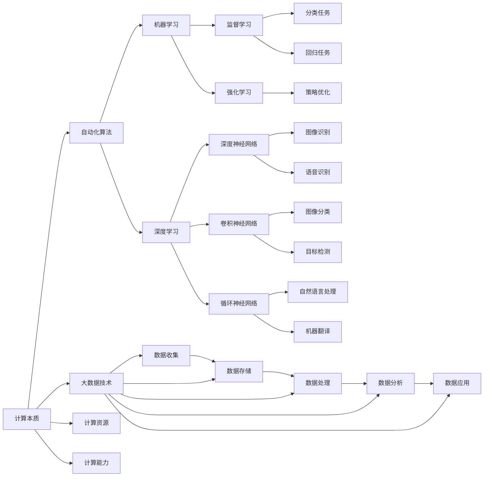
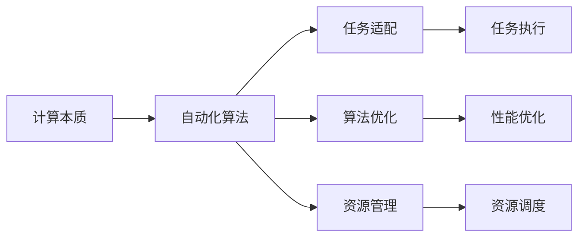
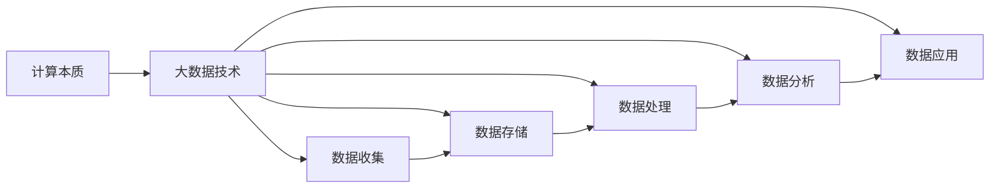
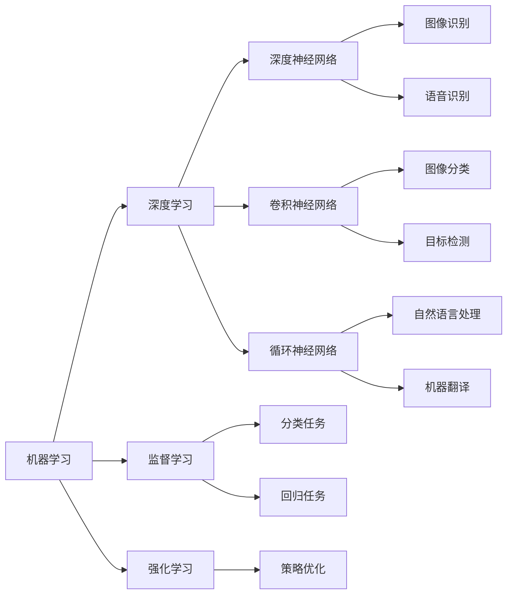
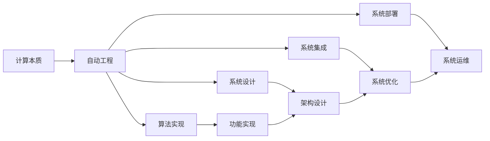

                 

# 计算的本质与自动化的未来

> 关键词：计算本质, 自动化发展, 人工智能, 自动化算法, 未来趋势, 大数据技术, 机器学习, 深度学习, 自动工程, 算法优化

## 1. 背景介绍

### 1.1 问题由来

自计算机诞生以来，计算的本质一直是计算机科学的核心议题。计算是信息技术的基础，是推动人类社会进步的重要引擎。随着计算机技术的不断发展，计算能力不断提高，计算方式也随之演变，从早期的串行计算到现在的并行计算、分布式计算、量子计算等。

在信息时代，计算与自动化已经深刻地改变了人们的生活方式。例如，智能家居、智能交通、智能制造等，都在逐步实现自动化和智能化。自动化的未来，一方面表现在计算能力的大幅提升，另一方面也在于自动化算法的不断优化，以更好地适应日益复杂多变的环境。

### 1.2 问题核心关键点

当前，计算的本质与自动化技术的未来发展，主要关注以下几个核心点：

1. **计算能力与自动化算法**：计算能力的大幅提升是实现自动化的基础，而自动化算法的优化则能够有效利用计算能力，提升自动化系统的性能。
2. **大数据技术的应用**：大数据技术的不断发展，为计算与自动化提供了更为丰富的数据基础，进一步推动了计算与自动化的进步。
3. **机器学习和深度学习**：作为现代人工智能的重要分支，机器学习和深度学习技术在计算与自动化中的应用，已经成为推动自动化发展的重要驱动力。
4. **算法优化与工程实现**：算法优化和工程实现是计算与自动化技术得以落地的关键，需要不断提升算法的效率和精确度，同时确保工程实现的可靠性和可维护性。
5. **未来趋势与挑战**：未来计算与自动化的发展趋势，以及面临的技术和伦理挑战，是推动这一领域前进的重要因素。

### 1.3 问题研究意义

研究计算的本质与自动化的未来发展，对于推动信息技术进步、促进经济社会发展具有重要意义：

1. **提升计算能力**：计算能力的大幅提升，将使更多领域实现智能化，提高生产效率和生活质量。
2. **优化自动化算法**：通过算法优化，自动化系统将更加高效、精准，提升企业和组织的竞争力。
3. **促进大数据应用**：大数据技术的广泛应用，将带来更为丰富的数据资源，促进计算与自动化技术的进步。
4. **推动人工智能发展**：机器学习和深度学习技术在计算与自动化中的应用，将推动人工智能技术的突破和应用。
5. **应对未来挑战**：通过前瞻性研究，提前了解计算与自动化技术可能面临的挑战，有助于制定应对策略，保障技术安全和社会稳定。

## 2. 核心概念与联系

### 2.1 核心概念概述

为更好地理解计算的本质与自动化的未来发展，本节将介绍几个密切相关的核心概念：

- **计算本质**：计算机的本质在于通过执行一系列操作，对数据进行处理和计算，实现智能推理和决策。
- **自动化算法**：自动化算法是指在计算机上运行的程序，能够自动地处理和分析数据，实现自动化操作和决策。
- **大数据技术**：大数据技术包括数据收集、存储、处理、分析和应用等多个环节，旨在从海量数据中提取有价值的信息。
- **机器学习**：机器学习是指通过数据训练模型，使模型能够自动地进行推理和决策，无需人工干预。
- **深度学习**：深度学习是一种基于神经网络的机器学习方法，通过多层次的非线性变换，实现对复杂数据的建模和分析。
- **自动工程**：自动工程是指将自动化算法和计算能力应用于实际工程中，实现自动化系统的设计和实现。

这些核心概念之间的逻辑关系可以通过以下Mermaid流程图来展示：



这个流程图展示了几类核心概念及其相互关系：

1. 计算本质决定了自动化算法的实现方式。
2. 大数据技术为计算提供了数据基础。
3. 机器学习和深度学习是自动化算法的重要组成部分。
4. 监督学习和强化学习是机器学习的主要方法。
5. 自动工程是将这些技术应用于实际工程的实践过程。

### 2.2 概念间的关系

这些核心概念之间存在着紧密的联系，形成了计算与自动化技术的完整生态系统。下面我们通过几个Mermaid流程图来展示这些概念之间的关系。

#### 2.2.1 计算本质与自动化算法



这个流程图展示了计算本质与自动化算法的联系：

1. 计算本质决定自动化算法的设计思路。
2. 自动化算法在计算基础上，通过任务适配、算法优化和资源管理，实现自动化操作。
3. 自动化算法的任务执行和资源调度，进一步提升计算效率和系统性能。

#### 2.2.2 大数据技术与计算本质



这个流程图展示了大数据技术与计算本质的联系：

1. 大数据技术为计算提供数据基础。
2. 数据收集、存储、处理和应用，是大数据技术的重要环节。
3. 数据处理和分析能够提升计算的效率和准确性。

#### 2.2.3 机器学习与深度学习



这个流程图展示了机器学习与深度学习的关系：

1. 机器学习是深度学习的基础。
2. 监督学习和强化学习是机器学习的两种主要方法。
3. 深度神经网络、卷积神经网络和循环神经网络是深度学习的主要架构。
4. 机器学习通过数据训练模型，实现对数据的自动分析和推理。

#### 2.2.4 自动工程与计算本质



这个流程图展示了自动工程与计算本质的关系：

1. 计算本质决定了自动工程的设计思路。
2. 自动工程通过算法实现、系统设计和系统集成，实现自动化系统的设计和实现。
3. 系统优化和运维是自动工程的重要环节，保障系统的稳定性和可靠性。

### 2.3 核心概念的整体架构

最后，我们用一个综合的流程图来展示这些核心概念在计算与自动化技术的整体架构：

```mermaid
graph LR
    A[大规模数据] --> B[大数据技术]
    B --> C[数据收集]
    B --> D[数据存储]
    B --> E[数据处理]
    B --> F[数据分析]
    B --> G[数据应用]
    C --> D --> E --> F --> G
    A --> H[计算资源]
    A --> I[计算能力]
    H --> J[计算基础设施]
    I --> K[高性能计算]
    J --> K
    K --> L[分布式计算]
    K --> M[云计算]
    K --> N[量子计算]
    L --> O[自动化算法]
    O --> P[任务适配]
    O --> Q[算法优化]
    O --> R[资源管理]
    P --> S[任务执行]
    Q --> T[性能优化]
    R --> U[资源调度]
    S --> V[系统部署]
    T --> V
    U --> V
    A --> W[机器学习]
    W --> X[监督学习]
    W --> Y[强化学习]
    W --> Z[深度学习]
    X --> AA[分类任务]
    X --> BB[回归任务]
    Y --> CC[策略优化]
    Z --> DD[深度神经网络]
    Z --> EE[卷积神经网络]
    Z --> FF[循环神经网络]
    AA --> WW
    BB --> WW
    CC --> WW
    DD --> WW
    EE --> WW
    FF --> WW
    W --> WW
    A --> X[深度学习]
    X --> Y[计算能力]
    Y --> Z[计算资源]
    Z --> AA[系统优化]
    AA --> BB[系统集成]
    BB --> CC[系统部署]
    CC --> DD[系统运维]
    DD --> EE[系统优化]
    EE --> FF[系统集成]
    FF --> GG[系统部署]
    GG --> HH[系统运维]
    HH --> II[系统优化]
    II --> JJ[系统集成]
    JJ --> KK[系统部署]
    KK --> LL[系统运维]
    LL --> MM[系统优化]
    MM --> NN[系统集成]
    NN --> oo[系统部署]
    oo --> pp[系统运维]
    pp --> qq[系统优化]
    qq --> rr[系统集成]
    rr --> ss[系统部署]
    ss --> tt[系统运维]
    tt --> uu[系统优化]
    uu --> vv[系统集成]
    vv --> ww[系统部署]
    ww --> xx[系统运维]
    xx --> yy[系统优化]
    yy --> zz[系统集成]
    zz --> Aa[系统部署]
    Aa --> Bb[系统运维]
    Bb --> Cc[系统优化]
    Cc --> Dd[系统集成]
    Dd --> Ee[系统部署]
    Ee --> Ff[系统运维]
    Ff --> Gg[系统优化]
    Gg --> Hh[系统集成]
    Hh --> Ii[系统部署]
    Ii --> Jj[系统运维]
    Jj --> Kk[系统优化]
    Kk --> Ll[系统集成]
    Ll --> Mm[系统部署]
    Mm --> Nn[系统运维]
    Nn --> Oo[系统优化]
    Oo --> Pp[系统集成]
    Pp --> Qq[系统部署]
    Qq --> Rr[系统运维]
    Rr --> Ss[系统优化]
    Ss --> Tt[系统集成]
    Tt --> Uu[系统部署]
    Uu --> Vv[系统运维]
    Vv --> Ww[系统优化]
    Ww --> Xx[系统集成]
    Xx --> Yy[系统部署]
    Yy --> Zz[系统运维]
    Zz --> Aa[系统优化]
    Aa --> Bb[系统集成]
    Bb --> Cc[系统部署]
    Cc --> Dd[系统运维]
    Dd --> Ee[系统优化]
    Ee --> Ff[系统集成]
    Ff --> Gg[系统部署]
    Gg --> Hh[系统运维]
    Hh --> Ii[系统优化]
    Ii --> Jj[系统集成]
    Jj --> Kk[系统部署]
    Kk --> Ll[系统运维]
    Ll --> Mm[系统优化]
    Mm --> Nn[系统集成]
    Nn --> oo[系统部署]
    oo --> pp[系统运维]
    pp --> qq[系统优化]
    qq --> rr[系统集成]
    rr --> ss[系统部署]
    ss --> tt[系统运维]
    tt --> uu[系统优化]
    uu --> vv[系统集成]
    vv --> ww[系统部署]
    ww --> xx[系统运维]
    xx --> yy[系统优化]
    yy --> zz[系统集成]
    zz --> Aa[系统部署]
    Aa --> Bb[系统运维]
    Bb --> Cc[系统优化]
    Cc --> Dd[系统集成]
    Dd --> Ee[系统部署]
    Ee --> Ff[系统运维]
    Ff --> Gg[系统优化]
    Gg --> Hh[系统集成]
    Hh --> Ii[系统部署]
    Ii --> Jj[系统运维]
    Jj --> Kk[系统优化]
    Kk --> Ll[系统集成]
    Ll --> Mm[系统部署]
    Mm --> Nn[系统运维]
    Nn --> Oo[系统优化]
    Oo --> Pp[系统集成]
    Pp --> Qq[系统部署]
    Qq --> Rr[系统运维]
    Rr --> Ss[系统优化]
    Ss --> Tt[系统集成]
    Tt --> Uu[系统部署]
    Uu --> Vv[系统运维]
    Vv --> Ww[系统优化]
    Ww --> Xx[系统集成]
    Xx --> Yy[系统部署]
    Yy --> Zz[系统运维]
    Zz --> Aa[系统优化]
    Aa --> Bb[系统集成]
    Bb --> Cc[系统部署]
    Cc --> Dd[系统运维]
    Dd --> Ee[系统优化]
    Ee --> Ff[系统集成]
    Ff --> Gg[系统部署]
    Gg --> Hh[系统运维]
    Hh --> Ii[系统优化]
    Ii --> Jj[系统集成]
    Jj --> Kk[系统部署]
    Kk --> Ll[系统运维]
    Ll --> Mm[系统优化]
    Mm --> Nn[系统集成]
    Nn --> oo[系统部署]
    oo --> pp[系统运维]
    pp --> qq[系统优化]
    qq --> rr[系统集成]
    rr --> ss[系统部署]
    ss --> tt[系统运维]
    tt --> uu[系统优化]
    uu --> vv[系统集成]
    vv --> ww[系统部署]
    ww --> xx[系统运维]
    xx --> yy[系统优化]
    yy --> zz[系统集成]
    zz --> Aa[系统部署]
    Aa --> Bb[系统运维]
    Bb --> Cc[系统优化]
    Cc --> Dd[系统集成]
    Dd --> Ee[系统部署]
    Ee --> Ff[系统运维]
    Ff --> Gg[系统优化]
    Gg --> Hh[系统集成]
    Hh --> Ii[系统部署]
    Ii --> Jj[系统运维]
    Jj --> Kk[系统优化]
    Kk --> Ll[系统集成]
    Ll --> Mm[系统部署]
    Mm --> Nn[系统运维]
    Nn --> Oo[系统优化]
    Oo --> Pp[系统集成]
    Pp --> Qq[系统部署]
    Qq --> Rr[系统运维]
    Rr --> Ss[系统优化]
    Ss --> Tt[系统集成]
    Tt --> Uu[系统部署]
    Uu --> Vv[系统运维]
    Vv --> Ww[系统优化]
    Ww --> Xx[系统集成]
    Xx --> Yy[系统部署]
    Yy --> Zz[系统运维]
    Zz --> Aa[系统优化]
    Aa --> Bb[系统集成]
    Bb --> Cc[系统部署]
    Cc --> Dd[系统运维]
    Dd --> Ee[系统优化]
    Ee --> Ff[系统集成]
    Ff --> Gg[系统部署]
    Gg --> Hh[系统运维]
    Hh --> Ii[系统优化]
    Ii --> Jj[系统集成]
    Jj --> Kk[系统部署]
    Kk --> Ll[系统运维]
    Ll --> Mm[系统优化]
    Mm --> Nn[系统集成]
    Nn --> oo[系统部署]
    oo --> pp[系统运维]
    pp --> qq[系统优化]
    qq --> rr[系统集成]
    rr --> ss[系统部署]
    ss --> tt[系统运维]
    tt --> uu[系统优化]
    uu --> vv[系统集成]
    vv --> ww[系统部署]
    ww --> xx[系统运维]
    xx --> yy[系统优化]
    yy --> zz[系统集成]
    zz --> Aa[系统部署]
    Aa --> Bb[系统运维]
    Bb --> Cc[系统优化]
    Cc --> Dd[系统集成]
    Dd --> Ee[系统部署]
    Ee --> Ff[系统运维]
    Ff --> Gg[系统优化]
    Gg --> Hh[系统集成]
    Hh --> Ii[系统部署]
    Ii --> Jj[系统运维]
    Jj --> Kk[系统优化]
    Kk --> Ll[系统集成]
    Ll --> Mm[系统部署]
    Mm --> Nn[系统运维]
    Nn --> Oo[系统优化]
    Oo --> Pp[系统集成]
    Pp --> Qq[系统部署]
    Qq --> Rr[系统运维]
    Rr --> Ss[系统优化]
    Ss --> Tt[系统集成]
    Tt --> Uu[系统部署]
    Uu --> Vv[系统运维]
    Vv --> Ww[系统优化]
    Ww --> Xx[系统集成]
    Xx --> Yy[系统部署]
    Yy --> Zz[系统运维]
    Zz --> Aa[系统优化]
    Aa --> Bb[系统集成]
    Bb --> Cc[系统部署]
    Cc --> Dd[系统运维]
    Dd --> Ee[系统优化]
    Ee --> Ff[系统集成]
    Ff --> Gg[系统部署]
    Gg --> Hh[系统运维]
    Hh --> Ii[系统优化]
    Ii --> Jj[系统集成]
    Jj --> Kk[系统部署]
    Kk --> Ll[系统运维]
    Ll --> Mm[系统优化]
    Mm --> Nn[系统集成]
    Nn --> oo[系统部署]
    oo --> pp[系统运维]
    pp --> qq[系统优化]
    qq --> rr[系统集成]
    rr --> ss[系统部署]
    ss --> tt[系统运维]
    tt --> uu[系统优化]
    uu --> vv[系统集成]
    vv --> ww[系统部署]
    ww --> xx[系统运维]
    xx --> yy[系统优化]
    yy --> zz[系统集成]
    zz --> Aa[系统部署]
    Aa --> Bb[系统运维]
    Bb --> Cc[系统优化]
    Cc --> Dd[系统集成]
    Dd --> Ee[系统部署]
    Ee --> Ff[系统运维]
    Ff --> Gg[系统优化]
    Gg --> Hh[系统集成]
    Hh --> Ii[系统部署]
    Ii --> Jj[系统运维]
    Jj --> Kk[系统优化]
    Kk --> Ll[系统集成]
    Ll --> Mm[系统部署]
    Mm --> Nn[系统运维]
    Nn --> Oo[系统优化]
    Oo --> Pp[系统集成]
    Pp --> Qq[系统部署]
    Qq --> Rr[系统运维]
    Rr --> Ss[系统优化]
    Ss --> Tt[系统集成]
    Tt --> Uu[系统部署]
    Uu --> Vv[系统运维]
    Vv --> Ww[系统优化]
    Ww --> Xx[系统集成]
    Xx --> Yy[系统部署]
    Yy --> Zz[系统运维]
    Zz --> Aa[系统优化]
    Aa --> Bb[系统集成]
    Bb --> Cc[系统部署]
    Cc --> Dd[系统运维]
    Dd --> Ee[系统优化]
    Ee --> Ff[系统集成]
    Ff --> Gg[系统部署]
    Gg --> Hh[系统运维]
    Hh --> Ii[系统优化]
    Ii --> Jj[系统集成]
    Jj --> Kk[系统部署]
    Kk --> Ll[系统运维]
    Ll --> Mm[系统优化]
    Mm --> Nn[系统集成]
    Nn --> oo[系统部署]
    oo --> pp[系统运维]
    pp --> qq[系统优化]
    qq --> rr[系统集成]
    rr --> ss[系统部署]
    ss --> tt[系统运维]
    tt --> uu[系统优化]
    uu --> vv[系统集成]
    vv --> ww[系统部署]
    ww --> xx[系统运维]
    xx --> yy[系统优化]
    yy --> zz[系统集成]
    zz --> Aa[系统部署]
    Aa --> Bb[系统运维]
    Bb --> Cc[系统优化]
    Cc --> Dd[系统集成]
    Dd --> Ee[系统部署]
    Ee --> Ff[系统运维]
    Ff --> Gg[系统优化]
    Gg --> Hh[系统集成]
    Hh --> Ii[系统部署]
    Ii --> Jj[系统运维]
    Jj --> Kk[系统优化]
    Kk --> Ll[系统集成]
    Ll --> Mm[系统部署]
    Mm --> Nn[系统运维]
    Nn --> Oo[系统优化]
    Oo --> Pp[系统集成]
    Pp --> Qq[系统部署]
    Qq --> Rr[系统运维]
    Rr --> Ss[系统优化]
    Ss --> Tt[系统集成]
    Tt --> Uu[系统部署]
    Uu --> Vv[系统运维]
    Vv --> Ww[系统优化]
    Ww --> Xx[系统集成]
    Xx --> Yy[系统部署]
    Yy --> Zz[系统运维]
    Zz --> Aa[系统优化]
    Aa --> Bb[系统集成]
    Bb --> Cc[系统部署]
    Cc --> Dd[系统运维]
    Dd --> Ee[系统优化]
    Ee --> Ff[系统集成]
    Ff --> Gg[系统部署]
    Gg --> Hh[系统运维]
    Hh --> Ii[系统优化]
    Ii --> Jj[系统集成]
    Jj --> Kk[系统部署]
    Kk --> Ll[系统运维]
    Ll --> Mm[系统优化]
    Mm --> Nn[系统集成]
    Nn --> oo[系统部署]
    oo --> pp[系统运维]
    pp --> qq[系统优化]
    qq --> rr[系统集成]
    rr --> ss[系统部署]
    ss --> tt[系统运维]
    tt --> uu[系统优化]
    uu --> vv[系统集成]
    vv --> ww[系统部署]
    ww --> xx[系统运维]
    xx --> yy[系统优化]
    yy --> zz[系统集成]
    zz --> Aa[系统部署]
    Aa --> Bb[系统运维]
    Bb --> Cc[系统优化]
    Cc --> Dd[系统集成]
    Dd --> Ee[系统部署]
    Ee --> Ff[系统运维]
    Ff --> Gg[系统优化]
    Gg --> Hh[系统集成]
    Hh --> Ii[系统部署]
    Ii --> Jj[系统运维]
    Jj --> Kk[系统优化]
    Kk --> Ll[系统集成]
    Ll --> Mm[系统部署]
    Mm --> Nn[系统运维]
    Nn --> Oo[系统优化]
    Oo --> Pp[系统集成]
    Pp --> Qq[系统部署]
    Qq --> Rr[系统运维]
    Rr --> Ss[系统优化]
    Ss --> Tt[系统集成]
    Tt --> Uu[系统部署]
    Uu --> Vv[系统运维]
    Vv --> Ww[系统优化]
    Ww --> Xx[系统集成]
    Xx --> Yy[系统部署]
    Yy --> Zz[系统运维]
    Zz --> Aa[系统优化]
    Aa --> Bb[系统集成]
    Bb --> Cc[系统部署]
    Cc --> Dd[系统运维]
    Dd --> Ee[系统优化]
    Ee --> Ff[系统集成]
    Ff --> Gg[系统部署]
    Gg -->

