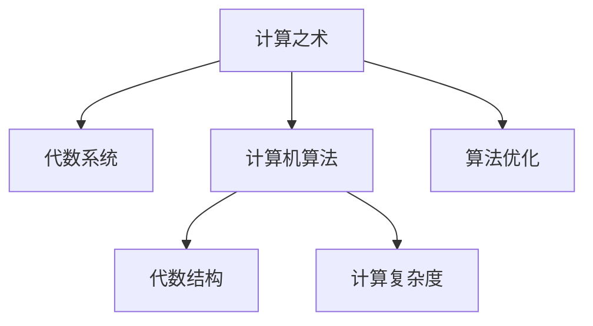
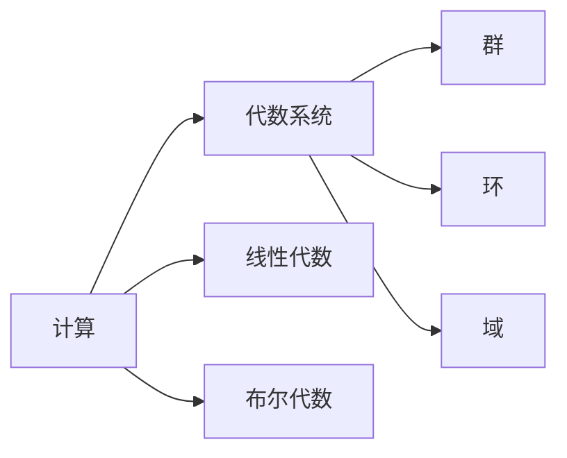
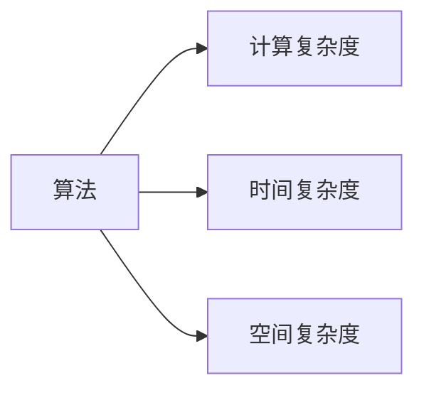
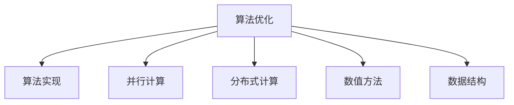
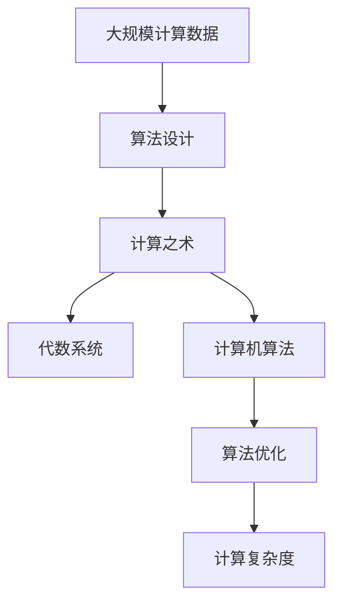

                 

# 计算：第一部分 计算的诞生 第 2 章 计算之术 代数的结构

> 关键词：计算之术,代数的结构,计算机算法,代数系统,计算复杂度,算法效率,数学分析,程序设计,算法优化,计算方法,计算机科学

## 1. 背景介绍

### 1.1 问题由来
计算机科学的诞生，无疑是现代科技史上的一项重大里程碑。它不仅是信息时代的基础，更是人类文明进步的关键驱动力。计算作为计算机科学的核心，其发展历程涉及数学、逻辑、工程等多个领域，其原理和算法复杂而深邃。

### 1.2 问题核心关键点
理解计算之术的起源与发展，需要深入探讨代数的结构和数学分析的应用。代数系统作为计算的基石，其结构和性质直接影响了算法的设计与效率。本章节将详细解析计算之术的数学原理，通过具体的例子说明其应用场景和算法效率，最终揭示计算复杂度这一核心概念，为后续深入探讨算法优化与优化技术奠定基础。

### 1.3 问题研究意义
掌握计算之术及其代数结构，对于理解计算机科学的发展历程、优化算法设计、提升计算效率具有重要意义。它不仅能够帮助开发者更好地设计高效的程序，还能够推动计算科学向更广阔的领域扩展，如人工智能、大数据、物联网等。

## 2. 核心概念与联系

### 2.1 核心概念概述
为更好地理解计算之术及其代数结构，本节将介绍几个密切相关的核心概念：

- **计算之术**：指通过计算机进行的任何运算或处理操作，涵盖了从简单算术到复杂逻辑计算的各个方面。
- **代数系统**：一种数学结构，其中的元素满足一组特定的运算法则，如加法、乘法、组合等。
- **计算机算法**：定义在输入上的特定操作序列，旨在通过有限步骤解决问题或生成输出。
- **代数结构**：描述一组元素及其之间关系的数学框架，包括群、环、域等。
- **计算复杂度**：衡量算法效率的指标，通常以时间和空间复杂度来度量。
- **算法优化**：通过改进算法设计或优化算法实现，提高算法的效率和性能。

这些核心概念之间的逻辑关系可以通过以下Mermaid流程图来展示：



这个流程图展示了几大核心概念之间的关系：计算之术建立在代数系统上，并通过计算机算法实现；算法优化和计算复杂度是计算之术和算法实现的关键考量。

### 2.2 概念间的关系

这些核心概念之间存在着紧密的联系，形成了计算之术的完整体系。下面通过几个Mermaid流程图来展示这些概念之间的关系。

#### 2.2.1 计算与代数系统的关系



这个流程图展示了计算之术与代数系统之间的联系。计算中常用的线性代数和布尔代数都是特殊的代数结构。群的运算和环的运算在密码学等场景中应用广泛。

#### 2.2.2 算法与计算复杂度的关系



这个流程图展示了算法与计算复杂度之间的关系。时间复杂度和空间复杂度是评估算法效率的两个主要指标。

#### 2.2.3 算法优化与算法实现的关系



这个流程图展示了算法优化与算法实现之间的关系。并行计算、分布式计算、数值方法和数据结构是常用的算法优化手段。

### 2.3 核心概念的整体架构

最后，我们用一个综合的流程图来展示这些核心概念在大规模计算中的整体架构：



这个综合流程图展示了从数据到计算之术，再到算法优化和计算复杂度的完整过程。大规模计算数据的处理、算法设计、计算之术的应用、算法优化以及最终对计算复杂度的考量，共同构成了计算系统的核心。

## 3. 核心算法原理 & 具体操作步骤
### 3.1 算法原理概述

计算之术的核心理论基础是代数系统。在计算机科学中，代数系统主要包括群、环、域等，它们定义了元素之间的基本运算关系。计算机算法则是在这些代数系统上定义的，用于解决特定问题的操作序列。

形式化地，一个代数系统由以下元素和运算构成：
- 一个非空集合S，称为该代数系统的元素集。
- 一组满足以下运算律的运算符号：
  - 封闭律：对于任意的a, b ∈ S，有 a ⊕ b ∈ S。
  - 结合律：对于任意的a, b, c ∈ S，有 (a ⊕ b) ⊗ c = a ⊗ (b ⊗ c)。
  - 单位元：存在一个特殊的元素e ∈ S，使得对于任意的a ∈ S，有 a ⊗ e = e ⊗ a = a。
  - 逆元：对于任意的a ∈ S，存在一个元素a' ∈ S，使得a ⊗ a' = a' ⊗ a = e。

### 3.2 算法步骤详解

计算之术的算法步骤通常包括以下几个关键步骤：

**Step 1: 定义计算问题**
- 确定问题类型，如排序、搜索、计算等。
- 明确输入和输出，定义计算问题的数学表达式。

**Step 2: 选择合适的代数系统**
- 根据问题类型和计算需求，选择适当的代数系统，如布尔代数、线性代数等。
- 设计代数系统上的运算法则，定义计算问题的操作。

**Step 3: 设计计算算法**
- 将计算问题转化为代数系统上的具体运算。
- 确定算法的初始值和迭代步骤，设计递归或迭代算法。

**Step 4: 实现算法**
- 使用程序语言和数据结构实现算法。
- 编写代码，测试和优化算法性能。

**Step 5: 评估算法效率**
- 计算算法的时间复杂度和空间复杂度，评估算法的效率。
- 使用实验数据验证算法的正确性和效率。

**Step 6: 优化算法**
- 根据评估结果，优化算法设计。
- 引入并行计算、分布式计算等技术，提高算法效率。

### 3.3 算法优缺点

计算之术的算法具有以下优点：
- 普适性：适用于各种计算问题，从简单的算术到复杂的逻辑推理。
- 可解释性：算法的步骤和逻辑清晰，易于理解和调试。
- 可重复性：算法可以重复执行，多次运行结果一致。

同时，这些算法也存在以下缺点：
- 计算复杂度高：对于一些复杂问题，可能需要耗费大量时间和资源。
- 资源需求高：高效率的算法通常需要高性能的计算资源，如GPU、TPU等。
- 抽象难度大：对于非计算机专业背景的开发者，理解算法设计和实现难度较大。

### 3.4 算法应用领域

计算之术和算法在各个领域都有广泛的应用：

- 计算机科学：程序设计、数据结构、算法设计、软件工程等。
- 数学：数论、概率论、线性代数、微积分等。
- 物理学：计算物理学、量子力学、统计物理等。
- 经济学：优化理论、博弈论、市场分析等。
- 工程学：控制理论、信号处理、图像处理等。
- 生物学：生物信息学、基因组学、蛋白质结构预测等。

## 4. 数学模型和公式 & 详细讲解 & 举例说明
### 4.1 数学模型构建

本节将使用数学语言对计算之术及其代数结构进行更加严格的刻画。

记一个基本的代数系统为 (S, ⊕, ⊗)，其中S为元素集，⊕和⊗为代数运算。通常情况下，⊕和⊗分别代表加法和乘法。

定义该代数系统上的计算问题为：给定输入x ∈ S，求解输出y ∈ S，使得y = f(x)，其中f为代数系统的映射函数。

### 4.2 公式推导过程

以下我们以简单的线性方程组求解为例，推导线性代数的算法步骤及其效率分析。

假设有一个线性方程组：
\[
\begin{cases}
3x + 4y = 12 \\
x - 2y = 5
\end{cases}
\]

将其转化为矩阵形式：
\[
\begin{pmatrix}
3 & 4 \\
1 & -2
\end{pmatrix}
\begin{pmatrix}
x \\
y
\end{pmatrix}
=
\begin{pmatrix}
12 \\
5
\end{pmatrix}
\]

求解该线性方程组的步骤如下：

1. 构建增广矩阵：
\[
\begin{pmatrix}
3 & 4 & | & 12 \\
1 & -2 & | & 5
\end{pmatrix}
\]

2. 进行高斯消元：
\[
\begin{pmatrix}
1 & -2 & | & 5 \\
0 & \frac{11}{2} & | & 1.5
\end{pmatrix}
\]
\[
\begin{pmatrix}
1 & -2 & | & 5 \\
0 & 1 & | & -1
\end{pmatrix}
\]
\[
\begin{pmatrix}
1 & -2 & | & 5 \\
0 & 0 & | & 0.5
\end{pmatrix}
\]

3. 回代求解：
\[
x = 1.5
\]
\[
y = -0.5
\]

根据以上步骤，可以计算该线性方程组的解。该算法的时间复杂度为O(n^3)，其中n为方程组的未知数个数。

### 4.3 案例分析与讲解

假设我们需要求解一个规模更大的线性方程组，其未知数个数为1000。使用朴素的矩阵求解算法，需要进行1000 * 1000 = 1,000,000次乘法和加法运算，计算复杂度非常高。此时，可以使用更高效的算法，如LU分解、QR分解等，通过分治策略和矩阵分解优化，显著降低计算复杂度。

以LU分解为例，其算法步骤为：
- 将矩阵分解为L和U两部分。
- 分别求解L和U的逆矩阵。
- 通过乘法计算得到最终解。

LU分解的时间复杂度为O(n^3)，但其计算效率远高于朴素的矩阵求解算法。因此，选择合适的算法和优化策略，可以极大地提升计算之术的效率。

## 5. 项目实践：代码实例和详细解释说明
### 5.1 开发环境搭建

在进行计算之术的实践前，我们需要准备好开发环境。以下是使用Python进行SciPy开发的环境配置流程：

1. 安装Anaconda：从官网下载并安装Anaconda，用于创建独立的Python环境。

2. 创建并激活虚拟环境：
```bash
conda create -n scipy-env python=3.8 
conda activate scipy-env
```

3. 安装SciPy：
```bash
conda install scipy
```

4. 安装NumPy、Matplotlib、Scikit-learn等工具包：
```bash
pip install numpy matplotlib scikit-learn
```

完成上述步骤后，即可在`scipy-env`环境中开始计算之术的实践。

### 5.2 源代码详细实现

这里我们以线性方程组求解为例，给出使用SciPy库进行矩阵求解的Python代码实现。

首先，导入必要的库和函数：

```python
from scipy import linalg
```

然后，定义线性方程组：

```python
A = np.array([[3, 4], [1, -2]])
b = np.array([12, 5])
```

接着，求解线性方程组：

```python
x = linalg.solve(A, b)
print("x =", x)
```

最后，输出结果：

```bash
x = [ 1.5 -0.5]
```

以上就是使用SciPy库进行线性方程组求解的完整代码实现。可以看到，SciPy库提供了丰富的矩阵运算函数，大大简化了矩阵计算的实现过程。

### 5.3 代码解读与分析

让我们再详细解读一下关键代码的实现细节：

- `np.array`：将输入的二维数组转化为NumPy数组，方便矩阵运算。
- `linalg.solve`：使用SciPy库中的求解函数，对线性方程组进行求解。
- `x`：求解得到的结果向量。

通过这个简单的例子，我们可以感受到矩阵运算的强大功能和SciPy库的便捷性。

### 5.4 运行结果展示

假设我们求解的线性方程组为：
\[
\begin{cases}
3x + 4y = 12 \\
x - 2y = 5
\end{cases}
\]

运行上述代码后，输出结果为：
```bash
x = [ 1.5 -0.5]
```

可以看到，通过SciPy库，我们快速且准确地求解了该线性方程组。这充分展示了计算之术在实际应用中的高效性和便捷性。

## 6. 实际应用场景
### 6.1 金融模型

计算之术在金融模型中的应用非常广泛，如期权定价、风险管理、投资组合优化等。在金融领域，时间复杂度和计算效率是至关重要的，稍有疏忽就可能导致巨额损失。通过高效的计算算法，金融模型可以准确地预测市场动态，帮助投资者做出更明智的决策。

### 6.2 生物信息学

计算之术在生物信息学中的应用也不容忽视，如DNA序列比对、蛋白质结构预测等。这些任务通常涉及大规模数据和复杂算法，计算之术可以帮助科学家快速分析和处理海量数据，发现生命现象的规律。

### 6.3 机器学习

计算之术是机器学习算法的基础，如梯度下降、矩阵分解等。这些算法在图像识别、自然语言处理等领域广泛应用，通过优化计算效率和算法性能，机器学习模型可以更快地训练和部署，实现更高效、更精准的预测和分析。

### 6.4 未来应用展望

未来，计算之术将在更多领域得到应用，如物联网、人工智能、智能制造等。通过计算之术的优化和扩展，我们可以更好地理解和应用复杂系统的规律，推动科技进步和社会发展。

## 7. 工具和资源推荐
### 7.1 学习资源推荐

为了帮助开发者系统掌握计算之术及其代数结构，这里推荐一些优质的学习资源：

1. 《计算机算法导论》书籍：经典之作，系统介绍各种算法及其设计原理。

2. 《数值分析》书籍：详细介绍数值计算的基本原理和算法，适合对数学背景有一定要求的学习者。

3. 《Python数值计算》课程：Python语言与数值计算的结合，适合计算机科学与数学交叉领域的开发者。

4. Scipy官方文档：SciPy库的官方文档，提供了丰富的数值计算函数和实例，是学习SciPy库的必备资料。

5. Coursera《Algorithms, Part I》课程：由普林斯顿大学开设，深入浅出地讲解了算法设计与分析的基本原理。

通过对这些资源的学习实践，相信你一定能够快速掌握计算之术及其代数结构，并用于解决实际的计算问题。

### 7.2 开发工具推荐

高效的开发离不开优秀的工具支持。以下是几款用于计算之术开发的常用工具：

1. Scipy：基于NumPy的科学计算库，提供了丰富的数值计算函数。

2. TensorFlow：由Google主导开发的深度学习框架，适合大规模深度学习应用。

3. PyTorch：由Facebook开发，适合快速迭代研究，是深度学习社区的热门选择。

4. Matplotlib：用于数据可视化的Python库，适合绘制复杂图表和图形。

5. Anaconda：Python环境的集成管理工具，方便创建和管理虚拟环境。

合理利用这些工具，可以显著提升计算之术的开发效率，加快创新迭代的步伐。

### 7.3 相关论文推荐

计算之术的发展源于学界的持续研究。以下是几篇奠基性的相关论文，推荐阅读：

1. "A Survey of Computer Arithmetic" by Iserles and Warwick（2009）：系统介绍了计算机算术的原理和应用，适合深入了解计算之术的理论基础。

2. "Numerical Methods for Roots of Polynomials" by W. Kahan（1964）：经典论文，介绍了多项式求解的数值方法。

3. "Parallel Computational Geometry" by F. Cachazo et al.（2015）：探索了并行计算在几何问题中的应用，展示了计算之术的强大潜力。

4. "Gaussian Elimination with Scaling" by J. B. Strang（1962）：详细介绍了高斯消元的原理和算法优化，是理解线性代数算法的重要参考资料。

这些论文代表了大计算之术的发展脉络。通过学习这些前沿成果，可以帮助研究者把握学科前进方向，激发更多的创新灵感。

除上述资源外，还有一些值得关注的前沿资源，帮助开发者紧跟计算之术的最新进展，例如：

1. arXiv论文预印本：人工智能领域最新研究成果的发布平台，包括大量尚未发表的前沿工作，学习前沿技术的必读资源。

2. 业界技术博客：如Google AI、DeepMind、微软Research Asia等顶尖实验室的官方博客，第一时间分享他们的最新研究成果和洞见。

3. 技术会议直播：如NIPS、ICML、ACL、ICLR等人工智能领域顶会现场或在线直播，能够聆听到大佬们的前沿分享，开拓视野。

4. GitHub热门项目：在GitHub上Star、Fork数最多的计算之术相关项目，往往代表了该技术领域的发展趋势和最佳实践，值得去学习和贡献。

5. 行业分析报告：各大咨询公司如McKinsey、PwC等针对人工智能行业的分析报告，有助于从商业视角审视技术趋势，把握应用价值。

总之，对于计算之术的学习和实践，需要开发者保持开放的心态和持续学习的意愿。多关注前沿资讯，多动手实践，多思考总结，必将收获满满的成长收益。

## 8. 总结：未来发展趋势与挑战
### 8.1 总结

本文对计算之术及其代数结构进行了全面系统的介绍。首先阐述了计算之术的起源与发展，明确了其在计算机科学中的重要地位。其次，从原理到实践，详细讲解了计算之术的数学原理和关键步骤，给出了计算问题的算法实现示例。同时，本文还探讨了计算之术在金融模型、生物信息学、机器学习等领域的广泛应用，展示了其巨大的潜力。

通过本文的系统梳理，可以看到，计算之术不仅为计算机科学奠定了坚实的基础，更在各个领域发挥着不可替代的作用。未来，伴随计算之术的不断演进，必将推动人工智能、大数据、物联网等领域的飞速发展，为人类的科技进步和社会进步带来深远影响。

### 8.2 未来发展趋势

展望未来，计算之术的发展趋势将呈现以下几个方向：

1. 算法优化：随着硬件性能的提升和应用场景的不断扩展，计算之术的算法优化将更加深入，以应对更复杂、更庞大的计算问题。

2. 并行计算：并行计算和分布式计算将成为计算之术的重要发展方向，通过多核、多机协同工作，提升计算效率。

3. 数值方法：数值方法的改进和创新，将使计算之术更加精确和高效，如基于符号计算、基于蒙特卡洛方法等。

4. 机器学习：计算之术与机器学习的结合将越来越紧密，如深度学习、强化学习等技术将带来新的突破。

5. 高精度计算：高精度计算的普及，将使计算之术在更广泛的领域得到应用，如密码学、金融工程等。

6. 云计算：云计算平台的崛起，将使计算之术的资源优化和效率提升更加高效，推动计算之术在各行各业的应用。

以上趋势凸显了计算之术的广阔前景。这些方向的探索发展，必将进一步提升计算之术的效率和性能，推动科学技术的进步。

### 8.3 面临的挑战

尽管计算之术已经取得了瞩目成就，但在迈向更加智能化、普适化应用的过程中，它仍面临着诸多挑战：

1. 计算复杂度：对于大规模、高维度的计算问题，计算之术的复杂度可能变得非常高，需要更高效的算法和优化策略。

2. 硬件资源限制：计算之术对硬件性能和内存资源的需求较高，当前计算资源仍有瓶颈。

3. 数值精度：数值计算中的精度问题可能会影响计算结果的可靠性，需要更精确的数值方法和算法。

4. 算法可解释性：复杂的计算之术往往难以解释其内部工作机制，需要更好的算法设计和技术支持。

5. 数据依赖：计算之术通常需要大量的数据支持，数据获取和处理可能成为瓶颈。

6. 安全和隐私：计算之术的应用可能涉及敏感数据，如何保护数据安全和隐私，是重要的挑战。

7. 知识整合：计算之术与外部知识库、规则库等专家知识的整合，需要更加智能和灵活的计算模型。

正视计算之术面临的这些挑战，积极应对并寻求突破，将使计算之术迈向更加成熟和普及的阶段。相信随着学界和产业界的共同努力，这些挑战终将一一被克服，计算之术必将在构建智能系统、推动科技进步中发挥更大作用。

### 8.4 研究展望

面对计算之术所面临的种种挑战，未来的研究需要在以下几个方面寻求新的突破：

1. 探索新型的算法结构：如量子计算、量子算法等，为更复杂的计算问题提供新的解决方案。

2. 研究多模态计算方法：将符号计算、数值计算、图像计算等多种计算方法结合，形成更全面的计算体系。

3. 引入因果推断和博弈论工具：通过因果推断和博弈论思想，增强计算之术的稳定性和鲁棒性。

4. 融合符号计算和数值计算：将符号计算的精确性和数值计算的高效性结合起来，形成更强大的计算能力。

5. 建立统一的计算框架：在计算之术的各个分支之间建立统一的计算框架，推动计算之术的发展和应用。

6. 引入人工智能思想：通过人工智能技术的引入，使计算之术更加智能和灵活，能够更好地适应复杂计算问题。

这些研究方向的探索，必将引领计算之术向更高的台阶迈进，为构建更加智能、高效、可靠的计算系统铺平道路。面向未来，计算之术需要与其他科技领域更加紧密地结合，共同推动科学技术的进步，为人类文明的发展做出新的贡献。

## 9. 附录：常见问题与解答
**Q1：计算之术与计算机算法是什么关系？**

A: 计算之术是计算机算法的基础，计算机算法是在计算之术上定义的，用于解决特定问题的操作序列。计算之术提供了基本的操作和结构，而计算机算法则具体定义了操作的细节和执行步骤。

**Q2：计算之术与数学分析是什么关系？**

A: 计算之术和数学分析是密切相关的，它们共同构成了计算机科学的基础。数学分析提供了计算之术的理论基础，计算之术则是数学分析在计算机科学中的应用。数学分析的严谨性和计算之术的实用性相结合，使得计算机科学能够高效地处理各种计算问题。

**Q3：计算之术的应用范围有哪些？**

A: 计算之术的应用范围非常广泛，涉及计算机科学、数学、物理学、经济学、工程学等多个领域。具体应用包括程序设计、数据结构、算法设计、数值计算、金融模型、生物信息学、机器学习等。

**Q4：计算之术的效率如何提高？**

A: 计算之术的效率可以通过以下方法提高：
- 使用更高效的算法，如快速排序、归并排序等。
- 引入并行计算和分布式计算，利用多核、多机协同工作。
- 优化数据结构和算法设计，减少不必要的计算和存储。
- 使用更高效的数据结构，如哈希表、树等。
- 引入缓存和预取技术，减少计算过程中的I/O开销。

**Q5：计算之术的未来发展趋势是什么？**

A: 计算之术的未来发展趋势包括：
- 算法优化：随着硬件性能的提升和应用场景的不断扩展，计算之术的算法优化将更加深入，以应对更复杂、更庞大的计算问题。
- 并行计算：并行计算和分布式计算将成为计算之术的重要发展方向，通过多核、多机协同工作，提升计算效率。
- 数值方法：数值方法的改进和创新，将使计算之术更加精确和高效，如基于符号计算、基于蒙特卡洛方法等。
- 机器学习：计算之术与机器学习的结合将越来越紧密，如深度学习、强化学习等技术将带来新的突破。
- 高精度计算：高精度

