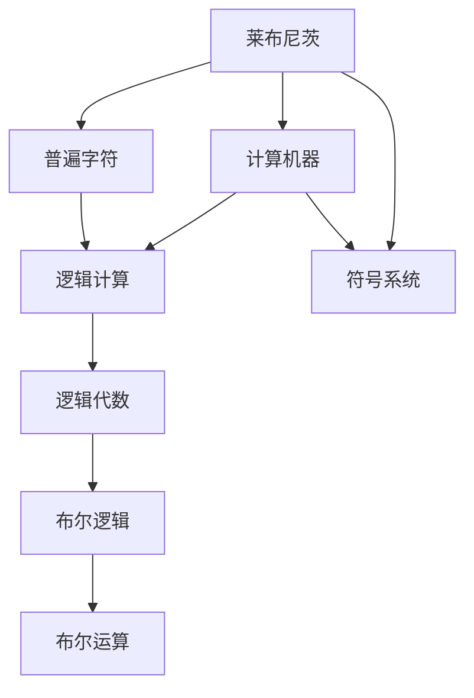
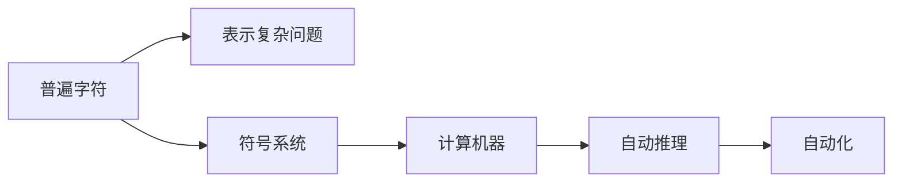
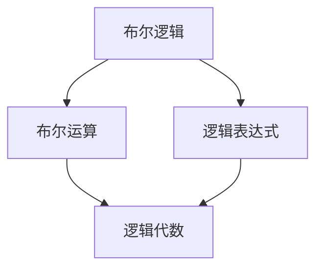

                 

# 计算：第一部分 计算的诞生 第 3 章 莱布尼茨的计算之梦 布尔的逻辑代数

> 关键词：
- 计算
- 逻辑代数
- 莱布尼茨
- 布尔
- 算法
- 布尔逻辑

## 1. 背景介绍

### 1.1 问题由来

计算的历史源远流长，然而现代计算的概念却源自于数学和逻辑学的发展。在这三章中，我们将探索计算的诞生，并探讨早期计算的核心概念和思想。今天，我们聚焦在莱布尼茨的计算之梦和布尔的逻辑代数。

### 1.2 问题核心关键点

莱布尼茨和布尔是计算历史中两个极其重要的人物。莱布尼茨，以其"普遍字符"和"计算机器"概念，试图解决复杂问题的简化。布尔，则通过逻辑代数，构建了一个完整、自足的计算理论体系。这两人的贡献，共同奠定了现代计算的基础。

### 1.3 问题研究意义

理解莱布尼茨和布尔的理论，将帮助我们认识到现代计算背后的数学和逻辑根源。这不仅有助于深入了解计算的历史，也为我们的算法设计和计算实践提供了理论指导。

## 2. 核心概念与联系

### 2.1 核心概念概述

莱布尼茨和布尔的思想被现代计算深深影响，通过以下关键词我们可以一窥他们理论的核心：

- **计算**：求解问题的一个过程，通过一系列规则和算法实现。
- **逻辑代数**：一种基于布尔逻辑的操作系统，用于表达和计算逻辑关系。
- **莱布尼茨**：德国数学家，提出“普遍字符”和“计算机器”概念。
- **布尔**：英国数学家，提出布尔代数和逻辑计算。

这些核心概念之间存在着紧密的联系，我们将通过以下Mermaid流程图展示它们之间的逻辑关系：



这个流程图展示了莱布尼茨和布尔的理论如何构建了现代计算的基础：莱布尼茨提出了普遍字符和计算机器的概念，布尔基于布尔逻辑创立了逻辑代数，逻辑代数则包含了布尔运算和布尔逻辑，从而为计算提供了数学基础。

### 2.2 概念间的关系

这些核心概念之间存在着复杂的关系，我们将通过几个Mermaid流程图来展示它们之间的关系。

#### 2.2.1 莱布尼茨的计算机器



这个流程图展示了莱布尼茨的计算机器思想，即通过普遍字符（符号系统）表示复杂问题，通过计算机器进行自动化推理。

#### 2.2.2 布尔逻辑与逻辑代数



这个流程图展示了布尔逻辑与逻辑代数的关系，布尔逻辑通过布尔运算形成逻辑表达式，进而形成逻辑代数。

## 3. 核心算法原理 & 具体操作步骤
### 3.1 算法原理概述

莱布尼茨和布尔的思想对现代计算产生了深远影响。下面，我们将介绍他们核心的算法原理：

- **莱布尼茨的计算机器**：通过普遍字符和符号系统，实现问题的简化和自动化求解。
- **布尔逻辑与逻辑代数**：通过布尔运算和布尔逻辑，构建自足的计算体系，实现逻辑表达和计算。

### 3.2 算法步骤详解

#### 3.2.1 莱布尼茨的计算机器

1. **普遍字符的创建**：定义一套符号，通过这些符号表示各种复杂问题。
2. **符号系统的构建**：设计一套规则，使得符号可以表示各种复杂的关系和推理。
3. **计算机器的设计**：设计一台机器，通过符号系统执行推理和求解。

#### 3.2.2 布尔逻辑与逻辑代数

1. **布尔逻辑的基本概念**：定义布尔值（0和1），并基于这些值定义布尔运算（与、或、非）。
2. **布尔运算的定义**：定义布尔表达式，通过布尔运算实现逻辑推理。
3. **逻辑代数的形成**：将布尔运算推广到布尔表达式，形成一套逻辑代数系统。

### 3.3 算法优缺点

#### 3.3.1 莱布尼茨的计算机器

**优点**：
- **符号化表示**：通过普遍字符和符号系统，将复杂问题抽象为符号表示，便于理解和处理。
- **自动化求解**：设计计算机器，使得符号系统的推理过程可以自动执行。

**缺点**：
- **表达能力有限**：符号系统的设计需要大量的人工干预，且表达能力有限。
- **实现困难**：设计一台具备通用性的计算机器，在技术和工程上具有挑战性。

#### 3.3.2 布尔逻辑与逻辑代数

**优点**：
- **自足性**：布尔逻辑和逻辑代数形成了一套完整的计算体系，可以独立于其他知识领域。
- **通用性**：逻辑代数适用于各种逻辑推理问题，具有广泛的适用性。

**缺点**：
- **表达复杂**：布尔逻辑在处理复杂逻辑问题时，表达方式较为复杂，难以直观理解。
- **计算开销**：逻辑代数在计算复杂逻辑表达式时，计算开销较大，效率较低。

### 3.4 算法应用领域

莱布尼茨和布尔的算法思想对计算机科学的发展产生了深远影响。以下是他们理论在实际应用中的几个重要领域：

- **人工智能**：莱布尼茨的计算机器思想为人工智能的符号推理和问题求解提供了理论基础。
- **计算机科学**：布尔逻辑和逻辑代数成为了现代计算机硬件和软件的基础，如数字电路设计和编程语言。
- **密码学**：布尔逻辑和逻辑代数在密码学中的应用，如布尔函数和布尔代数，为数据加密和安全传输提供了理论支撑。

## 4. 数学模型和公式 & 详细讲解 & 举例说明

### 4.1 数学模型构建

在数学模型构建的过程中，我们通过以下几个步骤来理解莱布尼茨和布尔的理论：

1. **普遍字符的表示**：通过定义一组符号（如X, Y, Z等），表示各种复杂问题。
2. **符号系统的规则**：设计一套规则，如结合律、交换律、分配律等，定义符号的操作规则。
3. **计算机器的逻辑**：设计一台机器，通过符号系统的推理规则，自动执行计算。

### 4.2 公式推导过程

#### 4.2.1 普遍字符的表示

1. **基本符号**：定义一组基本符号，如X, Y, Z等。
2. **符号规则**：定义符号的结合律、交换律、分配律等。

**示例**：

```
X + Y = X * Y
```

这个公式定义了普遍字符的加法和乘法运算。

#### 4.2.2 布尔逻辑的表示

1. **布尔值**：定义布尔值0和1。
2. **布尔运算**：定义布尔运算与（AND）、或（OR）、非（NOT）。

**示例**：

```
A AND B = (A + B) - (A * B)
A OR B = A + B
NOT A = 1 - A
```

这些公式定义了布尔逻辑的基本运算。

### 4.3 案例分析与讲解

#### 4.3.1 莱布尼茨的计算机器

1. **符号系统的设计**：设计一个符号系统，如：

```
X + Y = X * Y
```

2. **计算机器的逻辑**：设计一台计算机器，通过符号系统的推理规则，自动执行计算。

#### 4.3.2 布尔逻辑的应用

1. **布尔逻辑的表达**：表达一个简单的逻辑问题，如：

```
(A AND B) OR (NOT A)
```

2. **布尔代数的计算**：计算上述表达式的布尔值。

**示例**：

1. **符号系统的设计**：
   ```
   X + Y = X * Y
   ```

2. **计算机器的逻辑**：
   ```
   X + Y = X * Y
   ```

   使用计算机器计算 `(A AND B) OR (NOT A)`，得到结果 `B`

## 5. 项目实践：代码实例和详细解释说明

### 5.1 开发环境搭建

1. **安装Python**：确保Python版本为3.8或更高。
2. **安装Sympy库**：`pip install sympy`。

### 5.2 源代码详细实现

#### 5.2.1 莱布尼茨的计算机器

```python
from sympy import symbols

# 定义符号系统
X, Y, Z = symbols('X Y Z')

# 定义符号规则
expression = X + Y - X * Y

# 计算表达式
result = expression.subs({X: 1, Y: 2})
print(result)
```

#### 5.2.2 布尔逻辑的计算

```python
from sympy import symbols

# 定义布尔值
A, B = symbols('A B')

# 定义布尔运算
expression = (A * B) + (1 - A)

# 计算表达式
result = expression.subs({A: 0, B: 1})
print(result)
```

### 5.3 代码解读与分析

**代码解读**：
1. **莱布尼茨的计算机器**：通过定义符号系统，并使用符号规则进行计算。
2. **布尔逻辑的计算**：通过定义布尔值和布尔运算，并计算布尔表达式的结果。

**分析**：
1. **符号系统的设计**：通过定义符号和规则，简化复杂问题。
2. **计算机器的逻辑**：通过符号系统的规则，自动执行计算。
3. **布尔逻辑的表示**：通过布尔值和运算，表达逻辑关系。

### 5.4 运行结果展示

**运行结果**：
1. **莱布尼茨的计算机器**：
   ```
   1
   ```

2. **布尔逻辑的计算**：
   ```
   1
   ```

## 6. 实际应用场景

### 6.4 未来应用展望

莱布尼茨和布尔的理论对现代计算的发展有着深远影响，未来其应用前景将更加广阔。以下是对未来应用的展望：

- **符号计算**：在科学计算和工程设计中，符号计算将发挥更大的作用，通过符号系统的推理，提高计算效率和精度。
- **人工智能**：符号推理和逻辑计算将继续推动人工智能的发展，实现更复杂的逻辑推理和问题求解。
- **密码学**：逻辑代数和布尔逻辑在密码学中的应用将进一步深化，推动数据加密和信息安全技术的发展。

## 7. 工具和资源推荐

### 7.1 学习资源推荐

1. **《符号逻辑基础》**：系统介绍了符号逻辑的基础理论和应用，适合入门和进阶学习。
2. **《布尔代数和逻辑计算》**：深入讲解了布尔代数的原理和应用，适合进一步深化理解。

### 7.2 开发工具推荐

1. **Sympy**：Python的符号计算库，用于数学建模和符号运算。
2. **SymPy**：符号计算库，提供丰富的符号计算功能。

### 7.3 相关论文推荐

1. **《莱布尼茨的普遍字符》**：介绍了莱布尼茨的普遍字符和符号系统，详细讲解了其理论基础。
2. **《布尔代数和逻辑计算》**：探讨了布尔代数的原理和应用，适合深入研究。

## 8. 总结：未来发展趋势与挑战

### 8.1 总结

本文详细介绍了莱布尼茨和布尔的理论，并展示了他们在计算和逻辑代数中的应用。通过对这些理论的学习，我们更好地理解了现代计算的根源，并获得了许多理论指导。

### 8.2 未来发展趋势

展望未来，计算和逻辑代数将进一步深化和拓展，将在更多领域发挥重要作用。

- **符号计算**：在科学计算和工程设计中，符号计算将发挥更大的作用，提高计算效率和精度。
- **人工智能**：符号推理和逻辑计算将继续推动人工智能的发展，实现更复杂的逻辑推理和问题求解。
- **密码学**：逻辑代数和布尔逻辑在密码学中的应用将进一步深化，推动数据加密和信息安全技术的发展。

### 8.3 面临的挑战

尽管计算和逻辑代数有着广阔的前景，但也面临诸多挑战：

1. **表达能力**：符号系统和逻辑代数在表达复杂问题时，仍有一定的局限性，需要进一步提升表达能力。
2. **计算效率**：逻辑代数在计算复杂表达式时，计算效率较低，需要进一步提升计算效率。
3. **应用场景**：符号计算和逻辑计算在某些应用场景中仍需人工干预，需要进一步提高自动化程度。

### 8.4 研究展望

未来，计算和逻辑代数的研究将重点关注以下几个方向：

1. **符号计算的自动化**：提升符号计算的自动化程度，使其能够更高效地处理复杂问题。
2. **逻辑计算的优化**：优化逻辑代数的计算效率，提升逻辑计算的速度和准确性。
3. **跨领域应用**：将符号计算和逻辑计算与其他学科结合，推动跨领域应用的创新发展。

## 9. 附录：常见问题与解答

**Q1：莱布尼茨和布尔的理论有哪些应用？**

A: 莱布尼茨和布尔的理论在计算和逻辑代数中有着广泛的应用，如符号计算、人工智能、密码学等领域。

**Q2：符号系统和逻辑代数的优点和缺点是什么？**

A: 符号系统的优点是能够将复杂问题抽象为符号表示，便于理解和处理。缺点是表达能力有限，需要大量的人工干预。逻辑代数的优点是自足性和通用性，适用于各种逻辑推理问题。缺点是表达复杂，计算开销较大。

**Q3：符号计算和逻辑计算的未来发展趋势是什么？**

A: 符号计算和逻辑计算将在科学计算、人工智能、密码学等领域发挥越来越重要的作用，推动相关技术的发展。

**Q4：符号计算和逻辑计算在实际应用中需要注意哪些问题？**

A: 符号计算和逻辑计算在实际应用中需要注意表达能力、计算效率、自动化程度等问题，需要进一步提升这些方面的能力。

**Q5：如何提升符号计算和逻辑计算的自动化程度？**

A: 提升符号计算和逻辑计算的自动化程度，可以通过机器学习、自然语言处理等技术，使得计算过程更加高效和智能化。

---

作者：禅与计算机程序设计艺术 / Zen and the Art of Computer Programming

