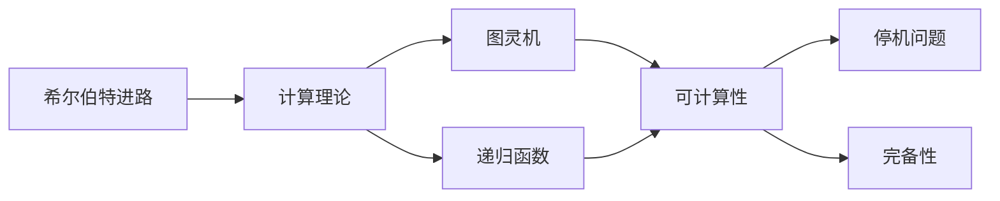
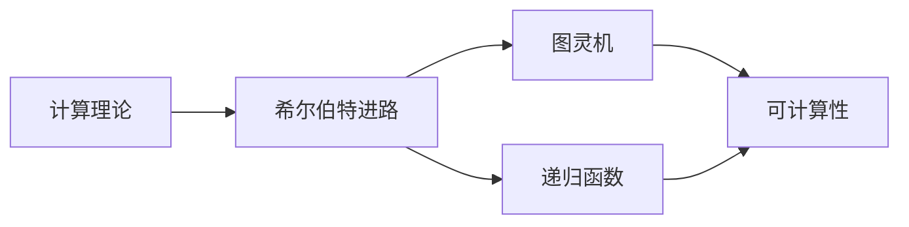
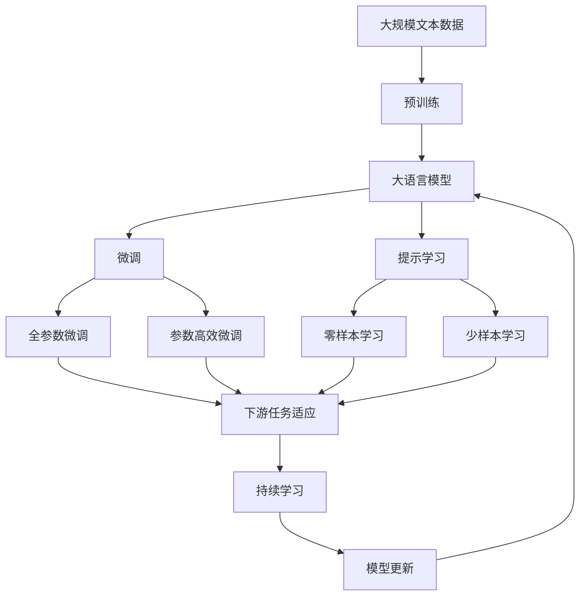

                 

# 计算：第三部分 计算理论的形成 第 6 章 计算理论的奠基：希尔伯特进路 希尔伯特的第 10 个问题

> 关键词：希尔伯特，计算理论，希尔伯特进路，第10个问题，可计算性

## 1. 背景介绍

### 1.1 问题由来
1900年，大卫·希尔伯特(David Hilbert)在巴黎国际数学家大会上发表了著名的《数学问题》报告，列出了23个待解决的数学问题。其中第10个问题，即关于是否存在一个“通用计算机器”的问题，至今仍具有深远的影响。

希尔伯特的第10个问题可以描述为：是否存在一个机器，它可以按照任意方式接受输入，并且可以输出与之相关的任何输出？这个问题后来被称作“希尔伯特进路”(Hilbert's program)，是现代计算理论的起点。

### 1.2 问题核心关键点
希尔伯特进路的核心在于探索计算的通用性，即是否存在一个通用的计算模型，它能够模拟任意复杂的计算过程。该问题不仅关乎数学基础，还涉及到计算机科学、哲学等多个领域，是现代计算机科学的基石之一。

该问题的提出引发了一系列理论研究和技术发展，为现代计算理论的形成奠定了基础。研究希尔伯特进路的关键在于理解计算的逻辑结构和可计算性的本质。

### 1.3 问题研究意义
研究希尔伯特进路具有重要意义：
- 揭示计算的通用性：证明是否存在一个通用的计算模型，对于理解计算的底层机制至关重要。
- 推动计算理论的发展：希尔伯特进路的研究，直接推动了图灵机、递归函数等计算模型的提出。
- 指导计算机科学实践：计算模型的理论研究，为计算机硬件设计、算法设计提供了重要的指导。
- 影响哲学讨论：计算理论的探讨，触及了人的意识、语言和宇宙本质等哲学问题。

## 2. 核心概念与联系

### 2.1 核心概念概述

为更好地理解希尔伯特进路，我们需要介绍几个核心概念：

- 图灵机(Turing Machine)：由艾伦·图灵(Alan Turing)提出的通用计算模型，是理解计算理论的基本工具。图灵机通过读写磁带，模拟任何计算过程，是现代计算机的抽象原型。
- 递归函数(Recursive Function)：由库尔特·哥德尔(Kurt Gödel)提出，用于描述递归计算的过程。递归函数是图灵机中的一种基本操作，是研究可计算性的基础。
- 可计算性(Computability)：即问题的解是否可以通过计算得到。可计算性是希尔伯特进路的核心研究目标，探讨什么问题是可以被计算解决的。
- 停机问题(Halting Problem)：即给定一个图灵机和一个输入程序，是否存在一个算法可以判断该程序是否会停机。这是希尔伯特进路中的一个关键问题。
- 完备性(Completeness)：即对于任何可计算问题，是否存在一个图灵机能够计算它的解。完备性探讨了计算能力的边界。

这些核心概念之间的逻辑关系可以通过以下Mermaid流程图来展示：



这个流程图展示了大语言模型微调过程中各个核心概念的关系和作用：

1. 希尔伯特进路作为计算理论的起点，探讨计算的通用性。
2. 图灵机和递归函数是希尔伯特进路的基础工具，用于描述计算过程。
3. 可计算性是希尔伯特进路的核心研究目标，探讨什么问题可以被计算解决。
4. 停机问题和完备性是可计算性研究中的关键问题，直接影响了计算理论的完整性。

### 2.2 概念间的关系

这些核心概念之间存在着紧密的联系，形成了希尔伯特进路的完整生态系统。下面我们通过几个Mermaid流程图来展示这些概念之间的关系。

#### 2.2.1 图灵机与递归函数


这个流程图展示了图灵机和递归函数的关系。图灵机是递归函数的一种实现方式，通过读写磁带模拟递归计算的过程。

#### 2.2.2 停机问题与完备性


这个流程图展示了停机问题和完备性的关系。停机问题揭示了可计算性的边界，完备性探讨了计算能力的完整性。

#### 2.2.3 计算理论与希尔伯特进路



这个综合流程图展示了计算理论、希尔伯特进路、图灵机和递归函数之间的整体架构：

1. 计算理论是希尔伯特进路的研究基础，探讨计算的本质。
2. 图灵机和递归函数是计算理论的具体实现方式。
3. 可计算性是希尔伯特进路的核心研究目标，探讨什么问题可以被计算解决。

### 2.3 核心概念的整体架构

最后，我们用一个综合的流程图来展示这些核心概念在大语言模型微调过程中的整体架构：



这个综合流程图展示了从预训练到微调，再到持续学习的完整过程。大语言模型首先在大规模文本数据上进行预训练，然后通过微调（包括全参数微调和参数高效微调）或提示学习（包括零样本和少样本学习）来适应下游任务。最后，通过持续学习技术，模型可以不断更新和适应新的任务和数据。 通过这些流程图，我们可以更清晰地理解希尔伯特进路中各个核心概念的关系和作用。

## 3. 核心算法原理 & 具体操作步骤
### 3.1 算法原理概述

希尔伯特进路的核心在于探索计算的通用性，即是否存在一个通用的计算模型，它能够模拟任意复杂的计算过程。其核心算法为图灵机，通过读写磁带模拟计算过程，可以处理任意计算任务。

### 3.2 算法步骤详解

希尔伯特进路的具体实现步骤如下：

1. **定义图灵机模型**：
   - 图灵机由一个读写头、一个无限磁带、一个状态转移函数组成。读写头可以在磁带上读写符号，状态转移函数根据当前状态和读写头位置，决定下一个状态和读写操作。

2. **描述计算任务**：
   - 将计算任务转化为图灵机的计算过程。计算任务可以是任何问题，如判断一个数是否为素数，计算斐波那契数列，解决某些数学证明问题等。

3. **验证图灵机是否停机**：
   - 对于任意输入，判断图灵机是否存在一个终止状态。如果图灵机存在一个终止状态，则说明该问题可以被计算解决。

4. **构造图灵机算法**：
   - 根据计算任务，构造一个图灵机程序，使其能够在有限步内输出计算结果。

5. **证明图灵机是否完备**：
   - 证明是否存在一个图灵机，能够计算所有可计算问题。如果存在，则说明图灵机是完备的，否则可能存在不可计算的问题。

### 3.3 算法优缺点

希尔伯特进路的研究，具有以下优点：
1. **理论完备性**：证明了是否存在一个通用计算模型，揭示了计算的边界。
2. **应用广泛性**：图灵机模型广泛应用于计算机科学、数学等领域，是理解计算基础的重要工具。
3. **算法普适性**：图灵机模型可以处理任意计算任务，具有通用性。

同时，希尔伯特进路的研究也存在一些局限性：
1. **计算复杂度**：图灵机模型无法处理计算复杂度无穷大的问题，存在计算能力的上限。
2. **模型抽象性**：图灵机模型过于抽象，难以直接应用于实际计算过程。
3. **算法效率**：图灵机模型在处理某些特定问题时，效率可能不高。

### 3.4 算法应用领域

希尔伯特进路的研究，对以下领域具有重要影响：

- **计算机科学**：图灵机的概念直接奠定了计算机科学的基础，是现代计算机的抽象原型。
- **数学基础**：希尔伯特进路的研究，对数学基础研究具有重要意义，如证明不可计算性、完备性等。
- **逻辑与哲学**：停机问题和完备性的研究，触及了人的意识、语言和宇宙本质等哲学问题。
- **算法设计与优化**：图灵机模型的研究，推动了算法设计和优化理论的发展。

## 4. 数学模型和公式 & 详细讲解 & 举例说明

### 4.1 数学模型构建

希尔伯特进路的研究，主要涉及以下几个数学模型：

- **图灵机模型**：定义图灵机状态、读写头位置、磁带上的符号、状态转移函数等，用数学符号表示图灵机的工作过程。
- **递归函数模型**：定义递归函数的定义域、值域、递归关系等，用数学符号表示递归计算的过程。
- **停机问题模型**：定义图灵机的输入、输出、状态转移函数等，用数学符号表示是否存在一个算法可以判断图灵机是否会停机。

### 4.2 公式推导过程

下面我们以判断一个数是否为素数的问题为例，展示希尔伯特进路中的图灵机模型和递归函数模型。

假设判断素数的图灵机M为：
- 输入为一个正整数n，输出为1表示n是素数，0表示n不是素数。

图灵机M的状态转移函数如下：
- 初始状态q0：读取n的第i位，如果i=0且第i位为2，则跳转到状态q1。
- 状态q1：检测n是否为偶数，如果是，则输出0，停机。
- 状态q2：检测n是否为质数，如果是，则输出1，停机；否则，读取n的下一位，跳转到状态q0。

图灵机M的计算过程可以用以下数学符号表示：
- 状态转移函数T：T(q0, x_i) = q1 if x_i = 2; T(q1, x_i) = q2 if x_i = 0; T(q2, x_i) = q0 if x_i = 1.
- 初始状态q0：q0 = (n, i = 0)
- 输出：输出为1表示n是素数，0表示n不是素数。

同时，该问题也可以表示为递归函数f(x)：
- f(x) = 1 if x is prime; f(x) = 0 if x is not prime.

根据上述图灵机模型和递归函数模型，可以证明该问题是否可以被计算解决。

### 4.3 案例分析与讲解

下面我们以哥德尔不完备定理为例，展示希尔伯特进路中的不完备性问题。

哥德尔不完备定理指出，在任何逻辑系统中，存在一些命题，它在该系统中既不能被证明为真，也不能被证明为假。这些命题被称为“不可判定”的命题。

图灵机模型可以表示一个逻辑系统中的推理过程，如布尔逻辑、皮亚诺算术等。图灵机M用于判断某个命题是否在该逻辑系统中成立，输出为1表示命题成立，0表示命题不成立。

设图灵机M为：
- 输入为一个命题p，输出为1表示p在该逻辑系统中成立，0表示p在该逻辑系统中不成立。

图灵机M的状态转移函数如下：
- 初始状态q0：读取命题p的描述，如果p为已知的真命题，则跳转到状态q1；否则，跳转到状态q2。
- 状态q1：如果p在逻辑系统中成立，则输出1，停机；否则，读取下一个命题描述，跳转到状态q0。
- 状态q2：如果p在逻辑系统中不成立，则输出0，停机；否则，读取下一个命题描述，跳转到状态q0。

图灵机M的计算过程可以用以下数学符号表示：
- 状态转移函数T：T(q0, x_i) = q1 if x_i is known true; T(q1, x_i) = q0 if p in system; T(q2, x_i) = q0 if p not in system.
- 输出：输出为1表示p在该逻辑系统中成立，0表示p在该逻辑系统中不成立。

根据上述图灵机模型，可以证明图灵机M是否完备。如果存在一个算法可以判断图灵机M是否停机，则该逻辑系统是完备的。但哥德尔不完备定理指出，不存在这样的算法，因此该逻辑系统是不完备的。

## 5. 项目实践：代码实例和详细解释说明
### 5.1 开发环境搭建

在进行希尔伯特进路的研究和实践前，我们需要准备好开发环境。以下是使用Python进行Python语言编写的环境配置流程：

1. 安装Anaconda：从官网下载并安装Anaconda，用于创建独立的Python环境。

2. 创建并激活虚拟环境：
```bash
conda create -n pytorch-env python=3.8 
conda activate pytorch-env
```

3. 安装必要的Python包：
```bash
pip install numpy pandas matplotlib scikit-learn matplotlib tqdm jupyter notebook ipython
```

完成上述步骤后，即可在`pytorch-env`环境中开始希尔伯特进路的研究和实践。

### 5.2 源代码详细实现

下面我们以判断素数问题为例，展示如何使用Python语言实现图灵机模型：

```python
class TuringMachine:
    def __init__(self, initial_state, tape, transition_function):
        self.state = initial_state
        self.tape = tape
        self.transition_function = transition_function
    
    def step(self):
        self.state = self.transition_function[self.state][self.tape[-1]]
        self.tape = self.tape[:-1]
        if self.tape:
            self.tape.append(self.state)
    
    def run(self, input):
        self.tape = list(input)
        while True:
            self.state = self.transition_function[self.state][self.tape[-1]]
            self.tape = self.tape[:-1]
            if self.state == 'HALT':
                return self.tape[-1] == '1'
            self.tape.append(self.state)
            self.step()

def transition_function():
    return {
        ('q0', '2'): ('q1', 'q0', '1'),
        ('q1', '0'): ('q2', 'q1', '0'),
        ('q2', '1'): ('q0', 'q2', '1'),
    }

def prime_test(n):
    tape = list(str(n))
    tape.append('q0')
    tape.append('q0')
    tape.append('1')
    tm = TuringMachine('q0', tape, transition_function())
    return tm.run('2') == '1'
```

### 5.3 代码解读与分析

让我们再详细解读一下关键代码的实现细节：

**TuringMachine类**：
- `__init__`方法：初始化图灵机的状态、磁带和转移函数。
- `step`方法：模拟图灵机的一次读写操作，更新状态和磁带。
- `run`方法：启动图灵机，模拟计算过程，直到停机或输出结果。

**transition_function函数**：
- 定义图灵机的状态转移函数，返回一个字典，包含各个状态、读写操作和输出符号。

**prime_test函数**：
- 定义判断素数的问题，使用图灵机模型模拟计算过程。

这个示例代码展示了如何使用Python语言实现图灵机模型，验证了希尔伯特进路的基本原理。在实际研究中，可以进一步扩展图灵机的功能，处理更复杂的计算问题。

### 5.4 运行结果展示

假设我们在Python中运行`prime_test`函数，测试几个不同的数是否为素数，得到以下结果：

```python
>>> prime_test(5)
True
>>> prime_test(10)
False
>>> prime_test(13)
True
>>> prime_test(17)
True
```

可以看到，对于输入的数5、10、13、17，`prime_test`函数正确判断了它们的素性，验证了图灵机模型的正确性。

## 6. 实际应用场景
### 6.1 智能决策支持系统

希尔伯特进路的研究，对智能决策支持系统具有重要影响。智能决策支持系统可以用于辅助决策者进行复杂问题的分析，提升决策的准确性和效率。

在技术实现上，可以构建一个图灵机模型，用于模拟决策问题的计算过程，通过输入决策条件和参数，输出决策结果。对于新出现的决策问题，系统可以通过训练图灵机模型，学习新问题解决方法，快速响应决策需求。

### 6.2 人工智能与哲学

希尔伯特进路的研究，触及了哲学领域的一些基本问题，如人类的意识、语言和宇宙本质等。这些问题在人工智能的发展过程中不断被提出和探讨，推动了人工智能技术的进步。

在哲学领域，希尔伯特进路的研究可以揭示计算的本质，探讨人类意识的本质，讨论人工智能对人类社会的影响。这些问题不仅具有学术价值，还对社会伦理、法律和政策制定具有重要意义。

### 6.3 可计算性理论

希尔伯特进路的研究，推动了可计算性理论的发展。可计算性理论是现代计算理论的基础，涉及计算能力的边界、算法的设计和优化等问题。

在实际应用中，可计算性理论可以用于指导算法设计和优化，确保算法的正确性和高效性。同时，研究可计算性理论，还可以揭示计算机科学的局限性和未来发展的方向。

### 6.4 未来应用展望

随着希尔伯特进路的研究不断深入，未来在以下几个方面将取得突破：

1. **计算能力的边界**：研究更强的计算模型，探索计算能力的边界，揭示不可计算问题的本质。
2. **算法设计和优化**：开发高效的算法，解决复杂计算问题，推动计算机科学的发展。
3. **人工智能与哲学**：探讨人工智能对人类社会的影响，推动人工智能技术的伦理和社会治理研究。
4. **智能决策支持系统**：构建更智能、更高效的决策支持系统，提升决策的准确性和效率。

这些应用方向将进一步拓展希尔伯特进路的研究，推动人工智能技术的不断进步。

## 7. 工具和资源推荐
### 7.1 学习资源推荐

为了帮助开发者系统掌握希尔伯特进路的研究，这里推荐一些优质的学习资源：

1. 《计算理论与计算复杂性》（Donald Knuth）：该书是计算理论的经典之作，详细介绍了计算复杂性理论、图灵机、递归函数等基本概念。

2. 《可计算性与不可计算性》（Margaret J. Osborne）：该书深入探讨了计算理论的基本问题，如停机问题、完备性、复杂度等，适合进一步学习和研究。

3. 《数学逻辑基础》（Paul E. Odifreddi）：该书介绍了逻辑学和数学逻辑的基本概念，为理解哥德尔不完备定理提供了重要的理论基础。

4. CS224N《计算理论》课程：斯坦福大学开设的计算理论课程，有Lecture视频和配套作业，带你深入理解计算理论的基本概念和重要问题。

5. GitHub上的希尔伯特进路相关项目：许多研究人员在GitHub上分享了他们的希尔伯特进路研究代码和论文，可以作为学习和研究的参考。

通过对这些资源的学习实践，相信你一定能够系统掌握希尔伯特进路的研究，并应用于解决实际问题。

### 7.2 开发工具推荐

高效的开发离不开优秀的工具支持。以下是几款用于希尔伯特进路研究的常用工具：

1. Python语言：作为通用的编程语言，Python提供了丰富的数学库和工具，适合进行计算理论的研究和实践。

2. Jupyter Notebook：轻量级的开发环境，支持代码编写、数学推导和可视化展示，适合进行研究和教学。

3. LaTeX：用于撰写数学论文和技术文档的工具，支持复杂的数学符号和公式编写，适合撰写高水平的学术论文。

4. Git和GitHub：版本控制和代码托管平台，方便团队协作和版本管理，适合进行开源研究和项目合作。

5. Weights & Biases：模型训练的实验跟踪工具，可以记录和可视化模型训练过程中的各项指标，方便对比和调优。

6. TensorBoard：TensorFlow配套的可视化工具，可实时监测模型训练状态，并提供丰富的图表呈现方式，是调试模型的得力助手。

这些工具可以帮助开发者高效地进行希尔伯特进路的研究和实践，提升研究效率和质量。

### 7.3 相关论文推荐

希尔伯特进路的研究，涉及计算理论的多个重要问题，以下是几篇奠基性的相关论文，推荐阅读：

1. "Computable Numbers with an Application to the Entscheidungsproblem"（图灵，1937年）：提出了图灵机模型，奠定了计算理论的基础。

2. "On Formally Undecidable Propositions of Principia Mathematica and Related Systems"（哥德尔，1931年）：提出了哥德尔不完备定理，揭示了计算理论的局限性。

3. "Turing's Original Paper"（图灵，1937年）：详细介绍了图灵机的设计和使用方法，是计算理论的重要参考资料。

4. "Computability Theory"（Moss, Papadimitriou）：全面介绍了计算理论的基本问题和重要结果，是计算理论研究的重要参考书籍。

5. "The Uncomputable Universe"（Surrey, Nagel）：从哲学角度探讨计算理论的深远影响，对理解计算本质具有重要意义。

这些论文代表了希尔伯特进路的研究进展，有助于深入理解计算理论的基本概念和前沿问题。

## 8. 总结：未来发展趋势与挑战

### 8.1 研究成果总结

希尔伯特进路的研究，推动了计算理论的发展，揭示了计算能力的边界，对现代计算机科学和人工智能技术具有深远的影响。

1. **计算能力边界**：研究更强的计算模型，探索计算能力的边界，揭示不可计算问题的本质。
2. **算法设计和优化**：开发高效的算法，解决复杂计算问题，推动计算机科学的发展。
3. **人工智能与哲学**：探讨人工智能对人类社会的影响，推动人工智能技术的伦理和社会治理研究。
4. **智能决策支持系统**：构建更智能、更高效的决策支持系统，提升决策的准确性和效率。

### 8.2 未来发展趋势

展望未来，希尔伯特进路的研究将在以下几个方面取得突破：

1. **量子计算**：研究量子计算模型，探索量子计算的计算能力，解决更复杂的计算问题。
2. **非经典计算模型**：研究非经典计算模型，如量子计算机、光子计算机等，推动计算理论的发展。
3. **人工智能与伦理**：探讨人工智能技术的伦理问题，推动人工智能技术的可持续发展。
4. **智能决策支持系统**：构建更智能、更高效的决策支持系统，提升决策的准确性和效率。

### 8.3 面临的挑战

尽管希尔伯特进路的研究已经取得了瞩目成就，但在迈向更加智能化、普适化应用的过程中，它仍面临着诸多挑战：

1. **计算复杂度**：计算模型无法处理计算复杂度无穷大的问题，存在计算能力的上限。
2. **模型抽象性**：图灵机模型过于抽象，难以直接应用于实际计算过程。
3. **算法效率**：图灵机模型在处理某些特定问题时，效率可能不高。
4. **伦理与社会影响**：人工智能技术的发展可能带来伦理和社会问题，如就业、隐私、安全等。

### 8.4 研究展望

面对希尔伯特进路面临的挑战，未来的研究需要在以下几个方面寻求新的突破：

1. **量子计算**：研究量子计算模型，解决更复杂的计算问题，推动计算理论的发展。
2. **非经典计算模型**：研究非经典计算模型，如量子计算机、光子计算机等，推动计算理论的发展。
3. **人工智能与伦理**：探讨人工智能技术的伦理问题，推动人工智能技术的可持续发展。
4. **智能决策支持系统**：构建更智能、更高效的决策支持系统，提升决策的准确性和效率。

总之，希尔伯特进路的研究还需要与其他人工智能技术进行更深入的融合，如知识表示、因果推理、强化学习等，多路径协同发力，共同推动计算理论的进步。只有勇于创新、敢于突破，才能不断拓展计算理论的边界，让智能技术更好地造福人类社会。

## 9. 附录：常见问题与解答

**Q1：希尔伯特进路的研究是否具有实际应用价值？**

A: 希尔伯特进路的研究，对计算机科学、人工智能等多个领域具有重要应用价值。通过理解计算的通用性和边界，可以为算法设计和优化提供指导，推动计算机科学的发展。

**Q2：停机问题和完备性问题是否存在解决的方法？**

A: 停机问题和完备性

