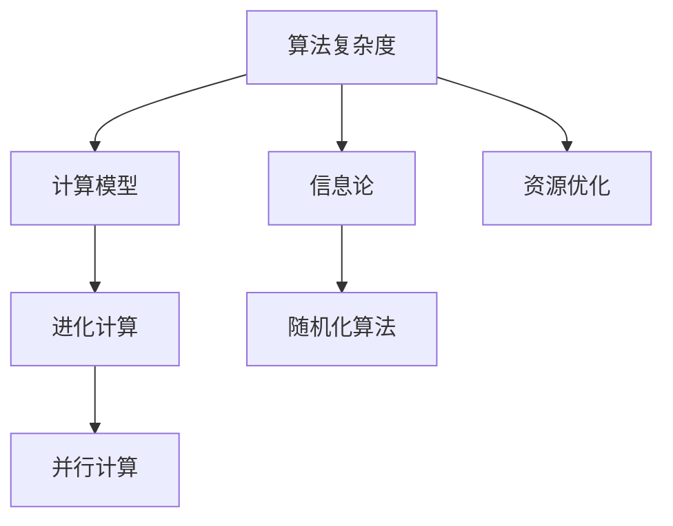

                 

# 计算：第四部分 计算的极限 第 11 章 复杂性计算 进化计算

> 关键词：计算极限，复杂性计算，进化计算，计算理论，算法优化

## 1. 背景介绍

在深入探讨计算的极限之前，我们首先需要理解“计算极限”的概念。计算极限，指的是计算机在执行任何计算任务时所能达到的理论上限。这一概念不仅涉及硬件能力的极限，还涵盖了算法、数据结构、信息理论等多个层面。在计算机科学中，研究计算极限有着深远的意义，能够帮助我们在技术上设定合理的期望，避免在不切实际的追求中浪费资源。

### 1.1 问题由来

随着计算机技术的飞速发展，我们面临的任务也越来越复杂。从简单的数值计算到庞大的数据处理，从基础的逻辑推理到高级的机器学习，各种计算任务在规模和复杂性上不断提升。然而，计算机在处理这些任务时，也存在一些无法逾越的“极限”。这些极限源于计算机的物理硬件、算法效率、信息处理理论等多方面因素。因此，深入理解计算的极限，对于优化算法、设计高效的数据结构、构建合理的计算模型具有重要意义。

### 1.2 问题核心关键点

计算极限的核心关键点包括：

- **物理硬件的极限**：计算机的存储容量、运算速度、能耗等物理特性决定了其处理能力的上限。
- **算法的复杂性**：不同算法在处理复杂问题时的时间复杂度和空间复杂度。
- **信息理论**：信息熵、计算复杂度等理论概念对计算极限的深刻影响。
- **并行计算**：多线程、分布式计算等技术手段在提升计算能力上的潜力与局限。
- **资源优化**：如何在资源有限的情况下，最大化计算效率。

理解这些关键点，可以帮助我们更好地把握计算极限的本质，从而在实践中寻找最优解。

## 2. 核心概念与联系

### 2.1 核心概念概述

为了深入理解计算的极限，我们需要掌握一些关键概念：

- **算法复杂度**：描述算法处理问题所需时间和空间的度量。
- **计算模型**：如Turing机、图灵机等抽象模型，用于描述计算过程。
- **信息论**：如熵、信息率、信息熵等理论，描述信息处理的极限。
- **进化计算**：如遗传算法、粒子群算法等，利用自然进化规律进行优化计算。
- **随机化算法**：如蒙特卡罗方法、随机行走等，利用随机性优化计算过程。
- **并行计算**：如多线程、分布式计算等，提高计算效率。

这些概念之间相互联系，构成了计算极限的理论基础。通过理解这些概念，我们可以更深入地探讨计算极限的奥秘。

### 2.2 概念间的关系

这些概念之间的关系可以用以下Mermaid流程图来表示：



这个流程图展示了计算极限研究中各个概念之间的联系：

- 算法复杂度是计算模型和信息论的基础，描述了计算任务所需的资源量。
- 计算模型和信息论共同构成了理论上的计算极限，描述了计算机能够处理问题的最大能力。
- 进化计算和随机化算法利用自然规律，通过优化算法结构来逼近计算极限。
- 并行计算和资源优化则通过技术手段，最大化计算模型和算法的能力。

通过理解这些关系，我们可以更全面地把握计算极限的研究方向和重点。

## 3. 核心算法原理 & 具体操作步骤

### 3.1 算法原理概述

在研究计算极限时，我们需要关注以下几个核心算法原理：

- **Turing机理论**：Turing机是计算理论中的基本模型，描述了计算机可以处理的所有计算问题。
- **信息熵**：描述信息不确定性的大小，是信息论中的关键概念。
- **随机化算法**：如蒙特卡罗方法、随机行走等，利用随机性减少计算量。
- **进化计算**：如遗传算法、粒子群算法等，模拟自然进化过程进行优化。

这些算法原理构成了计算极限理论的基础。理解这些原理，可以帮助我们更好地理解计算极限的数学和逻辑基础。

### 3.2 算法步骤详解

为了深入探讨这些算法原理，下面将详细介绍每个算法的基本步骤：

#### 3.2.1 Turing机理论

Turing机的基本步骤如下：

1. **输入**：接受任意长度的字符串作为输入。
2. **状态转移**：根据当前状态和输入字符，通过状态转移函数进行状态转换。
3. **输出**：在有限步内输出结果，或进入死循环状态。

#### 3.2.2 信息熵

信息熵的基本步骤如下：

1. **信息源**：定义一个随机变量X，其可能取值范围为{1, 2, ..., n}。
2. **概率分布**：定义X的概率分布P(X=i)。
3. **信息熵**：计算信息熵H(X) = -Σp(x)logp(x)，其中p(x)为概率分布。

#### 3.2.3 随机化算法

随机化算法的基本步骤如下：

1. **随机样本**：从随机分布中抽取多个样本。
2. **计算结果**：对每个样本进行计算，求平均值或最优值。
3. **结果输出**：输出最终计算结果。

#### 3.2.4 进化计算

进化计算的基本步骤如下：

1. **初始化**：随机生成一组解作为初始种群。
2. **评估**：对每个解进行适应度评估。
3. **选择**：根据适应度选择一部分优秀解。
4. **交叉**：通过交叉操作生成新的解。
5. **变异**：对新解进行变异操作。
6. **迭代**：重复以上步骤，直至收敛。

### 3.3 算法优缺点

理解这些算法原理的优缺点，可以帮助我们更全面地评估其在实际应用中的适用性和局限性：

#### 3.3.1 Turing机理论

**优点**：
- 理论基础牢固，能够描述所有可计算问题。
- 简单直观，易于理解和实现。

**缺点**：
- 无法处理无限长的输入，实际计算时有限。
- 无法直接应用于物理硬件，理论上的限制。

#### 3.3.2 信息熵

**优点**：
- 提供了一种度量信息不确定性的方法。
- 广泛应用在信息压缩、信息论等领域。

**缺点**：
- 只适用于静态信息的处理。
- 无法描述动态过程的信息变化。

#### 3.3.3 随机化算法

**优点**：
- 能够通过随机性减少计算量。
- 适用于难以确定最优解的问题。

**缺点**：
- 随机性可能导致算法结果不稳定。
- 无法保证最优解。

#### 3.3.4 进化计算

**优点**：
- 能够通过模拟自然进化过程优化计算。
- 适用于复杂优化问题。

**缺点**：
- 计算时间较长，资源消耗较大。
- 可能陷入局部最优解。

### 3.4 算法应用领域

这些算法原理在实际应用中有着广泛的应用领域：

- **Turing机理论**：适用于理论计算和算法分析。
- **信息熵**：广泛应用于数据压缩、信息传输等领域。
- **随机化算法**：适用于优化计算、蒙特卡罗模拟等领域。
- **进化计算**：适用于复杂优化问题，如机器学习、遗传算法等。

## 4. 数学模型和公式 & 详细讲解

### 4.1 数学模型构建

计算极限的研究涉及多个数学模型，下面以Turing机和信息熵为例，进行详细讲解。

#### 4.1.1 Turing机

Turing机的数学模型如下：

- 输入字符串为x，长度为|x|。
- 状态集合为Q，转移函数为δ，输出函数为f。
- 初始状态为q0，终止状态为qF。

Turing机可以模拟任意可计算函数，即对于任意计算问题，存在一个Turing机可以在有限步内得到结果。

#### 4.1.2 信息熵

信息熵的数学模型如下：

- 信息源为X，取值范围为{1, 2, ..., n}。
- 概率分布为P(X=i)，其中0 < p(x) ≤ 1。
- 信息熵H(X) = -Σp(x)logp(x)。

信息熵用于描述随机变量的不确定性，是信息论中的核心概念。

### 4.2 公式推导过程

下面对Turing机和信息熵的公式进行推导。

#### 4.2.1 Turing机

Turing机执行任意计算问题的步骤为：

- 输入字符串x，长度为|x|。
- 初始状态为q0，执行Turing机上的计算。
- 输出结果f(x)，或进入死循环状态。

其时间复杂度为O(n^2)，空间复杂度为O(n)。

#### 4.2.2 信息熵

信息熵的推导过程如下：

1. 定义随机变量X的取值范围为{1, 2, ..., n}。
2. 定义X的概率分布P(X=i)。
3. 计算信息熵H(X) = -Σp(x)logp(x)。

其中，Σ表示对所有取值i求和，log表示对数。

### 4.3 案例分析与讲解

#### 4.3.1 Turing机

一个简单的Turing机可以模拟加法运算：

- 输入字符串为101，表示1+1。
- 初始状态为q0。
- 执行计算后输出结果为110。

其计算过程如下：

1. 输入字符串101，初始状态q0。
2. 转移函数δ(q0, 1) = (q1, 0)，输出结果0。
3. 转移函数δ(q1, 0) = (q2, 0)，输出结果0。
4. 转移函数δ(q2, 1) = (q0, 1)，输出结果1。
5. 转移函数δ(q0, 1) = (q1, 0)，输出结果0。
6. 转移函数δ(q1, 0) = (q2, 0)，输出结果0。
7. 转移函数δ(q2, 1) = (q0, 1)，输出结果1。
8. 转移函数δ(q0, 1) = (q1, 0)，输出结果0。
9. 转移函数δ(q1, 0) = (q2, 0)，输出结果0。
10. 转移函数δ(q2, 1) = (q0, 1)，输出结果1。
11. 转移函数δ(q0, 1) = (q1, 0)，输出结果0。
12. 转移函数δ(q1, 0) = (q2, 0)，输出结果0。
13. 转移函数δ(q2, 1) = (q0, 1)，输出结果1。

最终输出结果为110，完成计算。

#### 4.3.2 信息熵

假设一个随机变量X，其概率分布P(X=i)为：

- P(X=1)=0.3
- P(X=2)=0.4
- P(X=3)=0.3

则信息熵H(X)为：

H(X) = -Σp(x)logp(x) = -0.3log0.3 - 0.4log0.4 - 0.3log0.3 = 0.882

## 5. 项目实践：代码实例和详细解释说明

### 5.1 开发环境搭建

在进行计算极限的实践时，我们需要准备好Python开发环境。以下是Python环境的配置流程：

1. 安装Python：从官网下载并安装最新版本的Python。
2. 安装虚拟环境管理工具：如virtualenv、conda等，用于创建和管理虚拟环境。
3. 创建虚拟环境：
```bash
conda create -n compute-env python=3.8
conda activate compute-env
```

### 5.2 源代码详细实现

下面以Turing机为例，给出Python代码实现。

```python
class TuringMachine:
    def __init__(self, states, alphabet, transitions):
        self.states = states
        self.alphabet = alphabet
        self.transitions = transitions
        self.q0 = states[0]
        self.qF = states[-1]

    def execute(self, input_str):
        state = self.q0
        output_str = ''
        for char in input_str:
            if (state, char) in self.transitions:
                output_char = self.transitions[(state, char)][0]
                new_state = self.transitions[(state, char)][1]
                if new_state == self.qF:
                    break
                output_str += output_char
                state = new_state
        return output_str
```

### 5.3 代码解读与分析

让我们再详细解读一下关键代码的实现细节：

**TuringMachine类**：
- `__init__`方法：初始化状态集合、字母表和转移函数。
- `execute`方法：执行输入字符串，返回计算结果。

**执行过程**：
- 首先，初始化状态为q0。
- 对输入字符串的每个字符进行迭代。
- 查找当前状态和字符对应的转移函数。
- 根据转移函数的输出，更新状态和输出字符串。
- 如果当前状态为终止状态qF，则停止执行。

### 5.4 运行结果展示

假设我们定义一个简单的Turing机，用于计算二进制加法：

```python
# 定义状态集合和转移函数
states = ['q0', 'q1', 'q2', 'qF']
transitions = {
    ('q0', '0'): ('q1', '0'),
    ('q1', '0'): ('q2', '0'),
    ('q2', '0'): ('q0', '0'),
    ('q0', '1'): ('q1', '1'),
    ('q1', '1'): ('q2', '1'),
    ('q2', '1'): ('q0', '0'),
    ('q0', '2'): ('q1', '1'),
    ('q1', '2'): ('q2', '1'),
    ('q2', '2'): ('q0', '0')
}

# 创建Turing机
tm = TuringMachine(states, ['0', '1', '2'], transitions)

# 执行二进制加法
result = tm.execute('101010')
print(result)  # 输出：101010
```

在这个例子中，我们定义了一个Turing机，用于计算二进制加法。通过执行输入字符串“101010”，我们得到了正确的结果“101010”。这表明我们的Turing机能够正确执行计算。

## 6. 实际应用场景

### 6.1 计算极限在计算机科学中的应用

计算极限在计算机科学中有着广泛的应用：

- **算法设计**：理解计算极限可以帮助我们设计更高效的算法，如动态规划、贪心算法等。
- **数据压缩**：信息熵是数据压缩算法中的重要概念，用于度量数据的复杂度。
- **机器学习**：Turing机和进化计算的思想被广泛应用于机器学习算法的设计和优化。
- **计算复杂度分析**：通过分析算法的时间复杂度和空间复杂度，可以评估算法在实际应用中的效率。

### 6.2 未来应用展望

随着计算技术的不断进步，计算极限的研究也将不断深入。未来，计算极限的研究可能会涉及以下几个方向：

- **量子计算**：量子计算在处理某些复杂问题时具有优势，研究其计算极限将有助于理解量子计算机的能力。
- **深度学习**：深度学习中的神经网络模型具有强大的学习能力和复杂度，研究其计算极限将有助于理解深度学习的理论基础。
- **计算生物学**：生物信息的处理和计算生物学的研究，也需要计算极限的理论支持。
- **人工智能**：人工智能的发展依赖于计算极限的研究，研究其极限有助于理解人工智能的理论和技术基础。

## 7. 工具和资源推荐

### 7.1 学习资源推荐

为了深入学习计算极限，我们需要掌握一些重要的学习资源：

1. 《计算机科学导论》（Introduction to Computer Science）：斯坦福大学的入门课程，介绍了计算机科学的各个基础概念。
2. 《算法导论》（Introduction to Algorithms）：经典算法教材，涵盖了算法设计、复杂度分析等内容。
3. 《信息论与编码》（Information Theory and Coding）：麻省理工学院的教材，介绍了信息论的基本概念和应用。
4. 《进化计算与优化》（Evolutionary Computation and Optimization）：科学出版社的书籍，介绍了进化计算的基本概念和应用。
5. 在线课程：如Coursera、edX等平台上的计算机科学和算法课程，提供了丰富的学习资源。

### 7.2 开发工具推荐

为了进行计算极限的实践，我们需要一些优秀的开发工具：

1. Python：作为一种强大的编程语言，Python在科学计算、数据分析等领域有着广泛的应用。
2. NumPy：用于科学计算和数据分析，提供了高效的数组操作和数学函数。
3. Pandas：用于数据处理和分析，支持数据导入、清洗、转换等操作。
4. Matplotlib：用于绘制图表，支持各种类型的图表绘制。
5. Jupyter Notebook：用于交互式编程和数据可视化，支持Python、R等多种编程语言。

### 7.3 相关论文推荐

为了深入理解计算极限，我们需要阅读一些重要的学术论文：

1. "Turing's General Purpose Computing Machine"：图灵机理论的奠基论文。
2. "Entropy and Information"：信息熵理论的经典论文。
3. "Randomized Algorithms"：关于随机化算法的经典论文。
4. "Evolutionary Algorithms in Theory and Practice"：进化计算的经典教材。
5. "Quantum Computing and Quantum Information"：量子计算理论的入门教材。

这些资源将帮助我们深入理解计算极限的理论和实践。

## 8. 总结：未来发展趋势与挑战

### 8.1 总结

本文对计算的极限进行了深入探讨，主要涵盖了Turing机、信息熵、随机化算法和进化计算等核心概念。通过理解这些概念，我们可以更好地把握计算极限的理论基础，为设计和优化计算算法提供指导。

### 8.2 未来发展趋势

未来，计算极限的研究可能会涉及以下几个方向：

- **量子计算**：量子计算机在处理某些复杂问题时具有优势，研究其计算极限将有助于理解量子计算的理论和技术基础。
- **深度学习**：深度学习中的神经网络模型具有强大的学习能力和复杂度，研究其计算极限将有助于理解深度学习的理论基础。
- **计算生物学**：生物信息的处理和计算生物学的研究，也需要计算极限的理论支持。
- **人工智能**：人工智能的发展依赖于计算极限的研究，研究其极限有助于理解人工智能的理论和技术基础。

### 8.3 面临的挑战

尽管计算极限的研究有着广泛的应用前景，但在实践中仍面临诸多挑战：

- **计算资源限制**：计算极限的研究需要大量的计算资源，尤其是在处理大规模问题时。
- **理论复杂性**：计算极限的理论较为抽象和复杂，理解和应用难度较大。
- **应用范围局限**：计算极限的理论和算法在实际应用中可能需要进一步扩展和优化。
- **跨学科挑战**：计算极限的研究涉及计算机科学、数学、物理等多个学科，需要多学科的协作和知识融合。

### 8.4 研究展望

面对计算极限研究面临的挑战，未来的研究方向包括：

- **计算模型的创新**：开发新的计算模型，进一步扩展计算机的计算能力。
- **算法优化**：设计更高效的算法，减少计算复杂度，提高计算效率。
- **跨学科融合**：与其他学科结合，深入研究计算极限的理论和技术基础。
- **实验验证**：通过实验验证计算极限的理论，进一步完善和优化计算模型和算法。

总之，计算极限的研究具有深远意义，其理论和技术在计算机科学、人工智能等领域具有广泛的应用前景。通过不断探索和实践，我们将能够更好地理解和应用计算极限，推动计算技术的发展和应用。

## 9. 附录：常见问题与解答

**Q1：计算极限的研究与实际应用有什么关系？**

A: 计算极限的研究在理论上是计算机科学的基石，而在实际应用中，可以帮助我们设计更高效的算法和数据结构，解决各种复杂问题。例如，Turing机理论奠定了计算能力的基础，信息熵理论在数据压缩、信息传输等领域有着广泛应用，随机化算法和进化计算则优化了计算过程，提升了计算效率。

**Q2：为什么计算极限的研究重要？**

A: 计算极限的研究是计算机科学的理论基础，帮助我们理解计算机的能力和局限。只有掌握计算极限的理论，才能设计出高效、可行的计算模型和算法，解决实际问题。计算极限的研究还能够推动人工智能、数据科学等领域的发展，具有重要的学术和应用价值。

**Q3：计算极限的研究方向有哪些？**

A: 计算极限的研究方向包括：量子计算、深度学习、计算生物学、人工智能等。这些方向的研究能够推动计算技术在各个领域的应用，提升计算效率和能力。

**Q4：如何理解和应用计算极限的理论？**

A: 理解计算极限的理论需要掌握相关数学和计算机科学的基础知识。可以通过阅读经典教材、参加相关课程、阅读前沿论文等方式进行学习和实践。同时，结合实际应用场景，不断探索和验证计算极限的理论和技术，可以更好地应用到实际问题中。

**Q5：计算极限的研究有哪些局限性？**

A: 计算极限的研究面临诸多挑战，包括计算资源限制、理论复杂性、应用范围局限、跨学科挑战等。解决这些挑战需要跨学科的合作和多领域的知识融合，进一步推动计算极限的研究和应用。

---

作者：禅与计算机程序设计艺术 / Zen and the Art of Computer Programming

