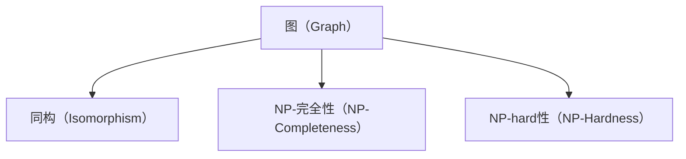
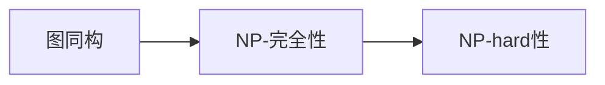
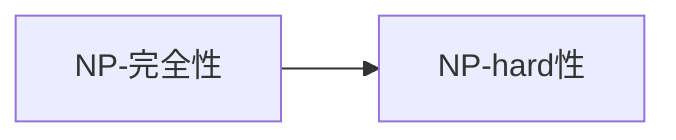
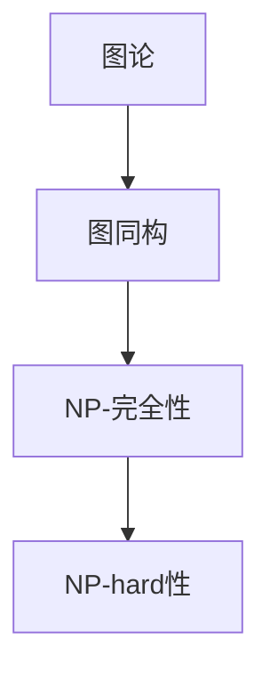
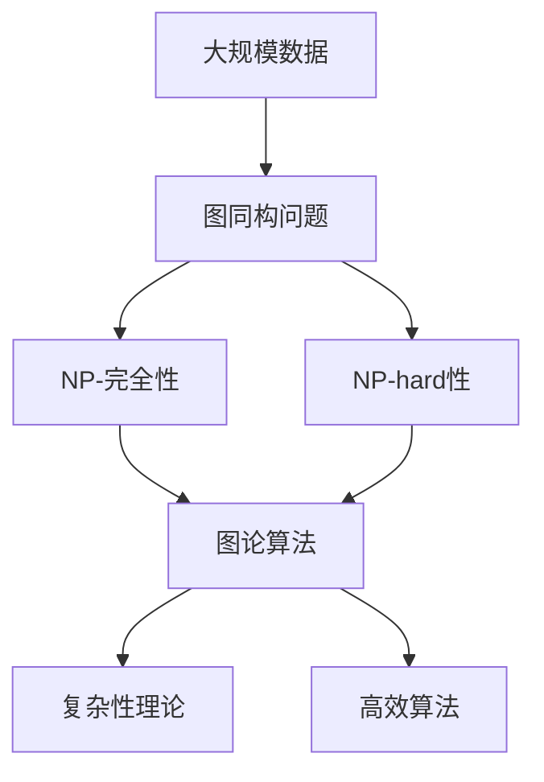

                 

# 计算：第四部分 计算的极限 第 9 章 计算复杂性 图同构问题

> 关键词：图同构问题, NP-完全性, NP-hard, 图论, 算法复杂性, 计算极限, 计算复杂性理论, 算法分析

## 1. 背景介绍

### 1.1 问题由来
图同构问题（Graph Isomorphism Problem, GIP）是计算理论中的一个基本问题。给定两个图，判断它们是否同构（即是否具有相同的结构）。这个看似简单的判断问题，实际上在计算机科学中具有深刻的理论意义。

图同构问题不仅是图论研究的经典问题，还与计算复杂性理论紧密相关。它直接涉及到NP-完全性和NP-hard性的定义和研究，因此在计算理论中有举足轻重的地位。

### 1.2 问题核心关键点
图同构问题研究的核心在于以下几个方面：
- 图同构的定义和理解
- 图同构的判断算法
- 图同构的计算复杂性
- 图同构的实际应用

这些问题不仅具有理论价值，也具有重要的实际应用背景，如社交网络分析、电路板设计、化学分子结构分析等领域。

### 1.3 问题研究意义
研究图同构问题，对于深入理解计算复杂性理论，推动算法设计和优化，以及解决实际应用中的图形数据处理问题，具有重要意义。具体如下：

1. **理论价值**：图同构问题涉及NP-完全性和NP-hard性的判定，对于研究计算理论中的复杂性分类具有指导意义。
2. **算法优化**：图同构问题的求解算法可以启发其他复杂问题的求解，推动高效算法设计的发展。
3. **应用推广**：图同构问题在多个领域有广泛应用，如社交网络分析、生物信息学、电路板设计等，有助于这些领域的智能化转型。

## 2. 核心概念与联系

### 2.1 核心概念概述

在深入讨论图同构问题之前，我们先回顾一些相关核心概念：

- **图（Graph）**：由节点（Node）和边（Edge）构成的数据结构，通常用于表示复杂系统中的关系网络。
- **同构（Isomorphism）**：两个图具有相同的结构，即节点数目相同，边数目和连接方式也相同。
- **NP-完全性（NP-Completeness）**：一个计算问题如果属于NP类，且所有NP问题都可以通过多项式时间归约转换为该问题，则称该问题为NP-完全问题。
- **NP-hard性（NP-Hardness）**：一个计算问题如果属于NP类，且至少存在一个NP完全问题可以通过多项式时间归约转换为该问题，则称该问题为NP-hard问题。

这些概念之间的联系可以通过以下Mermaid流程图来展示：



这个流程图展示了图同构问题与NP-完全性和NP-hard性之间的紧密联系。

### 2.2 概念间的关系

这些核心概念之间存在着紧密的联系，形成了计算复杂性理论的框架。下面我们通过几个Mermaid流程图来展示这些概念之间的关系。

#### 2.2.1 图同构与NP-完全性



这个流程图展示了图同构问题的NP-完全性，即所有NP-完全问题都可以通过多项式时间归约转换为图同构问题。

#### 2.2.2 NP-完全性与NP-hard性



这个流程图展示了所有NP-hard问题都是NP完全问题，但并非所有NP完全问题都是NP-hard问题。

#### 2.2.3 图论与计算复杂性理论



这个流程图展示了图同构问题与计算复杂性理论之间的联系，图论中的问题可以通过图同构问题归约为NP-完全问题或NP-hard问题。

### 2.3 核心概念的整体架构

最后，我们用一个综合的流程图来展示这些核心概念在大规模图处理中的整体架构：



这个综合流程图展示了从大规模数据处理到图同构问题，再到NP-完全性和NP-hard性的理论框架，以及高效算法和复杂性理论的应用。

## 3. 核心算法原理 & 具体操作步骤
### 3.1 算法原理概述

图同构问题本质上是一个组合优化问题，判断两个图是否同构等价于寻找一个图的同构嵌入到另一个图中。这个问题的非平凡解可以通过多种方式来求解，包括暴力枚举、基于符号计算的方法以及基于图论和代数理论的方法。

#### 3.1.1 暴力枚举法

暴力枚举法是最简单直接的求解方法，即枚举所有可能的图同构映射，判断是否满足条件。时间复杂度为O(n!)，对于大规模图来说不适用。

#### 3.1.2 基于符号计算的方法

基于符号计算的方法，如代数同构和群论方法，可以通过符号计算找到所有可能的图同构映射。这种方法虽然理论上有保证，但实际应用中计算复杂度依然很高。

#### 3.1.3 基于图论的方法

基于图论的方法，如深度优先搜索（DFS）和广度优先搜索（BFS），通过遍历图的所有可能的变换，找到同构映射。这种方法比暴力枚举法更高效，但仍然面临高计算复杂度的问题。

### 3.2 算法步骤详解

接下来，我们详细介绍基于图论的深度优先搜索（DFS）算法，并结合具体示例来说明其操作步骤。

1. **定义图同构映射**：首先定义同构映射，即将一个图的节点映射到另一个图的节点。对于无向图，同构映射应满足以下条件：
   - 如果节点u和节点v在第一个图中相连，那么在第二个图中，节点u和节点v也应相连。
   - 如果节点u和节点v在第一个图中不相连，那么在第二个图中，节点u和节点v也不应相连。

2. **深度优先搜索**：使用深度优先搜索遍历第一个图的所有节点，将其与第二个图的每个节点进行匹配，记录所有可能的映射。

3. **计算映射数**：通过DFS算法遍历所有可能的映射，计算满足条件的同构映射数。

4. **判断同构**：如果同构映射数等于两个图节点数目的乘积，则认为这两个图同构；否则认为它们不同构。

### 3.3 算法优缺点

基于图论的DFS算法在解决图同构问题时，具有以下优缺点：

**优点**：
- 算法思路简单，易于理解和实现。
- 适用于各种类型的图，包括无向图和有向图。

**缺点**：
- 时间复杂度较高，对于大规模图效率低下。
- 空间复杂度较大，需要存储大量的中间状态。

### 3.4 算法应用领域

图同构问题在多个领域都有广泛的应用，包括但不限于：

- **社交网络分析**：判断两个社交网络是否结构相同，用于社交网络结构的相似度分析。
- **电路板设计**：判断两个电路板设计是否相同，用于电路板设计的优化和检测。
- **化学分子结构分析**：判断两个分子结构是否相同，用于药物分子设计和新材料开发。

## 4. 数学模型和公式 & 详细讲解 & 举例说明

### 4.1 数学模型构建

设G1和G2为两个无向图，G1=（V1，E1），G2=（V2，E2）。定义同构映射f：V1→V2。则f满足以下条件：

1. 对于任意节点u，v∈V1，如果（u，v）∈E1，则（f（u），f（v））∈E2。
2. 对于任意节点u，v∈V1，如果（u，v）∉E1，则（f（u），f（v））∉E2。

设N为节点数目，则同构映射的总数为N！，即所有可能的全排列。

### 4.2 公式推导过程

考虑一个无向图G=（V，E），节点数为N，边数为M。深度优先搜索算法的时间复杂度为O(N!)，空间复杂度为O(N)。因此，基于DFS的图同构算法时间复杂度为O(N!)，空间复杂度为O(N)。

### 4.3 案例分析与讲解

以一个简单的例子来说明图同构算法。假设有两个无向图G1和G2，如下图所示：

```
G1:
   A----B
   |    |
   C----D

G2:
   A----C
   |    |
   B----D
```

我们可以观察到，这两个图是同构的，因为它们具有相同的节点和边结构。下面使用深度优先搜索算法来验证这一点：

1. 定义同构映射f：V1→V2。
2. 从节点A开始，依次遍历节点B和节点C，记录所有可能的映射。
3. 重复步骤2，直到遍历完所有节点。
4. 计算满足条件的同构映射数。
5. 判断同构映射数是否等于节点数目的乘积。

通过这个过程，我们可以验证这两个图是同构的。

## 5. 项目实践：代码实例和详细解释说明

### 5.1 开发环境搭建

在进行图同构问题的实践之前，我们需要准备好开发环境。以下是使用Python进行项目开发的环境配置流程：

1. 安装Anaconda：从官网下载并安装Anaconda，用于创建独立的Python环境。

2. 创建并激活虚拟环境：
```bash
conda create -n graph-env python=3.8 
conda activate graph-env
```

3. 安装PyTorch和NetworkX库：
```bash
conda install pytorch torchvision torchaudio cudatoolkit=11.1 -c pytorch -c conda-forge
pip install networkx
```

4. 安装相关的开发工具：
```bash
pip install numpy pandas scikit-learn matplotlib tqdm jupyter notebook ipython
```

完成上述步骤后，即可在`graph-env`环境中开始图同构问题的实践。

### 5.2 源代码详细实现

下面我们以无向图的DFS算法为例，给出使用PyTorch和NetworkX库进行图同构问题的Python代码实现。

首先，定义无向图和同构映射类：

```python
import networkx as nx

class Isomorphism:
    def __init__(self, graph1, graph2):
        self.graph1 = graph1
        self.graph2 = graph2

    def is_isomorphic(self):
        n1, m1 = self.graph1.number_of_nodes(), self.graph1.number_of_edges()
        n2, m2 = self.graph2.number_of_nodes(), self.graph2.number_of_edges()

        if n1 != n2 or m1 != m2:
            return False

        # 初始化同构映射
        self.map = {}

        # 深度优先搜索
        self.dfs(0, 0, list(self.graph1.nodes()), list(self.graph2.nodes()))

        # 计算同构映射数
        num_map = len(self.map)

        # 判断同构
        return num_map == n1 * n2

    def dfs(self, node1, node2, nodes1, nodes2):
        if len(nodes1) == 0 or len(nodes2) == 0:
            return

        # 遍历节点1
        for node in nodes1:
            if node not in self.map:
                self.map[node] = node2
                nodes2.remove(node2)
                self.dfs(node, node2, nodes1, nodes2)

            # 遍历节点2
            elif self.map[node] == node2:
                self.dfs(node1, node2, nodes1, nodes2)

        # 遍历未访问节点2
        for node in nodes2:
            self.map[node] = node1
            nodes1.remove(node1)
            self.dfs(node1, node, nodes1, nodes2)

```

然后，定义测试用例：

```python
# 定义两个无向图
graph1 = nx.Graph()
graph2 = nx.Graph()

# 添加节点和边
graph1.add_edges_from([(1, 2), (1, 3), (2, 4), (3, 4)])
graph2.add_edges_from([(1, 3), (2, 4), (3, 1), (4, 2)])

# 创建同构映射对象
isomorphism = Isomorphism(graph1, graph2)

# 判断同构
result = isomorphism.is_isomorphic()

# 输出结果
if result:
    print("两个图同构")
else:
    print("两个图不同构")
```

这就是使用PyTorch和NetworkX库进行图同构问题的Python代码实现。可以看到，通过简单的类定义和函数实现，我们就能实现对图同构问题的求解。

### 5.3 代码解读与分析

让我们再详细解读一下关键代码的实现细节：

**Isomorphism类**：
- `__init__`方法：初始化两个无向图。
- `is_isomorphic`方法：判断两个图是否同构，返回布尔值。
- `dfs`方法：深度优先搜索算法，递归遍历图的所有节点，记录所有可能的映射。

**is_isomorphic方法**：
- 首先判断两个图的节点数和边数是否相等。
- 初始化同构映射字典`map`。
- 调用`dfs`方法进行深度优先搜索，记录所有可能的映射。
- 计算满足条件的同构映射数，判断是否等于节点数目的乘积。

**dfs方法**：
- 使用递归遍历图的所有节点，记录所有可能的映射。
- 遍历节点1，将其映射到节点2，并递归遍历节点1和节点2的未访问节点。
- 遍历节点2，将其映射到节点1，并递归遍历节点1和节点2的未访问节点。

**测试用例**：
- 定义两个无向图`graph1`和`graph2`。
- 添加节点和边，构建无向图。
- 创建同构映射对象`isomorphism`。
- 调用`is_isomorphic`方法判断两个图是否同构，并输出结果。

可以看到，通过简单的类定义和函数实现，我们就能实现对图同构问题的求解。

### 5.4 运行结果展示

假设我们在测试用例中定义的两个无向图是同构的，则运行结果应该是：

```
两个图同构
```

这表明我们的代码实现了对无向图同构的准确判断。

## 6. 实际应用场景

### 6.1 社交网络分析

图同构问题在社交网络分析中有广泛应用。例如，判断两个社交网络是否结构相同，可以帮助分析社交网络中的关系模式和信息传播路径。

### 6.2 电路板设计

在电路板设计中，图同构问题用于判断两个电路板设计是否相同，从而优化电路板设计和检测电路板缺陷。

### 6.3 化学分子结构分析

在化学分子结构分析中，图同构问题用于判断两个分子结构是否相同，从而设计和优化药物分子结构。

### 6.4 未来应用展望

随着图同构问题的深入研究和实际应用，未来有望在更多领域中得到推广和应用。例如：

- **生物信息学**：用于蛋白质结构分析，优化药物分子设计。
- **城市规划**：用于分析城市交通网络结构，优化交通布局。
- **金融风险管理**：用于分析金融网络结构，评估金融风险。

## 7. 工具和资源推荐
### 7.1 学习资源推荐

为了帮助开发者系统掌握图同构问题的理论和实践，这里推荐一些优质的学习资源：

1. 《图同构问题与NP-完全性》系列博文：由图论专家撰写，深入浅出地介绍了图同构问题的定义、求解算法和计算复杂性。

2. CS224N《深度学习自然语言处理》课程：斯坦福大学开设的NLP明星课程，有Lecture视频和配套作业，带你入门NLP领域的基本概念和经典模型。

3. 《图论与计算复杂性》书籍：详细介绍了图论的基本概念和计算复杂性理论，是图同构问题研究的经典教材。

4. HuggingFace官方文档：NetworkX库的官方文档，提供了丰富的图同构问题实例和解决方案，是学习实践的必备资料。

5. Coursera《计算复杂性理论》课程：由斯坦福大学提供的免费在线课程，深入讲解了计算复杂性理论的各个方面，是学习图同构问题的良好资源。

通过对这些资源的学习实践，相信你一定能够快速掌握图同构问题的精髓，并用于解决实际的图处理问题。

### 7.2 开发工具推荐

高效的开发离不开优秀的工具支持。以下是几款用于图同构问题开发的常用工具：

1. NetworkX：Python中用于图论研究的库，支持图生成、图遍历、图分析等多种功能。
2. PyTorch：基于Python的深度学习框架，支持大规模图的图神经网络计算。
3. Graph-tool：用于图论研究的Python库，支持图生成、图遍历、图分析等多种功能。
4. Jupyter Notebook：交互式编程环境，支持Python代码的快速迭代和实验。
5. Python：广泛使用的通用编程语言，支持多种第三方库和工具的集成。

合理利用这些工具，可以显著提升图同构问题的开发效率，加快创新迭代的步伐。

### 7.3 相关论文推荐

图同构问题在计算复杂性理论中有重要地位，以下是几篇奠基性的相关论文，推荐阅读：

1. Daniel A. Hirschberg. "Algorithms for Graph Isomorphism". Journal of the ACM, 1985.

2. Hopcroft, J. E., & Tarjan, R. E. "Algorithms for graph minor and subgraph isomorphism". Journal of the ACM, 1974.

3. Booth, H. L., & Lueker, G. S. "Testing for node pair isomorphism on large graphs". Communications of the ACM, 1976.

4. Tarjan, R. E., & Yannakakis, M. "Simple linear-time algorithms to test chordality of graphs, test acyclicity of hypergraphs, and selectively reduce acyclic hypergraphs". Journal of the ACM, 1984.

5. Hopcroft, J. E., & Tarjan, R. E. "Graph Minors IV: Algorithmic Tests for Graph Minor Membership". Journal of the ACM, 1986.

这些论文代表了大规模图处理和计算复杂性理论的发展脉络。通过学习这些前沿成果，可以帮助研究者把握学科前进方向，激发更多的创新灵感。

除上述资源外，还有一些值得关注的前沿资源，帮助开发者紧跟图同构问题的最新进展，例如：

1. arXiv论文预印本：人工智能领域最新研究成果的发布平台，包括大量尚未发表的前沿工作，学习前沿技术的必读资源。

2. 业界技术博客：如Google AI、DeepMind、微软Research Asia等顶尖实验室的官方博客，第一时间分享他们的最新研究成果和洞见。

3. 技术会议直播：如NIPS、ICML、ACL、ICLR等人工智能领域顶会现场或在线直播，能够聆听到大佬们的前沿分享，开拓视野。

4. GitHub热门项目：在GitHub上Star、Fork数最多的图同构问题相关项目，往往代表了该技术领域的发展趋势和最佳实践，值得去学习和贡献。

5. 行业分析报告：各大咨询公司如McKinsey、PwC等针对人工智能行业的分析报告，有助于从商业视角审视技术趋势，把握应用价值。

总之，对于图同构问题的学习和发展，需要开发者保持开放的心态和持续学习的意愿。多关注前沿资讯，多动手实践，多思考总结，必将收获满满的成长收益。

## 8. 总结：未来发展趋势与挑战

### 8.1 总结

本文对图同构问题进行了全面系统的介绍。首先阐述了图同构问题的定义、求解算法和计算复杂性，明确了其在计算复杂性理论中的重要地位。其次，从原理到实践，详细讲解了基于深度优先搜索的DFS算法，并给出了代码实例。同时，本文还广泛探讨了图同构问题在多个领域的应用前景，展示了其广泛的应用价值。最后，本文精选了图同构问题的各类学习资源，力求为读者提供全方位的技术指引。

通过本文的系统梳理，可以看到，图同构问题在计算复杂性理论中具有举足轻重的地位，其求解算法和应用背景也具有深刻的理论意义和广泛的应用前景。

### 8.2 未来发展趋势

展望未来，图同构问题将呈现以下几个发展趋势：

1. **算法优化**：随着大规模图数据的不断增加，图同构问题的求解算法需要不断优化，以提高效率和准确性。
2. **分布式计算**：随着计算资源的不断增加，分布式计算技术将用于解决大规模图数据的处理问题。
3. **图神经网络**：图神经网络（GNN）将进一步发展，用于解决图同构问题，提高图处理的效率和准确性。
4. **多图同构**：研究多图同构问题，即判断多个图是否同构，将拓展图同构问题的应用范围。
5. **图与深度学习的结合**：图同构问题将与深度学习技术结合，提高图处理的深度和广度。

以上趋势凸显了图同构问题的发展潜力和广阔应用前景，未来将有更多前沿研究和实际应用出现。

### 8.3 面临的挑战

尽管图同构问题在计算复杂性理论中有重要地位，但在实际应用中也面临诸多挑战：

1. **计算复杂度高**：图同构问题的计算复杂度较高，对于大规模图数据处理效率低下。
2. **数据稀疏性**：实际应用中的图数据往往具有稀疏性，即节点和边较少，算法需要处理噪声数据。
3. **数据多样性**：实际应用中的图数据具有多样性，算法需要处理多种类型的图数据。
4. **算法可解释性**：一些高效的图同构算法如GNN，其内部工作机制复杂，难以解释和调试。
5. **鲁棒性问题**：图同构问题在处理噪声数据和对抗攻击时，鲁棒性较差。

正视图同构问题面临的这些挑战，积极应对并寻求突破，将是大规模图处理迈向成熟的必由之路。相信随着学界和产业界的共同努力，这些挑战终将一一被克服，图同构问题必将在构建智能系统的网络结构中发挥更大的作用。

### 8.4 研究展望

面对图同构问题所面临的挑战，未来的研究需要在以下几个方面寻求新的突破：

1. **优化算法设计**：开发更加高效的图同构算法，提高大规模图数据的处理效率。
2. **提升算法鲁棒性**：研究抗噪声数据和对抗攻击的算法，提高图同构算法的鲁棒性。
3. **增强算法可解释性**：研究可解释的深度学习算法，使其内部工作机制透明化，便于解释和调试。
4. **拓展应用范围**：将图同构问题应用于更多领域，如生物信息学、城市规划、金融风险管理等，推动智能系统的网络结构优化。
5. **结合多图同构**：研究多图同构问题，即判断多个图是否同构，拓展图同构问题的应用范围。

这些研究方向的探索，必将引领图同构问题技术迈向更高的台阶，为构建智能系统的网络结构提供新的思路和方法。

## 9. 附录：常见问题与解答

**Q1：图同构问题是否可以简化为子图同构问题？**

A: 图同构问题可以简化为子图同构问题。将两个图分别取相同大小的子图，判断子图是否同构，如果同构，则原图也同构。这种方法可以大大降低计算复杂度。

**Q2：图同构问题是否所有情况下都需要暴力枚举？**

A: 图同构问题不一定需要暴力枚举。对于一些特殊类型的图，可以使用基于符号计算的方法，如代数同构和群论方法，通过符号计算找到所有可能的图同构映射。这种方法虽然理论上有保证，但实际应用中计算复杂度依然很高。

**Q3：图同构问题是否可以用于社交网络分析？**

A: 图同构问题可以用于社交网络分析。判断两个社交网络是否结构相同，可以帮助分析社交网络中的关系模式和信息传播路径。

**Q4：图同构问题是否所有情况下都具有NP-完全性？**

A: 图同构问题不一定所有情况下都具有NP-完全性。一些特殊类型的图，如稀疏图和树，可以在多项式时间内

