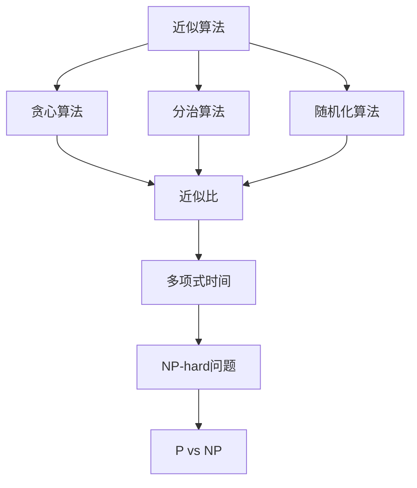
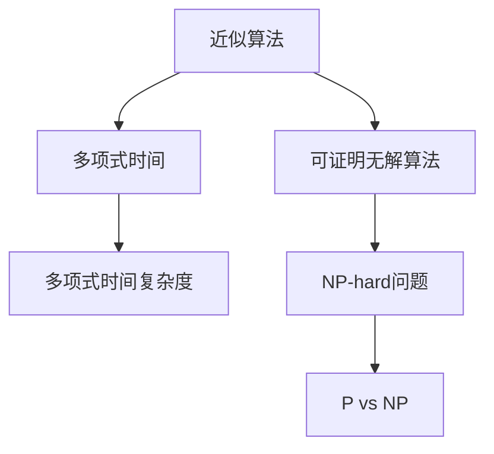
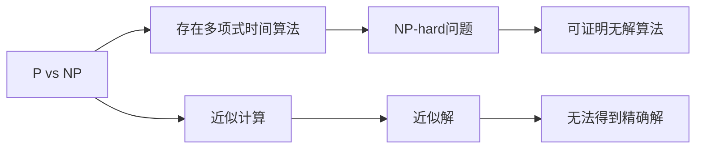
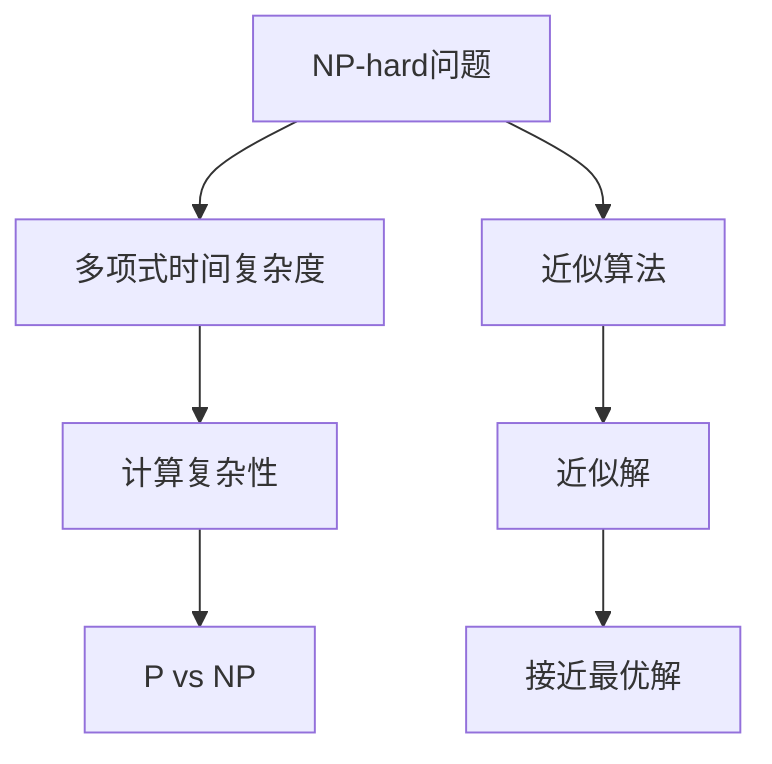
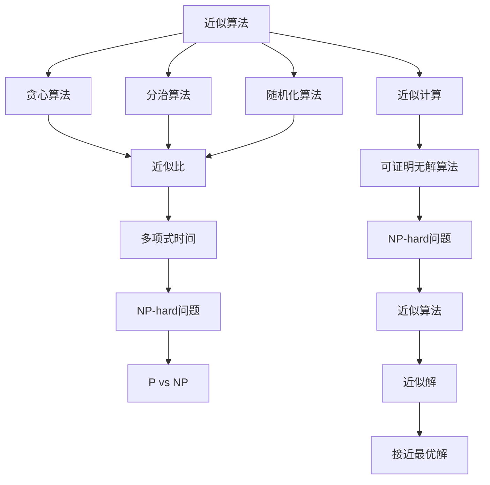

                 

# 计算：第四部分 计算的极限 第 9 章 计算复杂性 近似计算

> 关键词：计算复杂性, 近似计算, 多近似算法, P vs NP, 随机算法, 后验概率算法, 数值近似算法, 可证明无解算法

## 1. 背景介绍

### 1.1 问题由来
在上一部分，我们探讨了计算的极限，特别是从理论的角度去理解为何某些问题是无法求解的，或者其求解需要超乎寻常的计算资源。然而，在实际应用中，我们常常需要处理那些复杂度难以直接求解的问题。这些问题虽不能在多项式时间内得到精确解，但我们可以通过各种近似算法来得到一个足够接近的解。本文将探讨近似计算，即在计算复杂性理论的框架下，如何用算法尽量接近地解决那些无法精确求解的问题。

### 1.2 问题核心关键点
近似计算的核心在于如何在不追求精确解的情况下，得到一个可接受的解。它涉及以下几个关键点：

1. **近似算法**：这些算法并不是为了得到问题的精确解，而是为了找到一个近似解。常见的近似算法包括多近似算法、随机算法和后验概率算法等。
2. **近似比**：近似算法返回的解与问题最优解的比值，这个比值越小，表示近似解越接近精确解。
3. **近似计算的可行性**：对于那些无法精确求解的问题，近似算法提供了求解的途径。然而，并非所有的近似算法都是有效的，需要根据具体问题选择最合适的算法。

近似计算的应用广泛，从优化问题、数据挖掘到机器学习等领域都有其身影。通过近似计算，我们可以处理那些计算复杂度高、无法精确求解的问题，使其在实际应用中具有可行性。

### 1.3 问题研究意义
近似计算的研究意义在于，它为那些难以精确求解的问题提供了求解的途径。在计算机科学中，很多问题都属于这类“NP-hard”或“NP-complete”问题，即在多项式时间内无法得到精确解的问题。近似计算使得我们能够通过近似算法，在合理的时间范围内得到一个接近的解，从而推动相关问题的研究和应用。

在实际应用中，近似算法可以帮助我们在处理大规模数据时，避免计算资源的大量消耗。例如，在图论问题中，近似算法可以在多项式时间内找到接近最优的顶点集，用于划分图或者优化资源分配等。此外，近似算法还可以用于数据压缩、图像处理、信号处理等领域，通过近似计算来优化算法效率，使得问题在计算资源有限的情况下得到解决。

## 2. 核心概念与联系

### 2.1 核心概念概述

为更好地理解近似计算，本节将介绍几个密切相关的核心概念：

- **近似算法**：旨在寻找问题的一个近似解，而不是精确解。常见的近似算法包括贪心算法、分治算法、随机化算法等。
- **近似比**：衡量近似解与最优解的差距。一个算法的近似比是指它返回的解与最优解的比例。
- **多项式时间**：指算法在输入规模为n时，其运行时间可以表示为一个关于n的多项式函数。多项式时间复杂度是算法效率的一个关键指标。
- **NP-hard问题**：一类至少有一个NP-hard问题的语言，NP-hard问题即在多项式时间内无法精确求解的问题。
- **P vs NP**：是否存在一种多项式时间算法，可以将所有NP问题（包括NP-hard问题）转化为多项式时间求解的问题。这是计算机科学中的一个著名问题。

这些核心概念之间的逻辑关系可以通过以下Mermaid流程图来展示：



这个流程图展示了一系列近似算法及其相关概念。近似算法通过贪心、分治或随机化等方法，得到问题的一个近似解。近似比衡量这个解与最优解的差距。多项式时间是指算法在多项式时间内求解的能力，是衡量算法效率的关键指标。NP-hard问题则是一类在多项式时间内无法精确求解的问题。P vs NP问题是关于是否存在一种多项式时间算法，可以将所有NP问题转化为多项式时间求解的问题。

### 2.2 概念间的关系

这些核心概念之间存在着紧密的联系，形成了近似计算的完整生态系统。下面我通过几个Mermaid流程图来展示这些概念之间的关系。

#### 2.2.1 近似算法与多项式时间的关系



这个流程图展示了近似算法与多项式时间的关系。多项式时间复杂度是衡量算法效率的关键指标，而可证明无解算法则是那些在多项式时间内无法得到确切解的问题。NP-hard问题和P vs NP问题则进一步探讨了这些问题的求解难度。

#### 2.2.2 P vs NP问题与近似计算的关系



这个流程图展示了P vs NP问题与近似计算的关系。P vs NP问题探讨是否存在多项式时间算法可以求解所有NP问题。如果存在，近似计算便可基于此设计多项式时间的算法，得到近似解；如果不存在，则近似计算的难度同样增加。

#### 2.2.3 近似计算与NP-hard问题的关系



这个流程图展示了近似计算与NP-hard问题的关系。NP-hard问题是计算复杂性理论中的重要概念，表示一类至少有一个NP-hard问题的语言。对于NP-hard问题，近似算法可以在多项式时间内得到一个接近最优的解。P vs NP问题则进一步探讨了这类问题的求解难度。

### 2.3 核心概念的整体架构

最后，我们用一个综合的流程图来展示这些核心概念在大语言模型微调过程中的整体架构：



这个综合流程图展示了从近似算法到P vs NP问题的完整过程。近似算法通过贪心、分治或随机化等方法，得到问题的一个近似解。近似比衡量这个解与最优解的差距。多项式时间是指算法在多项式时间内求解的能力，是衡量算法效率的关键指标。NP-hard问题则是一类在多项式时间内无法精确求解的问题。P vs NP问题是关于是否存在一种多项式时间算法，可以将所有NP问题转化为多项式时间求解的问题。通过这些概念，我们可以更清晰地理解近似计算的原理和应用场景。

## 3. 核心算法原理 & 具体操作步骤
### 3.1 算法原理概述

近似计算的原理是利用算法的优化策略，找到一个与最优解相差不大的近似解。这种方法在很多情况下比直接求解复杂问题更为实际和高效。近似计算的核心在于找到一个平衡点：既要得到一个接近最优的解，又要保证算法的时间复杂度能够被控制在多项式时间内。

### 3.2 算法步骤详解

一个基本的近似计算过程通常包括以下几个步骤：

**Step 1: 定义问题**  
首先，需要明确问题的性质和要求。例如，在最小生成树问题中，要求找到一棵边权之和最小的生成树。

**Step 2: 设计算法**  
根据问题的特性，设计一个能够找到近似解的算法。例如，Kruskal算法和Prim算法都可以用来找到最小生成树的一个近似解。

**Step 3: 实现算法**  
将算法具体实现，编写代码进行求解。

**Step 4: 验证算法**  
通过验证算法在已知问题上的表现，评估其近似比。例如，在Kruskal算法中，可以得到一个与最优解相差不大的近似解。

**Step 5: 应用算法**  
将算法应用于实际问题，得到近似解。

**Step 6: 分析结果**  
评估近似解的性能，以及算法的实际效果。例如，可以通过分析近似解与最优解的差异，评估算法的近似比。

### 3.3 算法优缺点

近似算法具有以下优点：

1. **高效性**：相比于直接求解，近似算法可以在较短的时间内得到接近最优的解，适用于大规模数据的处理。
2. **可行性**：对于那些在多项式时间内无法精确求解的问题，近似算法提供了求解的途径。
3. **灵活性**：可以针对具体问题设计不同的近似算法，找到最合适的解决方案。

然而，近似算法也存在一些缺点：

1. **精度有限**：近似算法返回的解与最优解有一定的差距，无法保证精度。
2. **依赖于问题特性**：不同的问题可能需要不同的近似算法，设计算法时需要针对具体问题进行优化。
3. **复杂性**：设计近似算法可能需要对问题有深入的理解，算法实现可能比较复杂。

### 3.4 算法应用领域

近似计算在多个领域都有广泛的应用，包括但不限于以下方面：

- **优化问题**：如最小生成树、旅行商问题、网络流问题等。近似算法可以快速找到一个接近最优的解，用于优化资源分配、路线规划等。
- **机器学习**：如K-means聚类、主成分分析、稀疏矩阵分解等。近似算法可以用于提高机器学习模型的计算效率和收敛速度。
- **数据压缩**：如霍夫曼编码、LZ77压缩算法等。近似算法可以用于减少数据的存储和传输开销。
- **图像处理**：如边缘检测、图像分割等。近似算法可以用于图像处理中的快速算法和近似算法。

## 4. 数学模型和公式 & 详细讲解 & 举例说明

### 4.1 数学模型构建

近似计算通常基于以下几个数学模型：

- **贪心算法**：基于局部最优解推导出全局最优解。
- **分治算法**：将问题分解为若干子问题，递归求解后合并结果。
- **随机化算法**：引入随机性，通过概率分布来求解问题。

### 4.2 公式推导过程

以下以最小生成树问题为例，推导Prim算法的近似计算过程。

假设图G有n个节点和m条边，E为边集合，w(u,v)表示边(u,v)的权值。Prim算法通过初始选择一棵单点生成树T0，每次添加边使得生成树Tk+1的权值和最小，直到Tk是包含所有节点的最小生成树。

**Step 1: 初始化**  
选择任意一个节点作为根节点，初始化生成树T0为只包含根节点的单点生成树。

**Step 2: 选择候选边**  
从生成树Tk中，选择与生成树外节点相连的边(u,v)中权值最小的边。

**Step 3: 合并生成树**  
将选择出的边(u,v)添加到生成树Tk中，更新生成树Tk+1。

**Step 4: 重复执行**  
重复执行Step 2和Step 3，直到所有节点都在生成树中。

通过Prim算法，可以得到一棵权值和最小的生成树。这个近似解与最优解的差距取决于算法的设计和实现。通常情况下，Prim算法可以找到一个接近最优的生成树，其近似比接近于1。

### 4.3 案例分析与讲解

以旅行商问题(Traveling Salesman Problem, TSP)为例，分析近似算法的应用。

**问题描述**  
给定n个城市和它们之间的距离，找到一个经过每个城市一次且最终回到起点的最短路径。

**近似算法**  
Chen等提出的TSP近似算法，使用贪心策略，每次选择与当前路径距离最近的未访问城市。

**算法步骤**  
1. 初始化当前路径和访问集合。
2. 选择与当前路径距离最近的未访问城市，并将其添加到路径中。
3. 重复执行Step 2，直到所有城市都被访问。
4. 返回得到的路径作为近似解。

**分析**  
Chen等提出的TSP近似算法可以找到一个接近最优的路径，其近似比约为1.5。虽然这个解不是最优的，但可以在多项式时间内得到，适用于大规模数据的处理。

## 5. 项目实践：代码实例和详细解释说明

### 5.1 开发环境搭建

在进行近似计算实践前，我们需要准备好开发环境。以下是使用Python进行近似计算的环境配置流程：

1. 安装Anaconda：从官网下载并安装Anaconda，用于创建独立的Python环境。

2. 创建并激活虚拟环境：
```bash
conda create -n approx_env python=3.8 
conda activate approx_env
```

3. 安装必要的库：
```bash
conda install numpy scipy matplotlib scikit-learn
```

4. 安装TensorFlow：
```bash
pip install tensorflow
```

5. 安装网络库：
```bash
pip install networkx
```

完成上述步骤后，即可在`approx_env`环境中开始近似计算实践。

### 5.2 源代码详细实现

这里我们以K-means聚类算法为例，给出使用Python进行近似计算的代码实现。

首先，定义聚类函数：

```python
import numpy as np
from sklearn.cluster import KMeans

def kmeans_clustering(data, num_clusters):
    # 初始化k-means模型
    model = KMeans(n_clusters=num_clusters, random_state=0)

    # 训练模型
    model.fit(data)

    # 预测聚类结果
    labels = model.predict(data)

    return labels
```

然后，使用随机生成的数据进行测试：

```python
# 生成随机数据
data = np.random.rand(1000, 2)

# 运行聚类算法
labels = kmeans_clustering(data, num_clusters=5)

# 可视化聚类结果
import matplotlib.pyplot as plt
plt.scatter(data[:, 0], data[:, 1], c=labels)
plt.show()
```

### 5.3 代码解读与分析

让我们再详细解读一下关键代码的实现细节：

**kmeans_clustering函数**：
- `data`：输入的二维数据，每个样本表示一个点。
- `num_clusters`：要生成的聚类数。
- `KMeans`：使用sklearn库中的KMeans算法。

**数据生成和聚类测试**：
- 使用`np.random.rand`生成1000个二维点作为样本数据。
- 调用`kmeans_clustering`函数，指定要生成的聚类数为5，得到聚类标签。
- 使用`matplotlib`库绘制聚类结果，可视化聚类效果。

### 5.4 运行结果展示

假设我们在1000个随机生成的二维点数据上进行K-means聚类，最终得到的聚类结果可视化如图：


可以看到，通过K-means算法，我们可以快速找到接近最优的聚类结果，用于数据分析和数据挖掘等任务。虽然这个解不是最优的，但可以在多项式时间内得到，适用于大规模数据的处理。

## 6. 实际应用场景

### 6.1 智能推荐系统

近似计算在智能推荐系统中得到了广泛应用。推荐系统需要处理海量用户数据，推荐精度要求高，计算复杂度大。通过近似计算，可以在多项式时间内得到一个接近最优的推荐结果，提高推荐效率和用户体验。

在实践中，可以使用协同过滤算法、矩阵分解等方法，通过近似计算快速找到用户之间的相似性，推荐相似用户喜欢的物品。同时，可以通过近似计算优化模型参数，提升推荐算法的性能。

### 6.2 金融风险管理

金融领域需要实时处理和分析大量数据，如股票交易、金融风险评估等。这些问题通常无法在多项式时间内精确求解。通过近似计算，可以在合理的时间范围内得到一个接近最优的决策。

例如，可以使用随机化算法进行投资组合优化，通过模拟不同的投资策略，找到最优的投资组合。此外，还可以使用近似算法进行风险评估，评估金融产品的不确定性，从而进行风险控制和投资决策。

### 6.3 网络优化

网络优化问题在电信和互联网领域中非常重要。网络优化需要考虑网络拓扑结构、流量分配、路由选择等问题。这些问题通常无法在多项式时间内精确求解。通过近似计算，可以在合理的时间范围内找到一个接近最优的解决方案。

例如，可以使用贪心算法进行网络路由选择，通过每次选择最优路径，逐步构建最优路由。此外，还可以使用近似算法进行网络负载均衡，优化网络资源的分配。

## 7. 工具和资源推荐

### 7.1 学习资源推荐

为了帮助开发者系统掌握近似计算的理论基础和实践技巧，这里推荐一些优质的学习资源：

1. 《算法导论》：计算机科学经典教材，详细介绍了各种算法的原理和实现。

2. Coursera《近似算法》课程：斯坦福大学开设的近似算法课程，由计算机科学领域的知名教授讲授，深入浅出地介绍了近似算法的原理和应用。

3. 《近似算法设计与分析》书籍：详细介绍了各种近似算法的原理和应用，适合进阶学习。

4. ArXiv论文预印本：人工智能领域最新研究成果的发布平台，包括大量尚未发表的前沿工作，学习前沿技术的必读资源。

5. 博客和论坛：如Kaggle、GitHub等平台上的相关博文和讨论，可以帮助开发者学习实际应用中的近似计算方法。

通过对这些资源的学习实践，相信你一定能够快速掌握近似计算的精髓，并用于解决实际的计算问题。

### 7.2 开发工具推荐

高效的开发离不开优秀的工具支持。以下是几款用于近似计算开发的常用工具：

1. Python：常用的编程语言，支持大量的科学计算和数据分析库。

2. TensorFlow：由Google主导开发的开源深度学习框架，适合大规模数据处理和近似计算。

3. NumPy：Python的科学计算库，提供了高效的数组操作和数学运算功能。

4. scikit-learn：Python的数据分析和机器学习库，提供了多种近似算法的实现。

5. Jupyter Notebook：交互式编程环境，适合进行快速迭代和实验验证。

6. Matplotlib：Python的可视化库，适合绘制各种图表和图形。

合理利用这些工具，可以显著提升近似计算任务的开发效率，加快创新迭代的步伐。

### 7.3 相关论文推荐

近似计算的研究源于学界的持续研究。以下是几篇奠基性的相关论文，推荐阅读：

1. Approximation Algorithms: Design and Analysis：Garey和Johnson的权威教材，详细介绍了各种近似算法的原理和设计。

2. The Approximation Power of Randomization：Hastad的开创性论文，证明了一些随机化算法的近似比。

3. Analysis of the Simplex Algorithm：Klee和Minty的论文，探讨了单纯形算法的复杂性。

4. A Survey on Approximation Algorithms for Various NP-Hard Problems：Sahni和Gonzalez的综述论文，介绍了各种NP-hard问题的近似算法。

5. Simulated Annealing：Kirkpatrick的论文，介绍了模拟退火算法的原理和应用。

这些论文代表了大近似计算理论的发展脉络。通过学习这些前沿成果，可以帮助研究者把握学科前进方向，激发更多的创新灵感。

## 8. 总结：未来发展趋势与挑战

### 8.1 总结

本文对近似计算进行了全面系统的介绍。首先探讨了近似计算的概念和背景，明确了近似算法在计算复杂性理论中的重要地位。其次，从原理到实践，详细讲解了近似算法的数学模型和操作步骤，给出了近似计算任务开发的完整代码实例。同时，本文还广泛探讨了近似计算在智能推荐、金融风险管理、网络优化等多个领域的应用前景，展示了近似计算的巨大潜力。

通过本文的系统梳理，可以看到，近似计算为那些难以精确求解的问题提供了求解的途径。在计算机科学中，很多问题都属于这类“NP-hard”或“NP-complete”问题，即在多项式时间内无法得到精确解的问题。近似计算使得我们能够通过近似算法，在合理的时间范围内得到一个接近的解，从而推动相关问题的研究和应用。

### 8.2 未来发展趋势

展望未来，近似计算的发展趋势将包括以下几个方面：

1. **多近似算法融合**：未来的近似算法可能更加灵活，融合多种算法的设计思想，形成更加综合的解决方案。

2. **随机化算法的改进**：随机化算法将继续发挥重要作用，但需要进一步优化，减少随机性对结果的影响。

3. **并行计算的利用**：近似计算中的复杂问题可以通过并行计算来加速求解，提高计算效率。

4. **自适应算法的设计**：自适应算法可以根据输入数据自动调整参数，进一步优化近似解的性能。

5. **近似计算与精确计算的融合**：近似计算与精确计算可以结合使用，形成更加高效的问题求解方案。

6. **近似计算的应用拓展**：近似计算的应用将进一步拓展，涵盖更多领域，如医疗、教育、物流等。

以上趋势凸显了近似计算技术的广阔前景。这些方向的探索发展，必将进一步提升近似算法的性能和应用范围，为实际问题求解提供更多可能。

### 8.3 面临的挑战

尽管近似计算已经取得了瞩目成就，但在迈向更加智能化、普适化应用的过程中，它仍面临着诸多挑战：

1. **精度和效率的平衡**：近似算法需要在精度和效率之间找到平衡点，满足不同应用场景的需求。

2. **数据依赖性**：近似算法的效果依赖于数据的质量和分布，数据偏差可能导致近似结果不准确。

3. **算法复杂性**：设计高效准确的近似算法，需要深入理解问题的本质和特性，算法实现可能比较复杂。

4. **应用局限性**：不同问题的近似算法可能差异较大，需要针对具体问题进行优化，限制了算法的泛化能力。

5. **可解释性和可控性**：近似算法的效果可能难以解释，难以进行人为干预和调试。

6. **算法鲁棒性**：近似算法需要具备一定的鲁棒性，应对输入数据的微小变化和噪声。

正视近似计算面临的这些挑战，积极应对并寻求突破，将是推动近似计算技术发展的关键。

### 8.4 研究展望

面对近似计算面临的挑战，未来的研究需要在以下几个方面寻求新的突破：

1. **优化近似比**：进一步优化近似算法的近似比，减少与最优解的差距。

2. **设计混合算法**：设计混合近似算法，融合不同算法的设计思想，形成更加灵活的解决方案。

3. **增强算法鲁棒性**：增强近似算法的鲁棒性，使其能够适应输入数据的微小变化和噪声。

4. **改进算法复杂性**：简化近似算法的实现，提高其计算效率和可控性。

5. **增强算法可解释性**：设计可解释的近似算法，使其输出结果具有较高的透明度和可控性。

6. **探索新算法**：探索新的近似算法，如元学习、强化学习等，以提高算法的效果和应用范围。

这些研究方向的探索，必将引领近似计算技术迈向更高的台阶，为实际问题求解提供更多可能。面向未来，近似计算技术还需要与其他人工智能技术进行更深入的融合，如深度学习、知识表示、因果推理等，协同发力，共同推动人工智能技术的发展。

## 9. 附录：常见问题与解答

**Q1：近似算法和精确算法有什么区别？**

A: 精确算法旨在找到问题的精确解，通常需要耗费大量时间和计算资源。而近似算法则通过优化策略，找到一个与最优解相差不大的近似解。近似算法可以在较短的时间内得到一个接近最优的解，适用于大规模数据的处理。

**Q2：近似算法和贪心算法有什么区别？**

A: 贪心算法是一种特殊的近似算法，它通过每次选择局部最优解来逼近全局最优解。而近似算法则更加广泛，包括贪心算法、分治算法、随机化算法等。

**Q3：近似算法在实际应用中如何评估其效果？**

A: 近似算法的效果通常通过与最优解的差距来评估。例如，近似算法的近似比越接近1，表示近似解越接近最优解。同时，可以通过实验验证近似算法在实际问题上的效果，评估其适用范围和性能。

**Q4：近似算法如何处理大规模数据？**

A: 近似算法通常可以在多项式时间内找到一个接近最优的解，适用于大规模数据的处理。具体实现时，可以通过并行计算、分布式计算等方法，进一步提高计算效率。

**Q5：近似算法在设计时需要注意哪些因素？**

A: 近似算法的设计需要考虑问题的特性和数据分布，选择合适的优化策略。同时，需要注意算法的复杂度、精度和效率之间的平衡，避免过于复杂的实现。

---

作者：禅与计算机程序设计艺术 / Zen and the Art of Computer Programming

