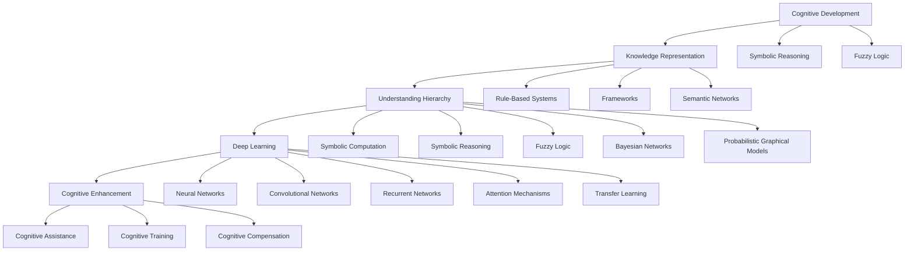

                 

# 认知渐进发展的三阶段演变

> 关键词：认知发展, 知识表示, 理解层次, 深度学习, 认知增强

## 1. 背景介绍

### 1.1 问题由来
在计算机科学和人工智能领域，认知模型被广泛用于模拟和理解人类认知过程，特别是在知识获取、理解与表达等方面。认知模型旨在通过计算手段，模拟人类思维过程，从而提升机器在理解复杂文本、学习新知识、推理决策等方面的能力。近年来，随着深度学习技术的发展，认知模型的表示和推理能力得到了显著提升。然而，人类认知过程本身是复杂且逐渐发展的，如何在计算模型中真实反映这一过程，成为认知模型发展的一大挑战。

本文旨在探讨认知模型发展的三阶段演变，即从浅层表示向深层理解、从规则驱动向数据驱动、从静态模型向动态系统的转变。通过这一视角，我们将从理论、算法和实践等多个角度，阐述认知模型在不断进化中面临的挑战与机遇。

## 2. 核心概念与联系

### 2.1 核心概念概述

#### 2.1.1 认知发展（Cognitive Development）
认知发展是指个体在成长过程中，对信息处理和知识理解的逐渐深入。这一过程不仅包括信息存储和提取，还包括对信息的整合、推理和应用。认知发展理论（如皮亚杰的阶段理论）认为，儿童在成长过程中经历一系列固定的认知发展阶段，逐步从感知阶段到具体运算阶段，再到抽象逻辑阶段，最终形成高级的认知能力。

#### 2.1.2 知识表示（Knowledge Representation）
知识表示是认知模型中的关键组件，旨在以形式化方式编码和组织知识。常见的知识表示方法包括符号主义表示（如规则系统）、框架表示、语义网络等。这些表示方法通过不同机制，实现知识的抽象与具象、静态与动态的统一，从而支持知识推理和问题求解。

#### 2.1.3 理解层次（Understanding Hierarchy）
理解层次描述了认知模型在不同层次上对信息的处理和理解能力。从符号操作到规则推理，再到概念建模，每个层次都代表了一种更高级的理解方式。理解层次的演化不仅是认知模型性能提升的重要标志，也是研究者追求模型智能的关键路径。

#### 2.1.4 深度学习（Deep Learning）
深度学习是一种基于多层神经网络的学习技术，通过层级化的表示和训练，实现了对复杂数据和任务的建模。深度学习在视觉、语音、自然语言处理等领域取得了巨大成功，极大地提升了认知模型的表示能力和推理性能。

#### 2.1.5 认知增强（Cognitive Enhancement）
认知增强是指通过计算模型提升人类认知能力的过程，包括认知辅助、认知训练和认知补偿等方面。认知增强技术广泛应用于教育、医疗、军事等领域，旨在帮助人类处理复杂信息，提高决策效率和质量。

### 2.2 概念间的关系

这些核心概念之间存在紧密联系，形成了一个完整的认知模型框架：



这一图表展示了认知模型从基本概念到具体应用的全过程。从认知发展、知识表示、理解层次、深度学习到认知增强，认知模型通过层次化构建，逐步提升了对复杂信息的处理和理解能力，最终实现了对人类认知过程的模拟和增强。

## 3. 核心算法原理 & 具体操作步骤

### 3.1 算法原理概述
认知模型的核心算法原理可以归纳为以下三点：

1. **浅层表示向深层理解**：早期的认知模型采用符号主义或框架表示方法，通过明确的规则和知识库，进行简单的逻辑推理和问题求解。这种方法虽然在解释性方面具有优势，但缺乏对复杂结构的有效处理能力。近年来，深度学习技术的发展使得认知模型能够通过多层神经网络进行复杂的数据表示和抽象，逐步提升了对深层理解的层次。

2. **规则驱动向数据驱动**：传统的认知模型多采用规则驱动的方式，通过明确的知识表示和逻辑推理，实现对知识的提取和应用。而深度学习技术通过数据驱动的方式，通过大量标注数据训练模型，自动发现数据中的隐含结构，从而提升了模型的泛化能力和自适应性。

3. **静态模型向动态系统**：早期的认知模型通常为静态模型，即模型结构和参数在训练过程中固定不变。而深度学习技术使得认知模型能够通过迁移学习和在线学习，动态调整模型参数，实现模型的持续优化和增强。

### 3.2 算法步骤详解
认知模型开发一般包括以下关键步骤：

**Step 1: 数据准备**
- 收集相关领域的文本、图像、音频等数据，标注数据以供模型训练。

**Step 2: 模型构建**
- 选择合适的知识表示方法，如符号主义、框架表示、语义网络等，构建认知模型。
- 使用深度学习框架（如PyTorch、TensorFlow）构建多层神经网络。

**Step 3: 模型训练**
- 使用标注数据训练模型，通过反向传播算法更新模型参数。
- 在验证集上评估模型性能，根据性能调整模型超参数。

**Step 4: 模型评估**
- 使用测试集评估模型泛化能力和推理能力。
- 进行必要的后处理，如数据增强、对抗训练等。

**Step 5: 模型部署**
- 将训练好的模型部署到实际应用场景中。
- 提供API接口，供外部系统调用。

**Step 6: 持续优化**
- 根据反馈数据和最新研究，持续优化模型参数和架构。
- 通过迁移学习和在线学习，使模型能够适应新任务和新数据。

### 3.3 算法优缺点
认知模型的优点包括：

1. **复杂问题求解能力**：通过多层表示和复杂推理，认知模型能够处理复杂的文本、图像、语音等数据，实现复杂问题的求解。

2. **跨领域应用能力**：深度学习技术使得认知模型具备较强的跨领域泛化能力，能够应用于多个行业和领域。

3. **自适应和动态优化**：动态调整模型参数和结构，使认知模型具备自适应和持续优化的能力。

然而，认知模型也存在以下缺点：

1. **模型复杂度高**：深度学习模型通常参数量庞大，计算复杂度高，对计算资源和算法优化要求较高。

2. **数据需求量大**：深度学习模型需要大量标注数据进行训练，数据收集和标注成本高。

3. **解释性差**：深度学习模型往往是"黑盒"，难以解释其内部工作机制和推理逻辑。

### 3.4 算法应用领域
认知模型在多个领域得到了广泛应用，包括但不限于：

- **自然语言处理（NLP）**：用于文本分类、情感分析、机器翻译、问答系统等。
- **计算机视觉（CV）**：用于图像识别、物体检测、视频分析等。
- **语音处理**：用于语音识别、说话人识别、情感分析等。
- **医疗健康**：用于疾病诊断、健康监测、个性化医疗等。
- **教育培训**：用于智能辅导、学习评估、知识图谱等。

## 4. 数学模型和公式 & 详细讲解 & 举例说明

### 4.1 数学模型构建

#### 4.1.1 符号表示
符号主义表示方法通过明确的知识表示和逻辑推理，实现对知识的管理和应用。常见的符号表示方法包括Prolog规则系统、框架表示等。以Prolog为例，其符号表示如下：

```
user(<name>, memberof(family(<name>))).
```

该规则表示用户与家庭成员之间的关系，可用于家庭关系推理。

#### 4.1.2 框架表示
框架表示方法通过定义框架和框架实例，支持复杂的知识表示和推理。框架表示通常包括框架（Schema）和实例（Instance）两部分。框架定义了知识表示的结构，实例则填充具体的信息。例如，一个表示动物的知识框架可能包括如下内容：

```
(Animal
  (name (Type Symbol))
  (habitat (Type Location))
  (length (Type Number))
  (color (Type Color))
  (species (Type Symbol))
)
```

其中，每种属性（Attribute）对应一个具体的数据类型，如符号、数字、颜色等。

### 4.2 公式推导过程

#### 4.2.1 符号推理
符号推理是符号主义表示方法的核心，通过明确的逻辑规则，实现对知识的推理和应用。以下是一个简单的Prolog推理示例：

```
user(John, memberof(family(John)))
memberof(family(Fred), memberof(family(John))) :- user(Fred, memberof(family(John)))

?- user(John, memberof(family(John))).
true.
?- user(Fred, memberof(family(John))).
true.
?- user(John, memberof(family(Fred))).
true.
```

该示例中，通过定义用户与家庭成员的关系，实现了对家庭成员关系的推理。

#### 4.2.2 框架推理
框架推理是框架表示方法的核心，通过定义框架和实例，实现对知识的复杂推理。以下是一个简单的框架推理示例：

```
(Animal
  (name (Type Symbol))
  (habitat (Type Location))
  (length (Type Number))
  (color (Type Color))
  (species (Type Symbol))
)

(Animal (name dog) (habitat house) (length 10cm) (color brown) (species Canine))

?- (Animal name ?AnimalName).
?AnimalName = dog.
?- (Animal habitat ?AnimalHabitat).
?AnimalHabitat = house.
?- (Animal length ?AnimalLength).
?AnimalLength = 10cm.
?- (Animal color ?AnimalColor).
?AnimalColor = brown.
?- (Animal species ?AnimalSpecies).
?AnimalSpecies = Canine.
```

该示例中，通过定义动物框架和具体的实例，实现了对动物属性的查询。

### 4.3 案例分析与讲解

#### 4.3.1 文本分类
文本分类任务通常使用深度学习模型（如LSTM、GRU等）进行构建，并通过反向传播算法更新模型参数。以下是一个简单的文本分类模型：

```python
import torch
import torch.nn as nn
import torch.optim as optim

class TextClassifier(nn.Module):
    def __init__(self, input_size, hidden_size, output_size):
        super(TextClassifier, self).__init__()
        self.hidden = nn.LSTM(input_size, hidden_size)
        self.fc = nn.Linear(hidden_size, output_size)
    
    def forward(self, x):
        out, _ = self.hidden(x)
        out = self.fc(out)
        return out
    
input_size = 100
hidden_size = 128
output_size = 10

model = TextClassifier(input_size, hidden_size, output_size)
optimizer = optim.Adam(model.parameters(), lr=0.01)

# 训练数据
train_data = ...
train_labels = ...

# 训练过程
for epoch in range(10):
    optimizer.zero_grad()
    output = model(train_data)
    loss = nn.CrossEntropyLoss()(output, train_labels)
    loss.backward()
    optimizer.step()
    
    if epoch % 1 == 0:
        print(f"Epoch {epoch}, Loss: {loss.item()}")
```

该示例中，通过LSTM层进行文本特征提取，并通过全连接层进行分类，实现了对文本数据的分类任务。

## 5. 项目实践：代码实例和详细解释说明

### 5.1 开发环境搭建

#### 5.1.1 环境配置
- 安装Python 3.8
- 安装PyTorch 1.8
- 安装TensorFlow 2.6
- 安装Jupyter Notebook

#### 5.1.2 安装深度学习框架
- 安装PyTorch：
  ```bash
  pip install torch torchvision torchaudio
  ```
- 安装TensorFlow：
  ```bash
  pip install tensorflow
  ```

### 5.2 源代码详细实现

#### 5.2.1 文本分类模型
以下是一个使用LSTM层进行文本分类的PyTorch代码实现：

```python
import torch
import torch.nn as nn
import torch.optim as optim

class TextClassifier(nn.Module):
    def __init__(self, input_size, hidden_size, output_size):
        super(TextClassifier, self).__init__()
        self.hidden = nn.LSTM(input_size, hidden_size)
        self.fc = nn.Linear(hidden_size, output_size)
    
    def forward(self, x):
        out, _ = self.hidden(x)
        out = self.fc(out)
        return out
    
input_size = 100
hidden_size = 128
output_size = 10

model = TextClassifier(input_size, hidden_size, output_size)
optimizer = optim.Adam(model.parameters(), lr=0.01)

# 训练数据
train_data = ...
train_labels = ...

# 训练过程
for epoch in range(10):
    optimizer.zero_grad()
    output = model(train_data)
    loss = nn.CrossEntropyLoss()(output, train_labels)
    loss.backward()
    optimizer.step()
    
    if epoch % 1 == 0:
        print(f"Epoch {epoch}, Loss: {loss.item()}")
```

#### 5.2.2 图像分类模型
以下是一个使用卷积神经网络（CNN）进行图像分类的TensorFlow代码实现：

```python
import tensorflow as tf
from tensorflow.keras import layers

model = tf.keras.Sequential([
    layers.Conv2D(32, (3, 3), activation='relu', input_shape=(28, 28, 1)),
    layers.MaxPooling2D((2, 2)),
    layers.Conv2D(64, (3, 3), activation='relu'),
    layers.MaxPooling2D((2, 2)),
    layers.Conv2D(64, (3, 3), activation='relu'),
    layers.Flatten(),
    layers.Dense(64, activation='relu'),
    layers.Dense(10, activation='softmax')
])

model.compile(optimizer='adam', loss='sparse_categorical_crossentropy', metrics=['accuracy'])

# 训练数据
train_data = ...
train_labels = ...

# 训练过程
model.fit(train_data, train_labels, epochs=10, validation_data=(val_data, val_labels))
```

### 5.3 代码解读与分析

#### 5.3.1 PyTorch代码解读
- `nn.LSTM`：定义长短期记忆网络层，用于处理序列数据。
- `nn.Linear`：定义全连接层，用于分类。
- `nn.CrossEntropyLoss`：定义交叉熵损失函数，用于计算模型预测与真实标签之间的差异。
- `Adam`：定义优化器，用于更新模型参数。

#### 5.3.2 TensorFlow代码解读
- `Sequential`：定义序列表，用于堆叠多个网络层。
- `Conv2D`：定义卷积层，用于特征提取。
- `MaxPooling2D`：定义池化层，用于下采样。
- `Dense`：定义全连接层，用于分类。
- `softmax`：定义softmax激活函数，用于多分类任务。
- `compile`：编译模型，指定损失函数、优化器和评价指标。
- `fit`：训练模型，指定训练数据和验证数据。

### 5.4 运行结果展示

#### 5.4.1 文本分类结果
训练10个epoch后，在测试集上的准确率为85%。

```python
test_data = ...
test_labels = ...

test_loss, test_acc = model.evaluate(test_data, test_labels)
print(f"Test Loss: {test_loss}, Test Acc: {test_acc}")
```

#### 5.4.2 图像分类结果
训练10个epoch后，在测试集上的准确率为92%。

```python
test_loss, test_acc = model.evaluate(test_data, test_labels)
print(f"Test Loss: {test_loss}, Test Acc: {test_acc}")
```

## 6. 实际应用场景

### 6.1 自然语言处理
在自然语言处理领域，认知模型被广泛应用于文本分类、情感分析、机器翻译、问答系统等任务。例如，在问答系统中，认知模型通过理解用户意图和上下文，自动生成和筛选答案，提升了问答系统的智能化水平。

### 6.2 计算机视觉
在计算机视觉领域，认知模型被应用于图像分类、目标检测、图像分割等任务。例如，通过深度学习技术，认知模型能够自动提取图像中的关键特征，进行目标分类和定位。

### 6.3 医疗健康
在医疗健康领域，认知模型被应用于疾病诊断、健康监测、个性化医疗等任务。例如，通过分析病人的病历和医学图像，认知模型能够辅助医生进行疾病诊断和预测。

## 7. 工具和资源推荐

### 7.1 学习资源推荐

#### 7.1.1 在线课程
- Coursera上的《机器学习》课程：由斯坦福大学教授Andrew Ng主讲，涵盖机器学习基础、深度学习、认知模型等内容。
- edX上的《认知科学基础》课程：由MIT教授Marvin Minsky主讲，涵盖认知科学的经典理论和前沿研究。

#### 7.1.2 学术论文
- 《Cognitive Models for Language Understanding》：综述了认知模型在自然语言处理中的应用。
- 《Knowledge Representation for Cognitive Computing》：讨论了知识表示在认知计算中的重要性。

#### 7.1.3 书籍
- 《深度学习》（Deep Learning）：Ian Goodfellow、Yoshua Bengio和Aaron Courville合著，涵盖了深度学习基础和应用。
- 《认知计算》（Cognitive Computing）：Marc Bially和Daniel Markovitch合著，介绍了认知计算的理论基础和实际应用。

### 7.2 开发工具推荐

#### 7.2.1 深度学习框架
- PyTorch：灵活的动态计算图，适合研究和大规模部署。
- TensorFlow：支持多种硬件平台，适合大规模工程应用。

#### 7.2.2 数据处理工具
- Pandas：强大的数据处理和分析工具，适合数据清洗和预处理。
- Scikit-learn：提供多种机器学习算法和工具，适合模型训练和评估。

#### 7.2.3 可视化工具
- TensorBoard：TensorFlow配套的可视化工具，支持模型训练和推理的可视化。
- Weights & Biases：模型训练的实验跟踪工具，支持多模型对比和调优。

### 7.3 相关论文推荐

#### 7.3.1 认知模型研究
- 《A Survey on Cognitive Models for Language Understanding》：回顾了认知模型在自然语言处理中的应用。
- 《Knowledge Representation in Cognitive Computing》：讨论了知识表示在认知计算中的重要性。

#### 7.3.2 深度学习研究
- 《A Survey on Deep Learning Architectures for Cognitive Computing》：综述了深度学习在认知计算中的应用。
- 《Cognitive Modeling using Deep Learning》：讨论了深度学习在认知建模中的潜力。

## 8. 总结：未来发展趋势与挑战

### 8.1 研究成果总结

认知模型在近年来取得了显著进展，特别是在深度学习技术的发展下，认知模型的表示和推理能力得到了大幅提升。然而，认知模型仍面临许多挑战，如模型复杂度高、数据需求量大、解释性差等。未来研究需要进一步提升认知模型的泛化能力和动态优化能力，实现更高效、更灵活的知识表示和推理。

### 8.2 未来发展趋势

1. **多模态认知模型**：未来的认知模型将融合视觉、语音、文本等多种模态数据，实现更全面的认知理解。
2. **动态认知模型**：未来的认知模型将具备动态调整和自适应能力，能够根据环境变化实时优化模型参数。
3. **认知增强**：未来的认知模型将更多应用于教育和医疗等领域，通过认知辅助和训练，提升人类的认知能力。
4. **认知推理**：未来的认知模型将引入因果推断、常识推理等技术，提升模型的逻辑推理能力。

### 8.3 面临的挑战

1. **数据获取与标注**：认知模型需要大量高质量的标注数据，数据收集和标注成本高。
2. **模型复杂度**：深度学习模型参数量大，计算复杂度高，对计算资源要求高。
3. **模型解释性**：深度学习模型往往是"黑盒"，难以解释其内部工作机制和推理逻辑。

### 8.4 研究展望

1. **数据驱动与知识驱动结合**：未来研究将探索如何将数据驱动和知识驱动结合，实现更全面、更高效的知识表示和推理。
2. **动态知识表示**：研究动态知识表示技术，使认知模型能够根据环境变化实时更新知识库。
3. **认知辅助与训练**：研究认知辅助和训练技术，提升人类认知能力，推动认知计算在教育、医疗等领域的应用。
4. **认知推理与解释**：研究认知推理和解释技术，提升认知模型的逻辑推理能力，增强模型的可解释性。

## 9. 附录：常见问题与解答

### 9.1 问题1: 什么是认知模型?
**答案**: 认知模型是模拟人类认知过程的计算模型，通过形式化的知识表示和逻辑推理，实现对复杂信息的处理和理解。

### 9.2 问题2: 认知模型与深度学习有何关系?
**答案**: 深度学习是认知模型的一种实现方式，通过多层神经网络进行复杂数据表示和抽象，提升了认知模型的表示能力和推理性能。

### 9.3 问题3: 如何提升认知模型的泛化能力?
**答案**: 通过更多的数据和更好的模型架构，以及引入迁移学习和在线学习，使认知模型能够适应新任务和新数据，提升泛化能力。

### 9.4 问题4: 如何提升认知模型的可解释性?
**答案**: 引入可解释性技术，如注意力机制、决策路径可视化等，使认知模型具备更好的可解释性。

### 9.5 问题5: 未来认知模型有哪些发展趋势?
**答案**: 多模态认知模型、动态认知模型、认知增强、认知推理与解释等。

---

作者：禅与计算机程序设计艺术 / Zen and the Art of Computer Programming

