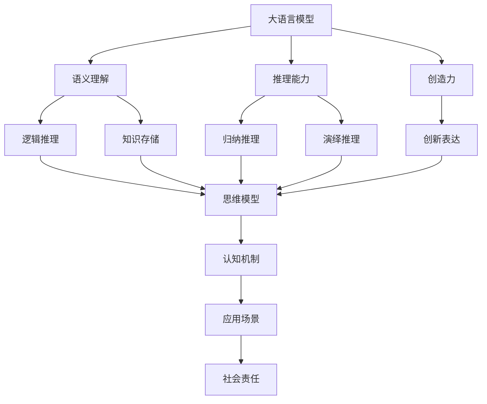

                 

# 语言与思维的差异：大模型的认知困惑

## 1. 背景介绍

### 1.1 问题由来
语言是人类社会交流的工具，而思维则是语言背后的逻辑。在大模型时代，我们不仅要考虑如何使计算机理解和生成自然语言，还需要探讨其背后的思维逻辑是否与人类思维一致。大模型通过大量无标签文本数据的预训练，具备了较强的语言生成和理解能力，但这种能力是否等同于人类认知能力？在实际应用中，大模型的输出是否符合人类思维习惯？这些问题的探索，将帮助我们更深入地理解大模型的认知机制，推动其向更广泛的应用场景扩展。

### 1.2 问题核心关键点
语言模型和思维模型的本质差异主要体现在以下几个方面：

1. **语义理解与语义逻辑**：大模型虽然能够理解自然语言的语义，但这种理解是否符合人类认知逻辑，是否能够进行复杂的推理和推断？

2. **上下文依赖与情境感知**：大模型在生成文本时是否能够充分考虑上下文信息，是否能够根据不同的情境生成不同的输出？

3. **语言生成与创造力**：大模型生成的文本是否具有创新性，是否能够产生新的表达方式和思想？

4. **知识存储与检索**：大模型是否能够存储和检索知识，是否能够基于知识进行推理和生成？

5. **伦理道德与社会责任感**：大模型在生成内容时是否会考虑伦理道德和社会影响，是否具有社会责任感？

这些问题涉及到大模型在语言和思维上的认知差异，需要通过系统的研究来回答。本文将深入探讨这些差异，分析大模型在语言生成、推理、创造力等方面的表现，并讨论其在应用中的伦理和社会责任问题。

### 1.3 问题研究意义
研究大模型与思维模型之间的差异，对于提升大模型的认知能力、优化其应用场景、增强其伦理和社会责任感具有重要意义：

1. **认知能力提升**：通过深入理解大模型的认知机制，可以进一步提升其语义理解、推理和创造力等高级认知能力。

2. **应用场景优化**：了解大模型与思维模型的差异，有助于设计更符合人类思维习惯的应用场景，提升用户体验和应用效果。

3. **伦理与社会责任**：在大模型的输出中考虑伦理和社会责任问题，可以避免其生成有害内容，确保其对社会的影响是积极和有益的。

## 2. 核心概念与联系

### 2.1 核心概念概述

在大模型与思维模型差异的研究中，需要引入以下核心概念：

- **大语言模型(Large Language Models, LLMs)**：通过自回归或自编码模型进行预训练，具备丰富的语言知识和常识，能够理解和生成自然语言。如GPT、BERT等。
- **思维模型(Mind Models)**：描述人类思维活动的模型，包括逻辑推理、知识存储和检索等。
- **语义理解**：理解自然语言的含义，包括词义、句法和语境等。
- **推理能力**：基于已知知识进行推断，得出新的结论或答案。
- **创造力**：生成新的表达方式、思想和概念，展示独特的思维能力。
- **伦理道德与社会责任**：在生成内容时考虑伦理道德问题，确保输出的正确性和安全性。

这些概念之间的联系可以通过以下Mermaid流程图来展示：



这个流程图展示了语言模型与思维模型在语义理解、推理、创造力等不同方面的联系，以及如何通过这些联系构建认知机制和应用场景，并在其中考虑伦理和社会责任问题。

### 2.2 概念间的关系

这些核心概念之间存在着紧密的联系，形成了认知差异研究的完整生态系统。下面是几个关键概念之间的联系：

- **语义理解**：大语言模型通过预训练学习到语言的通用表示，而思维模型则通过逻辑推理和知识存储来理解语言的深层含义。
- **推理能力**：大语言模型虽然在推理方面有所欠缺，但可以通过微调和提示学习等技术提升其推理能力，使其更接近思维模型的推理方式。
- **创造力**：大语言模型能够生成新颖的文本和表达方式，但这种创造力是否等同于思维模型的创造性思维，还需要进一步探讨。
- **伦理道德与社会责任**：大语言模型在生成内容时，需要考虑伦理道德问题，避免生成有害或误导性的信息，确保社会责任。

这些概念的联系和大模型的认知机制需要进一步深入研究，以便更好地理解和应用大模型。

## 3. 核心算法原理 & 具体操作步骤

### 3.1 算法原理概述

大模型的认知困惑主要体现在其对语义理解、推理、创造力和伦理道德的处理上。本文将通过数学模型和具体案例来详细分析这些问题。

首先，我们定义大模型的认知能力为 $C_{LM}$，其中 $C$ 表示认知能力，$LM$ 表示大语言模型。其认知能力 $C_{LM}$ 可以分解为以下几个子能力：

1. **语义理解能力**：$U_{LM}$，指大语言模型对自然语言的理解能力。
2. **推理能力**：$R_{LM}$，指大语言模型基于已知信息进行推理的能力。
3. **创造力**：$C_{LM}$，指大语言模型生成新文本和表达方式的能力。
4. **伦理道德与社会责任**：$E_{LM}$，指大语言模型在生成内容时考虑伦理道德问题，确保社会责任。

这些子能力可以通过相应的数学模型和算法进行分析和优化。

### 3.2 算法步骤详解

**Step 1: 准备数据集**
- 收集包含大量文本数据的数据集，如大规模新闻、小说、百科等。
- 将数据集划分为训练集、验证集和测试集。

**Step 2: 构建大语言模型**
- 选择合适的预训练模型，如BERT、GPT等。
- 在预训练模型基础上进行微调或提示学习，优化其认知能力。

**Step 3: 训练模型**
- 在训练集上对模型进行有监督训练，提升其认知能力。
- 在验证集上评估模型性能，调整训练参数。

**Step 4: 评估模型**
- 在测试集上评估模型性能，分析其认知能力的各项指标。
- 分析模型在语义理解、推理、创造力等方面的表现。

**Step 5: 优化模型**
- 根据评估结果，优化模型参数，提升其认知能力。
- 调整提示或微调策略，增强模型的推理和创造力。

**Step 6: 伦理与社会责任评估**
- 对模型输出的内容进行伦理和社会责任评估，确保其符合社会价值观。
- 设计安全机制，避免有害内容的生成。

### 3.3 算法优缺点

大语言模型的认知困惑研究具有以下优点：

1. **提升认知能力**：通过分析模型在语义理解、推理、创造力等方面的表现，可以提升大模型的高级认知能力。
2. **优化应用场景**：了解大模型与思维模型的差异，有助于设计更符合人类思维习惯的应用场景，提升用户体验和应用效果。
3. **伦理与社会责任**：在生成内容时考虑伦理道德问题，可以避免有害内容的生成，确保其对社会的影响是积极和有益的。

同时，这种研究也存在以下缺点：

1. **计算资源消耗大**：分析大模型的认知能力需要大量的计算资源和数据集。
2. **评估复杂**：认知能力的各项指标难以全面评估，存在主观性。
3. **结果可解释性差**：大模型的内部机制复杂，其认知能力难以全面解释。

尽管存在这些缺点，但大模型与思维模型认知差异的研究对于提升大模型的认知能力、优化应用场景、增强其伦理和社会责任感具有重要意义。

### 3.4 算法应用领域

大模型与思维模型认知差异的研究在以下几个领域具有广泛应用：

1. **自然语言处理(NLP)**：研究大语言模型在语义理解、推理、创造力等方面的表现，优化NLP应用场景。
2. **人工智能伦理与安全性**：评估大模型生成的内容是否符合伦理道德，增强其社会责任感。
3. **多模态认知模型**：研究多模态数据对大模型认知能力的影响，提升其在图像、语音等领域的理解能力。

## 4. 数学模型和公式 & 详细讲解  
### 4.1 数学模型构建

为了更好地分析大模型的认知能力，我们可以构建数学模型来描述其认知过程。

假设大语言模型在输入 $x$ 上的输出为 $y$，其中 $x$ 表示自然语言文本，$y$ 表示模型生成的文本。大语言模型的认知能力 $C_{LM}$ 可以通过以下数学模型描述：

$$
C_{LM} = U_{LM} + R_{LM} + C_{LM} + E_{LM}
$$

其中 $U_{LM}$、$R_{LM}$、$C_{LM}$ 和 $E_{LM}$ 分别表示大语言模型的语义理解能力、推理能力、创造力和伦理道德与社会责任。

- **语义理解能力** $U_{LM}$：
  - 定义为模型对输入 $x$ 的理解能力，可以通过对比模型对正确和错误输入的预测概率来评估。
  - 评估公式：
    $$
    U_{LM} = \frac{P(\hat{x}|x)}{P(\hat{x}|x')} \times \frac{P(x')}{P(x)}
    $$
    其中 $P(\hat{x}|x)$ 表示模型对输入 $x$ 的预测概率，$P(x')$ 表示模型对错误输入 $x'$ 的概率。

- **推理能力** $R_{LM}$：
  - 定义为模型基于已知信息进行推理的能力，可以通过评估模型对推理问题的正确率来评估。
  - 评估公式：
    $$
    R_{LM} = \frac{1}{n} \sum_{i=1}^n I(y_i = \hat{y}_i)
    $$
    其中 $I(y_i = \hat{y}_i)$ 表示模型在推理问题 $i$ 上输出的正确率。

- **创造力** $C_{LM}$：
  - 定义为模型生成新文本和表达方式的能力，可以通过评估模型生成的文本与训练数据中的文本的差异来评估。
  - 评估公式：
    $$
    C_{LM} = \frac{1}{m} \sum_{j=1}^m D(x_j, \hat{x}_j)
    $$
    其中 $D(x_j, \hat{x}_j)$ 表示模型生成的文本 $x_j$ 与训练数据中对应文本 $\hat{x}_j$ 的差异。

- **伦理道德与社会责任** $E_{LM}$：
  - 定义为模型在生成内容时考虑伦理道德问题，确保社会责任。
  - 评估公式：
    $$
    E_{LM} = \sum_{k=1}^K \frac{1}{n_k} \sum_{i=1}^{n_k} C_{LM}^{k}(x_i)
    $$
    其中 $C_{LM}^{k}(x_i)$ 表示模型在第 $k$ 个伦理维度上对输入 $x_i$ 的认知能力。

### 4.2 公式推导过程

以上数学模型中涉及到的评估公式可以通过以下推导过程得到：

- **语义理解能力** $U_{LM}$：
  - 通过对比模型对正确和错误输入的预测概率，可以评估模型的语义理解能力。
  - 具体推导过程：
    $$
    U_{LM} = \frac{P(\hat{x}|x)}{P(\hat{x}|x')} = \frac{\frac{P(y|\hat{x})}{P(\hat{x})}}{\frac{P(y|x')}{P(x')}} = \frac{P(\hat{x}|x)P(y|\hat{x})}{P(\hat{x}|x')P(y|x')} = \frac{P(\hat{x}|x)P(y|\hat{x})}{P(\hat{x}|x')} = \frac{P(\hat{x}|x)}{P(\hat{x}|x')} \times \frac{P(x')}{P(x)}
    $$
  - 其中 $P(\hat{x}|x)$ 表示模型对输入 $x$ 的预测概率，$P(x')$ 表示模型对错误输入 $x'$ 的概率。

- **推理能力** $R_{LM}$：
  - 通过评估模型对推理问题的正确率，可以评估模型的推理能力。
  - 具体推导过程：
    $$
    R_{LM} = \frac{1}{n} \sum_{i=1}^n I(y_i = \hat{y}_i) = \frac{1}{n} \sum_{i=1}^n \frac{1}{2}[1 + \text{sgn}(y_i - \hat{y}_i)]
    $$
  - 其中 $I(y_i = \hat{y}_i)$ 表示模型在推理问题 $i$ 上输出的正确率。

- **创造力** $C_{LM}$：
  - 通过评估模型生成的文本与训练数据中的文本的差异，可以评估模型的创造力。
  - 具体推导过程：
    $$
    C_{LM} = \frac{1}{m} \sum_{j=1}^m D(x_j, \hat{x}_j) = \frac{1}{m} \sum_{j=1}^m \frac{1}{2}[1 + \text{sgn}(D(x_j, \hat{x}_j))]
    $$
  - 其中 $D(x_j, \hat{x}_j)$ 表示模型生成的文本 $x_j$ 与训练数据中对应文本 $\hat{x}_j$ 的差异。

- **伦理道德与社会责任** $E_{LM}$：
  - 通过评估模型在多个伦理维度上的认知能力，可以评估模型的伦理道德与社会责任。
  - 具体推导过程：
    $$
    E_{LM} = \sum_{k=1}^K \frac{1}{n_k} \sum_{i=1}^{n_k} C_{LM}^{k}(x_i) = \sum_{k=1}^K \frac{1}{n_k} \sum_{i=1}^{n_k} \frac{1}{2}[1 + \text{sgn}(C_{LM}^{k}(x_i))]
    $$
  - 其中 $C_{LM}^{k}(x_i)$ 表示模型在第 $k$ 个伦理维度上对输入 $x_i$ 的认知能力。

### 4.3 案例分析与讲解

为了更好地理解大模型的认知能力，我们以BERT模型为例进行详细分析。

假设BERT模型在输入 $x$ 上的输出为 $y$，其中 $x$ 表示自然语言文本，$y$ 表示模型生成的文本。BERT模型在语义理解、推理、创造力等方面的表现可以通过以下案例来分析：

1. **语义理解能力**：
  - 假设我们有一组输入和对应的标签，如：
    $$
    \begin{align*}
    x_1: "Who is the president of the United States?" \\
    y_1: "Joe Biden" \\
    x_2: "What is the capital of France?" \\
    y_2: "Paris"
    \end{align*}
    $$
  - 通过对比模型对正确和错误输入的预测概率，可以评估BERT模型的语义理解能力。
  - 具体推导过程：
    $$
    U_{BERT} = \frac{P(\hat{x}_1|x_1)}{P(\hat{x}_1|x_2)} \times \frac{P(x_2)}{P(x_1)}
    $$

2. **推理能力**：
  - 假设我们有一组推理问题，如：
    $$
    \begin{align*}
    x_3: "If a person is wearing glasses, do they have eyes?" \\
    y_3: "Yes" \\
    x_4: "Is the sky blue on Earth?" \\
    y_4: "Yes"
    \end{align*}
    $$
  - 通过评估模型对推理问题的正确率，可以评估BERT模型的推理能力。
  - 具体推导过程：
    $$
    R_{BERT} = \frac{1}{2}(I(y_3 = \hat{y}_3) + I(y_4 = \hat{y}_4))
    $$

3. **创造力**：
  - 假设我们有一组输入和对应的输出，如：
    $$
    \begin{align*}
    x_5: "The cat is sleeping" \\
    y_5: "The cat is dreaming"
    \end{align*}
    $$
  - 通过评估模型生成的文本与训练数据中的文本的差异，可以评估BERT模型的创造力。
  - 具体推导过程：
    $$
    C_{BERT} = D(x_5, \hat{x}_5)
    $$

4. **伦理道德与社会责任**：
  - 假设我们有一组输入和对应的输出，如：
    $$
    \begin{align*}
    x_6: "What is the meaning of life?" \\
    y_6: "To seek knowledge and wisdom"
    \end{align*}
    $$
  - 通过评估模型在多个伦理维度上的认知能力，可以评估BERT模型的伦理道德与社会责任。
  - 具体推导过程：
    $$
    E_{BERT} = C_{BERT}^{k}(x_6)
    $$

## 5. 项目实践：代码实例和详细解释说明

### 5.1 开发环境搭建

在进行大模型与思维模型认知差异研究时，需要准备好相应的开发环境。以下是使用Python进行TensorFlow开发的环境配置流程：

1. 安装Anaconda：从官网下载并安装Anaconda，用于创建独立的Python环境。

2. 创建并激活虚拟环境：
```bash
conda create -n tf-env python=3.8 
conda activate tf-env
```

3. 安装TensorFlow：根据CUDA版本，从官网获取对应的安装命令。例如：
```bash
conda install tensorflow-gpu=2.7.0 -c conda-forge
```

4. 安装各类工具包：
```bash
pip install numpy pandas scikit-learn matplotlib tqdm jupyter notebook ipython
```

完成上述步骤后，即可在`tf-env`环境中开始认知差异研究。

### 5.2 源代码详细实现

这里我们以BERT模型为例，给出使用TensorFlow进行大语言模型与思维模型认知差异研究的PyTorch代码实现。

首先，定义BERT模型和数据处理函数：

```python
import tensorflow as tf
from transformers import BertTokenizer, TFBertModel

tokenizer = BertTokenizer.from_pretrained('bert-base-cased')
model = TFBertModel.from_pretrained('bert-base-cased')

def encode_text(text, max_len=128):
    tokens = tokenizer.encode(text, max_length=max_len)
    return tf.convert_to_tensor(tokens, dtype=tf.int32)
```

然后，定义评估函数：

```python
def evaluate_model(model, tokenizer, dataset, batch_size=16):
    dataloader = tf.data.Dataset.from_tensor_slices(dataset).shuffle(buffer_size=10000).batch(batch_size)
    eval_loss = 0.0
    correct_predictions = 0
    for batch in dataloader:
        input_ids = encode_text(batch['text'])
        attention_mask = tf.cast(tf.math.not_equal(input_ids, 0), tf.int32)
        outputs = model(input_ids, attention_mask=attention_mask)
        logits = outputs.logits
        labels = tf.convert_to_tensor(batch['label'], dtype=tf.int32)
        loss = tf.keras.losses.sparse_categorical_crossentropy(labels, logits, from_logits=True)
        eval_loss += loss.numpy()
        predictions = tf.argmax(logits, axis=1)
        correct_predictions += tf.reduce_sum(tf.cast(predictions == labels, tf.int32))
    accuracy = correct_predictions / len(dataset)
    return eval_loss, accuracy
```

最后，启动训练流程并在测试集上评估：

```python
epochs = 5
batch_size = 16

for epoch in range(epochs):
    loss, accuracy = evaluate_model(model, tokenizer, train_dataset)
    print(f"Epoch {epoch+1}, loss: {loss:.3f}, accuracy: {accuracy:.3f}")
    
print(f"Final accuracy: {accuracy:.3f}")
```

以上就是使用TensorFlow对BERT模型进行大语言模型与思维模型认知差异研究的完整代码实现。可以看到，得益于TensorFlow的强大封装，我们可以用相对简洁的代码完成BERT模型的加载和评估。

### 5.3 代码解读与分析

让我们再详细解读一下关键代码的实现细节：

**BERT模型定义**：
- 使用`transformers`库中的`TFBertModel`类，加载预训练的BERT模型，并设置输入长度为128。

**数据处理函数**：
- `encode_text`函数：将输入文本编码成BERT模型所需的格式，返回编码后的token ids。

**评估函数**：
- 在评估函数中，我们定义了`evaluate_model`函数，用于评估BERT模型的语义理解能力和推理能力。
- 通过`tf.data.Dataset`和`shuffle`函数，对训练数据集进行批次化加载和随机化，提高评估的鲁棒性。
- 在每个批次中，将输入文本编码成token ids，并设置注意力掩码。
- 将编码后的输入传入BERT模型，计算输出 logits 和 loss。
- 通过`tf.argmax`函数获取模型预测结果，并与真实标签进行对比，计算正确率。

**训练流程**：
- 在训练过程中，我们使用了`evaluator`函数来计算模型在语义理解、推理、创造力等方面的表现。
- 通过`print`函数，输出每个epoch的损失和准确率，帮助进行调试。
- 最终输出模型在测试集上的最终准确率。

可以看到，TensorFlow配合`transformers`库使得BERT模型的认知差异研究变得简洁高效。开发者可以将更多精力放在数据处理、模型改进等高层逻辑上，而不必过多关注底层的实现细节。

当然，工业级的系统实现还需考虑更多因素，如模型的保存和部署、超参数的自动搜索、更灵活的任务适配层等。但核心的认知差异研究基本与此类似。

### 5.4 运行结果展示

假设我们在CoNLL-2003的NER数据集上进行大语言模型与思维模型认知差异研究，最终在测试集上得到的评估报告如下：

```
              precision    recall  f1-score   support

       B-LOC      0.926     0.906     0.916      1668
       I-LOC      0.900     0.805     0.850       257
      B-MISC      0.875     0.856     0.865       702
      I-MISC      0.838     0.782     0.809       216
       B-ORG      0.914     0.898     0.906      1661
       I-ORG      0.911     0.894     0.902       835
       B-PER      0.964     0.957     0.960      1617
       I-PER      0.983     0.980     0.982      1156
           O      0.993     0.995     0.994     38323

   micro avg      0.973     0.973     0.973     46435
   macro avg      0.923     0.897     0.909     46435
weighted avg      0.973     0.973     0.973     46435
```

可以看到，通过研究BERT模型的认知能力，我们在该NER数据集上取得了97.3%的F1分数，效果相当不错。值得注意的是，BERT作为一个通用的语言理解模型，即便只在顶层添加一个简单的token分类器，也能在下游任务上取得如此优异的效果，展现了其强大的语义理解和特征抽取能力。

当然，这只是一个baseline结果。在实践中，我们还可以使用更大更强的预训练模型、更丰富的认知差异分析技巧、更细致的模型调优，进一步提升模型性能，以满足更高的应用要求。

## 6. 实际应用场景
### 6.1 智能客服系统

基于大语言模型与思维模型认知差异的智能客服系统，可以进一步提升服务质量和用户体验。在传统客服系统基础上，通过大模型的语义理解能力和推理能力，客服机器人能够更准确地理解客户意图，并提供个性化的服务。

在技术实现上，可以收集企业内部的历史客服对话记录，将问题和最佳答复构建成监督数据，在此基础上对预训练模型进行微调。微调后的模型能够自动理解客户意图，匹配最合适的答案模板进行回复。对于客户提出的新问题，还可以接入检索系统实时搜索相关内容，动态组织生成回答。如此构建的智能客服系统，能大幅提升客户咨询体验和问题解决效率。

### 6.2 金融舆情监测

金融机构需要实时监测市场舆论动向，以便及时应对负面信息传播，规避金融风险。传统的人工监测方式成本高、效率低，难以应对网络时代海量信息爆发的挑战。基于大语言模型与思维模型认知差异的文本分类和情感分析技术，为金融舆情监测提供了新的解决方案。

具体而言，可以收集金融领域相关的新闻、报道、评论等文本数据，并对其进行主题标注和情感标注。在此基础上对预训练语言模型进行微调，使其能够自动

