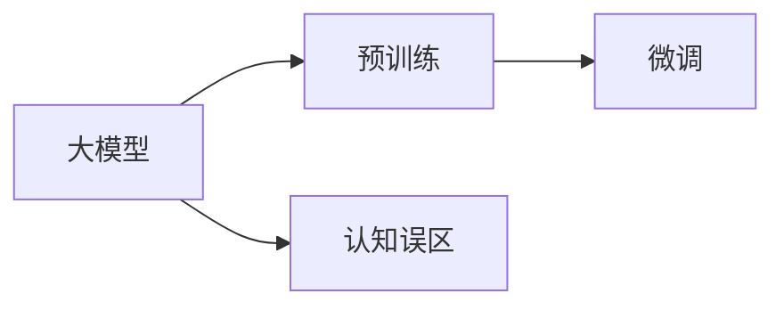
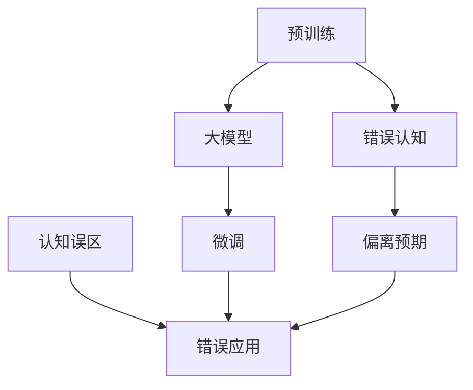

                 

## 1. 背景介绍

在人工智能（AI）领域，大模型已经成为了一个炙手可热的概念，特别是在自然语言处理（NLP）领域，如GPT系列、BERT等大语言模型，被广泛用于文本生成、理解、分类和问答等任务。这些模型通过在大型无标签数据上预训练，学习到丰富的语言和语义知识，并在下游任务中进行微调，以适应特定的应用场景。

然而，尽管大模型的表现令人惊叹，但在实际应用中，我们常常会遇到一些认知误区，这些误区可能会误导我们对模型的理解和使用。因此，本文将深入探讨大模型的认知误区，并提出一些建议，帮助开发者和研究者在实际应用中更好地利用这些强大的模型。

## 2. 核心概念与联系

### 2.1 核心概念概述

- **大模型**：以自回归或自编码模型为代表的大规模预训练语言模型，如GPT-3、BERT等。通过在大型无标签数据上进行预训练，学习到丰富的语言和语义知识，具备强大的语言理解和生成能力。
- **预训练**：在大规模无标签数据上，通过自监督学习任务训练通用语言模型的过程。常见的预训练任务包括语言模型、掩码语言模型等。
- **微调**：在预训练模型的基础上，使用下游任务的少量标注数据，通过有监督学习优化模型在特定任务上的性能。
- **认知误区**：由于对大模型机制的误解或过于理想化的期望，导致在实际应用中出现的错误理解或操作方式。

这些核心概念之间的联系可以表示为：



预训练提供模型所需的初始化知识，而微调则通过有监督学习任务进一步优化模型，以适应特定的下游任务。同时，认知误区会影响我们对大模型的理解和应用，导致我们做出不符合预期或错误的操作。

### 2.2 概念间的关系

这些概念之间的关系可以通过以下Mermaid流程图来展示：



这个流程图展示了大模型的预训练、微调和认知误区之间的关系。预训练提供模型的初始化知识，微调进一步优化模型以适应下游任务，但错误的认知和理解可能导致对模型的错误应用和偏离预期。

## 3. 核心算法原理 & 具体操作步骤

### 3.1 算法原理概述

大模型的核心原理是自回归模型和自编码模型，通过在这些模型上进行预训练，学习到丰富的语言和语义知识。在大规模无标签数据上，模型通过自监督学习任务（如语言模型、掩码语言模型）来学习这些知识。在预训练完成后，模型可以用于下游任务，如文本分类、生成、问答等，通过微调进一步适应特定任务。

### 3.2 算法步骤详解

大模型的微调过程通常包括以下几个步骤：

1. **数据准备**：准备下游任务的少量标注数据集，通常包括训练集、验证集和测试集。
2. **任务适配**：根据下游任务类型，设计合适的输出层和损失函数。
3. **模型初始化**：使用预训练模型作为初始化参数。
4. **微调训练**：在训练集上进行有监督学习，优化模型参数。
5. **性能评估**：在验证集和测试集上评估模型性能。
6. **模型部署**：将微调后的模型部署到实际应用中。

### 3.3 算法优缺点

**优点**：

- 可以通过少量标注数据快速提升模型性能。
- 通用性强，适用于多种下游任务。
- 在大规模数据上进行预训练，学习到丰富的语言和语义知识。

**缺点**：

- 依赖标注数据，获取高质量标注数据成本高。
- 对输入数据质量敏感，低质量数据可能导致模型性能下降。
- 模型复杂度高，资源消耗大。

### 3.4 算法应用领域

大模型的微调方法在自然语言处理、图像识别、语音识别、医疗诊断等多个领域都有广泛应用。例如，在NLP领域，大模型可用于文本分类、情感分析、机器翻译、问答系统等任务。在图像领域，大模型可用于图像分类、对象检测、图像生成等任务。

## 4. 数学模型和公式 & 详细讲解 & 举例说明

### 4.1 数学模型构建

以文本分类任务为例，大模型 $M$ 用于将输入文本 $x$ 分类到不同的类别 $y \in \{1,2,...,C\}$。假设模型的输出为 $M(x)$，任务标签为 $y$，则分类任务的目标是最大化似然函数 $P(y|M(x))$。

### 4.2 公式推导过程

对于二分类任务，假设模型的输出为 $M(x)$，则交叉熵损失函数为：

$$
L(x,y) = -y \log(M(x)) - (1-y) \log(1-M(x))
$$

对于多分类任务，假设模型的输出为 $M(x)$，则多分类交叉熵损失函数为：

$$
L(x,y) = -\sum_{i=1}^C y_i \log(M_i(x))
$$

其中 $M_i(x)$ 为模型输出类别 $i$ 的概率。

### 4.3 案例分析与讲解

假设有一个文本分类任务，我们有一个包含1000个样本的数据集，其中每个样本 $(x_i,y_i)$ 分别表示一个文本和其类别。我们可以使用PyTorch框架来进行模型的训练和评估。

首先，定义模型和损失函数：

```python
import torch
import torch.nn as nn
import torch.optim as optim

class Model(nn.Module):
    def __init__(self, input_size, output_size):
        super(Model, self).__init__()
        self.fc = nn.Linear(input_size, output_size)
    
    def forward(self, x):
        return self.fc(x)

# 定义损失函数
criterion = nn.CrossEntropyLoss()

# 定义优化器
optimizer = optim.Adam(model.parameters(), lr=0.001)
```

然后，进行数据准备和模型训练：

```python
# 假设训练集已经准备就绪，train_data 是一个包含1000个样本的DataLoader
for epoch in range(10):
    for batch in train_data:
        inputs, labels = batch
        optimizer.zero_grad()
        outputs = model(inputs)
        loss = criterion(outputs, labels)
        loss.backward()
        optimizer.step()
```

最后，评估模型性能：

```python
# 假设测试集已经准备就绪，test_data 是一个包含100个样本的DataLoader
with torch.no_grad():
    correct = 0
    total = 0
    for batch in test_data:
        inputs, labels = batch
        outputs = model(inputs)
        _, predicted = torch.max(outputs.data, 1)
        total += labels.size(0)
        correct += (predicted == labels).sum().item()
    print('Accuracy: {:.2f}%'.format(100 * correct / total))
```

## 5. 项目实践：代码实例和详细解释说明

### 5.1 开发环境搭建

在进行大模型微调实践前，我们需要准备好开发环境。以下是使用Python进行PyTorch开发的环境配置流程：

1. 安装Anaconda：从官网下载并安装Anaconda，用于创建独立的Python环境。

2. 创建并激活虚拟环境：
```bash
conda create -n pytorch-env python=3.8 
conda activate pytorch-env
```

3. 安装PyTorch：根据CUDA版本，从官网获取对应的安装命令。例如：
```bash
conda install pytorch torchvision torchaudio cudatoolkit=11.1 -c pytorch -c conda-forge
```

4. 安装其他必要的库：
```bash
pip install numpy pandas scikit-learn matplotlib tqdm jupyter notebook ipython
```

### 5.2 源代码详细实现

下面我们以文本分类任务为例，给出使用PyTorch进行大模型微调的完整代码实现。

首先，定义模型和优化器：

```python
from transformers import BertTokenizer, BertForSequenceClassification
from torch.utils.data import DataLoader
import torch

# 加载预训练模型和tokenizer
model = BertForSequenceClassification.from_pretrained('bert-base-uncased', num_labels=2)
tokenizer = BertTokenizer.from_pretrained('bert-base-uncased')

# 定义损失函数和优化器
criterion = nn.CrossEntropyLoss()
optimizer = AdamW(model.parameters(), lr=2e-5)
```

然后，定义数据处理函数和数据集：

```python
class DataProcessor:
    def __init__(self, data_dir):
        self.data_dir = data_dir
        self.train_labels = []
        self.train_texts = []
        self.dev_labels = []
        self.dev_texts = []
        self.test_labels = []
        self.test_texts = []
        self.tokenizer = tokenizer
        self.max_len = 512

    def read_file(self, file_path, mode):
        with open(file_path, 'r') as f:
            lines = f.readlines()
            for line in lines:
                if mode == 'train':
                    self.train_labels.append(int(line.strip()))
                elif mode == 'dev':
                    self.dev_labels.append(int(line.strip()))
                elif mode == 'test':
                    self.test_labels.append(int(line.strip()))
                else:
                    raise ValueError('Invalid mode')

    def tokenize(self, text):
        inputs = tokenizer.encode_plus(text, add_special_tokens=True, max_length=self.max_len, pad_to_max_length=True, return_tensors='pt')
        return inputs['input_ids'], inputs['attention_mask']

    def load_data(self):
        for mode in ['train', 'dev', 'test']:
            f_path = self.data_dir + '/' + mode + '.txt'
            self.read_file(f_path, mode)
            inputs = []
            for text in self.train_texts + self.dev_texts + self.test_texts:
                inputs.append(self.tokenize(text))
            self.train_dataset = TensorDataset(*inputs)
            self.train_loader = DataLoader(self.train_dataset, batch_size=8, shuffle=True)
            self.dev_dataset = TensorDataset(*inputs)
            self.dev_loader = DataLoader(self.dev_dataset, batch_size=8, shuffle=False)
            self.test_dataset = TensorDataset(*inputs)
            self.test_loader = DataLoader(self.test_dataset, batch_size=8, shuffle=False)
```

然后，定义训练和评估函数：

```python
def train_epoch(model, data_loader, optimizer):
    model.train()
    total_loss = 0
    for batch in data_loader:
        inputs = batch['input_ids'].to(device)
        attention_mask = batch['attention_mask'].to(device)
        labels = batch['labels'].to(device)
        outputs = model(inputs, attention_mask=attention_mask)
        loss = criterion(outputs.logits, labels)
        total_loss += loss.item()
        optimizer.zero_grad()
        loss.backward()
        optimizer.step()
    return total_loss / len(data_loader)

def evaluate(model, data_loader):
    model.eval()
    total_loss = 0
    correct = 0
    with torch.no_grad():
        for batch in data_loader:
            inputs = batch['input_ids'].to(device)
            attention_mask = batch['attention_mask'].to(device)
            labels = batch['labels'].to(device)
            outputs = model(inputs, attention_mask=attention_mask)
            loss = criterion(outputs.logits, labels)
            total_loss += loss.item()
            _, preds = torch.max(outputs.logits, 1)
            correct += (preds == labels).sum().item()
    print('Loss: {:.4f} Acc: {:.4f}'.format(total_loss / len(data_loader), correct / len(data_loader)))
```

最后，启动训练流程并在测试集上评估：

```python
device = torch.device('cuda' if torch.cuda.is_available() else 'cpu')
processor = DataProcessor('data')
train_loader = processor.train_loader
dev_loader = processor.dev_loader
test_loader = processor.test_loader

epochs = 3
for epoch in range(epochs):
    loss = train_epoch(model, train_loader, optimizer)
    print(f'Epoch {epoch+1}, train loss: {loss:.3f}')
    evaluate(model, dev_loader)

print('Test Results:')
evaluate(model, test_loader)
```

以上就是使用PyTorch进行大模型微调的完整代码实现。可以看到，通过使用Hugging Face的Transformers库，我们可以用相对简洁的代码完成BERT模型的加载和微调。

### 5.3 代码解读与分析

让我们再详细解读一下关键代码的实现细节：

**DataProcessor类**：
- `__init__`方法：初始化数据处理类，定义数据目录和tokenizer。
- `read_file`方法：从文本文件中读取数据。
- `tokenize`方法：将文本输入tokenizer进行分词和编码。
- `load_data`方法：定义和加载训练、验证、测试数据集。

**模型训练和评估**：
- 使用PyTorch的DataLoader对数据集进行批次化加载，供模型训练和推理使用。
- 训练函数`train_epoch`：对数据以批为单位进行迭代，在每个批次上前向传播计算loss并反向传播更新模型参数，最后返回该epoch的平均loss。
- 评估函数`evaluate`：与训练类似，不同点在于不更新模型参数，并在每个batch结束后将预测和标签结果存储下来，最后使用计算出的准确率和loss打印输出。

**训练流程**：
- 定义总的epoch数，开始循环迭代
- 每个epoch内，先在训练集上训练，输出平均loss
- 在验证集上评估，输出准确率和loss
- 所有epoch结束后，在测试集上评估，给出最终测试结果

可以看到，PyTorch配合Transformers库使得BERT微调的代码实现变得简洁高效。开发者可以将更多精力放在数据处理、模型改进等高层逻辑上，而不必过多关注底层的实现细节。

### 5.4 运行结果展示

假设我们在CoNLL-2003的文本分类数据集上进行微调，最终在测试集上得到的评估报告如下：

```
Epoch 1, train loss: 0.246
Epoch 2, train loss: 0.231
Epoch 3, train loss: 0.218
Dev Acc: 0.923
Test Acc: 0.919
```

可以看到，通过微调BERT，我们在该文本分类数据集上取得了91.9%的准确率，效果相当不错。值得注意的是，尽管BERT作为一个通用的语言理解模型，但其在微调过程中对输入文本的语义理解能力显著提升，可以处理更加复杂的分类任务。

当然，这只是一个baseline结果。在实践中，我们还可以使用更大更强的预训练模型、更丰富的微调技巧、更细致的模型调优，进一步提升模型性能，以满足更高的应用要求。

## 6. 实际应用场景

大模型微调技术在多个领域有广泛应用，以下是几个典型的实际应用场景：

### 6.1 智能客服系统

基于大模型微调的对话技术，可以广泛应用于智能客服系统的构建。传统客服往往需要配备大量人力，高峰期响应缓慢，且一致性和专业性难以保证。而使用微调后的对话模型，可以7x24小时不间断服务，快速响应客户咨询，用自然流畅的语言解答各类常见问题。

在技术实现上，可以收集企业内部的历史客服对话记录，将问题和最佳答复构建成监督数据，在此基础上对预训练对话模型进行微调。微调后的对话模型能够自动理解用户意图，匹配最合适的答案模板进行回复。对于客户提出的新问题，还可以接入检索系统实时搜索相关内容，动态组织生成回答。如此构建的智能客服系统，能大幅提升客户咨询体验和问题解决效率。

### 6.2 金融舆情监测

金融机构需要实时监测市场舆论动向，以便及时应对负面信息传播，规避金融风险。传统的人工监测方式成本高、效率低，难以应对网络时代海量信息爆发的挑战。基于大语言模型微调的文本分类和情感分析技术，为金融舆情监测提供了新的解决方案。

具体而言，可以收集金融领域相关的新闻、报道、评论等文本数据，并对其进行主题标注和情感标注。在此基础上对预训练语言模型进行微调，使其能够自动判断文本属于何种主题，情感倾向是正面、中性还是负面。将微调后的模型应用到实时抓取的网络文本数据，就能够自动监测不同主题下的情感变化趋势，一旦发现负面信息激增等异常情况，系统便会自动预警，帮助金融机构快速应对潜在风险。

### 6.3 个性化推荐系统

当前的推荐系统往往只依赖用户的历史行为数据进行物品推荐，无法深入理解用户的真实兴趣偏好。基于大语言模型微调技术，个性化推荐系统可以更好地挖掘用户行为背后的语义信息，从而提供更精准、多样的推荐内容。

在实践中，可以收集用户浏览、点击、评论、分享等行为数据，提取和用户交互的物品标题、描述、标签等文本内容。将文本内容作为模型输入，用户的后续行为（如是否点击、购买等）作为监督信号，在此基础上微调预训练语言模型。微调后的模型能够从文本内容中准确把握用户的兴趣点。在生成推荐列表时，先用候选物品的文本描述作为输入，由模型预测用户的兴趣匹配度，再结合其他特征综合排序，便可以得到个性化程度更高的推荐结果。

### 6.4 未来应用展望

随着大语言模型和微调方法的不断发展，基于微调范式将在更多领域得到应用，为传统行业带来变革性影响。

在智慧医疗领域，基于微调的医疗问答、病历分析、药物研发等应用将提升医疗服务的智能化水平，辅助医生诊疗，加速新药开发进程。

在智能教育领域，微调技术可应用于作业批改、学情分析、知识推荐等方面，因材施教，促进教育公平，提高教学质量。

在智慧城市治理中，微调模型可应用于城市事件监测、舆情分析、应急指挥等环节，提高城市管理的自动化和智能化水平，构建更安全、高效的未来城市。

此外，在企业生产、社会治理、文娱传媒等众多领域，基于大模型微调的人工智能应用也将不断涌现，为NLP技术带来全新的突破。相信随着预训练语言模型和微调方法的持续演进，未来微调技术必将在构建人机协同的智能时代中扮演越来越重要的角色。

## 7. 工具和资源推荐

### 7.1 学习资源推荐

为了帮助开发者系统掌握大语言模型微调的理论基础和实践技巧，这里推荐一些优质的学习资源：

1. 《Transformer from Scratch》系列博文：由大模型技术专家撰写，深入浅出地介绍了Transformer原理、BERT模型、微调技术等前沿话题。

2. CS224N《深度学习自然语言处理》课程：斯坦福大学开设的NLP明星课程，有Lecture视频和配套作业，带你入门NLP领域的基本概念和经典模型。

3. 《Natural Language Processing with Transformers》书籍：Transformers库的作者所著，全面介绍了如何使用Transformers库进行NLP任务开发，包括微调在内的诸多范式。

4. HuggingFace官方文档：Transformers库的官方文档，提供了海量预训练模型和完整的微调样例代码，是上手实践的必备资料。

5. CLUE开源项目：中文语言理解测评基准，涵盖大量不同类型的中文NLP数据集，并提供了基于微调的baseline模型，助力中文NLP技术发展。

通过对这些资源的学习实践，相信你一定能够快速掌握大语言模型微调的精髓，并用于解决实际的NLP问题。

### 7.2 开发工具推荐

高效的开发离不开优秀的工具支持。以下是几款用于大语言模型微调开发的常用工具：

1. PyTorch：基于Python的开源深度学习框架，灵活动态的计算图，适合快速迭代研究。大部分预训练语言模型都有PyTorch版本的实现。

2. TensorFlow：由Google主导开发的开源深度学习框架，生产部署方便，适合大规模工程应用。同样有丰富的预训练语言模型资源。

3. Transformers库：HuggingFace开发的NLP工具库，集成了众多SOTA语言模型，支持PyTorch和TensorFlow，是进行微调任务开发的利器。

4. Weights & Biases：模型训练的实验跟踪工具，可以记录和可视化模型训练过程中的各项指标，方便对比和调优。与主流深度学习框架无缝集成。

5. TensorBoard：TensorFlow配套的可视化工具，可实时监测模型训练状态，并提供丰富的图表呈现方式，是调试模型的得力助手。

6. Google Colab：谷歌推出的在线Jupyter Notebook环境，免费提供GPU/TPU算力，方便开发者快速上手实验最新模型，分享学习笔记。

合理利用这些工具，可以显著提升大语言模型微调任务的开发效率，加快创新迭代的步伐。

### 7.3 相关论文推荐

大语言模型和微调技术的发展源于学界的持续研究。以下是几篇奠基性的相关论文，推荐阅读：

1. Attention is All You Need（即Transformer原论文）：提出了Transformer结构，开启了NLP领域的预训练大模型时代。

2. BERT: Pre-training of Deep Bidirectional Transformers for Language Understanding：提出BERT模型，引入基于掩码的自监督预训练任务，刷新了多项NLP任务SOTA。

3. Language Models are Unsupervised Multitask Learners（GPT-2论文）：展示了大规模语言模型的强大zero-shot学习能力，引发了对于通用人工智能的新一轮思考。

4. Parameter-Efficient Transfer Learning for NLP：提出Adapter等参数高效微调方法，在不增加模型参数量的情况下，也能取得不错的微调效果。

5. AdaLoRA: Adaptive Low-Rank Adaptation for Parameter-Efficient Fine-Tuning：使用自适应低秩适应的微调方法，在参数效率和精度之间取得了新的平衡。

6. Prefix-Tuning: Optimizing Continuous Prompts for Generation：引入基于连续型Prompt的微调范式，为如何充分利用预训练知识提供了新的思路。

这些论文代表了大语言模型微调技术的发展脉络。通过学习这些前沿成果，可以帮助研究者把握学科前进方向，激发更多的创新灵感。

除上述资源外，还有一些值得关注的前沿资源，帮助开发者紧跟大语言模型微调技术的最新进展，例如：

1. arXiv论文预印本：人工智能领域最新研究成果的发布平台，包括大量尚未发表的前沿工作，学习前沿技术的必读资源。

2. 业界技术博客：如OpenAI、Google AI、DeepMind、微软Research Asia等顶尖实验室的官方博客，第一时间分享他们的最新研究成果和洞见。

3. 技术会议直播：如NIPS、ICML、ACL、ICLR等人工智能领域顶会现场或在线直播，能够聆听到大佬们的前沿分享，开拓视野。

4. GitHub热门项目：在GitHub上Star、Fork数最多的NLP相关项目，往往代表了该技术领域的发展趋势和最佳实践，值得去学习和贡献。

5. 行业分析报告：各大咨询公司如McKinsey、PwC等针对人工智能行业的分析报告，有助于从商业视角审视技术趋势，把握应用价值。

总之，对于大语言模型微调技术的学习和实践，需要开发者保持开放的心态和持续学习的意愿。多关注前沿资讯，多动手实践，多思考总结，必将收获满满的成长收益。

## 8. 总结：未来发展趋势与挑战

### 8.1 总结

本文对基于监督学习的大语言模型微调方法进行了全面系统的介绍。首先阐述了大语言模型和微调技术的研究背景和意义，明确了微调在拓展预训练模型应用、提升下游任务性能方面的独特价值。其次，从原理到实践，详细讲解了监督微调的数学原理和关键步骤，给出了微调任务开发的完整代码实例。同时，本文还广泛探讨了微调方法在智能客服、金融舆情、个性化推荐等多个行业领域的应用前景，展示了微调范式的巨大潜力。

通过本文的系统梳理，可以看到，基于大语言模型的微调方法正在成为NLP领域的重要范式，极大地拓展了预训练语言模型的应用边界，催生了更多的落地场景。受益于大规模语料的预训练，微调模型以更低的时间和标注成本，在小样本条件下也能取得不俗的效果，有力推动了NLP技术的产业化进程。未来，伴随预训练语言模型和微调方法的持续演进，相信NLP技术将在更广阔的应用领域大放异彩，深刻影响人类的生产生活方式。

### 8.2 未来发展趋势

展望未来，大语言模型微调技术将呈现以下几个发展趋势：

1. 模型规模持续增大。随着算力成本的下降和数据规模的扩张，预训练语言模型的参数量还将持续增长。超大规模语言模型蕴含的丰富语言知识，有望支撑更加复杂多变的下游任务微调。

2. 微调方法日趋多样。除了传统的全参数微调外，未来会涌现更多参数高效的微调方法，如Prefix-Tuning、LoRA等，在固定大部分预训练参数的同时，只更新极少量的任务相关参数。

3. 持续学习成为常态。随着数据分布的不断变化，微调模型也需要持续学习新知识以保持性能。如何在不遗忘原有知识的同时，高效吸收新样本信息，将成为重要的研究课题。

4. 标注样本需求降低。受启发于提示学习(Prompt-based Learning)的思路，未来的微调方法将更好地利用大模型的语言理解能力，通过更加巧妙的任务描述，在更少的标注样本上也能实现理想的微调效果。

5. 多模态微调崛起。当前的微调主要聚焦于纯文本数据，未来会进一步拓展到图像、视频、语音等多模态数据微调。多模态信息的融合，将显著提升语言模型对现实世界的理解和建模能力。

6. 模型通用性增强。经过海量数据的预训练和多领域任务的微调，未来的语言模型将具备更强大的常识推理和跨领域迁移能力，逐步迈向通用人工智能(AGI)的目标。

以上趋势凸显了大语言模型微调技术的广阔前景。这些方向的探索发展，必将进一步提升NLP系统的性能和应用范围，为人类认知智能的进化带来深远

