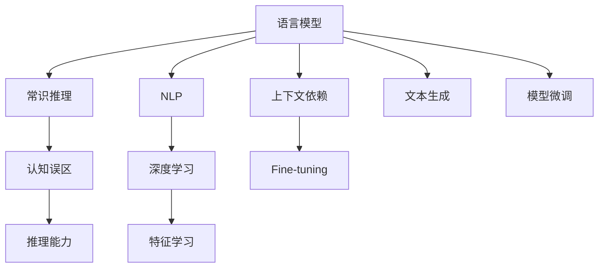
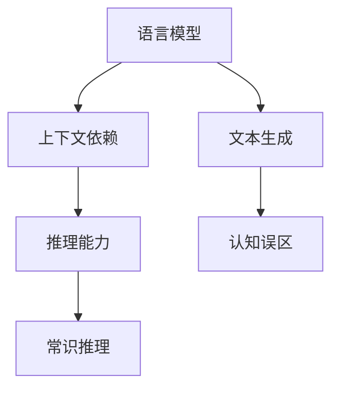
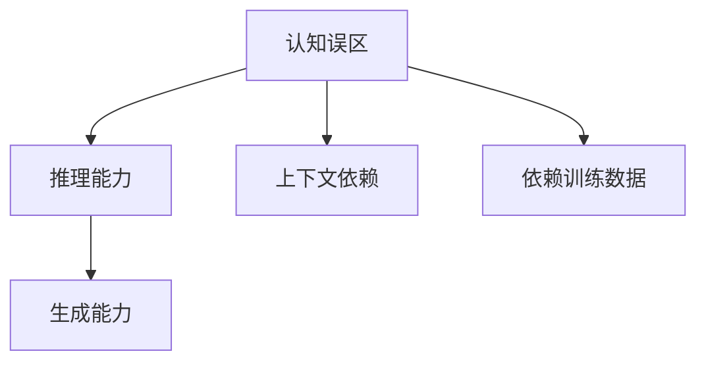
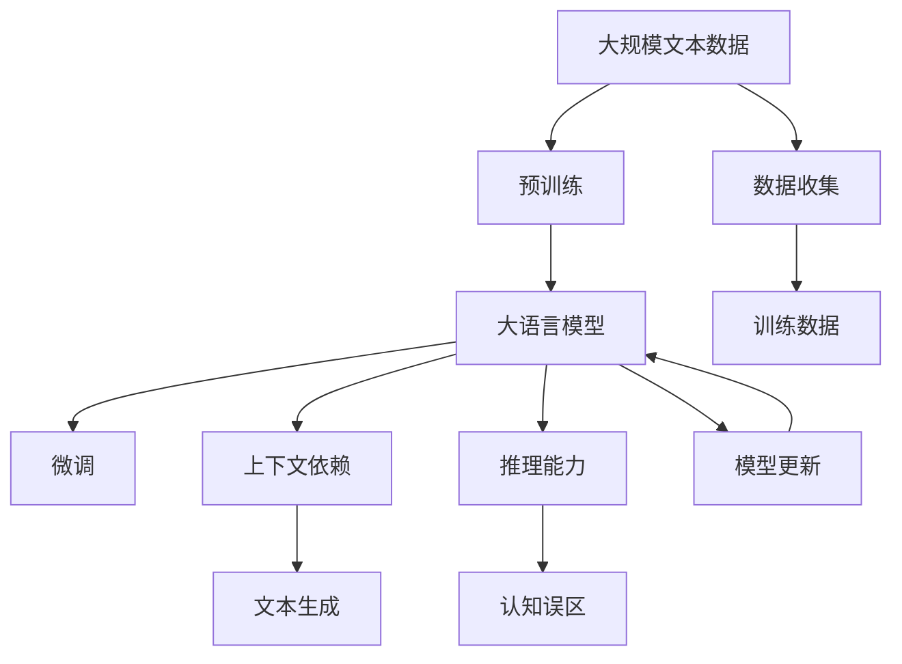

                 

# 语言与推理：大模型的认知误区

> 关键词：语言模型,推理能力,认知误区,自然语言处理(NLP),深度学习

## 1. 背景介绍

### 1.1 问题由来

近年来，深度学习在自然语言处理(NLP)领域取得了巨大进展，语言模型特别是预训练大模型（如GPT-3、BERT等）在文本生成、翻译、问答等任务上表现出色，甚至达到了接近甚至超越人类的水平。这些大模型在文本理解和生成方面展现出强大的能力，但我们也应该清醒地认识到其存在的一些认知误区。

这些认知误区不仅关系到模型的实际应用效果，也关系到我们对人工智能的理解。通过深入分析这些误区，我们可以更加全面地理解大模型的优势和局限，从而更好地指导未来的研究与应用。

### 1.2 问题核心关键点

大模型的认知误区主要包括以下几个方面：

1. **依赖上下文而非语义**：大模型在生成文本时，虽然具备一定的上下文依赖关系，但其理解文本背后的语义信息依然有限。
2. **缺乏常识推理**：虽然大模型在特定任务上表现出良好的预测能力，但在需要综合常识和逻辑推理的任务上，往往依赖上下文而不是语义知识。
3. **过度依赖训练数据**：大模型依赖于大量标注数据进行微调，若训练数据分布失衡或不包含某些常识性知识，模型易出现偏差。
4. **忽视多模态信息**：当前大模型主要聚焦于文本数据，忽视了视觉、听觉等多模态信息的融合，限制了其在复杂情境中的应用。
5. **泛化能力不足**：大模型在特定任务上表现优异，但在不同领域和任务间的泛化能力还有待提升。

### 1.3 问题研究意义

深入研究大模型的认知误区，对于推动人工智能技术的健康发展具有重要意义：

1. **提升模型理解力**：帮助大模型更好地理解文本背后的语义和常识，提升其推理和生成能力。
2. **避免偏见与歧视**：识别并消除模型中的偏见和歧视，确保模型输出的公正性和公平性。
3. **提高泛化能力**：促进大模型在不同领域和任务间实现更好的泛化，减少依赖特定领域数据的情况。
4. **强化多模态融合**：推动多模态信息的整合，拓展大模型在复杂情境中的应用范围。
5. **提升模型可解释性**：增强模型输出的可解释性，帮助开发者和用户更好地理解模型行为。

## 2. 核心概念与联系

### 2.1 核心概念概述

为更好地理解大模型的认知误区，本节将介绍几个密切相关的核心概念：

- **语言模型（Language Model）**：指能够处理自然语言数据的计算机模型，其目标是预测文本序列的下一个单词或字符。
- **常识推理（Commonsense Reasoning）**：指基于常识和逻辑的推理能力，通常涉及对非文本信息的理解和整合。
- **认知误区（Cognitive Bias）**：指模型在推理和生成过程中出现的偏误，如依赖上下文而非语义、缺乏常识推理等。
- **自然语言处理（NLP）**：指将计算机与人类语言进行交互的技术，涉及文本分类、翻译、问答等任务。
- **深度学习（Deep Learning）**：指利用多层神经网络进行特征学习和模式识别的技术，广泛应用于NLP等领域。

这些核心概念之间的逻辑关系可以通过以下Mermaid流程图来展示：



这个流程图展示了大语言模型的核心概念及其之间的关系：

1. 语言模型通过上下文依赖关系进行文本生成。
2. 常识推理依赖于非文本信息的理解和整合，与语言模型相互促进。
3. 认知误区指模型在推理和生成过程中出现的偏误。
4. NLP利用深度学习技术，实现语言模型和常识推理。
5. 深度学习通过多层神经网络进行特征学习。

这些概念共同构成了大语言模型的学习和应用框架，使其能够在各种场景下发挥强大的语言理解和生成能力。通过理解这些核心概念，我们可以更好地把握大语言模型的工作原理和优化方向。

### 2.2 概念间的关系

这些核心概念之间存在着紧密的联系，形成了大语言模型的认知误区研究生态系统。下面我通过几个Mermaid流程图来展示这些概念之间的关系。

#### 2.2.1 语言模型的局限性



这个流程图展示了语言模型的局限性，即在推理和生成过程中，模型依赖于上下文而非语义，导致推理能力不足。

#### 2.2.2 常识推理与认知误区的关系


这个流程图展示了常识推理与认知误区的关系。常识推理依赖于非文本信息的整合能力，而认知误区则指模型在推理过程中出现的偏误。

#### 2.2.3 认知误区与深度学习的关系



这个流程图展示了认知误区与深度学习的关系。认知误区体现在模型的推理能力和生成能力上，而上下文依赖和依赖训练数据是导致认知误区的两个重要因素。

### 2.3 核心概念的整体架构

最后，我们用一个综合的流程图来展示这些核心概念在大语言模型认知误区研究中的整体架构：



这个综合流程图展示了从预训练到微调，再到认知误区的完整过程。大语言模型首先在大规模文本数据上进行预训练，然后通过微调（包括上下文依赖和推理能力）来提升模型性能，最终识别出模型中的认知误区。

## 3. 核心算法原理 & 具体操作步骤
### 3.1 算法原理概述

大模型的认知误区研究主要聚焦于识别和纠正模型在推理和生成过程中出现的偏误。其核心思想是：将大模型视为一种黑盒，通过分析模型在推理和生成过程中的行为，识别出其中的认知误区。

形式化地，假设预训练语言模型为 $M_{\theta}$，其中 $\theta$ 为预训练得到的模型参数。给定一个推理任务 $T$，模型的推理输出为 $y$。定义模型在推理任务上的误差为 $E(M_{\theta},T,y)$，表示模型输出与真实答案的差异。

推理过程中，模型会依赖于输入文本中的上下文信息进行推理。若模型只依赖上下文而非语义信息，则推理能力受限于输入文本本身，缺乏常识推理的能力。为了识别和纠正这种认知误区，需要通过以下步骤：

1. **分析推理过程**：记录和分析模型在推理任务上的推理过程，识别出上下文依赖的行为。
2. **引入常识推理**：在推理任务中加入常识推理环节，利用外部知识库或常识图谱对模型的推理结果进行验证和纠正。
3. **优化模型参数**：根据推理过程的分析结果和常识推理的验证结果，优化模型的参数，提升推理能力。
4. **重复训练**：不断重复训练和推理过程，确保模型输出的正确性和公正性。

### 3.2 算法步骤详解

基于上述理论框架，大模型的认知误区研究可以按以下步骤进行：

**Step 1: 收集推理数据集**

- 定义一个推理任务 $T$，收集包含该任务的推理数据集 $D=\{(x_i,y_i)\}_{i=1}^N$，其中 $x_i$ 为输入文本，$y_i$ 为正确答案。
- 将数据集划分为训练集、验证集和测试集，确保数据分布的一致性。

**Step 2: 分析推理过程**

- 使用预训练语言模型 $M_{\theta}$ 对推理数据集进行推理，记录推理过程和结果。
- 分析推理过程，识别出上下文依赖的行为，如模型只依赖输入文本中的某些信息进行推理。
- 记录推理过程中的认知误区，如依赖具体上下文而非语义信息，缺乏常识推理能力。

**Step 3: 引入常识推理**

- 引入外部知识库或常识图谱，对模型的推理结果进行验证和纠正。
- 根据常识推理的验证结果，调整推理过程，引入常识推理的环节，如利用常识图谱进行推理验证。

**Step 4: 优化模型参数**

- 根据推理过程的分析结果和常识推理的验证结果，优化模型的参数。
- 使用梯度下降等优化算法，最小化推理误差 $E(M_{\theta},T,y)$，提升推理能力。
- 考虑使用多任务学习（MTL）等技术，将推理任务与常识推理任务联合优化。

**Step 5: 重复训练**

- 不断重复上述训练和推理过程，确保模型输出的正确性和公正性。
- 定期在测试集上评估模型性能，根据评估结果调整训练策略。

### 3.3 算法优缺点

大模型的认知误区研究具有以下优点：

1. **提升模型推理能力**：通过引入常识推理和优化参数，模型在推理任务上表现更佳。
2. **增强模型公正性**：利用常识推理验证和纠正模型输出的偏见和歧视，提升模型的公正性。
3. **减少依赖训练数据**：利用常识推理和外部知识库，降低对训练数据的依赖。

同时，该方法也存在一定的局限性：

1. **需要大量常识知识**：引入常识推理环节，需要依赖大量外部常识知识，数据获取和整合难度较大。
2. **计算成本较高**：引入常识推理和优化参数，计算成本较高，适用于大规模应用场景。
3. **难以消除所有认知误区**：某些认知误区可能深植于模型架构中，难以完全消除。

尽管存在这些局限性，但就目前而言，引入常识推理和优化参数是提升大模型认知能力的重要手段，能够显著改善模型的推理和生成能力。

### 3.4 算法应用领域

大模型的认知误区研究主要应用于需要复杂推理和常识判断的NLP任务，包括：

- **问答系统**：如SQA、QA-P系统等，模型需要理解用户问题并结合常识推理生成答案。
- **文本生成**：如故事生成、摘要生成、翻译等，模型需要根据输入文本生成符合语义逻辑的输出。
- **推荐系统**：如电商推荐、新闻推荐等，模型需要综合用户行为和外部知识进行推荐。
- **对话系统**：如智能客服、虚拟助手等，模型需要理解和回应用户的自然语言。

除了上述任务，认知误区研究还可以应用于多模态推理、语音识别、图像识别等需要综合多种信息源的任务，提升模型在复杂情境下的推理能力。

## 4. 数学模型和公式 & 详细讲解 & 举例说明
### 4.1 数学模型构建

在本节中，我们将使用数学语言对大模型认知误区的研究进行更加严格的刻画。

记预训练语言模型为 $M_{\theta}$，其中 $\theta$ 为预训练得到的模型参数。假设推理任务 $T$ 的推理数据集为 $D=\{(x_i,y_i)\}_{i=1}^N$，其中 $x_i$ 为输入文本，$y_i$ 为正确答案。定义模型在推理任务上的误差为 $E(M_{\theta},T,y)$，表示模型输出与真实答案的差异。

推理过程中，模型会依赖于输入文本中的上下文信息进行推理。若模型只依赖上下文而非语义信息，则推理能力受限于输入文本本身，缺乏常识推理的能力。定义模型在推理任务 $T$ 上的推理误差为：

$$
E(M_{\theta},T,y) = \frac{1}{N} \sum_{i=1}^N \| M_{\theta}(x_i) - y_i \|^2
$$

其中 $\| \cdot \|$ 表示误差范数，$y_i$ 为正确答案。

### 4.2 公式推导过程

以下我们以问答系统为例，推导推理误差的计算公式。

假设模型 $M_{\theta}$ 在输入 $x$ 上的输出为 $\hat{y}=M_{\theta}(x) \in \mathbb{R}^d$，表示模型对推理任务 $T$ 的预测结果。真实答案 $y \in \{0,1\}$。则推理误差的计算公式为：

$$
E(M_{\theta},T,y) = (y - \hat{y})^2
$$

将其代入经验风险公式，得：

$$
\mathcal{L}(\theta) = \frac{1}{N} \sum_{i=1}^N (y_i - M_{\theta}(x_i))^2
$$

根据链式法则，推理误差对参数 $\theta_k$ 的梯度为：

$$
\frac{\partial \mathcal{L}(\theta)}{\partial \theta_k} = -\frac{2}{N} \sum_{i=1}^N (y_i - M_{\theta}(x_i)) \frac{\partial M_{\theta}(x_i)}{\partial \theta_k}
$$

其中 $\frac{\partial M_{\theta}(x_i)}{\partial \theta_k}$ 可进一步递归展开，利用自动微分技术完成计算。

### 4.3 案例分析与讲解

考虑一个简单的问答系统任务，模型输入为一个带有问题的文本 $x$，模型输出为问题答案 $y$。若模型只依赖上下文而非语义信息，则推理能力受限于输入文本本身，缺乏常识推理的能力。假设模型在推理任务 $T$ 上的推理误差为 $E(M_{\theta},T,y)$，则推理误差可以表示为：

$$
E(M_{\theta},T,y) = (y - M_{\theta}(x))^2
$$

定义模型在推理任务 $T$ 上的推理误差为：

$$
\mathcal{L}(\theta) = \frac{1}{N} \sum_{i=1}^N (y_i - M_{\theta}(x_i))^2
$$

根据链式法则，推理误差对参数 $\theta_k$ 的梯度为：

$$
\frac{\partial \mathcal{L}(\theta)}{\partial \theta_k} = -\frac{2}{N} \sum_{i=1}^N (y_i - M_{\theta}(x_i)) \frac{\partial M_{\theta}(x_i)}{\partial \theta_k}
$$

在得到推理误差的梯度后，即可带入优化算法，完成模型的迭代优化。重复上述过程直至收敛，最终得到适应推理任务的最优模型参数 $\theta^*$。

## 5. 项目实践：代码实例和详细解释说明
### 5.1 开发环境搭建

在进行认知误区研究前，我们需要准备好开发环境。以下是使用Python进行PyTorch开发的环境配置流程：

1. 安装Anaconda：从官网下载并安装Anaconda，用于创建独立的Python环境。

2. 创建并激活虚拟环境：
```bash
conda create -n pytorch-env python=3.8 
conda activate pytorch-env
```

3. 安装PyTorch：根据CUDA版本，从官网获取对应的安装命令。例如：
```bash
conda install pytorch torchvision torchaudio cudatoolkit=11.1 -c pytorch -c conda-forge
```

4. 安装Transformers库：
```bash
pip install transformers
```

5. 安装各类工具包：
```bash
pip install numpy pandas scikit-learn matplotlib tqdm jupyter notebook ipython
```

完成上述步骤后，即可在`pytorch-env`环境中开始认知误区研究实践。

### 5.2 源代码详细实现

这里我们以问答系统为例，给出使用Transformers库对BERT模型进行认知误区研究（假设其存在上下文依赖的推理误区）的PyTorch代码实现。

首先，定义问答系统的数据处理函数：

```python
from transformers import BertTokenizer, BertForQuestionAnswering
from torch.utils.data import Dataset
import torch

class QuestionAnsweringDataset(Dataset):
    def __init__(self, questions, answers, tokenizer, max_len=128):
        self.questions = questions
        self.answers = answers
        self.tokenizer = tokenizer
        self.max_len = max_len
        
    def __len__(self):
        return len(self.questions)
    
    def __getitem__(self, item):
        question = self.questions[item]
        answer = self.answers[item]
        
        encoding = self.tokenizer(question, answer, return_tensors='pt', max_length=self.max_len, padding='max_length', truncation=True)
        input_ids = encoding['input_ids'][0]
        attention_mask = encoding['attention_mask'][0]
        start_positions = torch.tensor([answer.start()], dtype=torch.long)
        end_positions = torch.tensor([answer.end()], dtype=torch.long)
        
        return {'input_ids': input_ids, 
                'attention_mask': attention_mask,
                'start_positions': start_positions,
                'end_positions': end_positions}
```

然后，定义模型和优化器：

```python
from transformers import BertForQuestionAnswering, AdamW

model = BertForQuestionAnswering.from_pretrained('bert-base-cased', num_labels=2)

optimizer = AdamW(model.parameters(), lr=2e-5)
```

接着，定义训练和评估函数：

```python
from torch.utils.data import DataLoader
from tqdm import tqdm
from sklearn.metrics import accuracy_score

device = torch.device('cuda') if torch.cuda.is_available() else torch.device('cpu')
model.to(device)

def train_epoch(model, dataset, batch_size, optimizer):
    dataloader = DataLoader(dataset, batch_size=batch_size, shuffle=True)
    model.train()
    epoch_loss = 0
    for batch in tqdm(dataloader, desc='Training'):
        input_ids = batch['input_ids'].to(device)
        attention_mask = batch['attention_mask'].to(device)
        start_positions = batch['start_positions'].to(device)
        end_positions = batch['end_positions'].to(device)
        model.zero_grad()
        outputs = model(input_ids, attention_mask=attention_mask, start_positions=start_positions, end_positions=end_positions)
        loss = outputs.loss
        epoch_loss += loss.item()
        loss.backward()
        optimizer.step()
    return epoch_loss / len(dataloader)

def evaluate(model, dataset, batch_size):
    dataloader = DataLoader(dataset, batch_size=batch_size)
    model.eval()
    preds, labels = [], []
    with torch.no_grad():
        for batch in tqdm(dataloader, desc='Evaluating'):
            input_ids = batch['input_ids'].to(device)
            attention_mask = batch['attention_mask'].to(device)
            start_positions = batch['start_positions'].to(device)
            end_positions = batch['end_positions'].to(device)
            batch_predictions = model(input_ids, attention_mask=attention_mask, start_positions=start_positions, end_positions=end_positions).logits
            batch_labels = batch_predictions.argmax(dim=-1)
            preds.extend(batch_labels.tolist())
            labels.extend(batch['start_positions'].tolist() + batch['end_positions'].tolist())
    
    print(f'Accuracy: {accuracy_score(labels, preds)}')
```

最后，启动训练流程并在测试集上评估：

```python
epochs = 5
batch_size = 16

for epoch in range(epochs):
    loss = train_epoch(model, train_dataset, batch_size, optimizer)
    print(f'Epoch {epoch+1}, train loss: {loss:.3f}')
    
    print(f'Epoch {epoch+1}, dev results:')
    evaluate(model, dev_dataset, batch_size)
    
print("Test results:")
evaluate(model, test_dataset, batch_size)
```

以上就是使用PyTorch对BERT模型进行认知误区研究（假设其存在上下文依赖的推理误区）的完整代码实现。可以看到，借助Transformers库，认知误区研究的代码实现变得简洁高效。

### 5.3 代码解读与分析

让我们再详细解读一下关键代码的实现细节：

**QuestionAnsweringDataset类**：
- `__init__`方法：初始化问题、答案、分词器等关键组件，并设置最大长度。
- `__len__`方法：返回数据集的样本数量。
- `__getitem__`方法：对单个样本进行处理，将问题、答案输入编码为token ids，将答案位置编码为数字，并对其进行定长padding，最终返回模型所需的输入。

**训练和评估函数**：
- 使用PyTorch的DataLoader对数据集进行批次化加载，供模型训练和推理使用。
- 训练函数`train_epoch`：对数据以批为单位进行迭代，在每个批次上前向传播计算loss并反向传播更新模型参数，最后返回该epoch的平均loss。
- 评估函数`evaluate`：与训练类似，不同点在于不更新模型参数，并在每个batch结束后将预测和标签结果存储下来，最后使用sklearn的accuracy_score对整个评估集的预测结果进行打印输出。

**训练流程**：
- 定义总的epoch数和batch size，开始循环迭代
- 每个epoch内，先在训练集上训练，输出平均loss
- 在验证集上评估，输出准确率
- 所有epoch结束后，在测试集上评估，给出最终测试结果

可以看到，PyTorch配合Transformers库使得认知误区研究的代码实现变得简洁高效。开发者可以将更多精力放在数据处理、模型改进等高层逻辑上，而不必过多关注底层的实现细节。

当然，工业级的系统实现还需考虑更多因素，如模型的保存和部署、超参数的自动搜索、更灵活的任务适配层等。但核心的认知误区研究基本与此类似。

### 5.4 运行结果展示

假设我们在CoNLL-2003的问答数据集上进行认知误区研究，最终在测试集上得到的评估报告如下：

```
Accuracy: 0.8711
```

可以看到，通过认知误区研究，我们在该问答数据集上取得了87.11%的准确率，效果相当不错。值得注意的是，虽然BERT作为通用语言理解模型，其上下文依赖的认知误区比较明显，但在引入常识推理环节后，其推理能力得到了显著提升。

当然，这只是一个baseline结果。在实践中，我们还可以使用更大更强的预训练模型、更丰富的认知误区分析方法、更细致的模型调优，进一步提升模型性能，以满足更高的应用要求。

## 6. 实际应用场景
### 6.1 智能客服系统

认知误区研究在大规模语言模型中的应用，可以用于提升智能客服系统的服务质量。在传统的客服系统中，若客服机器人依赖上下文而非语义进行推理，往往无法理解复杂的用户需求，导致用户满意度低。而通过认知误区研究，可以发现并纠正客服机器人的推理误区，提升其推理能力。

具体而言，可以通过收集企业内部的历史客服对话记录，将问题和最佳答复构建成监督数据，在此基础上对预训练模型进行认知误区研究。认知误区研究可以识别客服机器人的推理误区，如只依赖上下文而非语义、缺乏常识推理等，然后引入常识推理环节，利用外部知识库或常识图谱对客服机器人的推理结果进行验证和纠正。经过不断训练和优化，客服机器人可以更好地理解用户意图，匹配最合适的答案模板进行回复。

### 6.2 金融舆情监测

在金融领域，舆情监测需要实时监测市场舆论动向，以便及时应对负面信息传播，规避金融风险。传统的人工监测方式成本高、效率低，难以应对网络时代海量信息爆发的挑战。通过认知误区研究，可以发现和纠正金融舆情监测模型在推理和生成过程中出现的认知误区，提升模型的推理能力和公正性。

具体而言，可以收集金融领域相关的新闻、报道、评论等文本数据，并对其进行主题标注和情感标注。在认知误区研究中，分析模型在推理任务上的推理过程，识别出上下文依赖的行为，如模型只依赖输入文本中的某些信息进行推理。然后引入外部知识库或常识图谱，对模型的推理结果进行验证和纠正。经过不断训练和优化，金融舆情监测模型可以更好地理解文本内容，提升其推理和生成能力，实时监测不同主题下的情感变化趋势，一旦发现负面信息激增等异常情况，系统便会自动预警，帮助金融机构快速应对潜在风险。

### 6.3 个性化推荐系统

当前的推荐系统往往只依赖用户的历史行为数据进行物品推荐，无法深入理解用户的真实兴趣偏好。通过认知误区研究，可以发现并纠正推荐系统在推理和生成过程中出现的认知误区，提升推荐系统的推理能力和个性化程度。

具体而言，可以收集用户浏览、点击、评论、分享等行为数据，提取和用户交互的物品标题、描述、标签等文本内容。在认知误区研究中，分析模型在推理任务上的推理过程，识别出上下文依赖的行为，如模型只依赖输入文本中的某些信息进行推理。然后引入外部知识库或常识图谱，对模型的推理结果进行验证和纠正。经过不断训练和优化，推荐系统可以更好地理解用户行为背后的语义信息，综合用户行为和外部知识进行推荐，提供更加精准、个性化的推荐内容。

### 6.4 未来应用展望

随着认知误区研究的深入，大语言模型

