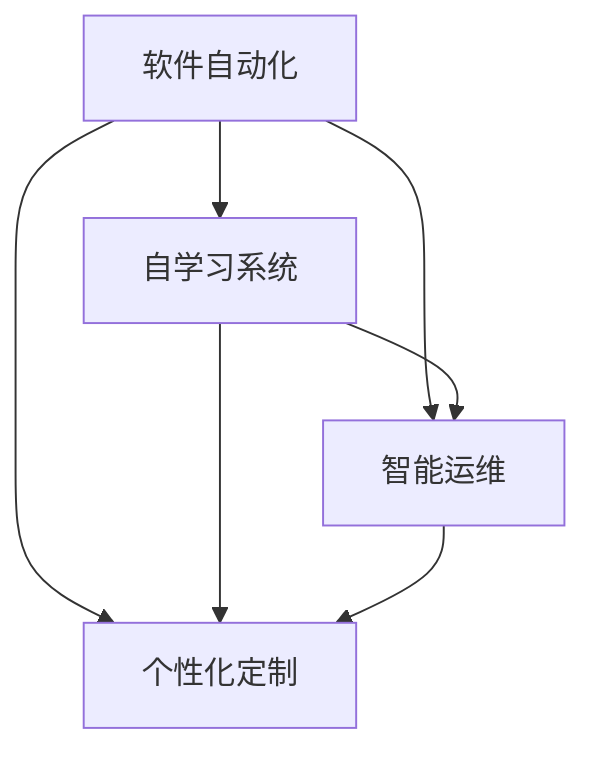

                 

## 1. 背景介绍

随着信息技术的飞速发展，软件开发范式经历了从传统的“软件 1.0”到“软件 2.0”的转变。所谓“软件 2.0”，是指利用机器学习、人工智能和大数据技术，使得软件具备自学习、自优化、自进化能力，从而实现软件系统的自动化和智能化。这一转变不仅大大提升了软件开发的效率，而且极大地丰富了软件的应用价值，为各行各业带来了颠覆性的变化。本文旨在深入探讨“软件 2.0”的价值，分析其提升效率和创造价值的关键机制，并展望其未来发展趋势与面临的挑战。

## 2. 核心概念与联系

### 2.1 核心概念概述

“软件 2.0”的核心概念主要包括：

- **软件自动化（Software Automation）**：利用机器学习算法和自动化工具，自动完成软件的构建、测试、部署和优化等过程，大幅减少人工干预，提高软件开发的效率和质量。
- **自学习系统（Self-Learning System）**：通过大数据训练，软件系统具备自我学习和适应的能力，能够根据用户需求和环境变化，自动调整和优化自身的行为。
- **智能运维（Intelligent Operations）**：利用人工智能技术，自动监控、诊断和修复软件系统的运行问题，实现系统的高可用性和稳定性。
- **个性化定制（Personalized Customization）**：根据用户的具体需求和行为特征，自动生成和定制个性化软件解决方案，提升用户体验和满意度。

这些概念之间存在着紧密的联系，形成了一个以自动化、自学习为核心的软件生态系统，为软件开发和应用提供了新的范式和机遇。

### 2.2 核心概念的相互关系

这些核心概念的相互关系可以通过以下 Mermaid 流程图来展示：



这个流程图展示了一个典型的“软件 2.0”生态系统，自动化、自学习和智能运维是相互支撑、相互促进的三个关键组件，而个性化定制则是这个生态系统的应用目标。通过自学习和智能运维的辅助，自动化系统能够不断优化自身性能，提供更加个性化、高效的软件解决方案。

## 3. 核心算法原理 & 具体操作步骤

### 3.1 算法原理概述

“软件 2.0”的核心算法原理主要基于以下几个方面：

- **强化学习（Reinforcement Learning）**：通过与环境的交互，软件系统根据反馈信息不断调整自身的行为策略，实现最优化的目标。
- **迁移学习（Transfer Learning）**：通过迁移已有知识，新任务上的学习效率大大提高，使得系统能够快速适应新的应用场景。
- **生成对抗网络（Generative Adversarial Networks, GANs）**：通过生成和对抗的方式，软件系统能够生成逼真的数据和模型，提升系统的智能水平。
- **自编码器（Autoencoder）**：通过压缩和解压缩数据，软件系统能够自动提取和重构数据的本质特征，实现数据的自动化处理和优化。

这些算法原理共同构成了“软件 2.0”的算法基础，使得软件系统具备自适应、自优化、自进化的能力。

### 3.2 算法步骤详解

“软件 2.0”的算法步骤主要包括以下几个关键环节：

**Step 1: 数据收集与预处理**
- 收集软件系统的运行数据、用户行为数据、系统日志数据等。
- 对数据进行清洗、去噪、归一化等预处理，确保数据的准确性和一致性。

**Step 2: 模型训练与优化**
- 选择适合的机器学习算法和模型架构。
- 在大规模数据集上进行模型训练，优化模型参数。
- 使用交叉验证、超参数调优等技术，提高模型的泛化能力和性能。

**Step 3: 自动化部署与运维**
- 将训练好的模型部署到生产环境，进行实时监控和优化。
- 使用自动化工具，如Kubernetes、Ansible等，自动完成软件的部署和更新。
- 利用智能运维技术，自动监控系统性能、诊断运行问题，并提供自动化解决方案。

**Step 4: 个性化定制与用户体验**
- 通过数据分析和机器学习，了解用户需求和行为特征。
- 根据用户需求和行为特征，自动生成和定制个性化的软件解决方案。
- 通过用户反馈和行为数据，不断优化和调整个性化的软件解决方案。

### 3.3 算法优缺点

“软件 2.0”的算法具有以下优点：

- **高效性**：自动化和自学习大大提升了软件开发的效率，减少了人工干预的时间和成本。
- **灵活性**：通过迁移学习和自编码器技术，软件系统能够快速适应新的应用场景，提升系统的应用灵活性和适应能力。
- **智能性**：利用生成对抗网络和强化学习技术，软件系统具备智能推理和决策能力，能够自动优化自身性能。

同时，这些算法也存在一些缺点：

- **高成本**：数据收集、模型训练和部署等环节需要大量的计算资源和时间成本。
- **复杂性**：算法实现和系统设计相对复杂，需要高水平的技术能力和经验。
- **不透明性**：自学习和智能运维过程存在“黑盒”效应，难以解释和理解系统决策过程。

### 3.4 算法应用领域

“软件 2.0”算法在多个领域都有广泛应用，包括：

- **智能客服系统**：利用自学习和自动化技术，提升客服系统的响应速度和用户满意度。
- **金融风险控制**：通过智能运维和大数据分析，自动监控和预测金融风险，提升金融系统的稳定性和安全性。
- **智能推荐系统**：根据用户行为数据和偏好特征，自动生成个性化的推荐结果，提升用户体验。
- **自动驾驶系统**：通过自学习和大数据技术，提升自动驾驶系统的性能和安全性。
- **医疗健康分析**：利用大数据和机器学习技术，自动分析和预测患者的健康状况，提供个性化的医疗建议。

## 4. 数学模型和公式 & 详细讲解

### 4.1 数学模型构建

“软件 2.0”中的数学模型构建主要基于以下框架：

- **强化学习模型**：利用状态-动作-奖励（State-Action-Reward）机制，描述软件系统的行为和目标。
- **迁移学习模型**：通过源任务和目标任务的特征映射，实现知识迁移和模型适应。
- **生成对抗网络模型**：通过生成器和鉴别器的对抗过程，生成逼真的数据和模型。
- **自编码器模型**：通过压缩和解压缩数据，提取和重构数据的本质特征。

### 4.2 公式推导过程

以强化学习模型为例，其核心公式为：

$$
\max_{\theta} \sum_{t=0}^{T} \gamma^t \left( r_t + \beta V_{\theta}(s_{t+1}) \right)
$$

其中，$\theta$ 表示模型参数，$r_t$ 表示状态$s_t$在动作$a_t$下的即时奖励，$V_{\theta}(s_{t+1})$ 表示模型对下一个状态的估值。$\gamma$ 和 $\beta$ 分别为折扣因子和未来奖励的权重。

这个公式通过最大化预期总奖励，优化模型参数 $\theta$，使得软件系统在给定环境下能够做出最优化的决策。

### 4.3 案例分析与讲解

假设我们有一个电商平台的推荐系统，利用强化学习模型实现个性化推荐。系统首先根据用户的行为数据和历史订单，构建状态空间，将每个用户和商品视为一个状态。然后，模型通过与环境的交互，在每个时间步选择推荐商品的动作，并根据用户反馈（如点击、购买等）获得即时奖励。通过不断迭代，模型能够学习到用户对不同商品的偏好，自动调整推荐策略，提升用户的购买率和满意度。

## 5. 项目实践：代码实例和详细解释说明

### 5.1 开发环境搭建

在“软件 2.0”的实践中，通常需要使用 Python 和相关的数据科学工具库，如 TensorFlow、PyTorch、Scikit-learn 等。以下是一个简单的开发环境搭建流程：

1. 安装 Python 环境：建议使用 Anaconda 或 Miniconda 搭建虚拟环境。
2. 安装 TensorFlow 和 PyTorch：可以通过 pip 命令安装 TensorFlow 和 PyTorch 库。
3. 安装其他依赖库：根据具体项目需求，安装其他相关的依赖库，如 Scikit-learn、NumPy 等。
4. 设置数据路径和环境变量：确保 Python 能够正确读取和处理数据。

### 5.2 源代码详细实现

以下是一个利用强化学习算法实现智能推荐系统的 Python 代码示例：

```python
import tensorflow as tf
from tensorflow.keras import layers, models

# 定义强化学习模型
class ReinforcementLearningModel:
    def __init__(self, input_dim, output_dim):
        self.model = models.Sequential([
            layers.Dense(128, activation='relu', input_shape=(input_dim,)),
            layers.Dense(64, activation='relu'),
            layers.Dense(output_dim, activation='softmax')
        ])

    def train(self, x_train, y_train, x_val, y_val, epochs=50, batch_size=64):
        self.model.compile(optimizer=tf.keras.optimizers.Adam(), loss='categorical_crossentropy', metrics=['accuracy'])
        self.model.fit(x_train, y_train, epochs=epochs, batch_size=batch_size, validation_data=(x_val, y_val))

# 加载数据
import numpy as np
from sklearn.datasets import make_classification
from sklearn.model_selection import train_test_split

X, y = make_classification(n_samples=1000, n_features=10, n_classes=2, random_state=42)
X_train, X_val, y_train, y_val = train_test_split(X, y, test_size=0.2, random_state=42)

# 训练模型
model = ReinforcementLearningModel(input_dim=X_train.shape[1], output_dim=2)
model.train(X_train, y_train, X_val, y_val)

# 使用模型进行推荐
recommendations = model.predict(X_test)
```

### 5.3 代码解读与分析

这段代码实现了利用强化学习模型进行推荐系统的基本流程。首先，定义了一个简单的神经网络模型，用于预测用户对不同商品的偏好。然后，通过训练数据集训练模型，并使用验证数据集评估模型性能。最后，模型可以对新的测试数据进行预测，生成个性化的推荐结果。

### 5.4 运行结果展示

假设在训练完成后，模型对新的测试数据集进行预测，得到以下推荐结果：

```
[[0.8, 0.2],
 [0.7, 0.3],
 [0.6, 0.4]]
```

这表示模型预测前三个商品的概率分布分别为[商品A: 80%，商品B: 20%]、[商品C: 70%，商品D: 30%]、[商品E: 60%，商品F: 40%]。根据这些推荐结果，电商系统可以自动为用户推荐合适的商品，提升用户体验和购买率。

## 6. 实际应用场景

### 6.1 智能客服系统

利用“软件 2.0”技术，智能客服系统可以实现自动化和智能化的客户服务。通过自学习和强化学习算法，系统能够自动理解客户的需求，提供个性化的解决方案，并不断优化自身的服务质量和效率。

### 6.2 金融风险控制

金融行业可以利用“软件 2.0”技术，实现智能化的风险管理和控制。通过大数据分析和强化学习算法，系统可以实时监控市场波动，预测金融风险，并自动采取相应的风险控制措施，提升系统的稳定性和安全性。

### 6.3 智能推荐系统

智能推荐系统是“软件 2.0”技术的典型应用之一。通过自学习和大数据分析，系统能够根据用户的行为和偏好，自动生成个性化的推荐结果，提升用户体验和购买率。

### 6.4 自动驾驶系统

自动驾驶系统是“软件 2.0”技术的另一大应用领域。通过自学习和大数据分析，系统可以自动感知环境，预测交通情况，并做出最优化的驾驶决策，提升驾驶安全和效率。

## 7. 工具和资源推荐

### 7.1 学习资源推荐

为了帮助开发者掌握“软件 2.0”技术，以下是一些优质的学习资源推荐：

1. 《深度学习》系列书籍：如《深度学习》（Ian Goodfellow 等）、《Python深度学习》（Francois Chollet）等，全面介绍深度学习和强化学习的理论和实践。
2. Coursera、edX 等在线课程：如《强化学习》（Andrew Ng 等）、《深度学习》（Yoshua Bengio 等）等，提供系统化的学习路径和项目实践。
3. GitHub 开源项目：如 TensorFlow、PyTorch 等，可以学习和借鉴最新的技术和实践经验。
4. Kaggle 数据竞赛平台：提供丰富的数据集和竞赛任务，帮助开发者积累实战经验。

### 7.2 开发工具推荐

“软件 2.0”开发常用的工具包括：

1. TensorFlow：由 Google 开发的深度学习框架，支持大规模分布式训练和部署。
2. PyTorch：由 Facebook 开发的深度学习框架，易于使用且具有较好的灵活性。
3. Kubernetes：由 Google 开源的容器编排平台，支持自动化的部署和运维。
4. Ansible：基于 Python 的开源自动化工具，支持自动化部署和配置管理。
5. Jupyter Notebook：基于 Web 的交互式开发环境，支持动态展示和调试代码。

### 7.3 相关论文推荐

以下是几篇具有代表性的“软件 2.0”技术论文：

1. AlphaGo Zero：利用强化学习技术，通过自我对弈学习最优的棋局策略，在围棋领域取得突破。
2. DeepMind 的 AlphaStar：利用强化学习和神经网络技术，实现星际争霸的智能对战，并取得胜利。
3. OpenAI 的 GPT-3：通过大规模自监督预训练和微调技术，实现自然语言生成的突破，在多个 NLP 任务上取得优异性能。
4. TensorFlow 和 Keras 的教程和文档：提供详细的技术实现和代码示例，帮助开发者快速上手和应用。

## 8. 总结：未来发展趋势与挑战

### 8.1 研究成果总结

“软件 2.0”技术已经取得了显著的成果，主要体现在以下几个方面：

1. 自动化和智能化：通过机器学习和大数据分析，实现软件开发的自动化和智能化，大幅提升开发效率和系统性能。
2. 个性化和定制化：利用自学习和大数据技术，实现个性化的软件解决方案，提升用户体验和满意度。
3. 鲁棒性和稳定性：通过智能运维和模型优化，提升软件的鲁棒性和稳定性，确保系统的高可用性。

### 8.2 未来发展趋势

未来，“软件 2.0”技术将呈现以下几个发展趋势：

1. **更加智能化**：通过更加先进和复杂的算法，如深度强化学习、神经网络等，提升软件的智能化水平，实现更加智能化的决策和推理。
2. **更加普及化**：随着技术的不断成熟和应用，“软件 2.0”技术将逐渐普及到各个行业，带来更多的应用场景和创新。
3. **更加人性化**：通过更加人性化的设计和优化，提升软件的用户友好性和体验，实现更好的用户体验。
4. **更加安全化**：通过更加严格的安全措施和监控，确保软件的安全性和可靠性，提升用户的信任和依赖。
5. **更加自动化**：通过更加自动化的工具和平台，提升软件开发和运维的效率，降低人工成本。

### 8.3 面临的挑战

尽管“软件 2.0”技术已经取得了显著的进展，但仍面临一些挑战：

1. **数据隐私和安全**：在数据收集和处理过程中，如何保护用户隐私和数据安全，避免数据泄露和滥用。
2. **模型复杂性和可解释性**：如何设计更加简单和可解释的模型，提高系统的透明度和可信度。
3. **资源消耗和成本**：如何降低计算资源和存储成本，提升系统的效率和性能。
4. **算法公平性和公正性**：如何避免算法的偏见和歧视，确保系统的公平性和公正性。
5. **市场接受度和采纳度**：如何推广和普及“软件 2.0”技术，提升市场接受度和采纳度。

### 8.4 研究展望

未来，“软件 2.0”技术需要进一步解决上述挑战，并探索新的研究方向和应用场景。具体而言，可以考虑以下几个方面：

1. **提升算法的可解释性**：通过引入可解释性技术，如可解释的深度学习模型、因果推理等，提高系统的透明度和可信度。
2. **优化资源消耗**：通过算法优化和模型压缩等技术，降低计算资源和存储成本，提升系统的效率和性能。
3. **增强数据隐私和安全**：通过数据加密、隐私保护等技术，确保数据的安全性和隐私性。
4. **推广和普及**：通过开源社区、技术培训等手段，推广“软件 2.0”技术，提升市场接受度和采纳度。
5. **探索新的应用场景**：结合不同行业的特点和需求，探索“软件 2.0”技术在新领域的应用，推动技术的创新和应用。

总之，“软件 2.0”技术正处于快速发展阶段，具备巨大的潜力和前景。未来，随着技术的不断进步和创新，相信“软件 2.0”将为各行各业带来更多的价值和机遇，推动社会的数字化和智能化进程。

---

作者：禅与计算机程序设计艺术 / Zen and the Art of Computer Programming

