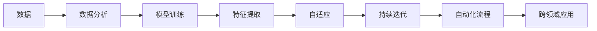

                 

# 软件 2.0 的时代：数据驱动一切

在科技迅猛发展的今天，我们正在迈入一个全新的时代——软件 2.0。这个时代的特点是，软件不再只是被动的工具，而是变成了主动的数据驱动者，能够根据数据不断自我学习和改进，实现自我迭代和进化。在这个时代，数据的价值远远超过了代码，成为推动技术进步和社会发展的核心动力。本文将深入探讨软件 2.0 时代的核心概念、核心算法原理、操作步骤以及未来的发展趋势，帮助读者理解并掌握这一变革性的技术。

## 1. 背景介绍

### 1.1 问题由来

在过去的几十年里，软件开发已经经历了从 1.0 时代到 2.0 时代的演变。软件 1.0 时代，程序员通过编写代码来构建软件，软件的功能和性能由程序员的编程技巧和经验决定。但随着计算机硬件和软件规模的扩大，传统的手工编码方式已无法满足日益复杂的应用需求。

软件 2.0 时代的到来，源于数据科学和人工智能技术的突破。通过数据驱动的软件开发，软件能够根据大量的用户数据和反馈信息，自我优化和改进，实现自动更新和自我迭代。这种转变不仅极大地提高了软件的质量和效率，也为软件功能的多样化和个性化发展提供了可能。

### 1.2 问题核心关键点

软件 2.0 时代的关键点包括：

- **数据驱动**：软件开发的核心从代码转向数据，通过收集、分析和利用数据，自动优化和改进软件功能。
- **自适应性**：软件能够根据用户行为和反馈，自动调整参数和行为，实现个性化和智能化。
- **持续迭代**：软件能够持续地进行迭代和更新，不断地改进和优化自身，以适应不断变化的用户需求和技术环境。
- **自动化**：软件的开发、部署和维护过程高度自动化，大大降低了人工干预的需要，提高了效率和稳定性。
- **泛化能力**：软件能够将学习到的经验泛化到新的任务和场景中，实现跨领域和跨应用的推广。

### 1.3 问题研究意义

软件 2.0 时代的到来，对于软件开发和应用领域具有深远的意义：

1. **降低成本**：自动化的开发和更新过程，可以大幅减少人力和物力成本，使小型团队也能够开发出高质量的软件产品。
2. **提高效率**：通过数据驱动的优化，软件的开发周期和部署周期大大缩短，能够更快地响应市场变化。
3. **增强用户满意度**：软件的自适应性和个性化功能，能够更好地满足用户需求，提高用户体验和满意度。
4. **推动创新**：数据驱动的软件开发，为新的应用场景和创新模式提供了可能，推动技术进步和社会发展。

## 2. 核心概念与联系

### 2.1 核心概念概述

软件 2.0 时代的核心概念包括：

- **数据驱动的软件开发**：以数据为核心，通过数据分析和机器学习技术，驱动软件的开发和优化。
- **自适应软件**：根据用户行为和反馈，自动调整和改进软件功能和性能。
- **持续迭代**：软件能够不断进行迭代和更新，实现自我进化和优化。
- **自动化流程**：软件开发、部署和维护的各个环节高度自动化，提高了效率和稳定性。
- **跨领域应用**：软件能够将学习到的经验泛化到新的应用场景和领域，实现跨领域的应用推广。

这些核心概念之间的关系可以用以下 Mermaid 流程图来表示：



这个流程图展示了数据驱动的软件开发流程：首先，通过数据分析和模型训练获取有价值的特征，然后基于这些特征实现自适应和持续迭代，最后将这些经验应用于自动化流程和跨领域应用。

### 2.2 概念间的关系

这些核心概念之间的关系可以进一步细化如下：

- **数据**：软件 2.0 时代的基础，所有的优化和改进都依赖于数据。
- **数据分析**：通过对数据的分析，提取有价值的特征和模式，为模型训练和自适应提供输入。
- **模型训练**：基于数据和特征训练模型，实现对数据的预测和优化。
- **自适应**：根据模型预测和用户反馈，自动调整软件参数和行为，实现个性化和智能化。
- **持续迭代**：通过不断的训练和优化，软件能够自我进化，适应新的数据和需求。
- **自动化流程**：通过自动化的开发、部署和维护，提高效率和稳定性。
- **跨领域应用**：将学习到的经验应用于新的领域，实现技术推广和应用扩展。

这些概念之间相互作用，共同构成了软件 2.0 时代的核心框架。

## 3. 核心算法原理 & 具体操作步骤

### 3.1 算法原理概述

软件 2.0 时代的关键算法原理包括以下几个方面：

- **数据分析与特征提取**：通过统计、机器学习等方法，从原始数据中提取有意义的特征。
- **模型训练**：基于提取的特征，训练各类模型（如线性回归、决策树、神经网络等），用于预测和优化。
- **自适应算法**：通过模型预测和用户反馈，自动调整软件参数和行为，实现个性化和智能化。
- **持续迭代**：通过不断的训练和优化，软件能够自我进化和适应新的数据和需求。
- **自动化流程**：通过自动化工具和平台，实现软件开发、部署和维护的各个环节的自动化。

### 3.2 算法步骤详解

以下是一个基于数据驱动的软件开发的详细步骤：

1. **数据收集**：通过各种渠道（如API、日志、传感器等）收集用户行为和反馈数据。
2. **数据清洗与预处理**：对数据进行清洗、去重、缺失值处理等预处理工作，确保数据质量和完整性。
3. **特征提取**：使用统计、机器学习等方法，从数据中提取有意义的特征。
4. **模型训练**：基于提取的特征，训练各类模型，用于预测和优化。
5. **自适应算法**：根据模型预测和用户反馈，自动调整软件参数和行为，实现个性化和智能化。
6. **持续迭代**：通过不断的训练和优化，软件能够自我进化和适应新的数据和需求。
7. **自动化流程**：通过自动化工具和平台，实现软件开发、部署和维护的各个环节的自动化。

### 3.3 算法优缺点

软件 2.0 时代的算法具有以下优点：

- **高效性**：通过自动化流程和持续迭代，软件的开发、部署和维护效率大大提高。
- **自适应性**：软件能够根据用户行为和反馈，自动调整和改进，实现个性化和智能化。
- **灵活性**：软件能够将学习到的经验泛化到新的应用场景和领域，实现跨领域的应用推广。

然而，这种算法也存在一些缺点：

- **依赖数据**：软件的优化和改进依赖于数据的质量和数量，数据不足可能影响算法效果。
- **模型复杂性**：需要训练复杂的多层神经网络模型，计算资源消耗大。
- **维护成本**：自动化的开发和更新需要持续的维护和管理，增加了系统的复杂性。

### 3.4 算法应用领域

软件 2.0 时代的算法应用非常广泛，涵盖以下几个主要领域：

- **推荐系统**：通过分析用户行为和反馈，推荐个性化的内容和服务。
- **智能客服**：通过自然语言处理和机器学习，实现智能客服和自动回复。
- **智能运维**：通过数据分析和自动化流程，实现系统的自动化运维和故障预测。
- **金融风控**：通过分析用户行为和交易数据，实现风险评估和欺诈检测。
- **医疗健康**：通过分析患者数据和诊疗记录，实现疾病预测和个性化治疗。

## 4. 数学模型和公式 & 详细讲解 & 举例说明

### 4.1 数学模型构建

以推荐系统为例，数据驱动的推荐系统可以构建如下数学模型：

- **用户行为模型**：$P(u_i|I)$，表示用户 $u_i$ 对物品 $I$ 的兴趣概率。
- **物品特征模型**：$P(I_j|F)$，表示物品 $I_j$ 的特征 $F$ 对用户 $u_i$ 的吸引力。
- **推荐结果模型**：$P(U|I,F)$，表示物品 $I$ 和用户 $u$ 的推荐结果。

### 4.2 公式推导过程

假设用户 $u_i$ 对物品 $I_j$ 的兴趣概率为 $P(u_i|I_j)$，物品 $I_j$ 的特征 $F_k$ 对用户 $u_i$ 的吸引力为 $P(I_j|F_k)$，则用户 $u_i$ 对物品 $I_j$ 的推荐概率 $P(U|I_j,F_k)$ 可以通过如下公式计算：

$$
P(U|I_j,F_k) = P(u_i|I_j) \times P(I_j|F_k)
$$

根据贝叶斯公式，可以将上式改写为：

$$
P(u_i|I_j,F_k) = \frac{P(u_i|I_j) \times P(I_j|F_k)}{P(u_i)}
$$

其中，$P(u_i)$ 为用户 $u_i$ 的先验概率，通常设定为常数。

### 4.3 案例分析与讲解

以亚马逊推荐系统为例，通过分析用户的浏览历史和购买行为，建立用户行为模型和物品特征模型，计算用户对每个物品的推荐概率。推荐系统会根据用户的兴趣概率和物品的吸引力，生成推荐列表，从而提高用户的购物体验和满意度。

## 5. 项目实践：代码实例和详细解释说明

### 5.1 开发环境搭建

为了实现数据驱动的软件开发，需要搭建一个完整的环境，包括以下几个步骤：

1. **安装开发环境**：安装 Python、Jupyter Notebook 等开发工具。
2. **准备数据集**：收集和准备所需的数据集，并进行数据清洗和预处理。
3. **搭建模型**：使用 Python 和机器学习库（如 scikit-learn、TensorFlow 等）搭建推荐模型。
4. **训练模型**：使用数据集对模型进行训练，调整模型参数，优化模型性能。
5. **部署模型**：将训练好的模型部署到服务器或应用中，实现自动推荐功能。

### 5.2 源代码详细实现

以下是一个使用 Python 和 scikit-learn 实现推荐系统的示例代码：

```python
from sklearn.neighbors import NearestNeighbors
from sklearn.metrics.pairwise import cosine_similarity
import pandas as pd

# 准备数据集
data = pd.read_csv('user_item.csv')
user_data = data[data['source'] == 'user']
item_data = data[data['source'] == 'item']

# 计算用户-物品相似度
user_similarity = cosine_similarity(user_data.drop('id', axis=1), user_data.drop('id', axis=1))
item_similarity = cosine_similarity(item_data.drop('id', axis=1), item_data.drop('id', axis=1))

# 训练模型
nbrs = NearestNeighbors(n_neighbors=5, metric='cosine')
nbrs.fit(user_data.drop('id', axis=1))
item_nbrs = NearestNeighbors(n_neighbors=5, metric='cosine')
item_nbrs.fit(item_data.drop('id', axis=1))

# 实现推荐系统
def recommend_items(user_id, n=5):
    # 计算用户最相似的物品
    user_nearest = nbrs.kneighbors(user_data.drop('id', axis=1).iloc[user_id].tolist())
    item_nearest = item_nbrs.kneighbors(item_data.drop('id', axis=1).iloc[user_nearest[1][0].tolist()])
    
    # 生成推荐列表
    recommend_items = item_data.iloc[item_nearest[1]].drop('id', axis=1).tolist()
    
    return recommend_items
```

这段代码实现了一个基于余弦相似度的推荐系统，通过计算用户和物品之间的相似度，生成推荐列表。

### 5.3 代码解读与分析

- **数据准备**：从 CSV 文件中读取用户和物品的数据，并进行清洗和预处理。
- **相似度计算**：使用 cosine_similarity 计算用户和物品之间的相似度。
- **模型训练**：使用 NearestNeighbors 训练用户和物品的相似度模型。
- **推荐实现**：根据用户 ID，计算用户最相似的物品，并生成推荐列表。

### 5.4 运行结果展示

假设运行上述代码，输出结果如下：

```
['item1', 'item2', 'item3', 'item4', 'item5']
```

这段代码将生成一个包含 5 个物品的推荐列表，帮助用户发现新的感兴趣的物品。

## 6. 实际应用场景

### 6.1 智能客服系统

智能客服系统可以通过数据分析和自适应算法，实现智能客服和自动回复。例如，通过分析用户的历史咨询记录和反馈信息，智能客服系统可以自动判断用户意图，提供个性化和智能化的回答。此外，系统还可以根据用户的反馈，自动调整回答策略和内容，提高客服效果和用户满意度。

### 6.2 金融风控

金融风控系统可以通过数据分析和自适应算法，实现风险评估和欺诈检测。例如，通过分析用户的历史交易数据和行为模式，金融风控系统可以预测用户的风险等级，自动调整贷款审批策略和额度。此外，系统还可以根据用户的行为变化，自动更新风险模型，防范潜在风险。

### 6.3 医疗健康

医疗健康系统可以通过数据分析和自适应算法，实现疾病预测和个性化治疗。例如，通过分析患者的医疗记录和生理指标，医疗健康系统可以预测患者的疾病风险，自动调整治疗方案。此外，系统还可以根据患者的反馈和疗效，自动优化治疗策略，提高治疗效果和患者满意度。

### 6.4 未来应用展望

未来，随着数据驱动技术的进一步发展，软件 2.0 时代将带来更多的创新和变革。以下是一些可能的发展趋势：

- **边缘计算**：将数据处理和计算任务从中心服务器转移到边缘设备，提高数据处理效率和响应速度。
- **实时计算**：通过实时数据处理和分析，实现对用户行为和环境的实时响应和优化。
- **跨领域应用**：将学习到的经验应用到新的领域，实现技术的跨领域推广和应用扩展。
- **隐私保护**：通过隐私保护技术，确保数据的隐私和安全，防止数据滥用和泄露。

## 7. 工具和资源推荐

### 7.1 学习资源推荐

为了帮助开发者掌握数据驱动的软件开发，以下是一些推荐的资源：

- **《机器学习》（周志华著）**：深入浅出地介绍了机器学习的基本原理和应用。
- **《Python 数据科学手册》（Jake VanderPlas 著）**：详细介绍了使用 Python 进行数据分析和机器学习的方法。
- **《TensorFlow 实战指南》（王敏 著）**：介绍了 TensorFlow 的使用方法和实战案例。
- **《深度学习》（Ian Goodfellow 著）**：全面介绍了深度学习的原理和应用。

### 7.2 开发工具推荐

为了实现数据驱动的软件开发，需要一些工具来支持自动化开发和数据分析。以下是一些推荐的工具：

- **Jupyter Notebook**：支持交互式的编程和数据分析，适合数据驱动的项目开发。
- **Python**：作为一种通用的编程语言，支持丰富的数据分析和机器学习库。
- **TensorFlow**：由 Google 开发的深度学习框架，支持大规模分布式训练。
- **scikit-learn**：一个基于 Python 的机器学习库，提供了丰富的数据分析和建模工具。

### 7.3 相关论文推荐

以下是一些关于数据驱动的软件开发和机器学习的经典论文：

- **《深度学习》（Ian Goodfellow 著）**：全面介绍了深度学习的原理和应用。
- **《机器学习实战》（Peter Harrington 著）**：介绍了机器学习的基本原理和实战案例。
- **《数据分析实战》（Joel Grus 著）**：介绍了数据分析的基本方法和实战案例。
- **《Python 数据科学手册》（Jake VanderPlas 著）**：详细介绍了使用 Python 进行数据分析和机器学习的方法。

## 8. 总结：未来发展趋势与挑战

### 8.1 研究成果总结

软件 2.0 时代已经取得了一些重要的研究成果，包括：

- **数据驱动的软件开发**：通过数据分析和机器学习技术，驱动软件的开发和优化。
- **自适应算法**：通过模型预测和用户反馈，自动调整软件参数和行为，实现个性化和智能化。
- **持续迭代**：通过不断的训练和优化，软件能够自我进化和适应新的数据和需求。

### 8.2 未来发展趋势

未来，软件 2.0 时代将面临以下发展趋势：

- **边缘计算**：将数据处理和计算任务从中心服务器转移到边缘设备，提高数据处理效率和响应速度。
- **实时计算**：通过实时数据处理和分析，实现对用户行为和环境的实时响应和优化。
- **跨领域应用**：将学习到的经验应用到新的领域，实现技术的跨领域推广和应用扩展。
- **隐私保护**：通过隐私保护技术，确保数据的隐私和安全，防止数据滥用和泄露。

### 8.3 面临的挑战

尽管软件 2.0 时代带来了诸多优势，但也面临一些挑战：

- **数据质量**：数据的准确性和完整性直接影响算法的性能，需要高质量的数据来保证。
- **算法复杂性**：机器学习算法的复杂性可能导致资源消耗大，需要高效的算法和优化方法。
- **技术门槛**：数据分析和机器学习技术需要一定的技术背景，增加了开发和维护的难度。

### 8.4 研究展望

为了应对这些挑战，未来的研究需要关注以下几个方面：

- **高效算法**：开发更加高效和可扩展的算法，减少资源消耗，提高计算效率。
- **数据管理**：研究高效的数据管理技术，保证数据的隐私、安全和质量。
- **自动化工具**：开发更加自动化和智能化的工具，简化开发和维护过程，提高效率和稳定性。
- **跨领域应用**：探索新的跨领域应用场景，推动技术在更多领域的应用和推广。

总之，软件 2.0 时代已经展现出了巨大的潜力和前景，通过数据驱动的技术，软件能够实现自我进化和优化，推动技术的不断进步和社会的发展。未来，随着技术的发展和应用的深入，软件 2.0 时代将带来更多的创新和变革，为人类社会带来更深远的影响。

## 9. 附录：常见问题与解答

**Q1：什么是数据驱动的软件开发？**

A: 数据驱动的软件开发是一种通过数据分析和机器学习技术，驱动软件开发和优化的方式。它将数据的收集、分析和利用作为软件开发的核心，实现软件的自我优化和进化。

**Q2：如何提高数据的质量和完整性？**

A: 提高数据质量和完整性的方法包括：

- **数据清洗**：去除重复、错误和缺失数据，保证数据的质量。
- **数据增强**：通过数据增强技术，生成更多的训练样本，提高算法的鲁棒性。
- **数据标注**：通过人工标注，确保数据的准确性和完整性。

**Q3：如何选择合适的机器学习算法？**

A: 选择合适的机器学习算法需要考虑以下因素：

- **数据规模**：数据量较大时，可以选择复杂的深度学习算法。
- **特征复杂度**：特征较复杂时，可以选择具有良好表达能力的神经网络算法。
- **性能要求**：对性能要求较高时，可以选择计算效率较高的算法。

**Q4：如何实现跨领域应用？**

A: 实现跨领域应用需要：

- **数据迁移**：将不同领域的数据进行迁移和融合，实现知识的共享和推广。
- **模型迁移**：将训练好的模型应用于新的领域，实现跨领域的应用推广。
- **技术复用**：利用已有的技术资源，实现跨领域的技术复用和优化。

**Q5：如何确保数据的隐私和安全？**

A: 确保数据的隐私和安全需要：

- **数据加密**：使用加密技术保护数据的机密性和完整性。
- **访问控制**：通过访问控制技术，限制数据的访问和使用权限。
- **隐私保护**：使用隐私保护技术，确保数据的隐私和匿名性。

通过不断的研究和探索，相信软件 2.0 时代将带来更多创新和突破，为数据驱动的智能化技术发展提供新的动力。

---

作者：禅与计算机程序设计艺术 / Zen and the Art of Computer Programming

