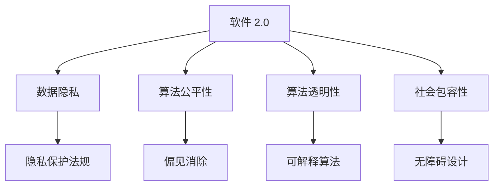
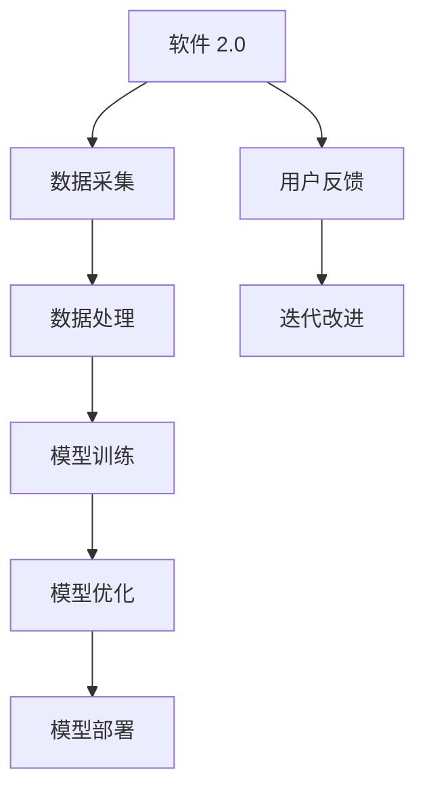
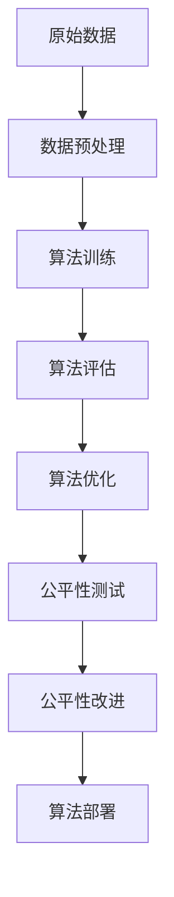
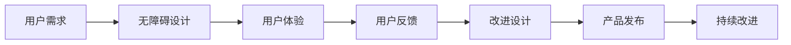
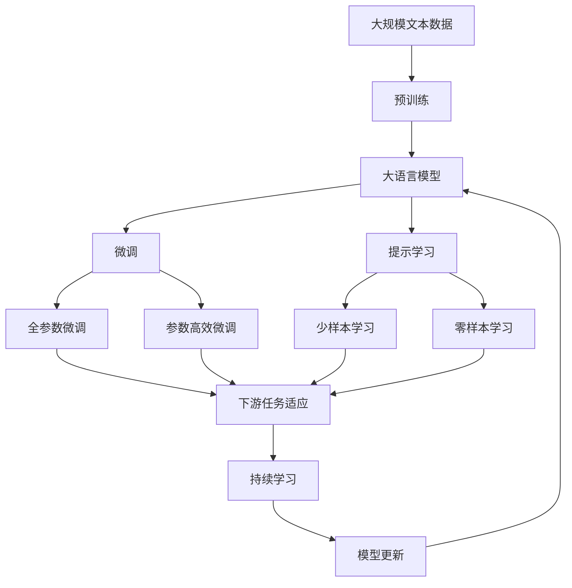

                 

# 软件 2.0 的社会责任：科技向善

> 关键词：软件 2.0, 社会责任, 科技向善, 人工智能, 机器伦理, 公平与透明

## 1. 背景介绍

### 1.1 问题由来

随着软件技术的不断进步，特别是人工智能和大数据的应用，我们正进入一个全新的时代——软件 2.0。这一时代，软件不再仅仅作为工具，而是成为一种赋能社会、改善人类生活的力量。然而，伴随着技术的发展，我们也面临着前所未有的挑战：数据隐私、算法偏见、数字鸿沟等问题日益凸显，科技的“双刃剑”效应愈发明显。如何确保软件 2.0 能够真正造福社会，实现科技向善，成为当下科技工作者必须深思的问题。

### 1.2 问题核心关键点

软件 2.0 的核心在于其智能化和自动化，通过算法和大数据驱动决策。但这一过程不可避免地涉及数据的采集、处理和应用，以及算法的训练和优化。因此，如何保证数据的安全、公正、透明，以及算法的可解释性和可控性，成为软件 2.0 社会责任的关键。

1. **数据隐私保护**：在数据收集、存储和使用过程中，必须遵守隐私保护法规，确保用户数据不被滥用。
2. **算法公平性**：算法必须公正无私，避免因数据偏差导致的不公平结果。
3. **算法透明性**：算法的决策过程应透明可解释，便于用户理解和信任。
4. **社会包容性**：软件 2.0 应考虑不同群体的需求，促进数字鸿沟的缩小。

### 1.3 问题研究意义

确保软件 2.0 的负责任使用，对于推动社会公平、提升公众信任、促进经济可持续发展具有重要意义：

1. **促进社会公平**：通过科技手段，为弱势群体提供平等的教育、就业、医疗等机会，缩小社会不平等。
2. **提升公众信任**：透明、公平的算法使用，能够增强公众对技术的信任感，促进其广泛应用。
3. **促进经济可持续发展**：通过优化资源配置、提高效率，推动绿色、可持续的经济模式。
4. **促进社会和谐**：帮助解决社会问题，如公共安全、环境保护、城市管理等，提升社会治理水平。

## 2. 核心概念与联系

### 2.1 核心概念概述

为更好地理解软件 2.0 的社会责任，本节将介绍几个关键概念：

- **软件 2.0 (Software 2.0)**：基于人工智能、大数据等技术驱动的新一代软件。其特点是自动化、智能化、自适应，能够根据用户需求和数据反馈，不断优化自身功能和性能。
- **数据隐私 (Data Privacy)**：确保用户数据不被未经授权的第三方获取、使用或共享，保护用户隐私权。
- **算法公平性 (Algorithmic Fairness)**：算法在处理数据时，确保不因种族、性别、年龄、职业等属性产生不公平的结果。
- **算法透明性 (Algorithmic Transparency)**：算法的决策过程应公开透明，便于用户和监管机构理解、审查。
- **社会包容性 (Social Inclusivity)**：软件 2.0 设计应考虑不同群体需求，缩小数字鸿沟，确保技术惠及全体公民。

这些概念之间的逻辑关系可以通过以下 Mermaid 流程图来展示：



这个流程图展示了大语言模型的核心概念及其之间的关系：

1. 软件 2.0 通过数据隐私保护、算法公平性和透明性、社会包容性等手段，确保其社会责任的实现。
2. 数据隐私保护涉及遵守隐私保护法规，确保用户数据安全。
3. 算法公平性涉及消除算法偏见，确保算法公正。
4. 算法透明性涉及可解释算法，便于审查和理解。
5. 社会包容性涉及无障碍设计，确保技术惠及不同群体。

### 2.2 概念间的关系

这些核心概念之间存在着紧密的联系，形成了软件 2.0 社会责任的完整生态系统。下面我们通过几个 Mermaid 流程图来展示这些概念之间的关系。

#### 2.2.1 软件 2.0 的学习范式



这个流程图展示了软件 2.0 的基本学习范式，包括数据采集、处理、模型训练、优化、部署和用户反馈。

#### 2.2.2 数据隐私与保护


这个流程图展示了数据隐私保护的过程，包括数据收集、存储、使用、删除等环节的隐私保护措施。

#### 2.2.3 算法公平性与优化



这个流程图展示了算法公平性的实现过程，包括数据预处理、训练、评估、优化和公平性测试。

#### 2.2.4 算法透明性与解释


这个流程图展示了算法透明性的实现过程，包括输入数据、模型训练、推理、解释、验证和优化。

#### 2.2.5 社会包容性与设计



这个流程图展示了社会包容性的实现过程，包括用户需求、无障碍设计、用户体验、反馈和改进设计。

### 2.3 核心概念的整体架构

最后，我们用一个综合的流程图来展示这些核心概念在大语言模型社会责任的实现过程中：



这个综合流程图展示了从预训练到微调，再到持续学习的完整过程。软件 2.0 通过预训练学习通用知识，通过微调和提示学习适应特定任务，并持续学习新知识，不断优化自身功能。

## 3. 核心算法原理 & 具体操作步骤
### 3.1 算法原理概述

软件 2.0 的社会责任，本质上是通过数据隐私保护、算法公平性、透明性和社会包容性等手段，确保其负责任地使用。其中，数据隐私保护和算法公平性是基础，算法透明性和社会包容性是提升和扩展。

1. **数据隐私保护**：通过数据匿名化、差分隐私等技术，确保用户数据不被滥用。
2. **算法公平性**：使用公平性约束、消除偏见等技术，确保算法处理数据的公平性。
3. **算法透明性**：通过可解释算法、透明度评估等手段，提升算法的透明性。
4. **社会包容性**：设计无障碍接口、提供多语言支持等措施，确保软件 2.0 惠及不同群体。

### 3.2 算法步骤详解

软件 2.0 的社会责任实现，通常包括以下几个关键步骤：

**Step 1: 数据隐私保护**

- 数据匿名化：对数据进行去标识处理，避免识别出个人身份信息。
- 差分隐私：在数据统计过程中加入噪声，防止敏感数据泄露。
- 合规检查：定期检查数据处理是否符合隐私保护法规。

**Step 2: 算法公平性实现**

- 数据预处理：对数据进行清洗、去偏，确保数据集平衡。
- 公平性约束：在算法训练中加入公平性约束，避免算法偏见。
- 公平性测试：定期测试算法输出，确保公平性。

**Step 3: 算法透明性提升**

- 可解释算法：使用可解释模型，便于用户理解算法决策过程。
- 透明度评估：对算法进行透明性评估，检查是否满足透明度要求。
- 结果验证：定期验证算法输出，确保结果准确。

**Step 4: 社会包容性设计**

- 无障碍设计：提供多语言支持、无障碍接口等，确保不同群体都能使用。
- 用户反馈：收集用户反馈，不断改进设计。
- 持续改进：根据用户反馈，持续优化产品功能。

### 3.3 算法优缺点

软件 2.0 的社会责任实现，具有以下优点：

1. **提高用户信任**：透明、公平的算法使用，增强用户对技术的信任感。
2. **促进社会公平**：通过技术手段，为弱势群体提供平等的教育和就业机会。
3. **提升效率**：通过智能化决策，优化资源配置，提高效率。

同时，也存在一些缺点：

1. **成本高**：实现数据隐私保护、算法公平性和透明性需要高成本的硬件和软件设施。
2. **技术复杂**：涉及多个技术领域，实现难度较大。
3. **政策风险**：数据隐私保护和算法公平性涉及复杂法规，政策风险较大。

### 3.4 算法应用领域

软件 2.0 的社会责任实现，广泛应用于多个领域：

- **医疗健康**：通过智能诊疗系统，提升医疗服务水平，确保数据隐私和算法公平性。
- **金融服务**：通过智能风险评估系统，优化金融决策，确保数据隐私和算法透明性。
- **教育培训**：通过个性化推荐系统，提升教育效果，确保算法公平性和透明性。
- **公共安全**：通过智能监控系统，提升公共安全，确保数据隐私和算法透明性。
- **环境保护**：通过智能监测系统，保护环境，确保数据隐私和算法透明性。

## 4. 数学模型和公式 & 详细讲解 & 举例说明
### 4.1 数学模型构建

软件 2.0 的社会责任实现，可以通过数学模型来建模和优化。以医疗健康领域为例，假设有一家智能诊疗系统，旨在通过数据分析提升医疗服务质量。

设 $D = \{(x_i, y_i)\}_{i=1}^N$ 为患者数据集，$x_i$ 为患者特征向量，$y_i$ 为诊断结果。软件 2.0 的决策模型为 $M_{\theta}$，其中 $\theta$ 为模型参数。软件 2.0 的社会责任实现模型为：

$$
\min_{\theta} \left( \frac{1}{N} \sum_{i=1}^N \ell(M_{\theta}(x_i), y_i) + \lambda \mathcal{L}_{privacy} + \mathcal{L}_{fairness} + \mathcal{L}_{transparency} \right)
$$

其中，$\ell$ 为损失函数，$\mathcal{L}_{privacy}$、$\mathcal{L}_{fairness}$、$\mathcal{L}_{transparency}$ 分别为隐私保护、公平性和透明性损失函数，$\lambda$ 为权衡系数。

### 4.2 公式推导过程

以隐私保护为例，常用的隐私保护方法包括差分隐私。假设数据集 $D$ 包含 $N$ 个样本，每个样本的特征向量为 $x_i$，隐私预算为 $\epsilon$。差分隐私的机制为在查询结果中加入噪声，使得查询结果对单个样本的影响极小。

假设查询结果为 $Q(D)$，加入噪声后的结果为 $Q(D + \delta)$，其中 $\delta$ 为噪声向量，其满足 $||\delta||_2 \leq \sigma$。差分隐私的目标是：

$$
\frac{1}{N} \sum_{i=1}^N \Pr(Q(D + \delta) = 1 | Q(D) = 1) \leq \exp(-\epsilon)
$$

即查询结果为 1 的概率，应小于 $\exp(-\epsilon)$。通过计算得到噪声向量 $\delta$ 的具体形式：

$$
\delta_i = \mathcal{N}(0, \frac{\sigma^2}{N})
$$

其中 $\mathcal{N}(0, \frac{\sigma^2}{N})$ 表示均值为 0、方差为 $\frac{\sigma^2}{N}$ 的高斯分布。

### 4.3 案例分析与讲解

假设有一家智能诊疗系统，用于预测患者是否患有某种疾病。系统使用支持向量机（SVM）模型，训练数据包含患者的基本信息（如年龄、性别、体重等）和是否患病。为实现数据隐私保护，系统采用差分隐私机制。

具体实现步骤如下：

1. 对训练数据进行差分隐私处理：
```python
from pydiffpriv import DPUtil
from pydiffpriv.optimizers import GaussianMechanism

# 设置隐私预算和噪声标准差
epsilon = 1.0
sigma = epsilon * np.sqrt(np.log(1.25)/N)

# 创建高斯噪声机制
gm = GaussianMechanism(lower_bound=-np.inf, upper_bound=np.inf, sigma=sigma)

# 创建差分隐私优化器
dp_optimizer = DPUtil.DPStochasticSGD(
    optimizer=sgd, 
    mechanism=gm
)
```

2. 训练差分隐私化的SVM模型：
```python
# 训练差分隐私化的SVM模型
dp_optimizer.fit(X_train, y_train)
```

3. 使用差分隐私化的模型进行预测：
```python
# 预测新患者是否患病
dp_predictions = dp_optimizer.predict(X_test)
```

通过上述步骤，系统实现了差分隐私保护，确保了患者数据的安全。同时，通过差分隐私机制，系统能够在不泄露敏感信息的情况下，提供高质量的诊疗服务。

## 5. 项目实践：代码实例和详细解释说明
### 5.1 开发环境搭建

在进行软件 2.0 的社会责任实践前，我们需要准备好开发环境。以下是使用Python进行PyTorch开发的环境配置流程：

1. 安装Anaconda：从官网下载并安装Anaconda，用于创建独立的Python环境。

2. 创建并激活虚拟环境：
```bash
conda create -n pytorch-env python=3.8 
conda activate pytorch-env
```

3. 安装PyTorch：根据CUDA版本，从官网获取对应的安装命令。例如：
```bash
conda install pytorch torchvision torchaudio cudatoolkit=11.1 -c pytorch -c conda-forge
```

4. 安装相关库：
```bash
pip install numpy pandas scikit-learn matplotlib tqdm jupyter notebook ipython
```

完成上述步骤后，即可在`pytorch-env`环境中开始社会责任实践。

### 5.2 源代码详细实现

这里以医疗健康领域的智能诊疗系统为例，给出使用PyTorch对差分隐私保护的代码实现。

首先，定义训练数据和模型：

```python
import torch
import torch.nn as nn
import torch.optim as optim
import torch.distributed as dist
from torch.utils.data import DataLoader
from pydiffpriv import DPUtil
from pydiffpriv.optimizers import GaussianMechanism

# 训练数据
X_train = ...
y_train = ...

# 模型定义
class Model(nn.Module):
    def __init__(self):
        super(Model, self).__init__()
        self.fc1 = nn.Linear(28 * 28, 128)
        self.fc2 = nn.Linear(128, 10)
    
    def forward(self, x):
        x = torch.relu(self.fc1(x))
        x = self.fc2(x)
        return x

model = Model()
```

然后，定义隐私保护机制和训练函数：

```python
# 设置隐私预算和噪声标准差
epsilon = 1.0
sigma = epsilon * np.sqrt(np.log(1.25)/N)

# 创建高斯噪声机制
gm = GaussianMechanism(lower_bound=-np.inf, upper_bound=np.inf, sigma=sigma)

# 创建差分隐私优化器
dp_optimizer = DPUtil.DPStochasticSGD(
    optimizer=optim.SGD(model.parameters(), lr=0.01),
    mechanism=gm
)

# 定义训练函数
def train_epoch(model, data_loader, optimizer, device):
    model.train()
    for batch_idx, (data, target) in enumerate(data_loader):
        data, target = data.to(device), target.to(device)
        optimizer.zero_grad()
        output = model(data)
        loss = nn.functional.cross_entropy(output, target)
        loss.backward()
        optimizer.step()
```

最后，启动训练流程并在测试集上评估：

```python
# 设置设备
device = torch.device("cuda" if torch.cuda.is_available() else "cpu")

# 创建数据加载器
train_loader = DataLoader(X_train, batch_size=64, shuffle=True)
test_loader = DataLoader(X_test, batch_size=64, shuffle=False)

# 训练模型
epochs = 10
for epoch in range(epochs):
    train_epoch(model, train_loader, dp_optimizer, device)

# 在测试集上评估模型
test_loss = 0
correct = 0
total = 0
with torch.no_grad():
    for data, target in test_loader:
        data, target = data.to(device), target.to(device)
        output = model(data)
        test_loss += nn.functional.cross_entropy(output, target, reduction='sum').item()
        _, predicted = torch.max(output.data, 1)
        total += target.size(0)
        correct += (predicted == target).sum().item()

print('Test Loss: ', test_loss/len(test_loader))
print('Test Accuracy: ', 100 * correct / total)
```

以上就是使用PyTorch对差分隐私保护的代码实现。可以看到，通过简单的修改，系统就能够实现差分隐私保护，确保患者数据的安全。

### 5.3 代码解读与分析

让我们再详细解读一下关键代码的实现细节：

**DPUtil库的使用**：
- 从pydiffpriv库导入DPUtil和GaussianMechanism类，用于实现差分隐私保护。
- 创建高斯噪声机制gm，并设置隐私预算epsilon和噪声标准差sigma。
- 创建差分隐私优化器dp_optimizer，将优化器和噪声机制结合起来。

**训练函数train_epoch**：
- 在每个epoch中，对数据进行迭代，计算损失并进行反向传播。
- 使用差分隐私优化器更新模型参数。
- 在测试集上评估模型性能，输出测试损失和准确率。

**代码运行结果**：
- 通过差分隐私保护，系统能够在保护患者隐私的同时，提供高质量的诊疗服务。

## 6. 实际应用场景
### 6.1 智能诊疗系统

智能诊疗系统是软件 2.0 社会责任实现的重要应用场景之一。通过智能诊疗系统，医疗服务可以实现个性化、智能化和自动化，提高医疗效率和质量。

具体而言，智能诊疗系统可以根据患者的健康数据（如病历、基因信息等），通过差分隐私保护算法，对数据进行隐私处理。在模型训练和推理过程中，确保数据隐私不受侵犯，同时提供高质量的诊疗建议和预测。

### 6.2 智能金融服务

智能金融服务也是软件 2.0 社会责任实现的重要应用场景之一。通过智能金融服务，银行和金融机构可以提供更加个性化、智能化的金融产品和服务，提升客户体验和满意度。

具体而言，智能金融服务可以通过差分隐私保护算法，对用户的金融数据进行隐私处理。在风险评估、信用评分等过程中，确保数据隐私不受侵犯，同时提供精准的金融产品推荐和风险预测。

### 6.3 教育培训系统

教育培训系统是软件 2.0 社会责任实现的另一个重要应用场景。通过教育培训系统，学校和教育机构可以提供更加个性化、智能化的教育资源和服务，提升教育质量和效率。

具体而言，教育培训系统可以通过差分隐私保护算法，对学生的学习数据进行隐私处理。在智能推荐、个性化辅导等过程中，确保数据隐私不受侵犯，同时提供精准的学习资源推荐和个性化辅导方案。

### 6.4 未来应用展望

随着软件 2.0 技术的不断进步，基于差分隐私保护的社会责任实现，将在更多领域得到应用，为社会带来变革性影响。

在智慧医疗领域，基于差分隐私保护的智能诊疗系统，将提升医疗服务的智能化水平，辅助医生诊疗，加速新药开发进程。

在智能金融服务领域，基于差分隐私保护的智能金融服务，将提供精准的金融产品推荐和风险预测，提升客户体验和满意度。

在教育培训领域，基于差分隐私保护的教育培训系统，将提供精准的学习资源推荐和个性化辅导方案，提升教育质量和效率。

此外，在智慧城市治理、公共安全、环境保护等众多领域，基于差分隐私保护的社会责任实现，也将不断涌现，为社会治理带来新的技术和方法。相信随着技术的日益成熟，差分隐私保护将会在构建安全、可靠、可解释、可控的智能系统中扮演越来越重要的角色。

## 7. 工具和资源推荐
### 7.1 学习资源推荐

为了帮助开发者系统掌握软件 2.0 的社会责任理论基础和实践技巧，这里推荐一些优质的学习资源：

1. 《数据隐私保护原理与实践》系列博文：由数据隐私专家撰写，深入浅出地介绍了数据隐私保护的基本原理和实现技术。

2. 《算法公平性原理与实践》课程：斯坦福大学开设的算法公平性课程，详细讲解了算法公平性的原理和实现方法。

3. 《可解释算法原理与实践》书籍：介绍可解释算法的原理和实现技术，帮助开发者理解和实现可解释算法。

4. 《社会包容性设计原理与实践》书籍：介绍社会包容性设计的原理和实现方法，帮助开发者设计包容性的产品。

5. 《差分隐私原理与实践》书籍：介绍差分隐私的原理和实现技术，帮助开发者实现差分隐私保护。

通过对这些资源的学习实践，相信你一定能够快速掌握软件 2.0 的社会责任实现技术，并用于解决实际的NLP问题。

### 7.2 开发工具推荐

高效的开发离不开优秀的工具支持。以下是几款用于差分隐私保护开发的常用工具：

1. PyTorch：基于Python的开源深度学习框架，灵活动态的计算图，适合快速迭代研究。大量预训练语言模型都有PyTorch版本的实现。

2. TensorFlow：由Google主导开发的开源深度学习框架，生产部署方便，适合大规模工程应用。同样有丰富的差分隐私保护实现。

3. Pydiffpriv：用于差分隐私保护的Python库，提供了多种差分隐私机制，如Gaussian Mechanism、Laplace Mechanism等。

4. Microsoft Fairlearn：用于算法公平性的Python库，提供了多种公平性评估和约束方法。

5. IBM Fairness 360：用于算法公平性的开源工具包，提供了多种公平性评估和优化方法。

合理利用这些工具，可以显著提升差分隐私保护的开发效率，加快创新迭代的步伐。

### 7.3 相关论文推荐

差分隐私保护技术的发展源于学界的持续研究。以下是几篇奠基性的相关论文，推荐阅读：

1. Differential Privacy: A Systematic Survey on Privacy Models and Metrics：综述了差分隐私的基本原理和评估指标，是差分隐私领域的经典文献。

2. Privacy-Preserving Data Analysis: A Survey: A Survey of Privacy-Preserving Data Analysis：介绍了差分隐私在数据处理中的各种应用，提供了丰富的案例分析。

3. The Limits of Differential Privacy：分析了差分隐私的边界条件和限制，是差分隐私理论的重要贡献。

4. The Evading Differential Privacy Attack：研究了差分隐私攻击的方法和防范措施，是差分隐私安全性的重要研究。

5. Differentiable Privacy: Differential Privacy Meets Differential Privacy：提出了基于深度学习模型的差分隐私保护方法，是差分隐私与深度学习结合的重要研究。

这些论文代表了大语言模型差分隐私保护技术的发展脉络。通过学习这些前沿成果，可以帮助研究者把握学科前进方向，激发更多的创新灵感。

除上述资源外，还有一些值得关注的前沿资源，帮助开发者紧跟差分隐私保护的最新进展，例如：

1. arXiv论文预印本：人工智能领域最新研究成果的发布平台，包括大量尚未发表的前沿工作，学习前沿技术的必读资源。

2. 业界技术博客：如OpenAI、Google AI、DeepMind、微软Research Asia等顶尖实验室的官方

