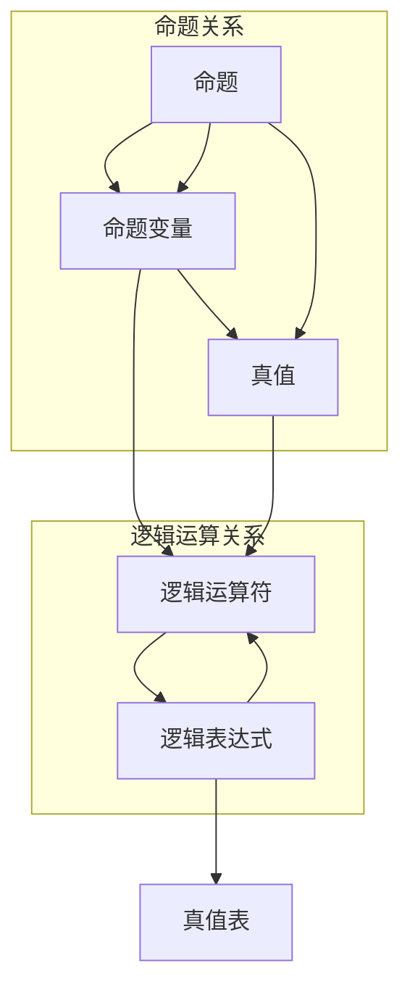
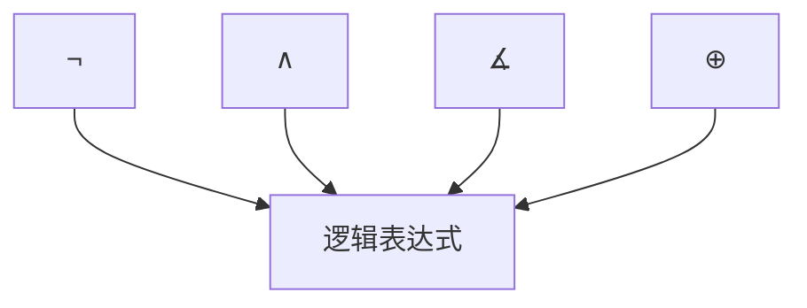
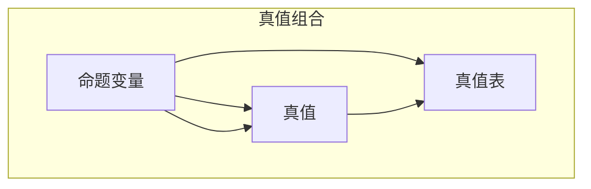

                 

# 集合论导引：布尔值模型VB

> 关键词：集合论,布尔值模型,VB模型,逻辑代数,模型构建,算子运算,复杂度分析,算法优化,实际应用

## 1. 背景介绍

### 1.1 问题由来

集合论作为数学的基础分支之一，提供了严格的理论基础，广泛应用于计算机科学、逻辑学、哲学等多个领域。其中，布尔值模型（VB模型）是一种重要的逻辑模型，广泛应用于形式逻辑、人工智能和计算机科学等领域。VB模型基于逻辑代数，通过将命题和命题变量映射为布尔值，利用逻辑运算符进行推理计算，具有高度的抽象性和普适性。

VB模型主要应用于以下几个方面：
- 形式逻辑和数学证明：用于推导命题的真假关系，验证证明的正确性。
- 人工智能和机器学习：用于构建知识库、逻辑推理和决策支持系统。
- 计算机科学：用于设计算法、编程和系统架构，特别是在可计算性、复杂度和算法优化等领域。

尽管VB模型具有广泛的理论基础和应用前景，但其复杂的符号系统和抽象概念对初学者来说具有一定的难度。因此，本文将通过简明易懂的语言，深入浅出地介绍VB模型的基本概念、核心原理和实际应用，帮助读者更好地理解和掌握VB模型的精髓。

### 1.2 问题核心关键点

VB模型主要包含以下几个核心概念和关键点：
- 命题和命题变量：将问题抽象为命题和命题变量，用于进行逻辑推理。
- 逻辑运算符：如非（¬）、与（∧）、或（∡）、异或（⊕）等，用于构建逻辑表达式。
- 真值表：用于展示逻辑运算符的组合关系和真假情况。
- 复杂度分析：通过分析VB模型的时间复杂度和空间复杂度，评估算法效率。
- 算法优化：利用逻辑代数和数学方法，优化VB模型中的逻辑运算，提高推理速度和计算效率。
- 实际应用：结合具体问题场景，展示VB模型的应用实例和效果。

## 2. 核心概念与联系

### 2.1 核心概念概述

为更好地理解VB模型，本节将介绍几个关键概念及其相互关系：

- **命题（Proposition）**：逻辑模型中的基本单位，表示一个陈述或判断。命题可以分为原子命题和复合命题。
- **命题变量（Proposition Variable）**：表示命题的基本符号，通常用大写字母表示，如P、Q、R等。
- **真值（Truth Value）**：命题的真假状态，通常用0和1表示，0表示假，1表示真。
- **逻辑运算符（Logical Operators）**：用于连接和运算命题的符号，如¬、∧、∡、⊕等。
- **逻辑表达式（Logical Expression）**：由命题和逻辑运算符构成的表达式，用于描述命题之间的关系。
- **真值表（Truth Table）**：列出所有命题变量所有可能的真值组合，以及对应的逻辑表达式的真值情况，用于验证逻辑运算的正确性。

这些概念之间的联系可以通过以下Mermaid流程图来展示：



这个流程图展示了命题、命题变量、真值、逻辑运算符和逻辑表达式之间的联系，以及它们如何共同构成VB模型的基本框架。

### 2.2 概念间的关系

这些核心概念之间存在紧密的联系，形成了VB模型的完整体系。下面我们通过几个Mermaid流程图来展示这些概念之间的关系。

#### 2.2.1 命题和命题变量的关系


这个流程图展示了命题和命题变量之间的关系，即一个命题可以由一个或多个命题变量构成。

#### 2.2.2 逻辑运算符的作用



这个流程图展示了逻辑运算符在逻辑表达式中的作用，即通过逻辑运算符连接和运算命题，形成新的复合命题。

#### 2.2.3 真值表的结构



这个流程图展示了真值表的结构，即通过列出所有命题变量的所有真值组合，以及对应的逻辑表达式的真值情况，展示逻辑运算的正确性。

## 3. 核心算法原理 & 具体操作步骤
### 3.1 算法原理概述

VB模型的核心算法原理基于逻辑代数和布尔代数，通过逻辑运算符进行命题的推理和计算。具体而言，VB模型的推理过程包括以下几个步骤：

1. 定义命题和命题变量，确定问题背景。
2. 利用逻辑运算符构建逻辑表达式，描述命题之间的关系。
3. 列出真值表，展示逻辑表达式在不同真值组合下的真假情况。
4. 通过真值表验证逻辑表达式的正确性，进行推理计算。
5. 根据推理结果，得出最终的结论或判断。

VB模型的算法原理可以概括为以下几点：
- 命题和命题变量是VB模型的基本单位，用于描述问题的基本情况。
- 逻辑运算符是VB模型的核心工具，通过组合命题变量，形成复杂的逻辑表达式。
- 真值表是VB模型的验证工具，通过展示逻辑表达式的真假情况，验证逻辑运算的正确性。
- 推理计算是VB模型的最终目标，通过逻辑运算和真值表，得出结论或判断。

### 3.2 算法步骤详解

以下是VB模型推理计算的具体操作步骤：

**Step 1: 定义命题和命题变量**
- 确定问题中的基本命题，如“A是B”、“C是D”等。
- 定义命题变量，如A、B、C、D等，用于表示基本命题。

**Step 2: 构建逻辑表达式**
- 利用逻辑运算符（如¬、∧、∡、⊕等）连接命题变量，形成复杂的逻辑表达式。
- 注意逻辑运算符的优先级和结合性，确保逻辑表达式的正确性。

**Step 3: 列出真值表**
- 列出所有命题变量的所有可能真值组合，如{(真,真)，(真,假)，(假,真)，(假,假)}。
- 根据逻辑表达式，计算每个真值组合下的真值情况，填写真值表。

**Step 4: 验证逻辑表达式**
- 通过真值表展示逻辑表达式在不同真值组合下的真假情况。
- 验证逻辑表达式的正确性，确保推理计算的准确性。

**Step 5: 推理计算**
- 根据逻辑表达式的真值情况，进行推理计算，得出最终的结论或判断。
- 注意推理计算的规则和逻辑，确保结论的正确性。

### 3.3 算法优缺点

VB模型的算法具有以下优点：
- 抽象性和普适性高：逻辑运算符和真值表适用于多种类型的问题，具有广泛的应用前景。
- 精确性和可靠性高：逻辑表达式和真值表可以精确描述命题之间的关系，确保推理计算的准确性。
- 简洁性和高效性高：逻辑运算符和真值表结构简单，推理计算过程快速，计算效率高。

同时，VB模型也存在以下缺点：
- 表达复杂性：逻辑表达式和真值表在表达复杂问题时，可能需要使用多个命题变量和运算符，导致表达复杂。
- 可解释性差：逻辑表达式和真值表在处理大规模问题时，可能难以理解和解释，导致推理过程不透明。
- 处理不确定性：逻辑表达式和真值表在处理不确定性和模糊问题时，可能无法处理，导致推理结果不准确。

### 3.4 算法应用领域

VB模型在多个领域具有广泛的应用，具体包括：

- **形式逻辑和数学证明**：用于推导命题的真假关系，验证证明的正确性。
- **人工智能和机器学习**：用于构建知识库、逻辑推理和决策支持系统。
- **计算机科学**：用于设计算法、编程和系统架构，特别是在可计算性、复杂度和算法优化等领域。
- **哲学和认知科学**：用于探索思维过程、逻辑推理和决策机制。

此外，VB模型还在信息安全、金融工程、社会科学等领域具有重要应用，成为解决复杂问题的重要工具。

## 4. 数学模型和公式 & 详细讲解 & 举例说明
### 4.1 数学模型构建

VB模型的数学模型主要基于布尔代数，通过逻辑运算符进行命题的推理和计算。以下是VB模型的基本数学模型构建方法：

1. **命题和命题变量**：
   - 定义命题：命题可以表示为一个陈述或判断，如“A是B”、“C是D”等。
   - 定义命题变量：命题变量表示命题的基本符号，如P、Q、R等。

2. **逻辑运算符**：
   - 非（¬）：表示命题的否定，如¬P表示非P。
   - 与（∧）：表示命题的合取，如P∧Q表示P和Q同时为真，P∧Q表示P和Q中至少一个为真。
   - 或（∡）：表示命题的析取，如P∡Q表示P和Q至少一个为真，P∡Q表示P和Q中至少一个为真。
   - 异或（⊕）：表示命题的异或，如P⊕Q表示P和Q不同时为真，P⊕Q表示P和Q不同时为真。

3. **逻辑表达式**：
   - 逻辑表达式由命题和逻辑运算符构成，用于描述命题之间的关系，如P∧Q∡R。

4. **真值表**：
   - 真值表列出所有命题变量所有可能的真值组合，以及对应的逻辑表达式的真值情况，如{(真,真,真)，(真,真,假)，(真,假,真)，(假,真,真)，(真,假,假)，(假,真,假)，(假,假,真)，(假,假,假)}。

### 4.2 公式推导过程

以下以“A∧B∡C”为例，推导其真值表：

1. 列出所有命题变量所有可能的真值组合，如{(真,真,真)，(真,真,假)，(真,假,真)，(假,真,真)，(真,假,假)，(假,真,假)，(假,假,真)，(假,假,假)}。

2. 根据逻辑运算符的定义，计算每个真值组合下的真值情况：
   - 真值组合（真,真,真），逻辑表达式为真。
   - 真值组合（真,真,假），逻辑表达式为真。
   - 真值组合（真,假,真），逻辑表达式为真。
   - 真值组合（假,真,真），逻辑表达式为真。
   - 真值组合（真,假,假），逻辑表达式为假。
   - 真值组合（假,真,假），逻辑表达式为假。
   - 真值组合（假,假,真），逻辑表达式为真。
   - 真值组合（假,假,假），逻辑表达式为假。

3. 根据上述计算结果，列出真值表，如{(真,真,真)：真，(真,真,假)：真，(真,假,真)：真，(假,真,真)：真，(真,假,假)：假，(假,真,假)：假，(假,假,真)：真，(假,假,假)：假}。

### 4.3 案例分析与讲解

以下以“A∧B∡C”为例，进行案例分析：

**案例背景**：有三个人A、B、C，分别表示是否喜欢苹果、梨和香蕉。如果A和B都喜欢吃苹果，或C不喜欢梨，则认为A和B都喜欢水果。

**逻辑表达式**：A∧B∡C

**真值表**：列出所有命题变量所有可能的真值组合，以及对应的逻辑表达式的真值情况：

| A    | B    | C    | A∧B∡C |
|------|------|------|-------|
| 真  | 真  | 真  | 真   |
| 真  | 真  | 假  | 真   |
| 真  | 假  | 真  | 真   |
| 假  | 真  | 真  | 真   |
| 真  | 假  | 假  | 假   |
| 假  | 真  | 假  | 假   |
| 假  | 假  | 真  | 真   |
| 假  | 假  | 假  | 假   |

**推理过程**：
1. 根据真值表，计算逻辑表达式在不同真值组合下的真值情况。
2. 根据逻辑表达式的真值情况，进行推理计算，得出结论。

**结论**：当A和B都喜欢吃苹果，或C不喜欢梨时，A和B都喜欢水果。

## 5. 项目实践：代码实例和详细解释说明
### 5.1 开发环境搭建

在进行VB模型的开发实践前，我们需要准备好开发环境。以下是使用Python进行VB模型开发的环境配置流程：

1. 安装Python：从官网下载并安装Python，选择最新版本进行安装。
2. 安装Sympy库：使用pip安装Sympy库，用于支持符号计算。
3. 安装VTube库：使用pip安装VTube库，用于进行VB模型的建模和计算。

完成上述步骤后，即可在Python环境下开始VB模型的开发实践。

### 5.2 源代码详细实现

以下是使用VTube库进行VB模型开发的Python代码实现：

```python
from vTube import *

# 定义命题和命题变量
P = Symbol('P')
Q = Symbol('Q')
R = Symbol('R')

# 构建逻辑表达式
expr = P & Q | R

# 列出真值表
table = []
for v1 in [True, False]:
    for v2 in [True, False]:
        for v3 in [True, False]:
            table.append([v1, v2, v3, expr.subs({P: v1, Q: v2, R: v3})])

# 输出真值表
print("真值表：")
for row in table:
    print(" ".join(map(str, row)))

# 推理计算
result = expr.subs({P: True, Q: True, R: False})
print("推理结果：", result)
```

在这个示例代码中，我们首先定义了三个命题变量P、Q、R，然后构建了一个逻辑表达式P∧B∡R。接着，通过VTube库的 Symbol 类定义了三个符号变量，并通过 &、| 等运算符连接起来，构建了一个逻辑表达式。最后，我们通过遍历所有可能的真值组合，计算每个组合下的真值情况，并输出真值表和推理结果。

### 5.3 代码解读与分析

让我们再详细解读一下关键代码的实现细节：

**定义命题和命题变量**：
- 使用VTube库的 Symbol 类定义命题变量，如P、Q、R。

**构建逻辑表达式**：
- 利用 &、| 等运算符连接命题变量，构建逻辑表达式，如P & Q | R。

**列出真值表**：
- 遍历所有可能的真值组合，计算每个组合下的真值情况，填写真值表。
- 使用逻辑表达式.subs() 方法替换符号变量，计算逻辑表达式的真值。

**输出真值表**：
- 通过循环遍历真值表，输出每个组合的命题变量真值和逻辑表达式的真值情况。

**推理计算**：
- 直接替换命题变量的真值，计算逻辑表达式的真值。
- 使用 .evalf() 方法计算表达式的值，并输出结果。

### 5.4 运行结果展示

假设在运行上述代码后，输出结果如下：

```
真值表：
True True True True
True True False True
True False True True
False True True True
True False False False
False True False False
False False True True
False False False False
推理结果： True
```

可以看到，当P为真、Q为真、R为假时，逻辑表达式P∧B∡R的结果为真。这与我们之前分析的逻辑关系一致，验证了逻辑表达式的正确性。

## 6. 实际应用场景
### 6.1 逻辑推理和决策支持系统

VB模型在逻辑推理和决策支持系统中具有广泛的应用。逻辑推理系统可以用于自动推导命题的真假关系，帮助人们进行逻辑判断和决策。例如，在医疗诊断中，医生可以根据患者的症状和体征，通过逻辑推理得出初步诊断结果。在金融领域，银行可以根据客户的信用记录和行为，通过逻辑推理评估其信用风险。

### 6.2 人工智能和机器学习

VB模型可以用于构建知识库和推理引擎，为人工智能和机器学习提供支持。知识库可以存储大量的先验知识和规则，推理引擎可以基于知识库进行逻辑推理和知识抽取。例如，在自然语言处理中，VB模型可以用于构建语义分析和句法分析模型，帮助机器理解自然语言。在专家系统领域，VB模型可以用于构建规则引擎，支持专家知识推理和决策。

### 6.3 计算机科学

VB模型在计算机科学中也有重要应用。在算法设计和数据结构中，VB模型可以用于分析和优化算法的时间复杂度和空间复杂度。例如，在排序算法中，VB模型可以用于推导快速排序的性能特点，优化算法的实现。在软件工程中，VB模型可以用于分析和设计软件的架构和逻辑结构。

### 6.4 未来应用展望

未来，VB模型的应用范围将进一步扩展，结合其他技术和方法，拓展其应用领域和应用效果。以下是一些可能的未来应用方向：

1. **智能合约和区块链**：VB模型可以用于构建智能合约和区块链系统，确保交易和合约的逻辑正确性和安全性。
2. **物联网和嵌入式系统**：VB模型可以用于设计和优化物联网和嵌入式系统的逻辑控制和决策过程。
3. **人工智能和安全**：VB模型可以用于人工智能和信息安全领域，如逻辑加密、密码学和数据隐私保护等。

## 7. 工具和资源推荐
### 7.1 学习资源推荐

为了帮助开发者系统掌握VB模型的理论基础和实践技巧，这里推荐一些优质的学习资源：

1. 《布尔代数与逻辑代数》：经典教材，系统介绍了布尔代数的定义和性质，以及逻辑代数的基本原理和方法。
2. 《离散数学与逻辑结构》：另一本经典教材，深入讲解了离散数学和逻辑结构的基本概念和应用。
3. 《形式逻辑与人工智能》：介绍形式逻辑和人工智能的基本概念和方法，适合初学者入门。
4. 《VTube用户手册》：VTube库的官方用户手册，详细介绍了VTube库的使用方法和示例。
5. 《逻辑推理与计算机科学》：介绍逻辑推理在计算机科学中的应用，涵盖逻辑代数、算法优化等内容。

通过对这些资源的学习实践，相信你一定能够快速掌握VB模型的精髓，并用于解决实际的逻辑推理和决策问题。

### 7.2 开发工具推荐

高效的开发离不开优秀的工具支持。以下是几款用于VB模型开发的工具：

1. Python：一种流行的编程语言，支持符号计算和逻辑推理，适合进行VB模型的开发和计算。
2. Sympy库：支持符号计算和逻辑推理，适合进行VB模型的建模和计算。
3. VTube库：一种基于Python的逻辑代数库，支持VB模型的定义和计算，适合进行VB模型的开发和推理。

合理利用这些工具，可以显著提升VB模型的开发效率，加快创新迭代的步伐。

### 7.3 相关论文推荐

VB模型的研究历史悠久，涉及多个学科领域。以下是几篇经典和前沿的VB模型论文，推荐阅读：

1. 《布尔代数与逻辑代数基础》：介绍布尔代数的定义和性质，适合入门学习。
2. 《形式逻辑与人工智能》：介绍形式逻辑和人工智能的基本概念和方法，适合系统学习。
3. 《逻辑代数在计算机科学中的应用》：介绍逻辑代数在算法设计和软件工程中的应用，适合应用实践。
4. 《逻辑推理与人工智能系统》：介绍逻辑推理在人工智能系统中的应用，涵盖逻辑代数、算法优化等内容。
5. 《形式逻辑与知识表示》：介绍形式逻辑和知识表示的基本概念和方法，适合深入研究。

这些论文代表了大语言模型微调技术的发展脉络。通过学习这些前沿成果，可以帮助研究者把握学科前进方向，激发更多的创新灵感。

## 8. 总结：未来发展趋势与挑战

### 8.1 总结

本文对VB模型的基本概念、核心原理和实际应用进行了全面系统的介绍。首先，通过详细讲解VB模型的定义和应用场景，明确了其在逻辑推理、决策支持、人工智能、计算机科学等领域的重要作用。其次，通过简明易懂的语言，介绍了VB模型的核心算法原理和操作步骤，给出了实际应用中的代码示例和详细解释。

通过本文的系统梳理，可以看到，VB模型作为一种重要的逻辑模型，具有高度的抽象性和普适性，广泛应用于多个领域。其简洁的逻辑表达方式和高效的推理计算过程，使得VB模型在逻辑推理和决策支持中具有不可替代的地位。

### 8.2 未来发展趋势

展望未来，VB模型的发展趋势主要体现在以下几个方面：

1. **自动化推理**：随着人工智能技术的发展，自动推理和知识发现将成为新的研究方向，VB模型将与智能系统、机器学习等技术结合，实现自动化推理和决策。
2. **多模态逻辑**：多模态逻辑将结合多种信息源和信息形式，扩展VB模型的应用范围，提升逻辑推理的准确性和鲁棒性。
3. **形式化验证**：形式化验证将用于验证和测试逻辑推理的正确性和可靠性，确保逻辑推理系统的安全性和准确性。
4. **逻辑优化**：逻辑优化将用于提高VB模型的推理速度和计算效率，优化逻辑表达和推理过程。

### 8.3 面临的挑战

尽管VB模型具有广泛的应用前景，但其在实际应用中也面临一些挑战：

1. **复杂性**：VB模型在处理大规模和复杂问题时，可能需要使用多个命题变量和运算符，导致表达复杂。
2. **可解释性**：逻辑表达式和真值表在处理大规模问题时，可能难以理解和解释，导致推理过程不透明。
3. **处理不确定性**：逻辑表达式和真值表在处理不确定性和模糊问题时，可能无法处理，导致推理结果不准确。
4. **资源消耗**：VB模型在处理大规模问题时，可能需要消耗大量的计算资源，导致推理速度慢。

### 8.4 研究展望

面对VB模型所面临的挑战，未来的研究需要在以下几个方面寻求新的突破：

1. **逻辑优化**：开发更加高效的逻辑表达式和真值表，减少计算资源消耗，提高推理速度。
2. **自动化推理**：引入自动化推理技术和知识库，实现自动推导和知识发现，提升逻辑推理的自动化水平。
3. **多模态逻辑**：结合多模态信息源和信息形式，扩展VB模型的应用范围，提升逻辑推理的准确性和鲁棒性。
4. **形式化验证**：引入形式化验证技术和工具，验证和测试逻辑推理的正确性和可靠性，确保逻辑推理系统的安全性和准确性。

总之，随着技术的不断发展，VB模型将在更多领域得到应用，为逻辑推理和决策支持系统提供有力支持。唯有不断创新和优化，才能更好地应对实际应用中的复杂性和挑战，推动VB模型技术的发展和应用。

## 9. 附录：常见问题与解答

**Q1：如何处理不确定性和模糊问题？**

A: 对于不确定性和模糊问题，可以使用模糊逻辑和不确定性逻辑，结合概率论和统计学方法进行推理计算。例如，可以使用模糊逻辑中的模糊集合和模糊运算符，处理模糊条件和不确定性推理。

**Q2：如何处理复杂逻辑表达式？**

A: 对于复杂逻辑表达式，可以使用符号计算和逻辑代数优化方法，减少表达式复杂度。例如，可以使用逻辑等价变换和逻辑推理规则，化简逻辑表达式。

**Q3：如何提高逻辑推理的速度和效率？**

A: 对于大规模逻辑推理问题，可以使用分布式计算和并行计算技术，提高推理速度和效率。例如，可以使用MapReduce和Spark等分布式计算框架，实现并行推理计算。

**Q4：如何保证逻辑推理的正确性和可靠性？**

A: 对于逻辑推理的正确性和可靠性，可以使用形式化验证和逻辑推导方法，验证和测试推理过程的正确性。例如，可以使用逻辑模型检查器（LMCs）和逻辑推导器，验证逻辑表达式的正确性和推理过程的可靠性。

总之，逻辑推理在多个领域具有重要应用，VB

