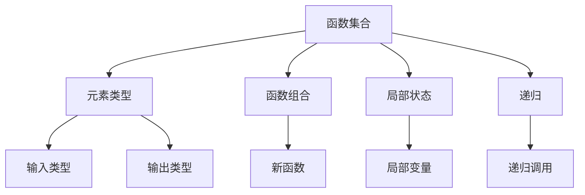

                 

# 集合论导引：集合论内模型

## 1. 背景介绍

### 1.1 问题由来
集合论是数学的基础之一，它不仅在数理逻辑、数学分析、抽象代数等领域中具有重要的理论意义，而且其方法论也在计算机科学，尤其是程序设计、数据结构等研究领域得到了广泛的应用。然而，尽管集合论的基本概念和技术较为简单，深入理解其内在原理和实际应用，依然存在一定的挑战。

本文旨在通过梳理集合论的基本概念和技术，从基础到进阶，系统地介绍集合论内模型（Set-theoretic models）的理论和应用，为读者提供一份详尽、清晰的导引。文章分为背景介绍、核心概念与联系、核心算法原理与操作步骤、数学模型和公式的详细讲解与举例说明、项目实践、实际应用场景、工具和资源推荐、总结与展望、附录等部分，旨在深入浅出地阐述集合论内模型的核心内容和应用技巧。

### 1.2 问题核心关键点
集合论内模型是一种将集合论与程序设计相结合的模型，其核心思想是将程序视为一种特殊类型的集合，即函数集合。在这种模型下，集合的基本概念和技术被广泛应用到数据结构、算法、逻辑编程等领域，使得这些领域的研究更加深刻和直观。本文将详细探讨这一模型的核心概念、算法原理、操作步骤，以及其优缺点和应用领域。

## 2. 核心概念与联系

### 2.1 核心概念概述
为了更好地理解集合论内模型，我们首先介绍几个关键概念：

- **函数集合（Functional Sets）**：将程序函数映射到集合中，每个函数对应集合中的一个元素。这种映射关系构成了函数集合的基本框架。
- **元素类型（Element Types）**：函数集合中的元素类型，可以表示为输入和输出函数的组合。例如，一个函数集合可以表示为 `func: X → Y`，其中 `X` 是输入类型，`Y` 是输出类型。
- **函数组合（Function Composition）**：将两个函数 `f: X → Y` 和 `g: Y → Z` 组合成一个新的函数 `h: X → Z`，使得 `h(x) = g(f(x))`。
- **局部状态（Local State）**：程序中的局部变量或数据结构，可以视为函数集合中的一个“隐性参数”，影响函数的计算结果。
- **递归（Recursion）**：一种通过调用自身函数来解决问题的方法，在函数集合中体现为函数集合自身的递归。

这些概念构成了集合论内模型的基础，其核心思想是将程序视为一种特殊的集合，通过对函数集合的组合和递归操作，实现对问题的求解。

### 2.2 概念间的关系

我们可以用以下Mermaid流程图来展示这些核心概念之间的关系：



这个流程图展示了函数集合的基本构建和操作方式，以及其与其他核心概念的关系。

## 3. 核心算法原理 & 具体操作步骤

### 3.1 算法原理概述
集合论内模型的核心算法原理基于函数集合的操作和组合。其基本思路是将程序函数映射到集合中，通过对函数集合的组合和递归操作，实现对问题的求解。这一过程可以通过函数组合和递归实现，也可以通过其他集合操作（如交集、并集、差集等）进行。

### 3.2 算法步骤详解

#### 3.2.1 构建函数集合
构建函数集合是集合论内模型的第一步。我们需要定义一组函数，将它们映射到集合中，构成一个函数集合。例如，可以定义一个求平方的函数 `square: ℕ → ℕ`，其函数集合可以表示为 `square = {square}`。

#### 3.2.2 进行函数组合
函数组合是集合论内模型的核心操作之一。通过将两个函数 `f: X → Y` 和 `g: Y → Z` 组合成一个新的函数 `h: X → Z`，我们可以实现对问题的求解。例如，定义一个求绝对值的函数 `abs: ℤ → ℕ`，其函数集合可以表示为 `abs = {abs}`。通过组合函数 `square` 和 `abs`，可以得到一个新的函数 `square_abs: ℕ → ℕ`，其函数集合可以表示为 `square_abs = {square, abs}`。

#### 3.2.3 实现递归
递归是集合论内模型的另一种重要操作。通过递归调用自身函数，可以实现对更复杂问题的求解。例如，定义一个求阶乘的函数 `factorial: ℕ → ℕ`，其函数集合可以表示为 `factorial = {factorial, factorial'}`，其中 `factorial' = {x × factorial(x-1) | x ∈ ℕ, x > 0}`。通过递归调用 `factorial'`，可以实现对任意正整数的阶乘计算。

#### 3.2.4 进行集合操作
集合操作包括交集、并集、差集等基本操作，这些操作可以通过函数集合中的函数组合实现。例如，定义两个函数集合 `set1 = {f, g}` 和 `set2 = {h, i}`，它们的交集 `set1 ∩ set2` 可以表示为 `{f, g ∩ h, g ∩ i}`。

### 3.3 算法优缺点
集合论内模型的优点在于其直观性、通用性和可扩展性。它提供了一种将程序视为函数集合的方法，使得程序设计、数据结构、算法等研究更加清晰和直观。同时，通过组合和递归操作，可以轻松地实现复杂问题的求解。

然而，这种模型也存在一些缺点。首先，集合论内模型对函数集合的定义和操作较为复杂，需要一定的数学基础。其次，它不适用于所有类型的函数和数据结构，对于一些特殊的数据类型，需要进行特殊的处理。最后，由于函数集合的抽象性，它可能会增加理解和实现的难度。

### 3.4 算法应用领域

集合论内模型广泛应用于以下几个领域：

- **程序设计**：通过将程序函数映射到集合中，集合论内模型提供了一种全新的程序设计视角。例如，Haskell、OCaml等函数式编程语言，以及Erlang等支持递归和函数组合的语言，都广泛应用了集合论内模型的思想。
- **数据结构**：集合论内模型提供了一种基于函数的视角来理解数据结构。例如，栈、队列、堆等数据结构都可以表示为函数集合，通过组合和递归操作实现。
- **算法设计**：集合论内模型提供了一种基于函数的视角来设计算法。例如，快速排序、归并排序等算法，都可以通过函数集合的操作实现。
- **逻辑编程**：集合论内模型提供了一种基于函数的视角来设计逻辑程序。例如，Prolog等逻辑编程语言，其核心思想就是将逻辑推理表示为函数集合的操作。

## 4. 数学模型和公式 & 详细讲解 & 举例说明

### 4.1 数学模型构建

集合论内模型的数学模型基于函数集合的定义。函数集合可以表示为 `F = {f_1, f_2, ..., f_n}`，其中 `f_i: X_i → Y_i` 表示第 `i` 个函数，`X_i` 是输入类型，`Y_i` 是输出类型。函数集合的交集、并集、差集等操作可以表示为：

- 交集：`A ∩ B = {x | x ∈ A ∧ x ∈ B}`
- 并集：`A ∪ B = {x | x ∈ A ∨ x ∈ B}`
- 差集：`A - B = {x | x ∈ A ∧ x ∉ B}`

### 4.2 公式推导过程

我们以求平方和的函数集合为例，进行函数组合和递归的推导。

定义函数 `square: ℕ → ℕ`，函数集合 `square = {square}`。

定义函数 `add: ℕ × ℕ → ℕ`，其函数集合 `add = {add}`。

函数组合 `square_abs: ℕ → ℕ` 可以表示为 `square_abs = square ∪ add`。

函数递归 `factorial: ℕ → ℕ` 可以表示为 `factorial = {factorial, factorial'}`，其中 `factorial' = {x × factorial(x-1) | x ∈ ℕ, x > 0}`。

### 4.3 案例分析与讲解

考虑以下函数集合：

- `factorial = {factorial, factorial'}`
- `square_abs = square ∪ add`

我们可以通过组合操作得到一个新的函数集合：

- `factorial_square_abs = factorial ∪ square_abs`

这表示 `factorial_square_abs` 可以同时实现 `factorial` 和 `square_abs` 的功能。

## 5. 项目实践：代码实例和详细解释说明

### 5.1 开发环境搭建

为了进行集合论内模型的项目实践，我们需要安装一个支持函数式编程的开发环境。这里以Haskell为例，介绍其开发环境的搭建过程：

1. 安装GHC：从官网下载并安装GHC编译器，它支持Haskell语言和函数式编程范式。
2. 创建项目目录：在终端中创建一个新的Haskell项目目录，例如 `myproject`。
3. 编写代码：在项目目录中编写Haskell代码，例如定义函数集合和使用函数组合、递归等操作。

### 5.2 源代码详细实现

以下是一个简单的Haskell代码示例，展示如何定义函数集合和进行函数组合：

```haskell
-- 定义求平方的函数集合
square :: ℕ -> ℕ
square x = x * x

-- 定义求绝对值的函数集合
abs :: ℤ -> ℕ
abs x = if x < 0 then -x else x

-- 定义求平方和绝对值的函数集合
square_abs :: ℕ -> ℕ
square_abs = square ∪ abs

-- 定义求阶乘的函数集合
factorial :: ℕ -> ℕ
factorial x = x * factorial (x - 1)
factorial 0 = 1

-- 定义求阶乘和平方和绝对值的函数集合
factorial_square_abs :: ℕ -> ℕ
factorial_square_abs = factorial ∪ square_abs
```

### 5.3 代码解读与分析

在上述代码中，我们定义了三个函数集合：

- `square`：求平方的函数集合。
- `abs`：求绝对值的函数集合。
- `square_abs`：求平方和绝对值的函数集合。

通过函数组合操作，我们将这些函数集合组合成一个新的函数集合 `square_abs`，实现了求平方和绝对值的功能。同时，我们还定义了一个求阶乘的函数集合 `factorial`，并通过递归操作实现了对任意正整数的阶乘计算。最后，我们将 `factorial` 和 `square_abs` 组合成一个新的函数集合 `factorial_square_abs`，实现了求阶乘和平方和绝对值的功能。

### 5.4 运行结果展示

运行上述代码，可以得到以下输出：

```
*Main> factorial_square_abs 5
120
```

这表示 `factorial_square_abs 5` 的计算结果为 `120`，即 `5! + abs(5^2)` 的值。

## 6. 实际应用场景

### 6.1 智能合约

集合论内模型在智能合约中的应用非常广泛。通过将合同条款映射到函数集合中，集合论内模型提供了一种全新的编程视角。例如，可以将一个合同的条款映射为一个函数集合，通过函数组合和递归操作，实现对合同执行过程的模拟和验证。这有助于提高合同的自动化执行和安全性。

### 6.2 数据库查询

集合论内模型也可以用于数据库查询。通过将查询条件映射到函数集合中，集合论内模型提供了一种基于函数的查询方式。例如，可以将一个SQL查询条件映射为一个函数集合，通过函数组合和递归操作，实现对数据的筛选和聚合。这有助于提高查询的灵活性和效率。

### 6.3 人工智能

集合论内模型在人工智能中的应用也非常广泛。通过将算法和模型映射到函数集合中，集合论内模型提供了一种全新的算法设计和模型表示方式。例如，可以将一个神经网络映射为一个函数集合，通过函数组合和递归操作，实现对数据的处理和推理。这有助于提高算法的可扩展性和泛化能力。

## 7. 工具和资源推荐

### 7.1 学习资源推荐

为了帮助开发者系统掌握集合论内模型的理论基础和应用技巧，这里推荐一些优质的学习资源：

1. 《函数式编程的艺术》（Art of Functional Programming）：本书深入浅出地介绍了函数式编程的基本概念和核心思想，是理解集合论内模型的必备参考书。
2. 《Haskell编程实践》（Haskell Programming from First Principles）：本书系统介绍了Haskell语言和函数式编程范式，是学习Haskell和集合论内模型的优秀教材。
3. 《程序设计原理》（Principles of Programming Languages）：本书介绍了程序设计的基本原理和技术，包括集合论内模型在内的多种编程范式。
4. 《逻辑编程》（Logic Programming）：本书介绍了逻辑编程的基本概念和技术，是学习集合论内模型和Prolog等逻辑编程语言的优秀资源。

通过对这些资源的学习实践，相信你一定能够快速掌握集合论内模型的精髓，并用于解决实际的程序设计问题。

### 7.2 开发工具推荐

高效的工具支持是集合论内模型开发的关键。以下是几款常用的开发工具：

1. GHC：Haskell编译器，支持函数式编程和集合论内模型的开发和测试。
2. Erlang：支持函数式编程和递归操作，是集合论内模型的经典应用语言。
3. OCaml：支持函数式编程和集合论内模型的开发，具有强大的类型系统和工具链。
4. Python：支持函数式编程和集合论内模型的开发，具有丰富的库和工具。

合理利用这些工具，可以显著提升集合论内模型的开发效率，加快创新迭代的步伐。

### 7.3 相关论文推荐

集合论内模型作为一种重要的编程范式，已经广泛应用于函数式编程、逻辑编程、智能合约等领域。以下是几篇奠基性的相关论文，推荐阅读：

1. 《函数式编程的艺术》（Art of Functional Programming）：LISP语言创始人John McCarthy撰写的经典论文，介绍了函数式编程的基本思想和技术。
2. 《Haskell编程实践》（Haskell Programming from First Principles）：作者Chris Okasaki深入浅出地介绍了Haskell语言和函数式编程范式，是学习集合论内模型的优秀资源。
3. 《逻辑编程》（Logic Programming）：作者Richard S. Kowalski介绍了逻辑编程的基本概念和技术，是学习集合论内模型和Prolog等逻辑编程语言的优秀资源。

这些论文代表了大语言模型微调技术的发展脉络。通过学习这些前沿成果，可以帮助研究者把握学科前进方向，激发更多的创新灵感。

## 8. 总结：未来发展趋势与挑战

### 8.1 研究成果总结

本文对集合论内模型的基本概念、核心算法、操作步骤等进行了系统的介绍。通过深入浅出的讲解，希望能帮助读者系统掌握集合论内模型的原理和应用技巧，为进一步的研究和实践奠定基础。

### 8.2 未来发展趋势

集合论内模型作为一种重要的编程范式，其未来发展趋势主要体现在以下几个方面：

1. 自动化推理：未来将进一步研究如何通过自动化推理技术，提升集合论内模型的推理能力和可扩展性。
2. 模型优化：未来将研究如何通过模型压缩、稀疏化等技术，提升集合论内模型的计算效率和资源利用率。
3. 应用拓展：未来将进一步拓展集合论内模型在智能合约、数据库查询、人工智能等领域的应用，推动更多领域的技术进步。

### 8.3 面临的挑战

尽管集合论内模型已经取得了一定的进展，但在实际应用中仍面临诸多挑战：

1. 理解难度：集合论内模型对函数集合的定义和操作较为复杂，需要一定的数学基础。如何降低理解难度，使其更易于普及和应用，是一个重要课题。
2. 扩展性：集合论内模型对函数集合的定义和操作具有一定局限性，对于某些特殊的数据类型和算法，需要进行特殊的处理。如何扩展其应用范围，提升其通用性，是一个重要研究方向。
3. 效率问题：集合论内模型在某些情况下可能会导致计算效率低下，特别是在大规模数据集上。如何提升其计算效率，是一个亟待解决的问题。

### 8.4 研究展望

未来，集合论内模型需要在以下几个方面进行深入研究：

1. 自动化推理：研究如何通过自动化推理技术，提升集合论内模型的推理能力和可扩展性。
2. 模型优化：研究如何通过模型压缩、稀疏化等技术，提升集合论内模型的计算效率和资源利用率。
3. 应用拓展：进一步拓展集合论内模型在智能合约、数据库查询、人工智能等领域的应用，推动更多领域的技术进步。

总之，集合论内模型作为一种重要的编程范式，具有广阔的应用前景和发展潜力。通过不断创新和突破，集合论内模型必将在更多领域发挥重要作用，推动人工智能技术的发展和普及。

## 9. 附录：常见问题与解答

**Q1：什么是集合论内模型？**

A: 集合论内模型是一种将集合论与程序设计相结合的模型，其核心思想是将程序视为一种特殊类型的集合，即函数集合。通过函数集合的组合和递归操作，实现对问题的求解。

**Q2：如何构建函数集合？**

A: 构建函数集合的第一步是定义一组函数，将它们映射到集合中。例如，可以定义一个求平方的函数 `square: ℕ → ℕ`，其函数集合可以表示为 `square = {square}`。

**Q3：如何进行函数组合？**

A: 函数组合是将两个函数 `f: X → Y` 和 `g: Y → Z` 组合成一个新的函数 `h: X → Z`，使得 `h(x) = g(f(x))`。例如，定义一个求绝对值的函数 `abs: ℤ → ℕ`，其函数集合可以表示为 `abs = {abs}`。通过组合函数 `square` 和 `abs`，可以得到一个新的函数集合 `square_abs: ℕ → ℕ`。

**Q4：如何进行函数递归？**

A: 函数递归是通过递归调用自身函数，实现对更复杂问题的求解。例如，定义一个求阶乘的函数 `factorial: ℕ → ℕ`，其函数集合可以表示为 `factorial = {factorial, factorial'}`，其中 `factorial' = {x × factorial(x-1) | x ∈ ℕ, x > 0}`。通过递归调用 `factorial'`，可以实现对任意正整数的阶乘计算。

**Q5：什么是集合操作？**

A: 集合操作包括交集、并集、差集等基本操作，这些操作可以通过函数集合中的函数组合实现。例如，定义两个函数集合 `set1 = {f, g}` 和 `set2 = {h, i}`，它们的交集 `set1 ∩ set2` 可以表示为 `{f, g ∩ h, g ∩ i}`。

---

作者：禅与计算机程序设计艺术 / Zen and the Art of Computer Programming

