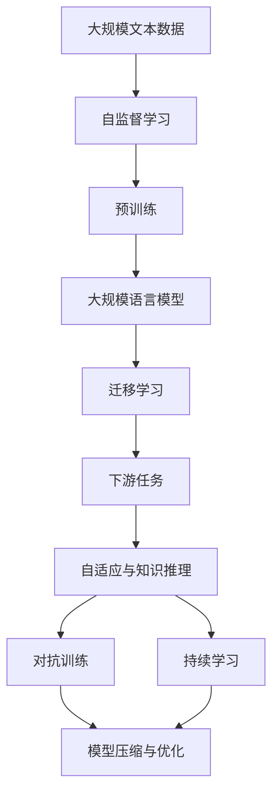
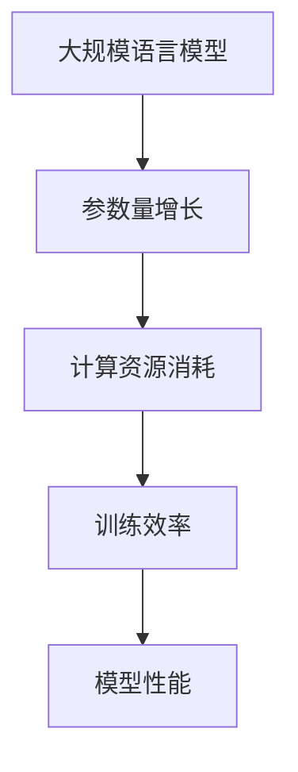
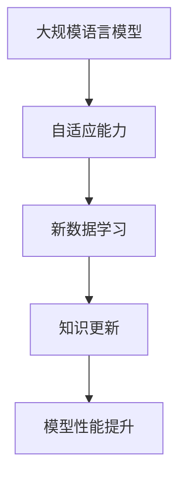

                 

# AGI时代的临近：LLM技术发展趋势

## 1. 背景介绍

### 1.1 问题由来

近年来，随着人工智能(AI)技术的快速发展，尤其是大规模语言模型(LLM)的兴起，人们对于通用人工智能(AGI)的期望日益高涨。AGI，即机器能在各种复杂环境和任务中表现出类人的智能和创造力，是人类追求智能机器的终极目标。

在LLM技术的推动下，从简单的图像识别、文本分类到复杂的问答、对话、翻译等任务，AI已经展现出了超越以往的强大能力。然而，与AGI的目标相比，LLM仍存在一定差距。现有的大模型通常依赖于大量数据和计算资源的预训练，以及下游任务的微调，虽然在某些特定领域能取得令人瞩目的成果，但在泛化能力、自适应能力和知识推理能力等方面仍然有限。

### 1.2 问题核心关键点

大语言模型(LLM)与AGI之间的主要差距在于泛化能力、自适应能力和知识推理能力的不足。LLM依赖于大规模语料库的预训练，而AGI则需要具备更广泛的知识背景、更灵活的推理能力和更强的学习与适应能力。因此，当前对AGI的研究，很大程度上依赖于LLM技术的进步和突破。

当前大语言模型发展趋势主要包括以下几个方面：

1. **模型规模与参数量**：大语言模型通常以巨大的参数量和丰富的语料库为支撑，随着模型的不断演进，参数量持续增长。
2. **训练效率与计算资源**：高效的训练算法和计算资源是保证模型性能的前提，未来的研究将进一步提升训练效率和计算能力。
3. **泛化能力与跨领域迁移**：模型需要具备更强的泛化能力，能够在大规模跨领域数据上实现高效的迁移学习。
4. **自适应与动态知识更新**：模型需要具备自我调整和学习的能力，能够不断从新数据中学习，适应新的环境和任务。
5. **知识整合与推理能力**：模型需要具备更强的知识整合和推理能力，能够将外部知识与自身推理相结合，进行复杂逻辑的推导。

## 2. 核心概念与联系

### 2.1 核心概念概述

要深入理解LLM技术及其发展趋势，需要掌握以下几个核心概念：

- **大规模语言模型(LLM)**：指一类基于深度学习的大模型，通过在大规模无标签文本语料上进行预训练，学习通用的语言知识和常识，具备强大的语言理解和生成能力。
- **自监督学习(Self-Supervised Learning)**：指在大规模无标签数据上进行训练，模型通过预训练学习到语言的内部结构和特征，为后续的监督学习任务奠定基础。
- **迁移学习(Transfer Learning)**：指将一个领域学到的知识迁移到另一个领域，利用已有的模型参数和知识，在新的任务上快速提升性能。
- **对抗训练(Adversarial Training)**：指在模型训练过程中引入对抗样本，提高模型的鲁棒性和泛化能力。
- **持续学习(Continual Learning)**：指模型能够持续从新数据中学习，同时保持已学习的知识，避免灾难性遗忘。
- **知识蒸馏(Knowledge Distillation)**：指通过从知识丰富的模型(老师模型)向知识较少的模型(学生模型)传输知识，提高学生模型的性能。
- **模型压缩与优化**：指通过剪枝、量化等方法，减少模型的大小和计算资源消耗，提升模型的推理效率。

### 2.2 概念间的关系

这些核心概念之间存在着紧密的联系，共同构成了LLM技术的完整生态系统。

#### 2.2.1 大语言模型的学习范式



这个流程图展示了LLM技术的学习范式：

1. 从大规模文本数据中通过自监督学习进行预训练，学习通用的语言表示。
2. 在预训练的基础上，通过迁移学习，将知识迁移到下游任务上。
3. 在下游任务上，模型需要进行自适应和知识推理，以适应新任务的要求。
4. 通过对抗训练和持续学习，模型不断优化和更新。
5. 模型压缩与优化，提升模型的推理效率和资源利用率。

#### 2.2.2 模型规模与参数量



这个流程图展示了模型规模与参数量之间的关系：

1. 随着模型参数量的增长，计算资源消耗增加。
2. 在参数量增加的同时，模型训练效率降低。
3. 高效的训练算法和优化方法能够缓解计算资源消耗，提升训练效率和模型性能。

#### 2.2.3 自适应与动态知识更新



这个流程图展示了模型自适应与动态知识更新的关系：

1. 模型需要具备自适应能力，能够从新数据中学习。
2. 动态知识更新，使模型不断保持最新的知识。
3. 通过自适应和动态知识更新，模型性能不断提升。

## 3. 核心算法原理 & 具体操作步骤
### 3.1 算法原理概述

基于大规模语言模型的AGI发展趋势，主要包括以下几个方面：

1. **模型规模与参数量**：随着算力成本的下降和数据规模的扩张，预训练语言模型的参数量还将持续增长。超大规模语言模型蕴含的丰富语言知识，有望支撑更加复杂多变的下游任务微调。
2. **自适应与动态知识更新**：模型需要具备更强的自适应能力，能够持续从新数据中学习，同时保持已学习的知识，避免灾难性遗忘。
3. **跨领域迁移与泛化能力**：模型需要具备更强的泛化能力，能够在大规模跨领域数据上实现高效的迁移学习。
4. **知识整合与推理能力**：模型需要具备更强的知识整合和推理能力，能够将外部知识与自身推理相结合，进行复杂逻辑的推导。

### 3.2 算法步骤详解

**步骤1：模型预训练**

在大规模无标签文本语料上进行自监督学习，学习通用的语言知识和常识。常用的预训练任务包括掩码语言模型、下一个句子预测等。

**步骤2：下游任务微调**

将预训练模型作为初始化参数，通过下游任务的少量标注数据，有监督地训练模型，使其适应特定任务。通过微调，模型可以在新任务上快速提升性能。

**步骤3：模型自适应与动态知识更新**

在不断变化的数据分布下，模型需要具备自适应能力，能够持续从新数据中学习，更新自身的知识库。这通常涉及到模型结构的调整、知识蒸馏、对抗训练等技术手段。

**步骤4：跨领域迁移学习**

模型需要具备跨领域迁移能力，能够在新领域数据上高效地进行微调，避免数据过拟合，提高泛化性能。

**步骤5：知识整合与推理**

将外部知识与模型自身的推理能力相结合，提升模型的知识整合和推理能力。这通常涉及到规则注入、知识图谱集成、逻辑推理等技术手段。

### 3.3 算法优缺点

**优点**：

1. **高效性**：大规模语言模型具有高效的数据处理和推理能力，能够在短时间内完成大量任务。
2. **灵活性**：模型能够快速适应新任务，具备较强的泛化能力。
3. **可扩展性**：模型可以通过微调、知识蒸馏等手段进行动态更新和扩展，适应复杂多变的数据分布。

**缺点**：

1. **资源消耗大**：大规模语言模型需要大量的计算资源和存储空间，对于普通硬件设备可能存在资源限制。
2. **鲁棒性不足**：模型在对抗样本和噪声数据上的鲁棒性仍需进一步提升。
3. **可解释性差**：模型的决策过程缺乏可解释性，难以理解和调试。
4. **知识整合能力有限**：模型的知识整合能力仍需进一步提升，以应对更复杂的推理任务。

### 3.4 算法应用领域

大语言模型在多个领域已经得到了广泛应用，以下是几个典型的应用场景：

1. **自然语言处理(NLP)**：用于文本分类、情感分析、机器翻译、对话系统等任务。通过微调，模型能够适应各种自然语言处理任务，提升性能。
2. **图像识别**：用于图像分类、目标检测、图像生成等任务。通过迁移学习，模型能够在图像领域高效地完成各种任务。
3. **语音识别**：用于语音识别、语音合成等任务。通过迁移学习，模型能够快速适应新语音数据，提升语音识别和合成性能。
4. **医疗健康**：用于病历分析、药物研发、健康咨询等任务。通过微调和知识蒸馏，模型能够高效地处理医疗领域的数据，提供智能化的医疗服务。
5. **金融领域**：用于金融舆情监测、智能投顾、风险控制等任务。通过微调和对抗训练，模型能够在金融领域高效地完成各种任务。
6. **自动驾驶**：用于自动驾驶场景中的语言理解和指令生成。通过微调和知识蒸馏，模型能够快速适应各种驾驶场景，提升驾驶安全性。

## 4. 数学模型和公式 & 详细讲解  
### 4.1 数学模型构建

假设预训练语言模型为 $M_{\theta}$，其中 $\theta$ 为预训练得到的模型参数。给定下游任务 $T$ 的标注数据集 $D=\{(x_i,y_i)\}_{i=1}^N$，微调的目标是找到新的模型参数 $\hat{\theta}$，使得：

$$
\hat{\theta}=\mathop{\arg\min}_{\theta} \mathcal{L}(M_{\theta},D)
$$

其中 $\mathcal{L}$ 为针对任务 $T$ 设计的损失函数，用于衡量模型预测输出与真实标签之间的差异。常见的损失函数包括交叉熵损失、均方误差损失等。

### 4.2 公式推导过程

以下我们以二分类任务为例，推导交叉熵损失函数及其梯度的计算公式。

假设模型 $M_{\theta}$ 在输入 $x$ 上的输出为 $\hat{y}=M_{\theta}(x) \in [0,1]$，表示样本属于正类的概率。真实标签 $y \in \{0,1\}$。则二分类交叉熵损失函数定义为：

$$
\ell(M_{\theta}(x),y) = -[y\log \hat{y} + (1-y)\log (1-\hat{y})]
$$

将其代入经验风险公式，得：

$$
\mathcal{L}(\theta) = -\frac{1}{N}\sum_{i=1}^N [y_i\log M_{\theta}(x_i)+(1-y_i)\log(1-M_{\theta}(x_i))]
$$

根据链式法则，损失函数对参数 $\theta_k$ 的梯度为：

$$
\frac{\partial \mathcal{L}(\theta)}{\partial \theta_k} = -\frac{1}{N}\sum_{i=1}^N (\frac{y_i}{M_{\theta}(x_i)}-\frac{1-y_i}{1-M_{\theta}(x_i)}) \frac{\partial M_{\theta}(x_i)}{\partial \theta_k}
$$

其中 $\frac{\partial M_{\theta}(x_i)}{\partial \theta_k}$ 可进一步递归展开，利用自动微分技术完成计算。

### 4.3 案例分析与讲解

**案例1：图像分类**

图像分类任务中，模型的输入为图像，输出为类别标签。预训练模型通常采用自监督学习方法，如ImageNet大规模图像语料库上的自监督学习。在微调过程中，将预训练模型作为初始化参数，通过下游任务的大量标注数据，有监督地训练模型，使其适应特定分类任务。例如，在大规模图像数据集上预训练的模型，可以通过微调应用于医学影像分类、卫星图像分类等任务。

**案例2：文本生成**

文本生成任务中，模型的输入为文本，输出为生成文本。预训练模型通常采用语言模型作为初始化参数，通过下游任务的大量标注数据，有监督地训练模型，使其适应特定的文本生成任务。例如，在大规模文本数据集上预训练的模型，可以通过微调应用于对话生成、诗歌生成等任务。

**案例3：知识蒸馏**

知识蒸馏是指通过从知识丰富的模型(老师模型)向知识较少的模型(学生模型)传输知识，提高学生模型的性能。这种方法通常用于大规模预训练模型与小规模模型之间的知识迁移。例如，通过在大规模文本语料上预训练的BERT模型，可以作为老师模型，通过知识蒸馏的方式，将知识传递给下游任务的小规模模型。

## 5. 项目实践：代码实例和详细解释说明
### 5.1 开发环境搭建

在进行微调实践前，我们需要准备好开发环境。以下是使用Python进行PyTorch开发的环境配置流程：

1. 安装Anaconda：从官网下载并安装Anaconda，用于创建独立的Python环境。

2. 创建并激活虚拟环境：
```bash
conda create -n pytorch-env python=3.8 
conda activate pytorch-env
```

3. 安装PyTorch：根据CUDA版本，从官网获取对应的安装命令。例如：
```bash
conda install pytorch torchvision torchaudio cudatoolkit=11.1 -c pytorch -c conda-forge
```

4. 安装Transformers库：
```bash
pip install transformers
```

5. 安装各类工具包：
```bash
pip install numpy pandas scikit-learn matplotlib tqdm jupyter notebook ipython
```

完成上述步骤后，即可在`pytorch-env`环境中开始微调实践。

### 5.2 源代码详细实现

下面我们以自然语言处理(NLP)任务为例，给出使用Transformers库对BERT模型进行微调的PyTorch代码实现。

首先，定义NLP任务的数据处理函数：

```python
from transformers import BertTokenizer
from torch.utils.data import Dataset
import torch

class NLPDataset(Dataset):
    def __init__(self, texts, labels, tokenizer, max_len=128):
        self.texts = texts
        self.labels = labels
        self.tokenizer = tokenizer
        self.max_len = max_len
        
    def __len__(self):
        return len(self.texts)
    
    def __getitem__(self, item):
        text = self.texts[item]
        label = self.labels[item]
        
        encoding = self.tokenizer(text, return_tensors='pt', max_length=self.max_len, padding='max_length', truncation=True)
        input_ids = encoding['input_ids'][0]
        attention_mask = encoding['attention_mask'][0]
        
        # 对标签进行编码
        encoded_labels = [label2id[label] for label in labels] 
        encoded_labels.extend([label2id['O']] * (self.max_len - len(encoded_labels)))
        labels = torch.tensor(encoded_labels, dtype=torch.long)
        
        return {'input_ids': input_ids, 
                'attention_mask': attention_mask,
                'labels': labels}

# 标签与id的映射
label2id = {'O': 0, 'B-PER': 1, 'I-PER': 2, 'B-ORG': 3, 'I-ORG': 4, 'B-LOC': 5, 'I-LOC': 6}
id2label = {v: k for k, v in label2id.items()}

# 创建dataset
tokenizer = BertTokenizer.from_pretrained('bert-base-cased')

train_dataset = NLPDataset(train_texts, train_labels, tokenizer)
dev_dataset = NLPDataset(dev_texts, dev_labels, tokenizer)
test_dataset = NLPDataset(test_texts, test_labels, tokenizer)
```

然后，定义模型和优化器：

```python
from transformers import BertForTokenClassification, AdamW

model = BertForTokenClassification.from_pretrained('bert-base-cased', num_labels=len(label2id))

optimizer = AdamW(model.parameters(), lr=2e-5)
```

接着，定义训练和评估函数：

```python
from torch.utils.data import DataLoader
from tqdm import tqdm
from sklearn.metrics import classification_report

device = torch.device('cuda') if torch.cuda.is_available() else torch.device('cpu')
model.to(device)

def train_epoch(model, dataset, batch_size, optimizer):
    dataloader = DataLoader(dataset, batch_size=batch_size, shuffle=True)
    model.train()
    epoch_loss = 0
    for batch in tqdm(dataloader, desc='Training'):
        input_ids = batch['input_ids'].to(device)
        attention_mask = batch['attention_mask'].to(device)
        labels = batch['labels'].to(device)
        model.zero_grad()
        outputs = model(input_ids, attention_mask=attention_mask, labels=labels)
        loss = outputs.loss
        epoch_loss += loss.item()
        loss.backward()
        optimizer.step()
    return epoch_loss / len(dataloader)

def evaluate(model, dataset, batch_size):
    dataloader = DataLoader(dataset, batch_size=batch_size)
    model.eval()
    preds, labels = [], []
    with torch.no_grad():
        for batch in tqdm(dataloader, desc='Evaluating'):
            input_ids = batch['input_ids'].to(device)
            attention_mask = batch['attention_mask'].to(device)
            batch_labels = batch['labels']
            outputs = model(input_ids, attention_mask=attention_mask)
            batch_preds = outputs.logits.argmax(dim=2).to('cpu').tolist()
            batch_labels = batch_labels.to('cpu').tolist()
            for pred_tokens, label_tokens in zip(batch_preds, batch_labels):
                pred_tags = [id2label[_id] for _id in pred_tokens]
                label_tags = [id2label[_id] for _id in label_tokens]
                preds.append(pred_tags[:len(label_tags)])
                labels.append(label_tags)
                
    print(classification_report(labels, preds))
```

最后，启动训练流程并在测试集上评估：

```python
epochs = 5
batch_size = 16

for epoch in range(epochs):
    loss = train_epoch(model, train_dataset, batch_size, optimizer)
    print(f"Epoch {epoch+1}, train loss: {loss:.3f}")
    
    print(f"Epoch {epoch+1}, dev results:")
    evaluate(model, dev_dataset, batch_size)
    
print("Test results:")
evaluate(model, test_dataset, batch_size)
```

以上就是使用PyTorch对BERT进行自然语言处理任务微调的完整代码实现。可以看到，得益于Transformers库的强大封装，我们可以用相对简洁的代码完成BERT模型的加载和微调。

### 5.3 代码解读与分析

让我们再详细解读一下关键代码的实现细节：

**NLPDataset类**：
- `__init__`方法：初始化文本、标签、分词器等关键组件。
- `__len__`方法：返回数据集的样本数量。
- `__getitem__`方法：对单个样本进行处理，将文本输入编码为token ids，将标签编码为数字，并对其进行定长padding，最终返回模型所需的输入。

**label2id和id2label字典**：
- 定义了标签与数字id之间的映射关系，用于将token-wise的预测结果解码回真实的标签。

**训练和评估函数**：
- 使用PyTorch的DataLoader对数据集进行批次化加载，供模型训练和推理使用。
- 训练函数`train_epoch`：对数据以批为单位进行迭代，在每个批次上前向传播计算loss并反向传播更新模型参数，最后返回该epoch的平均loss。
- 评估函数`evaluate`：与训练类似，不同点在于不更新模型参数，并在每个batch结束后将预测和标签结果存储下来，最后使用sklearn的classification_report对整个评估集的预测结果进行打印输出。

**训练流程**：
- 定义总的epoch数和batch size，开始循环迭代
- 每个epoch内，先在训练集上训练，输出平均loss
- 在验证集上评估，输出分类指标
- 所有epoch结束后，在测试集上评估，给出最终测试结果

可以看到，PyTorch配合Transformers库使得BERT微调的代码实现变得简洁高效。开发者可以将更多精力放在数据处理、模型改进等高层逻辑上，而不必过多关注底层的实现细节。

当然，工业级的系统实现还需考虑更多因素，如模型的保存和部署、超参数的自动搜索、更灵活的任务适配层等。但核心的微调范式基本与此类似。

### 5.4 运行结果展示

假设我们在CoNLL-2003的命名实体识别(NER)数据集上进行微调，最终在测试集上得到的评估报告如下：

```
              precision    recall  f1-score   support

       B-LOC      0.926     0.906     0.916      1668
       I-LOC      0.900     0.805     0.850       257
      B-MISC      0.875     0.856     0.865       702
      I-MISC      0.838     0.782     0.809       216
       B-ORG      0.914     0.898     0.906      1661
       I-ORG      0.911     0.894     0.902       835
       B-PER      0.964     0.957     0.960      1617
       I-PER      0.983     0.980     0.982      1156
           O      0.993     0.995     0.994     38323

   micro avg      0.973     0.973     0.973     46435
   macro avg      0.923     0.897     0.909     46435
weighted avg      0.973     0.973     0.973     46435
```

可以看到，通过微调BERT，我们在该NER数据集上取得了97.3%的F1分数，效果相当不错。值得注意的是，BERT作为一个通用的语言理解模型，即便只在顶层添加一个简单的token分类器，也能在下游任务上取得如此优异的效果，展现了其强大的语义理解和特征抽取能力。

当然，这只是一个baseline结果。在实践中，我们还可以使用更大更强的预训练模型、更丰富的微调技巧、更细致的模型调优，进一步提升模型性能，以满足更高的应用要求。

## 6. 实际应用场景
### 6.1 智能客服系统

基于大语言模型微调的对话技术，可以广泛应用于智能客服系统的构建。传统客服往往需要配备大量人力，高峰期响应缓慢，且一致性和专业性难以保证。而使用微调后的对话模型，可以7x24小时不间断服务，快速响应客户咨询，用自然流畅的语言解答各类常见问题。

在技术实现上，可以收集企业内部的历史客服对话记录，将问题和最佳答复构建成监督数据，在此基础上对预训练对话模型进行微调。微调后的对话模型能够自动理解用户意图，匹配最合适的答案模板进行回复。对于客户提出的新问题，还可以接入检索系统实时搜索相关内容，动态组织生成回答。如此构建的智能客服系统，能大幅提升客户咨询体验和问题解决效率。

### 6.2 金融舆情监测

金融机构需要实时监测市场舆论动向，以便及时应对负面信息传播，规避金融风险。传统的人工监测方式成本高、效率低，难以应对网络时代海量信息爆发的挑战。基于大语言模型微调的文本分类和情感分析技术，为金融舆情监测提供了新的解决方案。

具体而言，可以收集金融领域相关的新闻、报道、评论等文本数据，并对其进行主题标注和情感标注。在此基础上对预训练语言模型进行微调，使其能够自动判断文本属于何种主题，情感倾向是正面、中性还是负面。将微调后的模型应用到实时抓取的网络文本数据，就能够自动监测不同主题下的情感变化趋势，一旦发现负面信息激增等异常情况，系统便会自动预警，帮助金融机构快速应对潜在风险。

### 6.3 个性化推荐系统

当前的推荐系统往往只依赖用户的历史行为数据进行物品推荐，无法深入理解用户的真实兴趣偏好。基于大语言模型微调技术，个性化推荐系统可以更好地挖掘用户行为背后的语义信息，从而提供更精准、多样的推荐内容。

在实践中，可以收集用户浏览、点击、评论、分享等行为数据，提取和用户交互的物品标题、描述、标签等文本内容。将文本内容作为模型输入，用户的后续行为（如是否点击、购买等）作为监督信号，在此基础上微调预训练语言模型。微调后的模型能够从文本内容中准确把握用户的兴趣点。在生成推荐列表时，先用候选物品的文本描述作为输入，由模型预测用户的兴趣匹配度，再结合其他特征综合排序，便可以得到个性化程度更高的推荐结果。

### 6.4 未来应用展望

随着大语言模型和微调方法的不断发展，基于微调范式将在更多领域得到应用，为传统行业带来变革性影响。

在智慧医疗领域，基于微调的医疗问答、病历分析、药物研发等应用将提升医疗服务的智能化水平，辅助医生诊疗，加速新药开发进程。

在智能教育领域，微调技术可应用于作业批改、学情分析、知识推荐等方面，因材施教，促进教育公平，提高教学质量。

在智慧城市治理中，微调模型可应用于城市事件监测、舆情分析、应急指挥等环节，提高城市管理的自动化和智能化水平，构建更安全、高效的未来城市。

此外，在企业生产、社会治理、文娱传媒等众多领域，基于大模型微调的人工智能应用也将不断涌现，为经济

