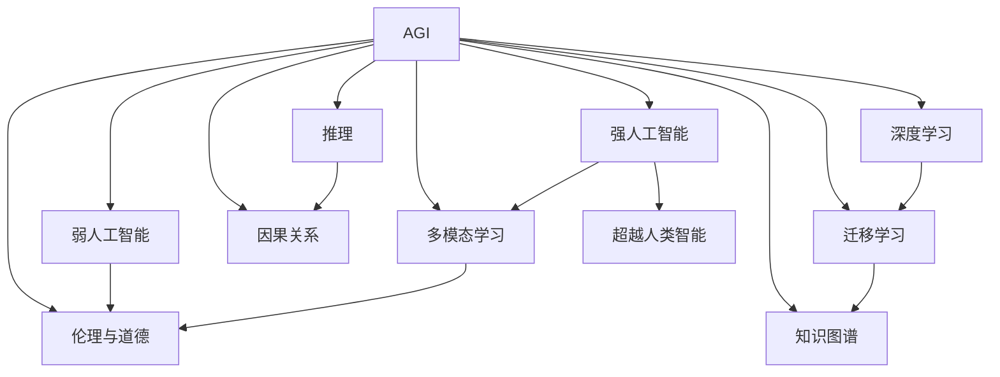
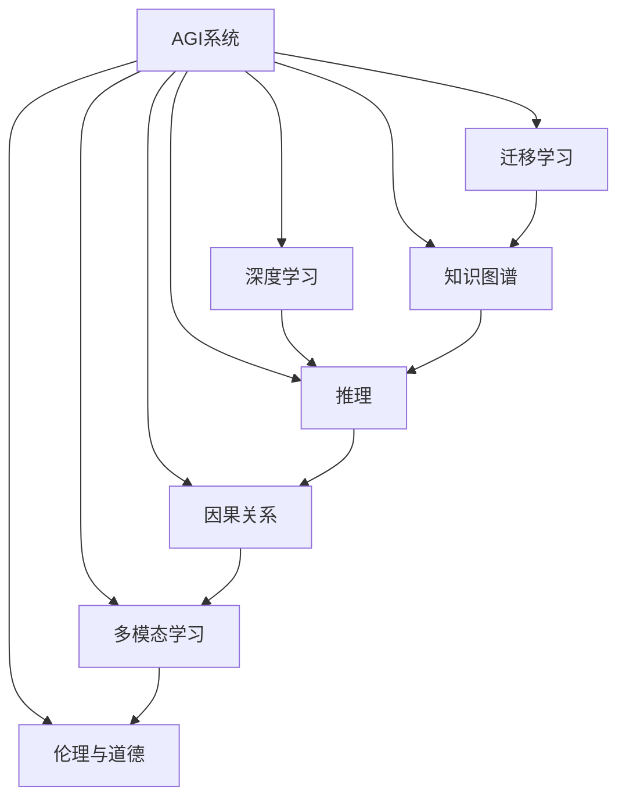
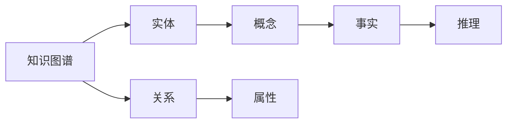
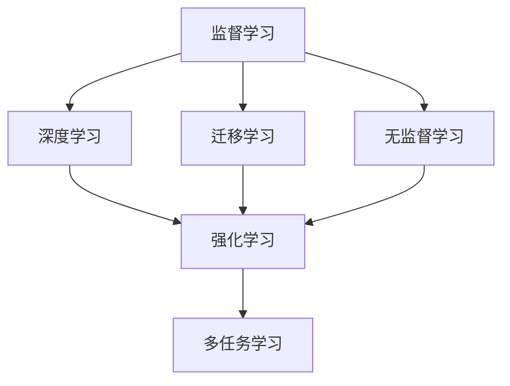
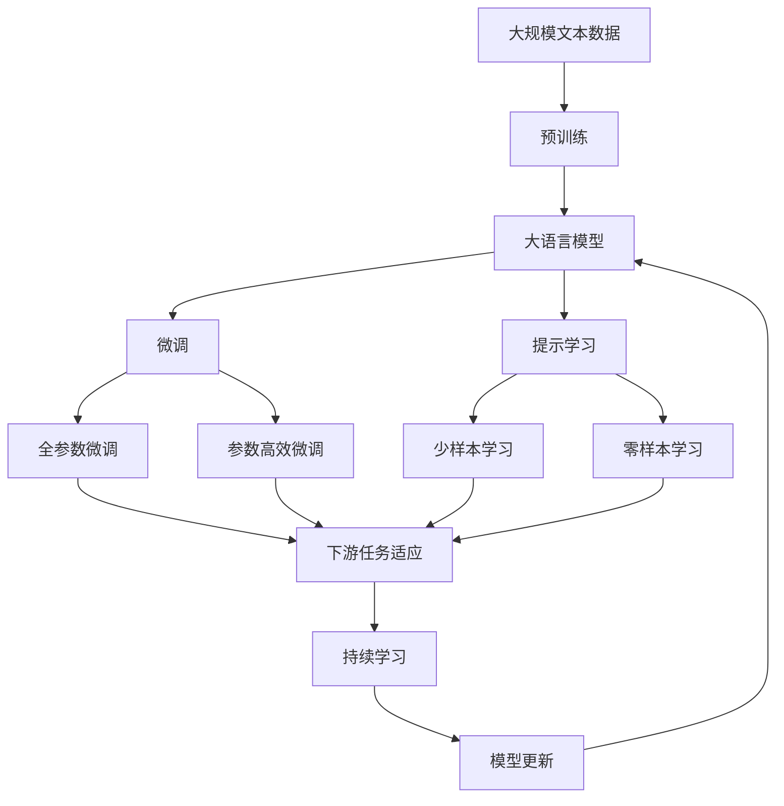

                 

# AGI的定义：能解决量子引力的问题

## 1. 背景介绍

### 1.1 问题由来
随着人工智能(AI)技术的迅速发展，人工智能是否能够实现通用智能（AGI）成为一个备受争议的问题。尽管在许多领域，如自然语言处理、计算机视觉等，AI已经展现出了超越人类专家的能力，但人们对于AI是否能够达到AGI仍存有疑虑。

AGI的定义至今仍没有一个统一的标准。一些专家认为，AGI应该是能够执行人类所有智力任务的能力，包括创造性思维、抽象推理、问题解决等。然而，这些能力在当前AI系统中，尤其是在通用大语言模型中，虽然有所体现，但还远未达到AGI的严格定义。

### 1.2 问题核心关键点
对于AGI的定义，可以归纳为以下几个核心关键点：

- 完整性：AGI应具备与人类相似的认知能力，包括逻辑推理、理解语言、执行复杂任务等。
- 多样性：AGI应能够应对各种不同的任务和场景，而不仅仅是特定领域。
- 灵活性：AGI应具备灵活的适应能力，能够从经验中学习，自我改进，适应新环境。
- 可靠性：AGI应具备高度的可靠性，即使在面对未知问题时，也能保证一定的准确性和稳定性。
- 创造性：AGI应具备一定的创造性能力，能够在某些领域提出新观点或新方法。

### 1.3 问题研究意义
研究AGI的定义，对于推动AI技术的进一步发展，以及实现AI技术的商业化应用，具有重要意义。AGI的实现，将标志着AI技术从特定任务的执行者，迈向通用认知智能的重大跨越。这不仅对AI领域本身具有深远影响，也将在人类社会生活的各个方面带来颠覆性的变化。

## 2. 核心概念与联系

### 2.1 核心概念概述

为更好地理解AGI的定义，本节将介绍几个密切相关的核心概念：

- **通用人工智能（AGI）**：指能够执行任何智能任务，具备人类智能所有特征的AI系统。
- **强人工智能（Strong AI）**：具有与人类相似或超越人类智能水平的AI系统。
- **弱人工智能（Weak AI）**：专用于特定任务的AI系统，如语音识别、图像识别等。
- **深度学习（DL）**：一种基于多层神经网络的机器学习技术，能够自动学习和优化特征表示。
- **迁移学习（Transfer Learning）**：利用已有任务的知识，在新任务上进行微调，以提高学习效率。
- **知识图谱（Knowledge Graph）**：一种以图结构表示实体及其关系的知识表示方法。
- **推理（Reasoning）**：指从已知事实推导出新事实的能力，包括逻辑推理、归纳推理等。
- **因果关系（Causality）**：指事件之间导致与被导致的关系，是理解复杂现象的基础。
- **多模态学习（Multimodal Learning）**：结合多种感官数据的AI学习范式，如视觉、听觉、触觉等。
- **伦理与道德（Ethics & Morality）**：研究AI系统应遵循的道德原则和伦理规范，确保其行为与社会价值观一致。

这些核心概念之间的逻辑关系可以通过以下Mermaid流程图来展示：

这个流程图展示了大语言模型微调过程中各个核心概念的关系和作用：

1. AGI系统应具备强人工智能的智能水平。
2. AGI系统不仅能执行弱人工智能的任务，还应具备深度学习能力。
3. 迁移学习是AGI系统的一个重要特性，可以高效利用已有知识。
4. 知识图谱是AGI系统理解复杂现象的基础。
5. 推理能力是AGI系统执行复杂任务的关键。
6. 因果关系是多模态学习的基础，使AGI系统能够更好地理解世界。
7. 伦理与道德是AGI系统行为的规范，确保其与社会价值观一致。

### 2.2 概念间的关系

这些核心概念之间存在着紧密的联系，形成了AGI系统的完整架构。下面我们通过几个Mermaid流程图来展示这些概念之间的关系。

#### 2.2.1 AGI系统的整体架构

这个流程图展示了AGI系统的完整架构，各个组件之间相互依赖，共同构成一个高效的AI系统。

#### 2.2.2 AGI系统的知识表示

这个流程图展示了知识图谱在AGI系统中的作用，即通过实体、关系、属性、事实等基本单位，构建知识表示，支持推理和决策。

#### 2.2.3 AGI系统的学习范式

这个流程图展示了AGI系统的学习范式，包括监督学习、迁移学习、无监督学习和强化学习等。这些范式共同构成AGI系统的学习能力，使其能够在不断变化的环境中自我优化。

### 2.3 核心概念的整体架构

最后，我们用一个综合的流程图来展示这些核心概念在大语言模型微调过程中的整体架构：

这个综合流程图展示了从预训练到微调，再到持续学习的完整过程。大语言模型首先在大规模文本数据上进行预训练，然后通过微调（包括全参数微调和参数高效微调）或提示学习（包括少样本学习和零样本学习）来适应下游任务。最后，通过持续学习技术，模型可以不断更新和适应新的任务和数据。

## 3. 核心算法原理 & 具体操作步骤
### 3.1 算法原理概述

AGI的定义，不仅仅是具备执行复杂任务的能力，更重要的是能够理解因果关系、逻辑推理、处理多模态信息等高级认知能力。因此，AGI的实现，需要在大规模数据上进行深度学习，并通过迁移学习、多任务学习等技术，不断提高模型在各个任务上的泛化能力。

AGI的算法原理可以概括为以下几个步骤：

1. **数据预处理**：收集大规模标注数据，并进行数据清洗、归一化等预处理。
2. **模型初始化**：选择适当的深度学习模型（如Transformer）作为初始化参数，进行预训练。
3. **微调训练**：在预训练模型的基础上，使用特定任务的数据集进行微调，以提高模型在特定任务上的性能。
4. **迁移学习**：将已有的知识应用于新的任务，以提高模型在新任务上的学习效率。
5. **多任务学习**：同时训练多个任务，以提高模型的泛化能力。
6. **持续学习**：不断收集新的数据，对模型进行增量更新，以适应新环境。

### 3.2 算法步骤详解

下面详细介绍AGI实现的各个步骤：

#### 3.2.1 数据预处理

数据预处理是大规模数据集准备和处理的关键步骤。数据预处理的目标是确保数据集的质量和一致性，为后续模型训练奠定基础。

数据预处理的主要步骤如下：

1. **数据收集**：从各个来源收集大规模的标注数据，确保数据的多样性和代表性。
2. **数据清洗**：去除数据中的噪声和不一致，确保数据的准确性。
3. **数据归一化**：将数据进行标准化处理，以便模型更好地处理不同尺度的数据。
4. **数据增强**：通过数据增强技术，扩充训练数据，提高模型的泛化能力。

#### 3.2.2 模型初始化

模型初始化是AGI实现的第一步，选择适当的深度学习模型作为初始化参数，进行预训练。预训练的目标是学习大规模语言数据的通用特征表示。

模型初始化的主要步骤如下：

1. **模型选择**：选择适当的深度学习模型，如BERT、GPT等。
2. **数据加载**：加载预训练数据集，进行模型训练。
3. **预训练**：在预训练数据集上进行自监督学习，如语言模型、掩码语言模型等。
4. **预训练优化**：调整预训练模型的超参数，如学习率、批大小等，以提高模型的泛化能力。

#### 3.2.3 微调训练

微调训练是AGI实现的核心步骤，通过在特定任务的数据集上进行微调，提高模型在特定任务上的性能。

微调训练的主要步骤如下：

1. **任务适配**：根据特定任务，设计适当的输出层和损失函数。
2. **超参数设置**：选择合适的优化算法（如AdamW、SGD等）及其参数，如学习率、批大小、迭代轮数等。
3. **微调训练**：在微调数据集上进行有监督学习，优化模型参数，以提高模型在特定任务上的性能。
4. **评估指标**：使用合适的评估指标（如准确率、召回率等），评估模型性能。
5. **模型保存**：保存微调后的模型，以备后续使用。

#### 3.2.4 迁移学习

迁移学习是AGI实现的重要手段，通过将已有的知识应用于新的任务，以提高模型在新任务上的学习效率。

迁移学习的主要步骤如下：

1. **知识提取**：从预训练模型中提取通用知识，如嵌入向量、预训练权重等。
2. **任务适配**：根据新任务的需求，对提取的知识进行适配，设计适当的任务适配层。
3. **迁移学习**：在微调数据集上进行有监督学习，以提高模型在新任务上的性能。
4. **模型融合**：将预训练知识和微调知识进行融合，以提高模型的泛化能力。

#### 3.2.5 多任务学习

多任务学习是AGI实现的重要策略，通过同时训练多个任务，以提高模型的泛化能力。

多任务学习的主要步骤如下：

1. **任务选择**：选择多个相关任务，如自然语言理解、问答、文本生成等。
2. **模型适配**：设计适当的模型适配层，以便模型能够处理多个任务。
3. **多任务学习**：在多个任务的数据集上进行联合训练，以提高模型的泛化能力。
4. **模型融合**：将多个任务的知识进行融合，以提高模型的泛化能力。

#### 3.2.6 持续学习

持续学习是AGI实现的重要目标，通过不断收集新的数据，对模型进行增量更新，以适应新环境。

持续学习的主要步骤如下：

1. **数据收集**：不断收集新的数据，以保证模型的适应性。
2. **模型更新**：对模型进行增量更新，以适应新数据。
3. **模型评估**：使用合适的评估指标，评估模型性能。
4. **模型保存**：保存更新后的模型，以备后续使用。

### 3.3 算法优缺点

AGI实现的算法具有以下优点：

1. **泛化能力强**：通过深度学习和迁移学习，模型能够学习到丰富的语言特征，并在新的任务上表现出色。
2. **适应性强**：通过多任务学习和持续学习，模型能够适应不断变化的环境，提高鲁棒性。
3. **灵活性高**：通过多模态学习和知识图谱，模型能够处理多种感官数据和复杂现象，提高灵活性。
4. **可解释性强**：通过因果关系和推理能力，模型能够提供可解释的输出，增强可解释性。

同时，AGI实现的算法也存在一些缺点：

1. **数据依赖性强**：AGI的实现需要大规模标注数据，数据获取成本高。
2. **计算资源消耗大**：AGI的实现需要大规模数据和计算资源，成本高。
3. **训练时间长**：AGI的实现需要长时间训练，效率低。
4. **模型复杂度高**：AGI的实现需要复杂模型和高维空间，难以解释。

尽管存在这些缺点，但AGI的实现仍是大数据时代的必然选择，其泛化能力和适应性强，能够在各种场景下发挥重要作用。

### 3.4 算法应用领域

AGI实现的应用领域非常广泛，涵盖以下几个方面：

1. **自然语言处理（NLP）**：如自然语言理解、文本生成、问答系统等。AGI能够处理大规模语言数据，提供高质量的NLP服务。
2. **计算机视觉（CV）**：如图像识别、物体检测、图像生成等。AGI能够处理多种感官数据，提高视觉系统的智能化水平。
3. **机器人学**：如自主导航、人机交互、智能控制等。AGI能够提高机器人的认知能力和决策水平，推动智能机器人技术的发展。
4. **自动驾驶**：如车辆感知、决策规划、路径规划等。AGI能够提高自动驾驶系统的智能化水平，提升驾驶安全性。
5. **医疗诊断**：如医学图像分析、疾病预测、药物设计等。AGI能够处理复杂的医学数据，提高医疗诊断的准确性。
6. **金融分析**：如市场预测、风险管理、投资决策等。AGI能够处理大规模金融数据，提高金融分析的智能化水平。
7. **教育培训**：如智能辅导、个性化教学、自动评估等。AGI能够提供个性化的教育服务，提高教育质量。
8. **社交媒体分析**：如情感分析、舆情监测、信息过滤等。AGI能够处理大规模社交媒体数据，提供高质量的社交媒体服务。

AGI实现的应用领域非常广泛，涵盖了各个行业的智能化需求，具有重要的商业价值和社会意义。

## 4. 数学模型和公式 & 详细讲解 & 举例说明
### 4.1 数学模型构建

AGI实现的目标是构建能够执行任何智能任务的模型，其数学模型可以概括为以下几个方面：

- **语言模型（LM）**：指通过自监督学习，学习语言数据的概率分布。
- **推理模型（RM）**：指通过逻辑推理和因果关系，执行复杂的推理任务。
- **知识图谱（KG）**：指通过图结构表示实体及其关系，支持复杂信息的处理。
- **多模态模型（MM）**：指通过多种感官数据的融合，提高模型的泛化能力。
- **伦理模型（EM）**：指通过伦理约束和道德规范，确保模型的行为符合社会价值观。

### 4.2 公式推导过程

以下是对AGI实现的数学模型和公式的详细推导过程：

#### 4.2.1 语言模型

语言模型通过自监督学习，学习语言数据的概率分布。常用的语言模型包括基于神经网络的自回归模型和自编码模型。

语言模型的公式可以表示为：

$$
P(x) = \prod_{i=1}^n P(x_i|x_{i-1}, \theta)
$$

其中，$x$ 表示输入序列，$n$ 表示序列长度，$P(x_i|x_{i-1}, \theta)$ 表示给定上下文 $x_{i-1}$ 和模型参数 $\theta$ 下，当前输入 $x_i$ 的概率分布。

通过最大化似然函数 $L(\theta)$，可以优化语言模型参数 $\theta$，公式如下：

$$
L(\theta) = \frac{1}{N} \sum_{i=1}^N \log P(x_i|x_{i-1}, \theta)
$$

其中，$N$ 表示训练样本数。

#### 4.2.2 推理模型

推理模型通过逻辑推理和因果关系，执行复杂的推理任务。常用的推理模型包括基于神经网络的推理网络和基于知识图谱的推理器。

推理模型的公式可以表示为：

$$
P(y|x, \theta) = \frac{P(y|x, \theta)P(x)}{P(x)}
$$

其中，$y$ 表示推理结果，$x$ 表示输入数据，$\theta$ 表示模型参数。

推理模型的目标是通过最大化似然函数 $L(\theta)$，优化模型参数 $\theta$，公式如下：

$$
L(\theta) = \frac{1}{N} \sum_{i=1}^N \log P(y_i|x_i, \theta)
$$

其中，$N$ 表示训练样本数。

#### 4.2.3 知识图谱

知识图谱通过图结构表示实体及其关系，支持复杂信息的处理。常用的知识图谱表示方法包括基于图神经网络的方法和基于规则的方法。

知识图谱的公式可以表示为：

$$
G = (V, E, R)
$$

其中，$V$ 表示实体节点集合，$E$ 表示关系节点集合，$R$ 表示属性节点集合。

通过最大化似然函数 $L(\theta)$，可以优化知识图谱参数 $\theta$，公式如下：

$$
L(\theta) = \frac{1}{N} \sum_{i=1}^N \log P(G_i|D, \theta)
$$

其中，$N$ 表示训练样本数，$G_i$ 表示第 $i$ 个训练样本的图结构，$D$ 表示图结构集合。

#### 4.2.4 多模态模型

多模态模型通过多种感官数据的融合，提高模型的泛化能力。常用的多模态模型包括基于神经网络的方法和基于注意力机制的方法。

多模态模型的公式可以表示为：

$$
P(y|x, \theta) = \sum_{i=1}^k P(y|x_i, \theta_i)
$$

其中，$y$ 表示输出结果，$x$ 表示输入数据，$\theta$ 表示模型参数，$k$ 表示模态数。

多模态模型的目标是通过最大化似然函数 $L(\theta)$，优化模型参数 $\theta$，公式如下：

$$
L(\theta) = \frac{1}{N} \sum_{i=1}^N \log P(y_i|x_i, \theta)
$$

其中，$N$ 表示训练样本数。

#### 4.2.5 伦理模型

伦理模型通过伦理约束和道德规范，确保模型的行为符合社会价值观。常用的伦理模型包括基于规则的方法和基于深度学习的方法。

伦理模型的公式可以表示为：

$$
P(y|x, \theta) = P(y|x, \theta) \cdot C(x, \theta)
$$

其中，$y$ 表示输出结果，$x$ 表示输入数据，$\theta$ 表示模型参数，$C(x, \theta)$ 表示伦理约束。

伦理模型的目标是通过最大化似然函数 $L(\theta)$，优化模型参数 $\theta$，公式如下：

$$
L(\theta) = \frac{1}{N} \sum_{i=1}^N \log P(y_i|x_i, \theta) \cdot C(x_i, \theta)
$$

其中，$N$ 表示训练样本数。

### 4.3 案例分析与讲解

#### 4.3.1 语言模型的案例

考虑一个基于Transformer的语言模型，其公式可以表示为：

$$
P(x) = \prod_{i=1}^n P(x_i|x_{i-1}, \theta)
$$

其中，$x$ 表示输入序列，$n$ 表示序列长度，$P(x_i|x_{i-1}, \theta)$ 表示给定上下文 $x_{i-1}$ 和模型参数 $\theta$ 下，当前输入 $x_i$ 的概率分布。

通过最大化似然函数 $L(\theta)$，可以优化语言模型参数 $\theta$，公式如下：

$$
L(\theta) = \frac{1}{N} \sum_{i=1}^N \log P(x_i|x_{i-1}, \theta)
$$

其中，$N$ 表示训练样本数。

假设我们有一个简单的语言模型，通过自监督学习，学习大规模文本数据中的概率分布。其训练过程如下：

1. 数据准备：收集大规模的文本数据，并进行数据清洗、归一化等预处理。
2. 模型初始化：选择适当的深度学习模型，如BERT、GPT等，进行预训练。
3. 微调训练：在特定任务的数据集上进行微调，优化模型参数。
4. 评估指标：使用合适的评估指标，如准确率、召回率等，评估模型性能。
5. 模型保存：保存微调后的模型，以备后续使用。

#### 4.3.2 推理模型的案例

考虑一个基于神经网络的推理模型，其公式可以表示为：

$$
P(y|x, \theta) = \frac{P(y|x, \theta)P(x)}{P(x)}
$$

其中，$y$ 表示推理结果，$x$ 表示输入数据，$\theta$ 表示模型参数。

推理模型的目标是通过最大化似然函数 $L(\theta)$，优化模型参数 $\theta$，公式如下：

$$
L(\theta) = \frac{1}{N} \sum_{i=1}^N \log P(y_i|x_i, \theta)
$$

其中，$N$ 表示训练样本数。

假设我们有一个简单的推理模型，通过逻辑推理和因果关系，执行复杂的推理任务。其训练过程如下：

1. 数据准备：收集大规模的推理数据，并进行数据清洗、归一化等预处理。
2. 模型初始化：选择适当的深度学习模型，如Transformer等，进行预训练。
3. 微调训练：在特定任务的数据集上进行微调，优化模型参数。
4. 评估指标：使用合适的评估指标，如准确率、召回率等，评估模型性能。
5. 模型保存：保存微调后的模型，以备后续使用。

#### 4.3.3 知识图谱的案例

考虑一个基于图神经网络的知识图谱模型，其公式可以表示为：

$$
G = (V, E, R)
$$

其中，$V$ 表示实体节点集合，$E$ 表示关系节点集合，$R$ 表示属性节点集合。

通过最大化似然函数 $L(\theta)$，可以优化知识图谱参数 $\theta$，公式如下：

$$
L(\theta) = \frac{1}{N} \sum_{i=1}^N \log P(G_i|D, \theta)
$$

其中，$N$ 表示训练样本数，$G_i$ 表示第 $i$ 个训练样本的图结构，$D$ 表示图结构集合。

假设我们有一个简单的知识图谱模型，通过图神经网络学习实体及其关系。其训练过程如下：

1. 数据准备：收集大规模的知识图谱数据，并进行数据清洗、归一化等预处理。
2. 模型初始化：选择适当的深度学习模型，如GraphSAGE等，进行预训练。
3. 微调训练：在特定任务的数据集上进行微调，优化模型参数。
4. 评估指标：使用合适的评估指标，如准确率、召回率等，评估模型性能。
5. 模型保存：保存微调后的模型，以备后续使用。

#### 4.3.4 多模态模型的案例

考虑一个基于神经网络的多模态模型，其公式可以表示为：

$$
P(y|x, \theta) = \sum_{i=1}^k P(y|x_i, \theta_i)
$$

其中，$y$ 表示输出结果，$x$ 表示输入数据，$\theta$ 表示模型参数，$k$ 表示模态数。

多模态模型的目标是通过最大化似然函数 $L(\theta)$，优化模型参数 $\theta$，公式如下：

$$
L(\theta) = \frac{1}{N} \sum_{i=1}^N \log P(y_i|x_i, \theta)
$$

其中，$N$ 表示训练样本数。

假设我们有一个简单的多模态模型，通过多种感官数据的融合，提高模型的泛化能力。其训练过程如下：

1. 数据准备：收集大规模的多模态数据，并进行数据清洗、归一化等预处理。
2. 模型初始化：选择适当的深度学习模型，如Transformer等，进行预训练。
3. 微调训练：在特定任务的数据集上进行微调，优化模型参数。
4. 评估指标：使用合适的评估指标，如准确率、召回率等，评估模型性能。
5. 模型保存：保存微调后的

