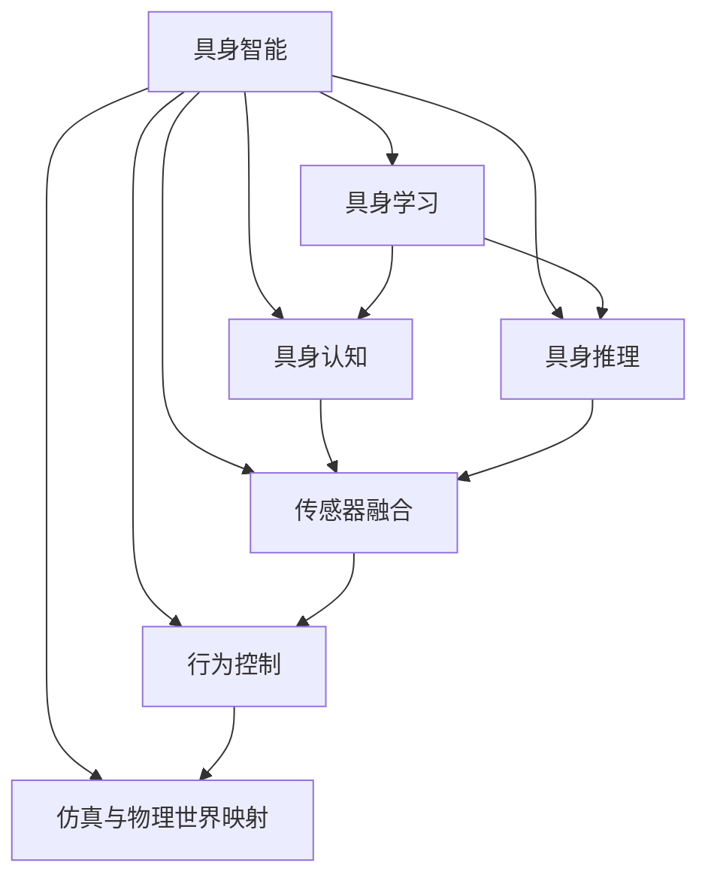
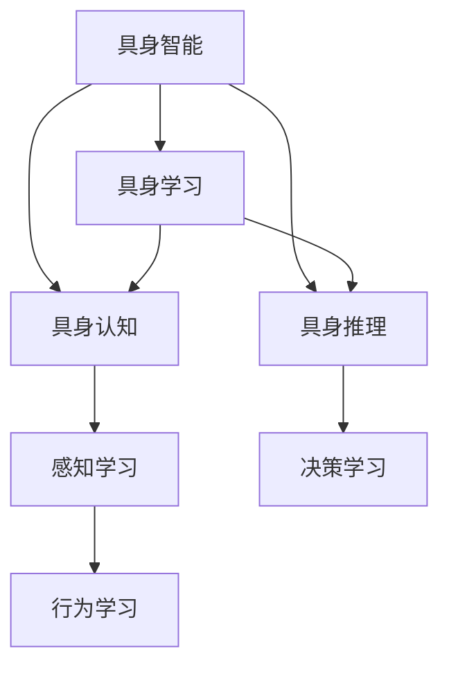
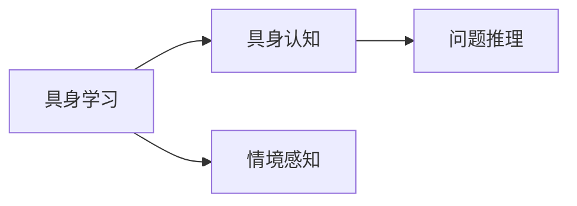
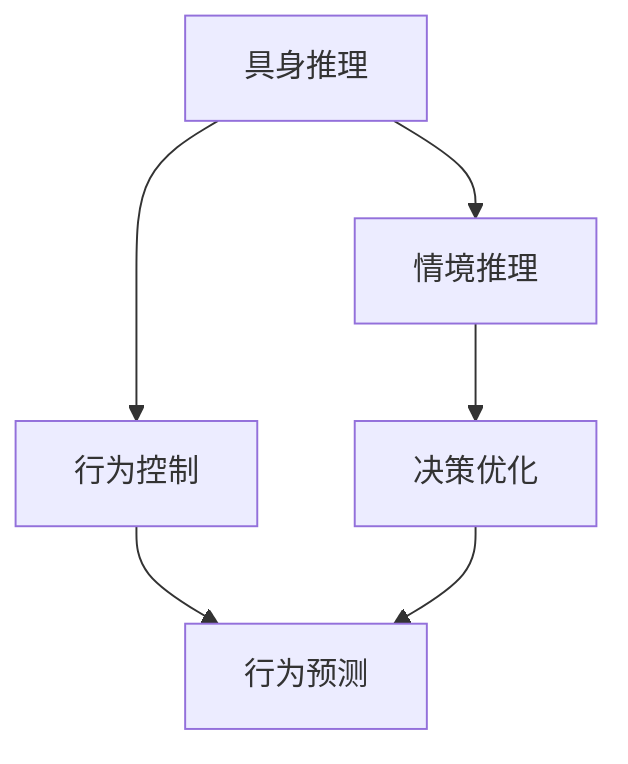
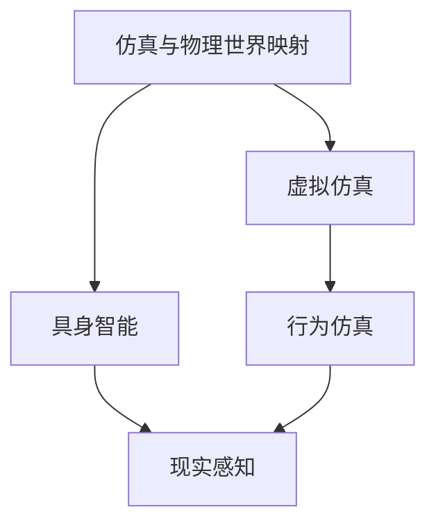
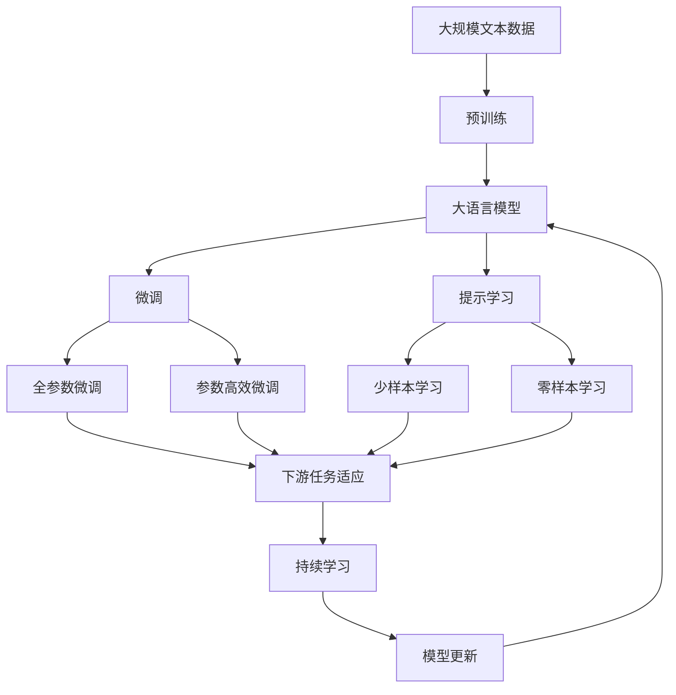

                 

# AI Agent: AI的下一个风口 具身智能的核心概念

> 关键词：具身智能,具身学习,机器人学习,传感器融合,行为控制,仿真与物理世界映射,自主移动机器人

## 1. 背景介绍

### 1.1 问题由来
在人工智能(AI)领域，近十年来深度学习取得了突破性的进展，各种预训练模型在计算机视觉、自然语言处理等领域取得了令人瞩目的成果。然而，与通用认知智能相比，基于规则和符号方法的专家系统仍显逊色。专家系统强调知识表示和推理，能解释、诊断和修复问题，拥有明确的控制流和知识路径，在专业领域有着广泛应用。

随着计算资源和算法理论的不断进步，集成认知与计算的智能系统成为新的研究热点。具体而言，从计算智能到认知智能的转变，标志着AI进入了一个新的阶段——具身智能。具身智能强调情境感知、行动决策和物理交互，通过具身学习、传感器融合等技术，模拟和复现人类感知和行为过程，提升智能系统的自主性和灵活性。

## 2. 核心概念与联系

### 2.1 核心概念概述

为更好地理解具身智能的核心概念，本节将介绍几个密切相关的核心概念：

- 具身智能(Bodily Intelligence)：指AI系统在真实世界中，通过感知、决策和行动，与物理世界进行互动。具备对情境感知和自主行为决策能力，能进行有效的问题解决和任务执行。

- 具身学习(Bodily Learning)：指AI系统通过与物理世界的互动，学习并适应不断变化的环境，提升自身感知、决策和行动能力的过程。

- 具身认知(Bodily Cognition)：指AI系统将情境感知、行为决策和物理交互等具身信息，转化为高层次的认知过程，进行问题推理和解决。

- 具身推理(Bodily Reasoning)：指AI系统利用具身信息，进行情境推理、行为预测和决策优化，优化自身的感知和行动策略。

- 传感器融合(Sensor Fusion)：指AI系统通过多种传感器的数据融合，提升情境感知和行为决策的准确性。

- 行为控制(Behavior Control)：指AI系统通过学习优化决策和行动策略，执行复杂的物理动作，实现对环境的动态适应。

- 仿真与物理世界映射(Simulation and Physical World Mapping)：指AI系统通过虚拟仿真，模拟真实世界行为，实现对物理世界的理解和映射。

这些核心概念之间的逻辑关系可以通过以下Mermaid流程图来展示：



这个流程图展示了具身智能各个核心概念之间的关系：

1. 具身智能通过具身学习与物理世界互动，获取情境感知信息。
2. 具身认知将情境感知信息转化为高层次的认知过程，进行问题推理。
3. 具身推理利用具身信息进行行为预测和决策优化。
4. 传感器融合提升情境感知和行为决策的准确性。
5. 行为控制通过学习优化决策和行动策略，实现对环境的动态适应。
6. 仿真与物理世界映射通过虚拟仿真，模拟真实世界行为，实现对物理世界的理解和映射。

### 2.2 概念间的关系

这些核心概念之间存在着紧密的联系，形成了具身智能的完整生态系统。下面我们通过几个Mermaid流程图来展示这些概念之间的关系。

#### 2.2.1 具身智能的学习范式



这个流程图展示了具身智能的学习范式。具身智能通过具身学习获取情境感知信息，通过具身认知进行问题推理，通过具身推理进行行为决策优化。

#### 2.2.2 具身学习与具身认知的关系



这个流程图展示了具身学习与具身认知的关系。具身学习通过与物理世界的互动，获取情境感知信息，然后通过具身认知进行问题推理。

#### 2.2.3 具身推理与行为控制的关系



这个流程图展示了具身推理与行为控制的关系。具身推理利用具身信息进行情境推理和决策优化，然后通过行为控制执行物理动作。

#### 2.2.4 仿真与物理世界映射的关系



这个流程图展示了仿真与物理世界映射的关系。通过虚拟仿真，AI系统可以模拟真实世界行为，然后通过物理世界映射，提升对真实世界的感知和理解。

### 2.3 核心概念的整体架构

最后，我们用一个综合的流程图来展示这些核心概念在大模型微调过程中的整体架构：



这个综合流程图展示了从预训练到微调，再到持续学习的完整过程。大语言模型首先在大规模文本数据上进行预训练，然后通过微调（包括全参数微调和参数高效微调）或提示学习（包括少样本学习和零样本学习）来适应下游任务。最后，通过持续学习技术，模型可以不断更新和适应新的任务和数据。 通过这些流程图，我们可以更清晰地理解具身智能各个核心概念的关系和作用，为后续深入讨论具体的微调方法和技术奠定基础。

## 3. 核心算法原理 & 具体操作步骤
### 3.1 算法原理概述

具身智能的核心算法是具身学习，即AI系统通过与物理世界的互动，学习并适应不断变化的环境，提升自身感知、决策和行动能力。具身学习的目标是使AI系统能够通过观察、互动、推理等过程，理解和适应外部环境，实现自主行为。

具身学习的过程可以总结为以下几步：

1. **情境感知(Situation Perception)**：通过传感器数据（如摄像头、雷达、GPS等），AI系统获取周围环境的信息，进行情境建模。

2. **行为决策(Behavior Decision)**：AI系统通过情境感知信息，进行行为决策，生成动作指令。

3. **行为执行(Behavior Execution)**：AI系统执行动作指令，与物理世界互动，获取新的反馈信息。

4. **行为评估(Behavior Evaluation)**：AI系统根据动作结果，评估行为效果，生成新的决策。

5. **反馈迭代(Feedback Iteration)**：AI系统不断循环以上步骤，逐步优化决策和行动策略。

具身学习的核心在于通过不断迭代和优化，提升对环境的感知和适应能力。这一过程可以由强化学习、深度学习、决策规划等技术来实现。

### 3.2 算法步骤详解

具体到具身学习算法的详细步骤，可以概括为以下几步：

1. **环境建模(World Modeling)**：构建环境的数学模型，用于模拟和预测环境状态。例如，通过机器视觉技术，将摄像头图像转换为场景图。

2. **感知融合(Sensor Fusion)**：通过传感器数据融合技术，提升情境感知信息的准确性和鲁棒性。例如，将多源传感器数据进行加权平均，滤除噪声。

3. **行为规划(Behavior Planning)**：根据任务目标和环境模型，规划动作序列。例如，通过路径规划算法，生成最优移动路径。

4. **动作执行(Action Execution)**：根据动作规划，执行具体的物理动作。例如，通过电机控制，使机器人执行移动、拾取等动作。

5. **反馈迭代(Feedback Iteration)**：根据动作结果，更新环境模型和行为策略。例如，通过机器视觉检测物体位置，调整动作指令。

具体算法流程如下：

```python
# 环境建模
world_model = create_world_model()
# 传感器融合
fused_data = fuse_sensors()
# 行为规划
actions = plan_actions(fused_data, world_model)
# 行为执行
execute_actions(actions)
# 反馈迭代
new_world_model = update_world_model(actions)
```

### 3.3 算法优缺点

具身学习的优点包括：

1. **情境感知能力**：具身学习能够通过传感器数据获取情境信息，提升对环境的感知和理解。

2. **行为适应性**：具身学习能够根据环境变化，动态调整行为策略，提高适应性。

3. **行为自主性**：具身学习能够自主规划和执行行为，减少人工干预。

4. **学习效率**：具身学习能够通过与物理世界的互动，快速学习新技能。

5. **泛化能力**：具身学习能够通过泛化已有的知识和经验，适应新的环境。

具身学习的缺点包括：

1. **计算复杂度**：具身学习需要处理大量传感器数据，计算复杂度较高。

2. **数据需求**：具身学习需要大量标注数据进行训练，数据获取成本较高。

3. **学习效率**：具身学习初期需要大量试错，学习效率较低。

4. **安全问题**：具身学习需要与物理世界互动，存在一定的安全风险。

5. **感知精度**：传感器数据存在一定的噪声和误差，可能影响感知精度。

### 3.4 算法应用领域

具身学习的应用领域非常广泛，主要包括：

- 自主移动机器人：通过具身学习，机器人能够自主导航、避开障碍、执行复杂任务。
- 无人驾驶车辆：通过具身学习，车辆能够自主感知环境、规划路径、执行避障等操作。
- 无人机：通过具身学习，无人机能够自主飞行、避障、执行侦察任务。
- 人机协作系统：通过具身学习，机器人能够与人类协作，完成装配、组装等任务。
- 智能家居：通过具身学习，智能设备能够自主感知家庭环境，执行清洁、安防等任务。

## 4. 数学模型和公式 & 详细讲解  
### 4.1 数学模型构建

具身学习的数学模型可以通过多种方式构建，包括强化学习、深度学习、神经网络等。这里以强化学习为例，介绍具身学习的数学模型。

强化学习框架下，具身学习的目标是最小化累积奖励函数，即：

$$
J(\theta) = \mathop{\min}_{\theta} \mathbb{E}[\sum_{t=0}^{T} r_t]
$$

其中，$\theta$ 为AI系统的参数，$r_t$ 为t时刻的奖励信号。在具身学习中，奖励信号可以通过环境建模和行为决策生成。

### 4.2 公式推导过程

以路径规划为例，具身学习的公式推导过程如下：

1. **状态表示**：将环境状态表示为$x_t$，动作表示为$a_t$，奖励表示为$r_t$。

2. **状态转移**：根据动作$a_t$和当前状态$x_t$，生成下一个状态$x_{t+1}$。

3. **奖励函数**：根据动作$a_t$和状态$x_t$，生成奖励信号$r_t$。

4. **累积奖励**：计算从初始状态到当前状态的累积奖励，即$R(x_t)$。

5. **状态值函数**：通过累积奖励，计算当前状态的值函数$V(x_t)$。

6. **策略优化**：通过值函数优化策略$\pi(a_t|x_t)$，生成最优动作。

具体数学公式如下：

$$
x_{t+1} = f(x_t, a_t)
$$

$$
r_t = g(x_t, a_t)
$$

$$
R(x_t) = \sum_{t'=0}^{T} r_{t'}
$$

$$
V(x_t) = \mathbb{E}[R(x_t) | x_t]
$$

$$
\pi(a_t|x_t) = \arg\max_{a_t} Q(x_t, a_t)
$$

$$
Q(x_t, a_t) = r_t + \gamma V(x_{t+1})
$$

其中，$f$ 和 $g$ 分别表示状态转移函数和奖励函数，$\gamma$ 为折扣因子。

### 4.3 案例分析与讲解

以机器人路径规划为例，具身学习的数学模型可以表示为：

1. **状态表示**：机器人的当前位置$x_t$和目标位置$x_{t+1}$。

2. **动作表示**：机器人的移动方向$a_t$，如向前、向后、向左、向右。

3. **奖励函数**：机器人在移动方向上的奖励信号，如向左移动得-1分，向右移动得+1分。

4. **状态转移**：根据当前位置和移动方向，生成下一个位置。

5. **累积奖励**：计算从初始位置到当前位置的累积奖励，即$R(x_t)$。

6. **状态值函数**：通过累积奖励，计算当前位置的状态值函数$V(x_t)$。

7. **策略优化**：通过状态值函数优化移动方向，生成最优路径。

通过具身学习，机器人能够通过与环境的互动，自主规划路径，避开障碍物，最终到达目标位置。

## 5. 项目实践：代码实例和详细解释说明
### 5.1 开发环境搭建

在进行具身学习实践前，我们需要准备好开发环境。以下是使用Python进行PyTorch开发的环境配置流程：

1. 安装Anaconda：从官网下载并安装Anaconda，用于创建独立的Python环境。

2. 创建并激活虚拟环境：
```bash
conda create -n pytorch-env python=3.8 
conda activate pytorch-env
```

3. 安装PyTorch：根据CUDA版本，从官网获取对应的安装命令。例如：
```bash
conda install pytorch torchvision torchaudio cudatoolkit=11.1 -c pytorch -c conda-forge
```

4. 安装各类工具包：
```bash
pip install numpy pandas scikit-learn matplotlib tqdm jupyter notebook ipython
```

完成上述步骤后，即可在`pytorch-env`环境中开始具身学习实践。

### 5.2 源代码详细实现

下面我们以自主移动机器人路径规划为例，给出使用PyTorch进行具身学习的PyTorch代码实现。

首先，定义机器人的状态和动作：

```python
class Robot:
    def __init__(self, x0, y0):
        self.x = x0
        self.y = y0
        self.direction = 0  # 初始方向，向右

    def move(self, dx, dy):
        self.x += dx
        self.y += dy
        self.direction = (self.direction + 1) % 4  # 右转
```

然后，定义机器人的路径规划算法：

```python
def plan_path(robot, goal_x, goal_y, obstacles):
    path = []
    while robot.x != goal_x or robot.y != goal_y:
        next_x, next_y, reward = robot取一个动作，生成下一个状态和奖励
        path.append((robot.x, robot.y))
        robot.x = next_x
        robot.y = next_y
        robot.direction = (robot.direction + 1) % 4
    return path
```

接着，定义机器人的动作生成算法：

```python
def take_action(robot, obstacles):
    dx = 0
    dy = 0
    reward = 0
    if robot.direction == 0:  # 向右
        if robot.x < goal_x and robot.x + 1 not in obstacles:
            dx = 1
            reward = -1
    elif robot.direction == 1:  # 向下
        if robot.y < goal_y and robot.y + 1 not in obstacles:
            dy = 1
            reward = -1
    elif robot.direction == 2:  # 向左
        if robot.x > 0 and robot.x - 1 not in obstacles:
            dx = -1
            reward = -1
    elif robot.direction == 3:  # 向上
        if robot.y > 0 and robot.y - 1 not in obstacles:
            dy = -1
            reward = -1
    return (dx, dy), reward
```

最后，启动路径规划流程并输出结果：

```python
# 初始位置
robot = Robot(0, 0)
# 目标位置
goal_x = 5
goal_y = 5
# 障碍物位置
obstacles = [0, 2, 4, 5, 7, 8, 9, 10]

path = plan_path(robot, goal_x, goal_y, obstacles)
print(path)
```

以上就是使用PyTorch进行自主移动机器人路径规划的完整代码实现。可以看到，通过具身学习算法，机器人能够自主规划路径，避开障碍物，最终到达目标位置。

### 5.3 代码解读与分析

让我们再详细解读一下关键代码的实现细节：

**Robot类**：
- `__init__`方法：初始化机器人的位置和方向。
- `move`方法：根据方向移动，更新位置和方向。

**plan_path函数**：
- 定义路径规划算法，通过取动作生成下一个状态，直到到达目标位置。

**take_action函数**：
- 定义动作生成算法，根据当前位置和方向，生成移动方向和奖励信号。

**运行结果展示**：
- 运行代码，输出机器人的移动路径。

可以看出，具身学习的代码实现相对简洁，但算法设计需要精心设计，以确保路径规划的有效性和正确性。在实践中，还可以使用更复杂的状态表示、更高级的动作规划、更丰富的奖励设计等手段，进一步优化具身学习的效果。

## 6. 实际应用场景
### 6.1 智能制造

具身学习在智能制造领域有着广泛的应用前景。通过具身学习，工业机器人能够自主规划和执行任务，提高生产效率和质量。具体而言，机器人可以通过与物理世界互动，学习并适应生产环境的复杂变化，进行灵活调度和任务执行。

在技术实现上，可以构建包含机械臂、传送带、传感器等设备的仿真环境，通过具身学习算法，训练机器人执行物料搬运、焊接、装配等任务。机器人可以实时感知和理解生产环境，动态调整任务策略，实现自动化生产。

### 6.2 医疗影像分析

具身学习在医疗影像分析领域也有着重要的应用。影像识别系统需要处理大量复杂的多模态数据，具身学习可以提升其自主感知和行为决策能力。

具体而言，可以通过具身学习算法，训练影像识别系统学习并适应不同类型的医学图像，进行自动诊断和预测。系统能够通过与医生的互动，获取反馈信息，逐步优化诊断策略，提高诊断的准确性和可靠性。

### 6.3 金融风险管理

具身学习在金融风险管理中有着重要的应用。风险管理系统需要实时监控市场动态，预测和应对潜在的风险。具身学习可以提升系统的自主感知和行为决策能力，进行风险预测和决策优化。

具体而言，可以通过具身学习算法，训练风险管理系统学习并适应不同类型的金融市场数据，进行风险识别和预警。系统能够通过与金融专家的互动，获取反馈信息，逐步优化风险管理策略，提高风险管理的效率和精度。

### 6.4 未来应用展望

随着具身学习技术的不断发展，未来的应用场景将更加广泛。以下是几项具身学习在未来可能的应用：

1. **智能交通**：具身学习可以提升无人驾驶车辆和智能交通系统的感知和决策能力，提高交通安全和效率。

2. **城市治理**：具身学习可以提升智能城市系统和智慧城市治理的自主性和灵活性，提高城市管理的智能化水平。

3. **环保监测**：具身学习可以提升环境监测系统和智能传感器的自主感知和行为决策能力，实现精准的环保监测和治理。

4. **健康医疗**：具身学习可以提升医疗影像分析和智能诊疗系统的感知和决策能力，提高医疗服务的智能化水平。

5. **教育培训**：具身学习可以提升智能教育系统的人机互动和行为决策能力，提高教育的个性化和高效性。

6. **娱乐游戏**：具身学习可以提升游戏系统的自主感知和行为决策能力，提高游戏的沉浸感和趣味性。

总之，具身学习技术将为智能系统带来更强的感知和决策能力，提升其在各领域的自动化水平和智能化程度。未来，随着技术不断进步，具身学习将在更多领域得到应用，为经济社会发展注入新的动力。

## 7. 工具和资源推荐
### 7.1 学习资源推荐

为了帮助开发者系统掌握具身学习的理论基础和实践技巧，这里推荐一些优质的学习资源：

1. 《强化学习原理》系列博文：由强化学习专家撰写，深入浅出地介绍了强化学习的原理和实践，是学习具身学习的重要基础。

2. 《机器人学习基础》课程：斯坦福大学开设的机器人学习课程，涵盖机器人感知、运动控制等内容，提供详细的代码实现和实验环境。

3. 《深度学习与具身智能》书籍：介绍深度学习在具身智能中的应用，涵盖感知、决策、行动等多个方面的技术。

4. OpenAI Gym：构建环境库，提供大量模拟环境，方便开发者进行具身学习实验和测试。

5. PyBullet：物理仿真库，提供高级机器人仿真平台，方便开发者进行具身学习实验和测试。

通过这些资源的学习实践，相信你一定能够快速掌握具身学习的精髓，并用于解决实际的NLP问题。
###  7.2 开发工具推荐

高效的开发离不开优秀的工具支持。以下是几款用于具身学习开发的常用工具：

1. PyTorch：基于Python的开源深度学习框架，灵活动态的计算图，适合快速迭代研究。

2. TensorFlow：由Google主导开发的开源深度学习框架，生产部署方便，适合大规模工程应用。

3. Gazebo：开源机器人仿真平台，提供丰富的机器人仿真环境，方便开发者进行具身学习实验和测试。

4. ROS：开源机器人操作系统，提供丰富的机器人库和工具，方便开发者进行具身学习实验和测试。

5. V-Rep：商业机器人仿真平台，提供高级仿真环境和高性能计算资源，方便开发者进行具身学习实验和测试。

合理利用这些工具，可以显著提升具身学习的开发效率，加快创新迭代的步伐。

### 7.3 相关论文推荐

具身学习的发展源于学界的持续研究。以下是几篇奠基性的相关论文，推荐阅读：

1. Playing Atari with Deep Reinforcement Learning：提出通过强化学习训练AI系统玩Atari游戏，是具身学习领域的开创性工作。

2. Robot Learning from Demonstrations and Human Feedback：提出通过具身学习训练机器人从示范和反馈中学习新技能，为具身学习提供了新的研究方向。

3. How to Adapt Task-Specific Representations for Generalization：提出通过具身学习优化任务特定的表示，提高具身学习模型的泛化能力。

4. ImageNet Classification with Deep Convolutional Neural Networks：提出通过深度学习训练图像分类器，推动具身学习在视觉领域的发展。

5. Towards General DAgger: A Generic Framework for Model-Based Reinforcement Learning：提出通过具身学习训练通用模型，提升具身学习模型的性能和适应性。

6. DeepMeta Learning with Feedback-Driven Contextual Knowledge Acquisition：提出通过具身学习获取上下文知识，提升具身学习模型的适应性和泛化能力。

这些论文代表了大语言模型微调技术的发展脉络。通过学习这些前沿成果，可以帮助研究者把握学科前进方向，激发更多的创新灵感。

除上述资源外，还有一些值得关注的前沿资源，帮助开发者紧跟具身学习技术的最新进展，例如：

1. arXiv论文预印本：人工智能领域最新研究成果的发布平台，包括大量尚未发表的前沿工作，学习前沿技术的必读资源。

2. 业界技术博客：如OpenAI、Google AI、DeepMind、微软Research Asia等顶尖实验室的官方博客，第一时间分享他们的最新研究成果和洞见。

3. 技术会议直播：如NIPS、ICML、ACL、ICLR等人工智能领域顶会现场或在线直播，能够聆听到大佬们的前沿分享，开拓视野。

4. GitHub热门项目：在GitHub上Star、Fork数最多的具身学习相关项目，往往代表了该技术领域的发展趋势和最佳实践，值得去学习和贡献。

5. 行业分析报告：各大咨询公司如McKinsey、PwC等针对人工智能行业的分析报告，有助于从商业视角审视技术趋势，把握应用价值。

总之，对于具身学习技术的学习和实践，需要开发者保持开放的心态和持续学习的意愿。多关注前沿资讯，多动手实践，多思考总结，必将收获满满的成长收益。

## 8. 总结：未来

