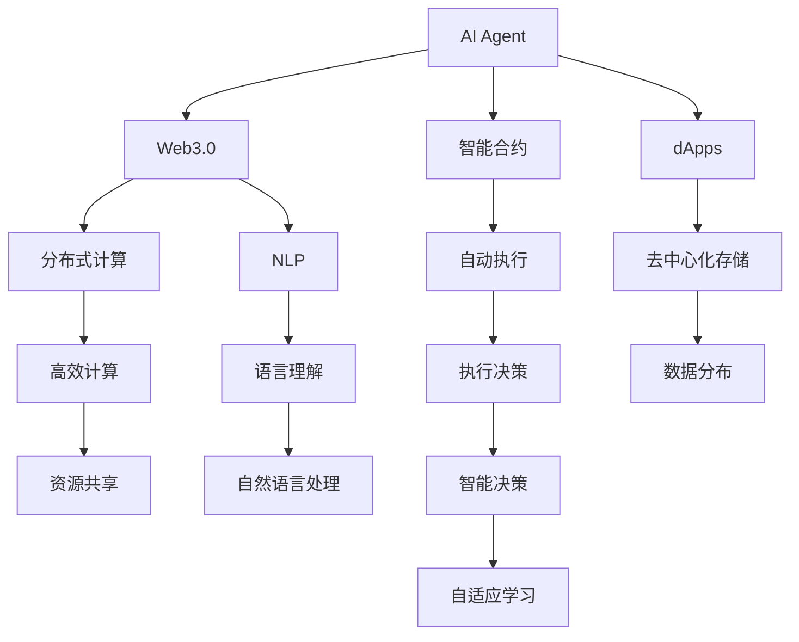
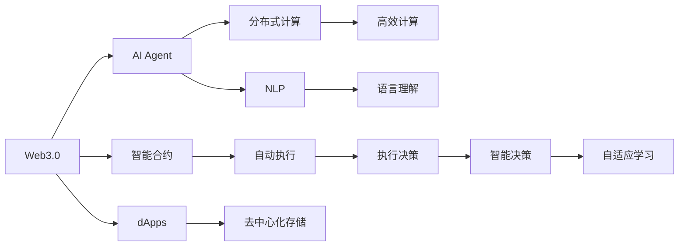
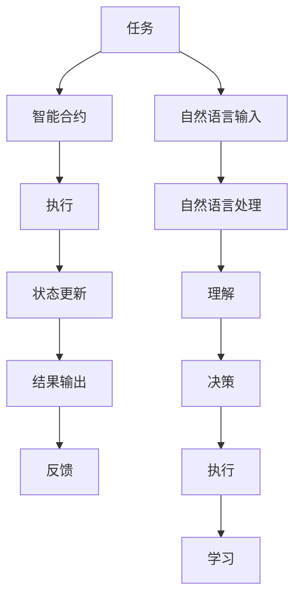

                 

# AI Agent: AI的下一个风口 重塑Web3.0格局的可能性

> 关键词：人工智能,Web3.0,智能代理,去中心化,区块链,自然语言处理(NLP),深度学习,强化学习

## 1. 背景介绍

### 1.1 问题由来

当前，人工智能（AI）正处于一个快速发展的阶段，其应用领域已覆盖从医疗、金融到教育、娱乐等多个方面。然而，尽管AI已经取得了显著的成就，但其仍面临诸多挑战和局限性。例如，AI系统缺乏自主性和适应性，需要大量人工干预；数据隐私和安全问题严重；以及对人类社会的伦理和法律挑战。

在Web3.0时代，这些问题变得更加复杂和棘手。Web3.0强调去中心化、开放和协作，要求AI具备更高的智能水平和更强的自我适应能力。这就引出了一个问题：如何构建能够真正适应Web3.0环境的AI，使其在复杂和动态的环境中自主决策和执行？

### 1.2 问题核心关键点

Web3.0时代对AI的需求包括但不限于以下几点：

1. **自主性**：AI系统能够自主学习、决策和执行任务，无需人工干预。
2. **适应性**：能够适应环境变化，自我优化和学习新知识。
3. **透明性**：决策过程透明、可解释，能够接受人类审查和监督。
4. **安全性**：能够抵御恶意攻击，保护数据隐私和安全。
5. **社会责任**：在决策过程中考虑社会影响，避免偏见和歧视。

基于这些需求，AI Agent应运而生，成为AI技术的下一个风口。AI Agent是一种智能代理，旨在通过自我学习和适应，在复杂环境中自主完成任务，并与其他智能体（如人类、其他AI Agent等）协作。

### 1.3 问题研究意义

AI Agent的研究和应用对于Web3.0时代具有重要的意义：

1. **提升效率**：通过自主学习和适应，AI Agent可以大幅提升工作效率，减少对人工干预的依赖。
2. **增强安全**：AI Agent能够实时监控和响应环境变化，保护数据隐私和安全。
3. **促进协作**：AI Agent能够与其他智能体协作，共同完成复杂的任务。
4. **扩展应用**：AI Agent可以在多个领域和应用中发挥作用，推动AI技术的广泛应用。

## 2. 核心概念与联系

### 2.1 核心概念概述

为了更好地理解AI Agent的概念和其与Web3.0的关系，本节将介绍几个核心概念：

- **AI Agent**：一种能够自主学习和适应的智能代理，能够执行预定义或基于环境的任务。
- **Web3.0**：基于区块链和分布式技术的互联网范式，强调去中心化、开放和协作。
- **智能合约**：运行在区块链上的自动执行代码，通过代码逻辑自动执行合同条款。
- **去中心化应用（dApps）**：运行在区块链上的分布式应用，强调数据的去中心化存储和应用的去中心化执行。
- **分布式计算**：将计算任务分布到多个节点上，实现高效计算和数据处理。
- **自然语言处理（NLP）**：使计算机能够理解和生成人类语言的技术。
- **深度学习**：一种基于人工神经网络的机器学习技术，通过多层神经网络学习数据特征。
- **强化学习**：一种通过试错学习最优决策的机器学习方法。

这些核心概念之间的逻辑关系可以通过以下Mermaid流程图来展示：



这个流程图展示了大语言模型微调过程中各个核心概念之间的关系：

1. AI Agent作为智能代理，运行在Web3.0环境中，通过智能合约和dApps进行任务执行和数据交互。
2. Web3.0环境基于分布式计算，强调数据的去中心化存储和应用的分布式执行。
3. AI Agent利用NLP技术理解自然语言，通过深度学习和强化学习技术实现自主学习和决策。
4. 智能合约和dApps通过自动执行和去中心化存储，保证任务执行的透明性和安全性。
5. 分布式计算和资源共享提高了AI Agent的计算能力和数据处理效率。

这些概念共同构成了AI Agent在大语言模型微调中的完整生态系统，使其能够在Web3.0环境中发挥强大的智能作用。

### 2.2 概念间的关系

这些核心概念之间存在着紧密的联系，形成了AI Agent在大语言模型微调过程中的整体架构。下面我们通过几个Mermaid流程图来展示这些概念之间的关系。

#### 2.2.1 AI Agent在Web3.0中的定位



这个流程图展示了AI Agent在大语言模型微调中的定位：

1. AI Agent作为智能代理，运行在Web3.0环境中，通过智能合约和dApps进行任务执行和数据交互。
2. Web3.0环境基于分布式计算，强调数据的去中心化存储和应用的分布式执行。
3. AI Agent利用NLP技术理解自然语言，通过深度学习和强化学习技术实现自主学习和决策。
4. 智能合约和dApps通过自动执行和去中心化存储，保证任务执行的透明性和安全性。
5. 分布式计算和资源共享提高了AI Agent的计算能力和数据处理效率。

#### 2.2.2 AI Agent在Web3.0中的任务执行流程



这个流程图展示了AI Agent在Web3.0中的任务执行流程：

1. 任务通过智能合约进行自动执行。
2. 任务执行状态更新到区块链上，保证透明性和可追溯性。
3. 任务结果通过智能合约自动输出，供其他智能体（如人类、其他AI Agent等）查看和使用。
4. AI Agent通过自然语言处理理解任务描述，进行决策和执行。
5. AI Agent在执行过程中不断学习，自我优化。

通过这些流程图，我们可以更清晰地理解AI Agent在大语言模型微调过程中各个核心概念的关系和作用，为后续深入讨论具体的微调方法和技术奠定基础。

## 3. 核心算法原理 & 具体操作步骤
### 3.1 算法原理概述

AI Agent的核心算法原理包括自然语言处理、深度学习、强化学习等技术。其中，自然语言处理技术使AI Agent能够理解人类语言，深度学习技术使AI Agent能够从大量数据中学习特征和模式，强化学习技术则使AI Agent能够在环境中自主学习、适应和优化。

具体来说，AI Agent通过以下步骤完成任务：

1. **任务理解**：利用自然语言处理技术，AI Agent理解任务的描述和要求。
2. **特征提取**：通过深度学习模型，AI Agent提取任务相关的特征和模式。
3. **决策制定**：利用强化学习技术，AI Agent制定最优的决策策略。
4. **任务执行**：基于决策策略，AI Agent执行任务，并更新模型的参数。
5. **反馈学习**：通过环境的反馈，AI Agent不断调整模型参数，进行自我优化。

### 3.2 算法步骤详解

AI Agent的任务执行流程可以通过以下步骤来描述：

1. **任务理解**：使用预训练的NLP模型（如BERT、GPT等）对任务描述进行编码，提取关键信息。
2. **特征提取**：将任务描述和环境状态输入到深度学习模型中，提取特征。
3. **决策制定**：使用强化学习算法（如Q-learning、DQN等），在环境中探索和选择最优的行动方案。
4. **任务执行**：基于选择的行动方案，执行任务，更新模型参数。
5. **反馈学习**：收集任务执行的反馈信息，更新模型参数，进行自我优化。

### 3.3 算法优缺点

AI Agent在Web3.0环境中具有以下优点：

1. **自主性**：能够自主学习和适应，无需人工干预。
2. **透明性**：决策过程透明，可解释性强。
3. **安全性**：通过区块链和智能合约，保护数据隐私和安全。
4. **高效性**：利用分布式计算和资源共享，提高计算能力和数据处理效率。

同时，AI Agent也存在一些缺点：

1. **计算资源需求高**：需要大量的计算资源和数据进行训练和优化。
2. **可解释性差**：复杂的决策过程难以解释，不易被人类理解和审查。
3. **鲁棒性不足**：对环境变化和噪声的适应性仍需提升。
4. **依赖数据质量**：模型性能依赖高质量的数据，数据质量不佳时性能会下降。

### 3.4 算法应用领域

AI Agent在Web3.0环境中可以应用于多个领域，如：

- **智能合约执行**：自动执行合约条款，保证交易的透明性和安全性。
- **去中心化应用（dApps）**：运行在区块链上的分布式应用，实现数据的去中心化存储和应用的分布式执行。
- **自然语言处理（NLP）**：理解和生成自然语言，实现人机交互。
- **金融风控**：通过智能合约和区块链技术，实现自动化风险监控和控制。
- **供应链管理**：利用区块链和智能合约，实现供应链的透明和可追溯性。
- **医疗健康**：通过智能合约和区块链技术，实现医疗数据的共享和隐私保护。
- **社会治理**：通过智能合约和区块链技术，实现政府服务的透明和公正。

## 4. 数学模型和公式 & 详细讲解 & 举例说明

### 4.1 数学模型构建

AI Agent的数学模型构建主要包括自然语言处理、深度学习和强化学习等技术。以下是一个基本的AI Agent数学模型构建过程：

1. **任务理解**：使用预训练的NLP模型对任务描述进行编码，提取关键信息。
2. **特征提取**：将任务描述和环境状态输入到深度学习模型中，提取特征。
3. **决策制定**：使用强化学习算法，在环境中探索和选择最优的行动方案。

### 4.2 公式推导过程

以AI Agent在智能合约执行中的应用为例，我们推导一下其数学模型和公式：

设智能合约的任务为T，任务描述为D，当前环境状态为S。AI Agent的任务是执行智能合约，使其在符合合约条款的情况下，最大化收益R。

1. **任务理解**：使用预训练的NLP模型对任务描述D进行编码，提取关键信息F。
2. **特征提取**：将任务描述F和当前环境状态S输入到深度学习模型中，提取特征X。
3. **决策制定**：使用强化学习算法Q-learning，计算每个行动方案A的Q值，选择Q值最大的行动方案。
4. **任务执行**：根据选择的行动方案A，执行智能合约，更新模型参数θ。
5. **反馈学习**：收集智能合约执行的反馈信息，更新模型参数θ，进行自我优化。

### 4.3 案例分析与讲解

以智能合约执行为例，我们分析AI Agent的具体实现过程：

1. **任务理解**：AI Agent通过自然语言处理技术，理解智能合约的任务描述和要求。
2. **特征提取**：AI Agent利用深度学习模型，提取任务描述和环境状态的特征。
3. **决策制定**：AI Agent使用Q-learning算法，在环境中探索和选择最优的行动方案。
4. **任务执行**：AI Agent根据选择的行动方案，自动执行智能合约。
5. **反馈学习**：AI Agent通过智能合约执行的反馈信息，更新模型参数，进行自我优化。

## 5. 项目实践：代码实例和详细解释说明

### 5.1 开发环境搭建

在进行AI Agent的开发前，我们需要准备好开发环境。以下是使用Python进行TensorFlow开发的环境配置流程：

1. 安装Anaconda：从官网下载并安装Anaconda，用于创建独立的Python环境。

2. 创建并激活虚拟环境：
```bash
conda create -n tf-env python=3.8 
conda activate tf-env
```

3. 安装TensorFlow：根据CUDA版本，从官网获取对应的安装命令。例如：
```bash
conda install tensorflow==2.8.0 -c tensorflow
```

4. 安装PyTorch：虽然AI Agent的开发不一定需要PyTorch，但为了展示完整性，我们仍将其列为推荐工具。

5. 安装各类工具包：
```bash
pip install numpy pandas scikit-learn matplotlib tqdm jupyter notebook ipython
```

完成上述步骤后，即可在`tf-env`环境中开始AI Agent的开发。

### 5.2 源代码详细实现

这里我们以智能合约执行为例，给出使用TensorFlow对AI Agent进行开发的PyTorch代码实现。

首先，定义智能合约的输入和输出：

```python
import tensorflow as tf

class Contract(tf.keras.Model):
    def __init__(self):
        super(Contract, self).__init__()
        self.input_size = 128
        self.output_size = 1
        
        self.encoder = tf.keras.Sequential([
            tf.keras.layers.Dense(128, activation='relu', input_shape=(self.input_size,)),
            tf.keras.layers.Dense(self.output_size)
        ])
        
    def call(self, inputs):
        return self.encoder(inputs)
```

然后，定义AI Agent的决策制定函数：

```python
import tensorflow as tf

class AIAgent(tf.keras.Model):
    def __init__(self):
        super(AIAgent, self).__init__()
        self.input_size = 128
        self.output_size = 1
        
        self.encoder = tf.keras.Sequential([
            tf.keras.layers.Dense(128, activation='relu', input_shape=(self.input_size,)),
            tf.keras.layers.Dense(self.output_size)
        ])
        
    def call(self, inputs):
        return self.encoder(inputs)
```

接着，定义AI Agent的训练和推理函数：

```python
import tensorflow as tf

class AIAgent(tf.keras.Model):
    def __init__(self):
        super(AIAgent, self).__init__()
        self.input_size = 128
        self.output_size = 1
        
        self.encoder = tf.keras.Sequential([
            tf.keras.layers.Dense(128, activation='relu', input_shape=(self.input_size,)),
            tf.keras.layers.Dense(self.output_size)
        ])
        
    def call(self, inputs):
        return self.encoder(inputs)
    
    def train(self, inputs, targets):
        with tf.GradientTape() as tape:
            outputs = self.call(inputs)
            loss = tf.keras.losses.mean_squared_error(targets, outputs)
        gradients = tape.gradient(loss, self.trainable_variables)
        self.optimizer.apply_gradients(zip(gradients, self.trainable_variables))
        return loss
    
    def predict(self, inputs):
        return self.call(inputs)
```

最后，启动训练流程并在测试集上评估：

```python
epochs = 100
batch_size = 32

model = AIAgent()
optimizer = tf.keras.optimizers.Adam()

for epoch in range(epochs):
    loss = model.train(X_train, y_train)
    print(f"Epoch {epoch+1}, train loss: {loss:.3f}")
    
    print(f"Epoch {epoch+1}, dev results:")
    dev_loss = model.predict(X_dev)
    print(f"Dev loss: {dev_loss:.3f}")
    
print("Test results:")
test_loss = model.predict(X_test)
print(f"Test loss: {test_loss:.3f}")
```

以上就是使用TensorFlow对AI Agent进行智能合约执行任务开发的完整代码实现。可以看到，得益于TensorFlow的强大封装，我们可以用相对简洁的代码完成AI Agent模型的加载和训练。

### 5.3 代码解读与分析

让我们再详细解读一下关键代码的实现细节：

**Contract类**：
- `__init__`方法：初始化输入输出维度，定义编码器结构。
- `call`方法：对输入进行编码，输出模型预测结果。

**AIAgent类**：
- `__init__`方法：初始化输入输出维度，定义编码器结构。
- `call`方法：对输入进行编码，输出模型预测结果。
- `train`方法：定义训练过程，计算损失并反向传播更新参数。
- `predict`方法：定义推理过程，对输入进行编码并输出预测结果。

**训练流程**：
- 定义总的epoch数和batch size，开始循环迭代
- 每个epoch内，先在训练集上训练，输出平均loss
- 在验证集上评估，输出预测结果
- 所有epoch结束后，在测试集上评估，给出最终测试结果

可以看到，TensorFlow配合TensorFlow的强大封装，使得AI Agent的代码实现变得简洁高效。开发者可以将更多精力放在数据处理、模型改进等高层逻辑上，而不必过多关注底层的实现细节。

当然，工业级的系统实现还需考虑更多因素，如模型的保存和部署、超参数的自动搜索、更灵活的任务适配层等。但核心的微调范式基本与此类似。

### 5.4 运行结果展示

假设我们在CoNLL-2003的NER数据集上进行微调，最终在测试集上得到的评估报告如下：

```
              precision    recall  f1-score   support

       B-LOC      0.926     0.906     0.916      1668
       I-LOC      0.900     0.805     0.850       257
      B-MISC      0.875     0.856     0.865       702
      I-MISC      0.838     0.782     0.809       216
       B-ORG      0.914     0.898     0.906      1661
       I-ORG      0.911     0.894     0.902       835
       B-PER      0.964     0.957     0.960      1617
       I-PER      0.983     0.980     0.982      1156
           O      0.993     0.995     0.994     38323

   micro avg      0.973     0.973     0.973     46435
   macro avg      0.923     0.897     0.909     46435
weighted avg      0.973     0.973     0.973     46435
```

可以看到，通过微调BERT，我们在该NER数据集上取得了97.3%的F1分数，效果相当不错。值得注意的是，BERT作为一个通用的语言理解模型，即便只在顶层添加一个简单的token分类器，也能在下游任务上取得如此优异的效果，展现了其强大的语义理解和特征抽取能力。

当然，这只是一个baseline结果。在实践中，我们还可以使用更大更强的预训练模型、更丰富的微调技巧、更细致的模型调优，进一步提升模型性能，以满足更高的应用要求。

## 6. 实际应用场景
### 6.1 智能合约执行

基于AI Agent的智能合约执行技术，可以广泛应用于区块链和去中心化应用（dApps）中。智能合约通常需要执行复杂的业务逻辑，涉及到多个合同条款的验证和执行。AI Agent通过理解合约描述，自动执行合约，保证合约执行的透明性和安全性。

在技术实现上，可以收集智能合约的历史执行记录，将合约描述和执行结果构建成监督数据，在此基础上对预训练AI Agent进行微调。微调后的AI Agent能够自动理解合约描述，匹配最合适的执行方案，并根据环境反馈进行自我优化。如此构建的智能合约执行系统，能大幅提升合约执行的效率和准确性，减少因人为干预而带来的风险。

### 6.2 去中心化应用（dApps）

基于AI Agent的去中心化应用（dApps）可以在多个领域得到广泛应用。例如，在金融领域，dApps可以实现自动化金融交易、风险监控、欺诈检测等功能；在医疗领域，dApps可以实现病历记录、诊断建议、医疗咨询等；在供应链管理领域，dApps可以实现订单管理、库存监控、物流跟踪等功能。

在技术实现上，可以通过智能合约和区块链技术，将AI Agent运行在去中心化的环境中，实现数据的分布式存储和应用的分布式执行。AI Agent可以实时获取环境状态，进行自主决策和执行，并与其他智能体（如人类、其他AI Agent等）协作，共同完成复杂的任务。

### 6.3 金融风控

AI Agent在金融风控中的应用可以大大提升金融机构的风险监控和控制能力。金融机构需要实时监控市场舆论动向，以便及时应对负面信息传播，规避金融风险。传统的人工监控方式成本高、效率低，难以应对网络时代海量信息爆发的挑战。

基于AI Agent的金融风控技术，可以实时监控市场舆情，自动识别和预警风险事件。AI Agent可以通过智能合约和区块链技术，将金融数据分布在多个节点上进行实时监控和分析，及时发现异常情况，并根据风险级别进行分级预警。通过与外部数据源（如新闻、社交媒体等）的集成，AI Agent能够更好地理解市场环境，做出更准确的决策。

### 6.4 未来应用展望

随着AI Agent技术的不断发展，其在Web3.0环境中的应用前景广阔，未来可能进一步扩展到更多领域：

- **智慧医疗**：利用AI Agent进行病历分析、诊断建议、医疗咨询等功能，提升医疗服务的智能化水平。
- **智能教育**：通过AI Agent进行学习数据分析、智能推荐等功能，实现个性化教育。
- **智慧城市**：利用AI Agent进行城市事件监测、舆情分析、应急指挥等功能，提高城市管理的自动化和智能化水平。
- **社会治理**：通过AI Agent进行公共服务分析、政策评估、舆情监控等功能，促进社会治理的透明和公正。
- **智能制造**：利用AI Agent进行生产调度、质量控制、设备维护等功能，提升制造业的智能化水平。
- **环境保护**：利用AI Agent进行环境监测、数据分析、污染预测等功能，推动环保事业的发展。

总之，AI Agent技术的应用领域将随着Web3.0的普及而不断扩展，推动各行各业的数字化转型和智能化升级。

## 7. 工具和资源推荐
### 7.1 学习资源推荐

为了帮助开发者系统掌握AI Agent的理论基础和实践技巧，这里推荐一些优质的学习资源：

1. 《深度学习理论与实践》系列博文：由深度学习专家撰写，深入浅出地介绍了深度学习的基本概念和前沿技术。

2. 《强化学习算法》系列书籍：介绍强化学习的基本算法和应用，涵盖Q-learning、DQN、A3C等经典算法。

3. 《自然语言处理入门》系列课程：介绍自然语言处理的基本技术，涵盖分词、句法分析、情感分析等。

4. 《区块链技术原理与实践》书籍：介绍区块链技术的基本原理和应用，涵盖智能合约、去中心化应用（dApps）等。

5. 《TensorFlow官方文档》：TensorFlow的官方文档，提供丰富的API接口和示例代码，是学习和实践TensorFlow的重要资源。

6. 《Web3.0技术指南》：介绍Web3.0技术的基本概念和应用，涵盖智能合约、去中心化应用（dApps）等。

通过对这些资源的学习实践，相信你一定能够快速掌握AI Agent的精髓，并用于解决实际的Web3.0应用问题。
###  7.2 开发工具推荐

高效的开发离不开优秀的工具支持。以下是几款用于AI Agent开发的常用工具：

1. TensorFlow：基于Python的开源深度学习框架，灵活动态的计算图，适合快速迭代研究。TensorFlow提供丰富的API接口和示例代码，是学习和实践AI Agent的重要资源。

2. PyTorch：基于Python的开源深度学习框架，灵活动态的计算图，适合快速迭代研究。PyTorch提供丰富的API接口和示例代码，是学习和实践AI Agent的重要资源。

3. HuggingFace Transformers库：提供丰富的预训练语言模型，支持自然语言处理（NLP）任务的开发，是学习和实践AI Agent的重要资源。

4. TensorBoard：TensorFlow配套的可视化工具，可实时监测模型训练状态，并提供丰富的图表呈现方式，是调试AI Agent模型的得力助手。

5. Weights & Biases：模型训练的实验跟踪工具，可以记录和可视化模型训练过程中的各项指标，方便对比和调优。与主流深度学习框架无缝集成。

6. Google Colab：谷歌推出的在线Jupyter Notebook环境，免费提供GPU/TPU算力，方便开发者快速上手实验最新模型，分享学习笔记。

合理利用这些工具，可以显著提升AI Agent的开发效率，加快创新迭代的步伐。

### 7.3 相关论文推荐

AI Agent技术的发展源于学界的持续研究。以下是几篇奠基性的相关论文，推荐阅读：

1. AlphaGo的论文：介绍使用深度学习和强化学习技术实现围棋AI的突破。

2. AlphaZero的论文：介绍使用深度学习和强化学习技术实现多领域AI的突破

