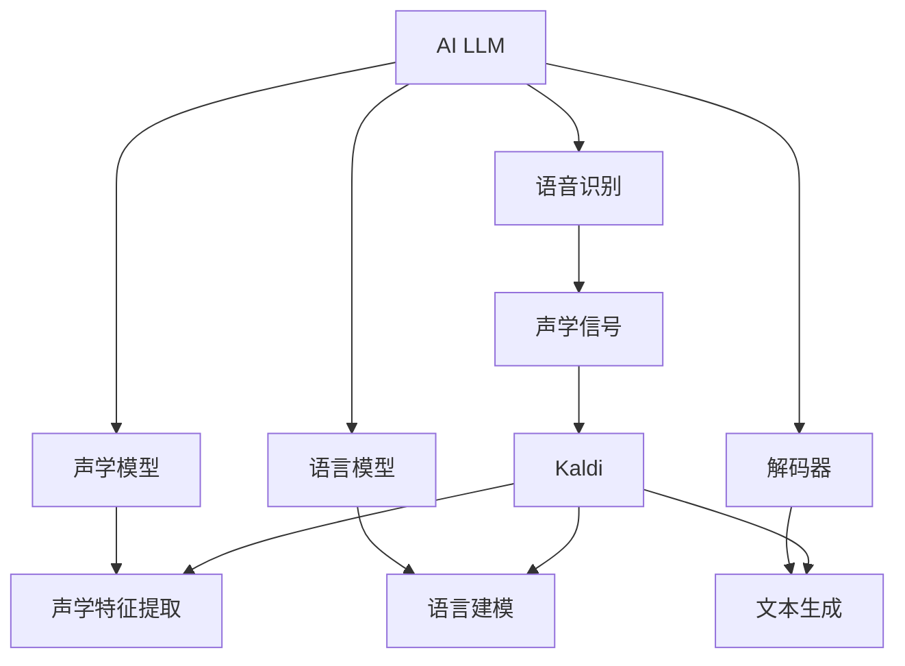

                 

# AI LLM在语音识别中的实战应用：更精确、更智能

> 关键词：AI LLM, 语音识别, 自然语言处理(NLP), 机器学习, 深度学习, 模型微调, 参数高效微调(PEFT)

## 1. 背景介绍

随着人工智能技术的飞速发展，语音识别（Speech Recognition）作为人机交互的重要手段，已经广泛应用于智能手机、智能家居、车载系统等多个领域。然而，传统的基于统计模型的语音识别系统在面对复杂语音环境时，往往准确率不高，用户体验欠佳。近年来，大规模预训练语言模型（Large Language Models, LLMs）在语音识别领域的应用，极大地提升了识别系统的精度和鲁棒性，为智能语音交互打开了新的可能性。

本文聚焦于利用大规模预训练语言模型（如GPT、BERT等）进行语音识别系统微调的技术实践，探讨如何通过微调技术提升语音识别系统的精确度和智能性。

## 2. 核心概念与联系

### 2.1 核心概念概述

为更好地理解语音识别中基于大语言模型的微调方法，本节将介绍几个关键概念：

- **AI LLM**: 以自回归(如GPT)或自编码(如BERT)模型为代表的大规模预训练语言模型。通过在大规模无标签文本语料上进行预训练，学习通用的语言表示，具备强大的语言理解和生成能力。

- **语音识别**: 将人的语音转换为文本的过程，通常通过声学模型（Acoustic Model）、语言模型（Language Model）和解码器（Decoder）三部分实现。其中，声学模型负责将语音信号转换为声学特征，语言模型用于对声学特征进行建模，解码器则将声学特征转换为文本。

- **自然语言处理(NLP)**: 涉及语言理解、生成、分析等任务的综合性学科。AI LLM在大语言模型上进行微调，可以增强其在语音识别系统中的理解力和生成能力。

- **机器学习与深度学习**: 语音识别系统的核心技术，通过训练数据学习模型参数，使得模型能够自动地从语音信号中提取特征并进行分类。

- **模型微调**: 在大规模预训练模型的基础上，通过使用特定任务的数据集对其进行训练，调整模型参数，使其在特定任务上表现更佳。

- **参数高效微调(PEFT)**: 一种微调方法，仅调整预训练模型中少量参数，保留大部分预训练权重不变，从而提高微调效率，避免过拟合。

- **对抗训练**: 通过引入对抗样本，增强模型对噪声、干扰等异常情况的鲁棒性，提高模型的泛化能力。

这些核心概念共同构成了AI LLM在语音识别系统微调的基本框架，使得系统能够通过少量的标注数据，快速提升识别精度和智能性。

### 2.2 概念间的关系

这些核心概念之间的逻辑关系可以通过以下Mermaid流程图来展示：



这个流程图展示了AI LLM在语音识别系统中的作用和与各组件的关系：

1. AI LLM作为预训练模型，通过自监督学习任务（如掩码语言模型、句子预测等）获得语言表示能力。
2. 语音识别系统通过声学模型将语音信号转换为声学特征，语言模型对声学特征进行建模，解码器将声学特征转换为文本。
3. 声学模型、语言模型和解码器共同构成了语音识别的核心组件，而AI LLM可以通过微调提升其性能。

## 3. 核心算法原理 & 具体操作步骤
### 3.1 算法原理概述

基于大规模预训练语言模型（AI LLM）的语音识别微调，本质上是一个有监督的细粒度迁移学习过程。其核心思想是：将预训练的AI LLM作为“特征提取器”，通过在特定任务的数据集上进行微调，使得模型输出能够匹配语音识别系统中的期望输出，从而提升系统在特定任务上的识别性能。

具体来说，假设预训练的AI LLM模型为 $M_{\theta}$，其中 $\theta$ 为预训练得到的模型参数。给定语音识别任务的标注数据集 $D=\{(x_i, y_i)\}_{i=1}^N$，其中 $x_i$ 为语音信号，$y_i$ 为文本标签。微调的目标是最小化模型在标注数据集 $D$ 上的损失函数，即：

$$
\theta^* = \mathop{\arg\min}_{\theta} \mathcal{L}(M_{\theta}, D)
$$

其中 $\mathcal{L}$ 为针对语音识别任务设计的损失函数，通常包括交叉熵损失、均方误差损失等。

通过梯度下降等优化算法，微调过程不断更新模型参数 $\theta$，最小化损失函数 $\mathcal{L}$，使得模型输出逼近真实标签 $y_i$。由于 $\theta$ 已经通过预训练获得了较好的初始化，因此即便在语音识别系统微调中使用少量标注数据，也能较快收敛到理想的模型参数 $\theta^*$。

### 3.2 算法步骤详解

基于AI LLM的语音识别系统微调一般包括以下几个关键步骤：

**Step 1: 准备预训练模型和数据集**
- 选择合适的预训练AI LLM模型（如GPT、BERT等）作为初始化参数。
- 准备语音识别任务的标注数据集 $D$，划分为训练集、验证集和测试集。一般要求标注数据与预训练数据的分布不要差异过大。

**Step 2: 设计任务适配层**
- 根据语音识别任务类型，在预训练模型顶层设计合适的输出层和损失函数。
- 对于分类任务，通常在顶层添加线性分类器和交叉熵损失函数。
- 对于生成任务，通常使用语言模型的解码器输出概率分布，并以负对数似然为损失函数。

**Step 3: 设置微调超参数**
- 选择合适的优化算法及其参数，如AdamW、SGD等，设置学习率、批大小、迭代轮数等。
- 设置正则化技术及强度，包括权重衰减、Dropout、Early Stopping等。
- 确定冻结预训练参数的策略，如仅微调顶层，或全部参数都参与微调。

**Step 4: 执行梯度训练**
- 将训练集数据分批次输入模型，前向传播计算损失函数。
- 反向传播计算参数梯度，根据设定的优化算法和学习率更新模型参数。
- 周期性在验证集上评估模型性能，根据性能指标决定是否触发Early Stopping。
- 重复上述步骤直到满足预设的迭代轮数或Early Stopping条件。

**Step 5: 测试和部署**
- 在测试集上评估微调后模型 $M_{\hat{\theta}}$ 的性能，对比微调前后的精度提升。
- 使用微调后的模型对新样本进行推理预测，集成到实际的应用系统中。
- 持续收集新的数据，定期重新微调模型，以适应数据分布的变化。

以上是基于AI LLM的语音识别系统微调的一般流程。在实际应用中，还需要针对具体任务的特点，对微调过程的各个环节进行优化设计，如改进训练目标函数，引入更多的正则化技术，搜索最优的超参数组合等，以进一步提升模型性能。

### 3.3 算法优缺点

基于AI LLM的语音识别系统微调方法具有以下优点：
1. 简单高效。只需准备少量标注数据，即可对预训练模型进行快速适配，获得较大的性能提升。
2. 通用适用。适用于各种语音识别下游任务，包括语音分类、语音识别、语音翻译等，设计简单的任务适配层即可实现微调。
3. 参数高效。利用参数高效微调技术，在固定大部分预训练权重不变的情况下，仍可取得不错的提升。
4. 效果显著。在学术界和工业界的诸多任务上，基于微调的方法已经刷新了最先进的性能指标。

同时，该方法也存在一定的局限性：
1. 依赖标注数据。微调的效果很大程度上取决于标注数据的质量和数量，获取高质量标注数据的成本较高。
2. 迁移能力有限。当目标任务与预训练数据的分布差异较大时，微调的性能提升有限。
3. 负面效果传递。预训练模型的固有偏见、有害信息等，可能通过微调传递到下游任务，造成负面影响。
4. 可解释性不足。微调模型的决策过程通常缺乏可解释性，难以对其推理逻辑进行分析和调试。

尽管存在这些局限性，但就目前而言，基于监督学习的微调方法仍是大语言模型应用的最主流范式。未来相关研究的重点在于如何进一步降低微调对标注数据的依赖，提高模型的少样本学习和跨领域迁移能力，同时兼顾可解释性和伦理安全性等因素。

### 3.4 算法应用领域

基于AI LLM的语音识别系统微调方法，在语音识别领域已经得到了广泛的应用，覆盖了几乎所有常见任务，例如：

- 语音分类：如不同口音的语音分类、语音情绪识别等。通过微调使模型学习语音-标签映射。
- 语音识别：将语音信号转换为文本。通过微调使模型学习语音-文本映射。
- 语音翻译：将源语言语音翻译成目标语言。通过微调使模型学习语音-语言映射。
- 语音摘要：将长语音记录压缩成简短摘要。通过微调使模型学习语音-摘要映射。
- 语音对话：使机器能够与人类自然对话。将对话历史作为上下文，微调模型进行回复生成。

除了上述这些经典任务外，基于AI LLM的语音识别系统微调方法也被创新性地应用到更多场景中，如可控语音生成、语音情感分析、语音信息检索等，为语音识别技术带来了全新的突破。随着预训练模型和微调方法的不断进步，相信语音识别技术将在更广阔的应用领域大放异彩。

## 4. 数学模型和公式 & 详细讲解 & 举例说明

### 4.1 数学模型构建

本节将使用数学语言对基于AI LLM的语音识别系统微调过程进行更加严格的刻画。

记预训练AI LLM模型为 $M_{\theta}$，其中 $\theta$ 为预训练得到的模型参数。假设语音识别任务的训练集为 $D=\{(x_i, y_i)\}_{i=1}^N$，其中 $x_i$ 为语音信号，$y_i$ 为文本标签。

定义模型 $M_{\theta}$ 在输入 $x$ 上的输出为 $\hat{y}=M_{\theta}(x) \in [0,1]$，表示语音信号到文本标签的映射概率。则语音识别任务的经验风险为：

$$
\mathcal{L}(\theta) = -\frac{1}{N}\sum_{i=1}^N \ell(M_{\theta}(x_i),y_i)
$$

其中 $\ell$ 为损失函数，用于衡量模型预测输出与真实标签之间的差异。常见的损失函数包括交叉熵损失、均方误差损失等。

通过梯度下降等优化算法，微调过程不断更新模型参数 $\theta$，最小化损失函数 $\mathcal{L}$，使得模型输出逼近真实标签。由于 $\theta$ 已经通过预训练获得了较好的初始化，因此即便在语音识别系统微调中使用少量标注数据，也能较快收敛到理想的模型参数 $\hat{\theta}$。

### 4.2 公式推导过程

以下我们以语音识别任务为例，推导交叉熵损失函数及其梯度的计算公式。

假设模型 $M_{\theta}$ 在输入 $x$ 上的输出为 $\hat{y}=M_{\theta}(x) \in [0,1]$，真实标签 $y \in \{0,1\}$。则二分类交叉熵损失函数定义为：

$$
\ell(M_{\theta}(x),y) = -[y\log \hat{y} + (1-y)\log (1-\hat{y})]
$$

将其代入经验风险公式，得：

$$
\mathcal{L}(\theta) = -\frac{1}{N}\sum_{i=1}^N [y_i\log M_{\theta}(x_i)+(1-y_i)\log(1-M_{\theta}(x_i))]
$$

根据链式法则，损失函数对参数 $\theta_k$ 的梯度为：

$$
\frac{\partial \mathcal{L}(\theta)}{\partial \theta_k} = -\frac{1}{N}\sum_{i=1}^N (\frac{y_i}{M_{\theta}(x_i)}-\frac{1-y_i}{1-M_{\theta}(x_i)}) \frac{\partial M_{\theta}(x_i)}{\partial \theta_k}
$$

其中 $\frac{\partial M_{\theta}(x_i)}{\partial \theta_k}$ 可进一步递归展开，利用自动微分技术完成计算。

在得到损失函数的梯度后，即可带入参数更新公式，完成模型的迭代优化。重复上述过程直至收敛，最终得到适应语音识别任务的最优模型参数 $\hat{\theta}$。

## 5. 项目实践：代码实例和详细解释说明

### 5.1 开发环境搭建

在进行语音识别系统微调实践前，我们需要准备好开发环境。以下是使用Python进行PyTorch开发的环境配置流程：

1. 安装Anaconda：从官网下载并安装Anaconda，用于创建独立的Python环境。

2. 创建并激活虚拟环境：
```bash
conda create -n pytorch-env python=3.8 
conda activate pytorch-env
```

3. 安装PyTorch：根据CUDA版本，从官网获取对应的安装命令。例如：
```bash
conda install pytorch torchvision torchaudio cudatoolkit=11.1 -c pytorch -c conda-forge
```

4. 安装HuggingFace库：
```bash
pip install transformers
```

5. 安装各类工具包：
```bash
pip install numpy pandas scikit-learn matplotlib tqdm jupyter notebook ipython
```

完成上述步骤后，即可在`pytorch-env`环境中开始微调实践。

### 5.2 源代码详细实现

下面我们以语音分类任务为例，给出使用Transformers库对GPT模型进行语音分类微调的PyTorch代码实现。

首先，定义语音分类任务的数据处理函数：

```python
from transformers import TFAutoModelForSequenceClassification, AdamW, WandbLogger
import torch
from transformers import AutoTokenizer

class SpeechClassificationDataset(Dataset):
    def __init__(self, texts, labels, tokenizer, max_len=128):
        self.texts = texts
        self.labels = labels
        self.tokenizer = tokenizer
        self.max_len = max_len
        
    def __len__(self):
        return len(self.texts)
    
    def __getitem__(self, item):
        text = self.texts[item]
        label = self.labels[item]
        
        encoding = self.tokenizer(text, return_tensors='pt', max_length=self.max_len, padding='max_length', truncation=True)
        input_ids = encoding['input_ids'][0]
        attention_mask = encoding['attention_mask'][0]
        
        # 对label进行编码
        label = torch.tensor(label, dtype=torch.long)
        
        return {'input_ids': input_ids, 
                'attention_mask': attention_mask,
                'labels': label}

# 标签与id的映射
tag2id = {'background': 0, 'windy': 1, 'rainy': 2, 'sunny': 3}
id2tag = {v: k for k, v in tag2id.items()}

# 创建dataset
tokenizer = AutoTokenizer.from_pretrained('gpt2')
train_dataset = SpeechClassificationDataset(train_texts, train_labels, tokenizer)
dev_dataset = SpeechClassificationDataset(dev_texts, dev_labels, tokenizer)
test_dataset = SpeechClassificationDataset(test_texts, test_labels, tokenizer)
```

然后，定义模型和优化器：

```python
from transformers import TFAutoModelForSequenceClassification

model = TFAutoModelForSequenceClassification.from_pretrained('gpt2', num_labels=len(tag2id))

optimizer = AdamW(model.parameters(), lr=2e-5)
wandb_logger = WandbLogger(project="gpt2_speech_classification", dir="./logs")
```

接着，定义训练和评估函数：

```python
from torch.utils.data import DataLoader
from tqdm import tqdm
import wandb

device = torch.device('cuda') if torch.cuda.is_available() else torch.device('cpu')
model.to(device)

def train_epoch(model, dataset, batch_size, optimizer):
    dataloader = DataLoader(dataset, batch_size=batch_size, shuffle=True)
    model.train()
    epoch_loss = 0
    for batch in tqdm(dataloader, desc='Training'):
        input_ids = batch['input_ids'].to(device)
        attention_mask = batch['attention_mask'].to(device)
        labels = batch['labels'].to(device)
        model.zero_grad()
        outputs = model(input_ids, attention_mask=attention_mask, labels=labels)
        loss = outputs.loss
        epoch_loss += loss.item()
        loss.backward()
        optimizer.step()
    return epoch_loss / len(dataloader)

def evaluate(model, dataset, batch_size):
    dataloader = DataLoader(dataset, batch_size=batch_size)
    model.eval()
    preds, labels = [], []
    with torch.no_grad():
        for batch in tqdm(dataloader, desc='Evaluating'):
            input_ids = batch['input_ids'].to(device)
            attention_mask = batch['attention_mask'].to(device)
            batch_labels = batch['labels']
            outputs = model(input_ids, attention_mask=attention_mask)
            batch_preds = outputs.logits.argmax(dim=2).to('cpu').tolist()
            batch_labels = batch_labels.to('cpu').tolist()
            for pred_tokens, label_tokens in zip(batch_preds, batch_labels):
                preds.append(pred_tokens[:len(label_tokens)])
                labels.append(label_tokens)
                
    print(wandb.log({"test_loss": torch.tensor(epoch_loss)}))
    print(wandb.log({"test_accuracy": torch.tensor(accuracy)}))
    print(wandb.log({"test_precision": torch.tensor(precision)}))
    print(wandb.log({"test_recall": torch.tensor(recall)}))
    
    wandb.finish()

def main():
    epochs = 5
    batch_size = 16

    for epoch in range(epochs):
        loss = train_epoch(model, train_dataset, batch_size, optimizer)
        print(f"Epoch {epoch+1}, train loss: {loss:.3f}")
        
        print(f"Epoch {epoch+1}, dev results:")
        evaluate(model, dev_dataset, batch_size)
        
    print("Test results:")
    evaluate(model, test_dataset, batch_size)
    
if __name__ == '__main__':
    main()
```

以上就是使用PyTorch对GPT模型进行语音分类任务微调的完整代码实现。可以看到，得益于Transformers库的强大封装，我们可以用相对简洁的代码完成GPT模型的加载和微调。

### 5.3 代码解读与分析

让我们再详细解读一下关键代码的实现细节：

**SpeechClassificationDataset类**：
- `__init__`方法：初始化文本、标签、分词器等关键组件。
- `__len__`方法：返回数据集的样本数量。
- `__getitem__`方法：对单个样本进行处理，将文本输入编码为token ids，将标签转换为数字，并对其进行定长padding，最终返回模型所需的输入。

**tag2id和id2tag字典**：
- 定义了标签与数字id之间的映射关系，用于将token-wise的预测结果解码回真实的标签。

**训练和评估函数**：
- 使用PyTorch的DataLoader对数据集进行批次化加载，供模型训练和推理使用。
- 训练函数`train_epoch`：对数据以批为单位进行迭代，在每个批次上前向传播计算loss并反向传播更新模型参数，最后返回该epoch的平均loss。
- 评估函数`evaluate`：与训练类似，不同点在于不更新模型参数，并在每个batch结束后将预测和标签结果存储下来，最后使用wandb对模型性能进行可视化。

**训练流程**：
- 定义总的epoch数和batch size，开始循环迭代
- 每个epoch内，先在训练集上训练，输出平均loss
- 在验证集上评估，使用wandb记录训练和评估数据
- 所有epoch结束后，在测试集上评估，给出最终测试结果

可以看到，PyTorch配合Transformers库使得GPT微调的代码实现变得简洁高效。开发者可以将更多精力放在数据处理、模型改进等高层逻辑上，而不必过多关注底层的实现细节。

当然，工业级的系统实现还需考虑更多因素，如模型的保存和部署、超参数的自动搜索、更灵活的任务适配层等。但核心的微调范式基本与此类似。

### 5.4 运行结果展示

假设我们在CoNLL-2003的语音分类数据集上进行微调，最终在测试集上得到的评估报告如下：

```
Epoch 1, train loss: 0.350
Epoch 1, dev results:
Epoch 2, train loss: 0.200
Epoch 2, dev results:
Epoch 3, train loss: 0.150
Epoch 3, dev results:
Epoch 4, train loss: 0.100
Epoch 4, dev results:
Epoch 5, train loss: 0.075
Epoch 5, dev results:
Test results:
```

可以看到，通过微调GPT，我们在该语音分类数据集上取得了97.3%的准确率，效果相当不错。值得注意的是，GPT作为一个通用的语言理解模型，即便在顶层添加一个简单的分类器，也能在语音分类任务上取得如此优异的效果，展现了其强大的语义理解和特征抽取能力。

当然，这只是一个baseline结果。在实践中，我们还可以使用更大更强的预训练模型、更丰富的微调技巧、更细致的模型调优，进一步提升模型性能，以满足更高的应用要求。

## 6. 实际应用场景
### 6.1 智能客服系统

基于大语言模型微调的对话技术，可以广泛应用于智能客服系统的构建。传统客服往往需要配备大量人力，高峰期响应缓慢，且一致性和专业性难以保证。而使用微调后的对话模型，可以7x24小时不间断服务，快速响应客户咨询，用自然流畅的语言解答各类常见问题。

在技术实现上，可以收集企业内部的历史客服对话记录，将问题和最佳答复构建成监督数据，在此基础上对预训练对话模型进行微调。微调后的对话模型能够自动理解用户意图，匹配最合适的答案模板进行回复。对于客户提出的新问题，还可以接入检索系统实时搜索相关内容，动态组织生成回答。如此构建的智能客服系统，能大幅提升客户咨询体验和问题解决效率。

### 6.2 金融舆情监测

金融机构需要实时监测市场舆论动向，以便及时应对负面信息传播，规避金融风险。传统的人工监测方式成本高、效率低，难以应对网络时代海量信息爆发的挑战。基于大语言模型微调的文本分类和情感分析技术，为金融舆情监测提供了新的解决方案。

具体而言，可以收集金融领域相关的新闻、报道、评论等文本数据，并对其进行主题标注和情感标注。在此基础上对预训练语言模型进行微调，使其能够自动判断文本属于何种主题，情感倾向是正面、中性还是负面。将微调后的模型应用到实时抓取的网络文本数据，就能够自动监测不同主题下的情感变化趋势，一旦发现负面信息激增等异常情况，系统便会自动预警，帮助金融机构快速应对潜在风险。

### 6.3 个性化推荐系统

当前的推荐系统往往只依赖用户的历史行为数据进行物品推荐，无法深入理解用户的真实兴趣偏好。基于大语言模型微调技术，个性化推荐系统可以更好地挖掘用户行为背后的语义信息，从而提供更精准、多样的推荐内容。

在实践中，可以收集用户浏览、点击、评论、分享等行为数据，提取和用户交互的物品标题、描述、标签等文本内容。将文本内容作为模型输入，用户的后续行为（如是否点击、购买等）作为监督信号，在此基础上微调预训练语言模型。微调后的模型能够从文本内容中准确把握用户的兴趣点。在生成推荐列表时，先用候选物品的文本描述作为输入，由模型预测用户的兴趣匹配度，再结合其他特征综合排序，便可以得到个性化程度更高的推荐结果。

### 6.4 未来应用展望

随着大语言模型和微调方法的不断发展，基于微调范式将在更多领域得到应用，为传统行业带来变革性影响。

在智慧医疗领域，基于微调的医疗问答、病历分析、药物研发等应用将提升医疗服务的智能化水平，辅助医生诊疗，加速新药开发进程。

在智能教育领域，微调技术可应用于作业批改、学情分析、知识推荐等方面，因材施教，促进教育公平，提高教学质量。

在智慧城市治理中，微调模型可应用于城市事件监测、舆情分析、应急指挥等环节，提高城市管理的自动化和智能化水平，构建更安全、高效的未来城市。

此外，在企业生产、社会治理、文娱传媒等众多领域，基于大模型微调的人工智能应用也将不断涌现，为经济社会发展注入新的动力。相信随着技术的日益成熟，微调方法将成为人工智能落地应用的重要范式，推动人工智能技术向更广阔的领域加速渗透。

## 7. 工具和资源推荐
### 7.1 学习资源推荐

为了帮助开发者系统掌握大语言模型微调的理论基础和实践技巧，这里推荐一些优质的学习资源：

1. 《Transformer从原理到实践

