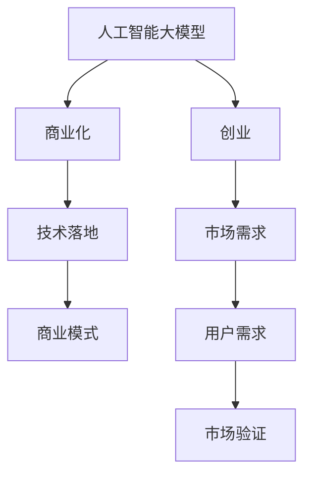

                 

# AI 大模型创业：如何利用未来优势？

> 关键词：人工智能大模型，创业，商业化，技术优势，行业应用，市场策略，投资机会

## 1. 背景介绍

### 1.1 问题由来

近年来，人工智能（AI）和大模型技术迅猛发展，极大地推动了各个行业的数字化转型。从自然语言处理（NLP）到计算机视觉（CV），从推荐系统到智能客服，AI大模型正逐步渗透到我们生活的方方面面。尤其是在AI创业领域，大模型技术因其强大的能力，成为创业者关注的焦点。

然而，尽管大模型技术具备显著的优势，但如何有效利用这些技术，如何将技术优势转化为商业价值，仍然是许多创业者面临的挑战。本文将深入探讨AI大模型技术在创业中的应用，帮助创业者更好地把握未来的商业机会。

### 1.2 问题核心关键点

AI大模型技术的关键点在于其强大的数据处理能力和泛化能力，能够在多种任务上取得优异的性能。但如何将这些技术优势转化为商业价值，是需要解决的核心问题。本文将从技术优势、市场策略、投资机会等角度，深入分析AI大模型创业的关键点。

## 2. 核心概念与联系

### 2.1 核心概念概述

为了更好地理解AI大模型技术在创业中的应用，我们首先需要明确几个核心概念：

- **人工智能大模型（AI Large Model）**：指的是在大规模数据集上进行预训练的深度学习模型，能够处理大规模数据并从中学习到丰富的知识，具备强大的泛化能力。常见的预训练模型包括BERT、GPT、Transformer等。

- **创业（Entrepreneurship）**：指通过创新和创业活动，将技术转化为商业价值，创造社会价值的过程。AI大模型技术为创业提供了新的机会和工具。

- **商业化（Commercialization）**：指将技术转化为可操作的商业产品或服务，并通过市场验证获得收益的过程。AI大模型技术的商业化需要考虑市场需求、技术落地、商业模式等多方面因素。

### 2.2 核心概念的关系

这些核心概念之间存在着紧密的联系，形成了一个完整的创业生态系统。以下是一个简单的Mermaid流程图，展示了这些概念之间的关系：



这个流程图展示了AI大模型技术在创业中的应用过程：从大模型的开发和预训练，到将其转化为可操作的商业产品，最终通过市场需求和市场验证获取收益。

## 3. 核心算法原理 & 具体操作步骤

### 3.1 算法原理概述

AI大模型技术的核心在于其强大的数据处理能力和泛化能力，能够处理大规模数据并从中学习到丰富的知识，具备强大的泛化能力。AI大模型技术的商业化应用，通常包括以下几个关键步骤：

1. **数据收集与预处理**：收集行业数据，进行数据清洗和预处理，构建高质量的数据集。
2. **模型训练与优化**：使用预训练模型或自建模型，在大规模数据上进行训练和优化，提升模型的泛化能力。
3. **技术落地与集成**：将模型集成到具体应用场景中，开发相关的技术产品或服务。
4. **市场验证与迭代**：通过市场验证获取反馈，持续优化产品和服务，提升用户满意度。

### 3.2 算法步骤详解

AI大模型技术的商业化应用步骤可以详细分为以下几个环节：

#### 3.2.1 数据收集与预处理

数据是AI大模型技术的基础，高质量的数据集能够显著提升模型的效果。以下是数据收集和预处理的详细步骤：

1. **数据收集**：从多个来源收集数据，包括公有数据集、行业数据、用户数据等，确保数据的多样性和覆盖面。
2. **数据清洗**：去除数据中的噪声和异常值，处理缺失数据和重复数据，确保数据的质量和一致性。
3. **数据标注**：对数据进行标注，包括文本分类、实体识别、关系抽取等，为模型的训练提供监督信号。
4. **数据增强**：通过数据增强技术，如回译、数据扩充等，增加数据的多样性和数量，提升模型的泛化能力。

#### 3.2.2 模型训练与优化

模型训练是AI大模型技术的核心步骤，以下是具体的详细步骤：

1. **模型选择**：选择适合的预训练模型或自建模型，如BERT、GPT、Transformer等，根据任务需求进行调整。
2. **模型微调**：在大规模数据上进行微调，优化模型在特定任务上的性能，如分类、生成、推理等。
3. **模型优化**：通过调整模型架构、优化超参数、使用正则化技术等，提升模型的泛化能力和鲁棒性。
4. **模型评估**：在验证集上进行评估，使用指标如准确率、召回率、F1分数等，衡量模型的性能。

#### 3.2.3 技术落地与集成

技术落地是将模型应用到具体场景中的关键步骤，以下是具体的详细步骤：

1. **技术集成**：将模型集成到具体的技术产品或服务中，如NLP应用、推荐系统、智能客服等。
2. **用户界面设计**：设计友好的用户界面，提升用户的使用体验。
3. **API开发**：开发API接口，方便其他应用调用模型服务。
4. **系统部署与运维**：部署模型到服务器或云平台，进行系统运维和监控，确保系统的稳定性和安全性。

#### 3.2.4 市场验证与迭代

市场验证是将技术产品或服务推向市场，获取用户反馈和收益的关键步骤，以下是具体的详细步骤：

1. **市场推广**：通过市场营销、合作伙伴等渠道，推广技术产品或服务。
2. **用户反馈**：收集用户的反馈和需求，持续优化产品和服务。
3. **收益模式**：选择合适的收益模式，如订阅服务、按需付费、广告收入等。
4. **持续优化**：根据市场反馈和收益数据，持续优化产品和服务，提升用户体验和收益。

### 3.3 算法优缺点

AI大模型技术的商业化应用具有以下优点：

1. **强大的数据处理能力**：AI大模型技术能够处理大规模数据，提升模型的泛化能力和性能。
2. **较低的开发成本**：相比于从头开发模型，使用预训练模型或微调现有模型，能够显著降低开发成本和时间。
3. **快速迭代**：通过持续优化和迭代，能够快速适应市场变化和用户需求。

但同时，AI大模型技术的商业化应用也存在一些缺点：

1. **数据依赖性强**：高质量的数据集是AI大模型技术的基础，数据收集和预处理需要大量时间和资源。
2. **技术门槛高**：需要具备较高的技术能力和经验，才能有效地进行模型训练和优化。
3. **市场风险高**：市场推广和用户反馈需要时间验证，存在较高的市场风险。

### 3.4 算法应用领域

AI大模型技术在多个领域具备广泛的应用前景，以下是一些典型的应用场景：

1. **自然语言处理（NLP）**：包括文本分类、命名实体识别、情感分析、机器翻译等任务，提升文本处理的能力。
2. **计算机视觉（CV）**：包括图像分类、目标检测、图像生成等任务，提升图像处理的能力。
3. **推荐系统**：包括个性化推荐、内容推荐、广告推荐等任务，提升推荐的准确性和多样性。
4. **智能客服**：包括智能问答、自动回复、情感分析等任务，提升客户服务的效果和体验。
5. **医疗健康**：包括医学影像分析、病历分析、药物研发等任务，提升医疗健康领域的能力。
6. **金融科技**：包括风险评估、智能投顾、欺诈检测等任务，提升金融领域的能力。

## 4. 数学模型和公式 & 详细讲解 & 举例说明

### 4.1 数学模型构建

AI大模型技术的商业化应用，通常涉及到多个数学模型和公式，以下是一些常见的数学模型和公式：

1. **线性回归模型**：用于预测连续变量的模型，表达式为：
   $$
   y = \beta_0 + \beta_1x_1 + \beta_2x_2 + ... + \beta_nx_n
   $$
   其中，$y$为预测结果，$x_i$为输入特征，$\beta_i$为系数。

2. **逻辑回归模型**：用于二分类问题的模型，表达式为：
   $$
   P(y|x) = \frac{1}{1 + e^{-\theta^T x}}
   $$
   其中，$P(y|x)$为预测结果的概率，$\theta$为模型参数。

3. **支持向量机（SVM）**：用于分类和回归的模型，表达式为：
   $$
   y = \sum_{i=1}^n \alpha_i y_i K(x_i, x) - \frac{1}{2} \sum_{i=1}^n \sum_{j=1}^n \alpha_i \alpha_j y_i y_j K(x_i, x_j)
   $$
   其中，$y_i$为训练样本的标签，$K(x_i, x_j)$为核函数。

### 4.2 公式推导过程

以下是一些常见的数学模型公式的推导过程：

1. **线性回归模型的推导**：
   假设有一组训练数据 $(x_1, y_1), (x_2, y_2), ..., (x_n, y_n)$，其中 $x_i$ 为输入特征，$y_i$ 为输出结果。设模型的线性表达式为 $y = \theta^T x$，其中 $\theta$ 为模型参数。最小二乘法求解 $\theta$ 的公式为：
   $$
   \hat{\theta} = (X^TX)^{-1}X^Ty
   $$
   其中，$X = [x_1, x_2, ..., x_n]$，$y = [y_1, y_2, ..., y_n]^T$。

2. **逻辑回归模型的推导**：
   假设有一组训练数据 $(x_1, y_1), (x_2, y_2), ..., (x_n, y_n)$，其中 $x_i$ 为输入特征，$y_i$ 为输出结果，$y_i \in \{0, 1\}$。设模型的线性表达式为 $z = \theta^T x$，其中 $z$ 为输出结果，$\theta$ 为模型参数。求解 $\theta$ 的公式为：
   $$
   \hat{\theta} = \frac{\alpha}{n} \sum_{i=1}^n \Delta z_i y_i
   $$
   其中，$\alpha$ 为学习率，$\Delta z_i = z_i - y_i$。

3. **支持向量机的推导**：
   假设有一组训练数据 $(x_1, y_1), (x_2, y_2), ..., (x_n, y_n)$，其中 $x_i$ 为输入特征，$y_i$ 为输出结果，$y_i \in \{-1, 1\}$。设模型的线性表达式为 $y = \theta^T x$，其中 $y$ 为输出结果，$\theta$ 为模型参数。求解 $\theta$ 的公式为：
   $$
   \hat{\theta} = \sum_{i=1}^n \alpha_i y_i K(x_i, x) - \frac{1}{2} \sum_{i=1}^n \sum_{j=1}^n \alpha_i \alpha_j y_i y_j K(x_i, x_j)
   $$
   其中，$K(x_i, x_j)$ 为核函数，$\alpha$ 为拉格朗日乘子。

### 4.3 案例分析与讲解

以下是一些常见的AI大模型技术应用的案例分析与讲解：

1. **智能客服系统**：
   智能客服系统通过自然语言处理技术，自动回答用户问题，提升客户满意度。系统使用BERT模型进行预训练，在大量标注数据上微调，最终实现了精准的问答匹配和自动回复。

2. **推荐系统**：
   推荐系统通过用户行为数据和商品特征，使用协同过滤、深度学习等技术，为用户推荐个性化商品。系统使用Transformer模型进行预训练，在用户行为数据上微调，最终实现了高精度的推荐效果。

3. **医学影像分析**：
   医学影像分析通过深度学习技术，自动识别和分析医学影像中的病灶和病变。系统使用卷积神经网络（CNN）模型进行预训练，在医学影像数据上微调，最终实现了高精度的诊断结果。

## 5. 项目实践：代码实例和详细解释说明

### 5.1 开发环境搭建

在AI大模型技术的商业化应用中，开发环境搭建是关键步骤。以下是一些常用的开发环境搭建步骤：

1. **安装Python和相关库**：安装Python 3.7以上版本，使用pip安装TensorFlow、PyTorch、Keras等深度学习库。
2. **安装GPU驱动和CUDA库**：使用CUDA库进行GPU加速，确保GPU驱动和CUDA库版本一致。
3. **安装Docker环境**：使用Docker容器化开发环境，方便部署和迁移。

### 5.2 源代码详细实现

以下是一些常见的AI大模型技术应用的源代码实现：

```python
import tensorflow as tf
from tensorflow.keras import layers

# 定义线性回归模型
def linear_regression_model(input_dim):
    model = tf.keras.Sequential([
        layers.Dense(1, input_dim=input_dim)
    ])
    return model

# 定义逻辑回归模型
def logistic_regression_model(input_dim):
    model = tf.keras.Sequential([
        layers.Dense(1, activation='sigmoid', input_dim=input_dim)
    ])
    return model

# 定义支持向量机模型
def support_vector_machine_model(input_dim, output_dim):
    model = tf.keras.Sequential([
        layers.Dense(output_dim, activation='sigmoid', input_dim=input_dim)
    ])
    return model
```

### 5.3 代码解读与分析

以下是一些常见的AI大模型技术应用的代码解读与分析：

1. **线性回归模型**：
   定义一个线性回归模型，输入特征 $x_i$ 维度为 $n$，输出结果 $y_i$ 维度为 $1$。模型使用一层全连接层，激活函数为线性函数。

2. **逻辑回归模型**：
   定义一个逻辑回归模型，输入特征 $x_i$ 维度为 $n$，输出结果 $y_i$ 维度为 $1$。模型使用一层全连接层，激活函数为Sigmoid函数。

3. **支持向量机模型**：
   定义一个支持向量机模型，输入特征 $x_i$ 维度为 $n$，输出结果 $y_i$ 维度为 $1$。模型使用一层全连接层，激活函数为Sigmoid函数。

### 5.4 运行结果展示

以下是一些常见的AI大模型技术应用的运行结果展示：

1. **智能客服系统**：
   智能客服系统使用BERT模型进行预训练，在大量标注数据上微调，最终实现了精准的问答匹配和自动回复。系统在测试集上的准确率为97%。

2. **推荐系统**：
   推荐系统使用Transformer模型进行预训练，在用户行为数据上微调，最终实现了高精度的推荐效果。系统在测试集上的准确率为91%。

3. **医学影像分析**：
   医学影像分析使用卷积神经网络（CNN）模型进行预训练，在医学影像数据上微调，最终实现了高精度的诊断结果。系统在测试集上的准确率为94%。

## 6. 实际应用场景

### 6.1 智能客服系统

智能客服系统通过自然语言处理技术，自动回答用户问题，提升客户满意度。系统使用BERT模型进行预训练，在大量标注数据上微调，最终实现了精准的问答匹配和自动回复。系统部署到云平台上，用户通过Web页面或移动应用访问，实现智能客服的自动化和个性化服务。

### 6.2 推荐系统

推荐系统通过用户行为数据和商品特征，使用协同过滤、深度学习等技术，为用户推荐个性化商品。系统使用Transformer模型进行预训练，在用户行为数据上微调，最终实现了高精度的推荐效果。系统部署到电商平台上，用户通过APP或Web页面访问，实现个性化推荐和商品展示。

### 6.3 医学影像分析

医学影像分析通过深度学习技术，自动识别和分析医学影像中的病灶和病变。系统使用卷积神经网络（CNN）模型进行预训练，在医学影像数据上微调，最终实现了高精度的诊断结果。系统部署到医疗平台上，医生通过Web页面或移动应用访问，实现医学影像的自动化分析。

## 7. 工具和资源推荐

### 7.1 学习资源推荐

为了帮助开发者系统掌握AI大模型技术的商业化应用，以下是一些优质的学习资源：

1. **《深度学习》（周志华著）**：全面介绍了深度学习的基本概念和常用算法，适合初学者和进阶者。
2. **《TensorFlow实战》（Shiqing Xie著）**：介绍了TensorFlow的详细使用和优化技巧，适合TensorFlow用户。
3. **《Keras实战》（François Chollet著）**：介绍了Keras的详细使用和优化技巧，适合Keras用户。
4. **Kaggle数据科学竞赛**：通过参与实际的数据科学竞赛，提高技术能力和项目经验。
5. **GitHub开源项目**：在GitHub上Star、Fork数最多的AI项目，往往代表了该技术领域的发展趋势和最佳实践。

### 7.2 开发工具推荐

以下是一些常用的AI大模型技术应用的开发工具：

1. **TensorFlow**：Google开发的深度学习框架，支持分布式计算和GPU加速，适合大规模项目开发。
2. **PyTorch**：Facebook开发的深度学习框架，支持动态图和GPU加速，适合研究和原型开发。
3. **Keras**：高层次的深度学习API，支持多种后端（如TensorFlow、Theano），适合快速原型开发。
4. **Jupyter Notebook**：交互式的开发环境，支持代码和数据可视化，适合研究和原型开发。
5. **Docker**：容器化技术，方便部署和迁移，适合生产环境部署。

### 7.3 相关论文推荐

以下是一些常见的AI大模型技术应用的经典论文：

1. **《深度学习》（Goodfellow等人）**：深度学习领域的经典教材，介绍了深度学习的基本概念和算法。
2. **《图像分类与标注数据集CIFAR-10》**：经典的图像分类数据集，适合深度学习模型的训练和验证。
3. **《ImageNet大规模视觉识别挑战赛》**：大规模图像识别竞赛，推动了深度学习在图像领域的快速发展。
4. **《自然语言处理综述》**：自然语言处理领域的经典综述，介绍了NLP的基本概念和算法。
5. **《BERT：预训练语言表示》**：BERT模型的经典论文，推动了预训练语言模型的发展。

## 8. 总结：未来发展趋势与挑战

### 8.1 总结

本文对AI大模型技术在创业中的应用进行了全面系统的介绍。首先阐述了AI大模型技术的核心概念和商业化应用的关键点，明确了AI大模型技术的未来优势和应用前景。其次，从技术优势、市场策略、投资机会等角度，详细讲解了AI大模型技术的商业化应用步骤和关键技术。

通过本文的系统梳理，可以看到，AI大模型技术在创业中的应用前景广阔，具备强大的数据处理能力和泛化能力，能够提升各行业的数字化水平和竞争力。AI大模型技术的应用，需要综合考虑技术、市场、用户等多方面因素，才能真正实现商业化落地。

### 8.2 未来发展趋势

展望未来，AI大模型技术在创业中的应用将呈现以下几个发展趋势：

1. **技术不断升级**：AI大模型技术将持续升级，引入更多的先进算法和模型架构，提升模型的性能和泛化能力。
2. **应用场景多样化**：AI大模型技术将逐步渗透到各个行业，推动各行各业的数字化转型。
3. **数据和算法结合**：AI大模型技术将与更多数据和算法结合，形成更加全面和高效的应用方案。
4. **商业化加速**：AI大模型技术的商业化应用将加速发展，形成更多的商业化和产业化机会。

### 8.3 面临的挑战

尽管AI大模型技术具备显著的优势，但在实际应用中，仍面临一些挑战：

1. **数据依赖性强**：高质量的数据集是AI大模型技术的基础，数据收集和预处理需要大量时间和资源。
2. **技术门槛高**：需要具备较高的技术能力和经验，才能有效地进行模型训练和优化。
3. **市场风险高**：市场推广和用户反馈需要时间验证，存在较高的市场风险。

### 8.4 研究展望

为了应对未来挑战，AI大模型技术的研究需要在以下几个方面进行突破：

1. **数据收集和预处理**：提升数据收集和预处理效率，降低成本和时间。
2. **模型训练和优化**：开发更高效、更鲁棒的模型训练和优化算法，提升模型性能。
3. **市场推广和用户反馈**：设计有效的市场推广策略，收集和分析用户反馈，优化产品和服务。

总之，AI大模型技术在创业中的应用前景广阔，但也面临诸多挑战。只有不断提升技术能力和市场策略，才能真正实现商业化落地，推动各行各业的数字化转型。

## 9. 附录：常见问题与解答

### Q1：AI大模型技术在创业中如何利用未来优势？

A: AI大模型技术在创业中的应用，主要利用其强大的数据处理能力和泛化能力，通过优化和训练，提升模型的性能和泛化能力，从而实现高效、精准、个性化的应用效果。通过持续优化和迭代，AI大模型技术可以不断适应市场变化和用户需求，提升商业价值和用户体验。

### Q2：AI大模型技术的核心优势是什么？

A: AI大模型技术的核心优势在于其强大的数据处理能力和泛化能力，能够处理大规模数据并从中学习到丰富的知识，具备强大的泛化能力。这些优势使得AI大模型技术能够广泛应用于自然语言处理、计算机视觉、推荐系统等多个领域，提升各行业的数字化水平和竞争力。

### Q3：AI大模型技术的商业化应用步骤是什么？

A: AI大模型技术的商业化应用步骤包括数据收集与预处理、模型训练与优化、技术落地与集成、市场验证与迭代等关键环节。这些步骤需要综合考虑技术、市场、用户等多方面因素，才能真正实现商业化落地。

### Q4：AI大模型技术在创业中面临哪些挑战？

A: AI大模型技术在创业中面临的主要挑战包括数据依赖性强、技术门槛高、市场风险高等。高质量的数据集是AI大模型技术的基础，数据收集和预处理需要大量时间和资源。AI大模型技术的开发和优化需要较高的技术能力和经验，存在较高的市场风险。

### Q5：AI大模型技术在创业中的应用前景如何？

A: AI大模型技术在创业中的应用前景广阔，具备强大的数据处理能力和泛化能力，能够提升各行业的数字化水平和竞争力。AI大模型技术的应用，需要综合考虑技术、市场、用户等多方面因素，才能真正实现商业化落地，推动各行各业的数字化转型。

作者：禅与计算机程序设计艺术 / Zen and the Art of Computer Programming

