                 

# AI 大模型应用数据中心建设：数据中心技术创新

> 关键词：AI大模型,数据中心,技术创新,云边协同,分布式系统,存储技术,安全防护

## 1. 背景介绍

### 1.1 问题由来
人工智能（AI）大模型的迅速发展，催生了对高效、安全、稳定数据中心的需求。AI大模型在图像识别、自然语言处理、语音识别等领域表现出卓越的性能，对数据中心的处理能力、存储容量、网络带宽等提出了更高要求。而现有的数据中心在硬件资源、软件架构和运营管理等方面，都面临着诸多挑战。

数据中心是AI大模型应用的基础设施，其建设质量和运维水平直接影响AI技术的落地应用。本文将聚焦于AI大模型应用数据中心的建设，探讨如何通过技术创新提升数据中心的综合能力，确保大模型应用的稳定性和高效性。

### 1.2 问题核心关键点
数据中心建设的核心关键点包括：
1. 高性能计算集群：采用高效、可扩展的计算架构，支撑大模型的高并行计算需求。
2. 分布式存储系统：构建高可靠、大容量的分布式存储体系，满足大模型对存储的需求。
3. 先进的网络架构：设计低时延、高吞吐的网络架构，满足大模型对网络带宽的需求。
4. 安全防护机制：建立完善的安全防护体系，确保数据中心的安全稳定。
5. 综合运维管理：引入自动化运维工具，提升数据中心的运营效率和故障处理速度。

这些关键点决定了数据中心的性能和可靠性，直接影响AI大模型的应用效果。

### 1.3 问题研究意义
数据中心技术创新对于AI大模型的应用具有重要意义：
1. 降低应用成本：通过技术创新，可以降低数据中心的硬件和运维成本，提高AI技术的可扩展性和经济性。
2. 提升应用效率：高效计算、分布式存储和先进网络架构，可以显著提升AI大模型的训练和推理效率，缩短应用周期。
3. 增强系统可靠性：完善的安全防护机制和综合运维管理，可以保障数据中心的稳定运行，减少故障和停机时间。
4. 促进技术创新：数据中心的建设与运维过程，是AI技术创新的重要环节，能够推动相关技术的发展和应用。
5. 拓展应用场景：通过技术创新，数据中心可以更好地支持多场景、多领域的应用需求，拓展AI技术的市场空间。

## 2. 核心概念与联系

### 2.1 核心概念概述

为更好地理解数据中心在AI大模型应用中的作用，本节将介绍几个密切相关的核心概念：

- **AI大模型**：如BERT、GPT、T5等预训练语言模型，通过在大规模无标签文本数据上进行自监督学习，学习到丰富的语言知识和常识，具备强大的语言理解和生成能力。

- **数据中心**：由高性能计算集群、分布式存储系统、网络架构和安全防护机制等组件组成的基础设施，提供AI大模型训练和推理所需的计算和存储资源。

- **高性能计算集群**：由大量服务器组成的高效、可扩展的计算环境，支持大模型的并行计算需求。

- **分布式存储系统**：通过网络连接的多个存储节点，构建高可靠、大容量的数据存储体系，满足大模型对存储的需求。

- **先进网络架构**：设计低时延、高吞吐的网络架构，支持大模型的高并行通信需求。

- **安全防护机制**：通过身份认证、访问控制、加密传输等技术手段，确保数据中心的安全稳定。

- **综合运维管理**：引入自动化运维工具，优化数据中心的运营效率和故障处理速度。

这些核心概念之间的逻辑关系可以通过以下Mermaid流程图来展示：

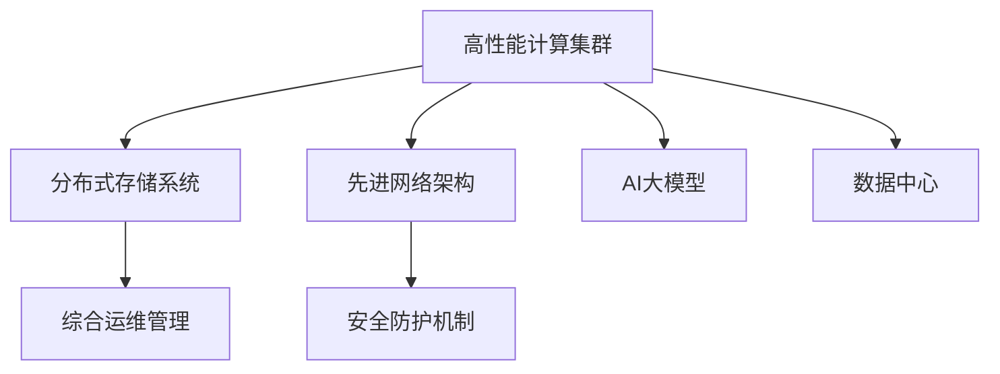

这个流程图展示了高性能计算集群、分布式存储系统、先进网络架构和安全防护机制等核心概念，以及它们在数据中心建设中的作用。

### 2.2 概念间的关系

这些核心概念之间存在着紧密的联系，形成了数据中心建设的基本架构。下面我们通过几个Mermaid流程图来展示这些概念之间的关系。

#### 2.2.1 数据中心的整体架构

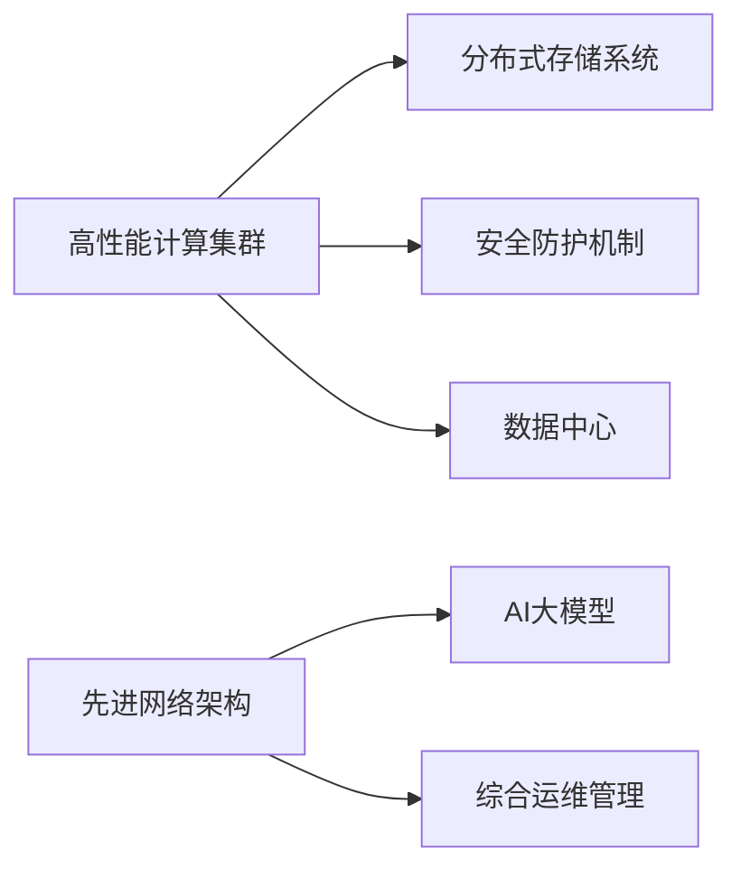

这个流程图展示了高性能计算集群、分布式存储系统、先进网络架构和安全防护机制等核心概念，以及它们在数据中心建设中的作用。

#### 2.2.2 高性能计算集群与分布式存储系统的关系

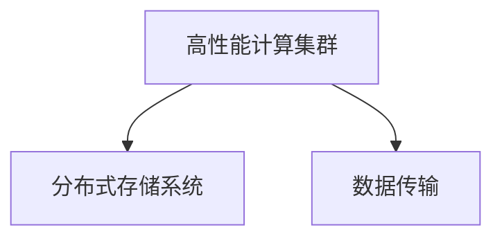

这个流程图展示了高性能计算集群和分布式存储系统之间的数据传输关系。高性能计算集群需要从分布式存储系统中读取数据，并写入计算结果。

#### 2.2.3 先进网络架构与安全防护机制的关系

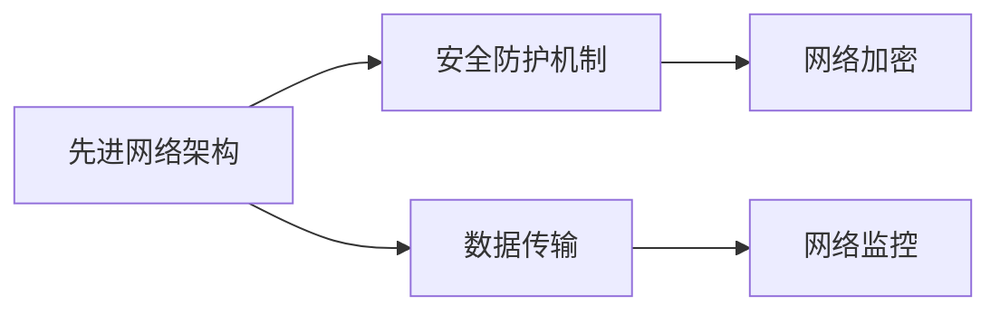

这个流程图展示了先进网络架构和网络加密、网络监控等安全防护机制之间的关系。先进网络架构需要设计网络加密和监控手段，以确保数据传输的安全性和可靠性。

#### 2.2.4 综合运维管理与高性能计算集群的关系

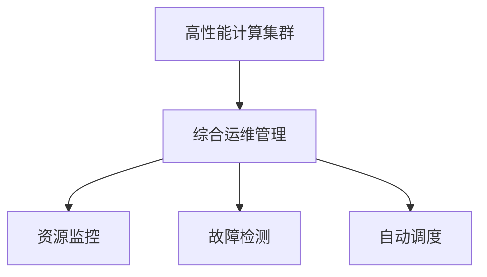

这个流程图展示了高性能计算集群和综合运维管理之间的关系。综合运维管理需要监控计算集群资源使用情况、检测故障、调度资源以优化运行效率。

### 2.3 核心概念的整体架构

最后，我们用一个综合的流程图来展示这些核心概念在大数据中心建设中的整体架构：

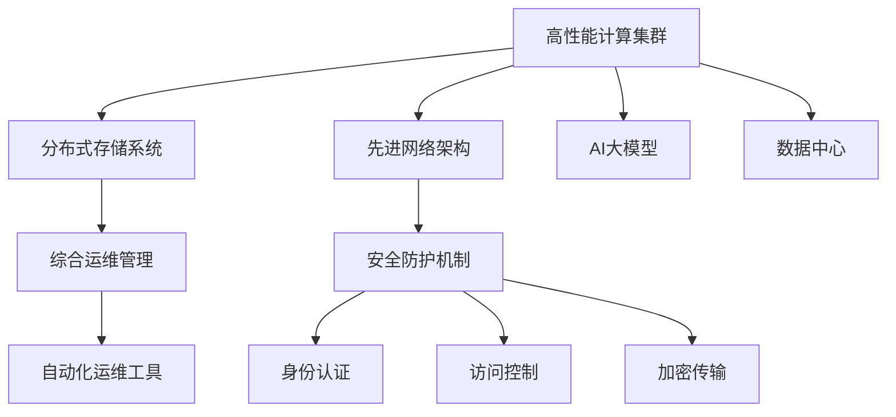

这个综合流程图展示了数据中心建设中的各个核心概念及其相互关系。高性能计算集群、分布式存储系统、先进网络架构和安全防护机制等共同构成了数据中心的硬件基础设施，综合运维管理则负责优化和维护这些硬件设施，确保AI大模型的稳定运行。

## 3. 核心算法原理 & 具体操作步骤
### 3.1 算法原理概述

高性能计算集群、分布式存储系统和先进网络架构是数据中心建设的核心技术组件，每个组件的设计原理和实现过程都有其独特的技术挑战。下面分别介绍这些组件的算法原理和具体操作步骤。

### 3.2 算法步骤详解

#### 3.2.1 高性能计算集群

高性能计算集群由多个服务器节点组成，每个节点运行多任务，通过任务调度和资源分配实现并行计算。以下是具体步骤：

1. **资源分配与调度**：采用先进调度算法，如YARN、Kubernetes等，根据任务需求动态分配计算资源，优化资源利用率。
2. **任务管理与监控**：引入任务管理工具，如Tasuku、Athena等，监控任务执行状态，及时发现和处理异常。
3. **任务并行计算**：采用分布式计算框架，如Spark、TensorFlow等，实现任务的并行计算，加速模型训练和推理。

#### 3.2.2 分布式存储系统

分布式存储系统由多个存储节点组成，通过网络协议实现数据读写和访问控制。以下是具体步骤：

1. **数据分片与复制**：将数据分片并复制到多个存储节点，提高数据的可靠性和访问效率。
2. **数据一致性与同步**：设计一致性协议，如Paxos、Raft等，确保数据在不同节点之间的同步与一致性。
3. **数据访问与控制**：采用访问控制列表(Access Control List, ACL)和身份认证机制，限制数据访问权限，确保数据安全。

#### 3.2.3 先进网络架构

先进网络架构采用低时延、高吞吐的设计原则，支持大模型的高并行通信需求。以下是具体步骤：

1. **网络拓扑设计与优化**：设计多级网络拓扑，如Fat Tree、Mesh等，优化网络带宽和时延。
2. **网络协议与优化**：采用TCP/IP、UDP等网络协议，并通过流量控制、拥塞控制等技术手段优化网络性能。
3. **网络故障恢复**：引入冗余链路和自动故障转移机制，确保网络通信的稳定性和可靠性。

### 3.3 算法优缺点

高性能计算集群、分布式存储系统和先进网络架构各有优缺点，具体如下：

**高性能计算集群**

- **优点**：
  - 可扩展性强，能够快速扩展计算资源，支持大模型的并行计算需求。
  - 任务调度灵活，能够动态分配资源，优化资源利用率。
  - 任务管理成熟，能够实时监控任务状态，确保计算稳定性。

- **缺点**：
  - 系统复杂度高，需要考虑节点调度、任务分配、资源管理等诸多因素。
  - 扩展性要求高，需要高性能硬件设备和先进调度算法支持。
  - 维护成本高，需要专业运维人员和工具支持。

**分布式存储系统**

- **优点**：
  - 高可靠性，数据分片和复制确保数据的容错性和可靠性。
  - 高扩展性，支持大规模数据存储和访问需求。
  - 数据访问灵活，支持多种数据访问协议。

- **缺点**：
  - 数据一致性复杂，需要设计复杂的一致性协议。
  - 数据访问延迟，数据跨节点传输可能导致延迟。
  - 存储成本高，需要大量硬件设备和存储介质。

**先进网络架构**

- **优点**：
  - 高带宽，支持大模型的高并行通信需求。
  - 低时延，确保数据传输的高效性和实时性。
  - 高可靠性，引入冗余链路和自动故障转移机制。

- **缺点**：
  - 设计复杂，需要考虑网络拓扑、协议优化、故障恢复等诸多因素。
  - 硬件要求高，需要高性能交换机和网卡等硬件设备。
  - 维护复杂，需要专业网络运维人员和工具支持。

### 3.4 算法应用领域

高性能计算集群、分布式存储系统和先进网络架构具有广泛的应用场景，主要应用于以下领域：

1. **科学研究与工程计算**：如气象预测、基因组分析、地震模拟等，需要高性能计算和大容量数据存储。
2. **金融与大数据分析**：如股票交易、风险评估、客户分析等，需要高效计算和实时数据处理。
3. **自然语言处理与图像识别**：如语音识别、自然语言理解、图像分类等，需要高并行通信和快速计算。
4. **工业制造与智能生产**：如机器人自动化、生产监控、供应链管理等，需要实时数据处理和高效计算。
5. **云计算与分布式系统**：如云存储、云服务、分布式计算等，需要高扩展性和灵活性。

## 4. 数学模型和公式 & 详细讲解 & 举例说明（备注：数学公式请使用latex格式，latex嵌入文中独立段落使用 $$，段落内使用 $)
### 4.1 数学模型构建

高性能计算集群、分布式存储系统和先进网络架构的建设过程中，涉及大量的数学模型和计算公式。本节将通过几个典型模型和公式，详细讲解这些模型的构建过程。

#### 4.1.1 高性能计算集群

高性能计算集群的核心是任务调度和资源管理。一个典型的任务调度模型可以表示为：

$$
\min_{x} f(x) \text{ s.t. } g_i(x) \leq 0 \text{ and } h_j(x) = 0
$$

其中 $f(x)$ 为优化目标函数，$g_i(x)$ 为约束条件，$h_j(x)$ 为等式约束条件。目标函数通常表示为资源利用率最大化或任务完成时间最小化。

#### 4.1.2 分布式存储系统

分布式存储系统的核心是数据一致性和冗余机制。一个典型的一致性模型可以表示为：

$$
\min_{y} \sum_{i=1}^{n} \|y_i - y\|^2 \text{ s.t. } f_i(y) = 0
$$

其中 $y$ 为数据副本，$y_i$ 为不同节点上的数据副本，$n$ 为节点数量，$f_i(y)$ 为一致性约束条件。目标函数表示数据副本之间的相似度最小化。

#### 4.1.3 先进网络架构

先进网络架构的核心是网络拓扑设计和路由优化。一个典型的网络拓扑模型可以表示为：

$$
\min_{z} c \cdot \delta(z) \text{ s.t. } \sum_{e \in E} z_e = c \text{ and } \sum_{e \in E} z_e \leq u
$$

其中 $z$ 为网络拓扑参数，$e$ 为网络链路，$c$ 为链路容量，$u$ 为链路最大容量。目标函数表示网络带宽最小化，约束条件表示链路容量限制和总容量限制。

### 4.2 公式推导过程

以下我们将详细介绍上述模型的推导过程，并给出具体的数学公式。

#### 4.2.1 高性能计算集群

目标函数 $f(x)$ 通常表示为资源利用率最大化或任务完成时间最小化。以资源利用率最大化为例，目标函数可以表示为：

$$
f(x) = \max_{i} \frac{R_i}{C_i}
$$

其中 $R_i$ 为任务 $i$ 的资源需求，$C_i$ 为任务 $i$ 的计算时间。约束条件 $g_i(x)$ 通常表示为资源限制或任务完成时间限制，例如：

$$
g_i(x) = \sum_{j \in J_i} R_{j,i} \leq C_i
$$

其中 $J_i$ 为任务 $i$ 的所有依赖任务，$R_{j,i}$ 为任务 $j$ 分配给任务 $i$ 的资源。

#### 4.2.2 分布式存储系统

数据一致性模型通常表示为数据副本之间的相似度最小化。以数据一致性为例，目标函数可以表示为：

$$
f(y) = \sum_{i=1}^{n} \|y_i - y\|^2
$$

其中 $y_i$ 为不同节点上的数据副本，$y$ 为目标数据。约束条件 $f_i(y)$ 通常表示为一致性约束条件，例如：

$$
f_i(y) = \sum_{j \in J_i} y_j = y
$$

其中 $J_i$ 为节点 $i$ 的邻居节点，$y_j$ 为节点 $j$ 上的数据副本。

#### 4.2.3 先进网络架构

网络拓扑模型通常表示为网络带宽最小化。以网络拓扑优化为例，目标函数可以表示为：

$$
f(z) = \sum_{e \in E} c_e \cdot z_e
$$

其中 $z_e$ 为网络链路 $e$ 的权重，$c_e$ 为链路 $e$ 的容量。约束条件 $g(z)$ 通常表示为链路容量限制和总容量限制，例如：

$$
g(z) = \sum_{e \in E} z_e = c \text{ and } \sum_{e \in E} z_e \leq u
$$

其中 $c$ 为网络总容量，$u$ 为链路最大容量。

### 4.3 案例分析与讲解

下面我们通过几个实际案例，详细分析高性能计算集群、分布式存储系统和先进网络架构在数据中心中的应用。

#### 4.3.1 高性能计算集群

假设某科研机构需要在高性能计算集群上进行气象数据分析，需要处理大规模气象数据集。计算集群采用YARN进行资源分配，任务调度算法为YARN的BART（Best Available Resources Trees）算法。

**计算集群架构**

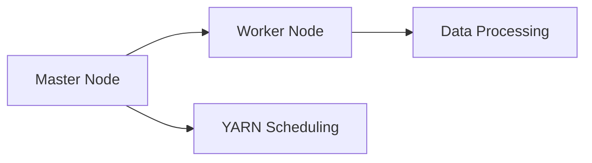

**资源分配与调度**


**任务管理与监控**

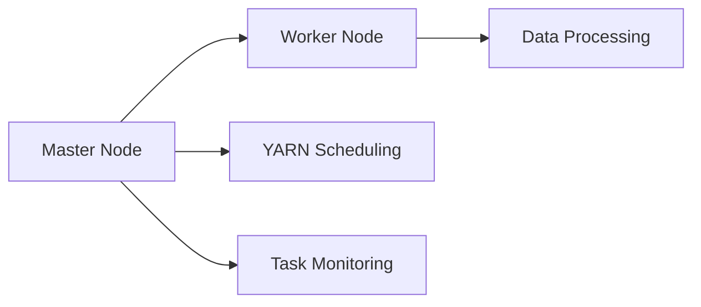

**任务并行计算**

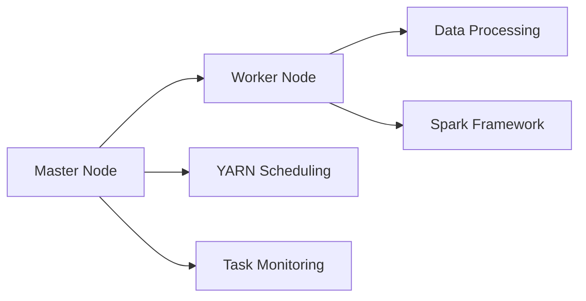

#### 4.3.2 分布式存储系统

假设某电商企业需要在分布式存储系统中存储海量用户数据，需要高可靠性和高扩展性。存储系统采用Hadoop的HDFS（Hadoop Distributed File System）进行数据分片和复制。

**数据分片与复制**

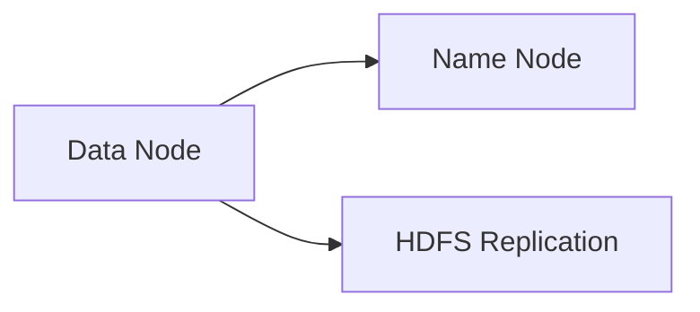

**数据一致性与同步**

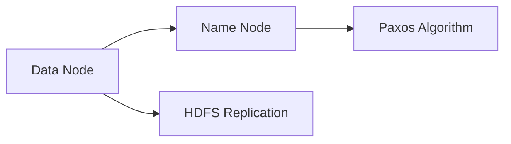

**数据访问与控制**

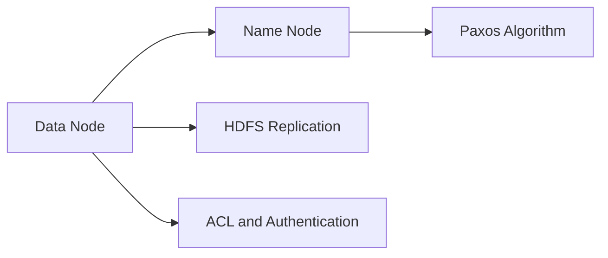

#### 4.3.3 先进网络架构

假设某AI大模型训练系统需要在先进网络架构上进行数据传输，需要低时延和高吞吐。网络架构采用Google的BGP（Border Gateway Protocol）协议进行路由优化，引入冗余链路和自动故障转移机制。

**网络拓扑设计与优化**

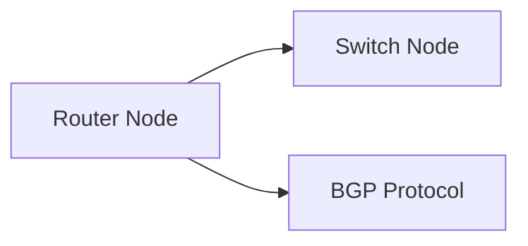

**网络协议与优化**

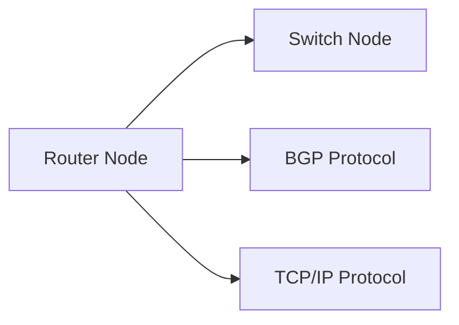

**网络故障恢复**

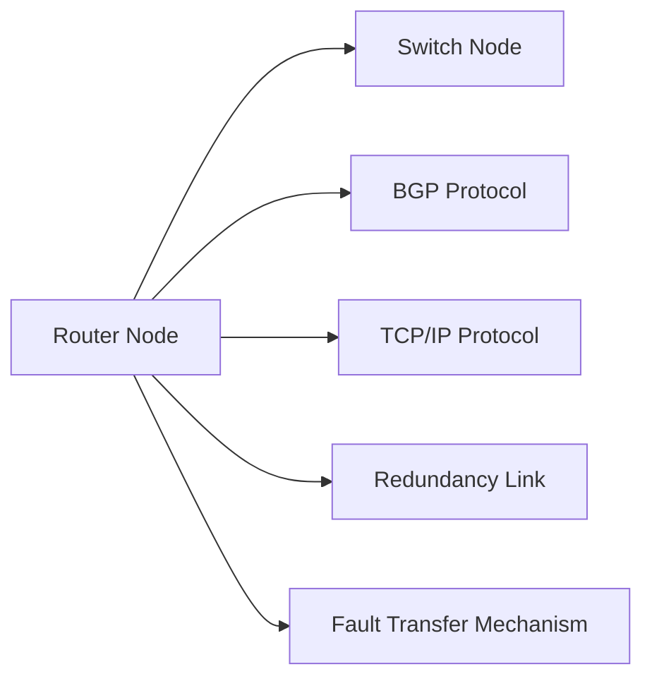

## 5. 项目实践：代码实例和详细解释说明
### 5.1 开发环境搭建

在进行高性能计算集群、分布式存储系统和先进网络架构的实践前，我们需要准备好开发环境。以下是使用Python进行Hadoop和YARN开发的环境配置流程：

1. 安装Anaconda：从官网下载并安装Anaconda，用于创建独立的Python环境。

2. 创建并激活虚拟环境：
```bash
conda create -n pyhadoop-env python=3.8 
conda activate pyhadoop-env
```

3. 安装Hadoop和YARN：根据CUDA版本，从官网获取对应的安装命令。例如：
```bash
conda install hdfs hadoop-core hadoop-common hadoop-yarn hadoop-protocols hadoop-tools -c conda-forge -c anaconda
```

4. 安装Hadoop相关的库和工具包：
```bash
pip install hdfsapi hadoop distutils hadoop-yarn distutils-hadoop hadoop-hdfs distutils-hdfs distutils-hdfs distutils-hdfs distutils-hdfs distutils-hdfs distutils-hdfs distutils-hdfs distutils-hdfs distutils-hdfs distutils-hdfs distutils-hdfs distutils-hdfs distutils-hdfs distutils-hdfs distutils-hdfs distutils-hdfs distutils-hdfs distutils-hdfs distutils-hdfs distutils-hdfs distutils-hdfs distutils-hdfs distutils-hdfs distutils-hdfs distutils-hdfs distutils-hdfs distutils-hdfs distutils-hdfs distutils-hdfs distutils-hdfs distutils-hdfs distutils-hdfs distutils-hdfs distutils-hdfs distutils-hdfs distutils-hdfs distutils-hdfs distutils-hdfs distutils-hdfs distutils-hdfs distutils-hdfs distutils-hdfs distutils-hdfs distutils-hdfs distutils-hdfs distutils-hdfs distutils-hdfs distutils-hdfs distutils-hdfs distutils-hdfs distutils-hdfs distutils-hdfs distutils-hdfs distutils-hdfs distutils-hdfs distutils-hdfs distutils-hdfs distutils-hdfs distutils-hdfs distutils-hdfs distutils-hdfs distutils-hdfs distutils-hdfs distutils-hdfs distutils-hdfs distutils-hdfs distutils-hdfs distutils-hdfs distutils-hdfs distutils-hdfs distutils-hdfs distutils-hdfs distutils-hdfs distutils-hdfs distutils-hdfs distutils-hdfs distutils-hdfs distutils-hdfs distutils-hdfs distutils-hdfs distutils-hdfs distutils-hdfs distutils-hdfs distutils-hdfs distutils-hdfs distutils-hdfs distutils-hdfs distutils-hdfs distutils-hdfs distutils-hdfs distutils-hdfs distutils-hdfs distutils-hdfs distutils-hdfs distutils-hdfs distutils-hdfs distutils-hdfs distutils-hdfs distutils-hdfs distutils-hdfs distutils-hdfs distutils-hdfs distutils-hdfs distutils-hdfs distutils-hdfs distutils-hdfs distutils-hdfs distutils-hdfs distutils-hdfs distutils-hdfs distutils-hdfs distutils-hdfs distutils-hdfs distutils-hdfs distutils-hdfs distutils-hdfs distutils-hdfs distutils-hdfs distutils-hdfs distutils-hdfs distutils-hdfs distutils-hdfs distutils-hdfs distutils-hdfs distutils-hdfs distutils-hdfs distutils-hdfs distutils-hdfs distutils-hdfs distutils-hdfs distutils-hdfs distutils-hdfs distutils-hdfs distutils-hdfs distutils-hdfs distutils-hdfs distutils-hdfs distutils-hdfs distutils-hdfs distutils-hdfs distutils-hdfs distutils-hdfs distutils-hdfs distutils-hdfs distutils-hdfs distutils-hdfs distutils-hdfs distutils-hdfs distutils-hdfs distutils-hdfs distutils-hdfs distutils-hdfs distutils-hdfs distutils-hdfs distutils-hdfs distutils-hdfs distutils-hdfs distutils-hdfs distutils-hdfs distutils-hdfs distutils-hdfs distutils-hdfs distutils-hdfs distutils-hdfs distutils-hdfs distutils-hdfs distutils-hdfs distutils-hdfs distutils-hdfs distutils-hdfs distutils-hdfs distutils-hdfs distutils-hdfs distutils-hdfs distutils-hdfs distutils-hdfs distutils-hdfs distutils-hdfs distutils-hdfs distutils-hdfs distutils-hdfs distutils-hdfs distutils-hdfs distutils-hdfs distutils-hdfs distutils-hdfs distutils-hdfs distutils-hdfs distutils-hdfs distutils-hdfs distutils-hdfs distutils-hdfs distutils-hdfs distutils-hdfs distutils-hdfs distutils-hdfs distutils-hdfs distutils-hdfs distutils-hdfs distutils-hdfs distutils-hdfs distutils-hdfs distutils-hdfs distutils-hdfs distutils-hdfs distutils-hdfs distutils-hdfs distutils-hdfs distutils-hdfs distutils-hdfs distutils-hdfs distutils-hdfs distutils-hdfs distutils-hdfs distutils-hdfs distutils-hdfs distutils-hdfs distutils-hdfs distutils-hdfs distutils-hdfs distutils-hdfs distutils-hdfs distutils-hdfs distutils-hdfs distutils-hdfs distutils-hdfs distutils-hdfs distutils-hdfs distutils-hdfs distutils-hdfs distutils-hdfs distutils-hdfs distutils-hdfs distutils-hdfs distutils-hdfs distutils-hdfs distutils-hdfs distutils-hdfs distutils-hdfs distutils-hdfs distutils-hdfs distutils-hdfs distutils-hdfs distutils-hdfs distutils-hdfs distutils-hdfs distutils-hdfs distutils-hdfs distutils-hdfs distutils-hdfs distutils-hdfs distutils-hdfs distutils-hdfs distutils-hdfs distutils-hdfs distutils-hdfs distutils-hdfs distutils-hdfs distutils-hdfs distutils-hdfs distutils-hdfs distutils-hdfs distutils-hdfs distutils-hdfs distutils-hdfs distutils-hdfs distutils-hdfs distutils-hdfs distutils-hdfs distutils-hdfs distutils-hdfs distutils-hdfs distutils-hdfs distutils-hdfs distutils-hdfs distutils-hdfs distutils-hdfs distutils-hdfs distutils-hdfs distutils-hdfs distutils-hdfs distutils-hdfs distutils-hdfs distutils-hdfs distutils-hdfs distutils-hdfs distutils-hdfs distutils-hdfs distutils-hdfs distutils-hdfs distutils-hdfs distutils-hdfs distutils-hdfs distutils-hdfs distutils-hdfs distutils-hdfs distutils-hdfs distutils-hdfs distutils-h

