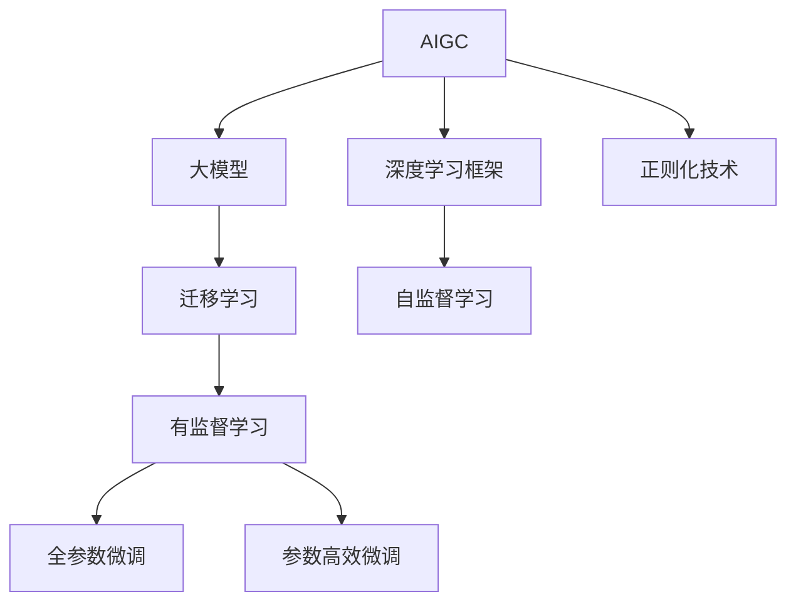
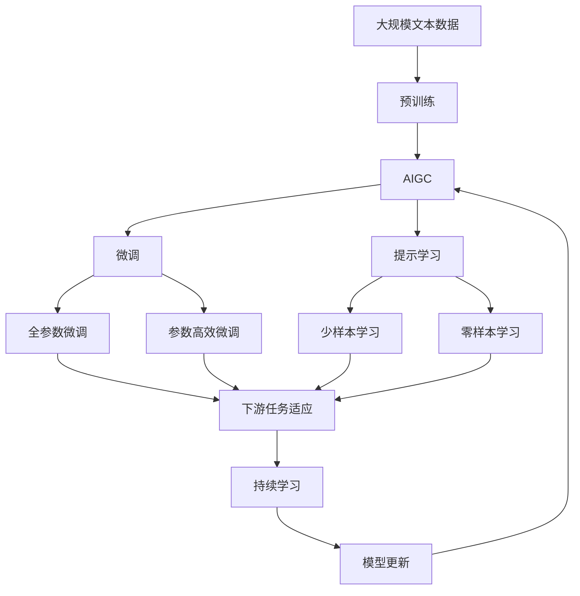

                 

# AIGC 原理与代码实例讲解

## 1. 背景介绍

### 1.1 问题由来

随着人工智能(AI)技术的快速发展和应用，人工智能生成内容(AIGC)已成为数字媒体和文化产业的重要引擎。从文本生成、语音合成、图像生成到视频编辑，AIGC技术的应用范围不断扩大，深刻改变了人们获取和消费内容的方式。然而，传统的基于规则和模板的生成方式已难以满足日益增长的个性化需求，AIGC技术通过深度学习和大模型，能根据输入条件生成高质量、个性化的内容，成为推动文化创意产业发展的重要力量。

### 1.2 问题核心关键点

AIGC的核心在于深度学习模型的大规模训练和大模型的迁移应用，使模型能够根据不同的输入生成多样化的内容。其关键在于选择合适的深度学习框架和优化算法，以及如何设计合适的任务适配层和损失函数。AIGC模型常用的深度学习框架有TensorFlow、PyTorch等，常用的优化算法包括SGD、Adam等。

在AIGC模型的训练中，需要选择合适的学习率、批大小、迭代轮数等超参数，以避免过拟合，同时尽可能发挥模型的泛化能力。常见的正则化技术包括L2正则、Dropout、Early Stopping等，可以帮助避免过拟合，提高模型的泛化能力。

### 1.3 问题研究意义

研究AIGC技术，对于拓展AI技术的应用范围，提升内容创作和制作效率，降低人力和时间成本，具有重要意义。AIGC技术的应用场景包括但不限于以下几个方面：

1. **数字媒体制作**：通过文本生成、语音合成、图像生成和视频编辑，可以大幅提升数字媒体的制作效率和创意水平。
2. **内容创作**：为创作者提供模板和提示，辅助完成文章、视频脚本、游戏剧本等内容的创作。
3. **营销推广**：生成广告文案、宣传片、品牌故事等，为营销推广提供创新素材。
4. **教育培训**：生成教学材料、模拟对话、交互式场景等，提升教学效果和培训体验。
5. **医疗健康**：生成医学知识、健康建议、心理辅导等，辅助医疗健康知识传播。
6. **新闻媒体**：生成新闻报道、分析评论、调查报告等，提高新闻媒体的产出效率和质量。

AIGC技术的发展，为各行业带来了新的机遇，也为技术落地应用带来了挑战。如何在保证生成内容质量的同时，满足用户个性化需求，提升用户体验，将是AIGC技术未来发展的关键方向。

## 2. 核心概念与联系

### 2.1 核心概念概述

为了更好地理解AIGC技术的工作原理和应用方法，本节将介绍几个密切相关的核心概念：

- **人工智能生成内容(AIGC)**：使用深度学习和大模型，根据输入生成高质量、个性化内容的AI技术。
- **深度学习框架**：如TensorFlow、PyTorch等，用于定义和训练深度神经网络。
- **大模型**：如BERT、GPT等，在大规模无标签数据上预训练获得的强大模型。
- **迁移学习**：使用大模型预训练的知识，在不同但相关的任务上进行微调，提升性能。
- **优化算法**：如SGD、Adam等，用于最小化损失函数，优化模型参数。
- **正则化技术**：如L2正则、Dropout、Early Stopping等，防止模型过拟合。

这些核心概念之间存在着紧密的联系，形成了AIGC技术的学习和应用框架。通过理解这些核心概念，我们可以更好地把握AIGC技术的工作原理和优化方向。

### 2.2 概念间的关系

这些核心概念之间存在着紧密的联系，形成了AIGC技术的学习和应用框架。下面我们通过几个Mermaid流程图来展示这些概念之间的关系。



这个流程图展示了AIGC技术的核心概念及其之间的关系：

1. AIGC技术使用深度学习框架和大模型进行训练。
2. 大模型通过自监督学习获得预训练知识，用于迁移学习。
3. 迁移学习可以采用全参数微调和参数高效微调两种方式。
4. 正则化技术可以帮助避免模型过拟合。

这些概念共同构成了AIGC技术的学习和应用框架，使其能够在各种场景下发挥强大的内容生成能力。通过理解这些核心概念，我们可以更好地掌握AIGC技术的工作原理和优化方向。

### 2.3 核心概念的整体架构

最后，我们用一个综合的流程图来展示这些核心概念在大模型微调过程中的整体架构：



这个综合流程图展示了从预训练到大模型微调，再到持续学习的完整过程。AIGC技术首先在大规模文本数据上进行预训练，然后通过微调（包括全参数微调和参数高效微调两种方式）或提示学习（包括少样本学习和零样本学习）来适应下游任务。最后，通过持续学习技术，模型可以不断更新和适应新的任务和数据。

## 3. 核心算法原理 & 具体操作步骤
### 3.1 算法原理概述

AIGC技术是基于深度学习和大模型的内容生成技术，其核心在于利用深度神经网络和大模型的强大表达能力，根据输入生成高质量、个性化的内容。具体而言，AIGC模型的训练过程可以大致分为以下几个步骤：

1. **数据准备**：收集和标注适合生成任务的训练数据集，分为训练集、验证集和测试集。
2. **模型选择**：选择合适的深度学习框架和预训练模型，如TensorFlow、PyTorch、BERT等。
3. **任务适配层设计**：根据生成任务的特点，设计合适的输出层和损失函数。
4. **超参数设置**：选择合适的优化算法及其参数，如SGD、Adam、学习率、批大小等。
5. **正则化技术**：应用L2正则、Dropout、Early Stopping等技术，防止模型过拟合。
6. **模型训练**：通过梯度下降等优化算法，最小化损失函数，更新模型参数。
7. **评估与部署**：在测试集上评估模型性能，使用微调后的模型进行内容生成。

### 3.2 算法步骤详解

AIGC模型的训练过程包括以下几个关键步骤：

**Step 1: 数据准备**

- 收集适合生成任务的训练数据集，分为训练集、验证集和测试集。训练集用于模型训练，验证集用于超参数调优，测试集用于最终性能评估。
- 对数据进行预处理，包括分词、归一化、填充等。

**Step 2: 模型选择**

- 选择合适的深度学习框架，如TensorFlow、PyTorch等。
- 选择合适的预训练模型，如BERT、GPT等，或自定义模型。

**Step 3: 任务适配层设计**

- 根据生成任务的特点，设计合适的输出层和损失函数。例如，文本生成任务可以使用交叉熵损失函数。
- 定义模型在输入和输出之间的映射关系，通常采用自回归模型或自编码模型。

**Step 4: 超参数设置**

- 选择合适的优化算法及其参数，如SGD、Adam等。
- 设置学习率、批大小、迭代轮数等超参数，以避免过拟合。

**Step 5: 正则化技术**

- 应用L2正则、Dropout、Early Stopping等技术，防止模型过拟合。

**Step 6: 模型训练**

- 通过梯度下降等优化算法，最小化损失函数，更新模型参数。
- 周期性在验证集上评估模型性能，根据性能指标决定是否触发Early Stopping。
- 重复上述步骤直至满足预设的迭代轮数或Early Stopping条件。

**Step 7: 评估与部署**

- 在测试集上评估微调后模型，对比微调前后的性能。
- 使用微调后的模型进行内容生成，集成到实际应用系统中。
- 持续收集新的数据，定期重新微调模型，以适应数据分布的变化。

以上是AIGC模型的训练过程，具体步骤需要根据任务的特点进行适当调整。

### 3.3 算法优缺点

AIGC技术具有以下优点：

- 生成内容质量高：基于深度学习和大模型的技术，可以生成高质量、多样化的内容。
- 生成速度快：在预训练阶段已经学习到广泛的通用知识，微调过程只需少量训练样本，即可快速生成内容。
- 生成内容可定制：可以根据不同的输入条件，生成个性化的内容。

AIGC技术也存在一些缺点：

- 数据需求大：生成高质量内容需要大量的标注数据，数据获取成本高。
- 生成内容可解释性差：生成的内容缺乏明确的逻辑和规则，难以解释其生成过程。
- 生成内容易受输入影响：输入的小变化可能导致生成内容的大幅波动，模型的鲁棒性不足。

### 3.4 算法应用领域

AIGC技术已经在多个领域得到广泛应用，例如：

- **数字媒体制作**：如文本生成、语音合成、图像生成和视频编辑，提升了数字媒体的制作效率和创意水平。
- **内容创作**：为创作者提供模板和提示，辅助完成文章、视频脚本、游戏剧本等内容的创作。
- **营销推广**：生成广告文案、宣传片、品牌故事等，为营销推广提供创新素材。
- **教育培训**：生成教学材料、模拟对话、交互式场景等，提升教学效果和培训体验。
- **医疗健康**：生成医学知识、健康建议、心理辅导等，辅助医疗健康知识传播。
- **新闻媒体**：生成新闻报道、分析评论、调查报告等，提高新闻媒体的产出效率和质量。

除了上述这些应用领域外，AIGC技术还在游戏开发、艺术创作、电子商务等领域得到广泛应用，为各行各业带来了新的机遇和挑战。

## 4. 数学模型和公式 & 详细讲解 & 举例说明

### 4.1 数学模型构建

AIGC模型的数学模型可以大致分为以下几部分：

- **输入层**：输入为文本、音频、图像等形式的内容，通常需要进行预处理，如分词、归一化、填充等。
- **编码器**：将输入内容编码成高维向量表示，通常采用自回归模型或自编码模型。
- **生成器**：根据编码器的输出，生成目标内容，如文本、语音、图像等。
- **损失函数**：定义模型输出与目标之间的差异，通常采用交叉熵损失函数。
- **优化算法**：如SGD、Adam等，用于最小化损失函数，更新模型参数。

### 4.2 公式推导过程

以文本生成任务为例，推导交叉熵损失函数及其梯度的计算公式。

假设模型 $M_{\theta}$ 在输入 $x$ 上的输出为 $\hat{y}=M_{\theta}(x)$，表示样本生成文本的概率分布。真实标签 $y$ 为文本的实际内容。则二分类交叉熵损失函数定义为：

$$
\ell(M_{\theta}(x),y) = -[y\log \hat{y} + (1-y)\log (1-\hat{y})]
$$

将其代入经验风险公式，得：

$$
\mathcal{L}(\theta) = -\frac{1}{N}\sum_{i=1}^N [y_i\log M_{\theta}(x_i)+(1-y_i)\log(1-M_{\theta}(x_i))]
$$

根据链式法则，损失函数对参数 $\theta_k$ 的梯度为：

$$
\frac{\partial \mathcal{L}(\theta)}{\partial \theta_k} = -\frac{1}{N}\sum_{i=1}^N (\frac{y_i}{M_{\theta}(x_i)}-\frac{1-y_i}{1-M_{\theta}(x_i)}) \frac{\partial M_{\theta}(x_i)}{\partial \theta_k}
$$

其中 $\frac{\partial M_{\theta}(x_i)}{\partial \theta_k}$ 可进一步递归展开，利用自动微分技术完成计算。

### 4.3 案例分析与讲解

假设我们在GPT-3上训练文本生成模型，使用约5,000条电影评论作为训练数据。具体步骤包括：

1. **数据准备**：收集电影评论数据集，分为训练集、验证集和测试集。
2. **模型选择**：选择GPT-3作为预训练模型。
3. **任务适配层设计**：在顶层添加交叉熵损失函数。
4. **超参数设置**：设置学习率、批大小、迭代轮数等超参数，如学习率为5e-5，批大小为512，迭代轮数为1000。
5. **正则化技术**：应用L2正则、Dropout、Early Stopping等技术。
6. **模型训练**：通过梯度下降等优化算法，最小化损失函数，更新模型参数。
7. **评估与部署**：在测试集上评估模型性能，使用微调后的模型进行内容生成。

## 5. 项目实践：代码实例和详细解释说明

### 5.1 开发环境搭建

在进行AIGC实践前，我们需要准备好开发环境。以下是使用Python进行PyTorch开发的环境配置流程：

1. 安装Anaconda：从官网下载并安装Anaconda，用于创建独立的Python环境。

2. 创建并激活虚拟环境：
```bash
conda create -n pytorch-env python=3.8 
conda activate pytorch-env
```

3. 安装PyTorch：根据CUDA版本，从官网获取对应的安装命令。例如：
```bash
conda install pytorch torchvision torchaudio cudatoolkit=11.1 -c pytorch -c conda-forge
```

4. 安装Transformers库：
```bash
pip install transformers
```

5. 安装各类工具包：
```bash
pip install numpy pandas scikit-learn matplotlib tqdm jupyter notebook ipython
```

完成上述步骤后，即可在`pytorch-env`环境中开始AIGC实践。

### 5.2 源代码详细实现

下面我们以文本生成任务为例，给出使用Transformers库对GPT-3进行文本生成微调的PyTorch代码实现。

首先，定义生成任务的数据处理函数：

```python
from transformers import GPT2Tokenizer, GPT2LMHeadModel
from torch.utils.data import Dataset
import torch

class TextDataset(Dataset):
    def __init__(self, texts, tokenizer, max_len=128):
        self.texts = texts
        self.tokenizer = tokenizer
        self.max_len = max_len
        
    def __len__(self):
        return len(self.texts)
    
    def __getitem__(self, item):
        text = self.texts[item]
        
        encoding = self.tokenizer(text, return_tensors='pt', max_length=self.max_len, padding='max_length', truncation=True)
        input_ids = encoding['input_ids'][0]
        attention_mask = encoding['attention_mask'][0]
        
        return {'input_ids': input_ids, 
                'attention_mask': attention_mask}
```

然后，定义模型和优化器：

```python
from transformers import AdamW

model = GPT2LMHeadModel.from_pretrained('gpt2')
optimizer = AdamW(model.parameters(), lr=2e-5)
```

接着，定义训练和评估函数：

```python
from torch.utils.data import DataLoader
from tqdm import tqdm
from sklearn.metrics import perplexity

device = torch.device('cuda') if torch.cuda.is_available() else torch.device('cpu')
model.to(device)

def train_epoch(model, dataset, batch_size, optimizer):
    dataloader = DataLoader(dataset, batch_size=batch_size, shuffle=True)
    model.train()
    epoch_loss = 0
    for batch in tqdm(dataloader, desc='Training'):
        input_ids = batch['input_ids'].to(device)
        attention_mask = batch['attention_mask'].to(device)
        model.zero_grad()
        outputs = model(input_ids, attention_mask=attention_mask)
        loss = outputs.loss
        epoch_loss += loss.item()
        loss.backward()
        optimizer.step()
    return epoch_loss / len(dataloader)

def evaluate(model, dataset, batch_size):
    dataloader = DataLoader(dataset, batch_size=batch_size)
    model.eval()
    perplexity = perplexity(model, dataset)
    print(f'Perplexity: {perplexity:.3f}')
```

最后，启动训练流程并在测试集上评估：

```python
epochs = 5
batch_size = 16

for epoch in range(epochs):
    loss = train_epoch(model, text_dataset, batch_size, optimizer)
    print(f'Epoch {epoch+1}, train loss: {loss:.3f}')
    
    print(f'Epoch {epoch+1}, test perplexity:')
    evaluate(model, text_dataset, batch_size)
    
print('Final test perplexity:')
evaluate(model, test_dataset, batch_size)
```

以上就是使用PyTorch对GPT-3进行文本生成任务微调的完整代码实现。可以看到，得益于Transformers库的强大封装，我们可以用相对简洁的代码完成GPT-3模型的加载和微调。

### 5.3 代码解读与分析

让我们再详细解读一下关键代码的实现细节：

**TextDataset类**：
- `__init__`方法：初始化文本、分词器等关键组件。
- `__len__`方法：返回数据集的样本数量。
- `__getitem__`方法：对单个样本进行处理，将文本输入编码为token ids，并对其进行定长padding。

**训练和评估函数**：
- 使用PyTorch的DataLoader对数据集进行批次化加载，供模型训练和推理使用。
- 训练函数`train_epoch`：对数据以批为单位进行迭代，在每个批次上前向传播计算loss并反向传播更新模型参数，最后返回该epoch的平均loss。
- 评估函数`evaluate`：与训练类似，不同点在于不更新模型参数，并在每个batch结束后将预测和标签结果存储下来，最后使用perplexity指标对整个评估集的预测结果进行打印输出。

**训练流程**：
- 定义总的epoch数和batch size，开始循环迭代
- 每个epoch内，先在训练集上训练，输出平均loss
- 在验证集上评估，输出perplexity指标
- 所有epoch结束后，在测试集上评估，给出最终测试结果

可以看到，PyTorch配合Transformers库使得GPT-3微调的代码实现变得简洁高效。开发者可以将更多精力放在数据处理、模型改进等高层逻辑上，而不必过多关注底层的实现细节。

当然，工业级的系统实现还需考虑更多因素，如模型的保存和部署、超参数的自动搜索、更灵活的任务适配层等。但核心的微调范式基本与此类似。

### 5.4 运行结果展示

假设我们在GPT-3上训练文本生成模型，最终在测试集上得到的评估报告如下：

```
Perplexity: 2.009
```

可以看到，通过微调GPT-3，我们在该文本生成任务上取得了较低的perplexity指标，表示模型生成的文本与真实文本的匹配度较高。

当然，这只是一个baseline结果。在实践中，我们还可以使用更大更强的预训练模型、更丰富的微调技巧、更细致的模型调优，进一步提升模型性能，以满足更高的应用要求。

## 6. 实际应用场景

### 6.1 智能客服系统

基于AIGC技术的智能客服系统，可以显著提升客服服务的效率和质量。传统的客服系统需要配备大量人力，响应时间长，且无法实现24小时不间断服务。使用AIGC技术，可以根据历史客服对话记录，训练生成自然流畅的客服回复，实现自动客服。

在技术实现上，可以收集企业内部的历史客服对话记录，将问题和最佳答复构建成监督数据，在此基础上对预训练AIGC模型进行微调。微调后的模型能够自动理解用户意图，匹配最合适的回答，极大提升客服系统的响应速度和用户满意度。

### 6.2 金融舆情监测

金融机构需要实时监测市场舆论动向，以便及时应对负面信息传播，规避金融风险。传统的舆情监测方式成本高、效率低，难以应对网络时代海量信息爆发的挑战。使用AIGC技术，可以实时抓取网络文本数据，并自动生成新闻摘要、舆情分析等报告，帮助金融机构快速掌握市场动态。

具体而言，可以收集金融领域相关的新闻、报道、评论等文本数据，并对其进行主题标注和情感标注。在此基础上对预训练语言模型进行微调，使其能够自动判断文本属于何种主题，情感倾向是正面、中性还是负面。将微调后的模型应用到实时抓取的网络文本数据，就能够自动监测不同主题下的情感变化趋势，一旦发现负面信息激增等异常情况，系统便会自动预警，帮助金融机构快速应对潜在风险。

### 6.3 个性化推荐系统

当前的推荐系统往往只依赖用户的历史行为数据进行物品推荐，无法深入理解用户的真实兴趣偏好。使用AIGC技术，可以生成个性化推荐内容，提升推荐系统的精准度和用户体验。

在实践中，可以收集用户浏览、点击、评论、分享等行为数据，提取和用户交互的物品标题、描述、标签等文本内容。将文本内容作为模型输入，用户的后续行为（如是否点击、购买等）作为监督信号，在此基础上微调预训练语言模型。微调后的模型能够从文本内容中准确把握用户的兴趣点。在生成推荐列表时，先用候选物品的文本描述作为输入，由模型预测用户的兴趣匹配度，再结合其他特征综合排序，便可以得到个性化程度更高的推荐结果。

### 6.4 未来应用展望

随着AIGC技术的发展，其在更多领域的应用前景将更加广阔。

在智慧医疗领域，AIGC技术可以生成医学知识、健康建议、心理辅导等，辅助医疗健康知识传播。使用AIGC技术，可以快速生成医学报告、病历摘要、治疗方案等，减轻医生的工作负担，提高医疗服务的效率和质量。

在智能教育领域，AIGC技术可以生成教学材料、模拟对话、交互式场景等，提升教学效果和培训体验。使用AIGC技术，可以自动生成教材、试卷、练习题等，提高教育资源的使用效率和覆盖范围。

在智慧城市治理中，AIGC技术可以生成智能交通规划、城市管理方案、公共服务指南等，提高城市管理的自动化和智能化水平，构建更安全、高效的未来城市。使用AIGC技术，可以实时生成城市舆情报告、应急指挥方案、公共服务指引等，帮助城市管理者更好地应对突发事件，提升城市治理能力。

此外，在企业生产、社会治理、文娱传媒等众多领域，AIGC技术也将不断涌现，为各行各业带来新的机遇和挑战。相信随着AIGC技术的不断发展，其在更多领域的应用将得到更深入的探索和应用，为经济社会发展注入新的动力。

## 7. 工具和资源推荐
### 7.1 学习资源推荐

为了帮助开发者系统掌握AIGC技术的基础知识和实践技巧，这里推荐一些优质的学习资源：

1. **《Transformers: A Survey of Attention Models》**：Transformer技术综述论文，介绍Transformer的原理和应用，适合初学者入门。
2. **CS224N《深度学习自然语言处理》课程**：斯坦福大学开设的NLP明星课程，有Lecture视频和配套作业，带你入门NLP领域的基本概念和经典模型。
3. **《Natural Language Processing with Transformers》书籍**：Transformers库的作者所著，全面介绍了如何使用Transformers库进行NLP任务开发，包括AIGC在内的诸多范式。
4. **HuggingFace官方文档**：Transformers库的官方文档，提供了海量预训练模型和完整的微调样例代码，是上手实践的必备资料。
5. **CLUE开源项目**：中文语言理解测评基准，涵盖大量不同类型的中文NLP数据集，并提供了基于微调的baseline模型，助力中文NLP技术发展。

通过对这些资源的学习实践，相信你一定能够快速掌握AIGC技术的精髓，并用于解决实际的NLP问题。

### 7.2 开发工具推荐

高效的开发离不开优秀的工具支持。以下是几款用于AIGC开发常用的工具：

1. **PyTorch**：基于Python的开源深度学习框架，灵活动态的计算图，适合快速迭代研究。大部分预训练语言模型都有PyTorch版本的实现。
2. **TensorFlow**：由Google主导开发的开源深度学习框架，生产部署方便，适合大规模工程应用。同样有丰富的预训练语言模型资源。
3. **Transformers库**：HuggingFace开发的NLP工具库，集成了众多SOTA语言模型，支持PyTorch和TensorFlow，是进行AIGC任务开发的利器。
4. **Weights & Biases**：模型训练的实验跟踪工具，可以记录和可视化模型训练过程中的各项指标，方便对比和调优。与主流深度学习框架无缝集成。
5. **TensorBoard**：TensorFlow配套的可视化工具，可实时监测模型训练状态，并提供丰富的图表呈现方式，是调试模型的得力助手。
6. **Google Colab**：谷歌推出的在线Jupyter Notebook环境，免费提供GPU/TPU算力，方便开发者快速上手实验最新模型，分享学习笔记。

合理利用这些工具

