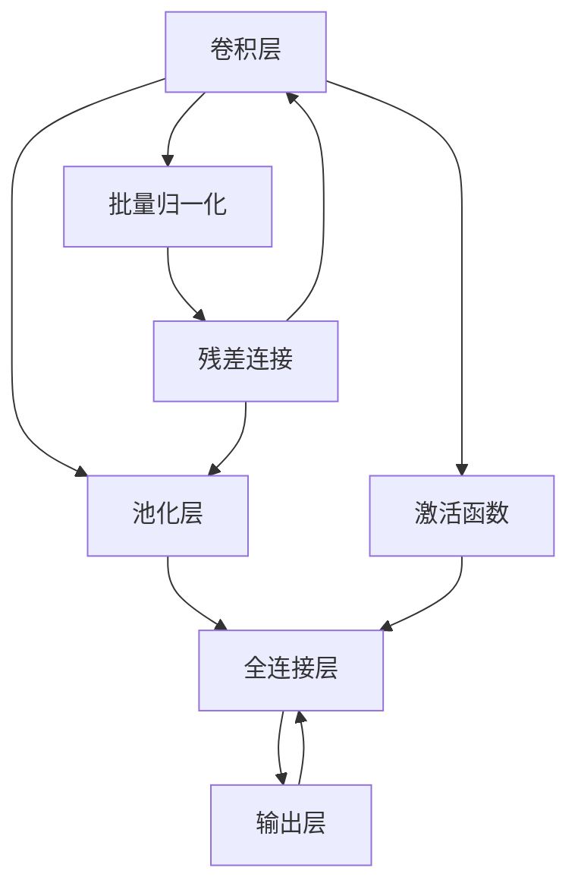
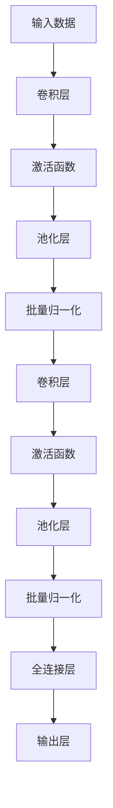
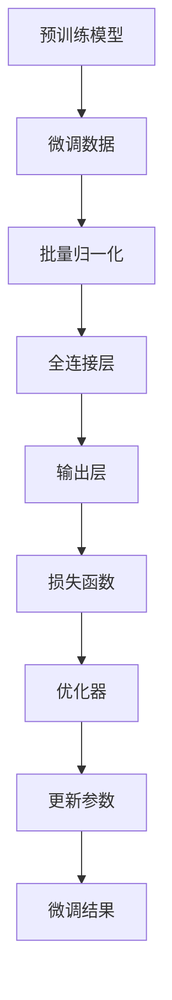
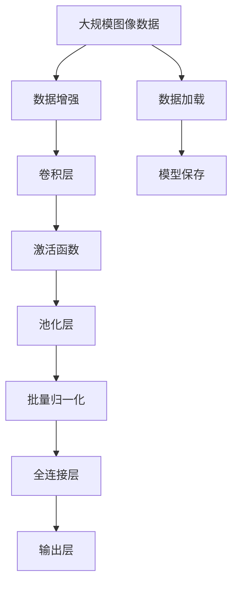

                 

# AI人工智能深度学习算法：卷积神经网络的原理与应用

> 关键词：卷积神经网络,卷积层,池化层,激活函数,批量归一化,BatchNorm,残差连接,梯度消失,ReLU,LeakyReLU,全连接层

## 1. 背景介绍

### 1.1 问题由来
深度学习已经成为人工智能领域最核心的技术之一。近年来，随着硬件计算能力的提升和深度学习算法的不断优化，深度学习在计算机视觉、自然语言处理、语音识别等领域取得了显著的进展。

卷积神经网络（Convolutional Neural Network, CNN）是深度学习中最为成功的一种网络结构，尤其在计算机视觉任务中取得了巨大的成功。CNN通过卷积操作和池化操作，提取输入数据的局部特征，并通过多层结构进行非线性组合，进而实现对输入数据的分类或回归任务。

本文旨在深入探讨CNN的原理和应用，并结合实例，展示如何构建和优化卷积神经网络模型。希望通过本文，能够帮助读者更好地理解CNN的核心思想和应用技巧，为后续的深度学习项目打下坚实的基础。

### 1.2 问题核心关键点
卷积神经网络的核心在于卷积操作和池化操作，这两者能够有效地提取输入数据的空间和时序特征。同时，通过多层结构，CNN能够学习更加复杂的数据表示。

卷积神经网络的关键点包括：
1. 卷积层的定义和计算原理。
2. 池化层的定义和计算原理。
3. 激活函数的定义和选择。
4. 批量归一化的定义和作用。
5. 残差连接的定义和作用。
6. 梯度消失问题及其解决策略。

本文将从以上关键点出发，详细介绍CNN的构建和优化方法。

## 2. 核心概念与联系

### 2.1 核心概念概述

为了更好地理解卷积神经网络的原理和应用，本节将介绍几个密切相关的核心概念：

- 卷积层（Convolutional Layer）：卷积层是CNN的核心组件，通过卷积操作提取输入数据的局部特征。卷积操作可以看作是一种局部感知和参数共享的操作，能够有效地减少模型参数量。
- 池化层（Pooling Layer）：池化层通过下采样操作，进一步提取输入数据的特征，减少模型参数量，同时增强模型的鲁棒性。
- 激活函数（Activation Function）：激活函数在神经元输出上进行非线性变换，增强模型的表达能力。
- 批量归一化（Batch Normalization, BatchNorm）：批量归一化通过对每个批次的数据进行标准化，加速神经网络的训练过程，同时提高模型的泛化能力。
- 残差连接（Residual Connection）：残差连接通过跨层信息传递，解决深度神经网络的梯度消失问题，使得网络能够更深更广。
- 梯度消失问题（Vanishing Gradient Problem）：深度神经网络中，反向传播时梯度逐渐变小，导致模型难以训练。

这些核心概念之间的逻辑关系可以通过以下Mermaid流程图来展示：



这个流程图展示了一个典型的卷积神经网络结构，包含卷积层、池化层、全连接层、激活函数、批量归一化和残差连接等核心组件。

### 2.2 概念间的关系

这些核心概念之间存在着紧密的联系，形成了卷积神经网络的学习框架。下面我们通过几个Mermaid流程图来展示这些概念之间的关系。

#### 2.2.1 CNN的构建流程



这个流程图展示了CNN的构建流程，包括卷积层、激活函数、池化层和全连接层的组合，并通过批量归一化加速训练。

#### 2.2.2 CNN的微调过程



这个流程图展示了CNN的微调过程，包括数据输入、模型参数更新和损失函数计算等关键步骤。

### 2.3 核心概念的整体架构

最后，我们用一个综合的流程图来展示这些核心概念在大规模图像分类任务中的整体架构：



这个综合流程图展示了从数据增强到模型保存的全流程，包含卷积层、激活函数、池化层、批量归一化、全连接层和输出层等核心组件。

## 3. 核心算法原理 & 具体操作步骤
### 3.1 算法原理概述

卷积神经网络的核心思想是通过卷积操作和池化操作，提取输入数据的局部特征。卷积操作可以看作是一种局部感知和参数共享的操作，能够有效地减少模型参数量，并提取输入数据的局部特征。池化操作则通过下采样操作，进一步提取输入数据的特征，减少模型参数量，同时增强模型的鲁棒性。

卷积神经网络的构建和优化过程主要包括以下几个步骤：

1. 设计网络结构。根据任务需求，选择合适的卷积层、池化层、全连接层等组件，并确定每层的网络参数。
2. 设置优化器。选择合适的优化器，如Adam、SGD等，并设置合适的学习率、批大小等超参数。
3. 进行前向传播和反向传播。通过前向传播计算模型输出，并通过反向传播计算梯度，更新模型参数。
4. 进行模型评估。在验证集或测试集上评估模型的性能，选择合适的超参数组合。
5. 进行模型微调。使用标注数据进行微调，进一步提升模型性能。

### 3.2 算法步骤详解

下面详细介绍卷积神经网络的构建和优化步骤：

**Step 1: 设计网络结构**

设计网络结构需要考虑以下几个因素：

- 卷积层和池化层的数量和大小。一般而言，卷积层和池化层交替出现，形成多个特征提取器。
- 激活函数的选择。常用的激活函数包括ReLU、LeakyReLU、Tanh等，需要根据任务需求选择合适的激活函数。
- 批量归一化的位置。通常将批量归一化放置在卷积层和全连接层之间，加速模型训练。
- 残差连接的使用。在深度神经网络中，可以通过残差连接跨层传递信息，解决梯度消失问题。

以下是设计一个简单的卷积神经网络结构的示例代码：

```python
import torch.nn as nn
import torch.nn.functional as F

class ConvNet(nn.Module):
    def __init__(self):
        super(ConvNet, self).__init__()
        self.conv1 = nn.Conv2d(3, 64, 3, padding=1)
        self.relu1 = nn.ReLU()
        self.pool1 = nn.MaxPool2d(2, 2)
        self.bn1 = nn.BatchNorm2d(64)
        self.conv2 = nn.Conv2d(64, 128, 3, padding=1)
        self.relu2 = nn.ReLU()
        self.pool2 = nn.MaxPool2d(2, 2)
        self.bn2 = nn.BatchNorm2d(128)
        self.fc1 = nn.Linear(128 * 4 * 4, 256)
        self.relu3 = nn.ReLU()
        self.bn3 = nn.BatchNorm1d(256)
        self.fc2 = nn.Linear(256, 10)
    
    def forward(self, x):
        x = self.conv1(x)
        x = self.relu1(x)
        x = self.pool1(x)
        x = self.bn1(x)
        x = self.conv2(x)
        x = self.relu2(x)
        x = self.pool2(x)
        x = self.bn2(x)
        x = x.view(x.size(0), -1)
        x = self.fc1(x)
        x = self.relu3(x)
        x = self.bn3(x)
        x = self.fc2(x)
        return x
```

**Step 2: 设置优化器**

选择合适的优化器，并设置合适的超参数，包括学习率、批大小、迭代轮数等。以下是设置Adam优化器的示例代码：

```python
import torch.optim as optim

model = ConvNet()
optimizer = optim.Adam(model.parameters(), lr=0.001)
```

**Step 3: 进行前向传播和反向传播**

通过前向传播计算模型输出，并通过反向传播计算梯度，更新模型参数。以下是前向传播和反向传播的示例代码：

```python
import torch
import torchvision.transforms as transforms

# 加载数据
transform = transforms.Compose([
    transforms.ToTensor(),
    transforms.Normalize((0.5, 0.5, 0.5), (0.5, 0.5, 0.5))
])
trainset = torchvision.datasets.CIFAR10(root='./data', train=True, download=True, transform=transform)
trainloader = torch.utils.data.DataLoader(trainset, batch_size=64, shuffle=True)

# 前向传播
model = ConvNet()
model.train()
for batch_idx, (data, target) in enumerate(trainloader):
    data = data.to(device)
    target = target.to(device)
    output = model(data)
    loss = F.cross_entropy(output, target)
    loss.backward()
    optimizer.step()
```

**Step 4: 进行模型评估**

在验证集或测试集上评估模型的性能，选择合适的超参数组合。以下是评估模型的示例代码：

```python
import torch

# 加载测试集
testset = torchvision.datasets.CIFAR10(root='./data', train=False, download=True, transform=transform)
testloader = torch.utils.data.DataLoader(testset, batch_size=64, shuffle=False)

# 评估模型
model.eval()
correct = 0
total = 0
with torch.no_grad():
    for batch_idx, (data, target) in enumerate(testloader):
        data = data.to(device)
        target = target.to(device)
        output = model(data)
        _, predicted = torch.max(output.data, 1)
        total += target.size(0)
        correct += (predicted == target).sum().item()

print('Accuracy of the network on the 10000 test images: %d %%' % (100 * correct / total))
```

**Step 5: 进行模型微调**

使用标注数据进行微调，进一步提升模型性能。以下是微调模型的示例代码：

```python
import torch

# 加载微调数据
trainset = torchvision.datasets.CIFAR10(root='./data', train=True, download=True, transform=transform)
trainloader = torch.utils.data.DataLoader(trainset, batch_size=64, shuffle=True)
testset = torchvision.datasets.CIFAR10(root='./data', train=False, download=True, transform=transform)
testloader = torch.utils.data.DataLoader(testset, batch_size=64, shuffle=False)

# 微调模型
model.train()
for batch_idx, (data, target) in enumerate(trainloader):
    data = data.to(device)
    target = target.to(device)
    output = model(data)
    loss = F.cross_entropy(output, target)
    loss.backward()
    optimizer.step()
    
# 评估微调后的模型
model.eval()
correct = 0
total = 0
with torch.no_grad():
    for batch_idx, (data, target) in enumerate(testloader):
        data = data.to(device)
        target = target.to(device)
        output = model(data)
        _, predicted = torch.max(output.data, 1)
        total += target.size(0)
        correct += (predicted == target).sum().item()

print('Accuracy of the network on the 10000 test images: %d %%' % (100 * correct / total))
```

### 3.3 算法优缺点

卷积神经网络具有以下优点：

- 参数共享和局部感知：通过卷积操作，卷积神经网络能够有效地减少模型参数量，并提取输入数据的局部特征。
- 局部连接和池化操作：通过池化操作，卷积神经网络能够进一步提取输入数据的特征，增强模型的鲁棒性。
- 多层次特征提取：通过多层次的卷积层和池化层，卷积神经网络能够学习输入数据的不同层次特征，提升模型的表达能力。
- 深度网络架构：通过残差连接等技术，卷积神经网络能够构建深度网络架构，提升模型的表达能力。

卷积神经网络也存在一些缺点：

- 需要大量标注数据：卷积神经网络需要大量的标注数据进行训练，否则容易出现过拟合。
- 模型复杂度高：卷积神经网络的模型复杂度高，训练和推理速度较慢。
- 特征表示单一：卷积神经网络的特征表示主要依赖于局部连接和池化操作，难以提取全局特征。

### 3.4 算法应用领域

卷积神经网络在计算机视觉、自然语言处理、信号处理等领域有广泛应用。以下是卷积神经网络的一些典型应用：

- 图像分类：卷积神经网络在图像分类任务中表现出色，如CIFAR-10、ImageNet等。
- 目标检测：卷积神经网络在目标检测任务中也有广泛应用，如Faster R-CNN、YOLO等。
- 图像分割：卷积神经网络在图像分割任务中表现优异，如U-Net、Mask R-CNN等。
- 语音识别：卷积神经网络在语音识别任务中也有广泛应用，如DeepSpeech、Wav2Letter等。
- 自然语言处理：卷积神经网络在自然语言处理任务中也有应用，如文本分类、情感分析等。

## 4. 数学模型和公式 & 详细讲解 & 举例说明

### 4.1 数学模型构建

卷积神经网络的数学模型主要由卷积操作、池化操作和激活函数等组成。

#### 4.1.1 卷积操作

卷积操作可以看作是一种局部感知和参数共享的操作。设输入数据为 $X \in \mathbb{R}^{C \times H \times W}$，卷积核为 $K \in \mathbb{R}^{F \times C \times K \times K}$，卷积输出为 $Y \in \mathbb{R}^{F \times H' \times W'}$。则卷积操作的计算公式为：

$$
Y_{f,h,w} = \sum_{c=1}^{C} \sum_{k=1}^{K} \sum_{i=0}^{H-K+1} \sum_{j=0}^{W-K+1} X_{c,i,j} \cdot K_{f,c,k,i,j}
$$

其中，$X_{c,i,j}$ 表示输入数据在 $i,j$ 位置上的 $c$ 通道值，$K_{f,c,k,i,j}$ 表示卷积核在 $k$ 位置上的 $f$ 通道值。

#### 4.1.2 池化操作

池化操作通过下采样操作，进一步提取输入数据的特征，减少模型参数量。常见的池化操作包括最大池化、平均池化等。设输入数据为 $X \in \mathbb{R}^{C \times H \times W}$，池化操作为 $P \in \mathbb{R}^{F \times H' \times W'}$。则最大池化的计算公式为：

$$
P_{f,h,w} = \max_{i=1}^{H'} \max_{j=1}^{W'} X_{f,i \times 2^{p},j \times 2^{q}}
$$

其中，$X_{f,i \times 2^{p},j \times 2^{q}}$ 表示输入数据在 $i,j$ 位置上的 $f$ 通道值。

#### 4.1.3 激活函数

激活函数在神经元输出上进行非线性变换，增强模型的表达能力。常用的激活函数包括ReLU、LeakyReLU、Tanh等。

ReLU激活函数的计算公式为：

$$
\sigma_{ReLU}(x) = \max(0, x)
$$

LeakyReLU激活函数的计算公式为：

$$
\sigma_{LeakyReLU}(x) = \begin{cases}
x, & x > 0 \\
0.01x, & x \leq 0
\end{cases}
$$

#### 4.1.4 批量归一化

批量归一化通过对每个批次的数据进行标准化，加速神经网络的训练过程，同时提高模型的泛化能力。批量归一化的计算公式为：

$$
\mu = \frac{1}{m} \sum_{i=1}^{m} x_i
$$

$$
\sigma = \sqrt{\frac{1}{m} \sum_{i=1}^{m} (x_i - \mu)^2}
$$

$$
\hat{x_i} = \frac{x_i - \mu}{\sigma}
$$

$$
y_i = \gamma \hat{x_i} + \beta
$$

其中，$m$ 表示批次大小，$\mu$ 和 $\sigma$ 表示每个批次的均值和标准差，$\gamma$ 和 $\beta$ 表示缩放因子和偏置项。

### 4.2 公式推导过程

以下我们以ReLU激活函数为例，推导其在卷积神经网络中的作用。

设输入数据为 $X \in \mathbb{R}^{C \times H \times W}$，ReLU激活函数为 $\sigma_{ReLU}(x) = \max(0, x)$。则在卷积神经网络中，ReLU激活函数的计算公式为：

$$
\sigma_{ReLU}(x) = \max(0, x)
$$

通过ReLU激活函数，卷积神经网络能够实现非线性变换，增强模型的表达能力。ReLU激活函数的优点包括：

- 计算速度快：ReLU激活函数的计算速度较快，能够显著加速模型的训练过程。
- 非线性变换：ReLU激活函数能够实现非线性变换，增强模型的表达能力。
- 避免梯度消失：ReLU激活函数在正区间的梯度恒为1，能够有效避免梯度消失问题。

### 4.3 案例分析与讲解

下面我们以手写数字识别任务为例，展示如何构建和优化卷积神经网络模型。

**Step 1: 设计网络结构**

设计一个简单的卷积神经网络结构，包含两个卷积层、两个池化层和两个全连接层。以下是设计卷积神经网络结构的示例代码：

```python
import torch.nn as nn
import torch.nn.functional as F

class ConvNet(nn.Module):
    def __init__(self):
        super(ConvNet, self).__init__()
        self.conv1 = nn.Conv2d(1, 32, 3, padding=1)
        self.relu1 = nn.ReLU()
        self.pool1 = nn.MaxPool2d(2, 2)
        self.bn1 = nn.BatchNorm2d(32)
        self.conv2 = nn.Conv2d(32, 64, 3, padding=1)
        self.relu2 = nn.ReLU()
        self.pool2 = nn.MaxPool2d(2, 2)
        self.bn2 = nn.BatchNorm2d(64)
        self.fc1 = nn.Linear(64 * 7 * 7, 128)
        self.relu3 = nn.ReLU()
        self.bn3 = nn.BatchNorm1d(128)
        self.fc2 = nn.Linear(128, 10)
    
    def forward(self, x):
        x = self.conv1(x)
        x = self.relu1(x)
        x = self.pool1(x)
        x = self.bn1(x)
        x = self.conv2(x)
        x = self.relu2(x)
        x = self.pool2(x)
        x = self.bn2(x)
        x = x.view(x.size(0), -1)
        x = self.fc1(x)
        x = self.relu3(x)
        x = self.bn3(x)
        x = self.fc2(x)
        return x
```

**Step 2: 设置优化器**

设置Adam优化器，并设置合适的超参数，包括学习率、批大小、迭代轮数等。以下是设置Adam优化器的示例代码：

```python
import torch.optim as optim

model = ConvNet()
optimizer = optim.Adam(model.parameters(), lr=0.001)
```

**Step 3: 进行前向传播和反向传播**

通过前向传播计算模型输出，并通过反向传播计算梯度，更新模型参数。以下是前向传播和反向传播的示例代码：

```python
import torch

# 加载数据
transform = transforms.Compose([
    transforms.ToTensor(),
    transforms.Normalize((0.5, 0.5, 0.5), (0.5, 0.5, 0.5))
])
trainset = torchvision.datasets.MNIST(root='./data', train=True, download=True, transform=transform)
trainloader = torch.utils.data.DataLoader(trainset, batch_size=64, shuffle=True)

# 前向传播
model = ConvNet()
model.train()
for batch_idx, (data, target) in enumerate(trainloader):
    data = data.to(device)
    target = target.to(device)
    output = model(data)
    loss = F.cross_entropy(output, target)
    loss.backward()
    optimizer.step()
```

**Step 4: 进行模型评估**

在验证集或测试集上评估模型的性能，选择合适的超参数组合。以下是评估模型的示例代码：

```python
import torch

# 加载测试集
testset = torchvision.datasets.MNIST(root='./data', train=False, download=True, transform=transform)
testloader = torch.utils.data.DataLoader(testset, batch_size=64, shuffle=False)

# 评估模型
model.eval()
correct = 0
total = 0
with torch.no_grad():
    for batch_idx, (data, target) in enumerate(testloader):
        data = data.to(device)
        target = target.to(device)
        output = model(data)
        _, predicted = torch.max(output.data, 1)
        total += target.size(0)
        correct += (predicted == target).sum().item()

print('Accuracy of the network on the 10000 test images: %d %%' % (100 * correct / total))
```

**Step 5: 进行模型微调**

使用标注数据进行微调，进一步提升模型性能。以下是微调模型的示例代码：

```python
import torch

# 加载微调数据
trainset = torchvision.datasets.MNIST(root='./data', train=True, download=True, transform=transform)
trainloader = torch.utils.data.DataLoader(trainset, batch_size=64, shuffle=True)
testset = torchvision.datasets.MNIST(root='./data', train=False, download=True, transform=transform)
testloader = torch.utils.data.DataLoader(testset, batch_size=64, shuffle=False)

# 微调模型
model.train()
for batch_idx, (data, target) in enumerate(trainloader):
    data = data.to(device)
    target = target.to(device)
    output = model(data)
    loss = F.cross_entropy(output, target)
    loss.backward()
    optimizer.step()
    
# 评估微调后的模型
model.eval()
correct = 0
total = 0
with torch.no_grad():
    for batch_idx, (data, target) in enumerate(testloader):
        data = data.to(device)
        target = target.to(device)
        output = model(data)
        _, predicted = torch.max(output.data, 1)
        total += target.size(0)
        correct += (predicted == target).sum().item()

print('Accuracy of the network on the 10000 test images: %d %%' % (100 * correct / total))
```

### 4.4 数学模型和公式

通过以上案例，我们可以看到卷积神经网络的基本构建和优化过程。以下是对其数学模型的进一步推导和讲解：

#### 4.4.1 卷积操作

设输入数据为 $X \in \mathbb{R}^{C \times H \times W}$，卷积核为 $K \in \mathbb{R}^{F \times C \times K \times K}$，卷积输出为 $Y \in \mathbb{R}^{F \times H' \times W'}$。则卷积操作的计算公式为：

$$
Y_{f,h,w} = \sum_{c=1}^{C} \sum_{k=1}^{K} \sum_{i=0}^{H-K+1} \sum_{j=0}^{W-K+1} X_{c,i,j} \cdot K_{f,c,k,i,j}
$$

其中，$X_{c,i,j}$ 表示输入数据在 $i,j$ 位置上的 $c$ 通道值，$K_{f,c,k,i,j}$ 表示卷积核在 $k$ 位置上的 $f$ 通道值。

#### 4.4.2 池化操作

池化操作通过下采样操作，进一步提取输入数据的特征，减少模型参数量。常见的池化操作包括最大池化、平均池化等。

