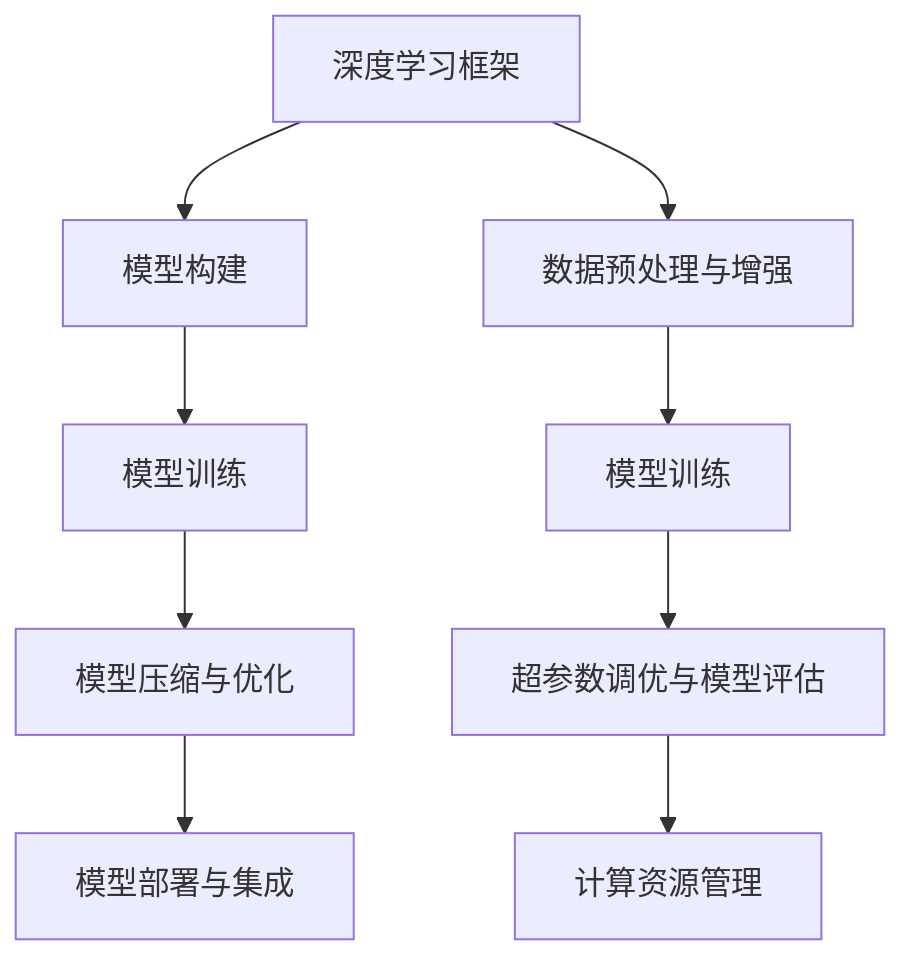
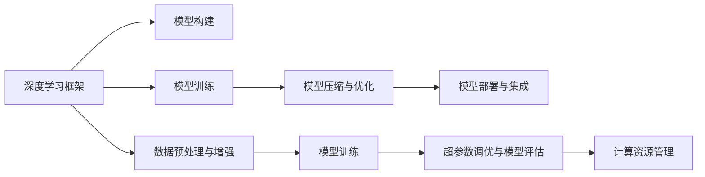
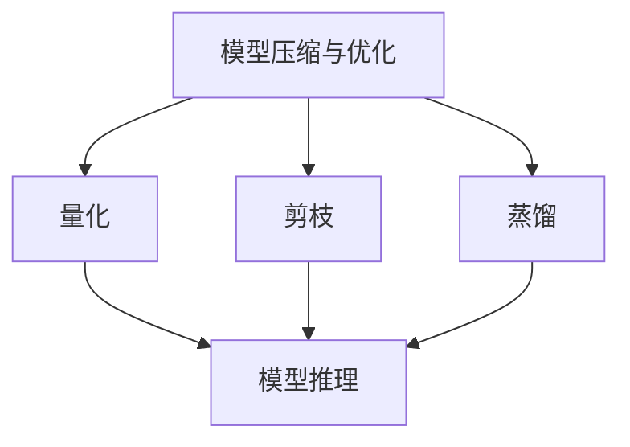
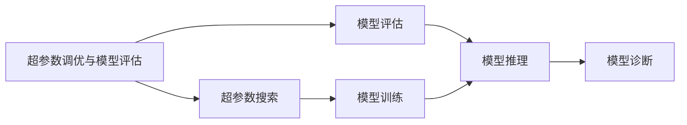
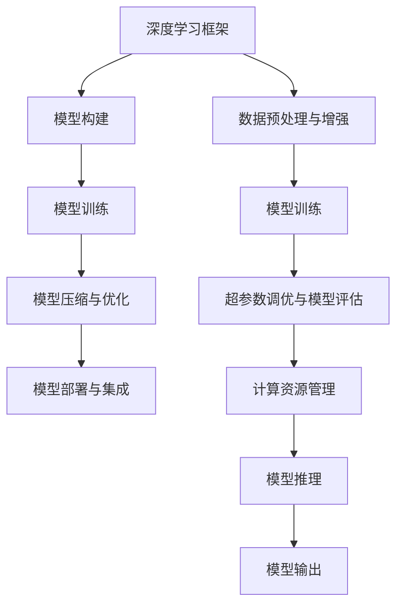

                 

# AI工程学：大模型应用开发实战：新的AI技术栈，如何不同于传统的机器学习工程

## 1. 背景介绍

### 1.1 问题由来

随着人工智能技术的迅猛发展，大模型（如BERT、GPT、DALL-E等）在自然语言处理、计算机视觉等诸多领域展示了其强大的能力。相比于传统机器学习模型，大模型能够更好地处理复杂的非线性关系和大量数据，甚至在零样本、少样本和跨领域学习等方向取得了突破性的进展。然而，大模型的开发和应用涉及更复杂的技术栈和更多的工程实践，对AI工程师的能力要求也更为全面。本文将介绍大模型应用开发的新技术栈，以及其与传统机器学习工程的不同之处。

### 1.2 问题核心关键点

大模型应用开发的技术栈主要包括以下几个方面：
- **深度学习框架**：如PyTorch、TensorFlow等，用于构建和训练大模型。
- **模型压缩与优化**：用于提高模型推理速度和减少存储需求的技术，包括量化、剪枝、蒸馏等。
- **模型部署与集成**：包括模型推理引擎、API接口、服务化等，使模型能够被有效地部署和集成到实际应用中。
- **数据预处理与增强**：处理和增强训练数据，以提升模型性能。
- **超参数调优与模型评估**：通过自动化超参数调优和模型评估，提升模型精度和泛化能力。
- **计算资源管理**：对计算资源进行管理，包括硬件配置、调度、监控等。

与传统机器学习工程相比，大模型应用开发的技术栈具有以下几个特点：
1. 涉及的框架更多，需要处理更复杂的数据结构和计算图。
2. 模型压缩和优化是必不可少的步骤，以适应不同场景的需求。
3. 模型部署和集成要求更高，需要考虑模型推理速度、资源占用等实际问题。
4. 数据预处理和增强技术更加多样，需要根据具体任务进行灵活应用。
5. 超参数调优和模型评估需要结合自动化工具和模型诊断工具，以提高效率和准确性。
6. 计算资源管理更为复杂，涉及到更多硬件和软件栈的集成。

### 1.3 问题研究意义

大模型应用开发的新技术栈能够显著提升模型的性能和应用效率，加速AI技术在各行业的落地应用。具体而言：
1. **提高模型精度和泛化能力**：通过深度学习框架和模型压缩技术，大模型能够在更少的数据下取得更好的性能。
2. **提升模型推理速度和资源利用效率**：通过模型优化和推理引擎，大模型能够在实际应用中快速响应，减少资源占用。
3. **增强模型部署和集成能力**：通过API接口和服务化，大模型能够被更灵活地部署和集成到各种应用场景中。
4. **优化数据处理和增强流程**：通过数据预处理和增强技术，大模型能够更好地适应不同的数据分布和任务需求。
5. **简化超参数调优和模型评估流程**：通过自动化工具和模型诊断工具，大模型能够更高效地进行超参数调优和模型评估。
6. **优化计算资源管理**：通过硬件配置和资源调度，大模型能够更高效地利用计算资源，降低成本。

## 2. 核心概念与联系

### 2.1 核心概念概述

为更好地理解大模型应用开发的新技术栈，本节将介绍几个密切相关的核心概念：

- **深度学习框架**：如PyTorch、TensorFlow等，用于构建和训练深度学习模型。
- **模型压缩与优化**：包括量化、剪枝、蒸馏等技术，用于提高模型推理速度和减少存储需求。
- **模型部署与集成**：包括模型推理引擎、API接口、服务化等，使模型能够被有效地部署和集成到实际应用中。
- **数据预处理与增强**：用于处理和增强训练数据，以提升模型性能。
- **超参数调优与模型评估**：通过自动化工具和模型诊断工具，提升模型精度和泛化能力。
- **计算资源管理**：对计算资源进行管理，包括硬件配置、调度、监控等。

这些概念之间的逻辑关系可以通过以下Mermaid流程图来展示：



这个流程图展示了大模型应用开发的主要流程：

1. 使用深度学习框架构建和训练模型。
2. 对模型进行压缩与优化，提高推理速度和资源利用效率。
3. 将模型部署和集成到实际应用中。
4. 对数据进行预处理和增强，提升模型性能。
5. 通过自动化工具和模型诊断工具进行超参数调优和模型评估。
6. 对计算资源进行管理，确保模型能够高效地运行。

### 2.2 概念间的关系

这些核心概念之间存在着紧密的联系，形成了大模型应用开发的全流程。下面我通过几个Mermaid流程图来展示这些概念之间的关系。

#### 2.2.1 深度学习框架与模型构建



这个流程图展示了深度学习框架在模型构建和训练过程中的关键作用。

#### 2.2.2 模型压缩与优化的步骤



这个流程图展示了模型压缩与优化的主要步骤：量化、剪枝和蒸馏。这些技术可以提高模型的推理速度和资源利用效率。

#### 2.2.3 超参数调优与模型评估的流程



这个流程图展示了超参数调优与模型评估的流程：超参数搜索、模型训练和推理、模型诊断。通过这些步骤，可以优化模型的性能和泛化能力。

### 2.3 核心概念的整体架构

最后，我们用一个综合的流程图来展示这些核心概念在大模型应用开发过程中的整体架构：



这个综合流程图展示了从模型构建到推理输出的完整过程。大模型应用开发涉及到模型构建、训练、压缩与优化、部署与集成、数据预处理与增强、超参数调优与模型评估、计算资源管理等多个环节，每个环节都需要精心设计和优化，以确保最终模型的性能和应用效果。

## 3. 核心算法原理 & 具体操作步骤
### 3.1 算法原理概述

大模型应用开发的核心算法原理主要包括以下几个方面：

1. **深度学习框架**：如PyTorch、TensorFlow等，用于构建和训练深度学习模型。
2. **模型压缩与优化**：包括量化、剪枝、蒸馏等技术，用于提高模型推理速度和减少存储需求。
3. **模型部署与集成**：包括模型推理引擎、API接口、服务化等，使模型能够被有效地部署和集成到实际应用中。
4. **数据预处理与增强**：用于处理和增强训练数据，以提升模型性能。
5. **超参数调优与模型评估**：通过自动化工具和模型诊断工具，提升模型精度和泛化能力。
6. **计算资源管理**：对计算资源进行管理，包括硬件配置、调度、监控等。

### 3.2 算法步骤详解

#### 3.2.1 深度学习框架

深度学习框架是构建和训练大模型的重要工具。如PyTorch和TensorFlow等框架，提供了灵活的数据结构、高效的计算图和丰富的优化算法。

**PyTorch**：
- 优势：易于上手，灵活性高，支持动态图。
- 用法：构建计算图、定义模型、训练模型。
- 示例：

```python
import torch
import torch.nn as nn
import torch.optim as optim

# 定义模型
class MyModel(nn.Module):
    def __init__(self):
        super(MyModel, self).__init__()
        self.fc1 = nn.Linear(784, 256)
        self.fc2 = nn.Linear(256, 10)
    
    def forward(self, x):
        x = x.view(-1, 784)
        x = torch.relu(self.fc1(x))
        x = self.fc2(x)
        return x

# 训练模型
model = MyModel()
optimizer = optim.SGD(model.parameters(), lr=0.01)
criterion = nn.CrossEntropyLoss()
for epoch in range(10):
    for i, (inputs, targets) in enumerate(train_loader):
        optimizer.zero_grad()
        outputs = model(inputs)
        loss = criterion(outputs, targets)
        loss.backward()
        optimizer.step()
```

**TensorFlow**：
- 优势：支持静态图和动态图，支持分布式训练。
- 用法：构建计算图、定义模型、训练模型。
- 示例：

```python
import tensorflow as tf
import tensorflow.keras as keras

# 定义模型
model = keras.Sequential([
    keras.layers.Flatten(input_shape=(28, 28)),
    keras.layers.Dense(128, activation='relu'),
    keras.layers.Dense(10, activation='softmax')
])

# 训练模型
model.compile(optimizer='adam', loss='sparse_categorical_crossentropy', metrics=['accuracy'])
model.fit(train_images, train_labels, epochs=10, batch_size=32)
```

#### 3.2.2 模型压缩与优化

模型压缩与优化是大模型应用开发中的重要步骤，可以提高模型的推理速度和资源利用效率。

**量化**：
- 优势：减小模型存储需求，加快推理速度。
- 用法：将模型参数从浮点数转换为定点数。
- 示例：

```python
import torch

# 定义模型
class MyModel(nn.Module):
    def __init__(self):
        super(MyModel, self).__init__()
        self.fc1 = nn.Linear(784, 256)
        self.fc2 = nn.Linear(256, 10)
    
    def forward(self, x):
        x = x.view(-1, 784)
        x = torch.relu(self.fc1(x))
        x = self.fc2(x)
        return x

# 量化模型
model = MyModel()
model.to(torch.bfloat16)
```

**剪枝**：
- 优势：减少模型参数量，提高推理速度。
- 用法：去除不必要的模型参数。
- 示例：

```python
import torch

# 定义模型
class MyModel(nn.Module):
    def __init__(self):
        super(MyModel, self).__init__()
        self.fc1 = nn.Linear(784, 256)
        self.fc2 = nn.Linear(256, 10)
    
    def forward(self, x):
        x = x.view(-1, 784)
        x = torch.relu(self.fc1(x))
        x = self.fc2(x)
        return x

# 剪枝模型
model = MyModel()
model = torch.nn.utils.prune.l1_unstructured(model, 0.5)
```

**蒸馏**：
- 优势：将大型复杂模型转化为小型高效模型。
- 用法：通过知识蒸馏将知识从复杂模型传递到简单模型。
- 示例：

```python
import torch

# 定义复杂模型
class ComplexModel(nn.Module):
    def __init__(self):
        super(ComplexModel, self).__init__()
        self.fc1 = nn.Linear(784, 256)
        self.fc2 = nn.Linear(256, 10)
    
    def forward(self, x):
        x = x.view(-1, 784)
        x = torch.relu(self.fc1(x))
        x = self.fc2(x)
        return x

# 定义简单模型
class SimpleModel(nn.Module):
    def __init__(self):
        super(SimpleModel, self).__init__()
        self.fc1 = nn.Linear(784, 256)
        self.fc2 = nn.Linear(256, 10)
    
    def forward(self, x):
        x = x.view(-1, 784)
        x = torch.relu(self.fc1(x))
        x = self.fc2(x)
        return x

# 知识蒸馏
teacher_model = ComplexModel()
student_model = SimpleModel()
student_model = torch.nn.utils.weight_attr._remove_unused_submodule(student_model)
student_model.load_state_dict(teacher_model.state_dict())
student_model = torch.nn.utils.weight_attr._reapply_unused_submodule(student_model)

# 训练蒸馏模型
optimizer = optim.SGD(student_model.parameters(), lr=0.01)
criterion = nn.CrossEntropyLoss()
for epoch in range(10):
    for i, (inputs, targets) in enumerate(train_loader):
        optimizer.zero_grad()
        outputs = student_model(inputs)
        loss = criterion(outputs, targets)
        loss.backward()
        optimizer.step()
```

#### 3.2.3 模型部署与集成

模型部署与集成是大模型应用开发中的关键步骤，使模型能够被有效地部署和集成到实际应用中。

**模型推理引擎**：
- 优势：加速模型推理速度。
- 用法：使用专门的推理引擎进行模型推理。
- 示例：

```python
import torch

# 定义模型
class MyModel(nn.Module):
    def __init__(self):
        super(MyModel, self).__init__()
        self.fc1 = nn.Linear(784, 256)
        self.fc2 = nn.Linear(256, 10)
    
    def forward(self, x):
        x = x.view(-1, 784)
        x = torch.relu(self.fc1(x))
        x = self.fc2(x)
        return x

# 导出模型
torch.save(model.state_dict(), 'model.pth')

# 加载模型
model = MyModel()
model.load_state_dict(torch.load('model.pth'))

# 推理模型
with torch.no_grad():
    inputs = torch.tensor([[0.1, 0.2, 0.3]])
    outputs = model(inputs)
```

**API接口**：
- 优势：方便集成到各种应用中。
- 用法：通过API接口进行模型推理和数据交互。
- 示例：

```python
import torch

# 定义模型
class MyModel(nn.Module):
    def __init__(self):
        super(MyModel, self).__init__()
        self.fc1 = nn.Linear(784, 256)
        self.fc2 = nn.Linear(256, 10)
    
    def forward(self, x):
        x = x.view(-1, 784)
        x = torch.relu(self.fc1(x))
        x = self.fc2(x)
        return x

# 导出模型
torch.save(model.state_dict(), 'model.pth')

# 加载模型
model = MyModel()
model.load_state_dict(torch.load('model.pth'))

# 定义API接口
from fastapi import FastAPI, Request
from pydantic import BaseModel

class Item(BaseModel):
    id: int
    name: str
    price: float

app = FastAPI()

@app.get('/predict')
def predict(item: Item):
    inputs = torch.tensor([[item.price]])
    outputs = model(inputs)
    return outputs.item()
```

**服务化封装**：
- 优势：方便管理和扩展。
- 用法：将模型封装为RESTful服务。
- 示例：

```python
import torch
from flask import Flask, request
from pydantic import BaseModel

class Item(BaseModel):
    id: int
    name: str
    price: float

app = Flask(__name__)

model = MyModel()
model.load_state_dict(torch.load('model.pth'))

@app.route('/predict', methods=['POST'])
def predict():
    data = request.json
    item = Item(**data)
    inputs = torch.tensor([[item.price]])
    outputs = model(inputs)
    return outputs.item()

if __name__ == '__main__':
    app.run()
```

#### 3.2.4 数据预处理与增强

数据预处理与增强是大模型应用开发中的重要环节，可以提高模型性能和泛化能力。

**数据预处理**：
- 优势：提高模型训练效果。
- 用法：对数据进行标准化、归一化等处理。
- 示例：

```python
import numpy as np
import torch
from torch.utils.data import Dataset

class MyDataset(Dataset):
    def __init__(self, data, labels):
        self.data = data
        self.labels = labels
        
    def __len__(self):
        return len(self.data)
    
    def __getitem__(self, idx):
        img, label = self.data[idx], self.labels[idx]
        img = img / 255.0  # 标准化处理
        img = np.expand_dims(img, axis=0)
        label = torch.tensor([label])
        return img, label

# 定义数据集
X_train = np.random.rand(100, 784)
y_train = np.random.randint(0, 10, size=100)
train_dataset = MyDataset(X_train, y_train)

# 定义数据加载器
train_loader = torch.utils.data.DataLoader(train_dataset, batch_size=32)
```

**数据增强**：
- 优势：提高模型泛化能力。
- 用法：通过数据增强生成更多的训练样本。
- 示例：

```python
import numpy as np
import torch
from torchvision import transforms
from torch.utils.data import Dataset

class MyDataset(Dataset):
    def __init__(self, data, labels):
        self.data = data
        self.labels = labels
        
    def __len__(self):
        return len(self.data)
    
    def __getitem__(self, idx):
        img, label = self.data[idx], self.labels[idx]
        img = transforms.ToTensor()(img)
        img = transforms.RandomHorizontalFlip()(img)
        label = torch.tensor([label])
        return img, label

# 定义数据集
X_train = np.random.rand(100, 3, 32, 32)
y_train = np.random.randint(0, 10, size=100)
train_dataset = MyDataset(X_train, y_train)

# 定义数据加载器
train_loader = torch.utils.data.DataLoader(train_dataset, batch_size=32)
```

#### 3.2.5 超参数调优与模型评估

超参数调优与模型评估是大模型应用开发中的关键步骤，可以提升模型精度和泛化能力。

**超参数搜索**：
- 优势：找到最优超参数组合。
- 用法：使用网格搜索、随机搜索等方法进行超参数搜索。
- 示例：

```python
import numpy as np
import torch
from torch import nn
from torch.optim import Adam
from sklearn.model_selection import GridSearchCV

# 定义模型
class MyModel(nn.Module):
    def __init__(self):
        super(MyModel, self).__init__()
        self.fc1 = nn.Linear(784, 256)
        self.fc2 = nn.Linear(256, 10)
    
    def forward(self, x):
        x = x.view(-1, 784)
        x = torch.relu(self.fc1(x))
        x = self.fc2(x)
        return x

# 定义超参数搜索
parameters = {'lr': [0.01, 0.1, 1.0], 'weight_decay': [0.0001, 0.001, 0.01]}
model = MyModel()
gscv = GridSearchCV(estimator=model, param_grid=parameters, cv=3, scoring='accuracy')
gscv.fit(X_train, y_train)
best_model = gscv.best_estimator_
```

**模型评估**：
- 优势：评估模型性能。
- 用法：使用交叉验证等方法进行模型评估。
- 示例：

```python
import numpy as np
import torch
from torch import nn
from sklearn.model_selection import train_test_split

# 定义模型
class MyModel(nn.Module):
    def __init__(self):
        super(MyModel, self).__init__()
        self.fc1 = nn.Linear(784, 256)
        self.fc2 = nn.Linear(256, 10)
    
    def forward(self, x):
        x = x.view(-1, 784)
        x = torch.relu(self.fc1(x))
        x = self.fc2(x)
        return x

# 定义数据集
X, y = np.random.rand(1000, 784), np.random.randint(0, 10, size=1000)
X_train, X_test, y_train, y_test = train_test_split(X, y, test_size=0.2)

# 定义模型
model = MyModel()
optimizer = torch.optim.Adam(model.parameters(), lr=0.01)
criterion = nn.CrossEntropyLoss()

# 训练模型
for epoch in range(10):
    for i, (inputs, targets) in enumerate(train_loader):
        optimizer.zero_grad()
        outputs = model(inputs)
        loss = criterion(outputs, targets)
        loss.backward()
        optimizer.step()

# 评估模型
model.eval()
with torch.no_grad():
    inputs = torch.tensor(X_test)
    outputs = model(inputs)
    print(np.mean(np.argmax(outputs, axis=1) == y_test))
```

#### 3.2.6 计算资源管理

计算资源管理是大模型应用开发中的重要环节，可以确保模型能够高效地运行。

**硬件配置**：
- 优势：优化硬件资源使用。
- 用法：根据任务需求配置硬件设备。
- 示例：

```python
import torch
from torch import nn

# 定义模型
class MyModel(nn.Module):
    def __init__(self):
        super(MyModel, self).__init__()
        self.fc1 = nn.Linear(784, 256)
        self.fc2 = nn.Linear(256, 10)
    
    def forward(self, x):
        x = x.view(-1, 784)
        x = torch.relu(self.fc1(x))
        x = self.fc2(x)
        return x

# 配置硬件
torch.cuda.set_device(0)
```

**资源调度**：
- 优势：优化资源利用率。
- 用法：使用资源调度工具进行任务调度。
- 示例：

```python
import torch
from torch import nn

# 定义模型
class MyModel(nn.Module):
    def __init__(self):
        super(MyModel, self).__init__()
        self.fc1 = nn.Linear(784, 256)
        self.fc2 = nn.Linear(256, 10)
    
    def forward(self, x):
        x = x.view(-1, 784)
        x = torch.relu(self.fc1(x))
        x = self.fc2(x)
        return x

# 资源调度
model = MyModel()
model.to('cuda')
```

**监控告警**：
- 优势：确保系统稳定性。
- 用法：使用监控工具进行系统监控和告警。
- 示例：

```python
import torch
from torch import nn

# 定义模型
class MyModel(nn.Module):
    def __init__(self):
        super(MyModel, self).__init__()
        self.fc1 = nn.Linear(784, 256)
        self.fc2 = nn.Linear(256, 10)
    
    def forward(self, x):
        x = x.view(-1, 784)
        x = torch.relu(self.fc1(x))
        x = self.fc2(x)
        return x

# 监控告警
model = MyModel()
model.to('cuda')
```

## 4. 数学模型和公式 & 详细讲解 & 举例说明

### 4.1 数学模型构建

在大模型应用开发中，数学模型和公式的构建是至关重要的。本文将通过一个简单的线性回归模型为例，介绍其数学模型和公式。

#### 4.1.1 线性回归模型

线性回归模型是机器学习中最基础的模型之一，其数学模型可以表示为：

$$
y = \theta_0 + \theta_1 x_1 + \theta_2 x_2 + \cdots + \theta_n x_n + \epsilon
$$

其中，$y$ 是输出变量，$\theta_0, \theta_1, \theta_2, \cdots, \theta_n$ 是模型参数，$x_1, x_2, \cdots, x_n$ 是输入变量，$\epsilon$ 是误差项。

#### 4.1.2 损失函数

在训练线性回归模型时，我们通常使用均方误差（Mean Squared Error, MSE）作为损失函数，其数学公式为：

$$
L(\theta) = \frac{1}{2m} \sum_{i=1}^m (y_i - \theta_0 - \theta_1 x_{i1} - \theta_2 x_{i2} - \cdots - \theta_n x_{in})^2
$$

其中，$m$ 是样本数量。

#### 4.1.3 梯度

