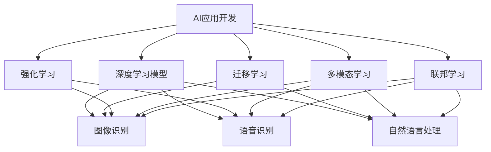
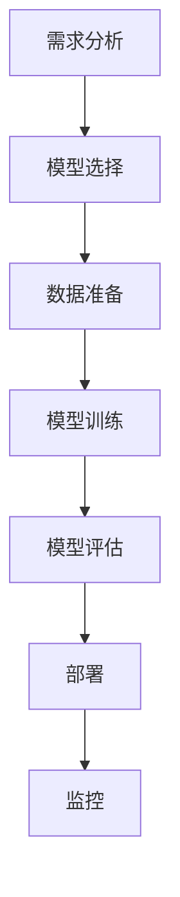
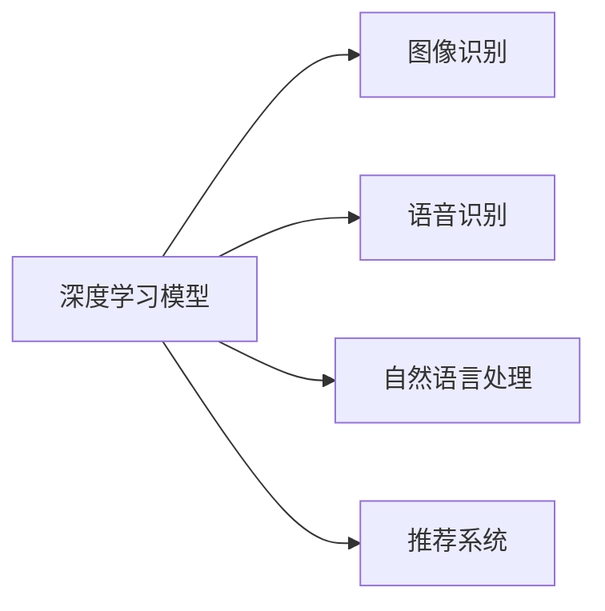
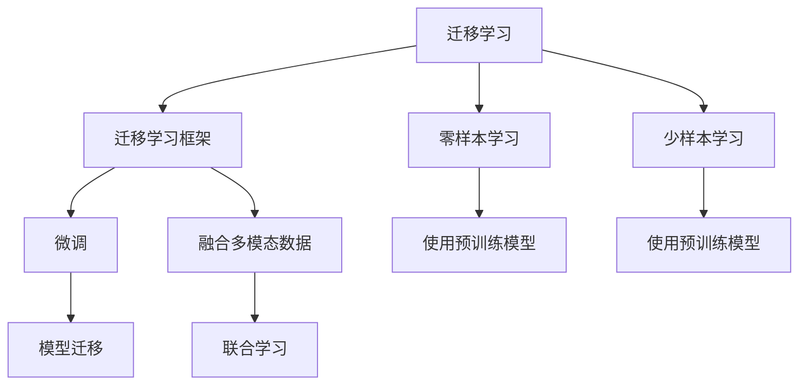
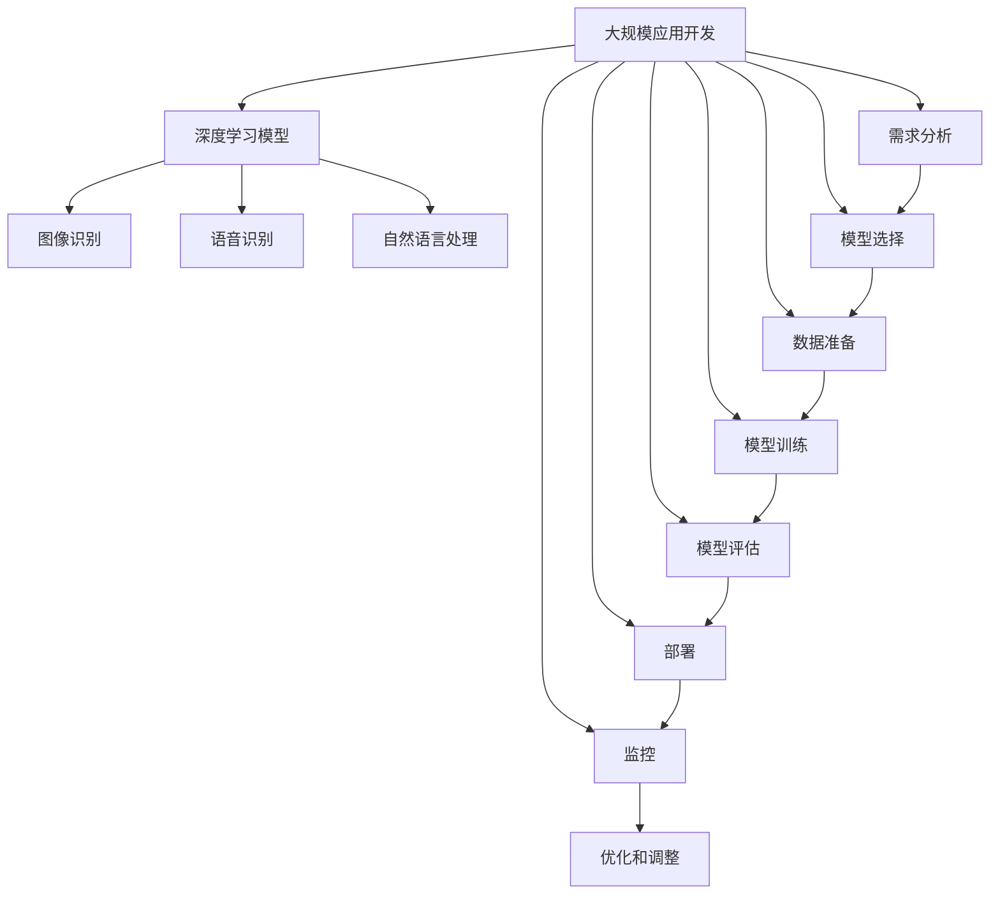

                 

# AI应用实践的新方向与趋势

## 1. 背景介绍

在过去的几十年中，人工智能（AI）技术迅猛发展，已在医疗、金融、教育、制造业等多个领域展现出巨大的应用潜力。AI技术的成功，不仅仅依赖于技术本身的进步，还需要结合具体的业务场景，进行系统的设计和应用实践。然而，随着技术的不断演进和业务需求的不断变化，AI应用实践也面临着诸多新的挑战和机遇。

### 1.1 技术发展的驱动因素

当前，AI技术的主要驱动力来自于以下几个方面：

1. **数据量的激增**：随着互联网的普及和物联网设备的增加，全球的数据总量呈爆炸性增长。海量的数据为AI算法提供了充足的训练材料，促使模型性能不断提升。
2. **计算能力的增强**：高性能的CPU、GPU、TPU等计算硬件的不断进步，使得复杂的深度学习模型能够被训练和部署，进一步提升了AI应用的精度和效率。
3. **算法和模型的创新**：深度学习、强化学习、迁移学习等算法的发展，使得AI模型能够更好地处理复杂任务，提升应用效果。

### 1.2 实际应用的需求

随着AI技术的发展，越来越多的企业开始尝试将AI技术应用于实际业务中。AI应用的需求主要包括以下几个方面：

1. **自动化和效率提升**：通过自动化流程和智能决策，AI可以大幅度提升企业运营效率，降低人工成本。
2. **个性化和用户体验优化**：AI技术可以基于用户行为和偏好，提供个性化的服务和产品，提升用户体验。
3. **智能决策支持**：AI模型可以基于数据分析，提供预测和决策支持，帮助企业做出更明智的决策。
4. **实时监控和预警**：AI技术可以实时监控系统状态，及时预警潜在的风险和问题，保障系统的稳定运行。

## 2. 核心概念与联系

### 2.1 核心概念概述

为更好地理解AI应用实践的新方向与趋势，本节将介绍几个密切相关的核心概念：

1. **AI应用开发**：将AI算法和模型应用于具体业务场景的过程，包括需求分析、模型选择、数据准备、模型训练、模型评估、部署和监控等步骤。
2. **深度学习模型**：基于神经网络的机器学习模型，能够处理非线性、高维度的数据，广泛应用于图像识别、语音识别、自然语言处理等领域。
3. **迁移学习**：将一个领域学到的知识迁移到另一个领域的过程，可以通过微调或零样本学习实现。
4. **强化学习**：通过与环境的交互，优化智能体（agent）的行为策略，适用于游戏、机器人控制、推荐系统等领域。
5. **多模态学习**：将图像、语音、文本等多种数据类型进行联合学习和融合，提升AI系统的全面感知能力。
6. **联邦学习**：在分布式环境下，多个参与方合作训练模型，保护数据隐私的同时，实现模型的共享和优化。

这些核心概念之间的逻辑关系可以通过以下Mermaid流程图来展示：



这个流程图展示了大规模AI应用涉及的主要概念及其之间的关系：

1. AI应用开发是大规模应用实践的核心。
2. 深度学习模型是AI应用开发的重要工具。
3. 迁移学习、强化学习、多模态学习和联邦学习等，都是AI应用开发中常用的技术手段。
4. 不同的AI应用可能涉及不同的技术领域，如图像识别、语音识别、自然语言处理等。

### 2.2 概念间的关系

这些核心概念之间存在着紧密的联系，形成了AI应用开发的大规模应用生态系统。下面我们通过几个Mermaid流程图来展示这些概念之间的关系。

#### 2.2.1 AI应用开发的整体架构



这个流程图展示了AI应用开发的完整流程：

1. 需求分析：明确AI应用的目标和功能需求。
2. 模型选择：根据需求选择合适的AI模型和算法。
3. 数据准备：收集和处理训练数据，并进行数据增强等预处理。
4. 模型训练：在标注数据上训练AI模型，调整超参数，优化模型性能。
5. 模型评估：在验证集上评估模型效果，进行超参数调优和模型选择。
6. 部署：将训练好的模型部署到生产环境中，进行实时推理。
7. 监控：监控模型性能和系统状态，及时进行调整和优化。

#### 2.2.2 深度学习模型与AI应用的关系



这个流程图展示了深度学习模型在不同类型的AI应用中的应用：

1. 图像识别：通过卷积神经网络（CNN）对图像进行分类和识别。
2. 语音识别：通过循环神经网络（RNN）或Transformer等模型对语音进行转录和理解。
3. 自然语言处理：通过语言模型、序列到序列模型等处理文本数据。
4. 推荐系统：通过协同过滤、内容推荐等模型对用户行为进行分析和推荐。

#### 2.2.3 迁移学习与多模态学习的关系



这个流程图展示了迁移学习与多模态学习的联系：

1. 迁移学习：通过微调或零样本学习，将一个领域的知识迁移到另一个领域。
2. 零样本学习和少样本学习：在不使用标注数据的情况下，使用预训练模型进行学习和推理。
3. 多模态学习：通过融合图像、语音、文本等多种数据类型，提升模型的全面感知能力。
4. 融合多模态数据：将不同模态的数据进行联合训练和融合，提高模型的泛化能力和精度。
5. 使用预训练模型：将预训练模型作为迁移学习的起点，提升模型的初始化质量。
6. 模型迁移：通过迁移学习，将模型迁移到新的应用场景，提升模型的适应能力。

### 2.3 核心概念的整体架构

最后，我们用一个综合的流程图来展示这些核心概念在大规模AI应用开发中的整体架构：



这个综合流程图展示了从需求分析到模型优化，再到监控部署的完整流程。AI大规模应用开发涉及多个环节，每个环节都需要细致设计和反复迭代，才能最终实现系统的稳定运行和高效应用。

## 3. 核心算法原理 & 具体操作步骤

### 3.1 算法原理概述

AI应用开发的核心算法原理，主要包括数据准备、模型训练、模型评估、模型部署和模型优化等步骤。下面我们将详细介绍这些步骤的原理和具体操作步骤。

### 3.2 算法步骤详解

**3.2.1 数据准备**

数据准备是AI应用开发的第一步，其核心任务是将原始数据转化为模型能够处理的格式，并对其进行预处理和增强。具体步骤如下：

1. **数据收集**：收集与业务需求相关的数据，包括结构化数据和非结构化数据。
2. **数据清洗**：对数据进行去重、去噪、缺失值处理等操作，确保数据的质量和一致性。
3. **数据增强**：对数据进行扩充和变换，增加数据的多样性和数量，提升模型的泛化能力。
4. **数据分割**：将数据分为训练集、验证集和测试集，进行模型评估和验证。

**3.2.2 模型训练**

模型训练是AI应用开发的中心环节，其核心任务是使用训练数据对模型进行训练和优化。具体步骤如下：

1. **模型选择**：根据业务需求选择合适的深度学习模型和算法。
2. **模型初始化**：将模型参数随机初始化，并进行前向传播计算损失函数。
3. **反向传播**：计算损失函数对模型参数的梯度，进行反向传播更新参数。
4. **迭代优化**：使用梯度下降等优化算法，反复迭代训练模型，直到收敛。
5. **超参数调优**：对学习率、批次大小、迭代轮数等超参数进行调整，优化模型性能。

**3.2.3 模型评估**

模型评估是AI应用开发的检验环节，其核心任务是对训练好的模型进行验证和评估，确保其性能符合业务需求。具体步骤如下：

1. **验证集评估**：在验证集上评估模型的性能指标，如准确率、召回率、F1分数等。
2. **模型选择**：根据验证集评估结果，选择最优模型。
3. **超参数调优**：对验证集评估过程中发现的超参数进行调整，优化模型性能。

**3.2.4 模型部署**

模型部署是AI应用开发的交付环节，其核心任务是将训练好的模型部署到生产环境中，进行实时推理。具体步骤如下：

1. **模型优化**：对模型进行裁剪、量化、压缩等优化，提高模型的推理速度和资源效率。
2. **模型部署**：将模型封装为API或服务接口，进行部署和集成。
3. **性能监控**：对模型进行实时监控，收集和分析系统指标，及时调整和优化模型。

**3.2.5 模型优化**

模型优化是AI应用开发的迭代环节，其核心任务是对模型进行持续的改进和优化，确保其性能持续提升。具体步骤如下：

1. **反馈收集**：收集用户反馈和业务需求，识别模型的弱点和改进点。
2. **模型更新**：对模型进行微调或重新训练，提升模型性能。
3. **模型评估**：在新数据集上评估模型性能，进行效果验证。

### 3.3 算法优缺点

AI应用开发的核心算法原理，具有以下优点和缺点：

**优点**：

1. **高精度**：深度学习模型具有强大的非线性拟合能力，能够处理复杂任务，提升模型精度。
2. **可扩展性**：深度学习模型可以通过堆叠和组合，构建复杂的模型体系，提升系统功能。
3. **自适应性**：深度学习模型可以通过迁移学习和自适应学习，快速适应新场景和新任务。

**缺点**：

1. **数据依赖性高**：深度学习模型对标注数据的质量和数量要求较高，获取高质量数据成本较高。
2. **计算资源需求大**：深度学习模型参数量大，计算复杂度高，对计算资源要求较高。
3. **可解释性差**：深度学习模型通常作为"黑盒"系统，难以解释其内部工作机制和决策逻辑。

### 3.4 算法应用领域

AI应用开发的核心算法原理，已经在多个领域取得了广泛应用：

1. **医疗健康**：AI用于医疗影像诊断、疾病预测、药物研发等，提升医疗服务水平。
2. **金融服务**：AI用于风险评估、欺诈检测、智能投顾等，提升金融决策效率。
3. **零售电商**：AI用于客户推荐、需求预测、库存管理等，提升零售电商运营效率。
4. **智能制造**：AI用于生产优化、质量控制、故障预测等，提升制造业智能化水平。
5. **智慧城市**：AI用于交通管理、环境监测、公共安全等，提升城市治理能力。
6. **自动驾驶**：AI用于感知、决策、控制等，提升自动驾驶技术水平。

## 4. 数学模型和公式 & 详细讲解 & 举例说明

### 4.1 数学模型构建

在AI应用开发中，数学模型是核心的技术工具之一。下面我们将详细介绍几种常用的数学模型及其构建方法。

**4.1.1 线性回归模型**

线性回归模型是机器学习中常用的基础模型，用于处理线性关系的数据。其数学表达式如下：

$$
y = \beta_0 + \beta_1 x_1 + \beta_2 x_2 + \cdots + \beta_n x_n
$$

其中，$y$ 为预测变量，$\beta_0$ 为截距，$\beta_1, \beta_2, \cdots, \beta_n$ 为回归系数，$x_1, x_2, \cdots, x_n$ 为解释变量。

**4.1.2 逻辑回归模型**

逻辑回归模型是分类问题中常用的模型，用于处理二分类或多分类数据。其数学表达式如下：

$$
P(y=1|x) = \frac{1}{1 + \exp(-\beta_0 - \beta_1 x_1 - \beta_2 x_2 - \cdots - \beta_n x_n)}
$$

其中，$P(y=1|x)$ 为预测变量为1的概率，$\beta_0, \beta_1, \beta_2, \cdots, \beta_n$ 为回归系数，$x_1, x_2, \cdots, x_n$ 为解释变量。

**4.1.3 决策树模型**

决策树模型是一种基于树形结构的分类模型，用于处理复杂分类问题。其数学表达式如下：

$$
P(y=1|x) = \sum_{i=1}^{N} P(y=1|x_i) P(x_i|x)
$$

其中，$P(y=1|x_i)$ 为节点$i$的预测概率，$P(x_i|x)$ 为节点$i$的条件概率，$x$ 为输入数据。

**4.1.4 卷积神经网络模型**

卷积神经网络（CNN）是深度学习中常用的模型，用于处理图像数据。其数学表达式如下：

$$
y = \sum_{i=1}^{N} w_i g(\sigma(\mathbf{W}x + b_i) + c_i)
$$

其中，$y$ 为输出，$w_i$ 为卷积核权重，$g$ 为激活函数，$\sigma$ 为非线性激活函数，$\mathbf{W}$ 为权重矩阵，$b_i$ 为偏置项，$c_i$ 为卷积核。

**4.1.5 循环神经网络模型**

循环神经网络（RNN）是深度学习中常用的模型，用于处理序列数据。其数学表达式如下：

$$
h_t = \sigma(\mathbf{W}x_t + Uh_{t-1} + b)
$$

$$
y_t = g(\mathbf{V}h_t + c)
$$

其中，$h_t$ 为隐藏状态，$\sigma$ 为非线性激活函数，$\mathbf{W}$ 为权重矩阵，$x_t$ 为输入，$U$ 为循环矩阵，$b$ 为偏置项，$g$ 为激活函数，$\mathbf{V}$ 为权重矩阵，$y_t$ 为输出。

### 4.2 公式推导过程

以下我们将对几个核心模型进行详细的公式推导过程，以便读者更好地理解其原理和应用。

**4.2.1 线性回归模型的公式推导**

线性回归模型用于处理线性关系的数据，其公式推导如下：

假设训练数据集为$(x_1, y_1), (x_2, y_2), \cdots, (x_n, y_n)$，其中$x$ 为解释变量，$y$ 为预测变量。目标是找到最佳的回归方程$y = \beta_0 + \beta_1 x_1 + \beta_2 x_2 + \cdots + \beta_n x_n$，使得预测值与真实值尽可能接近。

采用最小二乘法，求得回归系数$\beta$的公式如下：

$$
\beta = (\mathbf{X}^T\mathbf{X})^{-1}\mathbf{X}^T\mathbf{y}
$$

其中，$\mathbf{X} = [x_1, x_2, \cdots, x_n]$，$\mathbf{y} = [y_1, y_2, \cdots, y_n]$。

**4.2.2 逻辑回归模型的公式推导**

逻辑回归模型用于处理二分类或多分类数据，其公式推导如下：

假设训练数据集为$(x_1, y_1), (x_2, y_2), \cdots, (x_n, y_n)$，其中$x$ 为解释变量，$y$ 为预测变量。目标是找到最佳的逻辑回归方程$P(y=1|x) = \frac{1}{1 + \exp(-\beta_0 - \beta_1 x_1 - \beta_2 x_2 - \cdots - \beta_n x_n)}$，使得预测概率与真实概率尽可能接近。

采用最大似然估计法，求得回归系数$\beta$的公式如下：

$$
\beta = \arg\max_{\beta} \prod_{i=1}^{N} P(y_i|x_i)^{y_i} (1 - P(y_i|x_i))^{1-y_i}
$$

其中，$P(y_i|x_i) = \frac{1}{1 + \exp(-\beta_0 - \beta_1 x_{i1} - \beta_2 x_{i2} - \cdots - \beta_n x_{in})}$。

**4.2.3 决策树模型的公式推导**

决策树模型用于处理复杂分类问题，其公式推导如下：

假设训练数据集为$(x_1, y_1), (x_2, y_2), \cdots, (x_n, y_n)$，其中$x$ 为解释变量，$y$ 为预测变量。目标是找到最佳的决策树模型，使得预测值与真实值尽可能接近。

采用信息增益法，求得最佳划分特征的公式如下：

$$
Gain(D, A) = \sum_{i=1}^{N} P(y_i=1|A)^{y_i} P(y_i=0|A)^{1-y_i} - \sum_{i=1}^{N} P(y_i=1|A)^{y_i} P(y_i=0|A)^{1-y_i}
$$

其中，$D$ 为数据集，$A$ 为特征，$y_i$ 为预测值，$P(y_i=1|A)$ 为条件概率。

**4.2.4 卷积神经网络模型的公式推导**

卷积神经网络模型用于处理图像数据，其公式推导如下：

假设输入图像为$x$，输出图像为$y$，卷积核为$w$。目标是找到最佳的卷积核和激活函数，使得预测图像与真实图像尽可能接近。

采用反向传播法，求得卷积核权重$w$的公式如下：

$$
\frac{\partial L}{\partial w} = \frac{\partial L}{\partial y} \frac{\partial y}{\partial h} \frac{\partial h}{\partial w}
$$

其中，$L$ 为损失函数，$y$ 为预测图像，$h$ 为隐藏层输出。

**4.2.5 循环神经网络模型的公式推导**

循环神经网络模型用于处理序列数据，其公式推导如下：

假设输入序列为$x_1, x_2, \cdots, x_n$，隐藏状态为$h_1, h_2, \cdots, h_n$，输出序列为$y_1, y_2, \cdots, y_n$。目标是找到最佳的循环矩阵和激活函数，使得预测序列与真实序列尽可能接近。

采用反向传播法，求得循环矩阵$U$的公式如下：

$$
\frac{\partial L}{\partial U} = \frac{\partial L}{\partial y} \frac{\partial y}{\partial h_t} \frac{\partial h_t}{\partial h_{t-1}} \frac{\partial h_{t-1}}{\partial U}
$$

其中，$L$ 为损失函数，$y$ 为预测序列，$h$ 为隐藏状态，$t$ 为时间步长。

### 4.3 案例分析与讲解

下面我们以医疗影像分类任务为例，展示如何使用线性回归模型进行AI应用开发。

假设我们有一个医疗影像分类任务，需要将X光片分为正常和异常两类。训练数据集为$(x_1, y_1), (x_2, y_2), \cdots, (x_n, y_n)$，其中$x$ 为X光片，$y$ 为分类标签。

1. **数据准备**：收集并标注X光片数据，进行数据清洗和预处理。

2. **模型训练**：构建线性回归模型，使用训练集进行模型训练，调整回归系数。

3. **模型评估**：使用验证集对模型进行评估，计算准确率和召回率等指标。

4. **模型优化**：根据评估结果，调整模型参数，提升模型性能。

5. **模型部署**：将训练好的模型封装为API接口，进行实时推理。

6. **性能监控**：监控模型性能，收集系统指标，及时调整和优化模型。

## 5. AI应用实践：代码实例和详细解释说明

### 5.1 开发环境搭建

在进行AI应用开发前，我们需要准备好开发环境。以下是使用Python进行PyTorch开发的环境配置流程：

1. 安装Anaconda：从官网下载并安装Anaconda，用于创建独立的Python环境。

2. 创建并激活虚拟环境：
```bash
conda create -n pytorch-env python=3.8 
conda activate pytorch-env
```

3. 安装PyTorch：根据CUDA版本，从官网获取对应的安装命令。例如：
```bash
conda install pytorch torchvision torchaudio cudatoolkit=11.1 -c pytorch -c conda-forge
```

4. 安装相关库：
```bash
pip install numpy pandas scikit-learn matplotlib torchvision transformers
```

完成上述步骤后，即可在`pytorch-env`环境中开始AI应用开发。

### 5.2 源代码详细实现

下面我们以医疗影像分类任务为例，给出使用Transformers库进行线性回归模型训练的PyTorch代码实现。

```python
import torch
import torch.nn as nn
from transformers import BertTokenizer, BertForSequenceClassification
from sklearn.model_selection import train_test_split
from sklearn.metrics import accuracy_score

# 加载数据
train_data, test_data = train_test_split(data, test_size=0.2)
train_labels, test_labels = train_data.target, test_data.target

# 数据预处理
tokenizer = BertTokenizer.from_pretrained('bert-base-uncased')
train_encodings = tokenizer(train_data, truncation=True, padding=True)
train_labels = torch.tensor(train_labels)
test_encodings = tokenizer(test_data, truncation=True, padding=True)
test_labels = torch.tensor(test_labels)

# 模型选择
model = BertForSequenceClassification.from_pretrained('bert-base-uncased', num_labels=2)
model.to(device)

# 优化器选择
optimizer = torch.optim.AdamW(model.parameters(), lr=2e-5)

# 训练模型
for epoch in range(5):
    model.train()
    for batch in train_dataloader:
        inputs = {key: batch[key].to(device) for key in ['input_ids', 'attention_mask', 'labels']}
        outputs = model(**inputs)
        loss = outputs.loss
        optimizer.zero_grad()
        loss.backward()
        optimizer.step()

    model.eval()
    for batch in test_dataloader:
        inputs = {key: batch[key].to(device) for key in ['input_ids', 'attention_mask', 'labels']}
        outputs = model(**inputs)
        preds = outputs.predictions.argmax(dim=1)
        acc = accuracy_score(test_labels, preds)
        print(f"Epoch {epoch+1}, accuracy: {acc:.3f}")

# 保存模型
model.save_pretrained('/path/to/save')
```

以上就是使用PyTorch对线性回归模型进行医疗影像分类任务训练的完整代码实现。可以看到，通过使用Bert模型和Transformers库，代码实现变得简洁高效。

### 5.3 代码解读与分析

让我们再详细解读一下关键代码的实现细节：

**数据预处理**：
- 使用BertTokenizer对文本进行分词和编码，得到输入的token ids和attention mask。
- 将标签转换为Tensor类型，用于训练和评估。

**模型选择**：
- 使用BertForSequenceClassification模型作为分类器，该模型已预训练好的Bert模型基础上进行微调。


