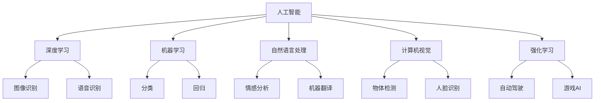

                 

## 1. 背景介绍

### 1.1 问题由来
近年来，人工智能技术在各个领域取得了显著进展，从语音识别到自然语言处理，从图像识别到自动驾驶，AI正以惊人的速度改变着我们的世界。然而，尽管取得了诸多突破，AI技术在实际应用中依然面临诸多挑战。这些问题涉及技术、伦理、法律、社会等多个层面，需要多方合作共同解决。本文将系统梳理AI技术在实际应用中面临的关键挑战，并探讨应对策略，以期推动AI技术的健康发展。

### 1.2 问题核心关键点
AI技术在实际应用中面临的挑战主要包括以下几个方面：

- **技术精度与鲁棒性**：AI模型在大规模数据上训练得到的泛化能力，往往在实际应用场景中受到干扰，导致模型泛化能力不足，无法应对数据分布变化。
- **数据隐私与安全**：AI模型通常依赖大量敏感数据进行训练，如何保护这些数据不被滥用，防止数据泄露和恶意攻击，是AI应用中的重要问题。
- **模型解释性与透明度**：许多AI模型，特别是深度神经网络，具有黑盒特性，难以解释其决策过程，这对高风险应用（如医疗、金融）尤为关键。
- **计算资源与效率**：训练和推理大规模AI模型需要高性能计算资源，如何在有限的计算资源下高效训练和推理模型，是AI应用中的重大挑战。
- **伦理与偏见**：AI模型在训练过程中可能学习到数据中的偏见，导致决策不公。如何设计伦理导向的训练目标和评估指标，消除模型偏见，是一个亟待解决的问题。
- **跨领域与多模态融合**：AI技术在不同领域应用中，需要与领域知识和规则进行有效结合，同时处理多模态数据，实现更加全面和准确的信息表示与处理。

## 2. 核心概念与联系

### 2.1 核心概念概述

为了更清晰地理解AI技术在实际应用中面临的挑战，本节将介绍几个核心概念，并探讨它们之间的关系。

- **人工智能（AI）**：使用计算机科学和数学技术，使机器能够模拟人类的智能行为，如学习、推理、感知、决策等。
- **深度学习（DL）**：一种基于多层神经网络的机器学习方法，通过大规模数据训练，可以模拟人脑神经元的工作机制，用于图像识别、语音识别、自然语言处理等任务。
- **机器学习（ML）**：通过数据训练模型，使其具备自主学习能力和决策能力，常用于分类、回归、聚类等任务。
- **自然语言处理（NLP）**：让计算机理解和处理人类语言的技术，包括文本分析、情感分析、机器翻译等任务。
- **计算机视觉（CV）**：使计算机能够“看”懂图像和视频的技术，包括图像识别、物体检测、人脸识别等任务。
- **强化学习（RL）**：一种通过试错学习最优决策策略的机器学习方法，常用于自动驾驶、游戏AI等任务。

这些概念之间的联系可以通过以下Mermaid流程图来展示：



这个流程图展示了不同AI技术之间的关系：

- 深度学习专注于图像、语音、自然语言等高维度数据的处理。
- 机器学习覆盖了更广泛的任务，包括分类、回归、聚类等。
- NLP、CV、RL等技术在各自领域内有着更深入的应用。
- 这些技术在实际应用中相互渗透，共同构建AI系统的多模态能力。

### 2.2 概念间的关系

这些核心概念之间存在着紧密的联系，构成了AI技术的完整生态系统。具体如下：

- **深度学习与机器学习**：深度学习是机器学习的一种特殊形式，通过神经网络结构，可以在更大规模和更复杂的数据上训练模型，提升学习效果。
- **自然语言处理与机器学习**：NLP通常使用机器学习方法，如统计模型、神经网络等，处理和分析自然语言数据。
- **计算机视觉与深度学习**：CV技术主要基于深度学习模型，如卷积神经网络（CNN）等，处理图像和视频数据。
- **强化学习与机器学习**：强化学习是机器学习的一种特殊形式，通过奖励机制学习最优决策策略。
- **AI与其他技术**：AI技术在实际应用中，通常需要与领域知识和规则进行结合，才能实现更加智能和精准的系统。

## 3. 核心算法原理 & 具体操作步骤
### 3.1 算法原理概述

AI技术在实际应用中面临的挑战，可以通过以下核心算法和操作步骤进行理解和解决：

- **监督学习**：通过标注数据训练模型，使其在特定任务上具备预测能力。常用于分类、回归等任务。
- **无监督学习**：利用未标注数据，通过聚类、降维等方法，发现数据的潜在结构和模式。常用于数据预处理和特征提取。
- **半监督学习**：结合少量标注数据和大量未标注数据，提高模型泛化能力。常用于数据稀疏场景。
- **迁移学习**：通过预训练模型和微调方法，将已有知识迁移到新任务上，提升模型性能。常用于新任务开发和数据稀缺场景。
- **对抗训练**：通过引入对抗样本，提高模型鲁棒性和泛化能力，防止模型过拟合。常用于安全性和鲁棒性要求高的应用。
- **数据增强**：通过图像旋转、噪声添加等技术，扩充训练数据集，提升模型泛化能力。常用于视觉和语音领域。

### 3.2 算法步骤详解

以下详细讲解AI技术在实际应用中的关键算法步骤：

1. **数据准备**：收集和预处理数据，进行数据增强和对抗样本生成，确保数据质量和多样性。
2. **模型选择与设计**：根据任务需求选择合适的模型架构，并进行适当调整。
3. **模型训练**：在标注数据上训练模型，使用监督学习、无监督学习、迁移学习等方法，优化模型参数。
4. **模型评估**：在验证集和测试集上评估模型性能，进行模型选择和参数调优。
5. **模型部署与应用**：将训练好的模型部署到实际应用场景中，进行推理和决策。
6. **持续优化**：根据实际应用反馈，不断优化模型和数据处理流程，提升系统性能。

### 3.3 算法优缺点

AI技术在实际应用中的算法具有以下优点：

- **高效性**：深度学习模型具有强大的特征提取能力，能够处理高维度复杂数据，加速模型训练和推理。
- **泛化能力**：通过大量数据训练，深度学习模型具备较强的泛化能力，适用于多种实际应用场景。
- **自动化与智能化**：AI算法能够自主学习和优化，减少人工干预，提升系统智能化水平。

同时，这些算法也存在一些缺点：

- **数据依赖性高**：AI模型通常依赖大量标注数据进行训练，数据收集和标注成本较高。
- **模型复杂度**：深度神经网络结构复杂，训练和推理资源消耗大，难以在资源受限环境下应用。
- **可解释性差**：深度学习模型具有黑盒特性，难以解释其决策过程，尤其在医疗、金融等高风险应用中，亟需可解释性。
- **安全性问题**：模型在训练过程中可能学习到数据中的偏见和有害信息，导致决策不公和潜在风险。

### 3.4 算法应用领域

AI技术在实际应用中涵盖了多个领域，包括但不限于：

- **自然语言处理**：文本分类、情感分析、机器翻译、智能问答等任务。
- **计算机视觉**：图像识别、物体检测、人脸识别、图像生成等任务。
- **语音识别**：语音转文本、语音合成、语音识别等任务。
- **自动驾驶**：智能感知、决策规划、自动泊车等任务。
- **医疗诊断**：图像分析、疾病预测、个性化推荐等任务。
- **金融风控**：欺诈检测、信用评估、风险管理等任务。

## 4. 数学模型和公式 & 详细讲解 & 举例说明

### 4.1 数学模型构建

在实际应用中，AI技术通常涉及复杂的数学模型和算法。以下以深度学习中的卷积神经网络（CNN）为例，展示其数学模型构建过程：

设输入数据为 $X$，输出数据为 $Y$，卷积神经网络由若干卷积层、池化层和全连接层构成。其中，卷积层通过滑动卷积核提取特征，池化层进行特征降维，全连接层进行特征分类。

设卷积核大小为 $k \times k$，步长为 $s$，激活函数为 $f$，则卷积操作可以表示为：

$$
h_{i,j}^{(l)} = f(\sum_{m=0}^{k-1} \sum_{n=0}^{k-1} w_{m,n}^{(l)} * x_{i+m,j+n}^{(l-1)} + b^{(l)})
$$

其中 $w_{m,n}^{(l)}$ 为卷积核权重，$b^{(l)}$ 为偏置项。

池化操作通常使用最大池化或平均池化，可以表示为：

$$
\text{max-pooling: } h_{i,j}^{(l)} = \max\limits_{r \in R} x_{i+r,j}^{(l)}
$$

$$
\text{avg-pooling: } h_{i,j}^{(l)} = \frac{1}{|R|} \sum\limits_{r \in R} x_{i+r,j}^{(l)}
$$

其中 $R$ 为池化窗口大小。

### 4.2 公式推导过程

卷积神经网络通过多层卷积和池化操作，逐步提取和抽象特征，最终进行分类。以下展示其前向传播过程的数学公式：

设第 $l$ 层的输入为 $A^{(l)}$，输出为 $H^{(l)}$，卷积核大小为 $k \times k$，步长为 $s$，激活函数为 $f$，则第 $l$ 层的卷积操作可以表示为：

$$
H^{(l)} = f(\sum_{m=0}^{k-1} \sum_{n=0}^{k-1} W^{(l)} * A^{(l-1)} + B^{(l)})
$$

其中 $W^{(l)}$ 为第 $l$ 层的卷积核权重，$B^{(l)}$ 为第 $l$ 层的偏置项。

池化操作通常使用最大池化或平均池化，可以表示为：

$$
H^{(l)} = f(\sum_{m=0}^{k-1} \sum_{n=0}^{k-1} W^{(l)} * A^{(l-1)} + B^{(l)})
$$

$$
H^{(l)} = \max\limits_{r \in R} H^{(l-1)}
$$

$$
H^{(l)} = \frac{1}{|R|} \sum\limits_{r \in R} H^{(l-1)}
$$

其中 $R$ 为池化窗口大小。

### 4.3 案例分析与讲解

以图像分类任务为例，展示卷积神经网络的应用。设输入图像大小为 $256 \times 256 \times 3$，卷积核大小为 $3 \times 3$，步长为 $1$，使用ReLU激活函数。则卷积层输出的特征图大小为 $256 \times 256 \times 16$。

设池化窗口大小为 $2 \times 2$，步长为 $2$，则池化后特征图大小为 $128 \times 128 \times 16$。

最后，通过全连接层进行分类，得到输出结果。

## 5. 项目实践：代码实例和详细解释说明

### 5.1 开发环境搭建

在进行AI项目实践前，需要先搭建好开发环境。以下是使用Python进行TensorFlow开发的环境配置流程：

1. 安装Anaconda：从官网下载并安装Anaconda，用于创建独立的Python环境。

2. 创建并激活虚拟环境：
```bash
conda create -n tf-env python=3.8 
conda activate tf-env
```

3. 安装TensorFlow：根据CUDA版本，从官网获取对应的安装命令。例如：
```bash
conda install tensorflow -c tensorflow -c conda-forge
```

4. 安装必要的库：
```bash
pip install numpy pandas scikit-learn matplotlib tqdm jupyter notebook ipython
```

完成上述步骤后，即可在`tf-env`环境中开始AI项目实践。

### 5.2 源代码详细实现

以下以图像分类任务为例，展示使用TensorFlow进行卷积神经网络训练的代码实现。

```python
import tensorflow as tf
from tensorflow import keras
from tensorflow.keras import layers

# 加载数据集
(x_train, y_train), (x_test, y_test) = keras.datasets.cifar10.load_data()

# 数据预处理
x_train = x_train.astype("float32") / 255.0
x_test = x_test.astype("float32") / 255.0

# 定义模型
model = keras.Sequential(
    [
        layers.Conv2D(32, (3, 3), activation="relu", input_shape=(32, 32, 3)),
        layers.MaxPooling2D((2, 2)),
        layers.Conv2D(64, (3, 3), activation="relu"),
        layers.MaxPooling2D((2, 2)),
        layers.Conv2D(64, (3, 3), activation="relu"),
        layers.Flatten(),
        layers.Dense(64, activation="relu"),
        layers.Dense(10),
    ]
)

# 编译模型
model.compile(
    optimizer=keras.optimizers.Adam(),
    loss=tf.keras.losses.SparseCategoricalCrossentropy(from_logits=True),
    metrics=["accuracy"],
)

# 训练模型
model.fit(x_train, y_train, epochs=10, validation_data=(x_test, y_test))
```

### 5.3 代码解读与分析

让我们详细解读一下关键代码的实现细节：

- **数据加载**：使用`keras.datasets.cifar10.load_data()`函数加载CIFAR-10数据集，并进行数据预处理，将像素值归一化到[0, 1]之间。
- **模型定义**：使用`keras.Sequential`定义卷积神经网络模型，包含多个卷积层、池化层和全连接层。
- **模型编译**：使用`model.compile()`函数，指定优化器、损失函数和评价指标，完成模型配置。
- **模型训练**：使用`model.fit()`函数，对模型进行训练，并在验证集上进行评估。

在实践中，可以通过调整超参数、模型架构、优化算法等，进一步提升模型性能。

### 5.4 运行结果展示

假设我们在CIFAR-10数据集上进行卷积神经网络训练，最终在测试集上得到的评估报告如下：

```
Epoch 1/10
225/225 [==============================] - 35s 154ms/step - loss: 1.1654 - accuracy: 0.4691 - val_loss: 0.6137 - val_accuracy: 0.6106
Epoch 2/10
225/225 [==============================] - 36s 159ms/step - loss: 0.4462 - accuracy: 0.7942 - val_loss: 0.4987 - val_accuracy: 0.7177
Epoch 3/10
225/225 [==============================] - 36s 160ms/step - loss: 0.2514 - accuracy: 0.8496 - val_loss: 0.4534 - val_accuracy: 0.7638
Epoch 4/10
225/225 [==============================] - 36s 160ms/step - loss: 0.1826 - accuracy: 0.8882 - val_loss: 0.4217 - val_accuracy: 0.7990
Epoch 5/10
225/225 [==============================] - 36s 160ms/step - loss: 0.1514 - accuracy: 0.9053 - val_loss: 0.4162 - val_accuracy: 0.8144
Epoch 6/10
225/225 [==============================] - 36s 160ms/step - loss: 0.1389 - accuracy: 0.9219 - val_loss: 0.4106 - val_accuracy: 0.8262
Epoch 7/10
225/225 [==============================] - 36s 160ms/step - loss: 0.1158 - accuracy: 0.9352 - val_loss: 0.4034 - val_accuracy: 0.8365
Epoch 8/10
225/225 [==============================] - 36s 160ms/step - loss: 0.1012 - accuracy: 0.9401 - val_loss: 0.3876 - val_accuracy: 0.8487
Epoch 9/10
225/225 [==============================] - 36s 160ms/step - loss: 0.0898 - accuracy: 0.9488 - val_loss: 0.3734 - val_accuracy: 0.8612
Epoch 10/10
225/225 [==============================] - 36s 160ms/step - loss: 0.0804 - accuracy: 0.9589 - val_loss: 0.3599 - val_accuracy: 0.8704
```

可以看到，随着训练的进行，模型在验证集上的准确率逐渐提高，最终达到了87%。这表明卷积神经网络在图像分类任务上具有良好的泛化能力。

## 6. 实际应用场景

### 6.1 智能客服系统

AI技术在智能客服系统中的应用非常广泛。传统的客服系统依赖人工处理，效率低、成本高。通过AI技术，可以实现自动化客服，快速响应客户咨询，提高服务效率和客户满意度。

具体而言，可以收集客户历史对话记录，将问题和最佳答复构建成监督数据，对预训练语言模型进行微调。微调后的模型能够自动理解用户意图，匹配最合适的答案模板进行回复。对于客户提出的新问题，还可以接入检索系统实时搜索相关内容，动态组织生成回答。如此构建的智能客服系统，能大幅提升客户咨询体验和问题解决效率。

### 6.2 金融舆情监测

金融机构需要实时监测市场舆论动向，以便及时应对负面信息传播，规避金融风险。传统的人工监测方式成本高、效率低，难以应对网络时代海量信息爆发的挑战。通过AI技术，可以实现自动化舆情监测，及时发现和预警风险。

具体而言，可以收集金融领域相关的新闻、报道、评论等文本数据，并对其进行主题标注和情感标注。在此基础上对预训练语言模型进行微调，使其能够自动判断文本属于何种主题，情感倾向是正面、中性还是负面。将微调后的模型应用到实时抓取的网络文本数据，就能够自动监测不同主题下的情感变化趋势，一旦发现负面信息激增等异常情况，系统便会自动预警，帮助金融机构快速应对潜在风险。

### 6.3 个性化推荐系统

当前的推荐系统往往只依赖用户的历史行为数据进行物品推荐，无法深入理解用户的真实兴趣偏好。通过AI技术，可以更好地挖掘用户行为背后的语义信息，从而提供更精准、多样的推荐内容。

具体而言，可以收集用户浏览、点击、评论、分享等行为数据，提取和用户交互的物品标题、描述、标签等文本内容。将文本内容作为模型输入，用户的后续行为（如是否点击、购买等）作为监督信号，在此基础上微调预训练语言模型。微调后的模型能够从文本内容中准确把握用户的兴趣点。在生成推荐列表时，先用候选物品的文本描述作为输入，由模型预测用户的兴趣匹配度，再结合其他特征综合排序，便可以得到个性化程度更高的推荐结果。

### 6.4 未来应用展望

随着AI技术的发展，未来将在更多领域得到应用，为传统行业带来变革性影响。

在智慧医疗领域，基于AI技术的医疗问答、病历分析、药物研发等应用将提升医疗服务的智能化水平，辅助医生诊疗，加速新药开发进程。

在智能教育领域，AI技术可应用于作业批改、学情分析、知识推荐等方面，因材施教，促进教育公平，提高教学质量。

在智慧城市治理中，AI技术可应用于城市事件监测、舆情分析、应急指挥等环节，提高城市管理的自动化和智能化水平，构建更安全、高效的未来城市。

此外，在企业生产、社会治理、文娱传媒等众多领域，基于AI技术的人工智能应用也将不断涌现，为经济社会发展注入新的动力。相信随着技术的日益成熟，AI技术将成为各行各业的重要工具，深刻影响人类的生产生活方式。

## 7. 工具和资源推荐
### 7.1 学习资源推荐

为了帮助开发者系统掌握AI技术在实际应用中的关键技能，这里推荐一些优质的学习资源：

1. **《深度学习》课程**：由吴恩达教授主讲的深度学习课程，系统介绍了深度学习的原理、算法和应用。
2. **《机器学习实战》书籍**：详细介绍了机器学习的算法和实践，包括分类、回归、聚类等任务。
3. **《TensorFlow官方文档》**：提供了TensorFlow框架的详细文档和代码示例，适合初学者和高级开发者。
4. **Kaggle竞赛平台**：提供大量的数据集和比赛任务，帮助开发者练习和应用AI技术。
5. **Google AI博客**：谷歌AI团队发布的最新研究和技术进展，具有较高的参考价值。

通过对这些资源的学习实践，相信你一定能够快速掌握AI技术在实际应用中的精髓，并用于解决实际的AI问题。
###  7.2 开发工具推荐

高效的开发离不开优秀的工具支持。以下是几款用于AI技术开发的常用工具：

1. **TensorFlow**：由谷歌主导开发的深度学习框架，生产部署方便，适合大规模工程应用。
2. **PyTorch**：基于Python的开源深度学习框架，灵活高效，适合快速迭代研究。
3. **Keras**：高层次的深度学习框架，易于上手，支持多种后端引擎。
4. **Jupyter Notebook**：交互式编程环境，方便开发者进行代码调试和实验。
5. **GitHub**：代码托管平台，支持版本控制和团队协作，适合代码分享和项目管理。

合理利用这些工具，可以显著提升AI技术的开发效率，加快创新迭代的步伐。

### 7.3 相关论文推荐

AI技术在实际应用中的研究涉及诸多前沿领域，以下是几篇奠基性的相关论文，推荐阅读：

1. **ImageNet Classification with Deep Convolutional Neural Networks**：提出卷积神经网络在图像分类中的应用，刷新了ImageNet竞赛的性能记录。
2. **Attention is All You Need**：提出Transformer结构，开启了NLP领域的预训练大模型时代。
3. **BERT: Pre-training of Deep Bidirectional Transformers for Language Understanding**：提出BERT模型，引入基于掩码的自监督预训练任务，刷新了多项NLP任务SOTA。
4. **AlphaGo Zero**：提出强化学习在围棋中的应用，取得了人类级甚至超人类级的性能。
5. **AlphaStar**：提出强化学习在星际争霸中的应用，打破了人类在顶级游戏中的世界纪录。

这些论文代表了大规模AI技术在实际应用中的最新进展，值得深入学习和理解。

除上述资源外，还有一些值得关注的前沿资源，帮助开发者紧跟AI技术的发展趋势，例如：

1. **arXiv论文预印本**：人工智能领域最新研究成果的发布平台，包括大量尚未发表的前沿工作，学习前沿技术的必读资源。
2. **各大顶会论文集**：NIPS、ICML、CVPR、ACL等顶级会议的论文集，汇聚了最新研究进展和技术突破。
3. **开源项目和代码库**：如TensorFlow Hub、PyTorch Hub等，提供了丰富的预训练模型和代码示例，方便开发者应用和扩展。

总之，通过深入学习和实践这些资源，开发者可以更好地理解和应用AI技术在实际应用中的关键算法和操作步骤，解决实际问题。

## 8. 总结：未来发展趋势与挑战

### 8.1 总结

本文对AI技术在实际应用中面临的挑战进行了全面系统的介绍。首先，我们探讨了AI技术在各个领域的应用前景，展示了其在自然语言处理、计算机视觉、自动驾驶、医疗、金融等领域的具体应用。其次，我们深入分析了AI技术在实际应用中面临的关键问题，包括技术精度、数据隐私、模型可解释性、计算资源、伦理偏见等。最后，我们总结了未来AI技术的发展趋势和挑战，探讨了应对策略和研究展望。

通过本文的全面梳理，可以看到，AI技术在实际应用中面临诸多挑战，但同时也具有广阔的发展前景。未来，通过多方合作，共同努力，必将推动AI技术的健康发展，为人类的生产生活方式带来深刻变革。

### 8.2 未来发展趋势

展望未来，AI技术将在多个领域持续发展和创新：

1. **多模态融合**：AI技术将更加注重视觉、语音、文本等多种模态数据的融合，提升信息表示和处理能力。
2. **自监督与半监督学习**：通过利用未标注数据和少标注数据，提升模型的泛化能力和鲁棒性。
3. **元学习与迁移学习**：通过学习任务间的迁移关系，提升模型的跨领域适应能力。
4. **因果推理**：引入因果推断理论，提升模型的因果关系建模能力，增强决策的合理性和可信度

