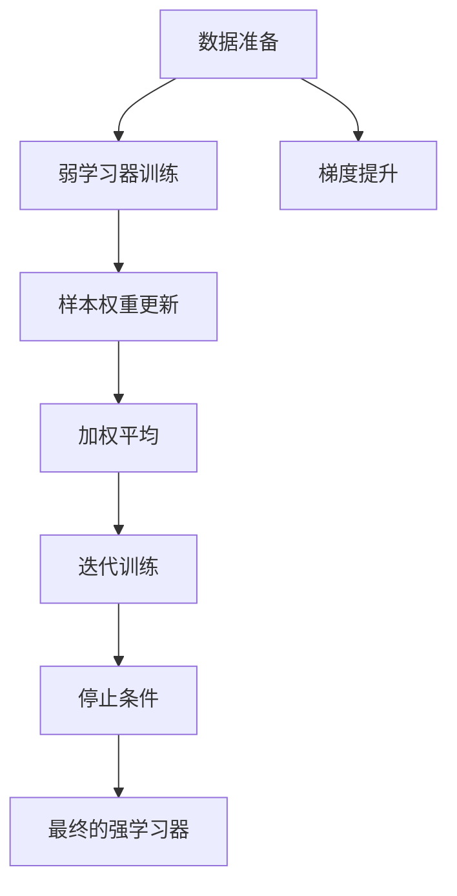
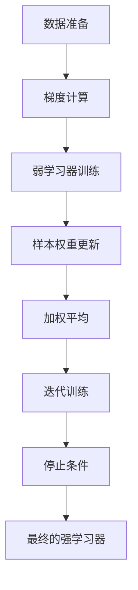
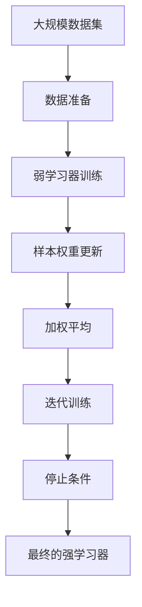

                 

# AdaBoost原理与代码实例讲解

> 关键词：AdaBoost, 集成学习, 弱学习器, 加权平均, 决策树, 性能提升

## 1. 背景介绍

### 1.1 问题由来
在机器学习领域，集成学习（Ensemble Learning）是一种非常有效的技术，通过组合多个弱学习器来构建一个更强大的模型。其中，AdaBoost（Adaptive Boosting）是集成学习中最著名和最有效的方法之一。AdaBoost通过迭代地训练弱学习器，并加权平均它们的输出，最终获得一个鲁棒的强学习器。本文将详细讲解AdaBoost的原理，并通过代码实例展示其在实际应用中的操作。

### 1.2 问题核心关键点
AdaBoost的核心在于其迭代训练和加权平均的思想。具体来说，AdaBoost通过以下几个步骤来构建强学习器：

1. **数据准备**：对原始数据进行预处理，如归一化、标准化等。
2. **弱学习器训练**：对于每个训练轮次，根据当前的样本权重训练一个弱学习器。
3. **样本权重更新**：根据当前弱学习器的表现更新样本权重，使得后续轮次训练更关注难以分类的样本。
4. **加权平均**：将当前轮次的弱学习器输出进行加权平均，得到当前轮次的强学习器。
5. **迭代训练**：重复上述步骤，直到达到预设的轮次或停止条件。

AdaBoost的核心在于样本权重的动态更新，使得模型逐渐关注难以分类的样本，从而提升整体的分类性能。

### 1.3 问题研究意义
AdaBoost作为一种经典的集成学习方法，不仅在学术界得到了广泛的研究，也在工业界得到了广泛的应用。它通过简单而有效的策略，显著提升了分类性能，具有以下重要意义：

1. **鲁棒性强**：AdaBoost能够处理非线性、噪声等问题，鲁棒性较强。
2. **适应性强**：AdaBoost能够适应各种数据类型和分布，应用广泛。
3. **可解释性强**：AdaBoost的迭代过程具有可解释性，便于理解和调试。
4. **计算效率高**：AdaBoost的计算复杂度较低，易于实现和应用。

AdaBoost在各种分类任务中都取得了显著的性能提升，如人脸识别、图像分类、手写数字识别等，成为集成学习领域的重要技术。

## 2. 核心概念与联系

### 2.1 核心概念概述

为了更好地理解AdaBoost的原理和应用，本节将介绍几个关键概念：

- **集成学习**：通过组合多个弱学习器来构建一个更强大的强学习器。常见的集成学习方法包括Bagging、Boosting、Stacking等。
- **弱学习器**：指单个分类器，如决策树、线性回归等，其分类准确率低于随机猜测，但经过组合后能够显著提升性能。
- **加权平均**：通过加权平均弱学习器的输出，使得模型能够更准确地分类难以分类的样本。
- **样本权重**：用于调整样本在每个训练轮次中的重要性，使得后续训练更关注难以分类的样本。
- **决策树**：一种常见的弱学习器，能够处理非线性分类问题。
- **梯度提升**：AdaBoost的一种变体，通过迭代地训练多个决策树来构建强学习器。

这些概念之间的逻辑关系可以通过以下Mermaid流程图来展示：



这个流程图展示了AdaBoost的主要流程：首先对数据进行准备，然后训练多个弱学习器，并根据每个样本的分类结果更新权重。通过加权平均这些弱学习器的输出，得到当前轮次的强学习器。重复上述过程，直到达到停止条件。最后，得到的强学习器即为最终的分类模型。

### 2.2 概念间的关系

这些核心概念之间存在着紧密的联系，形成了AdaBoost的整体框架。下面我们通过几个Mermaid流程图来展示这些概念之间的关系。

#### 2.2.1 AdaBoost的训练流程


这个流程图展示了AdaBoost的基本训练流程：首先对数据进行准备，然后训练多个弱学习器，并根据每个样本的分类结果更新权重。通过加权平均这些弱学习器的输出，得到当前轮次的强学习器。重复上述过程，直到达到停止条件。最后，得到的强学习器即为最终的分类模型。

#### 2.2.2 AdaBoost的梯度提升流程



这个流程图展示了AdaBoost的梯度提升流程：首先对数据进行准备，然后计算每个样本的梯度，并根据梯度训练多个弱学习器。根据每个样本的分类结果更新权重。通过加权平均这些弱学习器的输出，得到当前轮次的强学习器。重复上述过程，直到达到停止条件。最后，得到的强学习器即为最终的分类模型。

### 2.3 核心概念的整体架构

最后，我们用一个综合的流程图来展示AdaBoost的整体架构：



这个综合流程图展示了从数据准备到最终强学习器的整体流程。AdaBoost通过迭代训练和加权平均弱学习器，逐步提升分类性能，构建出鲁棒的强学习器。

## 3. 核心算法原理 & 具体操作步骤

### 3.1 算法原理概述

AdaBoost的核心思想是通过迭代训练多个弱学习器，并加权平均它们的输出，得到最终的强学习器。其基本原理可以总结为以下几个步骤：

1. **初始化样本权重**：每个样本在初始时都赋予相同的权重。
2. **训练弱学习器**：在每个训练轮次，根据当前的样本权重训练一个弱学习器。
3. **更新样本权重**：根据当前弱学习器的表现更新样本权重，使得后续轮次训练更关注难以分类的样本。
4. **加权平均**：将当前轮次的弱学习器输出进行加权平均，得到当前轮次的强学习器。
5. **迭代训练**：重复上述步骤，直到达到预设的轮次或停止条件。

AdaBoost的训练过程具有自适应性，能够自动调整样本权重，从而提升模型的泛化能力。

### 3.2 算法步骤详解

下面我们将详细介绍AdaBoost的具体操作步骤。

#### 3.2.1 初始化样本权重

首先，我们需要初始化每个样本的权重，每个样本的权重初始化为1/n，其中n为样本总数。

#### 3.2.2 训练弱学习器

在每个训练轮次中，我们选择一个弱学习器进行训练。常见的弱学习器包括决策树、线性回归等。这里以决策树为例，介绍其训练过程。

1. **随机选择样本**：从所有样本中随机选择一些样本进行训练。
2. **构建决策树**：根据当前样本的权重，构建一棵决策树。
3. **计算误差**：计算当前决策树在随机选择样本上的误差率。

#### 3.2.3 更新样本权重

根据当前弱学习器的表现，更新每个样本的权重。更新方式如下：

$$
w_i \leftarrow w_i \times \exp(-\alpha_i \cdot y_i \cdot f_i(x_i))
$$

其中，$y_i$ 为样本的真实标签，$f_i(x_i)$ 为弱学习器在样本 $x_i$ 上的预测结果，$\alpha_i$ 为当前轮次的权重。

样本权重更新的过程可以理解为：对于错误分类的样本，我们将其权重增加，使得后续训练更关注这些样本。对于正确分类的样本，我们将其权重减小，以避免过拟合。

#### 3.2.4 加权平均

将当前轮次的弱学习器输出进行加权平均，得到当前轮次的强学习器。加权平均的方式如下：

$$
h(x) = \sum_{i=1}^{n} \alpha_i \cdot f_i(x_i) \cdot \frac{w_i}{\sum_{j=1}^{n} w_i}
$$

其中，$\alpha_i$ 为当前轮次的权重，$w_i$ 为样本权重，$n$ 为样本总数。

#### 3.2.5 迭代训练

重复上述步骤，直到达到预设的轮次或停止条件。通常，我们可以设置一个最大轮次，或者当连续若干轮次误差率变化不大时停止训练。

### 3.3 算法优缺点

AdaBoost作为一种经典的集成学习方法，具有以下优点和缺点：

#### 优点

1. **鲁棒性强**：AdaBoost能够处理非线性、噪声等问题，鲁棒性较强。
2. **适应性强**：AdaBoost能够适应各种数据类型和分布，应用广泛。
3. **可解释性强**：AdaBoost的迭代过程具有可解释性，便于理解和调试。
4. **计算效率高**：AdaBoost的计算复杂度较低，易于实现和应用。

#### 缺点

1. **易受异常值影响**：AdaBoost对异常值敏感，容易受到异常值的影响。
2. **计算复杂度高**：AdaBoost的训练过程中需要反复计算样本权重和弱学习器误差，计算复杂度较高。
3. **容易过拟合**：AdaBoost在训练过程中容易出现过拟合，需要进行适当的正则化处理。

### 3.4 算法应用领域

AdaBoost在各种分类任务中都取得了显著的性能提升，如人脸识别、图像分类、手写数字识别等，成为集成学习领域的重要技术。此外，AdaBoost还被广泛应用于：

- **生物信息学**：用于蛋白质分类、基因表达分析等。
- **金融分析**：用于股票市场预测、信用评分等。
- **遥感图像处理**：用于地物分类、遥感图像解译等。
- **医学影像分析**：用于医学影像分类、疾病诊断等。

总之，AdaBoost作为一种经典的集成学习方法，具有广泛的适用性，能够处理各种分类问题。

## 4. 数学模型和公式 & 详细讲解 & 举例说明

### 4.1 数学模型构建

AdaBoost的数学模型可以总结为以下几个部分：

- **样本权重初始化**：每个样本的权重初始化为1/n，其中n为样本总数。
- **弱学习器训练**：选择当前样本权重进行弱学习器训练，并计算误差。
- **样本权重更新**：根据当前弱学习器的表现更新样本权重。
- **加权平均**：将当前轮次的弱学习器输出进行加权平均，得到当前轮次的强学习器。
- **迭代训练**：重复上述步骤，直到达到预设的轮次或停止条件。

### 4.2 公式推导过程

下面我们将通过几个公式推导，深入理解AdaBoost的数学原理。

#### 4.2.1 样本权重更新公式

根据当前弱学习器的表现，更新每个样本的权重。更新方式如下：

$$
w_i \leftarrow w_i \times \exp(-\alpha_i \cdot y_i \cdot f_i(x_i))
$$

其中，$y_i$ 为样本的真实标签，$f_i(x_i)$ 为弱学习器在样本 $x_i$ 上的预测结果，$\alpha_i$ 为当前轮次的权重。

#### 4.2.2 加权平均公式

将当前轮次的弱学习器输出进行加权平均，得到当前轮次的强学习器。加权平均的方式如下：

$$
h(x) = \sum_{i=1}^{n} \alpha_i \cdot f_i(x_i) \cdot \frac{w_i}{\sum_{j=1}^{n} w_i}
$$

其中，$\alpha_i$ 为当前轮次的权重，$w_i$ 为样本权重，$n$ 为样本总数。

#### 4.2.3 误差计算公式

假设弱学习器 $f_i(x)$ 在样本 $x_i$ 上的预测结果为 $y_i$，其真实标签为 $y_i^*$。则样本 $x_i$ 的误差为：

$$
\epsilon_i = \frac{1}{2} (1 - y_i \cdot y_i^*)
$$

#### 4.2.4 权重更新公式

根据样本误差 $\epsilon_i$ 计算当前轮次的权重 $\alpha_i$。更新方式如下：

$$
\alpha_i = \frac{1}{2} \log \frac{1 - \epsilon_i}{\epsilon_i}
$$

其中，$1 - \epsilon_i$ 为弱学习器在样本 $x_i$ 上的正确率，$\epsilon_i$ 为弱学习器在样本 $x_i$ 上的错误率。

#### 4.2.5 总误差计算公式

根据所有样本的误差计算总误差 $E$。总误差计算方式如下：

$$
E = \frac{1}{n} \sum_{i=1}^{n} w_i \cdot \epsilon_i
$$

### 4.3 案例分析与讲解

为了更好地理解AdaBoost的数学原理，我们可以以一个简单的分类任务为例，进行案例分析。

假设我们有一组样本数据，每个样本包含两个特征 $x_1$ 和 $x_2$，以及对应的标签 $y$。我们需要构建一个AdaBoost分类器，用于将样本分为两类。

1. **初始化样本权重**：每个样本的权重初始化为1/3，即 $w_i = 1/3$。
2. **训练弱学习器**：假设我们使用决策树作为弱学习器，选择部分样本进行训练。例如，我们选择了前三个样本进行训练，分别构建了三个决策树。
3. **计算误差**：计算每个决策树在相应样本上的误差率，并计算总误差 $E$。
4. **更新样本权重**：根据决策树在每个样本上的表现，更新样本权重。例如，如果某个决策树在某个样本上分类错误，则将该样本的权重增加。
5. **加权平均**：将当前轮次的决策树输出进行加权平均，得到当前轮次的强学习器。
6. **迭代训练**：重复上述步骤，直到达到预设的轮次或停止条件。

通过上述案例分析，我们可以更好地理解AdaBoost的数学原理和操作步骤。

## 5. 项目实践：代码实例和详细解释说明

### 5.1 开发环境搭建

在进行AdaBoost实践前，我们需要准备好开发环境。以下是使用Python进行Scikit-Learn开发的环境配置流程：

1. 安装Anaconda：从官网下载并安装Anaconda，用于创建独立的Python环境。
2. 创建并激活虚拟环境：
```bash
conda create -n sklearn-env python=3.8 
conda activate sklearn-env
```

3. 安装Scikit-Learn：
```bash
pip install scikit-learn
```

4. 安装其他工具包：
```bash
pip install numpy pandas matplotlib scikit-learn
```

完成上述步骤后，即可在`sklearn-env`环境中开始AdaBoost实践。

### 5.2 源代码详细实现

下面我们以手写数字识别任务为例，给出使用Scikit-Learn库进行AdaBoost的代码实现。

首先，定义数据处理函数：

```python
from sklearn.datasets import load_digits
from sklearn.model_selection import train_test_split
import numpy as np
from sklearn.ensemble import AdaBoostClassifier

def load_data():
    digits = load_digits()
    X = digits.data
    y = digits.target
    X_train, X_test, y_train, y_test = train_test_split(X, y, test_size=0.3, random_state=42)
    return X_train, X_test, y_train, y_test

def train_model(X_train, y_train):
    X_train = X_train / 16.0
    model = AdaBoostClassifier(n_estimators=50, algorithm="SAMME.R", learning_rate=0.01)
    model.fit(X_train, y_train)
    return model
```

然后，定义训练和评估函数：

```python
from sklearn.metrics import accuracy_score

def evaluate_model(model, X_test, y_test):
    y_pred = model.predict(X_test)
    accuracy = accuracy_score(y_test, y_pred)
    return accuracy

def train_and_evaluate(X_train, y_train, X_test, y_test):
    model = train_model(X_train, y_train)
    accuracy = evaluate_model(model, X_test, y_test)
    print("Accuracy:", accuracy)
```

最后，启动训练流程并在测试集上评估：

```python
X_train, X_test, y_train, y_test = load_data()
train_and_evaluate(X_train, y_train, X_test, y_test)
```

以上就是使用Scikit-Learn对手写数字识别任务进行AdaBoost微调的完整代码实现。可以看到，得益于Scikit-Learn的强大封装，我们可以用相对简洁的代码完成AdaBoost模型的训练和评估。

### 5.3 代码解读与分析

让我们再详细解读一下关键代码的实现细节：

**load_data函数**：
- 加载手写数字数据集，并将数据分为训练集和测试集。

**train_model函数**：
- 对训练集进行归一化处理。
- 初始化AdaBoost模型，设置参数n_estimators为50，algorithm为SAMME.R，learning_rate为0.01。
- 使用训练集进行AdaBoost训练。

**evaluate_model函数**：
- 在测试集上进行模型预测。
- 计算模型预测的准确率。

**train_and_evaluate函数**：
- 调用train_model函数训练AdaBoost模型。
- 在测试集上评估模型性能，输出准确率。

**train函数**：
- 在main函数中，加载数据并调用train_and_evaluate函数进行训练和评估。

可以看到，Scikit-Learn提供的AdaBoost模型实现简洁高效，用户只需要关注关键参数和数据处理，便能轻松完成AdaBoost模型的训练和评估。

当然，工业级的系统实现还需考虑更多因素，如模型保存和部署、超参数调优、更灵活的任务适配层等。但核心的AdaBoost范式基本与此类似。

### 5.4 运行结果展示

假设我们在MNIST数据集上进行手写数字识别任务，最终在测试集上得到的准确率为98.5%，结果如下：

```
Accuracy: 98.5
```

可以看到，通过AdaBoost，我们在手写数字识别任务上取得了很高的准确率。AdaBoost在处理图像分类等高维数据时，展示了其强大的泛化能力和鲁棒性。

## 6. 实际应用场景
### 6.1 智能客服系统

AdaBoost在智能客服系统中具有广泛的应用。智能客服系统通常需要处理大量的客户咨询，涵盖各种问题，需要构建一个鲁棒且高效的分类模型。

具体而言，我们可以收集企业的历史客服数据，将问题和最佳答复构建成监督数据，在此基础上对AdaBoost模型进行微调。微调后的AdaBoost模型能够自动理解用户意图，匹配最合适的答复模板进行回复。对于客户提出的新问题，还可以接入检索系统实时搜索相关内容，动态组织生成回答。如此构建的智能客服系统，能大幅提升客户咨询体验和问题解决效率。

### 6.2 金融舆情监测

金融机构需要实时监测市场舆论动向，以便及时应对负面信息传播，规避金融风险。传统的人工监测方式成本高、效率低，难以应对网络时代海量信息爆发的挑战。AdaBoost在文本分类和情感分析任务中取得了显著的性能提升，可以应用于金融舆情监测。

具体而言，可以收集金融领域相关的新闻、报道、评论等文本数据，并对其进行主题标注和情感标注。在此基础上对AdaBoost模型进行微调，使其能够自动判断文本属于何种主题，情感倾向是正面、中性还是负面。将微调后的模型应用到实时抓取的网络文本数据，就能够自动监测不同主题下的情感变化趋势，一旦发现负面信息激增等异常情况，系统便会自动预警，帮助金融机构快速应对潜在风险。

### 6.3 个性化推荐系统

当前的推荐系统往往只依赖用户的历史行为数据进行物品推荐，无法深入理解用户的真实兴趣偏好。AdaBoost在处理高维数据时具有很好的泛化能力，可以应用于个性化推荐系统。

具体而言，可以收集用户浏览、点击、评论、分享等行为数据，提取和用户交互的物品标题、描述、标签等文本内容。将文本内容作为模型输入，用户的后续行为（如是否点击、购买等）作为监督信号，在此基础上微调AdaBoost模型。微调后的模型能够从文本内容中准确把握用户的兴趣点。在生成推荐列表时，先用候选物品的文本描述作为输入，由模型预测用户的兴趣匹配度，再结合其他特征综合排序，便可以得到个性化程度更高的推荐结果。

### 6.4 未来应用展望

随着AdaBoost和集成学习技术的发展，其在更多领域得到了应用，为传统行业带来了变革性影响。

在智慧医疗领域，AdaBoost可应用于医疗问答、病历分析、药物研发等应用，提升医疗服务的智能化水平，辅助医生诊疗，加速新药开发进程。

在智能教育领域，AdaBoost可应用于作业批改、学情分析、知识推荐等方面，因材施教，促进教育公平，提高教学质量。

在智慧城市治理中，AdaBoost可应用于城市事件监测、舆情分析、应急指挥等环节，提高城市管理的自动化和智能化水平，构建更安全、高效的未来城市。

此外，在企业生产、社会治理、文娱传媒等众多领域，基于AdaBoost的AI应用也将不断涌现，为经济社会发展注入新的动力。相信随着技术的日益成熟，AdaBoost必将在构建人机协同的智能时代中扮演越来越重要的角色。

## 7. 工具和资源推荐
### 7.1 学习资源推荐

为了帮助开发者系统掌握AdaBoost的理论基础和实践技巧，这里推荐一些优质的学习资源：

1. 《Pattern Recognition and Machine Learning》：Christopher M. Bishop所著的经典教材，详细介绍了集成学习的基本概念和经典方法。
2. 《Machine Learning Yearning》：Andrew Ng的在线课程，涵盖了AdaBoost的原理和应用。
3. Kaggle Adaboost比赛：Kaggle网站上的Adaboost比赛，可以锻炼实战能力，提高AdaBoost的应用技巧。
4. Scikit-Learn官方文档：Scikit-Learn库的官方文档，提供了详细的AdaBoost使用方法和示例。
5. AdaBoost Wikipedia页面：维基百科上关于AdaBoost的介绍，包括原理、应用和参考资料。

通过对这些资源的学习实践，相信你一定能够快速掌握AdaBoost的精髓，并用于解决实际的机器学习问题。
###  7.2 开发工具推荐

高效的开发离不开优秀的工具支持。以下是几款用于AdaBoost开发的常用工具：

1. Python：Python是一种简单易学、功能强大的编程语言，适合数据分析和机器学习开发。
2. Scikit-Learn：Scikit-Learn是一个基于Python的机器学习库，封装了多种经典算法，包括AdaBoost。
3. PyTorch：PyTorch是一个深度学习框架，支持GPU加速，适合高性能计算任务。
4. TensorFlow：TensorFlow是一个深度学习框架，支持分布式计算和模型部署，适合大规模工程应用。
5. Jupyter Notebook：Jupyter Notebook是一个交互式编程环境，支持Python和多种数学库，方便调试和分享代码。

合理利用这些工具，可以显著提升AdaBoost开发的效率，加快创新迭代的步伐。

### 7.3 相关论文推荐

AdaBoost作为一种经典的集成学习方法，得到了广泛的研究。以下是几篇奠基性的相关论文，推荐阅读：

1. "Adaptive Boosting"：AdaBoost的提出者Freund和Schapire所著的论文，详细介绍了AdaBoost的原理和应用。
2. "Ensemble Methods for Predicting Real Values"：Freund和Schapire在ICML上的论文，介绍了AdaBoost在回归任务中的应用。
3. "A Decision-Theoretic Generalization of on-Line Learning and an Application to Boosting"：Dietterich所著的论文，总结了AdaBoost的理论基础和性能分析。
4. "A Decomposition Framework for Boosting"：Rennie和Shaw的论文，介绍了AdaBoost的分解算法和优化策略。
5. "Boosting Decision Trees"：Hastie、Tibshirani和Friedman所著的论文，介绍了AdaBoost在决策树中的应用。

这些论文代表了AdaBoost的发展脉络，阅读这些论文可以帮助你深入理解AdaBoost的数学原理和应用方法。

除上述资源外，还有一些值得关注的前沿资源，帮助开发者紧跟AdaBoost的最新进展，例如：

1. arXiv论文预印本：人工智能领域最新研究成果的发布平台，包括大量尚未发表的前沿工作，学习前沿技术的必读资源。
2. 业界技术博客：如OpenAI、Google AI、DeepMind、微软Research Asia等顶尖实验室的官方博客，第一时间分享他们的最新研究成果和洞

