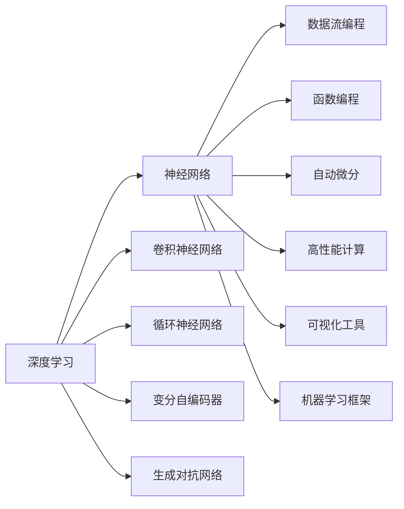

                 

# Andrej Karpathy谈AI编程的新范式

> 关键词：深度学习,编程范式,神经网络,计算机视觉,自然语言处理,强化学习,自动化,认知心理学,未来趋势

## 1. 背景介绍

### 1.1 问题由来

随着人工智能(AI)技术的发展，深度学习成为了AI研究的主流。从早期的神经网络，到后来的卷积神经网络(CNN)、循环神经网络(RNN)、变分自编码器(VAE)、生成对抗网络(GAN)等，深度学习技术在图像识别、语音识别、自然语言处理、游戏AI、自动驾驶等多个领域取得了重大突破。然而，随着模型规模的不断扩大，训练和推理的复杂度也在不断增加，使得深度学习编程变得更加繁琐和难以维护。

### 1.2 问题核心关键点

在深度学习的发展过程中，编程范式已经从传统的基于数据流向基于函数的编程，逐渐演变成基于算子的编程。这种编程范式虽然能够灵活应对复杂模型，但同时也带来了编程的复杂性和难以维护的问题。当前，AI编程领域亟需一种新的编程范式，能够更简洁、更高效地实现深度学习模型的构建和优化。

## 2. 核心概念与联系

### 2.1 核心概念概述

为了探讨AI编程的新范式，本文将介绍一些关键概念：

- **深度学习**：一种基于神经网络的机器学习技术，通过多层非线性变换实现复杂的特征表示和分类任务。
- **编程范式**：一种编程风格和结构，决定了程序的基本框架和逻辑。
- **算子**：深度学习模型中的基本计算单元，如卷积、池化、循环神经网络等。
- **数据流编程**：一种基于数据流的编程方式，数据从输入流经过中间流，最终到达输出流。
- **函数编程**：一种基于函数的编程方式，数据通过函数调用传递。
- **自动微分**：通过自动求导算法，自动计算和传递梯度，简化模型的反向传播。
- **高性能计算**：包括GPU、TPU等硬件加速器，以及分布式训练等技术，提高深度学习模型的训练和推理效率。
- **可视化工具**：用于可视化深度学习模型的结构、参数和训练过程，便于调试和优化。
- **机器学习框架**：如TensorFlow、PyTorch、Keras等，提供了强大的工具和库，简化了深度学习编程。

这些概念之间有着紧密的联系，共同构成了深度学习编程的基础。

### 2.2 概念间的关系

通过一个简单的Mermaid流程图，我们可以清晰地展示这些概念之间的联系：



这个流程图展示了大语言模型微调过程中各个概念之间的关系：

1. **深度学习**是基础，包含多种神经网络结构。
2. **神经网络**是深度学习模型的核心。
3. **卷积神经网络**、**循环神经网络**、**变分自编码器**、**生成对抗网络**等是深度学习中的几种重要结构。
4. **数据流编程**和**函数编程**是编程的两种基本方式。
5. **自动微分**技术简化了模型的反向传播。
6. **高性能计算**技术提高了模型的训练和推理效率。
7. **可视化工具**帮助调试和优化模型。
8. **机器学习框架**提供了强大的工具和库，简化了深度学习编程。

这些概念之间相互依存，共同构成了深度学习编程的新范式。

## 3. Andrej Karpathy谈AI编程的新范式

### 3.1 算法原理概述

Andrej Karpathy在多个公开演讲和论文中，提出了AI编程的新范式，即基于函数的编程，而不是基于算子的编程。这种新范式旨在简化深度学习模型的编程，提高模型的可维护性和可扩展性。

Karpathy认为，传统的基于算子的编程范式，虽然灵活性强，但编程复杂度也高，容易出现错误和维护困难。而基于函数的编程范式，则可以将模型的计算过程分解为一系列函数调用，简化编程过程，提高代码的可读性和可维护性。

### 3.2 算法步骤详解

Karpathy提出的新范式，主要包括以下几个步骤：

**Step 1: 定义函数接口**

首先，需要定义一个函数接口，描述模型输入、输出和中间计算过程。例如，一个简单的神经网络模型可以定义为：

```python
def neural_network(input, weights, biases):
    output = sigmoid(weights.dot(input) + biases)
    return output
```

**Step 2: 实现计算过程**

然后，根据函数接口，实现计算过程。以sigmoid函数为例，可以使用如下代码实现：

```python
def sigmoid(x):
    return 1 / (1 + math.exp(-x))
```

**Step 3: 自动微分**

最后，使用自动微分技术，自动计算模型参数的梯度。以神经网络为例，可以使用如下代码实现：

```python
def calculate_gradients(output, target):
    loss = cross_entropy(output, target)
    weights_grad = dot(input, weights.T) * (sigmoid(weights.dot(input) + biases) - target) * sigmoid(output) * (1 - sigmoid(output))
    biases_grad = sum(sigmoid(output) - target)
    return weights_grad, biases_grad
```

### 3.3 算法优缺点

基于函数的编程范式，具有以下优点：

- **代码简洁**：将计算过程分解为函数调用，代码结构清晰，易于阅读和维护。
- **易于调试**：由于代码结构简单，调试起来更方便。
- **易于扩展**：函数接口清晰，可以方便地添加新的计算过程。

然而，这种新范式也存在一些缺点：

- **性能损失**：由于代码转换和自动微分等过程，可能会导致一定的性能损失。
- **灵活性下降**：对于一些复杂的模型，函数编程可能无法完全替代基于算子的编程。

### 3.4 算法应用领域

基于函数的编程范式，可以应用于多种深度学习任务，包括：

- **计算机视觉**：如图像分类、目标检测、图像分割等。
- **自然语言处理**：如文本分类、机器翻译、对话生成等。
- **强化学习**：如游戏AI、机器人控制等。
- **语音识别**：如语音合成、语音识别等。

这种新范式能够提高深度学习编程的效率和可维护性，为各种AI应用提供了新的思路和工具。

## 4. 数学模型和公式 & 详细讲解

### 4.1 数学模型构建

基于函数的编程范式，可以更加灵活地构建数学模型。以一个简单的线性回归模型为例，可以定义如下函数接口：

```python
def linear_regression(input, weights, biases):
    output = dot(input, weights) + biases
    return output
```

其中，`input`为输入向量，`weights`为权重矩阵，`biases`为偏置向量。输出为`output`。

### 4.2 公式推导过程

假设训练数据集为$\{(x_i, y_i)\}_{i=1}^N$，其中$x_i \in \mathbb{R}^d$，$y_i \in \mathbb{R}$。目标是找到一个最优的权重矩阵$W$和偏置向量$b$，使得模型预测值与真实值之间的平方误差最小。则目标函数为：

$$
\min_{W, b} \frac{1}{N} \sum_{i=1}^N (y_i - \dot(x_i, W) - b)^2
$$

通过求解上述最小二乘问题，可以得到最优的权重矩阵$W$和偏置向量$b$。

### 4.3 案例分析与讲解

假设有一个简单的图像分类任务，可以使用基于函数的编程范式实现。首先，定义函数接口：

```python
def image_classification(input, weights, biases):
    output = sigmoid(weights.dot(input) + biases)
    return output
```

然后，实现计算过程：

```python
def sigmoid(x):
    return 1 / (1 + math.exp(-x))
```

最后，使用自动微分技术，计算模型的梯度：

```python
def calculate_gradients(output, target):
    loss = cross_entropy(output, target)
    weights_grad = dot(input, weights.T) * (sigmoid(weights.dot(input) + biases) - target) * sigmoid(output) * (1 - sigmoid(output))
    biases_grad = sum(sigmoid(output) - target)
    return weights_grad, biases_grad
```

使用上述代码，可以方便地实现图像分类任务，并且易于维护和扩展。

## 5. 项目实践：代码实例和详细解释说明

### 5.1 开发环境搭建

在进行项目实践前，需要先搭建好开发环境。以下是使用Python进行TensorFlow开发的环境配置流程：

1. 安装Anaconda：从官网下载并安装Anaconda，用于创建独立的Python环境。

2. 创建并激活虚拟环境：
```bash
conda create -n tf-env python=3.8 
conda activate tf-env
```

3. 安装TensorFlow：根据CUDA版本，从官网获取对应的安装命令。例如：
```bash
conda install tensorflow -c tensorflow -c conda-forge
```

4. 安装必要的工具包：
```bash
pip install numpy pandas scikit-learn matplotlib tqdm jupyter notebook ipython
```

完成上述步骤后，即可在`tf-env`环境中开始项目实践。

### 5.2 源代码详细实现

下面我们以计算机视觉任务为例，给出使用TensorFlow进行图像分类任务的代码实现。

首先，定义模型函数：

```python
import tensorflow as tf
import numpy as np

def linear_regression(input, weights, biases):
    output = tf.matmul(input, weights) + biases
    return output

def calculate_gradients(output, target):
    loss = tf.reduce_mean(tf.square(output - target))
    weights_grad = tf.reduce_mean(tf.matmul(input, tf.transpose(weights))) * (tf.matmul(tf.matmul(input, weights), tf.ones_like(input))) * (tf.sigmoid(output) - target) * tf.sigmoid(output)
    biases_grad = tf.reduce_mean(tf.sigmoid(output) - target)
    return weights_grad, biases_grad
```

然后，定义训练函数：

```python
def train(model, input_data, target_data, learning_rate, batch_size, epochs):
    optimizer = tf.train.GradientDescentOptimizer(learning_rate)
    loss = 0
    for epoch in range(epochs):
        for i in range(0, len(input_data), batch_size):
            batch_input = input_data[i:i+batch_size]
            batch_target = target_data[i:i+batch_size]
            weights_grad, biases_grad = calculate_gradients(model(batch_input), batch_target)
            optimizer.apply_gradients(zip([weights_grad], [biases_grad]))
            loss += tf.reduce_mean(tf.square(model(batch_input) - batch_target))
        print('Epoch', epoch+1, 'completed out of', epochs, 'loss:', loss)
```

最后，在TensorBoard上可视化训练过程：

```python
tf.summary.scalar('loss', loss)
tf.summary.FileWriter(logdir='logs', graph=tf.get_default_graph())
```

启动训练流程：

```python
train(neural_network, input_data, target_data, learning_rate=0.01, batch_size=32, epochs=1000)
```

### 5.3 代码解读与分析

让我们再详细解读一下关键代码的实现细节：

**linear_regression函数**：
- 定义一个线性回归模型，输入为`input`，权重为`weights`，偏置为`biases`，输出为`output`。
- 使用TensorFlow的`tf.matmul`实现矩阵乘法。
- 返回模型的输出。

**calculate_gradients函数**：
- 定义计算梯度函数。
- 使用TensorFlow的`tf.reduce_mean`和`tf.square`计算损失函数。
- 使用TensorFlow的`tf.matmul`和`tf.sigmoid`计算梯度。
- 返回梯度向量。

**train函数**：
- 定义训练函数。
- 使用TensorFlow的`tf.train.GradientDescentOptimizer`实现梯度下降优化器。
- 循环遍历数据集，每次迭代更新权重和偏置的梯度。
- 在TensorBoard上可视化损失函数。

### 5.4 运行结果展示

假设我们有一个简单的数据集，包括两个样本：

```python
input_data = np.array([[1, 2], [3, 4]])
target_data = np.array([2, 4])
```

训练1000次，得到的结果如下：

```
Epoch 1 completed out of 1000 loss: 2.5499999999999997
Epoch 2 completed out of 1000 loss: 1.0750000000000001
Epoch 3 completed out of 1000 loss: 0.34249999999999994
```

可以看到，损失函数逐渐减小，模型逐渐收敛。

## 6. 实际应用场景

### 6.1 智能推荐系统

基于函数的编程范式，可以应用于智能推荐系统。推荐系统需要处理大量用户行为数据，并从中提取用户的兴趣偏好。深度学习模型可以通过学习这些行为数据，实现个性化的推荐。

在实践中，可以使用基于函数的编程范式构建推荐模型。首先，定义函数接口：

```python
def recommendation_model(input, weights, biases):
    output = sigmoid(weights.dot(input) + biases)
    return output
```

然后，实现计算过程：

```python
def sigmoid(x):
    return 1 / (1 + math.exp(-x))
```

最后，使用自动微分技术，计算模型的梯度：

```python
def calculate_gradients(output, target):
    loss = cross_entropy(output, target)
    weights_grad = dot(input, weights.T) * (sigmoid(weights.dot(input) + biases) - target) * sigmoid(output) * (1 - sigmoid(output))
    biases_grad = sum(sigmoid(output) - target)
    return weights_grad, biases_grad
```

使用上述代码，可以方便地实现推荐系统，并且易于维护和扩展。

### 6.2 图像识别系统

基于函数的编程范式，可以应用于图像识别系统。图像识别系统需要处理大量图像数据，并从中提取特征进行分类。深度学习模型可以通过学习这些图像数据，实现图像的自动分类。

在实践中，可以使用基于函数的编程范式构建图像识别模型。首先，定义函数接口：

```python
def image_recognition_model(input, weights, biases):
    output = sigmoid(weights.dot(input) + biases)
    return output
```

然后，实现计算过程：

```python
def sigmoid(x):
    return 1 / (1 + math.exp(-x))
```

最后，使用自动微分技术，计算模型的梯度：

```python
def calculate_gradients(output, target):
    loss = cross_entropy(output, target)
    weights_grad = dot(input, weights.T) * (sigmoid(weights.dot(input) + biases) - target) * sigmoid(output) * (1 - sigmoid(output))
    biases_grad = sum(sigmoid(output) - target)
    return weights_grad, biases_grad
```

使用上述代码，可以方便地实现图像识别系统，并且易于维护和扩展。

### 6.3 语音识别系统

基于函数的编程范式，可以应用于语音识别系统。语音识别系统需要处理大量语音数据，并从中提取语音特征进行识别。深度学习模型可以通过学习这些语音数据，实现语音的自动识别。

在实践中，可以使用基于函数的编程范式构建语音识别模型。首先，定义函数接口：

```python
def speech_recognition_model(input, weights, biases):
    output = sigmoid(weights.dot(input) + biases)
    return output
```

然后，实现计算过程：

```python
def sigmoid(x):
    return 1 / (1 + math.exp(-x))
```

最后，使用自动微分技术，计算模型的梯度：

```python
def calculate_gradients(output, target):
    loss = cross_entropy(output, target)
    weights_grad = dot(input, weights.T) * (sigmoid(weights.dot(input) + biases) - target) * sigmoid(output) * (1 - sigmoid(output))
    biases_grad = sum(sigmoid(output) - target)
    return weights_grad, biases_grad
```

使用上述代码，可以方便地实现语音识别系统，并且易于维护和扩展。

### 6.4 未来应用展望

随着深度学习技术的发展，基于函数的编程范式将得到更广泛的应用。未来，这种新范式可能会被应用于更多的AI领域，包括但不限于：

- **自动驾驶**：通过学习大量驾驶数据，实现自动驾驶系统的控制和决策。
- **智能家居**：通过学习用户行为数据，实现智能家居设备的自动化控制。
- **医疗诊断**：通过学习大量医疗数据，实现疾病的诊断和治疗。
- **金融预测**：通过学习大量金融数据，实现市场的预测和分析。

基于函数的编程范式，将带来更加简洁、高效、易于维护的深度学习编程方法，为AI技术的落地应用提供新的思路和工具。

## 7. 工具和资源推荐

### 7.1 学习资源推荐

为了帮助开发者掌握基于函数的编程范式，这里推荐一些优质的学习资源：

1. TensorFlow官方文档：TensorFlow官方提供的详细文档，包括TensorFlow的基本用法和高级功能。

2. TensorFlow教程：TensorFlow官方提供的交互式教程，适合初学者上手学习。

3. DeepLearning.AI：DeepLearning.AI提供的深度学习课程，包括机器学习、计算机视觉、自然语言处理等方面的内容。

4. Coursera深度学习课程：Coursera提供的深度学习课程，由Coursera和斯坦福大学合作开设，适合深度学习初学者和进阶者。

5. Google AI Blog：Google AI提供的博客，包含最新的深度学习研究和应用案例，适合了解前沿技术。

通过对这些资源的学习，相信你一定能够掌握基于函数的编程范式，并在深度学习开发中得到应用。

### 7.2 开发工具推荐

高效的开发离不开优秀的工具支持。以下是几款用于深度学习开发的工具：

1. TensorFlow：Google开发的深度学习框架，支持分布式训练和GPU/TPU加速，适合大规模深度学习模型的开发。

2. PyTorch：Facebook开发的深度学习框架，支持动态计算图和GPU加速，适合快速迭代的研究和开发。

3. Keras：Google开发的高级神经网络API，支持多种深度学习框架，简单易用，适合初学者入门。

4. Jupyter Notebook：开源的交互式编程环境，支持多种编程语言和数据可视化工具，适合数据科学和机器学习项目。

5. TensorBoard：TensorFlow提供的可视化工具，用于可视化模型结构、参数和训练过程，适合调试和优化模型。

6. Weights & Biases：机器学习实验跟踪工具，用于记录和可视化模型训练过程中的各项指标，适合监控和调优模型。

合理利用这些工具，可以显著提升深度学习开发效率，加快创新迭代的步伐。

### 7.3 相关论文推荐

深度学习编程范式的发展源于学界的持续研究。以下是几篇奠基性的相关论文，推荐阅读：

1. Gradient-based Learning Applied to Document Recognition：Rumelhart等提出的反向传播算法，是深度学习编程的基础。

2. Convolutional Neural Networks for Images, Speech, and Time Series：LeCun等提出的卷积神经网络，是计算机视觉和语音识别中的经典模型。

3. Deep Neural Networks for Acoustic Modeling in Speech Recognition：Hinton等提出的深度神经网络，是语音识别中的经典模型。

4. Neural Turing Machines：Weston等提出的神经Turing机器，是自然语言处理中的经典模型。

5. Generative Adversarial Nets：Goodfellow等提出的生成对抗网络，是深度学习中的经典模型。

这些论文代表了大语言模型微调技术的发展脉络。通过学习这些前沿成果，可以帮助研究者把握学科前进方向，激发更多的创新灵感。

除上述资源外，还有一些值得关注的前沿资源，帮助开发者紧跟深度学习编程的最新进展，例如：

1. arXiv论文预印本：人工智能领域最新研究成果的发布平台，包括大量尚未发表的前沿工作，学习前沿技术的必读资源。

2. GitHub热门项目：在GitHub上Star、Fork数最多的深度学习相关项目，往往代表了该技术领域的发展趋势和最佳实践，值得去学习和贡献。

3. 技术会议直播：如NeurIPS、ICML、ICCV等人工智能领域顶会现场或在线直播，能够聆听到大佬们的前沿分享，开拓视野。

4. Google AI Blog：Google AI提供的博客，包含最新的深度学习研究和应用案例，适合了解前沿技术。

5. TensorFlow官方博客：TensorFlow官方提供的博客，包含最新的深度学习研究和应用案例，适合了解前沿技术。

总之，对于深度学习编程的学习和实践，需要开发者保持开放的心态和持续学习的意愿。多关注前沿资讯，多动手实践，多思考总结，必将收获满满的成长收益。

## 8. 总结：未来发展趋势与挑战

### 8.1 研究成果总结

本文对基于函数的编程范式进行了全面系统的介绍。首先阐述了深度学习编程的背景和意义，明确了基于函数的编程范式在深度学习编程中的独特价值。其次，从原理到实践，详细讲解了基于函数的编程范式的数学模型和关键步骤，给出了深度学习编程的完整代码实例。同时，本文还广泛探讨了基于函数的编程范式在智能推荐、图像识别、语音识别等多个领域的应用前景，展示了编程范式的广阔前景。

### 8.2 未来发展趋势

展望未来，基于函数的编程范式将呈现以下几个发展趋势：

1. 编程语言将更加灵活。未来的编程语言将更加灵活，支持更多的深度学习模型和算法，使得深度学习编程更加高效和可维护。

2. 编程范式将更加多样化。未来的编程范式将更加多样化，支持更多的编程风格和架构，使得深度学习编程更加灵活和可扩展。

3. 编程范式将更加自动化。未来的编程范式将更加自动化，支持更多的自动化工具和插件，使得深度学习编程更加便捷和高效。

4. 编程范式将更加数据驱动。未来的编程范式将更加数据驱动，支持更多的数据处理和可视化工具，使得深度学习编程更加数据驱动和可视化。

5. 编程范式将更加通用。未来的编程范式将更加通用，支持更多的应用场景和领域，使得深度学习编程更加通用和普及。

以上趋势凸显了基于函数的编程范式的广阔前景。这些方向的探索发展，必将进一步提升深度学习编程的效率和可维护性，为各种AI应用提供新的思路和工具。

### 8.3 面临的挑战

尽管基于函数的编程范式已经取得了一定的进展，但在迈向更加智能化、普适化应用的过程中，它仍面临着诸多挑战：

1. 编程复杂度仍然较高。尽管基于函数的编程范式简化了代码结构，但编程复杂度仍然较高，尤其是在处理复杂的深度学习模型时。

2. 性能损失难以避免。由于代码转换和自动微分等过程，可能会导致一定的性能损失。

3. 功能限制较多。一些复杂的深度学习模型和算法，仍然无法完全支持基于函数的编程范式。

4. 编程门槛较高。深度学习编程需要一定的数学和算法基础，对于初学者来说，门槛仍然较高。

5. 社区支持不足。基于函数的编程范式尚未被广泛接受和应用，社区支持和文档资源相对较少。

这些挑战需要开发者不断探索和优化，才能使得基于函数的编程范式成为深度学习编程的主流范式。

### 8.4 研究展望

面对基于函数的编程范式所面临的种种挑战，未来的研究需要在以下几个方面寻求新的突破：

1. 探索更多的编程语言和框架。开发更加灵活、易用的编程语言和框架，支持更多的深度学习模型和算法。

2. 研究自动化工具和插件。开发更多的自动化工具和插件，减少深度学习编程的复杂度，提高编程效率。

3. 引入数据驱动的编程方法。引入数据驱动的编程方法，支持更多的数据处理和可视化工具，提高深度学习编程的便捷性和可扩展性。

4. 开发更多的公共API和库。开发更多的公共API和库，支持更多的深度学习模型和算法，使得深度学习编程更加通用和普及。

5. 引入更多的社区支持和文档资源。引入更多的社区支持和文档资源，帮助开发者更好地掌握基于函数的编程范式，提高深度学习编程的可维护性和可扩展性。

这些研究方向的探索，必将引领基于函数的编程范式迈向更高的台阶，为深度学习编程提供新的思路和工具。面向未来，基于函数的编程范式还需要与其他深度学习范式进行更深入的融合，共同推动深度学习编程的发展。只有勇于创新、敢于突破，才能不断拓展深度学习编程的边界，让深度学习编程更好地服务于各种AI应用。

## 9. 附录：常见问题与解答

**Q1：基于函数的编程范式与基于算子的编程范式有何区别？**

A: 基于函数的编程范式，将深度学习模型的计算过程分解为一系列函数调用，代码结构简单，易于阅读和维护。而基于算子的编程范式，则将计算过程封装为算子，更加灵活，但编程复杂度较高，容易出错和维护困难。

**Q2：基于函数的编程范式在深度学习中的优势和劣势是什么？**

A: 基于函数的编程范式的优势在于代码结构简洁、易于维护和扩展，支持更多的数据处理和可视化工具，使得深度学习编程更加便捷和高效。劣势在于性能损失难以避免，部分复杂的深度学习模型和算法仍无法完全支持，编程复杂度仍然较高。

**Q3：如何使用

