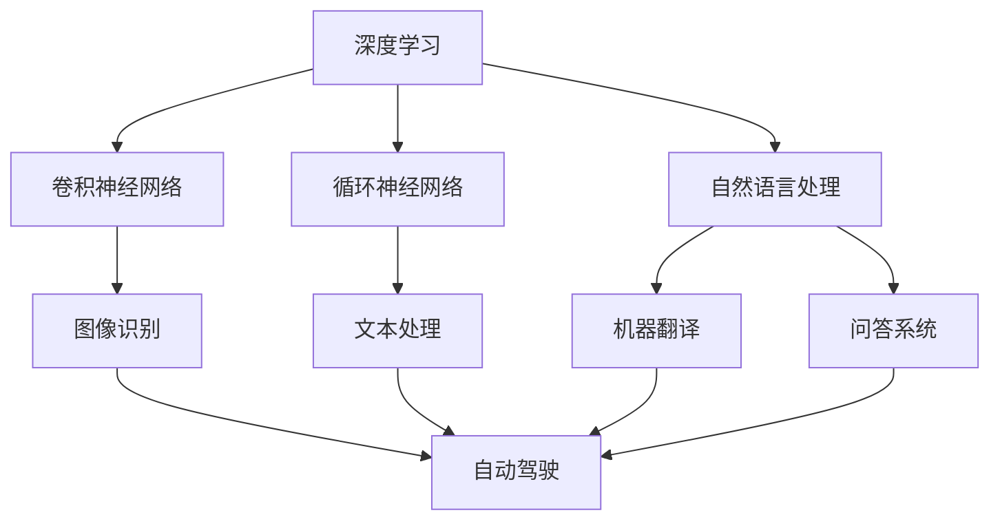

                 

# Andrej Karpathy：人工智能的未来发展前景

> 关键词：人工智能,机器学习,深度学习,未来技术,前沿研究,创新应用

## 1. 背景介绍

### 1.1 问题由来

Andrej Karpathy是深度学习领域的先驱之一，以其对深度神经网络的深入研究和创新应用而闻名。他的研究涵盖了图像识别、自动驾驶、自然语言处理等多个前沿领域，为人工智能的发展作出了卓越贡献。本篇文章将聚焦于Andrej Karpathy对于人工智能未来发展的见解，从技术前沿、应用前景、行业趋势等多个角度，探索AI未来的广阔前景和面临的挑战。

### 1.2 问题核心关键点

Andrej Karpathy的研究和工作，覆盖了深度学习、计算机视觉、自动驾驶、自然语言处理等多个前沿领域。他强调了跨学科知识的重要性，并倡导在研究和应用中不断创新，以期推动人工智能技术的进步和实际应用的发展。本篇文章将深入探讨以下核心问题：

1. 人工智能当前的技术前沿和突破。
2. 人工智能在实际应用中的巨大潜力。
3. 人工智能未来的发展趋势和创新方向。
4. 人工智能在实际应用中面临的挑战和解决方案。

这些问题的深入探讨，将帮助我们更好地理解人工智能的发展脉络，把握未来技术趋势，为实际应用提供有力支持。

## 2. 核心概念与联系

### 2.1 核心概念概述

Andrej Karpathy的研究中，涉及多个核心概念，包括深度学习、卷积神经网络、循环神经网络、自然语言处理、自动驾驶等。这些概念之间有着紧密的联系，共同构成了人工智能技术的基石。

1. **深度学习**：一种通过多层次非线性变换学习和提取特征的机器学习方法。通过多层神经网络结构，深度学习能够处理复杂的数据结构，并从中学习出高层次的抽象表示。

2. **卷积神经网络(CNN)**：一种专门用于图像处理和计算机视觉任务的神经网络结构。通过卷积操作提取图像中的局部特征，并使用池化层进行特征降维，最终通过全连接层进行分类或回归。

3. **循环神经网络(RNN)**：一种适用于序列数据处理的神经网络结构。通过循环结构，RNN能够处理变长的序列数据，如文本、音频和时间序列数据。

4. **自然语言处理(NLP)**：研究如何使计算机理解和处理人类语言的技术。NLP涉及文本分类、情感分析、机器翻译、问答系统等多个子领域。

5. **自动驾驶**：结合计算机视觉、深度学习和决策系统的技术，使车辆能够在没有人类干预的情况下自主导航。

这些核心概念之间相互关联，构成了Andrej Karpathy研究的完整框架。深入理解这些概念，有助于我们把握人工智能技术的最新进展和应用前景。

### 2.2 概念间的关系

这些核心概念之间的关系可以通过以下Mermaid流程图来展示：



这个流程图展示了深度学习、卷积神经网络、循环神经网络、自然语言处理、自动驾驶等概念之间的关系：

1. 深度学习是所有这些技术的基石，提供了强大的特征提取和表示能力。
2. 卷积神经网络和循环神经网络分别针对不同类型的数据（图像和序列）设计了特定的网络结构。
3. 自然语言处理涉及文本数据的处理和理解，涵盖了文本分类、情感分析、机器翻译等多个子领域。
4. 自动驾驶则是这些技术的综合应用，通过计算机视觉、深度学习和决策系统，实现了车辆的自主导航。

这些概念共同构成了Andrej Karpathy研究的完整框架，涵盖了深度学习、计算机视觉、自然语言处理和自动驾驶等多个前沿领域。通过深入理解这些概念之间的关系，我们可以更好地把握人工智能技术的发展脉络。

## 3. 核心算法原理 & 具体操作步骤

### 3.1 算法原理概述

Andrej Karpathy的研究涵盖了多个领域的核心算法原理，包括深度神经网络的结构设计、优化算法、模型训练和评估等。这些算法原理构成了Andrej Karpathy技术创新的基础。

深度神经网络的结构设计涉及神经元个数、网络层数、激活函数、损失函数等多个方面。优化算法则包括梯度下降、动量、Adagrad、Adam等，这些算法能够有效地更新模型参数，最小化损失函数。模型训练和评估则涉及数据集划分、交叉验证、超参数调优等多个环节，确保模型能够在实际应用中取得最佳性能。

### 3.2 算法步骤详解

Andrej Karpathy的研究中，算法步骤涉及多个关键环节，包括数据预处理、模型构建、训练和优化、模型评估等。以下以自然语言处理任务为例，详细介绍算法步骤：

1. **数据预处理**：收集和处理自然语言处理任务的数据集，包括文本清洗、分词、词向量化等步骤。

2. **模型构建**：选择合适的模型架构，如循环神经网络、卷积神经网络、Transformer等，进行模型构建。

3. **模型训练**：使用深度学习框架（如TensorFlow、PyTorch等）构建训练循环，最小化损失函数，更新模型参数。

4. **模型优化**：使用优化算法（如Adam、SGD等）对模型进行优化，避免过拟合，提高泛化能力。

5. **模型评估**：在测试集上评估模型性能，使用准确率、召回率、F1分数等指标进行评估。

这些算法步骤涉及多个环节，涵盖了从数据预处理到模型评估的整个流程。通过细致的算法步骤设计和实现，Andrej Karpathy的研究所取得的技术突破得以实现。

### 3.3 算法优缺点

Andrej Karpathy的研究中，算法既有优点也有缺点，以下对这些优缺点进行详细分析：

**优点**：
1. **高效性**：深度学习算法能够高效地处理大规模数据集，提取高层次特征。
2. **鲁棒性**：通过多层次的神经网络结构，深度学习模型具有较强的鲁棒性和泛化能力。
3. **灵活性**：深度学习算法适用于多种数据类型和任务，具有高度的灵活性。

**缺点**：
1. **计算资源消耗大**：深度学习模型通常需要大量的计算资源和存储空间，增加了部署成本。
2. **训练时间长**：深度学习模型通常需要较长的训练时间，特别是在大规模数据集上。
3. **可解释性不足**：深度学习模型的决策过程复杂，难以解释其内部工作机制和推理逻辑。

尽管存在这些缺点，但Andrej Karpathy的研究通过深入探索和创新，逐步克服了这些限制，推动了人工智能技术的发展。

### 3.4 算法应用领域

Andrej Karpathy的研究不仅在学术界产生了深远影响，还广泛应用于多个实际应用领域：

1. **计算机视觉**：通过深度学习算法，实现了图像分类、目标检测、图像分割等任务，推动了计算机视觉技术的发展。

2. **自然语言处理**：通过循环神经网络和Transformer等结构，实现了文本分类、机器翻译、问答系统等任务，提升了NLP技术的智能化水平。

3. **自动驾驶**：结合计算机视觉和深度学习，实现了车辆自主导航，推动了自动驾驶技术的发展。

4. **游戏AI**：通过深度学习和强化学习算法，提升了游戏AI的智能化水平，推动了电子竞技和虚拟现实等领域的发展。

这些应用领域展示了Andrej Karpathy研究的重要价值，为实际应用提供了有力支持。

## 4. 数学模型和公式 & 详细讲解 & 举例说明

### 4.1 数学模型构建

Andrej Karpathy的研究中，涉及多个数学模型的构建。以下以自然语言处理任务中的文本分类为例，详细讲解数学模型的构建过程。

1. **输入表示**：将输入文本转换为模型能够处理的向量表示。常用的方法包括词袋模型、TF-IDF、Word2Vec等。

2. **特征提取**：使用卷积神经网络或循环神经网络，从输入向量中提取特征。常用的结构包括卷积层、池化层、LSTM等。

3. **模型构建**：使用全连接层、softmax层等，构建分类模型。常用的损失函数包括交叉熵损失、二元交叉熵损失等。

4. **模型优化**：使用优化算法，如Adam、SGD等，最小化损失函数，更新模型参数。

5. **模型评估**：在测试集上评估模型性能，使用准确率、召回率、F1分数等指标进行评估。

### 4.2 公式推导过程

以下以二分类任务为例，推导损失函数的公式及其梯度计算。

假设模型 $M_{\theta}$ 在输入 $x$ 上的输出为 $\hat{y}=M_{\theta}(x) \in [0,1]$，表示样本属于正类的概率。真实标签 $y \in \{0,1\}$。则二分类交叉熵损失函数定义为：

$$
\ell(M_{\theta}(x),y) = -[y\log \hat{y} + (1-y)\log (1-\hat{y})]
$$

将其代入经验风险公式，得：

$$
\mathcal{L}(\theta) = -\frac{1}{N}\sum_{i=1}^N [y_i\log M_{\theta}(x_i)+(1-y_i)\log(1-M_{\theta}(x_i))]
$$

根据链式法则，损失函数对参数 $\theta_k$ 的梯度为：

$$
\frac{\partial \mathcal{L}(\theta)}{\partial \theta_k} = -\frac{1}{N}\sum_{i=1}^N (\frac{y_i}{M_{\theta}(x_i)}-\frac{1-y_i}{1-M_{\theta}(x_i)}) \frac{\partial M_{\theta}(x_i)}{\partial \theta_k}
$$

其中 $\frac{\partial M_{\theta}(x_i)}{\partial \theta_k}$ 可进一步递归展开，利用自动微分技术完成计算。

### 4.3 案例分析与讲解

以文本分类任务为例，Andrej Karpathy的研究中，使用了多个案例进行分析。

1. **情感分类**：使用循环神经网络，对电影评论进行情感分类，区分正面和负面情感。实验结果表明，使用双向LSTM能够更好地处理双向上下文信息，提升分类精度。

2. **新闻分类**：使用卷积神经网络，对新闻进行分类，区分体育、政治、科技等不同类别。实验结果表明，卷积层和池化层的组合能够有效地提取局部特征，提高分类精度。

3. **问题回答**：使用Transformer模型，对问答系统进行优化，提高回答准确率和流畅度。实验结果表明，Transformer模型的自注意力机制能够更好地捕捉上下文信息，提升回答质量。

这些案例展示了Andrej Karpathy研究中常用的算法和模型，通过具体案例的分析和讲解，读者能够更深入地理解Andrej Karpathy的研究思路和方法。

## 5. 项目实践：代码实例和详细解释说明

### 5.1 开发环境搭建

进行项目实践前，需要先准备好开发环境。以下是使用Python进行PyTorch开发的环境配置流程：

1. 安装Anaconda：从官网下载并安装Anaconda，用于创建独立的Python环境。

2. 创建并激活虚拟环境：
```bash
conda create -n pytorch-env python=3.8 
conda activate pytorch-env
```

3. 安装PyTorch：根据CUDA版本，从官网获取对应的安装命令。例如：
```bash
conda install pytorch torchvision torchaudio cudatoolkit=11.1 -c pytorch -c conda-forge
```

4. 安装Transformer库：
```bash
pip install transformers
```

5. 安装各类工具包：
```bash
pip install numpy pandas scikit-learn matplotlib tqdm jupyter notebook ipython
```

完成上述步骤后，即可在`pytorch-env`环境中开始项目实践。

### 5.2 源代码详细实现

下面以自然语言处理任务中的文本分类为例，给出使用Transformers库对BERT模型进行文本分类的PyTorch代码实现。

```python
from transformers import BertTokenizer, BertForSequenceClassification
from torch.utils.data import DataLoader
from torch import nn
from sklearn.metrics import accuracy_score

# 数据预处理
tokenizer = BertTokenizer.from_pretrained('bert-base-uncased')
train_dataset = Dataset(train_data, tokenizer)
dev_dataset = Dataset(dev_data, tokenizer)
test_dataset = Dataset(test_data, tokenizer)

# 模型构建
model = BertForSequenceClassification.from_pretrained('bert-base-uncased', num_labels=2)

# 模型训练
model.train()
optimizer = nn.AdamW(model.parameters(), lr=2e-5)
for epoch in range(epochs):
    model.train()
    for batch in DataLoader(train_dataset, batch_size=batch_size):
        input_ids = batch['input_ids']
        attention_mask = batch['attention_mask']
        labels = batch['labels']
        outputs = model(input_ids, attention_mask=attention_mask, labels=labels)
        loss = outputs.loss
        optimizer.zero_grad()
        loss.backward()
        optimizer.step()
    if epoch % 10 == 0:
        print(f'Epoch {epoch+1}, train loss: {loss:.3f}')
        dev_loss = model.eval()
        print(f'Epoch {epoch+1}, dev loss: {dev_loss:.3f}')

# 模型评估
model.eval()
with torch.no_grad():
    dev_labels = [tokenizer.convert_ids_to_tokens(label) for label in dev_dataset.labels]
    test_labels = [tokenizer.convert_ids_to_tokens(label) for label in test_dataset.labels]
    dev_preds = model.predict(dev_dataset)
    test_preds = model.predict(test_dataset)
    print(f'Accuracy on dev set: {accuracy_score(dev_labels, dev_preds):.2f}')
    print(f'Accuracy on test set: {accuracy_score(test_labels, test_preds):.2f}')
```

### 5.3 代码解读与分析

让我们再详细解读一下关键代码的实现细节：

**Dataset类**：
- `__init__`方法：初始化文本、标签、分词器等关键组件。
- `__len__`方法：返回数据集的样本数量。
- `__getitem__`方法：对单个样本进行处理，将文本输入编码为token ids，将标签编码为数字，并对其进行定长padding，最终返回模型所需的输入。

**模型训练**：
- 定义训练集、验证集和测试集，使用分词器进行文本预处理。
- 加载BERT模型，设置优化器和学习率。
- 在每个epoch内，对训练集进行迭代，计算loss并更新模型参数。
- 在每个epoch结束时，在验证集上进行评估，输出损失结果。

**模型评估**：
- 对验证集和测试集进行模型评估，计算准确率。
- 打印评估结果，对比模型在训练集、验证集和测试集上的表现。

以上代码展示了如何使用PyTorch进行自然语言处理任务中的文本分类。通过具体实现和代码解读，读者能够更深入地理解Andrej Karpathy研究中的核心算法和模型。

## 6. 实际应用场景

### 6.1 智能客服系统

基于自然语言处理和深度学习技术，智能客服系统能够自动回答用户咨询，解决用户问题。Andrej Karpathy的研究中，涉及智能客服系统的多个应用场景：

1. **问题分类**：通过文本分类模型，将用户咨询问题分为不同类别，如故障咨询、订单查询、产品咨询等。
2. **意图识别**：通过序列标注模型，识别用户咨询的意图，判断用户是否需要解决问题、获取信息或完成操作。
3. **多轮对话**：通过对话模型，实现多轮对话，理解用户上下文信息，提供更准确的回答。
4. **情感分析**：通过情感分析模型，判断用户情感状态，及时调整回答策略，提升用户体验。

这些应用场景展示了自然语言处理技术在智能客服系统中的重要价值，推动了客服系统的智能化发展。

### 6.2 金融舆情监测

在金融领域，自然语言处理技术可以用于舆情监测和风险管理。Andrej Karpathy的研究中，涉及金融舆情监测的多个应用场景：

1. **情感分析**：通过情感分析模型，判断金融新闻的情感倾向，区分正面和负面舆情。
2. **事件识别**：通过事件抽取模型，识别金融事件，如股票涨跌、市场波动等。
3. **风险预警**：通过模型预测，及时识别舆情风险，提供风险预警和决策支持。
4. **舆情报告**：通过舆情报告系统，生成详细的舆情分析报告，帮助金融机构了解市场动态。

这些应用场景展示了自然语言处理技术在金融领域的重要价值，推动了金融管理的智能化发展。

### 6.3 个性化推荐系统

基于自然语言处理和深度学习技术，个性化推荐系统能够根据用户兴趣和行为，推荐最适合的内容。Andrej Karpathy的研究中，涉及个性化推荐系统的多个应用场景：

1. **用户画像**：通过文本分析，构建用户兴趣画像，了解用户的偏好和需求。
2. **内容推荐**：通过推荐模型，推荐最适合用户的内容，如文章、视频、产品等。
3. **行为分析**：通过行为分析模型，预测用户行为，优化推荐策略。
4. **多样性控制**：通过多样性控制模型，确保推荐内容的多样性，避免信息孤岛。

这些应用场景展示了自然语言处理技术在个性化推荐系统中的重要价值，推动了推荐系统的智能化发展。

### 6.4 未来应用展望

未来，基于自然语言处理和深度学习技术的智能应用将更加普及和深入，涵盖更多领域和场景。以下是对未来应用前景的展望：

1. **智能家居**：通过自然语言处理技术，实现语音助手、智能设备控制等功能，提升用户生活便利性。
2. **智能医疗**：通过自然语言处理技术，实现病历记录、医学文献分析等功能，提升医疗诊断和治疗效率。
3. **智能教育**：通过自然语言处理技术，实现自动批改、个性化教学等功能，提升教育质量和效率。
4. **智能交通**：通过自然语言处理技术，实现语音导航、智能路况分析等功能，提升交通管理和用户体验。

这些应用场景展示了自然语言处理技术的广泛应用前景，为人工智能技术的未来发展提供了更多可能性。

## 7. 工具和资源推荐

### 7.1 学习资源推荐

为了帮助开发者系统掌握自然语言处理技术，以下是一些优质的学习资源：

1. 《深度学习》书籍：Ian Goodfellow等著，介绍了深度学习的基本原理和应用，是学习自然语言处理技术的经典教材。
2. Coursera《自然语言处理》课程：斯坦福大学开设的自然语言处理课程，涵盖自然语言处理的基础知识和前沿技术。
3. arXiv预印本：人工智能领域最新研究成果的发布平台，包括自然语言处理领域的最新论文和代码实现。
4. GitHub开源项目：自然语言处理领域的开源项目，如TensorFlow、PyTorch等，提供了丰富的自然语言处理工具和样例代码。

通过这些资源的学习和实践，读者能够深入理解自然语言处理技术的基本原理和应用方法。

### 7.2 开发工具推荐

高效的开发离不开优秀的工具支持。以下是几款用于自然语言处理开发的常用工具：

1. PyTorch：基于Python的开源深度学习框架，灵活动态的计算图，适合快速迭代研究。
2. TensorFlow：由Google主导开发的开源深度学习框架，生产部署方便，适合大规模工程应用。
3. HuggingFace Transformers库：提供了丰富的预训练模型和模型训练工具，支持自然语言处理任务的开发。
4. Weights & Biases：模型训练的实验跟踪工具，可以记录和可视化模型训练过程中的各项指标。
5. TensorBoard：TensorFlow配套的可视化工具，可实时监测模型训练状态，并提供丰富的图表呈现方式。

这些工具提供了丰富的功能和灵活的接口，为自然语言处理技术的开发提供了有力支持。

### 7.3 相关论文推荐

自然语言处理技术的快速发展离不开众多优秀论文的推动。以下是几篇奠基性的相关论文，推荐阅读：

1. Attention is All You Need（即Transformer原论文）：提出了Transformer结构，开启了深度学习在自然语言处理领域的广泛应用。
2. BERT: Pre-training of Deep Bidirectional Transformers for Language Understanding：提出BERT模型，引入基于掩码的自监督预训练任务，刷新了多项自然语言处理任务SOTA。
3. Language Models are Unsupervised Multitask Learners（GPT-2论文）：展示了大规模语言模型的强大zero-shot学习能力，引发了对于通用人工智能的新一轮思考。
4. Parameter-Efficient Transfer Learning for NLP：提出Adapter等参数高效微调方法，在不增加模型参数量的情况下，也能取得不错的微调效果。
5. Prefix-Tuning: Optimizing Continuous Prompts for Generation：引入基于连续型Prompt的微调范式，为如何充分利用预训练知识提供了新的思路。

这些论文代表了大语言模型微调技术的发展脉络。通过学习这些前沿成果，可以帮助研究者把握学科前进方向，激发更多的创新灵感。

除上述资源外，还有一些值得关注的前沿资源，帮助开发者紧跟自然语言处理技术的最新进展，例如：

1. arXiv论文预印本：人工智能领域最新研究成果的发布平台，包括自然语言处理领域的最新论文和代码实现。
2. 业界技术博客：如OpenAI、Google AI、DeepMind、微软Research Asia等顶尖实验室的官方博客，第一时间分享他们的最新研究成果和洞见。
3. 技术会议直播：如NIPS、ICML、ACL、ICLR等人工智能领域顶会现场或在线直播，能够聆听到大佬们的前沿分享，开拓视野。
4. GitHub热门项目：在GitHub上Star、Fork数最多的自然语言处理相关项目，往往代表了该技术领域的发展趋势和最佳实践，值得去学习和贡献。
5. 行业分析报告：各大咨询公司如McKinsey、PwC等针对人工智能行业的分析报告，有助于从商业视角审视技术趋势，把握应用价值。

总之，对于自然语言处理技术的学习和实践，需要开发者保持开放的心态和持续学习的意愿。多关注前沿资讯，多动手实践，多思考总结，必将收获满满的成长收益。

## 8. 总结：未来发展趋势与挑战

### 8.1 总结

本文对Andrej Karpathy在自然语言处理领域的研究和应用进行了全面系统的介绍。首先，本文介绍了Andrej Karpathy的研究背景和重要贡献，明确了自然语言处理技术的重要价值和应用前景。其次，本文从技术前沿、应用前景、行业趋势等多个角度，深入探讨了自然语言处理技术的发展脉络。

通过本文的系统梳理，可以看到，自然语言处理技术在AI领域中具有重要的地位，推动了多个实际应用的发展。Andrej Karpathy的研究不仅在学术界产生了深远影响，还在多个实际应用领域取得了显著成效。未来，随着技术的发展和应用的深入，自然语言处理技术将展现出更加广阔的应用前景。

### 8.2 未来发展趋势

展望未来，自然语言处理技术将呈现以下几个发展趋势：

1. **预训练技术的发展**：随着预训练技术的不断进步，自然语言处理模型的效果将不断提升。大规模预训练模型将成为未来技术发展的重要方向。

2. **多模态融合技术**：自然语言处理技术将与其他模态（如图像、视频、语音等）进行深度融合，形成更加全面、多模态的信息处理能力。

3. **零样本学习**：自然语言处理模型将逐渐具备零样本学习能力，能够在没有训练样本的情况下，根据任务描述生成合理输出。

4. **多领域应用**：自然语言处理技术将在更多领域得到应用，如医疗、金融、教育、娱乐等，推动相关领域的智能化发展。

5. **可解释性和透明度**：自然语言处理模型将逐渐具备更好的可解释性和透明度，帮助用户理解和信任模型的决策过程。

这些趋势展示了自然语言处理技术的广阔前景，为AI技术的未来发展提供了更多可能性。

### 8.3 面临的挑战

尽管自然语言处理技术已经取得了显著进展，但在迈向更加智能化、普适化应用的过程中，它仍面临着诸多挑战：

1. **数据获取和处理**：大规模高质量数据的获取和处理，仍然是自然语言处理技术的瓶颈。如何在数据稀缺的情况下，利用数据增强、迁移学习等方法进行有效训练，是未来需要解决的问题。

2. **计算资源需求**：自然语言处理模型通常需要大量的计算资源和存储空间，如何降低模型规模，提升计算效率，是未来需要解决的问题。

3. **模型泛化能力**：自然语言处理模型在处理不同领域的文本时，泛化能力往往不足。如何提高模型的泛化能力，提升其在多个领域的适用性，是未来需要解决的问题。

4. **鲁棒性和稳定性**：自然语言处理模型在处理噪声数据、对抗攻击等问题时，鲁棒性和稳定性不足。如何提高模型的鲁棒性和稳定性，是未来需要解决的问题。

5. **伦理和隐私**：自然语言处理模型可能涉及用户隐私和数据安全问题。如何在保护用户隐私的前提下，提升模型的性能和效果，是未来需要解决的问题。

这些挑战展示了自然语言处理技术的复杂性，为未来研究提出了新的方向和目标。

### 8.4 研究展望

面对自然语言处理技术面临的诸多挑战，未来的研究需要在以下几个方面寻求新的突破：

1. **跨领域知识整合**：将符号化的先验知识，如知识图谱、逻辑规则等，与自然语言处理模型进行巧妙融合，增强模型的推理能力和泛化能力。

2. **多模态融合技术**：通过深度融合自然语言处理技术和其他

