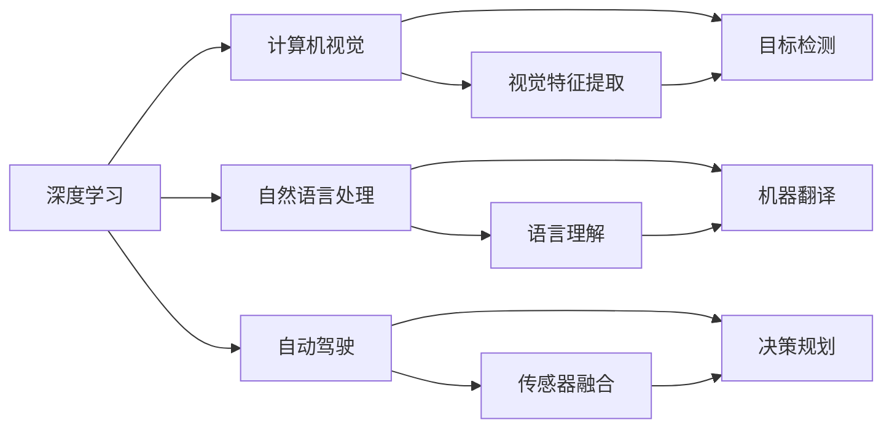
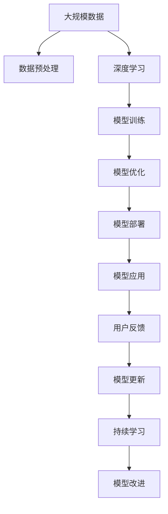

                 

# Andrej Karpathy：人工智能的未来发展挑战

> 关键词：人工智能,未来发展,技术挑战,深度学习,计算机视觉,自动驾驶,自然语言处理,算法创新,持续学习

## 1. 背景介绍

### 1.1 问题由来

Andrej Karpathy，作为斯坦福大学计算机科学教授和OpenAI的研究员，以其在计算机视觉、自动驾驶和深度学习领域的杰出贡献而闻名。他的工作不仅推动了学术界的进展，也对工业界产生了深远影响。在人工智能技术日新月异的今天，Karpathy对未来技术发展的展望和挑战，具有重要的指导意义。

### 1.2 问题核心关键点

Karpathy认为，人工智能技术在近年来取得了巨大的进展，尤其是在计算机视觉、自然语言处理和自动驾驶等领域。然而，随着技术的深入发展，未来面临的挑战也越来越复杂和多样。这些挑战包括算法的可解释性、模型的鲁棒性、数据隐私和伦理问题、计算资源的消耗等。

Karpathy指出，尽管深度学习算法在许多任务上已经取得了显著的成就，但它们的内部机制仍然难以解释，这限制了它们的可信度和应用范围。模型的鲁棒性也是一个重要问题，尤其是在面对域外数据或噪声数据时，模型的性能可能会显著下降。此外，随着数据量的增加，模型的训练和推理消耗的计算资源也在不断增长，这对硬件设施和能源消耗提出了更高的要求。

在数据隐私和伦理方面，Karpathy强调了保护用户隐私和防止算法偏见的重要性。他指出，尽管许多公司已经开始关注这些问题，但还需要更多的研究和政策来确保人工智能技术的负责任使用。

### 1.3 问题研究意义

Karpathy的研究对人工智能技术的未来发展具有深远的意义。他的见解不仅帮助业界更好地理解当前技术的瓶颈，还为未来的研究方向提供了宝贵的指导。了解这些挑战，有助于制定更有效的策略，推动人工智能技术的进一步发展，确保其安全、可信和可持续性。

## 2. 核心概念与联系

### 2.1 核心概念概述

要深入理解Karpathy对未来技术发展的展望，首先需要明确几个核心概念：

- **深度学习**：一种基于多层神经网络的技术，通过学习大量数据来提取特征并进行分类、预测等任务。
- **计算机视觉**：研究如何让计算机理解和解释图像、视频等信息的技术。
- **自动驾驶**：通过计算机视觉、传感器融合等技术，实现自动驾驶汽车。
- **自然语言处理**：研究如何让计算机理解和生成自然语言的技术。
- **算法创新**：指在算法设计、模型结构和优化方法上的新思路和新方法。
- **持续学习**：指模型在实际应用中能够不断学习新数据，并保持原有知识的稳定性。
- **数据隐私**：在数据处理和存储过程中，保护个人隐私的技术和政策。
- **伦理问题**：人工智能技术的开发和使用过程中，涉及到的道德和法律问题。

### 2.2 概念间的关系

这些核心概念之间存在着紧密的联系，形成了人工智能技术发展的完整生态系统。以下Mermaid流程图展示了这些概念之间的关系：



这个流程图展示了深度学习在计算机视觉、自然语言处理和自动驾驶中的应用，以及它们各自的技术细节和功能模块。

### 2.3 核心概念的整体架构

最后，我们用一个综合的流程图来展示这些核心概念在大规模应用中的整体架构：



这个综合流程图展示了从数据预处理到模型改进的完整流程，强调了持续学习和模型改进在技术迭代中的重要性。

## 3. 核心算法原理 & 具体操作步骤
### 3.1 算法原理概述

Karpathy认为，深度学习算法的核心在于通过多层神经网络来提取数据中的复杂特征。在计算机视觉和自然语言处理中，这一过程通常涉及大量的参数调整和模型优化。

对于计算机视觉任务，常用的深度学习模型包括卷积神经网络(CNN)和循环神经网络(RNN)等。这些模型通过多层卷积和池化操作，从输入图像中提取特征，并最终通过全连接层进行分类或回归。

在自然语言处理中，常用的模型包括递归神经网络(RNN)、长短时记忆网络(LSTM)和Transformer等。这些模型通过层级结构，从输入文本中提取语义信息，并进行分类、生成等任务。

### 3.2 算法步骤详解

深度学习模型的训练通常包括以下几个步骤：

1. **数据预处理**：将原始数据转换为模型可以处理的形式。例如，图像数据需要经过归一化、裁剪等预处理操作，文本数据需要进行分词、向量化等处理。

2. **模型初始化**：随机初始化模型的参数，通常使用Xavier或He初始化方法。

3. **模型训练**：使用优化器（如Adam、SGD等）和损失函数（如交叉熵、均方误差等），通过反向传播算法更新模型参数。

4. **模型评估**：在验证集上评估模型的性能，调整超参数或模型结构，以避免过拟合。

5. **模型部署**：将训练好的模型部署到实际应用中，进行推理和预测。

### 3.3 算法优缺点

深度学习算法具有以下几个优点：
- 能够处理高维数据，如图像和文本。
- 在大规模数据上训练效果好。
- 能够学习复杂的特征表示。

然而，深度学习算法也存在以下缺点：
- 需要大量的标注数据进行训练，数据获取成本高。
- 模型复杂，参数量大，计算资源消耗高。
- 模型可解释性差，难以理解其内部决策过程。

### 3.4 算法应用领域

深度学习算法已经在计算机视觉、自然语言处理、自动驾驶等多个领域取得了重要进展：

- **计算机视觉**：用于图像分类、目标检测、图像生成等任务。例如，Yolo和Faster R-CNN等模型在目标检测任务中表现出色。
- **自然语言处理**：用于文本分类、机器翻译、文本生成等任务。例如，Transformer模型在机器翻译任务中取得了显著的性能提升。
- **自动驾驶**：用于图像识别、传感器数据融合、路径规划等任务。例如，Google的TensorFlow和OpenAI的Dota等模型在自动驾驶领域表现优异。

## 4. 数学模型和公式 & 详细讲解
### 4.1 数学模型构建

以计算机视觉中的目标检测为例，常用的深度学习模型包括YOLO和Faster R-CNN。以下是对YOLO模型的数学模型构建和推导过程的详细讲解。

假设输入图像大小为 $h \times w$，每个像素点的特征表示为 $D$ 维向量。模型的输入表示为 $X \in \mathbb{R}^{h \times w \times D}$。

目标检测模型的输出为一个 $N$ 类别的概率分布，表示为 $Y \in \mathbb{R}^{N}$，其中 $N$ 为类别数。模型的损失函数通常采用交叉熵损失，定义为：

$$
L(Y, Y_{true}) = -\frac{1}{N}\sum_{i=1}^N Y_i \log Y_{true_i}
$$

其中 $Y_{true}$ 为真实标签的概率分布。

### 4.2 公式推导过程

为了最小化损失函数 $L$，我们使用梯度下降算法更新模型参数 $\theta$：

$$
\theta \leftarrow \theta - \eta \nabla_{\theta} L(\theta)
$$

其中 $\eta$ 为学习率。使用反向传播算法，可以高效计算梯度 $\nabla_{\theta} L(\theta)$，具体推导如下：

1. 计算前向传播，将输入图像 $X$ 通过网络，得到输出 $Y$。
2. 计算损失函数 $L(Y, Y_{true})$。
3. 计算梯度 $\nabla_{\theta} L(\theta)$，即反向传播。
4. 更新模型参数 $\theta$。

### 4.3 案例分析与讲解

以YOLO模型为例，它在目标检测任务中表现出色。YOLO模型将图像划分为 $S \times S$ 个网格，每个网格预测 $B$ 个目标的类别概率和边界框位置。模型的输出为 $B \times (N+5) \times S^2$ 张量，其中 $N$ 为类别数，$5$ 为边界框参数。

通过使用正负样本采样、数据增强等技术，YOLO模型能够在保持高精度的同时，显著减少计算资源消耗，成为目标检测任务中的重要工具。

## 5. 项目实践：代码实例和详细解释说明
### 5.1 开发环境搭建

在实践中，使用PyTorch框架进行深度学习模型的开发和训练。以下是搭建开发环境的步骤：

1. 安装Anaconda：从官网下载并安装Anaconda，用于创建独立的Python环境。

2. 创建并激活虚拟环境：
```bash
conda create -n pytorch-env python=3.8 
conda activate pytorch-env
```

3. 安装PyTorch：根据CUDA版本，从官网获取对应的安装命令。例如：
```bash
conda install pytorch torchvision torchaudio cudatoolkit=11.1 -c pytorch -c conda-forge
```

4. 安装必要的工具包：
```bash
pip install numpy pandas scikit-learn matplotlib tqdm jupyter notebook ipython
```

完成上述步骤后，即可在`pytorch-env`环境中开始深度学习模型的开发。

### 5.2 源代码详细实现

以下是一个使用PyTorch进行YOLO模型训练的代码示例：

```python
import torch
import torch.nn as nn
import torch.optim as optim
from torch.utils.data import DataLoader
from torchvision.datasets import ImageFolder
from torchvision.transforms import transforms

# 定义YOLO模型
class YOLO(nn.Module):
    def __init__(self):
        super(YOLO, self).__init__()
        # 定义模型结构，包括卷积层、池化层、全连接层等

    def forward(self, x):
        # 定义前向传播过程，返回输出张量

# 定义数据预处理
transform = transforms.Compose([
    transforms.Resize(256),
    transforms.CenterCrop(224),
    transforms.ToTensor(),
    transforms.Normalize(mean=[0.485, 0.456, 0.406], std=[0.229, 0.224, 0.225])
])

# 定义数据集和数据加载器
dataset = ImageFolder('train', transform=transform)
dataloader = DataLoader(dataset, batch_size=16, shuffle=True)

# 定义模型、优化器和损失函数
model = YOLO()
optimizer = optim.SGD(model.parameters(), lr=0.01, momentum=0.9)
criterion = nn.CrossEntropyLoss()

# 定义训练过程
def train_epoch(model, dataloader, optimizer, criterion):
    model.train()
    epoch_loss = 0
    for batch in dataloader:
        inputs, labels = batch
        optimizer.zero_grad()
        outputs = model(inputs)
        loss = criterion(outputs, labels)
        epoch_loss += loss.item()
        loss.backward()
        optimizer.step()
    return epoch_loss / len(dataloader)

# 训练模型
for epoch in range(10):
    loss = train_epoch(model, dataloader, optimizer, criterion)
    print(f"Epoch {epoch+1}, train loss: {loss:.3f}")
```

以上代码展示了YOLO模型的训练过程。在实践中，需要根据具体任务和数据集特点，调整模型结构、优化器和超参数，才能得到理想的结果。

### 5.3 代码解读与分析

在代码中，我们定义了一个YOLO模型，并使用SGD优化器进行训练。数据预处理包括图像大小调整、中心裁剪、归一化等操作，这些操作有助于提高模型性能。训练过程中，我们计算模型输出与真实标签之间的交叉熵损失，并使用梯度下降算法更新模型参数。

## 6. 实际应用场景

### 6.1 智能驾驶

在智能驾驶领域，深度学习算法已经取得了显著进展。例如，自动驾驶汽车可以利用计算机视觉技术，实时检测道路上的车辆、行人、交通信号等，并进行路径规划和决策。YOLO和Faster R-CNN等目标检测模型在自动驾驶中表现出色，能够快速、准确地检测出物体位置和类别。

### 6.2 医疗影像分析

深度学习算法在医疗影像分析中也有重要应用。例如，卷积神经网络可以对医学影像进行分类和分割，帮助医生诊断疾病。Karpathy指出，尽管深度学习在医疗影像分析中取得了显著进展，但仍然存在一些挑战，如数据隐私和模型可解释性问题。

### 6.3 自然语言处理

自然语言处理是深度学习算法的另一个重要应用领域。例如，Transformer模型在机器翻译任务中表现出色，能够实现高质量的翻译效果。此外，深度学习算法还被广泛应用于情感分析、文本生成等任务。

### 6.4 未来应用展望

未来，深度学习算法将在更多领域得到应用，推动技术进步和产业升级。例如：

- **医疗影像分析**：深度学习算法可以帮助医生快速诊断疾病，提高诊疗效率和准确性。
- **自动驾驶**：随着技术的进步，自动驾驶汽车将更加智能和安全，能够适应更复杂和动态的交通环境。
- **智能客服**：深度学习算法可以帮助客服系统理解客户需求，提供个性化的服务。
- **金融风险预测**：深度学习算法可以分析金融数据，预测市场趋势和风险，帮助投资者做出更明智的决策。

## 7. 工具和资源推荐
### 7.1 学习资源推荐

为了帮助开发者掌握深度学习算法，以下是一些推荐的资源：

- **《深度学习》课程**：由斯坦福大学开设，涵盖深度学习基础、卷积神经网络、循环神经网络等主题。
- **Kaggle**：一个数据科学竞赛平台，提供大量数据集和算法竞赛，有助于提高实战能力。
- **PyTorch官方文档**：提供详细的PyTorch框架文档和教程，适合初学者和进阶用户。
- **Google AI Blog**：谷歌AI团队的官方博客，分享最新研究成果和前沿技术，涵盖计算机视觉、自然语言处理等多个领域。

### 7.2 开发工具推荐

在深度学习算法开发中，以下工具值得推荐：

- **PyTorch**：一个灵活的深度学习框架，适合快速原型开发和实验。
- **TensorFlow**：由谷歌开发的深度学习框架，适用于大规模工程应用。
- **Jupyter Notebook**：一个交互式笔记本环境，方便实验和分享代码。
- **TensorBoard**：谷歌开发的可视化工具，可以实时监测模型训练状态和性能。

### 7.3 相关论文推荐

以下是一些深度学习算法领域的经典论文：

- **ImageNet大规模视觉识别竞赛**：介绍了深度学习算法在图像分类任务中的突破性进展。
- **Attention is All You Need**：提出Transformer模型，开创了自注意力机制的先河。
- **Google AI Blog**：谷歌AI团队的官方博客，分享最新研究成果和前沿技术，涵盖计算机视觉、自然语言处理等多个领域。

## 8. 总结：未来发展趋势与挑战

### 8.1 研究成果总结

深度学习算法在计算机视觉、自然语言处理和自动驾驶等领域取得了显著进展。然而，面对算法的可解释性、模型的鲁棒性和数据隐私等挑战，未来仍需进一步研究和探索。

### 8.2 未来发展趋势

未来深度学习算法的发展趋势包括：

- **算法可解释性**：需要开发更具可解释性的算法，帮助用户理解和信任模型的决策过程。
- **模型鲁棒性**：需要提高模型的鲁棒性，使其能够适应各种复杂的输入和场景。
- **计算效率**：需要优化计算资源消耗，使深度学习算法能够在大规模数据上高效运行。
- **跨领域应用**：深度学习算法需要拓展应用范围，推动其在更多领域的发展。

### 8.3 面临的挑战

尽管深度学习算法取得了重要进展，但仍面临以下挑战：

- **数据获取成本高**：深度学习算法需要大量标注数据进行训练，数据获取成本高昂。
- **计算资源消耗大**：深度学习模型参数量大，训练和推理消耗大量计算资源。
- **算法可解释性差**：深度学习算法的内部机制难以解释，用户难以理解模型的决策过程。

### 8.4 研究展望

未来，深度学习算法需要在算法可解释性、模型鲁棒性和计算效率等方面取得突破，推动其在更多领域的应用。同时，还需要关注数据隐私和伦理问题，确保技术的负责任使用。

## 9. 附录：常见问题与解答

**Q1：深度学习算法是否适用于所有数据集？**

A: 深度学习算法在处理高维数据（如图像和文本）时表现出色，但对于低维数据（如结构化数据），可能效果不佳。需要根据具体任务和数据集特点，选择合适的算法和模型。

**Q2：如何提高深度学习算法的可解释性？**

A: 可以通过以下方法提高深度学习算法的可解释性：
- 引入可解释性模块，如Attention机制、层级激活图等。
- 使用可视化工具，如TensorBoard、Matplotlib等，查看模型内部结构和学习过程。
- 提供模型决策路径，帮助用户理解模型的输出。

**Q3：如何提高深度学习算法的鲁棒性？**

A: 可以通过以下方法提高深度学习算法的鲁棒性：
- 引入正则化技术，如L2正则、Dropout等，防止过拟合。
- 使用对抗样本训练，提高模型的鲁棒性。
- 结合多模型集成，提高模型的泛化能力。

**Q4：深度学习算法如何处理数据隐私问题？**

A: 可以通过以下方法处理数据隐私问题：
- 数据匿名化，去除或模糊化个人身份信息。
- 数据加密，防止数据泄露。
- 差分隐私，添加噪声以保护个体隐私。

**Q5：深度学习算法如何适应新数据？**

A: 可以通过以下方法使深度学习算法适应新数据：
- 使用增量学习技术，逐步适应新数据。
- 使用持续学习技术，保持模型在新数据上的性能。
- 使用迁移学习技术，利用已有的知识进行快速适应。

通过以上学习和实践，我们可以更好地掌握深度学习算法，推动其在更多领域的应用和发展。

