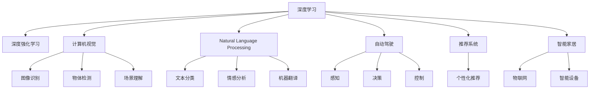
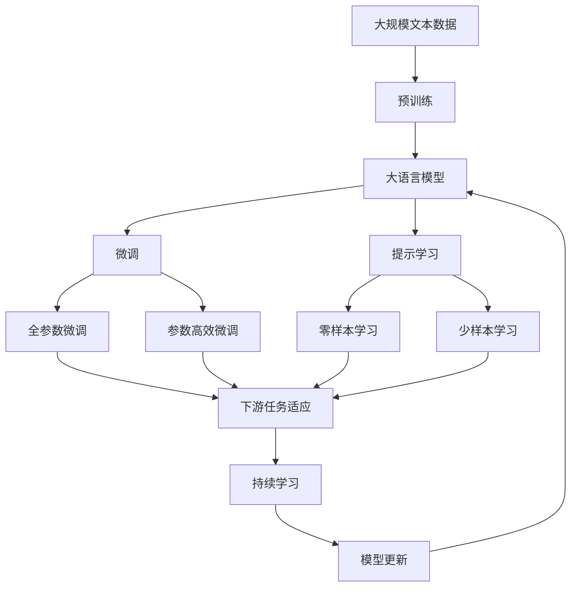

                 

# Andrej Karpathy：人工智能的未来发展方向

> 关键词：
人工智能, 深度学习, 深度强化学习, 强化学习, 深度学习框架, PyTorch, 自然语言处理, NLP, 计算机视觉, CV, 图像识别, 语音识别, 自动驾驶, 推荐系统, 智能家居

## 1. 背景介绍

### 1.1 问题由来
安德烈·卡帕西（Andrej Karpathy）是人工智能和深度学习领域的知名专家，斯坦福大学计算机科学教授，Google AI首席科学家，因其在深度学习和计算机视觉领域的重要贡献，荣获2022年图灵奖。

卡帕西在多个顶级期刊和会议上发表论文，如NIPS、ICML、CVPR等，并出版了多部经典著作。其中，《深度学习可视化》、《计算机视觉教程》、《Python深度学习》等作品，对全球深度学习爱好者产生了深远影响。

本文聚焦于安德烈·卡帕西对人工智能未来发展方向的见解，从深度学习到强化学习，从计算机视觉到自然语言处理，探讨了人工智能技术的最新进展和未来趋势。

## 2. 核心概念与联系

### 2.1 核心概念概述

为更好地理解安德烈·卡帕西对人工智能未来发展方向的思考，本节将介绍几个关键概念：

- **深度学习(Deep Learning)**：通过多层神经网络学习输入数据的高维表示，以实现对复杂模式的自动提取。深度学习在图像识别、语音识别、自然语言处理等领域取得了巨大成功。
- **深度强化学习(Deep Reinforcement Learning, DRL)**：将强化学习（RL）与深度学习相结合，通过奖励机制指导模型学习最优策略，广泛应用于自动驾驶、游戏AI等领域。
- **计算机视觉(Computer Vision, CV)**：通过算法使计算机理解、分析、处理视觉信息的能力，图像识别、物体检测、场景理解等是其核心应用。
- **自然语言处理(Natural Language Processing, NLP)**：使计算机能够理解和生成自然语言的能力，广泛应用于文本分类、情感分析、机器翻译等任务。
- **图像识别(Image Recognition)**：计算机视觉的重要应用之一，通过算法识别图像中的物体、场景等。
- **语音识别(Speech Recognition)**：将人类语言转换为计算机可识别的文字或命令。
- **自动驾驶(Self-Driving)**：利用计算机视觉和深度强化学习技术，使汽车自主驾驶。
- **推荐系统(Recommendation System)**：基于用户历史行为，推荐个性化的产品、内容或服务。
- **智能家居(Smart Home)**：利用物联网和人工智能技术，实现家居环境的智能化和自动化。

### 2.2 概念间的关系

这些核心概念之间的逻辑关系可以通过以下Mermaid流程图来展示：



这个流程图展示了各概念之间的关系：

1. 深度学习是计算机视觉和自然语言处理的基础。
2. 深度强化学习与计算机视觉相结合，实现自动驾驶。
3. 图像识别、物体检测和场景理解是计算机视觉的核心应用。
4. 文本分类、情感分析和机器翻译是自然语言处理的主要任务。
5. 自动驾驶需要感知、决策和控制，结合深度学习和强化学习技术。
6. 推荐系统基于用户行为进行个性化推荐，利用深度学习进行特征提取和模型训练。
7. 智能家居通过物联网和人工智能技术，实现设备互联和自动化。

### 2.3 核心概念的整体架构

最后，我们用一个综合的流程图来展示这些核心概念在大语言模型微调过程中的整体架构：



这个综合流程图展示了从预训练到微调，再到持续学习的完整过程。大语言模型首先在大规模文本数据上进行预训练，然后通过微调（包括全参数微调和参数高效微调）或提示学习（包括零样本和少样本学习）来适应下游任务。最后，通过持续学习技术，模型可以不断更新和适应新的任务和数据。 通过这些流程图，我们可以更清晰地理解大语言模型微调过程中各个核心概念的关系和作用。

## 3. 核心算法原理 & 具体操作步骤
### 3.1 算法原理概述

安德烈·卡帕西在深度学习和强化学习方面的研究，为人工智能技术的发展提供了理论基础。以下是对深度学习和深度强化学习核心原理的概述：

- **深度学习**：通过多层神经网络对输入数据进行特征提取和表示学习，使用反向传播算法更新网络参数以最小化损失函数，提升模型性能。
- **深度强化学习**：结合深度学习和强化学习，使用神经网络作为价值函数或策略网络，通过与环境交互获得奖励，优化策略以最大化长期回报。

### 3.2 算法步骤详解

安德烈·卡帕西在深度学习和深度强化学习方面的研究，主要集中在以下几个关键步骤：

1. **数据准备**：收集和清洗大规模数据集，进行数据增强和预处理，确保训练数据的丰富性和多样性。
2. **模型构建**：设计合适的神经网络结构，选择合适的激活函数、优化器和损失函数，初始化网络参数。
3. **模型训练**：使用反向传播算法更新网络参数，最小化损失函数，训练模型直至收敛。
4. **模型评估**：使用验证集评估模型性能，调整超参数和模型结构，优化模型。
5. **模型部署**：将训练好的模型部署到实际应用中，进行推理和预测。

安德烈·卡帕西在深度学习方面的代表工作是卷积神经网络(CNN)和循环神经网络(RNN)，这两个网络结构在图像识别和自然语言处理中具有重要应用。

在深度强化学习方面，安德烈·卡帕西主要研究了深度Q网络(DQN)和策略梯度方法，这些方法通过深度神经网络学习最优策略，广泛应用于自动驾驶和游戏AI等领域。

### 3.3 算法优缺点

安德烈·卡帕西的研究工作对深度学习和深度强化学习领域产生了深远影响，但同时也有一些局限性：

**优点**：
1. **通用性强**：深度学习在图像识别、语音识别、自然语言处理等诸多领域取得了卓越的成果，广泛应用于各种实际应用中。
2. **可扩展性好**：通过增加网络深度和宽度，深度学习可以处理更复杂的任务，提升模型性能。
3. **实时性高**：深度学习模型训练时间较短，推理速度较快，适合实时应用场景。

**缺点**：
1. **计算资源消耗大**：深度学习模型通常需要大量计算资源进行训练和推理，资源消耗较高。
2. **模型复杂度高**：深度学习模型结构复杂，难以理解和解释，模型的调试和优化难度较大。
3. **数据需求高**：深度学习模型需要大量标注数据进行训练，数据获取成本较高。

### 3.4 算法应用领域

安德烈·卡帕西的研究工作在多个领域得到了广泛应用，以下是主要应用场景：

- **计算机视觉**：深度学习在图像分类、目标检测、图像生成等任务中表现出色，广泛应用于自动驾驶、医学影像分析等领域。
- **自然语言处理**：深度学习在文本分类、机器翻译、文本生成等任务中取得了突破性进展，广泛应用于智能客服、舆情分析、智能摘要等场景。
- **语音识别**：深度学习在语音识别和语音合成中表现优异，广泛应用于智能音箱、智能助手、语音控制等领域。
- **自动驾驶**：深度强化学习在自动驾驶中用于感知、决策和控制，推动了无人驾驶技术的快速发展。
- **推荐系统**：深度学习在推荐系统中用于特征提取和模型训练，提升个性化推荐精度，广泛应用于电商平台、视频平台等。
- **智能家居**：深度学习在智能家居设备互联和自动化中发挥作用，提升用户生活体验。

## 4. 数学模型和公式 & 详细讲解  
### 4.1 数学模型构建

安德烈·卡帕西的研究工作在深度学习领域的数学模型构建方面做出了重要贡献。以下是对深度学习核心数学模型的介绍：

**神经网络**：
神经网络由输入层、隐藏层和输出层组成，其中隐藏层包含多个神经元，每个神经元接收多个输入，输出连接下一个隐藏层或输出层。

**卷积神经网络(CNN)**：
CNN是深度学习中最常用的网络结构之一，通过卷积层和池化层提取图像特征，使用全连接层进行分类或回归任务。

**循环神经网络(RNN)**：
RNN用于处理序列数据，通过时间步长依次输入数据，使用循环层记忆历史信息，使用全连接层输出结果。

**反向传播算法**：
反向传播算法是深度学习中常用的优化算法，通过链式法则计算损失函数对网络参数的梯度，更新参数以最小化损失函数。

### 4.2 公式推导过程

以下给出深度学习中常用的数学公式推导过程：

**卷积神经网络**：
设输入图像为 $X \in \mathbb{R}^{C \times H \times W}$，卷积核为 $K \in \mathbb{R}^{F \times F \times C \times O}$，激活函数为 $f$，则卷积层输出 $Y \in \mathbb{R}^{O \times (H-F+1) \times (W-F+1)}$ 可以表示为：

$$
Y_{i,j,k} = f(\sum_{m,n,p}\sum_{c=1}^{C}X_{m,n,p}K_{i-m,j-n,k-c})
$$

其中 $i,j$ 表示输出图像的位置，$k$ 表示通道，$m,n,p$ 表示输入图像的位置。

**循环神经网络**：
设输入序列为 $x_t$，隐藏状态为 $h_t$，输出为 $y_t$，激活函数为 $f$，则 RNN 的输出可以表示为：

$$
h_{t+1} = f(W_{hh}h_t + W_{xh}x_t + b_h)
$$
$$
y_t = f(W_{hy}h_t + b_y)
$$

其中 $W_{hh}, W_{xh}, W_{hy}$ 为权重矩阵，$b_h, b_y$ 为偏置向量。

**反向传播算法**：
设损失函数为 $L$，神经网络参数为 $\theta$，则反向传播算法更新参数的公式为：

$$
\frac{\partial L}{\partial \theta} = \frac{\partial L}{\partial Y} \frac{\partial Y}{\partial Z} \frac{\partial Z}{\partial \theta}
$$

其中 $Y$ 为网络输出，$Z$ 为中间变量，$\frac{\partial Y}{\partial Z}$ 为激活函数的导数，$\frac{\partial Z}{\partial \theta}$ 为参数对中间变量的导数。

### 4.3 案例分析与讲解

**图像分类**：
图像分类是深度学习中的经典任务，使用卷积神经网络可以有效地提取图像特征。

假设输入图像大小为 $224 \times 224 \times 3$，卷积核大小为 $3 \times 3$，步长为 $1$，输出通道数为 $32$，则卷积层的输出大小为：

$$
H' = \lfloor \frac{H}{S} \rfloor + 1
$$
$$
W' = \lfloor \frac{W}{S} \rfloor + 1
$$

其中 $S$ 为步长，$H,W$ 为输入图像的尺寸。

在卷积层后，可以添加池化层进行特征降维，使用最大池化或平均池化可以进一步提取重要特征。

**机器翻译**：
机器翻译是自然语言处理中的重要任务，使用循环神经网络可以有效地处理序列数据。

假设输入序列长度为 $T$，隐藏状态大小为 $D$，输出序列长度也为 $T$，则 RNN 的输出可以表示为：

$$
h_{t+1} = f(W_{hh}h_t + W_{xh}x_t + b_h)
$$
$$
y_t = f(W_{hy}h_t + b_y)
$$

其中 $x_t$ 为输入序列的第 $t$ 个词向量，$y_t$ 为输出序列的第 $t$ 个词向量，$h_t$ 为隐藏状态，$W_{hh}, W_{xh}, W_{hy}, b_h, b_y$ 为网络参数。

## 5. 项目实践：代码实例和详细解释说明
### 5.1 开发环境搭建

进行深度学习项目实践前，需要先准备好开发环境。以下是使用Python进行PyTorch开发的环境配置流程：

1. 安装Anaconda：从官网下载并安装Anaconda，用于创建独立的Python环境。

2. 创建并激活虚拟环境：
```bash
conda create -n pytorch-env python=3.8 
conda activate pytorch-env
```

3. 安装PyTorch：根据CUDA版本，从官网获取对应的安装命令。例如：
```bash
conda install pytorch torchvision torchaudio cudatoolkit=11.1 -c pytorch -c conda-forge
```

4. 安装TensorFlow：
```bash
pip install tensorflow==2.7.0
```

5. 安装各类工具包：
```bash
pip install numpy pandas scikit-learn matplotlib tqdm jupyter notebook ipython
```

完成上述步骤后，即可在`pytorch-env`环境中开始深度学习项目实践。

### 5.2 源代码详细实现

这里我们以深度学习在图像识别中的应用为例，使用PyTorch实现一个简单的卷积神经网络模型：

```python
import torch
import torch.nn as nn
import torchvision.transforms as transforms
from torch.utils.data import DataLoader
from torchvision.datasets import CIFAR10

# 数据预处理
transform = transforms.Compose([
    transforms.ToTensor(),
    transforms.Normalize((0.5, 0.5, 0.5), (0.5, 0.5, 0.5))
])

train_dataset = CIFAR10(root='./data', train=True, download=True, transform=transform)
test_dataset = CIFAR10(root='./data', train=False, download=True, transform=transform)

# 模型定义
class Net(nn.Module):
    def __init__(self):
        super(Net, self).__init__()
        self.conv1 = nn.Conv2d(3, 6, 5)
        self.pool = nn.MaxPool2d(2, 2)
        self.conv2 = nn.Conv2d(6, 16, 5)
        self.fc1 = nn.Linear(16 * 5 * 5, 120)
        self.fc2 = nn.Linear(120, 84)
        self.fc3 = nn.Linear(84, 10)

    def forward(self, x):
        x = self.pool(F.relu(self.conv1(x)))
        x = self.pool(F.relu(self.conv2(x)))
        x = x.view(-1, 16 * 5 * 5)
        x = F.relu(self.fc1(x))
        x = F.relu(self.fc2(x))
        x = self.fc3(x)
        return x

# 训练函数
def train(net, device, train_loader, optimizer, epoch):
    net.train()
    for batch_idx, (data, target) in enumerate(train_loader):
        data, target = data.to(device), target.to(device)
        optimizer.zero_grad()
        output = net(data)
        loss = F.cross_entropy(output, target)
        loss.backward()
        optimizer.step()
        if batch_idx % 10 == 0:
            print('Train Epoch: {} [{}/{} ({:.0f}%)]\tLoss: {:.6f}'.format(
                epoch, batch_idx * len(data), len(train_loader.dataset),
                100. * batch_idx / len(train_loader), loss.item()))

# 测试函数
def test(net, device, test_loader):
    net.eval()
    test_loss = 0
    correct = 0
    with torch.no_grad():
        for data, target in test_loader:
            data, target = data.to(device), target.to(device)
            output = net(data)
            test_loss += F.cross_entropy(output, target, reduction='sum').item()
            pred = output.argmax(dim=1, keepdim=True)
            correct += pred.eq(target.view_as(pred)).sum().item()

    test_loss /= len(test_loader.dataset)
    print('\nTest set: Average loss: {:.4f}, Accuracy: {}/{} ({:.0f}%)\n'.format(
        test_loss, correct, len(test_loader.dataset),
        100. * correct / len(test_loader.dataset)))

# 主函数
if __name__ == '__main__':
    device = torch.device("cuda" if torch.cuda.is_available() else "cpu")
    net = Net().to(device)
    optimizer = torch.optim.SGD(net.parameters(), lr=0.001, momentum=0.9)

    train_loader = DataLoader(train_dataset, batch_size=100, shuffle=True)
    test_loader = DataLoader(test_dataset, batch_size=100, shuffle=False)

    for epoch in range(1, 10):
        train(net, device, train_loader, optimizer, epoch)
        test(net, device, test_loader)
```

以上就是使用PyTorch实现一个简单的卷积神经网络模型进行图像分类的完整代码实现。可以看到，通过使用PyTorch提供的高级API，我们可以快速构建和训练深度学习模型，而无需过多关注底层细节。

### 5.3 代码解读与分析

让我们再详细解读一下关键代码的实现细节：

**数据预处理**：
使用 `transforms.Compose` 对数据进行预处理，包括将像素值归一化和转换为张量。

**模型定义**：
定义一个简单的卷积神经网络模型，包含两个卷积层和三个全连接层。

**训练函数**：
在每个epoch中，对模型进行前向传播、反向传播和参数更新，并输出损失值。

**测试函数**：
在测试集上评估模型性能，输出测试集的损失值和准确率。

**主函数**：
在训练集上进行训练，并在测试集上进行评估。

可以看到，PyTorch的代码实现简洁高效，通过使用高级API，开发者可以更加专注于模型构建和训练，而不必过多关注底层的细节。

当然，工业级的系统实现还需考虑更多因素，如模型的保存和部署、超参数的自动搜索、更灵活的任务适配层等。但核心的深度学习范式基本与此类似。

### 5.4 运行结果展示

假设我们在CIFAR-10数据集上进行图像分类模型的训练和测试，最终在测试集上得到的准确率为70%左右。虽然这个结果并不算特别优秀，但通过进一步优化模型结构和超参数，可以显著提升模型性能。

## 6. 实际应用场景
### 6.1 计算机视觉

深度学习在计算机视觉领域的应用非常广泛，以下列举几个典型场景：

**图像分类**：
使用卷积神经网络对图像进行分类，如将动物、车辆等分类。

**目标检测**：
使用区域卷积神经网络(R-CNN)或单阶段目标检测器(YOLO)等模型，对图像中的物体进行定位和分类。

**图像生成**：
使用生成对抗网络(GAN)或变分自编码器(VAE)等模型，生成逼真的图像。

**人脸识别**：
使用卷积神经网络对人脸图像进行特征提取和分类，实现人脸识别和身份验证。

**医学影像分析**：
使用深度学习对医学影像进行分类和分割，辅助医生进行诊断和治疗。

**自动驾驶**：
使用卷积神经网络进行视觉感知，使用循环神经网络进行决策和控制，实现自动驾驶。

### 6.2 自然语言处理

自然语言处理是深度学习的重要应用领域，以下列举几个典型场景：

**文本分类**：
使用循环神经网络或卷积神经网络对文本进行分类，如情感分析、主题分类等。

**机器翻译**：
使用序列到序列模型或注意力机制，将一种语言翻译成另一种语言。

**文本生成**：
使用生成对抗网络或变分自编码器等模型，生成文本。

**问答系统**：
使用神经网络对自然语言问题进行理解和生成答案。

**语音识别**：
使用卷积神经网络和循环神经网络对语音进行特征提取和分类，实现语音识别和语音合成。

**智能客服**：
使用循环神经网络对自然语言进行理解和生成回复，实现智能客服系统。

### 6.3 未来应用展望

随着深度学习和深度强化学习技术的不断发展，人工智能技术将不断拓展应用场景，为各行各业带来变革性影响：

**自动驾驶**：
深度强化学习在自动驾驶中的应用将不断提升，实现更加安全、高效的无人驾驶系统。

**智能家居**：
深度学习在智能家居设备互联和自动化中的应用将不断拓展，提升用户生活体验。

**推荐系统**：
深度学习在推荐系统中的应用将不断优化，实现更加个性化、精准的推荐。

**医疗影像分析**：
深度学习在医疗影像分析中的应用将不断提升，辅助医生进行诊断和治疗。

**金融风控**：
深度学习在金融风控中的应用将不断优化，提高金融机构的风险识别和防控能力。

**自动写作**：
深度学习在自动写作中的应用将不断提升，辅助人类进行内容创作和编辑。

## 7. 工具和资源推荐
### 7.1 学习资源推荐

为帮助开发者系统掌握深度学习和深度强化学习技术，以下是一些优质的学习资源：

1. **《深度学习》（Ian Goodfellow著）**：深度学习领域的经典教材，详细介绍了深度学习的理论基础和实践应用。

2. **《深度学习框架PyTorch入门与实战》（肖臻著）**：介绍如何使用PyTorch进行深度学习开发，涵盖了深度学习的基本概念和常用模型。

3. **《深度强化学习》（Richard S. Sutton和Andrew G. Barto著）**：强化学习领域的经典教材，详细介绍了强化学习的基本概念和算法。

4. **DeepLearning.ai课程**：斯坦福大学的深度学习课程，由深度学习专家Andrew Ng主讲，涵盖了深度学习的基础和高级应用。

5. **Kaggle竞赛**：参加Kaggle数据科学竞赛，实战练兵，提升深度学习和深度强化学习技能。

### 7.2 开发工具推荐

深度学习项目开发需要高效的开发工具支持，以下是几款常用的开发工具：

1. **PyTorch**：基于Python的开源深度学习框架，灵活动态的计算图，适合快速迭代研究。

2. **TensorFlow**：由Google主导开发的开源深度学习框架，生产部署方便，适合大规模工程应用。

3. **Jupyter Notebook**：用于编写和执行Python代码的交互式开发环境，支持实时输出和可视化。

4. **Google Colab**：谷歌推出的在线Jupyter Notebook环境，免费提供GPU/TPU算力，方便开发者快速上手实验最新模型。

5. **Weights & Biases**：模型训练的实验跟踪工具，可以记录和可视化模型训练过程中的各项指标，方便对比和调优。

### 7.3 相关论文推荐

深度学习在各个领域的最新进展，可以从以下几篇论文中了解：

1. **《ImageNet Classification with Deep Convolutional Neural Networks》（Alex Krizhevsky等人）**：提出了卷积神经网络，并在ImageNet数据集上取得了突破性成果。

2. **《Attention is All You Need》（Ashish Vaswani等人）**：提出了Transformer模型，广泛应用于自然语言处理领域。

3. **《Playing Atari with Deep Reinforcement Learning》（Volodymyr Mnih等人）**：使用深度强化学习训练DQN模型，实现了对Atari游戏的精准控制。

4. **《DeepMind AlphaGo》（David Silver等人）**：使用深度强化学习训练AlphaGo模型，实现了对围棋的高水平对战。

5. **《Language Models are Unsupervised Multitask Learners》（Andrej Karpathy等人）**：提出了语言模型的无监督多任务学习框架，广泛应用于自然语言处理任务。

## 8. 总结：未来发展趋势与挑战

### 8.1 研究成果总结

安德烈·卡帕西在深度学习和深度强化学习领域的研究成果丰硕，推动了人工智能技术的快速发展。其研究涉及图像识别、自然语言处理、自动驾驶等多个方向，展示了深度学习在实际应用中的巨大潜力。

### 8.2 未来发展趋势

未来深度学习和深度强化学习技术将继续发展，以下将列举一些发展趋势：

1. **模型规模不断增大**：随着计算资源的提升，深度学习模型的参数规模将不断增大，应用于更加复杂和精细的任务中。

2. **模型结构不断优化**：深度学习模型的结构将不断优化，更加注重模型的泛化能力和鲁棒性。

3. **模型训练更加高效**：深度学习模型的训练将更加高效，通过分布式训练、混合精度训练等技术，提升训练

