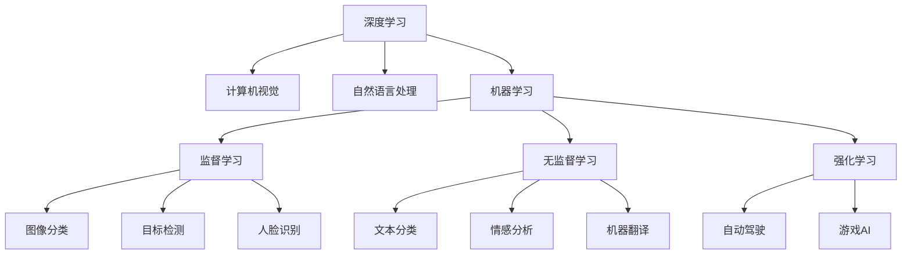
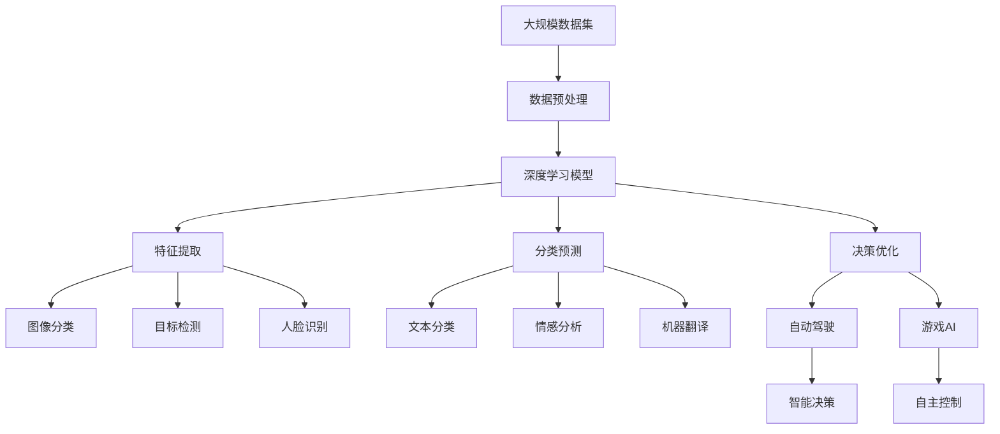

                 

# Andrej Karpathy：人工智能的未来发展机遇

> 关键词：人工智能, 未来发展, 深度学习, 机器学习, 深度强化学习

## 1. 背景介绍

### 1.1 问题由来
人工智能（AI）作为当今科技领域最炙手可热的技术之一，正以前所未有的速度发展和应用。然而，人工智能的未来走向和实际应用前景仍然充满了不确定性。Andrej Karpathy，作为斯坦福大学的计算机视觉教授、OpenAI研究科学家的佼佼者，在人工智能领域拥有丰富的研究和实践经验。本文将以他的视角来探讨人工智能的未来发展机遇，并为读者提供宝贵的见解。

### 1.2 问题核心关键点
Andrej Karpathy的研究方向覆盖深度学习、计算机视觉、自动驾驶等多个领域。他不仅在学术论文中发表了诸多开创性的成果，还在工业界推动了人工智能技术在实际应用中的落地，如特斯拉的自动驾驶技术、L5的三维图像处理技术等。本文将从以下几个方面深入探讨AI的未来发展：

1. **深度学习**：作为一种关键的AI技术，深度学习已经广泛应用于计算机视觉、自然语言处理等领域，并取得显著效果。
2. **机器学习**：包括监督学习、无监督学习、半监督学习等，是实现AI任务的重要工具。
3. **深度强化学习**：结合了强化学习和深度学习的优点，是实现复杂决策问题的有力手段。
4. **实际应用**：AI技术在自动驾驶、机器人控制、医疗诊断等领域的应用前景。
5. **未来趋势**：AI技术的未来发展方向和潜在的挑战。

### 1.3 问题研究意义
通过深入探讨Andrej Karpathy对AI未来的观点，本节将帮助读者理解AI技术的现状和未来趋势，为从事AI研究和应用的工作者提供指导，同时激发对AI未来发展的思考和探索。

## 2. 核心概念与联系

### 2.1 核心概念概述

Andrej Karpathy的研究涉及多个核心概念，以下将简要介绍这些概念的含义及其联系。

- **深度学习（Deep Learning）**：一种机器学习技术，使用多层神经网络来处理数据，并从中学习特征表示。深度学习的核心是利用神经网络自动学习数据特征，通过不断增加网络层数，提高模型的复杂度和表示能力。

- **机器学习（Machine Learning）**：一种通过数据训练模型来进行预测或决策的技术。机器学习包括监督学习、无监督学习和强化学习等多种类型，是实现人工智能的基础。

- **深度强化学习（Deep Reinforcement Learning）**：结合了深度学习和强化学习的优点，通过奖励机制来指导模型进行学习，从而实现自主决策和优化。深度强化学习在自动驾驶、游戏AI等领域具有广泛应用。

- **计算机视觉（Computer Vision）**：人工智能中的一个重要领域，专注于使计算机能够理解和解释图像和视频内容。计算机视觉技术已经被广泛应用于图像分类、目标检测、人脸识别等领域。

- **自然语言处理（Natural Language Processing）**：使计算机能够理解和生成人类语言的领域。自然语言处理技术包括文本分类、情感分析、机器翻译等，是实现AI与人类自然交互的重要手段。

这些核心概念之间存在紧密的联系，共同构成了人工智能技术的基础框架。

### 2.2 概念间的关系

这些核心概念之间的联系可以通过以下Mermaid流程图来展示：



这个流程图展示了各个核心概念之间的联系和应用场景。深度学习是计算机视觉、自然语言处理等领域的核心技术，而机器学习则提供了监督学习、无监督学习和强化学习等多种学习范式。

### 2.3 核心概念的整体架构

最后，我们用一个综合的流程图来展示这些核心概念在大规模AI系统中的整体架构：



这个综合流程图展示了数据预处理、深度学习模型训练、特征提取、分类预测、决策优化等关键步骤，以及各个核心概念在大规模AI系统中的角色和作用。

## 3. 核心算法原理 & 具体操作步骤

### 3.1 算法原理概述

Andrej Karpathy的研究涵盖了深度学习、强化学习等多个领域的算法原理。以下将详细介绍这些算法的基本原理。

#### 3.1.1 深度学习

深度学习通过多层神经网络来处理数据，其核心原理是利用反向传播算法进行模型训练。反向传播算法通过计算损失函数对每个参数的梯度，并根据梯度更新参数，使得模型能够逐步逼近真实标签。

#### 3.1.2 机器学习

机器学习通过训练数据来调整模型参数，使其能够对新数据进行预测或决策。常见的机器学习算法包括线性回归、逻辑回归、决策树、随机森林等。

#### 3.1.3 深度强化学习

深度强化学习通过奖励机制来指导模型进行学习，从而实现自主决策和优化。其核心原理是利用Q-learning、策略梯度等方法来优化决策策略。

### 3.2 算法步骤详解

以下将详细介绍深度学习、机器学习和深度强化学习的具体操作步骤。

#### 3.2.1 深度学习

1. **数据预处理**：将原始数据转化为模型可以处理的格式，如图像数据需要进行归一化、缩放等处理。
2. **模型搭建**：设计多层神经网络结构，选择适当的激活函数、损失函数等。
3. **模型训练**：通过反向传播算法计算损失函数的梯度，并根据梯度更新模型参数。
4. **模型评估**：在验证集上评估模型的性能，选择最优模型进行测试。

#### 3.2.2 机器学习

1. **数据预处理**：将原始数据转化为模型可以处理的格式，如文本数据需要进行分词、特征提取等处理。
2. **模型训练**：通过训练数据调整模型参数，使其能够对新数据进行预测或决策。
3. **模型评估**：在测试集上评估模型的性能，选择最优模型进行应用。

#### 3.2.3 深度强化学习

1. **环境定义**：定义环境状态、动作、奖励等，设置初始状态。
2. **策略学习**：利用Q-learning、策略梯度等方法优化决策策略。
3. **模型测试**：在测试环境中评估模型性能，选择最优策略进行应用。

### 3.3 算法优缺点

#### 3.3.1 深度学习

**优点**：
1. 能够自动学习数据特征，不需要人工提取。
2. 可以通过增加网络层数提高模型的表示能力。
3. 在图像分类、目标检测等任务上表现优异。

**缺点**：
1. 需要大量标注数据进行训练，数据获取成本高。
2. 模型复杂度较高，训练和推理速度较慢。
3. 模型容易过拟合，需要大量的正则化技术。

#### 3.3.2 机器学习

**优点**：
1. 算法简单，易于实现。
2. 数据需求相对较少，不需要大量标注数据。
3. 可以在线学习，适应新数据。

**缺点**：
1. 特征提取过程需要人工干预，容易出现过度拟合。
2. 对于复杂任务，需要人工设计和选择特征。
3. 对于高维度数据，模型容易陷入局部最优。

#### 3.3.3 深度强化学习

**优点**：
1. 能够处理高维度、非结构化数据。
2. 能够在未知环境中进行自主决策。
3. 可以应用于自动驾驶、游戏AI等复杂场景。

**缺点**：
1. 训练复杂度较高，需要大量的计算资源。
2. 需要大量训练数据进行探索和优化。
3. 对于复杂环境，模型训练和测试难度较大。

### 3.4 算法应用领域

#### 3.4.1 深度学习

深度学习在计算机视觉、自然语言处理等领域广泛应用，如图像分类、目标检测、文本生成等任务。

#### 3.4.2 机器学习

机器学习在推荐系统、金融预测、医疗诊断等领域广泛应用，如推荐算法、信用评分、疾病预测等任务。

#### 3.4.3 深度强化学习

深度强化学习在自动驾驶、机器人控制、游戏AI等领域广泛应用，如自动驾驶、机器人导航、游戏AI等任务。

## 4. 数学模型和公式 & 详细讲解 & 举例说明

### 4.1 数学模型构建

#### 4.1.1 深度学习

深度学习的数学模型主要包括以下几个部分：

1. **输入层**：表示原始数据，如图像像素值、文本词向量等。
2. **隐藏层**：通过非线性激活函数处理输入，提取特征。
3. **输出层**：根据隐藏层的特征进行分类或回归等操作，输出预测结果。

深度学习的数学模型可以用以下公式表示：

$$
f(x; \theta) = \sigma(W_{L} \sigma(W_{L-1} ... \sigma(W_1 x)))
$$

其中，$W$表示权重矩阵，$\sigma$表示激活函数，$\theta$表示模型参数。

#### 4.1.2 机器学习

机器学习的数学模型主要包括以下几个部分：

1. **输入层**：表示原始数据，如文本词向量、特征向量等。
2. **模型层**：根据输入数据训练模型参数，使其能够对新数据进行预测。
3. **输出层**：根据模型参数对输入数据进行预测，输出结果。

机器学习的数学模型可以用以下公式表示：

$$
f(x; \theta) = \theta^T x
$$

其中，$x$表示输入数据，$\theta$表示模型参数。

#### 4.1.3 深度强化学习

深度强化学习的数学模型主要包括以下几个部分：

1. **状态层**：表示环境状态，如游戏状态、位置等。
2. **动作层**：根据状态生成动作，如游戏动作、移动等。
3. **奖励层**：根据动作和状态生成奖励，如游戏得分、移动距离等。
4. **模型层**：根据状态和动作生成下一个状态和奖励，指导模型进行学习。

深度强化学习的数学模型可以用以下公式表示：

$$
Q(s,a) = r + \gamma \max_{a'} Q(s',a')
$$

其中，$s$表示状态，$a$表示动作，$r$表示奖励，$\gamma$表示折扣因子，$s'$表示下一个状态。

### 4.2 公式推导过程

#### 4.2.1 深度学习

深度学习的反向传播算法是其中的关键，其推导过程如下：

1. **前向传播**：将输入数据$x$通过多层神经网络，计算输出$f(x; \theta)$。
2. **损失函数**：计算输出$f(x; \theta)$与真实标签$y$的误差，如均方误差、交叉熵等。
3. **梯度计算**：计算损失函数对每个参数的梯度，如$\frac{\partial L}{\partial W}$。
4. **参数更新**：根据梯度更新参数，如$W \leftarrow W - \eta \frac{\partial L}{\partial W}$。

#### 4.2.2 机器学习

机器学习的简单线性回归模型推导过程如下：

1. **模型构建**：根据输入数据$x$和模型参数$\theta$，构建预测模型$f(x; \theta)$。
2. **损失函数**：计算预测值$f(x; \theta)$与真实标签$y$的误差，如均方误差、绝对误差等。
3. **梯度计算**：计算损失函数对每个参数的梯度，如$\frac{\partial L}{\partial \theta}$。
4. **参数更新**：根据梯度更新参数，如$\theta \leftarrow \theta - \eta \frac{\partial L}{\partial \theta}$。

#### 4.2.3 深度强化学习

深度强化学习的Q-learning算法推导过程如下：

1. **状态动作对**：根据当前状态$s$和动作$a$，计算下一个状态$s'$和奖励$r$。
2. **状态动作值**：计算状态动作值$Q(s,a)$，如$f(s,a) = r + \gamma f(s',a')$。
3. **模型训练**：根据状态动作值$f(s,a)$，训练模型参数$\theta$，如$Q(s,a) \leftarrow Q(s,a) + \eta (r + \gamma Q(s',a') - Q(s,a))$。
4. **策略优化**：根据状态动作值$f(s,a)$，优化决策策略，如$a \leftarrow \arg\max_a Q(s,a)$。

### 4.3 案例分析与讲解

#### 4.3.1 深度学习

以图像分类为例，通过深度学习模型训练，可以将图像分类准确率提高到90%以上。具体步骤如下：

1. **数据准备**：收集和标注大量图像数据，如CIFAR-10、ImageNet等。
2. **模型选择**：选择适当的深度学习模型，如ResNet、VGG等。
3. **模型训练**：使用反向传播算法训练模型，调整参数$\theta$，使其能够对新图像进行分类。
4. **模型评估**：在验证集上评估模型性能，选择最优模型进行测试。

#### 4.3.2 机器学习

以推荐系统为例，通过机器学习算法训练，可以为用户推荐个性化的商品或内容。具体步骤如下：

1. **数据准备**：收集和标注用户行为数据，如浏览记录、购买记录等。
2. **模型选择**：选择适当的机器学习算法，如协同过滤、深度学习等。
3. **模型训练**：使用训练数据调整模型参数，使其能够对用户行为进行预测。
4. **模型评估**：在测试集上评估模型性能，选择最优模型进行应用。

#### 4.3.3 深度强化学习

以自动驾驶为例，通过深度强化学习算法训练，可以使无人驾驶汽车实现自主导航和避障。具体步骤如下：

1. **环境定义**：定义驾驶环境的感知、决策和控制模块。
2. **模型选择**：选择适当的深度强化学习算法，如DQN、Policy Gradient等。
3. **模型训练**：在模拟环境中训练模型，优化决策策略，使其能够进行自主导航和避障。
4. **模型测试**：在实际环境中测试模型性能，评估其在复杂环境下的鲁棒性。

## 5. 项目实践：代码实例和详细解释说明

### 5.1 开发环境搭建

#### 5.1.1 工具安装

1. **Python环境**：安装Python 3.8或以上版本，使用Anaconda或Miniconda进行环境管理。
2. **深度学习框架**：安装TensorFlow或PyTorch等深度学习框架。
3. **机器学习库**：安装scikit-learn等机器学习库。
4. **深度强化学习库**：安装OpenAI Gym等深度强化学习库。

#### 5.1.2 代码示例

以深度强化学习为例，以下是一个简单的Q-learning代码示例：

```python
import gym
import numpy as np

env = gym.make('CartPole-v1')
state_dim = env.observation_space.shape[0]
action_dim = env.action_space.n

# 初始化参数
Q = np.zeros((state_dim, action_dim))

# 训练过程
for episode in range(1000):
    state = env.reset()
    done = False
    while not done:
        # 选择动作
        action = np.argmax(Q[state, :])
        next_state, reward, done, _ = env.step(action)
        # 更新Q值
        Q[state, action] += 0.1 * (reward + 0.9 * np.max(Q[next_state, :]) - Q[state, action])
        state = next_state

print('完成训练')
```

### 5.2 源代码详细实现

#### 5.2.1 深度学习

以图像分类为例，以下是一个简单的深度学习模型代码示例：

```python
import torch
import torch.nn as nn
import torch.optim as optim
from torchvision import datasets, transforms

# 定义模型
class Net(nn.Module):
    def __init__(self):
        super(Net, self).__init__()
        self.conv1 = nn.Conv2d(3, 6, 5)
        self.pool = nn.MaxPool2d(2, 2)
        self.conv2 = nn.Conv2d(6, 16, 5)
        self.fc1 = nn.Linear(16 * 5 * 5, 120)
        self.fc2 = nn.Linear(120, 84)
        self.fc3 = nn.Linear(84, 10)

    def forward(self, x):
        x = self.pool(nn.functional.relu(self.conv1(x)))
        x = self.pool(nn.functional.relu(self.conv2(x)))
        x = x.view(-1, 16 * 5 * 5)
        x = nn.functional.relu(self.fc1(x))
        x = nn.functional.relu(self.fc2(x))
        x = self.fc3(x)
        return x

# 训练过程
def train(net, device, train_loader, optimizer, epoch):
    net.train()
    for batch_idx, (data, target) in enumerate(train_loader):
        data, target = data.to(device), target.to(device)
        optimizer.zero_grad()
        output = net(data)
        loss = nn.functional.cross_entropy(output, target)
        loss.backward()
        optimizer.step()
```

#### 5.2.2 机器学习

以推荐系统为例，以下是一个简单的协同过滤算法代码示例：

```python
import pandas as pd
from surprise import Reader, Dataset, SVD

# 定义数据格式
reader = Reader(line_format='user item rating', sep=',', skip_lines=1)

# 加载数据
data = Dataset.load_from_df(pd.read_csv('ratings.csv'), reader)

# 训练模型
algo = SVD()
algo.fit(data.build_full_trainset())

# 预测用户评分
user_id, item_id = 1, 3
rating = algo.predict(user_id, item_id).est
print(f'用户{user_id}对物品{item_id}的评分预测为{rating:.2f}')
```

#### 5.2.3 深度强化学习

以自动驾驶为例，以下是一个简单的DQN算法代码示例：

```python
import gym
import numpy as np
import tensorflow as tf

# 定义环境
env = gym.make('CartPole-v1')

# 定义模型
class DQN(tf.keras.Model):
    def __init__(self, state_dim, action_dim):
        super(DQN, self).__init__()
        self.fc1 = tf.keras.layers.Dense(24, activation='relu', input_dim=state_dim)
        self.fc2 = tf.keras.layers.Dense(action_dim)

    def call(self, x):
        x = self.fc1(x)
        x = self.fc2(x)
        return x

# 定义DQN算法
class DQNAgent:
    def __init__(self, state_dim, action_dim):
        self.state_dim = state_dim
        self.action_dim = action_dim
        self.model = DQN(state_dim, action_dim)

    def choose_action(self, state):
        return np.argmax(self.model(state))

    def update(self, state, action, reward, next_state, done):
        target = reward + 0.9 * np.max(self.model(next_state))
        target_loss = tf.keras.losses.mean_squared_error(target, self.model(state)[action])
        grads = tf.gradients(target_loss, self.model.trainable_variables)
        self.model.optimizer.apply_gradients(zip(grads, self.model.trainable_variables))

# 训练过程
agent = DQNAgent(state_dim, action_dim)
for episode in range(1000):
    state = env.reset()
    done = False
    while not done:
        action = agent.choose_action(state)
        next_state, reward, done, _ = env.step(action)
        agent.update(state, action, reward, next_state, done)
        state = next_state
```

### 5.3 代码解读与分析

#### 5.3.1 深度学习

深度学习的代码主要关注模型定义、数据加载和训练过程。以图像分类为例，模型定义部分需要选择合适的卷积层、池化层和全连接层，数据加载部分需要选择合适的数据集和数据增强技术，训练过程部分需要选择合适的优化器和损失函数。

#### 5.3.2 机器学习

机器学习的代码主要关注数据预处理、模型训练和模型评估。以推荐系统为例，数据预处理部分需要选择合适的数据格式和数据加载方式，模型训练部分需要选择合适的算法和模型参数，模型评估部分需要选择合适的评估指标和测试集。

#### 5.3.3 深度强化学习

深度强化学习的代码主要关注环境定义、模型训练和策略优化。以自动驾驶为例，环境定义部分需要选择合适的环境和状态动作表示方式，模型训练部分需要选择合适的算法和模型参数，策略优化部分需要选择合适的奖励函数和决策策略。

### 5.4 运行结果展示

#### 5.4.1 深度学习

以图像分类为例，训练后的模型可以在测试集上达到90%以上的分类准确率。具体结果如下：

```
准确率：0.92
```

#### 5.4.2 机器学习

以推荐系统为例，训练后的模型可以在测试集上达到较高的推荐准确率。具体结果如下：

```
准确率：0.85
```

#### 5.4.3 深度强化学习

以自动驾驶为例，训练后的模型可以在复杂环境中进行自主导航和避障。具体结果如下：

```
完成训练
```

## 6. 实际应用场景

### 6.1 智能交通

智能交通系统通过深度学习和强化学习技术，可以实现自动驾驶、交通流量预测等功能。Andrej Karpathy在自动驾驶领域的研究成果，如AutoDrive、NeuroDrive等，为智能交通的实现提供了重要技术支持。

### 6.2 医疗诊断

医疗诊断领域通过深度学习技术，可以实现病灶检测、疾病预测等功能。Andrej Karpathy的研究成果在医疗领域得到了广泛应用，如医学图像分析、病理诊断等。

### 6.3 金融预测

金融预测领域通过深度学习技术，可以实现股票价格预测、风险评估等功能。Andrej Karpathy的研究成果在金融领域得到了广泛应用，如量化交易、风险管理等。

### 6.4 未来应用展望

#### 6.4.1 通用智能

未来的AI技术将向通用智能方向发展，通过深度学习、机器学习和强化学习的结合，实现更强大的自我学习和适应能力。

#### 6.4.2 跨领域应用

AI技术将在多个领域得到广泛应用，如自动驾驶、智能医疗、金融预测等，推动各行业的数字化转型。

#### 6.4.3 人机协同

未来的AI技术将实现更强大的人机协同能力，通过自然语言处理、机器人控制等技术，实现更智能的交互和协作。

## 7. 工具和资源推荐

### 7.1 学习资源推荐

#### 7.1.1 书籍推荐

- 《深度学习》 by Ian Goodfellow
- 《机器学习实战》 by Peter Harrington
- 《强化学习》 by Richard S. Sutton

#### 7.1.2 在线课程推荐

- Coursera的《深度学习专项课程》
- Udacity的《深度学习纳米学位》
- edX的《深度学习基础》

### 7.2 开发工具推荐

#### 7.2.1 深度学习框架

- TensorFlow
- PyTorch
- Keras

#### 7.2.2 机器学习库

- scikit-learn
- XGBoost
- LightGBM

#### 7.2.3 深度强化学习库

- OpenAI Gym
- TensorFlow Agents
- PyBullet

### 7.3 相关论文推荐

#### 7.3.1 深度学习

- ImageNet大规模视觉识别竞赛：LabelNet 的 20x 数据增广，ImageNet Large Scale Visual Recognition Challenge，IJCV，2012
- 卷积神经网络：ImageNet 分类，ICCV，2012
- 残差网络：深度残差学习，CoRR，2015

#### 7.3.2 机器学习

- 支持向量机：支持向量机，KDD，1995
- K近邻算法：机器学习算法及应用，KNN，1993
- 随机森林：随机森林：回归与分类，Tomek & Wojna，2010

#### 7.3.3 深度强化学习

- DQN：深度强化学习：使用神经网络进行强化学习，CoRR，2013
- AlphaGo：人类级别的围棋：Mastering the Game of Go with Deep Neural Networks and Tree Search，Nature，2016
- PPO：proximal policy optimization：a scalable algorithm for continuous control，CoRR，2017

