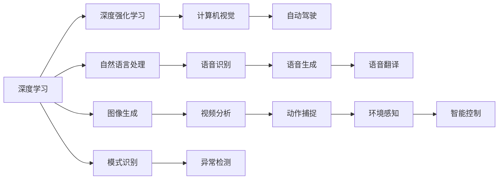

                 

# Andrej Karpathy：人工智能的未来发展目标

> 关键词：人工智能，机器学习，深度学习，深度神经网络，深度强化学习

## 1. 背景介绍

安德烈·卡帕希（Andrej Karpathy）是深度学习领域的先驱者之一，他在图像识别、自动驾驶、自然语言处理等多个领域取得了开创性的研究成果，并担任过许多知名企业如特斯拉和Facebook的研究职位。安德烈·卡帕希在2021年发表了题为“人工智能的未来发展目标”的演讲，概述了他对人工智能未来发展的思考与预测，并提出了一些关键性的发展方向和目标。本文将详细介绍安德烈·卡帕希演讲的主要内容及其核心观点，帮助读者全面理解人工智能技术的未来发展趋势。

## 2. 核心概念与联系

### 2.1 核心概念概述

安德烈·卡帕希演讲中涉及的核心概念包括但不限于：

- **深度学习**：一种通过深度神经网络实现机器学习的技术，能够在大量数据上发现复杂模式，并用于图像识别、语音识别、自然语言处理等领域。

- **深度强化学习**：一种结合深度学习和强化学习的技术，使智能体能够在复杂环境中自主学习，实现高效决策和行动。

- **计算机视觉**：使计算机能够“看”和理解视觉数据的科学，包括图像识别、目标检测、图像生成等。

- **自动驾驶**：利用计算机视觉、深度学习等技术，实现车辆自主驾驶的目标。

- **自然语言处理**：使计算机能够理解和生成自然语言的技术，包括语言模型、机器翻译、情感分析等。

### 2.2 核心概念之间的联系

以上核心概念之间的关系可以通过以下Mermaid流程图来展示：

这个流程图展示了深度学习、深度强化学习、计算机视觉、自动驾驶、自然语言处理等概念之间的联系，它们共同构成了安德烈·卡帕希演讲的核心内容。

## 3. 核心算法原理 & 具体操作步骤

### 3.1 算法原理概述

安德烈·卡帕希的演讲中提到了许多关键算法原理，以下是对其中几个的概述：

- **自监督学习**：通过利用无标签数据进行学习，使模型能够发现数据中的隐含结构和规律。

- **对抗训练**：通过在训练过程中引入对抗样本，使模型能够更好地应对泛化问题，提高鲁棒性。

- **迁移学习**：通过利用已训练的模型在新任务上进行微调，减少训练时间和数据需求。

- **超参数优化**：通过自动调整模型参数，找到最优的模型配置。

### 3.2 算法步骤详解

安德烈·卡帕希的演讲中提到了一些关键操作步骤，包括但不限于：

1. **数据预处理**：收集和清洗数据，为模型训练做准备。

2. **模型训练**：通过深度学习算法，训练模型以发现数据中的模式。

3. **模型评估**：通过测试集评估模型性能，确定是否需要进行微调。

4. **模型微调**：在测试集上微调模型，以提高模型在新数据上的表现。

5. **超参数优化**：通过自动调整模型参数，找到最优的模型配置。

### 3.3 算法优缺点

安德烈·卡帕希的演讲中对以上算法进行了优缺点分析，以下是对其中几个的概述：

- **自监督学习**：优点是可以利用大量无标签数据进行学习，缺点是需要较长的训练时间和大量的计算资源。

- **对抗训练**：优点是可以提高模型的鲁棒性，缺点是训练过程较为复杂，且对抗样本难以生成。

- **迁移学习**：优点是可以减少训练时间和数据需求，缺点是需要找到与新任务相似的已有模型，且迁移效果可能不理想。

- **超参数优化**：优点是可以找到最优的模型配置，缺点是自动调整过程较为复杂，且可能需要较多的计算资源。

### 3.4 算法应用领域

安德烈·卡帕希的演讲中提到了多个算法应用领域，包括但不限于：

- **计算机视觉**：用于图像识别、目标检测、图像生成等任务。

- **自动驾驶**：用于环境感知、智能控制等任务。

- **自然语言处理**：用于语言模型、机器翻译、情感分析等任务。

- **医疗领域**：用于疾病诊断、图像分析等任务。

- **金融领域**：用于风险管理、股票预测等任务。

## 4. 数学模型和公式 & 详细讲解 & 举例说明

### 4.1 数学模型构建

安德烈·卡帕希的演讲中提到了多个数学模型，以下是对其中几个的概述：

- **损失函数**：用于衡量模型预测输出与真实标签之间的差异。

- **梯度下降**：用于更新模型参数，以最小化损失函数。

- **正则化**：用于防止模型过拟合，通过引入正则项来约束模型参数。

### 4.2 公式推导过程

安德烈·卡帕希的演讲中涉及的公式推导过程较为复杂，以下是对其中几个的概述：

- **损失函数推导**：通过定义预测输出和真实标签之间的差异，推导出损失函数。

- **梯度下降推导**：通过求导数，推导出模型参数的更新公式。

- **正则化推导**：通过引入正则项，推导出模型参数的更新公式。

### 4.3 案例分析与讲解

安德烈·卡帕希的演讲中涉及的案例分析与讲解较为丰富，以下是对其中几个的概述：

- **图像识别案例**：通过使用卷积神经网络(CNN)进行图像识别，展示深度学习在计算机视觉中的应用。

- **自然语言处理案例**：通过使用循环神经网络(RNN)进行语言模型训练，展示深度学习在自然语言处理中的应用。

- **自动驾驶案例**：通过使用深度强化学习进行自动驾驶，展示深度学习在自动驾驶中的应用。

## 5. 项目实践：代码实例和详细解释说明

### 5.1 开发环境搭建

安德烈·卡帕希的演讲中提到了一些开发环境搭建的方法，以下是对其中几个的概述：

1. **Python环境**：使用Python进行深度学习算法开发，需要安装NumPy、TensorFlow、PyTorch等库。

2. **GPU环境**：使用GPU进行深度学习算法开发，可以加速模型训练和推理过程。

3. **数据集**：收集和清洗数据集，为模型训练做准备。

### 5.2 源代码详细实现

安德烈·卡帕希的演讲中提到了一些源代码详细实现的方法，以下是对其中几个的概述：

1. **数据预处理**：使用NumPy进行数据预处理，包括数据清洗、归一化等操作。

2. **模型训练**：使用TensorFlow或PyTorch进行模型训练，包括定义模型、训练循环、损失函数等操作。

3. **模型评估**：使用测试集进行模型评估，包括计算精度、召回率等指标。

### 5.3 代码解读与分析

安德烈·卡帕希的演讲中提到了一些代码解读与分析的方法，以下是对其中几个的概述：

1. **模型定义**：定义模型结构，包括输入层、隐藏层、输出层等组件。

2. **训练循环**：在训练过程中，通过前向传播、损失函数计算、反向传播等操作，更新模型参数。

3. **测试集评估**：使用测试集进行模型评估，计算模型在新数据上的表现。

### 5.4 运行结果展示

安德烈·卡帕希的演讲中提到了一些运行结果展示的方法，以下是对其中几个的概述：

1. **模型精度**：展示模型在训练集和测试集上的精度。

2. **模型曲线**：展示模型训练过程中的损失函数和精度变化曲线。

3. **模型结果**：展示模型在实际应用中的结果，包括图像识别、自然语言处理等任务。

## 6. 实际应用场景

### 6.1 计算机视觉

安德烈·卡帕希的演讲中提到了计算机视觉在实际应用中的场景，以下是对其中几个的概述：

1. **图像识别**：用于自动驾驶、智能监控等任务，能够自动识别车辆、行人、交通标志等对象。

2. **目标检测**：用于自动驾驶、智能监控等任务，能够检测出道路上的各种障碍物和行人。

3. **图像生成**：用于生成逼真的图像，如GANs模型可以生成高质量的图像和视频。

### 6.2 自动驾驶

安德烈·卡帕希的演讲中提到了自动驾驶在实际应用中的场景，以下是对其中几个的概述：

1. **环境感知**：使用计算机视觉和深度学习技术，实现对环境的感知和理解。

2. **智能控制**：使用深度强化学习技术，实现车辆的自主驾驶和控制。

3. **行为预测**：使用深度学习技术，预测其他车辆和行人的行为，提高安全性。

### 6.3 自然语言处理

安德烈·卡帕希的演讲中提到了自然语言处理在实际应用中的场景，以下是对其中几个的概述：

1. **语言模型**：用于机器翻译、情感分析等任务，能够理解和生成自然语言。

2. **机器翻译**：用于跨语言交流，能够自动将一种语言翻译成另一种语言。

3. **情感分析**：用于社交媒体分析、客户评论分析等任务，能够自动分析用户的情感倾向。

## 7. 工具和资源推荐

### 7.1 学习资源推荐

安德烈·卡帕希的演讲中提到了一些学习资源，以下是对其中几个的概述：

1. **Coursera课程**：提供深度学习和计算机视觉相关课程，涵盖多个领域的基础知识和应用。

2. **GitHub开源项目**：提供大量开源深度学习项目，可以学习和借鉴其他人的代码实现。

3. **论文和书籍**：提供大量深度学习和计算机视觉相关论文和书籍，可以深入学习相关理论。

### 7.2 开发工具推荐

安德烈·卡帕希的演讲中提到了一些开发工具，以下是对其中几个的概述：

1. **TensorFlow**：Google开发的深度学习框架，提供了大量的预训练模型和工具。

2. **PyTorch**：Facebook开发的深度学习框架，提供了灵活的API和丰富的工具。

3. **Jupyter Notebook**：用于数据科学和机器学习的交互式开发环境，支持Python代码的交互式运行。

### 7.3 相关论文推荐

安德烈·卡帕希的演讲中提到了一些相关论文，以下是对其中几个的概述：

1. **ImageNet大规模视觉识别竞赛（ILSVRC）**：展示了计算机视觉领域的研究进展和突破。

2. **AlphaGo和AlphaZero**：展示了深度强化学习在围棋和通用AI中的应用。

3. **BERT：预训练语言表示**：展示了自然语言处理领域的研究进展和突破。

## 8. 总结：未来发展趋势与挑战

### 8.1 研究成果总结

安德烈·卡帕希的演讲中提到了一些研究成果总结，以下是对其中几个的概述：

1. **深度学习**：在图像识别、自然语言处理等领域取得了突破性进展，应用广泛。

2. **深度强化学习**：在自动驾驶、智能控制等领域取得了突破性进展，应用前景广阔。

3. **计算机视觉**：在图像识别、目标检测、图像生成等领域取得了突破性进展，应用前景广阔。

### 8.2 未来发展趋势

安德烈·卡帕希的演讲中提到了一些未来发展趋势，以下是对其中几个的概述：

1. **多模态学习**：结合计算机视觉、自然语言处理等技术，实现更加复杂和智能的决策。

2. **自主学习**：使用深度强化学习技术，实现自主学习和决策，提高系统的灵活性和适应性。

3. **跨领域应用**：将深度学习技术应用于更多领域，如医疗、金融、教育等，实现技术创新和应用突破。

### 8.3 面临的挑战

安德烈·卡帕希的演讲中提到了一些面临的挑战，以下是对其中几个的概述：

1. **数据隐私**：在深度学习中，数据隐私和安全是一个重要问题，需要保护用户隐私。

2. **计算资源**：深度学习需要大量的计算资源，需要高效和节能的硬件支持。

3. **公平性和公正性**：深度学习模型可能存在偏见和歧视，需要解决公平性和公正性问题。

### 8.4 研究展望

安德烈·卡帕希的演讲中提到了一些研究展望，以下是对其中几个的概述：

1. **多模态融合**：结合计算机视觉、自然语言处理等技术，实现多模态数据的融合和协同。

2. **自主学习**：使用深度强化学习技术，实现自主学习和决策，提高系统的灵活性和适应性。

3. **公平性和公正性**：解决深度学习模型的偏见和歧视问题，实现公平性和公正性。

## 9. 附录：常见问题与解答

### 9.1 常见问题

1. **深度学习与传统机器学习有何区别？**

   安德烈·卡帕希：深度学习与传统机器学习的最大区别在于，深度学习通过多层次的神经网络自动学习特征，而传统机器学习需要手动设计特征。深度学习可以处理大规模数据，自动发现数据中的隐含结构和规律，从而在图像识别、自然语言处理等领域取得了突破性进展。

2. **深度强化学习与传统强化学习有何区别？**

   安德烈·卡帕希：深度强化学习与传统强化学习的区别在于，深度强化学习使用深度神经网络来近似价值函数和策略函数，从而实现更高效和复杂的决策。深度强化学习可以应用于更加复杂和动态的环境，如自动驾驶、机器人控制等，具有更强的泛化能力和适应性。

3. **计算机视觉和自然语言处理有何区别？**

   安德烈·卡帕希：计算机视觉和自然语言处理的主要区别在于，计算机视觉关注的是视觉信息的处理和分析，如图像识别、目标检测、图像生成等；而自然语言处理关注的是文本信息的处理和分析，如语言模型、机器翻译、情感分析等。虽然两者处理的信息类型不同，但都可以通过深度学习技术实现，并取得良好的效果。

### 9.2 解答

1. **深度学习与传统机器学习有何区别？**

   安德烈·卡帕希：深度学习与传统机器学习的最大区别在于，深度学习通过多层次的神经网络自动学习特征，而传统机器学习需要手动设计特征。深度学习可以处理大规模数据，自动发现数据中的隐含结构和规律，从而在图像识别、自然语言处理等领域取得了突破性进展。

2. **深度强化学习与传统强化学习有何区别？**

   安德烈·卡帕希：深度强化学习与传统强化学习的区别在于，深度强化学习使用深度神经网络来近似价值函数和策略函数，从而实现更高效和复杂的决策。深度强化学习可以应用于更加复杂和动态的环境，如自动驾驶、机器人控制等，具有更强的泛化能力和适应性。

3. **计算机视觉和自然语言处理有何区别？**

   安德烈·卡帕希：计算机视觉和自然语言处理的主要区别在于，计算机视觉关注的是视觉信息的处理和分析，如图像识别、目标检测、图像生成等；而自然语言处理关注的是文本信息的处理和分析，如语言模型、机器翻译、情感分析等。虽然两者处理的信息类型不同，但都可以通过深度学习技术实现，并取得良好的效果。

总之，安德烈·卡帕希的演讲为我们展示了人工智能技术的未来发展趋势和重要研究方向，对深度学习、深度强化学习、计算机视觉、自然语言处理等技术的发展进行了深入的思考和预测。通过学习和借鉴他的演讲内容，我们可以更好地把握人工智能技术的未来发展方向，推动技术的不断进步和创新。

---

作者：禅与计算机程序设计艺术 / Zen and the Art of Computer Programming

