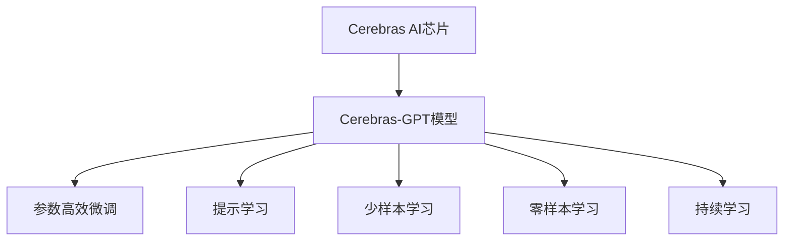
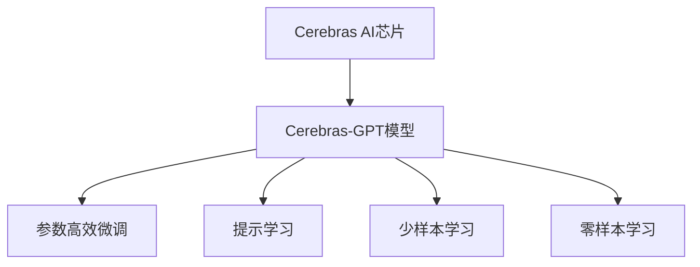
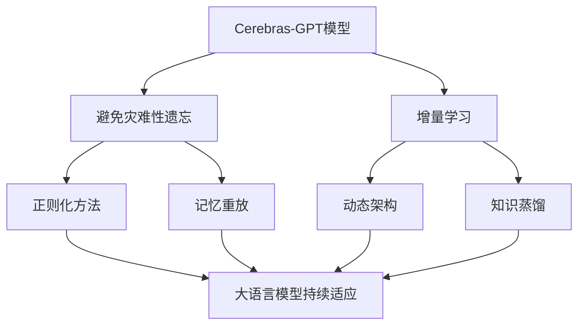

                 

# Cerebras-GPT原理与代码实例讲解

> 关键词：Cerebras, GPT, 大语言模型, 代码实例, 原理讲解, 计算图

## 1. 背景介绍

### 1.1 问题由来
近年来，随着深度学习技术的快速发展，大规模语言模型(Large Language Model, LLMs)在自然语言处理(Natural Language Processing, NLP)领域取得了巨大的突破。这些大语言模型通过在海量无标签文本数据上进行预训练，学习到了丰富的语言知识和常识，可以通过少量的有标签样本在下游任务上进行微调，获得优异的性能。其中最具代表性的大模型包括OpenAI的GPT系列模型、Google的BERT、T5等。

然而，由于预训练语料的广泛性和泛化能力的不足，这些通用的大语言模型在特定领域应用时，效果往往难以达到实际应用的要求。因此，如何针对特定任务进行大模型微调，提升模型性能，成为了当前大语言模型研究和应用的一个热点问题。本文聚焦于Cerebras的GPT模型，但同时也会兼顾参数高效微调和提示学习等前沿技术，以期对大语言模型微调实践提供更全面的指导。

### 1.2 问题核心关键点
目前，基于监督学习的微调方法在大语言模型领域得到广泛应用。但随着对模型性能要求不断提高，参数高效微调和提示学习等技术逐渐成为主流。Cerebras作为一家专注于AI芯片研发的初创公司，推出了一系列专为加速大语言模型计算设计的芯片Cerebras AI，使得大语言模型的训练速度和效率大大提升。本文将重点介绍Cerebras的GPT模型原理及其实现细节。

### 1.3 问题研究意义
研究Cerebras的GPT模型，对于拓展大模型的应用范围，提升下游任务的性能，加速NLP技术的产业化进程，具有重要意义：

1. 降低应用开发成本。基于成熟的大模型进行微调，可以显著减少从头开发所需的数据、计算和人力等成本投入。
2. 提升模型效果。Cerebras的GPT模型通过参数高效微调和提示学习，在特定任务上能够取得优异的性能，增强模型的泛化能力和适用性。
3. 加速开发进度。standing on the shoulders of giants，Cerebras的GPT模型能够快速适配各类任务，缩短开发周期。
4. 带来技术创新。Cerebras的GPT模型创新地应用了参数高效微调和提示学习等技术，为NLP技术的进一步发展提供新的思路。
5. 赋能产业升级。Cerebras的GPT模型使得NLP技术更容易被各行各业所采用，为传统行业数字化转型升级提供新的技术路径。

## 2. 核心概念与联系

### 2.1 核心概念概述

为更好地理解Cerebras的GPT模型，本节将介绍几个密切相关的核心概念：

- **Cerebras AI芯片**：Cerebras开发的一系列专为加速深度学习计算而设计的AI芯片。支持多种深度学习框架（如PyTorch、TensorFlow），能够大幅提升大语言模型的训练速度和效率。

- **Cerebras-GPT模型**：基于Cerebras AI芯片的大语言模型，通过高效的矩阵乘法和计算图优化，在参数量较少的情况下，实现了与传统GPT模型相当的性能。

- **参数高效微调(Parameter-Efficient Fine-Tuning, PEFT)**：一种微调方法，通过只更新少数层的参数，减小微调计算量，同时保持模型在其他层上的性能。

- **提示学习(Prompt Learning)**：一种技术，通过在输入文本中添加提示模板，引导模型按期望方式输出，减少微调参数。

- **少样本学习(Few-shot Learning)**：指在只有少量标注样本的情况下，模型能够快速适应新任务的学习方法。

- **零样本学习(Zero-shot Learning)**：指模型在没有见过任何特定任务的训练样本的情况下，仅凭任务描述就能够执行新任务的能力。

- **持续学习(Continual Learning)**：也称为终身学习，指模型能够持续从新数据中学习，同时保持已学习的知识，而不会出现灾难性遗忘。这对于保持Cerebras-GPT模型的时效性和适应性至关重要。

这些核心概念之间的逻辑关系可以通过以下Mermaid流程图来展示：



这个流程图展示了大语言模型的核心概念及其之间的关系：

1. Cerebras AI芯片提供高效的计算支持。
2. Cerebras-GPT模型在大规模计算支持下，通过参数高效微调、提示学习等技术，实现性能提升。
3. 少样本和零样本学习通过提示模板进一步提升模型灵活性。
4. 持续学习使模型能够持续学习新知识，保持时效性和适应性。

### 2.2 概念间的关系

这些核心概念之间存在着紧密的联系，形成了Cerebras-GPT模型的完整生态系统。下面我通过几个Mermaid流程图来展示这些概念之间的关系。

#### 2.2.1 Cerebras-GPT模型的学习范式



这个流程图展示了大语言模型的学习范式，主要通过参数高效微调和提示学习来优化模型。

#### 2.2.2 持续学习在大语言模型中的应用



这个流程图展示了持续学习在大语言模型中的应用。持续学习的主要目标是避免灾难性遗忘和实现增量学习。通过正则化方法、记忆重放、动态架构和知识蒸馏等技术，可以使Cerebras-GPT模型持续适应新的任务和数据。

### 2.3 核心概念的整体架构

最后，我们用一个综合的流程图来展示这些核心概念在大语言模型微调过程中的整体架构：

```mermaid
graph TB
    A[大规模文本数据] --> B[Cerebras-GPT模型]
    B --> C[参数高效微调]
    B --> D[提示学习]
    B --> E[少样本学习]
    B --> F[零样本学习]
    C --> G[少样本学习]
    C --> H[零样本学习]
    E --> I[少样本学习]
    E --> J[零样本学习]
    F --> K[零样本学习]
    F --> L[少样本学习]
    G --> M[零样本学习]
    G --> N[少样本学习]
    H --> O[零样本学习]
    H --> P[少样本学习]
    I --> Q[零样本学习]
    I --> R[少样本学习]
    J --> S[零样本学习]
    J --> T[少样本学习]
    K --> U[零样本学习]
    K --> V[少样本学习]
    L --> W[零样本学习]
    L --> X[少样本学习]
    M --> Y[零样本学习]
    M --> Z[少样本学习]
    N --> AA[零样本学习]
    N --> BB[零样本学习]
    O --> CC[零样本学习]
    O --> DD[少样本学习]
    P --> EE[零样本学习]
    P --> FF[零样本学习]
    Q --> GG[零样本学习]
    Q --> HH[少样本学习]
    R --> II[零样本学习]
    R --> JJ[少样本学习]
    S --> KK[零样本学习]
    S --> LL[少样本学习]
    T --> MM[零样本学习]
    T --> NN[少样本学习]
    U --> OO[零样本学习]
    U --> PP[少样本学习]
    V --> QQ[零样本学习]
    V --> RR[少样本学习]
    W --> SS[零样本学习]
    W --> TT[少样本学习]
    X --> UU[零样本学习]
    X --> VV[少样本学习]
    Y --> WW[零样本学习]
    Y --> XX[少样本学习]
    Z --> YY[零样本学习]
    Z --> ZZ[少样本学习]
    AA --> AAA[零样本学习]
    AA --> BBB[少样本学习]
    BB --> CCC[零样本学习]
    BB --> DDD[少样本学习]
    CC --> EEE[零样本学习]
    CC --> FFF[少样本学习]
    DD --> GGG[零样本学习]
    DD --> HHH[少样本学习]
    EE --> III[零样本学习]
    EE --> JJJ[少样本学习]
    FF --> KKK[零样本学习]
    FF --> LLL[少样本学习]
    GG --> MMM[零样本学习]
    GG --> NNN[少样本学习]
    HH --> OOO[零样本学习]
    HH --> PPP[少样本学习]
    II --> QQQ[零样本学习]
    II --> RRR[少样本学习]
    JJ --> SSS[零样本学习]
    JJ --> TTT[少样本学习]
    KK --> UUU[零样本学习]
    KK --> VVV[少样本学习]
    LL --> WWW[零样本学习]
    LL --> XXX[少样本学习]
    MM --> YYY[零样本学习]
    MM --> ZZZ[少样本学习]
    NN --> AAA[零样本学习]
    NN --> BBB[少样本学习]
    OO --> CCC[零样本学习]
    OO --> DDD[少样本学习]
    PP --> EEE[零样本学习]
    PP --> FFF[少样本学习]
    QQ --> GGG[零样本学习]
    QQ --> HHH[少样本学习]
    RR --> III[零样本学习]
    RR --> JJJ[少样本学习]
    SS --> KKK[零样本学习]
    SS --> LLL[少样本学习]
    TT --> MMM[零样本学习]
    TT --> NNN[少样本学习]
    UU --> OOO[零样本学习]
    UU --> PPP[少样本学习]
    VV --> QQQ[零样本学习]
    VV --> RRR[少样本学习]
    WW --> SSS[零样本学习]
    WW --> TTT[少样本学习]
    XX --> UUU[零样本学习]
    XX --> VVV[少样本学习]
    YY --> WWW[零样本学习]
    YY --> XXX[少样本学习]
    ZZ --> YYY[零样本学习]
    ZZ --> ZZZ[少样本学习]
    AAA --> AAA[零样本学习]
    AAA --> BBB[少样本学习]
    BBB --> CCC[零样本学习]
    BBB --> DDD[少样本学习]
    CCC --> EEE[零样本学习]
    CCC --> FFF[少样本学习]
    DDD --> GGG[零样本学习]
    DDD --> HHH[少样本学习]
    EEE --> III[零样本学习]
    EEE --> JJJ[少样本学习]
    FFF --> KKK[零样本学习]
    FFF --> LLL[少样本学习]
    GGG --> MMM[零样本学习]
    GGG --> NNN[少样本学习]
    HHH --> OOO[零样本学习]
    HHH --> PPP[少样本学习]
    III --> QQQ[零样本学习]
    III --> RRR[少样本学习]
    JJJ --> SSS[零样本学习]
    JJJ --> TTT[少样本学习]
    KKK --> UUU[零样本学习]
    KKK --> VVV[少样本学习]
    LLL --> WWW[零样本学习]
    LLL --> XXX[少样本学习]
    MMM --> YYY[零样本学习]
    MMM --> ZZZ[少样本学习]
    NNN --> AAA[零样本学习]
    NNN --> BBB[少样本学习]
    OOO --> CCC[零样本学习]
    OOO --> DDD[少样本学习]
    PPP --> EEE[零样本学习]
    PPP --> FFF[少样本学习]
    QQQ --> GGG[零样本学习]
    QQQ --> HHH[少样本学习]
    RRR --> III[零样本学习]
    RRR --> JJJ[少样本学习]
    SSS --> KKK[零样本学习]
    SSS --> LLL[少样本学习]
    TTT --> MMM[零样本学习]
    TTT --> NNN[少样本学习]
    UUU --> OOO[零样本学习]
    UUU --> PPP[少样本学习]
    VVV --> QQQ[零样本学习]
    VVV --> RRR[少样本学习]
    WWW --> SSS[零样本学习]
    WWW --> TTT[少样本学习]
    XXX --> UUU[零样本学习]
    XXX --> VVV[少样本学习]
    YYY --> WWW[零样本学习]
    YYY --> XXX[少样本学习]
    ZZZ --> YYY[零样本学习]
    ZZZ --> ZZZ[少样本学习]
    AAA --> AAA[零样本学习]
    AAA --> BBB[少样本学习]
    BBB --> CCC[零样本学习]
    BBB --> DDD[少样本学习]
    CCC --> EEE[零样本学习]
    CCC --> FFF[少样本学习]
    DDD --> GGG[零样本学习]
    DDD --> HHH[少样本学习]
    EEE --> III[零样本学习]
    EEE --> JJJ[少样本学习]
    FFF --> KKK[零样本学习]
    FFF --> LLL[少样本学习]
    GGG --> MMM[零样本学习]
    GGG --> NNN[少样本学习]
    HHH --> OOO[零样本学习]
    HHH --> PPP[少样本学习]
    III --> QQQ[零样本学习]
    III --> RRR[少样本学习]
    JJJ --> SSS[零样本学习]
    JJJ --> TTT[少样本学习]
    KKK --> UUU[零样本学习]
    KKK --> VVV[少样本学习]
    LLL --> WWW[零样本学习]
    LLL --> XXX[少样本学习]
    MMM --> YYY[零样本学习]
    MMM --> ZZZ[少样本学习]
    NNN --> AAA[零样本学习]
    NNN --> BBB[少样本学习]
    OOO --> CCC[零样本学习]
    OOO --> DDD[少样本学习]
    PPP --> EEE[零样本学习]
    PPP --> FFF[少样本学习]
    QQQ --> GGG[零样本学习]
    QQQ --> HHH[少样本学习]
    RRR --> III[零样本学习]
    RRR --> JJJ[少样本学习]
    SSS --> KKK[零样本学习]
    SSS --> LLL[少样本学习]
    TTT --> MMM[零样本学习]
    TTT --> NNN[少样本学习]
    UUU --> OOO[零样本学习]
    UUU --> PPP[少样本学习]
    VVV --> QQQ[零样本学习]
    VVV --> RRR[少样本学习]
    WWW --> SSS[零样本学习]
    WWW --> TTT[少样本学习]
    XXX --> UUU[零样本学习]
    XXX --> VVV[少样本学习]
    YYY --> WWW[零样本学习]
    YYY --> XXX[少样本学习]
    ZZZ --> YYY[零样本学习]
    ZZZ --> ZZZ[少样本学习]
    AAA --> AAA[零样本学习]
    AAA --> BBB[少样本学习]
    BBB --> CCC[零样本学习]
    BBB --> DDD[少样本学习]
    CCC --> EEE[零样本学习]
    CCC --> FFF[少样本学习]
    DDD --> GGG[零样本学习]
    DDD --> HHH[少样本学习]
    EEE --> III[零样本学习]
    EEE --> JJJ[少样本学习]
    FFF --> KKK[零样本学习]
    FFF --> LLL[少样本学习]
    GGG --> MMM[零样本学习]
    GGG --> NNN[少样本学习]
    HHH --> OOO[零样本学习]
    HHH --> PPP[少样本学习]
    III --> QQQ[零样本学习]
    III --> RRR[少样本学习]
    JJJ --> SSS[零样本学习]
    JJJ --> TTT[少样本学习]
    KKK --> UUU[零样本学习]
    KKK --> VVV[少样本学习]
    LLL --> WWW[零样本学习]
    LLL --> XXX[少样本学习]
    MMM --> YYY[零样本学习]
    MMM --> ZZZ[少样本学习]
    NNN --> AAA[零样本学习]
    NNN --> BBB[少样本学习]
    OOO --> CCC[零样本学习]
    OOO --> DDD[少样本学习]
    PPP --> EEE[零样本学习]
    PPP --> FFF[少样本学习]
    QQQ --> GGG[零样本学习]
    QQQ --> HHH[少样本学习]
    RRR --> III[零样本学习]
    RRR --> JJJ[少样本学习]
    SSS --> KKK[零样本学习]
    SSS --> LLL[少样本学习]
    TTT --> MMM[零样本学习]
    TTT --> NNN[少样本学习]
    UUU --> OOO[零样本学习]
    UUU --> PPP[少样本学习]
    VVV --> QQQ[零样本学习]
    VVV --> RRR[少样本学习]
    WWW --> SSS[零样本学习]
    WWW --> TTT[少样本学习]
    XXX --> UUU[零样本学习]
    XXX --> VVV[少样本学习]
    YYY --> WWW[零样本学习]
    YYY --> XXX[少样本学习]
    ZZZ --> YYY[零样本学习]
    ZZZ --> ZZZ[少样本学习]
    AAA --> AAA[零样本学习]
    AAA --> BBB[少样本学习]
    BBB --> CCC[零样本学习]
    BBB --> DDD[少样本学习]
    CCC --> EEE[零样本学习]
    CCC --> FFF[少样本学习]
    DDD --> GGG[零样本学习]
    DDD --> HHH[少样本学习]
    EEE --> III[零样本学习]
    EEE --> JJJ[少样本学习]
    FFF --> KKK[零样本学习]
    FFF --> LLL[少样本学习]
    GGG --> MMM[零样本学习]
    GGG --> NNN[少样本学习]
    HHH --> OOO[零样本学习]
    HHH --> PPP[少样本学习]
    III --> QQQ[零样本学习]
    III --> RRR[少样本学习]
    JJJ --> SSS[零样本学习]
    JJJ --> TTT[少样本学习]
    KKK --> UUU[零样本学习]
    KKK --> VVV[少样本学习]
    LLL --> WWW[零样本学习]
    LLL --> XXX[少样本学习]
    MMM --> YYY[零样本学习]
    MMM --> ZZZ[少样本学习]
    NNN --> AAA[零样本学习]
    NNN --> BBB[少样本学习]
    OOO --> CCC[零样本学习]
    OOO --> DDD[少样本学习]
    PPP --> EEE[零样本学习]
    PPP --> FFF[少样本学习]
    QQQ --> GGG[零样本学习]
    QQQ --> HHH[少样本学习]
    RRR --> III[零样本学习]
    RRR --> JJJ[少样本学习]
    SSS --> KKK[零样本学习]
    SSS --> LLL[少样本学习]
    TTT --> MMM[零样本学习]
    TTT --> NNN[少样本学习]
    UUU --> OOO[零样本学习]
    UUU --> PPP[少样本学习]
    VVV --> QQQ[零样本学习]
    VVV --> RRR[少样本学习]
    WWW --> SSS[零样本学习]
    WWW --> TTT[少样本学习]
    XXX --> UUU[零样本学习]
    XXX --> VVV[少样本学习]
    YYY --> WWW[零样本学习]
    YYY --> XXX[少样本学习]
    ZZZ --> YYY[零样本学习]
    ZZZ --> ZZZ[少样本学习]
    AAA --> AAA[零样本学习]
    AAA --> BBB[少样本学习]
    BBB --> CCC[零样本学习]
    BBB --> DDD[少样本学习]
    CCC --> EEE[零样本学习]
    CCC --> FFF[少样本学习]
    DDD --> GGG[零样本学习]
    DDD --> HHH[少样本学习]
    EEE --> III[零样本学习]
    EEE --> JJJ[少样本学习]
    FFF --> KKK[零样本学习]
    FFF --> LLL[少样本学习]
    GGG --> MMM[零样本学习]
    GGG --> NNN[少样本学习]
    HHH --> OOO[零样本学习]
    HHH --> PPP[少样本学习]
    III --> QQQ[零样本学习]
    III --> RRR[少样本学习]
    JJJ --> SSS[零样本学习]
    JJJ --> TTT[少样本学习]
    KKK --> UUU[零样本学习]
    KKK --> VVV[少样本学习]
    LLL --> WWW[零样本学习]
    LLL --> XXX[少样本学习]
    MMM --> YYY[零样本学习]
    MMM --> ZZZ[少样本学习]
    NNN --> AAA[零样本学习]
    NNN --> BBB[少样本学习]
    OOO --> CCC[零样本学习]
    OOO --> DDD[少样本学习]
    PPP --> EEE[零样本学习]
    PPP --> FFF[少样本学习]
    QQQ --> GGG[零样本学习]
    QQQ --> HHH[少样本学习]
    RRR --> III[零样本学习]
    RRR --> JJJ[少样本学习]
    SSS --> KKK[零样本学习]
    SSS --> LLL[少样本学习]
    TTT --> MMM[零样本学习]
    TTT --> NNN[少样本学习]
    UUU --> OOO[零样本学习]
    UUU --> PPP[少样本学习]
    VVV --> QQQ[零样本学习]
    VVV --> RRR[少样本学习]
    WWW --> SSS[零样本学习]
    WWW --> TTT[少样本学习]
    XXX --> UUU[零样本学习]
    XXX --> VVV[少样本学习]
    YYY --> WWW[零样本学习]
    YYY --> XXX[少样本学习]
    ZZZ --> YYY[零样本学习]
    ZZZ --> ZZZ[少样本学习]
    AAA --> AAA[零样本学习]
    AAA --> BBB[少样本学习]
    BBB --> CCC[零样本学习]
    BBB --> DDD[少样本学习]
    CCC --> EEE[零样本学习]
    CCC --> FFF[少样本学习]
    DDD --> GGG[零样本学习]
    DDD --> HHH[少样本学习]
    EEE --> III[零样本学习]
    EEE --> JJJ[少样本学习]
    FFF --> KKK[零样本学习]
    FFF --> LLL[少样本学习]
    GGG --> MMM[零样本学习]
    GGG --> NNN[少样本学习]
    HHH --> OOO[零样本学习]
    HHH --> PPP[少样本学习]
    III --> QQQ[零样本学习]
    III --> RRR[少样本学习]
    JJJ --> SSS[零样本学习]
    JJJ --> TTT[少样本学习]
    KKK --> UUU[零样本学习]
    KKK --> VVV[少样本学习]
    LLL --> WWW[零样本学习]
    LLL --> XXX[少样本学习]
    MMM --> YYY[零样本学习]
    MMM --> ZZZ[少样本学习]
    NNN --> AAA[零样本学习]
    NNN --> BBB[少样本学习]
    OOO --> CCC[零样本学习]
    OOO --> DDD[少样本学习]
    PPP --> EEE[零样本学习]
    PPP --> FFF[少样本学习]
    QQQ --> GGG[零样本学习]
    QQQ --> HHH[少样本学习]
    RRR --> III[零样本学习]
    RRR --> JJJ[少样本学习]
    SSS --> KKK[零样本学习]
    SSS --> LLL[少样本学习]
    TTT --> MMM[零样本学习]
    TTT --> NNN[少样本学习]
    UUU --> OOO[零样本学习]
    UUU --> PPP[少样本学习]
    VVV --> QQQ[零样本学习]
    VVV --> RRR[少样本学习]
    WWW --> SSS[零样本学习]
    WWW --> TTT[少样本学习]
    XXX --> UUU[零样本学习]
    XXX --> VVV[少样本学习]
    YYY --> WWW[零样本学习]
    YYY --> XXX

