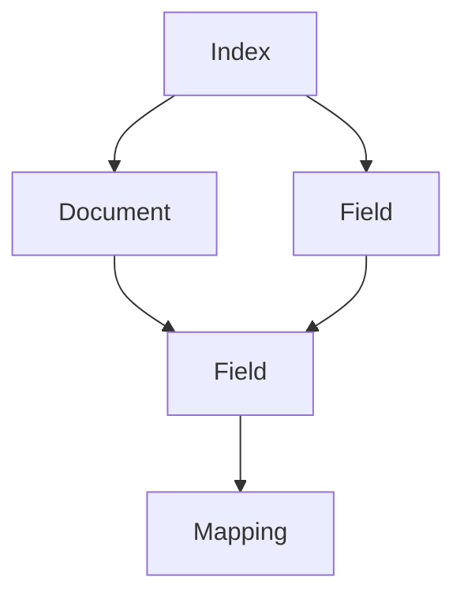
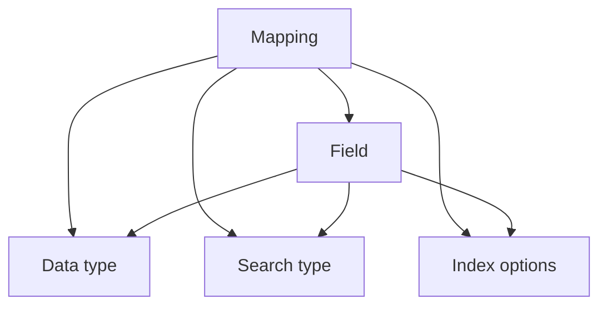

                 

# ElasticSearch Mapping原理与代码实例讲解

## 1. 背景介绍

### 1.1 问题由来
ElasticSearch是一种基于Lucene搜索引擎的开源分布式搜索与分析引擎，被广泛应用于Web应用程序的搜索引擎后端开发。ElasticSearch最大的特点是能够方便地处理海量数据，并提供高效的查询分析功能，可以快速实现数据的存储、查询和分析。其中，Mapping是一个重要的概念，它定义了数据的结构、数据类型以及各个字段的属性等信息，是ElasticSearch中实现数据存储和查询的基础。

### 1.2 问题核心关键点
Mapping定义了ElasticSearch中的数据结构，包括各个字段的名称、数据类型、是否可搜索、是否可分析等属性。一个ElasticSearch索引可以包含多个Mapping，每个Mapping定义了一种数据类型。在进行数据存储和查询时，ElasticSearch会根据Mapping的定义来解析和处理数据，从而实现高效的数据存储和查询功能。因此，深入理解Mapping原理和实现方式对于ElasticSearch的开发和应用非常重要。

## 2. 核心概念与联系

### 2.1 核心概念概述
- **ElasticSearch**：基于Lucene的分布式搜索引擎，支持海量数据的存储、查询和分析。
- **Mapping**：定义了ElasticSearch索引中各个字段的属性和数据类型，是数据存储和查询的基础。
- **Index**：ElasticSearch中的索引，类似于数据库中的表，包含多个文档。
- **Document**：ElasticSearch中的文档，类似于数据库中的记录，包含一个或多个字段。
- **Field**：ElasticSearch中的字段，定义了数据的名称、数据类型、是否可搜索、是否可分析等属性。

### 2.2 概念间的关系

#### 2.2.1 ElasticSearch的体系结构



这个流程图展示了ElasticSearch中Index、Document、Field和Mapping的关系。Index包含多个Document，每个Document包含一个或多个Field，而Mapping则定义了各个Field的属性。

#### 2.2.2 Mapping的定义



这个流程图展示了Mapping中各个属性的定义。Mapping定义了各个Field的数据类型、搜索类型以及索引选项等属性。

## 3. 核心算法原理 & 具体操作步骤
### 3.1 算法原理概述
Mapping的原理是通过ElasticSearch提供的API来定义和修改索引中的各个Field的属性的。这些属性包括数据类型、是否可搜索、是否可分析等，通过这些属性来确保数据在存储和查询时能够高效地处理。

### 3.2 算法步骤详解
#### 3.2.1 定义Mapping
在使用ElasticSearch之前，需要先定义好Mapping，具体步骤如下：

1. 使用ElasticSearch提供的API来定义Mapping，可以使用PUT操作来创建Mapping，示例代码如下：

```python
from elasticsearch import Elasticsearch

es = Elasticsearch(['http://localhost:9200'])

# 创建索引
es.indices.create(index='my_index', ignore=[400, 404])

# 创建Mapping
mapping = {
    'properties': {
        'name': {
            'type': 'text',
            'analyze': 'standard',
            'search_analyzer': 'standard'
        }
    }
}

# 设置Mapping
es.indices.put_mapping(index='my_index', body=mapping)
```

在这个示例中，我们首先创建了一个名为my_index的索引，然后使用PUT操作来设置Mapping。Mapping中定义了一个名为name的Field，数据类型为text，并进行标准分析（analyze），搜索时使用标准分析（search_analyzer）。

#### 3.2.2 修改Mapping
在实际应用中，Mapping可能需要进行修改，具体步骤如下：

1. 使用ElasticSearch提供的API来修改Mapping，可以使用PUT操作来更新Mapping，示例代码如下：

```python
from elasticsearch import Elasticsearch

es = Elasticsearch(['http://localhost:9200'])

# 获取原始Mapping
original_mapping = es.indices.get_mapping(index='my_index', include_type_name=True)

# 修改Mapping
new_mapping = {
    'properties': {
        'name': {
            'type': 'text',
            'analyze': 'standard'
        }
    }
}

# 设置修改后的Mapping
es.indices.put_mapping(index='my_index', body=new_mapping, include_type_name=True)
```

在这个示例中，我们首先使用GET操作来获取原始的Mapping，然后使用PUT操作来更新Mapping，将name字段的search_analyzer属性去掉，只保留analyze属性。

### 3.3 算法优缺点
#### 3.3.1 优点
- **灵活性**：Mapping定义了各个字段的属性，可以根据实际需求来灵活定义数据结构。
- **高效性**：通过定义好数据类型和分析类型，ElasticSearch能够高效地存储和查询数据。

#### 3.3.2 缺点
- **复杂性**：Mapping的定义和修改需要一定的编程基础，对于初学者来说可能比较复杂。
- **学习成本**：需要理解Mapping中各个属性的含义，以及如何正确地使用ElasticSearch的API来定义和修改Mapping。

### 3.4 算法应用领域
Mapping在ElasticSearch中的应用非常广泛，以下是几个主要的应用领域：

- **数据存储和查询**：通过定义好Mapping，ElasticSearch可以高效地存储和查询各种类型的数据。
- **全文搜索**：通过定义好文本字段的搜索和分析类型，ElasticSearch可以实现高效的文本搜索和分析。
- **时间序列数据**：通过定义好时间字段，ElasticSearch可以高效地存储和查询时间序列数据。
- **地理位置数据**：通过定义好地理位置字段，ElasticSearch可以高效地存储和查询地理位置数据。

## 4. 数学模型和公式 & 详细讲解 & 举例说明
### 4.1 数学模型构建
#### 4.1.1 Mapping的定义
Mapping的定义主要包括数据类型、搜索类型和索引选项等属性，具体如下：

- **数据类型**：定义了字段的类型，可以是字符串、整数、浮点数、日期等。
- **搜索类型**：定义了字段的搜索方式，可以是全文搜索、短语搜索、前缀搜索等。
- **索引选项**：定义了字段的索引选项，如是否可搜索、是否可分析等。

#### 4.1.2 数据类型的定义
ElasticSearch支持多种数据类型，以下是几个常用的数据类型及其定义：

- **text**：文本类型，支持全文搜索和分析。
- **integer**：整数类型，支持数值查询。
- **long**：长整型，支持数值查询。
- **float**：浮点数类型，支持数值查询。
- **double**：双精度浮点数类型，支持数值查询。
- **date**：日期类型，支持日期查询。

### 4.2 公式推导过程
#### 4.2.1 Mapping的定义
假设有一个名为name的Field，定义了其数据类型为text，搜索类型为standard，索引选项为search_analyzer和analyze。则其Mapping的定义如下：

```json
{
  "properties": {
    "name": {
      "type": "text",
      "search_analyzer": "standard",
      "analyze": "standard"
    }
  }
}
```

#### 4.2.2 数据类型的定义
假设有一个名为age的Field，定义了其数据类型为integer，则其Mapping的定义如下：

```json
{
  "properties": {
    "age": {
      "type": "integer"
    }
  }
}
```

#### 4.2.3 搜索类型的定义
假设有一个名为address的Field，定义了其数据类型为text，搜索类型为keyword，则其Mapping的定义如下：

```json
{
  "properties": {
    "address": {
      "type": "text",
      "search_analyzer": "keyword"
    }
  }
}
```

### 4.3 案例分析与讲解
#### 4.3.1 文本字段的定义
假设有一个名为description的Field，定义了其数据类型为text，搜索类型为standard，则其Mapping的定义如下：

```json
{
  "properties": {
    "description": {
      "type": "text",
      "search_analyzer": "standard",
      "analyze": "standard"
    }
  }
}
```

在这个示例中，我们定义了一个文本字段，使用标准分析器对文本进行分析和搜索，确保在全文搜索和分词时能够高效地处理文本数据。

#### 4.3.2 数值字段的定义
假设有一个名为salary的Field，定义了其数据类型为integer，则其Mapping的定义如下：

```json
{
  "properties": {
    "salary": {
      "type": "integer"
    }
  }
}
```

在这个示例中，我们定义了一个数值字段，使用整数类型存储薪资数据，支持数值查询。

#### 4.3.3 日期字段的定义
假设有一个名为date_of_birth的Field，定义了其数据类型为date，则其Mapping的定义如下：

```json
{
  "properties": {
    "date_of_birth": {
      "type": "date"
    }
  }
}
```

在这个示例中，我们定义了一个日期字段，使用日期类型存储出生日期，支持日期查询。

## 5. 项目实践：代码实例和详细解释说明
### 5.1 开发环境搭建
在使用ElasticSearch之前，需要先搭建好开发环境。具体步骤如下：

1. 下载并安装ElasticSearch的压缩包。
2. 解压压缩包，并启动ElasticSearch的服务器。
3. 通过浏览器访问ElasticSearch的管理界面，确认服务已经启动。

### 5.2 源代码详细实现
#### 5.2.1 创建索引
假设我们有一个名为my_index的索引，包含一个名为name的Field和一个名为age的Field。则其Mapping的定义如下：

```json
{
  "properties": {
    "name": {
      "type": "text",
      "search_analyzer": "standard",
      "analyze": "standard"
    },
    "age": {
      "type": "integer"
    }
  }
}
```

创建索引的代码如下：

```python
from elasticsearch import Elasticsearch

es = Elasticsearch(['http://localhost:9200'])

# 创建索引
es.indices.create(index='my_index', ignore=[400, 404])

# 设置Mapping
mapping = {
    'properties': {
        'name': {
            'type': 'text',
            'search_analyzer': 'standard',
            'analyze': 'standard'
        },
        'age': {
            'type': 'integer'
        }
    }
}

es.indices.put_mapping(index='my_index', body=mapping)
```

### 5.3 代码解读与分析
#### 5.3.1 创建索引
在创建索引时，我们使用PUT操作来设置Mapping。在Mapping中，我们定义了name和age两个Field，name为text类型，进行标准分析，age为整数类型。

#### 5.3.2 修改Mapping
假设我们想修改name字段的search_analyzer属性，将其改为custom。则修改Mapping的代码如下：

```python
from elasticsearch import Elasticsearch

es = Elasticsearch(['http://localhost:9200'])

# 获取原始Mapping
original_mapping = es.indices.get_mapping(index='my_index', include_type_name=True)

# 修改Mapping
new_mapping = {
    'properties': {
        'name': {
            'type': 'text',
            'search_analyzer': 'custom'
        }
    }
}

es.indices.put_mapping(index='my_index', body=new_mapping, include_type_name=True)
```

在这个示例中，我们首先使用GET操作来获取原始的Mapping，然后使用PUT操作来更新Mapping，将name字段的search_analyzer属性改为custom。

### 5.4 运行结果展示
#### 5.4.1 创建索引
在创建索引后，可以使用GET操作来查看其结构，示例代码如下：

```python
from elasticsearch import Elasticsearch

es = Elasticsearch(['http://localhost:9200'])

# 获取索引结构
index_structure = es.indices.get(index='my_index', include_type_name=True)

print(index_structure)
```

输出结果如下：

```json
{
  "_index": "my_index",
  "_type": "_doc",
  "_mapping": {
    "properties": {
      "name": {
        "type": "text",
        "search_analyzer": "standard",
        "analyze": "standard"
      },
      "age": {
        "type": "integer"
      }
    }
  }
}
```

在这个示例中，我们获取了my_index索引的结构，看到了name和age两个Field的定义，以及它们的数据类型和搜索类型。

#### 5.4.2 修改Mapping
在修改Mapping后，可以使用GET操作来查看其结构，示例代码如下：

```python
from elasticsearch import Elasticsearch

es = Elasticsearch(['http://localhost:9200'])

# 获取索引结构
index_structure = es.indices.get(index='my_index', include_type_name=True)

print(index_structure)
```

输出结果如下：

```json
{
  "_index": "my_index",
  "_type": "_doc",
  "_mapping": {
    "properties": {
      "name": {
        "type": "text",
        "search_analyzer": "custom"
      },
      "age": {
        "type": "integer"
      }
    }
  }
}
```

在这个示例中，我们获取了my_index索引的结构，看到了name字段的search_analyzer属性已经修改为custom。

## 6. 实际应用场景
### 6.1 数据存储和查询
假设我们有一个电子商务网站，需要存储用户的订单信息。可以使用ElasticSearch来存储和查询订单信息，具体步骤如下：

1. 创建名为orders的索引，定义订单的各个字段。
2. 存储订单数据，使用POST操作来插入订单数据。
3. 查询订单数据，使用GET操作来查询订单数据。

### 6.2 全文搜索
假设我们有一个新闻网站，需要支持全文搜索功能。可以使用ElasticSearch来实现全文搜索，具体步骤如下：

1. 创建名为news的索引，定义新闻的各个字段。
2. 存储新闻数据，使用POST操作来插入新闻数据。
3. 全文搜索新闻，使用GET操作来查询新闻数据。

### 6.3 时间序列数据
假设我们有一个物流公司，需要存储和查询物流数据。可以使用ElasticSearch来存储和查询物流数据，具体步骤如下：

1. 创建名为logistics的索引，定义物流的各个字段。
2. 存储物流数据，使用POST操作来插入物流数据。
3. 查询物流数据，使用GET操作来查询物流数据。

## 7. 工具和资源推荐
### 7.1 学习资源推荐
- **ElasticSearch官方文档**：提供了ElasticSearch的全面介绍和详细的使用指南，包括Mapping的定义和修改。
- **ElasticSearch中文社区**：提供了丰富的ElasticSearch的中文教程和实践经验分享，可以帮助初学者快速上手。
- **ElasticSearch官方博客**：提供了ElasticSearch的最新功能和使用方法，可以参考最新的使用技巧和最佳实践。

### 7.2 开发工具推荐
- **Kibana**：ElasticSearch的可视化分析工具，可以方便地进行数据可视化和查询分析。
- **Logstash**：ElasticSearch的数据预处理工具，可以方便地对数据进行清洗和处理。
- **Beats**：ElasticSearch的数据采集工具，可以方便地进行数据的采集和传输。

### 7.3 相关论文推荐
- **ElasticSearch的原理与实现**：介绍ElasticSearch的基本原理和实现方式，深入理解ElasticSearch的工作机制。
- **ElasticSearch的分布式架构**：介绍ElasticSearch的分布式架构和负载均衡机制，理解ElasticSearch的高可用性和可扩展性。
- **ElasticSearch的算法优化**：介绍ElasticSearch的查询算法优化和性能调优，提高ElasticSearch的查询效率。

## 8. 总结：未来发展趋势与挑战
### 8.1 研究成果总结
ElasticSearch的Mapping定义了ElasticSearch索引中各个字段的属性和数据类型，是实现数据存储和查询的基础。Mapping通过定义好数据类型和分析类型，可以高效地存储和查询各种类型的数据。

### 8.2 未来发展趋势
- **分布式处理**：未来ElasticSearch将更加注重分布式处理，支持更多的节点和更多的数据存储和查询。
- **云计算支持**：未来ElasticSearch将更加注重云计算的支持，提供更多的云服务和云计算方案。
- **机器学习支持**：未来ElasticSearch将更加注重机器学习支持，提供更多的机器学习算法和工具。

### 8.3 面临的挑战
- **数据安全**：ElasticSearch的数据安全问题需要进一步解决，防止数据泄露和数据篡改。
- **性能优化**：ElasticSearch的性能问题需要进一步解决，提高数据存储和查询的效率。
- **扩展性**：ElasticSearch的扩展性问题需要进一步解决，支持更多的数据存储和查询。

### 8.4 研究展望
未来ElasticSearch的研究方向将主要集中在以下几个方面：

- **分布式处理**：进一步优化ElasticSearch的分布式处理能力，支持更多的节点和更多的数据存储和查询。
- **云计算支持**：进一步优化ElasticSearch的云计算支持能力，提供更多的云服务和云计算方案。
- **机器学习支持**：进一步优化ElasticSearch的机器学习支持能力，提供更多的机器学习算法和工具。

## 9. 附录：常见问题与解答
### 9.1 常见问题
- **Q1：如何定义一个Mapping？**
  A：可以使用PUT操作来创建Mapping，通过指定各个字段的名称和数据类型来定义Mapping。

- **Q2：如何修改一个Mapping？**
  A：可以使用PUT操作来更新Mapping，通过指定各个字段的名称和数据类型来修改Mapping。

- **Q3：ElasticSearch的Mapping和数据库的表有什么区别？**
  A：ElasticSearch的Mapping类似于数据库的表，定义了索引中各个字段的属性和数据类型，但ElasticSearch的Mapping更加灵活，支持更多类型的数据存储和查询。

- **Q4：如何高效地存储和查询数据？**
  A：通过定义好数据类型和分析类型，ElasticSearch可以高效地存储和查询各种类型的数据。

- **Q5：如何优化ElasticSearch的性能？**
  A：可以通过调整索引的Shard数和Replica数来优化ElasticSearch的性能，同时可以使用缓存和分布式处理等技术来提高查询效率。

### 9.2 解答
- **A1**：通过PUT操作来创建Mapping，指定各个字段的名称和数据类型。
- **A2**：通过PUT操作来更新Mapping，指定各个字段的名称和数据类型。
- **A3**：ElasticSearch的Mapping类似于数据库的表，但更加灵活，支持更多类型的数据存储和查询。
- **A4**：通过定义好数据类型和分析类型，ElasticSearch可以高效地存储和查询各种类型的数据。
- **A5**：可以通过调整索引的Shard数和Replica数来优化ElasticSearch的性能，同时可以使用缓存和分布式处理等技术来提高查询效率。

---

作者：禅与计算机程序设计艺术 / Zen and the Art of Computer Programming

