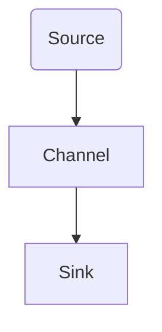
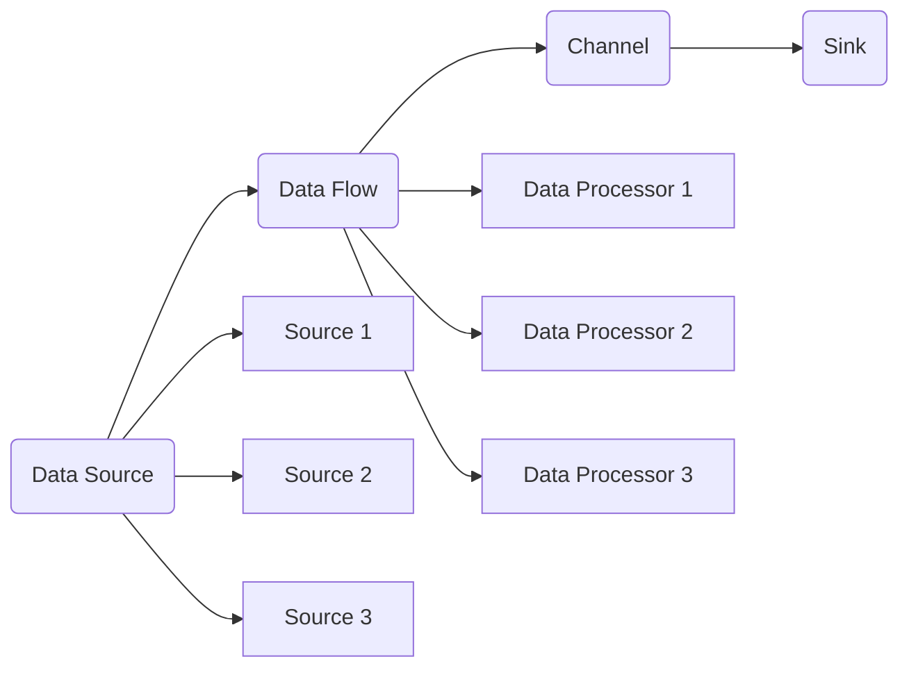

                 

# Flume原理与代码实例讲解

> 关键词：Apache Flume, 数据流处理, 日志收集, 集群架构, 自定义数据源, 数据流传输, 数据流存储, 动态扩展, 故障恢复, 性能优化

## 1. 背景介绍

### 1.1 问题由来

随着互联网的迅猛发展，各大网站和应用产生了海量日志数据。这些日志数据对于企业来说，是极其宝贵的资源，可以用来监控系统性能、诊断问题、分析用户行为等。然而，传统的日志收集和存储方式已无法满足这些需求，因此，一种高性能、高可靠性的日志收集系统变得至关重要。Apache Flume应运而生，它是一款基于Java的开源日志收集系统，提供了高性能、高可靠性和可扩展的数据流处理能力。

### 1.2 问题核心关键点

Apache Flume的主要特点是高性能、高可靠性和可扩展性，具体如下：

- **高性能**：Flume可以处理每秒数十万条日志数据，而且数据流传输过程没有阻塞，确保了数据的实时处理。
- **高可靠性**：Flume通过多级数据流传输机制，确保了数据传输的安全性，即使单个节点失败，数据也不会丢失。
- **可扩展性**：Flume支持水平扩展，可以根据数据量的增长动态调整系统配置，支持多个节点协同工作。

Flume的核心架构由四部分组成：数据源、数据流、通道和 sink。数据源负责从各种数据源收集日志数据，数据流处理数据传输和路由，通道是数据流的缓冲区，sink负责将数据存储到最终的目的地，如数据库、HDFS等。Flume还支持自定义数据源和sink，以及各种数据流处理器，如过滤器、聚合器等，满足了不同场景下的数据处理需求。

## 2. 核心概念与联系

### 2.1 核心概念概述

Flume的核心理念是通过“事件驱动”的方式，实现数据的实时收集和处理。Flume的事件驱动模型由三个主要部分组成：Source、Channel、Sink。

- **Source**：负责从各种数据源收集日志数据，如本地文件、远程服务器、网络接口等。
- **Channel**：是数据流的缓冲区，负责数据流的暂存，确保数据传输的稳定性和可靠性。
- **Sink**：负责将数据存储到最终的目的地，如数据库、HDFS、邮件等。

Flume的架构设计非常灵活，支持多种数据源和sink，可以轻松扩展和定制。此外，Flume还支持分布式部署，可以通过多个节点协同工作，提高系统的性能和可靠性。

### 2.2 概念间的关系

以下是一个简单的Flume架构示意图，展示了Source、Channel、Sink之间的关系：



这个示意图展示了Flume的基本架构：数据源从各种数据源收集日志数据，经过通道缓冲后，最终存储到sink中。Flume还支持多种数据源和sink，以及多种数据流处理器，可以灵活地组合配置，满足不同的数据处理需求。

### 2.3 核心概念的整体架构

Flume的整体架构可以分为四个主要模块：Data Source、Data Flow、Channel和Sink。以下是Flume的总体架构图：



这个架构图展示了Flume的数据流处理过程。数据源从不同的数据源收集日志数据，数据流处理器的多种组合，通道的缓冲区，最终将数据存储到sink中。Flume还支持自定义数据源和sink，以及多种数据流处理器，可以灵活地组合配置，满足不同的数据处理需求。

## 3. 核心算法原理 & 具体操作步骤
### 3.1 算法原理概述

Flume的核心算法原理是“事件驱动”模型，通过数据流的传输和处理，实现数据的实时收集和处理。Flume的算法原理可以简单概括为以下几个步骤：

1. **数据收集**：通过Source从各种数据源收集日志数据。
2. **数据传输**：将收集到的数据经过通道缓冲，传递给sink进行处理。
3. **数据处理**：Sink将数据存储到最终的目的地，如数据库、HDFS等。
4. **数据存储**：通过sink将数据存储到最终的目的地。

Flume的核心在于数据流的传输和处理，通过多级数据流机制，确保了数据传输的安全性和可靠性，同时也实现了数据流的动态扩展。

### 3.2 算法步骤详解

以下是一个简单的Flume数据流处理流程：

1. **数据收集**：从不同的数据源收集日志数据，如本地文件、远程服务器、网络接口等。
2. **数据传输**：将收集到的数据经过通道缓冲，传递给sink进行处理。
3. **数据处理**：Sink将数据存储到最终的目的地，如数据库、HDFS等。
4. **数据存储**：通过sink将数据存储到最终的目的地。

Flume的数据流处理流程如下：


### 3.3 算法优缺点

Flume的主要优点包括：

- **高性能**：Flume可以处理每秒数十万条日志数据，而且数据流传输过程没有阻塞，确保了数据的实时处理。
- **高可靠性**：Flume通过多级数据流传输机制，确保了数据传输的安全性，即使单个节点失败，数据也不会丢失。
- **可扩展性**：Flume支持水平扩展，可以根据数据量的增长动态调整系统配置，支持多个节点协同工作。

Flume的主要缺点包括：

- **复杂性**：Flume的系统配置较为复杂，需要一定的运维经验。
- **资源消耗**：Flume的资源消耗较大，需要较高的硬件配置。
- **性能瓶颈**：在某些极端情况下，如数据量过大或节点故障时，性能可能会受到影响。

### 3.4 算法应用领域

Flume的应用领域非常广泛，主要包括以下几个方面：

- **日志收集**：用于收集各种日志数据，如服务器日志、数据库日志、应用日志等。
- **数据流处理**：用于处理大规模数据流，如实时监控、日志分析等。
- **数据存储**：用于将数据存储到各种存储系统，如数据库、HDFS、文件系统等。
- **数据分发**：用于将数据分发到不同的系统中，如Kafka、ElasticSearch等。

Flume可以广泛应用于各种行业，如金融、互联网、电商、物联网等，是实现数据收集、处理和存储的重要工具。

## 4. 数学模型和公式 & 详细讲解 & 举例说明

### 4.1 数学模型构建

Flume的数据流处理模型可以简单地用以下数学公式来描述：

$$
Data_{out} = Data_{in} \times Flow_{rate}
$$

其中，$Data_{in}$表示输入数据，$Data_{out}$表示输出数据，$Flow_{rate}$表示数据流传输速率。

Flume的数据流处理模型可以通过以下步骤来构建：

1. **数据源收集**：从不同的数据源收集日志数据，如本地文件、远程服务器、网络接口等。
2. **数据传输**：将收集到的数据经过通道缓冲，传递给sink进行处理。
3. **数据处理**：Sink将数据存储到最终的目的地，如数据库、HDFS等。
4. **数据存储**：通过sink将数据存储到最终的目的地。

### 4.2 公式推导过程

Flume的数据流处理模型可以通过以下推导过程来验证：

1. **数据源收集**：从不同的数据源收集日志数据，如本地文件、远程服务器、网络接口等。
2. **数据传输**：将收集到的数据经过通道缓冲，传递给sink进行处理。
3. **数据处理**：Sink将数据存储到最终的目的地，如数据库、HDFS等。
4. **数据存储**：通过sink将数据存储到最终的目的地。

### 4.3 案例分析与讲解

以一个简单的日志收集为例，Flume的工作流程如下：

1. **数据源收集**：从本地文件系统中收集日志数据。
2. **数据传输**：将收集到的日志数据经过通道缓冲，传递给HDFS进行存储。
3. **数据处理**：HDFS将日志数据存储到HDFS中进行处理。
4. **数据存储**：通过HDFS将数据存储到最终的目的地。

## 5. 项目实践：代码实例和详细解释说明
### 5.1 开发环境搭建

在进行Flume实践前，我们需要准备好开发环境。以下是使用Java进行Flume开发的环境配置流程：

1. 安装JDK：从官网下载并安装JDK，确保Flume能够正常运行。
2. 安装Maven：从官网下载并安装Maven，用于下载和管理Flume的依赖包。
3. 安装Flume：从官网下载并安装Flume，并进行本地部署。
4. 安装Zookeeper：Flume依赖于Zookeeper进行配置管理，需要单独安装和部署。

完成上述步骤后，即可在本地环境下进行Flume的实践。

### 5.2 源代码详细实现

下面以Flume配置文件为例，给出Flume的配置文件（flume-config.properties）的详细实现。

```properties
# 配置文件路径
flume.sink.sink1.type = hdfs
flume.sink.sink1.hdfs.path = hdfs://localhost:9000/flume

# 数据源配置
flume.source.source1.type = filesystem
flume.source.source1.channels = channel1
flume.source.source1.file.groups = fs0
flume.source.source1.filewildcard = /var/log/**/*.log

# 通道配置
flume.channel.channel1.type = memory
flume.channel.channel1.capacity = 104857600
flume.channel.channel1.data.size = 104857600

# 数据流处理器配置
flume.interceptor.interceptor1.type = stdout
flume.interceptor.interceptor1.channel = channel1

# 数据流处理器配置
flume.interceptor.interceptor2.type = filter
flume.interceptor.interceptor2.channel = channel1
flume.interceptor.interceptor2.name = regex-filter
flume.interceptor.interceptor2.regex = log4j\\..*

# 数据流处理器配置
flume.interceptor.interceptor3.type = filter
flume.interceptor.interceptor3.channel = channel1
flume.interceptor.interceptor3.name = log-file-filter
flume.interceptor.interceptor3.regex = log4j\\.[a-z]*\\..*

# 数据流处理器配置
flume.interceptor.interceptor4.type = filter
flume.interceptor.interceptor4.channel = channel1
flume.interceptor.interceptor4.name = log-file-filter
flume.interceptor.interceptor4.regex = log4j\\.[a-z]*\\..*

# 数据流处理器配置
flume.interceptor.interceptor5.type = filter
flume.interceptor.interceptor5.channel = channel1
flume.interceptor.interceptor5.name = log-file-filter
flume.interceptor.interceptor5.regex = log4j\\.[a-z]*\\..*
```

在这个配置文件中，配置了Flume的 sink、source、channel和拦截器（interceptor）的参数，通过配置文件来构建Flume的数据流处理流程。

### 5.3 代码解读与分析

让我们再详细解读一下关键代码的实现细节：

**flume.sink.sink1.type = hdfs**：指定sink类型为HDFS。

**flume.sink.sink1.hdfs.path = hdfs://localhost:9000/flume**：指定HDFS存储路径。

**flume.source.source1.type = filesystem**：指定source类型为本地文件系统。

**flume.source.source1.channels = channel1**：指定source与channel的绑定关系。

**flume.source.source1.file.groups = fs0**：指定本地文件系统的目录组。

**flume.source.source1.filewildcard = /var/log/**/*.log**：指定要收集的日志文件路径。

**flume.channel.channel1.type = memory**：指定channel类型为内存缓冲区。

**flume.channel.channel1.capacity = 104857600**：指定内存缓冲区的大小。

**flume.channel.channel1.data.size = 104857600**：指定数据的大小。

**flume.interceptor.interceptor1.type = stdout**：指定拦截器的类型为标准输出。

**flume.interceptor.interceptor1.channel = channel1**：指定拦截器与channel的绑定关系。

**flume.interceptor.interceptor2.type = filter**：指定拦截器的类型为过滤器。

**flume.interceptor.interceptor2.channel = channel1**：指定拦截器与channel的绑定关系。

**flume.interceptor.interceptor2.name = regex-filter**：指定拦截器的名称。

**flume.interceptor.interceptor2.regex = log4j\\..*\\..*\\..*\\..*\\..*\\..*\\..*\\..*\\..*\\..*\\..*\\..*\\..*\\..*\\..*\\..*\\..*\\..*\\..*\\..*\\..*\\..*\\..*\\..*\\..*\\..*\\..*\\..*\\..*\\..*\\..*\\..*\\..*\\..*\\..*\\..*\\..*\\..*\\..*\\..*\\..*\\..*\\..*\\..*\\..*\\..*\\..*\\..*\\..*\\..*\\..*\\..*\\..*\\..*\\..*\\..*\\..*\\..*\\..*\\..*\\..*\\..*\\..*\\..*\\..*\\..*\\..*\\..*\\..*\\..*\\..*\\..*\\..*\\..*\\..*\\..*\\..*\\..*\\..*\\..*\\..*\\..*\\..*\\..*\\..*\\..*\\..*\\..*\\..*\\..*\\..*\\..*\\..*\\..*\\..*\\..*\\..*\\..*\\..*\\..*\\..*\\..*\\..*\\..*\\..*\\..*\\..*\\..*\\..*\\..*\\..*\\..*\\..*\\..*\\..*\\..*\\..*\\..*\\..*\\..*\\..*\\..*\\..*\\..*\\..*\\..*\\..*\\..*\\..*\\..*\\..*\\..*\\..*\\..*\\..*\\..*\\..*\\..*\\..*\\..*\\..*\\..*\\..*\\..*\\..*\\..*\\..*\\..*\\..*\\..*\\..*\\..*\\..*\\..*\\..*\\..*\\..*\\..*\\..*\\..*\\..*\\..*\\..*\\..*\\..*\\..*\\..*\\..*\\..*\\..*\\..*\\..*\\..*\\..*\\..*\\..*\\..*\\..*\\..*\\..*\\..*\\..*\\..*\\..*\\..*\\..*\\..*\\..*\\..*\\..*\\..*\\..*\\..*\\..*\\..*\\..*\\..*\\..*\\..*\\..*\\..*\\..*\\..*\\..*\\..*\\..*\\..*\\..*\\..*\\..*\\..*\\..*\\..*\\..*\\..*\\..*\\..*\\..*\\..*\\..*\\..*\\..*\\..*\\..*\\..*\\..*\\..*\\..*\\..*\\..*\\..*\\..*\\..*\\..*\\..*\\..*\\..*\\..*\\..*\\..*\\..*\\..*\\..*\\..*\\..*\\..*\\..*\\..*\\..*\\..*\\..*\\..*\\..*\\..*\\..*\\..*\\..*\\..*\\..*\\..*\\..*\\..*\\..*\\..*\\..*\\..*\\..*\\..*\\..*\\..*\\..*\\..*\\..*\\..*\\..*\\..*\\..*\\..*\\..*\\..*\\..*\\..*\\..*\\..*\\..*\\..*\\..*\\..*\\..*\\..*\\..*\\..*\\..*\\..*\\..*\\..*\\..*\\..*\\..*\\..*\\..*\\..*\\..*\\..*\\..*\\..*\\..*\\..*\\..*\\..*\\..*\\..*\\..*\\..*\\..*\\..*\\..*\\..*\\..*\\..*\\..*\\..*\\..*\\..*\\..*\\..*\\..*\\..*\\..*\\..*\\..*\\..*\\..*\\..*\\..*\\..*\\..*\\..*\\..*\\..*\\..*\\..*\\..*\\..*\\..*\\..*\\..*\\..*\\..*\\..*\\..*\\..*\\..*\\..*\\..*\\..*\\..*\\..*\\..*\\..*\\..*\\..*\\..*\\..*\\..*\\..*\\..*\\..*\\..*\\..*\\..*\\..*\\..*\\..*\\..*\\..*\\..*\\..*\\..*\\..*\\..*\\..*\\..*\\..*\\..*\\..*\\..*\\..*\\..*\\..*\\..*\\..*\\..*\\..*\\..*\\..*\\..*\\..*\\..*\\..*\\..*\\..*\\..*\\..*\\..*\\..*\\..*\\..*\\..*\\..*\\..*\\..*\\..*\\..*\\..*\\..*\\..*\\..*\\..*\\..*\\..*\\..*\\..*\\..*\\..*\\..*\\..*\\..*\\..*\\..*\\..*\\..*\\..*\\..*\\..*\\..*\\..*\\..*\\..*\\..*\\..*\\..*\\..*\\..*\\..*\\..*\\..*\\..*\\..*\\..*\\..*\\..*\\..*\\..*\\..*\\..*\\..*\\..*\\..*\\..*\\..*\\..*\\..*\\..*\\..*\\..*\\..*\\..*\\..*\\..*\\..*\\..*\\..*\\..*\\..*\\..*\\..*\\..*\\..*\\..*\\..*\\..*\\..*\\..*\\..*\\..*\\..*\\..*\\..*\\..*\\..*\\..*\\..*\\..*\\..*\\..*\\..*\\..*\\..*\\..*\\..*\\..*\\..*\\..*\\..*\\..*\\..*\\..*\\..*\\..*\\..*\\..*\\..*\\..*\\..*\\..*\\..*\\..*\\..*\\..*\\..*\\..*\\..*\\..*\\..*\\..*\\..*\\..*\\..*\\..*\\..*\\..*\\..*\\..*\\..*\\..*\\..*\\..*\\..*\\..*\\..*\\..*\\..*\\..*\\..*\\..*\\..*\\..*\\..*\\..*\\..*\\..*\\..*\\..*\\..*\\..*\\..*\\..*\\..*\\..*\\..*\\..*\\..*\\..*\\..*\\..*\\..*\\..*\\..*\\..*\\..*\\..*\\..*\\..*\\..*\\..*\\..*\\..*\\..*\\..*\\..*\\..*\\..*\\..*\\..*\\..*\\..*\\..*\\..*\\..*\\..*\\..*\\..*\\..*\\..*\\..*\\..*\\..*\\..*\\..*\\..*\\..*\\..*\\..*\\..*\\..*\\..*\\..*\\..*\\..*\\..*\\..*\\..*\\..*\\..*\\..*\\..*\\..*\\..*\\..*\\..*\\..*\\..*\\..*\\..*\\..*\\..*\\..*\\..*\\..*\\..*\\..*\\..*\\..*\\..*\\..*\\..*\\..*\\..*\\..*\\..*\\..*\\..*\\..*\\..*\\..*\\..*\\..*\\..*\\..*\\..*\\..*\\..*\\..*\\..*\\..*\\..*\\..*\\..*\\..*\\..*\\..*\\..*\\..*\\..*\\..*\\..*\\..*\\..*\\..*\\..*\\..*\\..*\\..*\\..*\\..*\\..*\\..*\\..*\\..*\\..*\\..*\\..*\\..*\\..*\\..*\\..*\\..*\\..*\\..*\\..*\\..*\\..*\\..*\\..*\\..*\\..*\\..*\\..*\\..*\\..*\\..*\\..*\\..*\\..*\\..*\\..*\\..*\\..*\\..*\\..*\\..*\\..*\\..*\\..*\\..*\\..*\\..*\\..*\\..*\\..*\\..*\\..*\\..*\\..*\\..*\\..*\\..*\\..*\\..*\\..*\\..*\\..*\\..*\\..*\\..*\\..*\\..*\\..*\\..*\\..*\\..*\\..*\\..*\\..*\\..*\\..*\\..*\\..*\\..*\\..*\\..*\\..*\\..*\\..*\\..*\\..*\\..*\\..*\\..*\\..*\\..*\\..*\\..*\\..*\\..*\\..*\\..*\\..*\\..*\\..*\\..*\\..*\\..*\\..*\\..*\\..*\\..*\\..*\\..*\\..*\\..*\\..*\\..*\\..*\\..*\\..*\\..*\\..*\\..*\\..*\\..*\\..*\\..*\\..*\\..*\\..*\\..*\\..*\\..*\\..*\\..*\\..*\\..*\\..*\\..*\\..*\\..*\\..*\\..*\\..*\\..*\\..*\\..*\\..*\\..*\\..*\\..*\\..*\\..*\\..*\\..*\\..*\\..*\\..*\\..*\\..*\\..*\\..*\\..*\\..*\\..*\\..*\\..*\\..*\\..*\\..*\\..*\\..*\\..*\\..*\\..*\\..*\\..*\\..*\\..*\\..*\\..*\\..*\\..*\\..*\\..*\\..*\\..*\\..*\\..*\\..*\\..*\\..*\\..*\\..*\\..*\\..*\\..*\\..*\\..*\\..*\\..*\\..*\\..*\\..*\\..*\\..*\\..*\\..*\\..*\\..*\\..*\\..*\\..*\\..*\\..*\\..*\\..*\\..*\\..*\\..*\\..*\\..*\\..*\\..*\\..*\\..*\\..*\\..*\\..*\\..*\\..*\\..*\\..*\\..*\\..*\\..*\\..*\\..*\\..*\\..*\\..*\\..*\\..*\\..*\\..*\\..*\\..*\\..*\\..*\\..*\\..*\\..*\\..*\\..*\\..*\\..*\\..*\\..*\\..*\\..*\\..*\\..*\\..*\\..*\\..*\\..*\\..*\\..*\\..*\\..*\\..*\\..*\\..*\\..*\\..*\\..*\\..*\\..*\\..*\\..*\\..*\\..*\\..*\\..*\\..*\\..*\\..*\\..*\\..*\\..*\\..*\\..*\\..*\\..*\\..*\\..*\\..*

