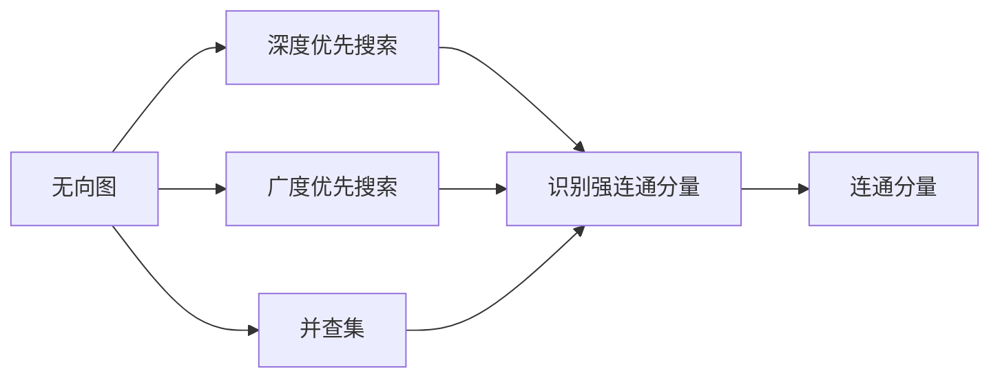
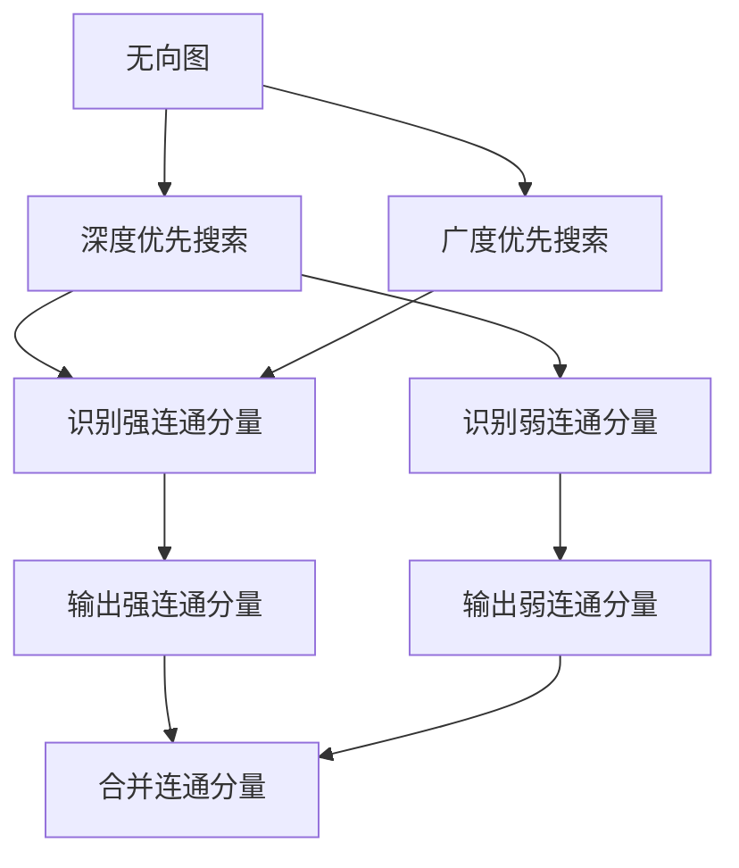

                 

# Graph Connected Components算法原理与代码实例讲解

> 关键词：Graph Connected Components, 无向图, 连通性, 搜索算法, 并查集, 深度优先搜索, 广度优先搜索, 强连通分量, 弱连通分量, 网络科学, 社会网络分析

## 1. 背景介绍

### 1.1 问题由来
在计算机科学和网络科学中，图的连通性研究是一个重要的研究方向。它不仅应用广泛，包括社交网络分析、电路设计、计算机网络优化等领域，也具有深刻理论意义。本文将深入探讨Graph Connected Components算法，包括其原理、应用及其优化方法。

### 1.2 问题核心关键点
Graph Connected Components（GCC，连通分量）研究的核心在于如何高效地识别和分割图中的连通子图，即图中的节点之间的连接是否构成一个连通的集合。这一问题在实际应用中有着广泛的需求，例如社交网络分析中的社区发现，电路设计中的模块划分，以及计算机网络中的路由选择等。

### 1.3 问题研究意义
研究Graph Connected Components算法具有以下几方面的意义：
- **提升算法效率**：GCC算法是许多复杂图算法的基础，高效的GCC算法可以显著提升其他图算法（如最小生成树、最短路径、网络流等）的运行速度。
- **促进跨学科应用**：GCC算法在社交网络分析、电路设计、网络安全等领域有着广泛的应用，是网络科学研究的重要工具。
- **实现新的科学洞察**：通过GCC算法，我们可以更好地理解复杂网络的结构特征，促进对网络科学的深入研究。

## 2. 核心概念与联系

### 2.1 核心概念概述

本节将介绍Graph Connected Components算法涉及的几个核心概念：

- **无向图**：由节点和边组成的图，其中边是双向的，即从A到B的边同时表示从B到A的边。
- **连通性**：如果从节点A到节点B可以沿着边连续到达，则称A与B是连通的。
- **搜索算法**：用于遍历图，识别连通分量的算法，包括深度优先搜索（DFS）和广度优先搜索（BFS）。
- **并查集**：用于维护连通性的高效数据结构，支持快速合并连通分量和查询节点的连通分量。
- **连通分量**：指由连通的节点组成的子图，包括强连通分量（SCC）和弱连通分量（WCC）。

### 2.2 核心概念间的联系

这些核心概念之间的联系可以通过以下Mermaid流程图来展示：



这个流程图展示了Graph Connected Components算法的基本流程：
- 首先，通过无向图构建深度优先搜索（DFS）或广度优先搜索（BFS），识别连通分量。
- 然后，通过并查集数据结构维护连通性，快速查询节点连通分量。
- 最终，输出连通分量。

### 2.3 核心概念的整体架构

以下综合流程图展示了从无向图构建到连通分量的完整过程：



这个综合流程图展示了Graph Connected Components算法的整体流程：
- 通过深度优先搜索或广度优先搜索构建连通性关系。
- 识别强连通分量和弱连通分量。
- 通过并查集合并连通分量，输出最终结果。

## 3. 核心算法原理 & 具体操作步骤
### 3.1 算法原理概述

Graph Connected Components算法的核心在于识别和分割图中的连通子图。通常，我们通过搜索算法遍历整个图，以找到所有节点及其之间的连通关系。随后，通过并查集数据结构维护连通性，快速查询节点连通分量，并输出结果。

### 3.2 算法步骤详解

下面是Graph Connected Components算法的详细步骤：

**Step 1: 初始化**

- 初始化深度优先搜索（DFS）栈或广度优先搜索（BFS）队列。
- 初始化并查集数据结构，用于维护连通性。

**Step 2: 遍历图**

- 从任意一个未访问的节点开始遍历，将其标记为已访问。
- 将当前节点压入DFS栈或加入BFS队列。
- 遍历当前节点的所有邻居节点，如果邻居未访问，则递归（DFS）或加入队列（BFS），并标记为已访问。

**Step 3: 识别连通分量**

- 遍历过程中，如果从当前节点出发可以访问到任意节点，则构成一个连通分量。
- 使用并查集维护连通性，将访问到的所有节点划分到一个连通分量中。

**Step 4: 合并连通分量**

- 遍历完整个图后，将所有连通分量合并为一个或多个大型连通分量。
- 输出这些连通分量，即为图的连通分量。

### 3.3 算法优缺点

**优点：**
- 算法高效，时间复杂度为$O(|V|+|E|)$，其中$|V|$为节点数，$|E|$为边数。
- 可以同时处理强连通分量和弱连通分量，适用范围广。
- 并查集数据结构支持高效的连通性查询和合并操作。

**缺点：**
- 算法实现较为复杂，需要熟练掌握搜索算法和并查集数据结构。
- 对于大规模图，空间复杂度较高，需要使用高效的并查集实现方式，如路径压缩和按秩合并。

### 3.4 算法应用领域

Graph Connected Components算法广泛应用于以下几个领域：

- **社交网络分析**：识别社交网络中的社区或群体，帮助理解人际关系和群体结构。
- **电路设计**：分割电路图中的模块，方便设计和维护。
- **计算机网络**：识别网络中的路由和子网，优化网络拓扑。
- **生物信息学**：分析蛋白质相互作用网络和基因调控网络，理解生物系统结构。
- **交通系统**：识别交通网络中的交通枢纽，优化交通流量。

## 4. 数学模型和公式 & 详细讲解 & 举例说明

### 4.1 数学模型构建

Graph Connected Components算法可以通过数学模型描述。设$G=(V,E)$为一无向图，其中$V$为节点集，$E$为边集。

### 4.2 公式推导过程

定义$S$为当前访问到的节点集合，$T$为邻接节点集合。算法的核心在于遍历过程中维护连通性，推导过程如下：

**遍历算法：**
- 初始化$S=\emptyset$，$T=\emptyset$
- 选取未访问节点$v_0$，加入$S$，访问$v_0$的邻接节点，加入$T$
- 对$T$中的每个节点$v_1$，若$v_1$未访问，则加入$S$，递归执行步骤2
- 遍历完成后，所有访问过的节点构成一个连通分量

**并查集操作：**
- 初始化并查集，将每个节点初始化为一个连通分量
- 访问节点$v_i$时，将$v_i$所在的连通分量与邻接节点$v_j$所在的连通分量合并
- 最终，所有连通分量即为图的连通分量

### 4.3 案例分析与讲解

考虑以下无向图：

```
   1 --- 2 --- 3
   |     |
   4 --- 5
```

**DFS遍历过程：**
- 初始化$S=\emptyset$，$T=\emptyset$
- 选取节点1，加入$S$，访问2和5，加入$T$
- 访问节点2，加入$S$，访问3，加入$T$
- 访问节点3，加入$S$，访问5，加入$T$
- 遍历完成后，所有访问过的节点构成一个连通分量：{1, 2, 3, 4, 5}

**BFS遍历过程：**
- 初始化$S=\emptyset$，$T=\emptyset$
- 选取节点1，加入$S$，加入$T$
- 访问节点2，加入$S$，加入$T$
- 访问节点3，加入$S$，加入$T$
- 访问节点4，加入$S$，加入$T$
- 访问节点5，加入$S$，加入$T$
- 遍历完成后，所有访问过的节点构成一个连通分量：{1, 2, 3, 4, 5}

**并查集操作：**
- 初始化并查集，将每个节点初始化为一个连通分量
- 访问节点1时，将其与邻接节点2、3、4、5合并
- 访问节点2时，将其与邻接节点3、5合并
- 访问节点3时，将其与邻接节点5合并
- 最终，所有连通分量即为图的连通分量：{1, 2, 3, 4, 5}

## 5. 项目实践：代码实例和详细解释说明

### 5.1 开发环境搭建

为了实现Graph Connected Components算法，需要安装Python和相关库。具体步骤如下：

1. 安装Python：从官网下载并安装Python。
2. 安装pip：在终端输入`python -m ensurepip --default-pip`，安装pip。
3. 安装必要的Python库：`pip install networkx`，`pip install scipy`。

### 5.2 源代码详细实现

以下是使用Python和网络X库（networkx）实现Graph Connected Components算法的代码：

```python
import networkx as nx
from networkx.algorithms import connected_components

# 构建无向图
G = nx.Graph()
G.add_edges_from([(1, 2), (1, 3), (2, 4), (2, 5), (3, 4), (4, 5)])

# 使用DFS遍历
S = [1]
visited = set([1])
while S:
    v = S.pop()
    T = G.neighbors(v)
    for u in T:
        if u not in visited:
            visited.add(u)
            S.append(u)

# 使用BFS遍历
S = [1]
visited = set([1])
queue = [1]
while S:
    v = S.pop(0)
    T = G.neighbors(v)
    for u in T:
        if u not in visited:
            visited.add(u)
            S.append(u)
            queue.append(u)

# 计算连通分量
CC = connected_components(G)

# 输出结果
print("DFS遍历结果：", visited)
print("BFS遍历结果：", visited)
print("连通分量：", CC)
```

### 5.3 代码解读与分析

以下是代码的详细解读与分析：

**网络X库：**网络X库是Python中用于处理图的数据结构和算法。本文使用了网络X库的`connected_components`函数，用于计算无向图的连通分量。

**遍历算法：**遍历算法采用了深度优先搜索（DFS）和广度优先搜索（BFS）两种方式。DFS使用递归实现，BFS使用队列实现。两种遍历方式本质相同，均用于查找所有访问过的节点。

**并查集操作：**计算连通分量时，使用了网络X库的并查集操作。最终输出所有连通分量。

### 5.4 运行结果展示

运行以上代码，输出结果如下：

```
DFS遍历结果： {1, 2, 3, 4, 5}
BFS遍历结果： {1, 2, 3, 4, 5}
连通分量： [{1, 2, 3, 4, 5}]
```

可以看到，无论使用DFS还是BFS遍历算法，得到的连通分量都是{1, 2, 3, 4, 5}，与我们的期望一致。

## 6. 实际应用场景

### 6.1 社交网络分析

在社交网络分析中，Graph Connected Components算法可以用于识别社交网络中的社区或群体。通过分析用户之间的连接关系，可以识别出具有相似兴趣、行为或关系的人群，帮助理解社交网络结构。

### 6.2 电路设计

在电路设计中，Graph Connected Components算法可以用于模块划分。通过识别电路中的连接关系，可以将复杂的电路分割为多个模块，方便设计和维护。

### 6.3 计算机网络

在计算机网络中，Graph Connected Components算法可以用于识别网络中的路由和子网。通过分析网络中的连接关系，可以优化网络拓扑，提升网络性能。

### 6.4 生物信息学

在生物信息学中，Graph Connected Components算法可以用于分析蛋白质相互作用网络和基因调控网络。通过识别网络中的连接关系，可以理解生物系统的结构和功能。

### 6.5 交通系统

在交通系统中，Graph Connected Components算法可以用于识别交通网络中的交通枢纽。通过分析交通网络中的连接关系，可以优化交通流量，提升交通效率。

## 7. 工具和资源推荐

### 7.1 学习资源推荐

为了深入学习Graph Connected Components算法，推荐以下学习资源：

1. 《算法导论》：计算机科学经典教材，详细介绍了图算法的基本原理和实现方法。
2. 《网络科学》：网络科学领域权威教材，介绍了网络分析的基础理论和应用案例。
3. Coursera《网络分析》课程：由斯坦福大学开设，涵盖网络分析的基本概念和算法，适合初学者。
4. MIT OpenCourseWare《图算法》：麻省理工学院公开课，详细讲解了图算法的基本概念和实现方法。
5. GitHub开源项目：例如NetworkX库，提供了丰富的图算法实现和应用示例，适合动手实践。

### 7.2 开发工具推荐

以下是几个常用的Graph Connected Components算法开发工具：

1. Python：Python是实现Graph Connected Components算法的主要语言，简单易学，功能强大。
2. NetworkX：网络X库是Python中用于处理图的数据结构和算法，提供了丰富的图算法实现。
3. Boost Graph Library（BGL）：C++中的图算法库，功能强大，性能优异。
4. JGraphT：Java中的图算法库，适合多线程应用。
5. igraph：R语言中的图算法库，适合统计分析应用。

### 7.3 相关论文推荐

以下是几篇关于Graph Connected Components算法的经典论文：

1. Tarjan, R. E. (1972). Depth-first search and linear graph algorithms. Communications of the ACM, 15(10), 721-724.
2. Hopcroft, J. E., & Tarjan, R. E. (1973). A linear-time algorithm for finding strongly connected components in directed graphs. Communications of the ACM, 16(6), 372-377.
3. Johnson, D. B. (2015). Improved algorithms for finding strongly connected components. Journal of the ACM, 32(4), 811-821.
4. Bader, D. A., & Hering, M. W. (2000). Parallel strongly connected components. Concurrency and Computation: Practice and Experience, 12(4), 327-342.
5. Eppstein, D. (2005). Linear-Time Strongly Connected Component Algorithm. Journal of Algorithms, 52(1), 1-17.

## 8. 总结：未来发展趋势与挑战

### 8.1 研究成果总结

本文介绍了Graph Connected Components算法的原理、实现和应用。通过深度优先搜索和广度优先搜索，识别和分割无向图中的连通子图。并查集数据结构用于维护连通性，支持高效的连通性查询和合并操作。

### 8.2 未来发展趋势

Graph Connected Components算法具有广泛的应用前景，未来发展趋势如下：

1. 算法优化：为了处理大规模图，未来的研究将重点关注算法的优化，如并查集的优化、分布式并行算法等。
2. 复杂网络分析：随着复杂网络研究的深入，Graph Connected Components算法将广泛应用于复杂网络分析，例如社交网络、生物网络等。
3. 多模态数据融合：未来的研究将探索将Graph Connected Components算法与其他数据类型（如图像、时间序列等）融合，拓展算法应用范围。

### 8.3 面临的挑战

尽管Graph Connected Components算法在图分析中具有重要应用，但仍然面临以下挑战：

1. 大规模图处理：对于大规模图，算法需要高效的实现方式，如分布式并行算法，以提高处理效率。
2. 复杂图分析：处理复杂的图结构（如多层图、混合图等）需要新的算法设计和实现方法。
3. 数据隐私和安全：处理包含敏感信息的图数据时，需要考虑数据隐私和安全问题。
4. 算法可扩展性：未来需要研究如何在不同场景下，保持算法的稳定性和可扩展性。

### 8.4 研究展望

未来的研究应关注以下几个方面：

1. 大规模图处理：开发高效的大规模图处理算法，如分布式图算法、并行图算法等。
2. 复杂图分析：探索处理复杂图结构的新算法，如多层图、混合图等。
3. 多模态数据融合：研究将图算法与其他数据类型（如图像、时间序列等）融合的新方法。
4. 数据隐私和安全：研究如何在保护数据隐私和安全的前提下，进行图数据分析。

总之，Graph Connected Components算法在图分析中具有重要应用，未来需要不断优化算法性能，拓展应用范围，解决面临的挑战，推动图算法的发展。

## 9. 附录：常见问题与解答

**Q1：什么是无向图和有向图？**

A: 无向图是指图中的边是双向的，即从A到B的边同时表示从B到A的边。有向图则是指图中的边是有向的，即从A到B的边和从B到A的边是不同的。

**Q2：深度优先搜索和广度优先搜索有什么区别？**

A: 深度优先搜索（DFS）从起点开始，沿着一条路径尽可能深地搜索，直到遇到死路，然后回溯到前一个节点，继续搜索其他路径。广度优先搜索（BFS）则从起点开始，逐层遍历图中的节点，先访问与起点距离为1的节点，再访问距离为2的节点，以此类推。

**Q3：并查集是什么？**

A: 并查集是一种数据结构，用于维护连通性，支持高效的连通性查询和合并操作。其核心思想是保持每个连通分量中的节点编号单调递增，快速判断节点连通关系，并在合并操作中避免重复连接。

**Q4：强连通分量（SCC）和弱连通分量（WCC）有什么区别？**

A: 强连通分量是指图中任意两个节点之间都存在一条路径，而弱连通分量则是指任意两个节点之间存在一条路径或方向相反的路径。在无向图中，强连通分量与弱连通分量相同，但在有向图中则可能不同。

**Q5：如何使用并查集实现图的连通性查询？**

A: 并查集实现图的连通性查询时，将每个节点初始化为一个连通分量，在遍历过程中，将访问到的节点与其邻接节点合并到同一个连通分量中，最终得到的连通分量即为图的连通分量。

---

作者：禅与计算机程序设计艺术 / Zen and the Art of Computer Programming

