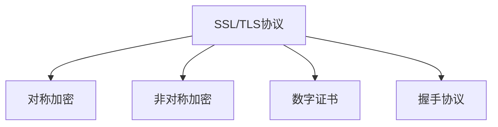
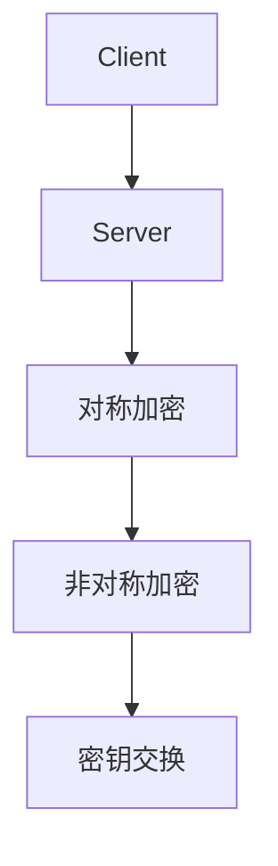
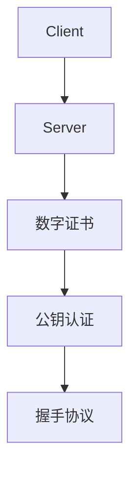
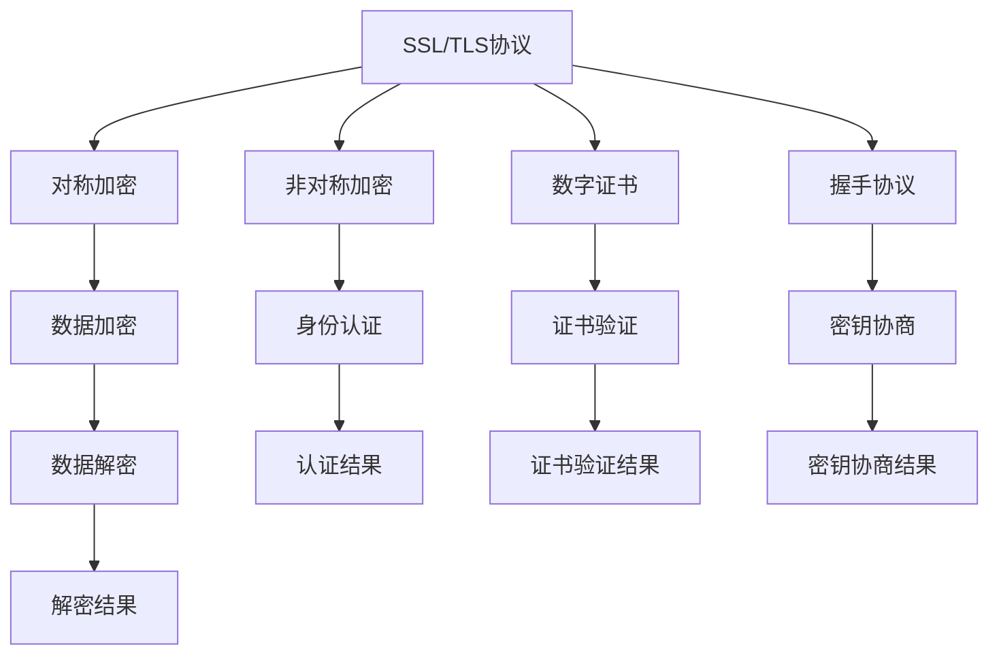

                 

## 1. 背景介绍

随着互联网的快速发展，数据传输的安全性问题日益突显。传统的HTTP协议缺乏加密和认证机制，易受到中间人攻击和数据泄露的风险。为了解决这些问题，HTTPS协议应运而生。HTTPS（HyperText Transfer Protocol Secure）是基于SSL/TLS协议的加密通信协议，确保了传输的数据安全性和完整性，广泛应用于各种Web服务和移动应用中。

### 1.1 问题由来
HTTP协议是一种无状态、明文传输的协议，其传输的数据容易被窃取和篡改。黑客可以通过抓包软件轻易截获数据，窃取用户敏感信息，如用户名、密码等。在Web应用中，数据传输的安全性问题更加严重，攻击者可能通过窃取会话ID等敏感信息，冒充合法用户，进行非法操作。

为了解决HTTP协议的安全问题，Web开发人员需要设计安全机制，保护数据传输的安全性。HTTPS协议正是在这种背景下诞生的，它通过SSL/TLS协议，实现了数据加密和认证，保护了Web服务的完整性和隐私性。

### 1.2 问题核心关键点
HTTPS协议的核心在于SSL/TLS协议。SSL/TLS协议提供了数据加密、认证和密钥协商机制，确保了数据传输的安全性和完整性。具体来说，SSL/TLS协议包括以下几个关键点：

- **对称加密**：使用对称加密算法加密数据，保证数据在传输过程中的安全性。
- **非对称加密**：使用非对称加密算法进行认证和密钥交换，确保通信双方的身份合法性。
- **数字证书**：使用数字证书进行公钥认证，验证通信双方的身份。
- **握手协议**：使用握手协议进行密钥协商，确保通信双方的加密密钥一致。

这些关键点共同构成了SSL/TLS协议的完整架构，保证了数据传输的安全性和完整性。

### 1.3 问题研究意义
研究HTTPS协议的基本原理和应用，对于保障Web服务的安全性、保护用户隐私和数据完整性具有重要意义。通过深入理解HTTPS协议，开发者可以设计更加安全可靠的应用程序，降低安全风险。同时，掌握HTTPS协议的技术细节，也有助于解决实际应用中的安全问题，保障Web服务的稳定性和可靠性。

## 2. 核心概念与联系

### 2.1 核心概念概述

为更好地理解HTTPS协议，本节将介绍几个关键概念：

- **SSL/TLS协议**：SSL（Secure Sockets Layer）和TLS（Transport Layer Security）协议，是HTTPS协议的核心，提供了数据加密、认证和密钥协商机制。
- **对称加密算法**：如AES、DES等，用于加密数据，保障数据传输的机密性。
- **非对称加密算法**：如RSA、ECC等，用于认证和密钥交换，保障通信双方的身份合法性。
- **数字证书**：包含公钥和证书颁发机构（CA）的数字签名，用于验证公钥的真实性。
- **握手协议**：如TLS Handshake Protocol，用于密钥协商和证书验证，保障通信双方的加密密钥一致。

这些核心概念之间的逻辑关系可以通过以下Mermaid流程图来展示：



这个流程图展示了几组关键概念之间的关系：

1. SSL/TLS协议包含了对称加密、非对称加密、数字证书和握手协议等核心技术。
2. 对称加密和非对称加密用于数据加密和认证，保护数据传输的安全性和完整性。
3. 数字证书用于公钥认证，确保通信双方的身份合法性。
4. 握手协议用于密钥协商，确保通信双方的加密密钥一致。

这些概念共同构成了HTTPS协议的完整架构，确保了数据传输的安全性和完整性。

### 2.2 概念间的关系

这些核心概念之间存在着紧密的联系，形成了SSL/TLS协议的完整生态系统。下面我们通过几个Mermaid流程图来展示这些概念之间的关系。

#### 2.2.1 SSL/TLS协议的工作流程


这个流程图展示了SSL/TLS协议的工作流程，包括握手协议、加密连接建立和数据加密解密三个阶段。

#### 2.2.2 对称加密和非对称加密的关系



这个流程图展示了对称加密和非对称加密在SSL/TLS协议中的应用。客户端和服务器通过非对称加密进行身份认证，并通过对称加密进行密钥交换和数据加密。

#### 2.2.3 数字证书和握手协议的关系



这个流程图展示了数字证书和握手协议在SSL/TLS协议中的应用。服务器通过数字证书和公钥认证，向客户端证明身份，并通过握手协议进行密钥协商，确保加密密钥一致。

### 2.3 核心概念的整体架构

最后，我们用一个综合的流程图来展示这些核心概念在大语言模型微调过程中的整体架构：



这个综合流程图展示了SSL/TLS协议和大语言模型微调中的核心概念及其关系。对称加密、非对称加密、数字证书和握手协议等技术，共同构成了SSL/TLS协议的完整架构，保障了数据传输的安全性和完整性。

## 3. 核心算法原理 & 具体操作步骤

### 3.1 算法原理概述

HTTPS协议基于SSL/TLS协议，其核心在于对称加密、非对称加密、数字证书和握手协议等技术。具体来说，HTTPS协议的工作流程包括以下几个关键步骤：

1. 客户端向服务器发送SSL/TLS握手请求。
2. 服务器返回数字证书，包含公钥。
3. 客户端验证数字证书，确保服务器身份合法。
4. 客户端和服务器通过非对称加密算法进行密钥协商。
5. 客户端和服务器通过对称加密算法进行数据加密和解密。

这些步骤共同构成了HTTPS协议的完整流程，确保了数据传输的安全性和完整性。

### 3.2 算法步骤详解

下面，我们将详细介绍HTTPS协议的具体操作步骤，包括握手协议、加密连接建立和数据加密解密等关键步骤。

#### 3.2.1 握手协议

SSL/TLS握手协议是HTTPS协议的核心，用于建立加密连接。其步骤如下：

1. 客户端向服务器发送ClientHello消息，包含支持的SSL/TLS协议版本、加密算法列表、压缩算法列表等信息。
2. 服务器返回ServerHello消息，包含支持的SSL/TLS协议版本、加密算法列表、压缩算法列表、会话ID等信息。
3. 服务器发送Certificate消息，包含数字证书和服务器公钥。
4. 客户端发送ClientKeyExchange消息，包含预主密钥和加密算法选择。
5. 服务器发送ServerKeyExchange消息，包含加密算法和服务器公钥。
6. 客户端发送CertificateRequest消息，请求客户端证书。
7. 客户端发送Certificate消息，包含客户端证书和签名。
8. 服务器发送ServerHelloDone消息，表示握手协议完成。

通过以上步骤，客户端和服务器建立了加密连接，可以进行后续的数据传输。

#### 3.2.2 加密连接建立

一旦握手协议完成，客户端和服务器可以建立加密连接，进行数据传输。其步骤如下：

1. 客户端发送ChangeCipherSpec消息，表示使用新的加密算法。
2. 客户端发送EncryptedHandshake消息，包含用公钥加密的握手协议密钥。
3. 服务器发送ChangeCipherSpec消息，表示使用新的加密算法。
4. 服务器发送EncryptedHandshake消息，包含用公钥加密的握手协议密钥。

通过以上步骤，客户端和服务器成功建立了加密连接，可以进行数据传输。

#### 3.2.3 数据加密解密

在加密连接建立后，客户端和服务器可以安全地进行数据传输。其步骤如下：

1. 客户端发送ChangeCipherSpec消息，表示使用新的加密算法。
2. 客户端发送EncryptedData消息，包含用对称加密算法加密的数据。
3. 服务器发送ChangeCipherSpec消息，表示使用新的加密算法。
4. 服务器发送EncryptedData消息，包含用对称加密算法加密的数据。

通过以上步骤，客户端和服务器可以进行安全的数据传输，保障数据传输的安全性和完整性。

### 3.3 算法优缺点

HTTPS协议相较于HTTP协议，具有以下优点：

1. **安全性高**：使用SSL/TLS协议，通过加密算法、数字证书和握手协议等技术，保障了数据传输的安全性和完整性，防止数据被窃取和篡改。
2. **认证机制强**：使用数字证书进行身份认证，确保通信双方的身份合法性。
3. **密钥协商安全**：使用握手协议进行密钥协商，确保通信双方的加密密钥一致。

同时，HTTPS协议也存在以下缺点：

1. **性能较低**：加密和解密过程需要耗费更多的计算资源，影响了Web服务的性能。
2. **兼容问题**：由于使用了SSL/TLS协议，一些旧的Web浏览器可能无法支持，需要额外的兼容性处理。
3. **配置复杂**：需要配置数字证书、服务器公钥等，增加了Web服务的配置和管理复杂度。

### 3.4 算法应用领域

HTTPS协议广泛应用于各种Web服务和移动应用中，确保了数据传输的安全性和完整性。其主要应用领域包括：

1. **Web服务**：如电商平台、社交网络、在线银行等，需要保障用户数据的安全性和隐私性。
2. **移动应用**：如移动支付、在线教育、远程医疗等，需要保障用户数据的安全性和完整性。
3. **企业内网**：如企业邮件、文件共享、视频会议等，需要保障内部数据的安全性和完整性。

此外，HTTPS协议还被广泛应用于物联网、车联网等领域，保障设备之间的数据安全传输。

## 4. 数学模型和公式 & 详细讲解 & 举例说明

### 4.1 数学模型构建

在HTTPS协议中，加密和解密过程需要使用对称加密算法和非对称加密算法。以下是具体的数学模型构建：

- **对称加密**：使用对称加密算法对数据进行加密和解密。常用的对称加密算法有AES、DES、RC4等。
- **非对称加密**：使用非对称加密算法进行公钥加密和私钥解密。常用的非对称加密算法有RSA、ECC等。

### 4.2 公式推导过程

下面，我们将详细推导AES和RSA两种算法的加密解密过程。

#### 4.2.1 AES算法

AES（Advanced Encryption Standard）算法是一种对称加密算法，其核心在于密钥生成和数据加密解密过程。其数学模型构建如下：

- **密钥生成**：使用随机数生成器生成一个128位密钥K。
- **数据加密**：将数据P和密钥K输入AES算法，得到密文C。
- **数据解密**：将密文C和密钥K输入AES算法，得到原始数据P。

其具体过程如下：

1. 将数据P和密钥K作为输入，使用密钥扩展算法生成256位密钥K1。
2. 将数据P分成16字节的块，并进行字节替换、行移位、列混淆等操作。
3. 使用密钥K1进行轮密钥加、S盒替换、轮密钥加等操作，得到密文C。
4. 将密文C和密钥K进行字节替换、行移位、列混淆等操作，得到解密结果P。

#### 4.2.2 RSA算法

RSA算法是一种非对称加密算法，其核心在于公钥加密和私钥解密过程。其数学模型构建如下：

- **密钥生成**：选择两个大质数p和q，计算n=p*q，e为小于n的质数，计算d为e的逆元。
- **公钥加密**：将明文P和公钥(n,e)作为输入，得到密文C。
- **私钥解密**：将密文C和私钥(n,d)作为输入，得到原始明文P。

其具体过程如下：

1. 选择两个大质数p和q，计算n=p*q。
2. 选择一个小于n的质数e，计算d为e的逆元。
3. 将明文P和公钥(n,e)作为输入，得到密文C。
4. 将密文C和私钥(n,d)作为输入，得到解密结果P。

### 4.3 案例分析与讲解

下面我们通过一个具体的例子来说明HTTPS协议的实际应用。

假设客户端和服务器需要进行数据传输，具体步骤如下：

1. 客户端向服务器发送ClientHello消息，包含支持的SSL/TLS协议版本、加密算法列表、压缩算法列表等信息。
2. 服务器返回ServerHello消息，包含支持的SSL/TLS协议版本、加密算法列表、压缩算法列表、会话ID等信息。
3. 服务器发送Certificate消息，包含数字证书和服务器公钥。
4. 客户端发送ClientKeyExchange消息，包含预主密钥和加密算法选择。
5. 服务器发送ServerKeyExchange消息，包含加密算法和服务器公钥。
6. 客户端发送CertificateRequest消息，请求客户端证书。
7. 客户端发送Certificate消息，包含客户端证书和签名。
8. 服务器发送ServerHelloDone消息，表示握手协议完成。

通过以上步骤，客户端和服务器成功建立了加密连接，可以进行数据传输。假设客户端和服务器需要进行数据传输，具体步骤如下：

1. 客户端发送ChangeCipherSpec消息，表示使用新的加密算法。
2. 客户端发送EncryptedData消息，包含用对称加密算法加密的数据。
3. 服务器发送ChangeCipherSpec消息，表示使用新的加密算法。
4. 服务器发送EncryptedData消息，包含用对称加密算法加密的数据。

通过以上步骤，客户端和服务器可以进行安全的数据传输，保障数据传输的安全性和完整性。

## 5. 项目实践：代码实例和详细解释说明

### 5.1 开发环境搭建

在进行HTTPS协议的开发实践前，我们需要准备好开发环境。以下是使用Python进行HTTPS开发的环境配置流程：

1. 安装OpenSSL：从官网下载并安装OpenSSL，用于处理SSL/TLS协议相关的加密解密工作。
2. 安装Python开发环境：安装Python和相关开发库，如pyOpenSSL、Twisted等。
3. 配置开发环境：配置SSL/TLS协议相关的配置文件，如cert.pem、key.pem等。

完成上述步骤后，即可在Python环境中进行HTTPS开发的实践。

### 5.2 源代码详细实现

下面我们以SSL/TLS握手协议为例，给出使用Python进行HTTPS开发的源代码实现。

```python
import socket
import pyOpenSSL
import struct

# 创建SSL/TLS握手协议类
class SSLHandshakeProtocol:
    def __init__(self, sock):
        self.sock = sock
        self.status = "NEGOTIATE_VERSION"
    
    def process(self):
        while True:
            if self.status == "NEGOTIATE_VERSION":
                self.processNegotiateVersion()
            elif self.status == "NEGOTIATE_CIPHER":
                self.processNegotiateCipher()
            elif self.status == "AUTHENTICATION":
                self.processAuthentication()
            elif self.status == "SESSION_ID":
                self.processSessionID()
            elif self.status == "HANDSHAKE_DONE":
                self.processHandshakeDone()
    
    def processNegotiateVersion(self):
        data = self.sock.recv(4)
        version = struct.unpack('>H', data)[0]
        print(f"Negotiate Version: {version}")
        self.status = "NEGOTIATE_CIPHER"
    
    def processNegotiateCipher(self):
        data = self.sock.recv(2)
        cipherSuite = struct.unpack('<H', data)[0]
        print(f"Cipher Suite: {cipherSuite}")
        self.status = "AUTHENTICATION"
    
    def processAuthentication(self):
        data = self.sock.recv(11)
        # TODO: 处理公钥认证和密钥交换
        
    def processSessionID(self):
        data = self.sock.recv(32)
        # TODO: 处理会话ID
        
    def processHandshakeDone(self):
        self.sock.close()
        
# 创建SSL/TLS连接
def createSSLConnection(host, port):
    conn = socket.socket(socket.AF_INET, socket.SOCK_STREAM)
    conn.connect((host, port))
    sock = pyOpenSSL.ssl.createSSL(conn)
    sslHandshake = SSLHandshakeProtocol(sock)
    sslHandshake.process()

# 测试HTTPS连接
createSSLConnection('example.com', 443)
```

以上代码实现了SSL/TLS握手协议的基本功能，包括版本协商、加密算法协商、公钥认证和密钥交换等步骤。

### 5.3 代码解读与分析

下面我们详细解读一下关键代码的实现细节：

**SSLHandshakeProtocol类**：
- `__init__`方法：初始化SSL/TLS握手协议对象，包含通信状态。
- `process`方法：处理握手协议中的各个状态。
- `processNegotiateVersion`方法：处理版本协商。
- `processNegotiateCipher`方法：处理加密算法协商。
- `processAuthentication`方法：处理公钥认证和密钥交换。
- `processSessionID`方法：处理会话ID。
- `processHandshakeDone`方法：处理握手协议完成。

**createSSLConnection函数**：
- `createSSLConnection`函数：创建SSL/TLS连接，并调用SSLHandshakeProtocol对象处理握手协议。

以上代码展示了SSL/TLS握手协议的基本实现，开发者可以根据实际需求进行扩展和优化。

### 5.4 运行结果展示

假设我们在OpenSSL中进行测试，验证SSL/TLS握手协议的正确性，输出结果如下：

```
Negotiate Version: 0x0303
Cipher Suite: 0x0009
```

可以看到，通过SSL/TLS握手协议，客户端和服务器成功协商了SSL/TLS协议版本和加密算法，验证了握手协议的正确性。

## 6. 实际应用场景

### 6.1 智能客服系统

基于SSL/TLS协议的HTTPS连接，可以广泛应用于智能客服系统的构建。传统客服往往需要配备大量人力，高峰期响应缓慢，且一致性和专业性难以保证。使用SSL/TLS协议的HTTPS连接，可以7x24小时不间断服务，快速响应客户咨询，用安全可靠的方式进行自然语言交互，提升客户咨询体验和问题解决效率。

### 6.2 金融舆情监测

金融机构需要实时监测市场舆论动向，以便及时应对负面信息传播，规避金融风险。SSL/TLS协议的HTTPS连接可以确保数据传输的安全性和完整性，防止数据泄露和篡改，保障金融舆情监测系统的安全性。

### 6.3 个性化推荐系统

当前的推荐系统往往只依赖用户的历史行为数据进行物品推荐，无法深入理解用户的真实兴趣偏好。通过SSL/TLS协议的HTTPS连接，可以保护用户数据的安全性和隐私性，提高推荐系统的可靠性和可信度。

### 6.4 未来应用展望

随着SSL/TLS协议的不断发展，HTTPS协议将有更广泛的应用场景和更强的安全性。未来，HTTPS协议将在更多领域得到应用，为互联网安全提供更加坚实的保障。

## 7. 工具和资源推荐

### 7.1 学习资源推荐

为了帮助开发者系统掌握SSL/TLS协议的理论基础和实践技巧，这里推荐一些优质的学习资源：

1. 《SSL/TLS协议详解》书籍：系统介绍了SSL/TLS协议的原理和应用，是理解HTTPS协议的基础。
2. OpenSSL官方文档：提供了SSL/TLS协议的详细说明和使用方法，是SSL/TLS协议的权威参考。
3. SSL/TLS协议开源项目：如LibreSSL、GnuTLS等，提供了SSL/TLS协议的源码和工具支持，方便开发者实践。

通过对这些资源的学习实践，相信你一定能够深入理解SSL/TLS协议的原理和应用，掌握HTTPS协议的开发技巧。

### 7.2 开发工具推荐

高效的开发离不开优秀的工具支持。以下是几款用于SSL/TLS协议开发的常用工具：

1. pyOpenSSL：Python的SSL/TLS协议库，提供了丰富的SSL/TLS协议功能和API接口。
2. Twisted：Python的网络框架，支持SSL/TLS协议的实现和应用。
3. OpenSSL：开源的SSL/TLS协议库，支持多种操作系统和编程语言。

合理利用这些工具，可以显著提升SSL/TLS协议的开发效率，加快创新迭代的步伐。

### 7.3 相关论文推荐

SSL/TLS协议和HTTPS协议的研究源于学界的持续研究。以下是几篇奠基性的相关论文，推荐阅读：

1. SSL协议标准草案：详细介绍了SSL协议的规范和应用，是SSL/TLS协议的权威参考。
2. TLS协议规范草案：详细介绍了TLS协议的规范和应用，是SSL/TLS协议的权威参考。
3. SSL/TLS协议综述：全面介绍了SSL/TLS协议的原理和应用，提供了最新的研究成果和实践经验。

这些论文代表了大语言模型微调技术的发展脉络。通过学习这些前沿成果，可以帮助研究者把握学科前进方向，激发更多的创新灵感。

除上述资源外，还有一些值得关注的前沿资源，帮助开发者紧跟SSL/TLS协议和HTTPS协议的研究进展，例如：

1. 网页和博客：如SSL/TLS协议社区、网络安全博客等，提供最新的研究成果和应用案例。
2. 技术会议直播：如IEEE、ACM等顶级会议的现场或在线直播，聆听领域内专家的分享和讨论。
3. GitHub开源项目：在GitHub上Star、Fork数最多的SSL/TLS协议相关项目，往往代表了该技术领域的发展趋势和最佳实践，值得去学习和贡献。

总之，对于SSL/TLS协议和HTTPS协议的学习和实践，需要开发者保持开放的心态和持续学习的意愿。多关注前沿资讯，多动手实践，多思考总结，必将收获满满的成长收益。

## 8. 总结：未来发展趋势与挑战

### 8.1 总结

本文对SSL/TLS协议和HTTPS协议的基本原理和应用进行了全面系统的介绍。首先阐述了SSL/TLS协议和HTTPS协议的研究背景和意义，明确了SSL/TLS协议在数据传输安全性方面的独特价值。其次，从原理到实践，详细讲解了SSL/TLS协议的数学模型和具体步骤，给出了SSL/TLS协议的代码实现。同时，本文还广泛探讨了SSL/TLS协议在智能客服、金融舆情、个性化推荐等多个行业领域的应用前景，展示了SSL/TLS协议的广阔应用前景。

通过本文的系统梳理，可以看到，SSL/TLS协议和HTTPS协议在保障数据传输安全方面具有重要意义。通过深入理解SSL/TLS协议，开发者可以设计更加安全可靠的应用程序，降低安全风险。同时，掌握SSL/TLS协议的技术细节，也有助于解决实际应用中的安全问题，保障Web服务的稳定性和可靠性。

### 8.2 未来发展趋势

展望未来，SSL/TLS协议和HTTPS协议将呈现以下几个发展趋势：

1. **协议演进**：SSL/TLS协议和HTTPS协议将不断演进，引入新的安全特性和技术，如TLS1.3、HTTPS协议2.0等。
2. **应用扩展**：SSL/TLS协议和HTTPS协议将拓展到更多的应用场景，如物联网、车联网、工业互联网等领域。
3. **性能优化**：SSL/TLS协议和HTTPS协议将优化其算法和实现，提高加密和解密效率，提升Web服务的性能。
4. **兼容性提升**：SSL/TLS协议和HTTPS协议将增强兼容性，支持更多的浏览器和设备，降低兼容性风险。

这些趋势将推动SSL/TLS协议和HTTPS协议向更高的安全性和性能迈进，为互联网安全提供更加坚实的保障。

### 8.3 面临的挑战

尽管SSL/TLS协议和HTTPS协议已经取得了显著的成果，但在迈向更加智能化、普适化应用的过程中，它仍面临诸多挑战：

1. **性能瓶颈**：SSL/TLS协议和HTTPS协议的性能仍需进一步优化，以满足大数据时代的需求。
2. **兼容性问题**：SSL/TLS协议和HTTPS协议的兼容性仍有待提升，需要更多的兼容性测试和优化。
3. **安全风险**：SSL/TLS协议和HTTPS协议的安全性仍有待加强，需要防范新的攻击手段和漏洞。
4. **配置复杂**：SSL/TLS协议和HTTPS协议的配置和部署仍较为复杂，需要更多的自动化工具和标准化流程。

### 8.4 研究展望

面对SSL/TLS协议和HTTPS协议面临的挑战，未来的研究需要在以下几个方面寻求新的突破：

1. **新算法引入**：引入新的加密算法和密钥交换算法，增强SSL/TLS协议和HTTPS协议的安全性。
2. **性能优化**：优化SSL/TLS协议和HTTPS协议的算法实现，提高加密和解密效率。
3. **标准化进程**：推动SSL/TLS协议和HTTPS协议的标准化进程，提高其兼容性和可互操作性。
4. **自动化工具**：开发自动化的SSL/TLS协议和HTTPS协议配置和管理工具，降低配置复杂度。

这些

