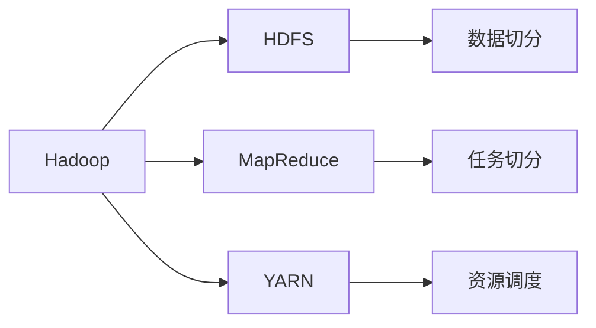
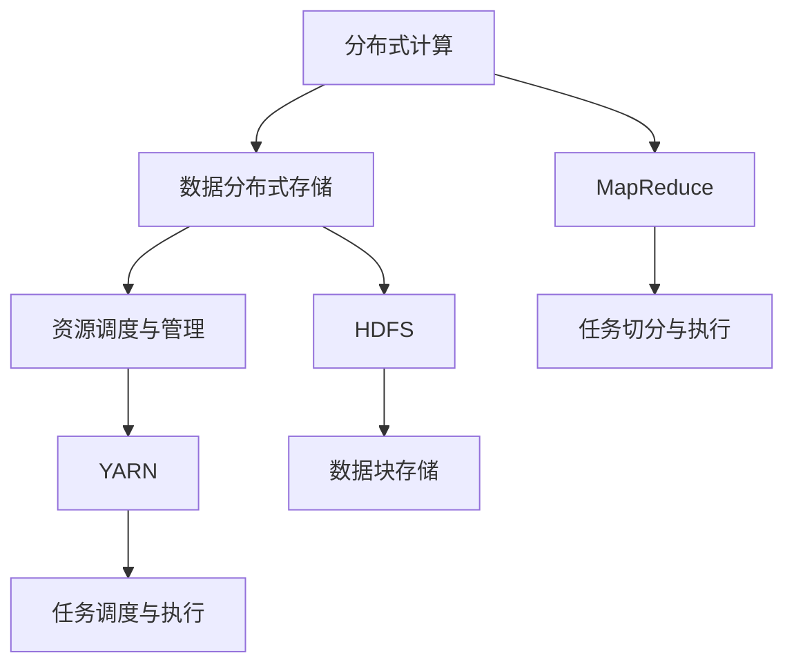
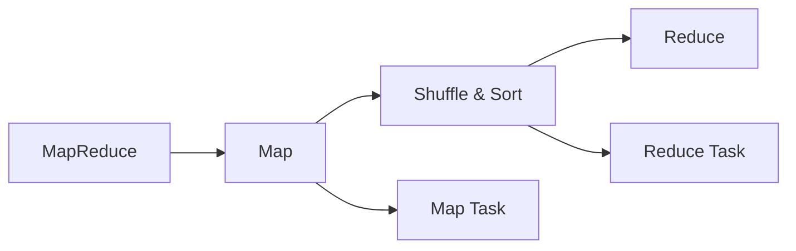
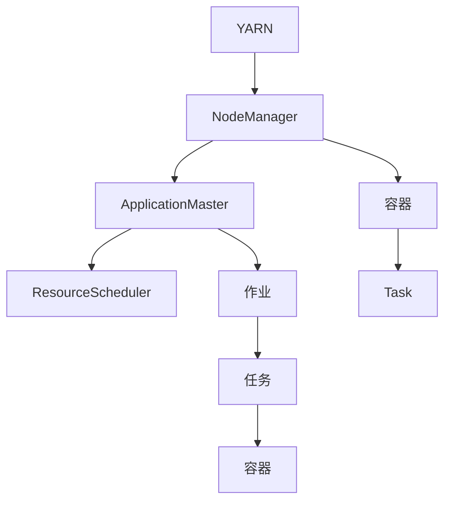
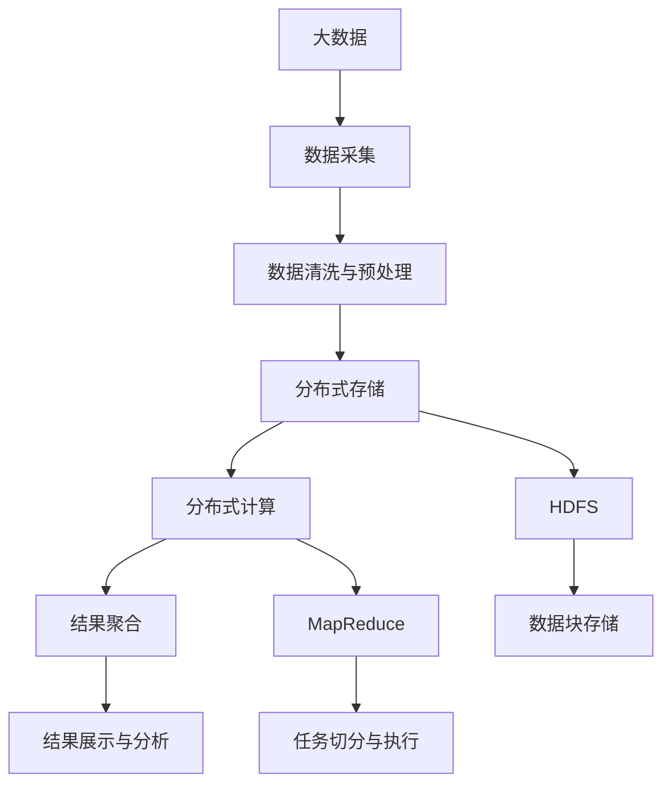

                 

# Hadoop原理与代码实例讲解

> 关键词：Hadoop, MapReduce, HDFS, 数据分布式处理, 大数据技术, 分布式存储系统

## 1. 背景介绍

### 1.1 问题由来
随着互联网和数字化技术的迅猛发展，大数据时代已经到来。面对数据量的爆炸性增长，传统的单节点处理方式已经无法满足需求。为了高效地处理和存储海量数据，分布式计算框架Hadoop应运而生。Hadoop框架由Apache基金会维护，主要由两部分组成：分布式存储系统HDFS和分布式计算框架MapReduce。

Hadoop在大数据处理领域的应用广泛，包括数据清洗、数据挖掘、数据可视化、机器学习等多个方面。其成功应用案例包括谷歌、亚马逊、Facebook等知名互联网企业。

### 1.2 问题核心关键点
Hadoop的核心思想是“分布式计算和存储”，通过将数据分散存储在多个节点上，同时在多台计算机上并行处理数据，极大地提升了数据处理效率。

Hadoop的核心技术包括：
- HDFS：分布式文件系统，用于将大文件切分为多个数据块，并存储在多个节点上。
- MapReduce：分布式计算模型，用于将大规模数据集分解为多个小任务，并行计算。
- YARN：资源管理器，用于调度和管理集群中的计算资源和存储资源。

这些技术共同构成了Hadoop大数据处理的框架，使大规模数据处理变得高效、可靠和易于扩展。

### 1.3 问题研究意义
Hadoop的分布式计算和存储技术，使得海量数据的处理变得高效和可扩展。其广泛应用于各种大数据场景，包括数据仓库、实时流处理、大规模数据挖掘等。Hadoop的成功实践，也极大地推动了大数据技术的普及和应用，促进了各行业的数字化转型升级。

通过学习Hadoop原理与代码实例，掌握其核心技术和应用方法，可以帮助开发者和研究者快速上手大数据处理，提升数据处理能力，促进大数据技术的深入研究与应用。

## 2. 核心概念与联系

### 2.1 核心概念概述

为了更好地理解Hadoop的原理与代码实例，本节将介绍几个密切相关的核心概念：

- Hadoop：由Apache基金会维护的大数据处理框架，包括HDFS和MapReduce两个核心组件。
- HDFS：分布式文件系统，用于存储海量数据，通过将大文件切分为多个数据块并存储在多个节点上，实现数据的分布式存储。
- MapReduce：分布式计算模型，用于将大规模数据集分解为多个小任务，并行计算。
- YARN：资源管理器，用于调度和管理集群中的计算资源和存储资源。

这些核心概念之间的逻辑关系可以通过以下Mermaid流程图来展示：



这个流程图展示了大数据处理框架Hadoop的核心组件及其之间的关系：

1. Hadoop将数据切分存储在HDFS上。
2. 通过MapReduce模型，将大任务分解为多个小任务并行计算。
3. YARN负责集群资源的调度和管理。

这些概念共同构成了Hadoop大数据处理的基础框架，使得大规模数据处理变得高效、可靠和易于扩展。

### 2.2 概念间的关系

这些核心概念之间存在着紧密的联系，形成了Hadoop大数据处理的技术生态系统。下面我们通过几个Mermaid流程图来展示这些概念之间的关系。

#### 2.2.1 Hadoop的整体架构



这个流程图展示了Hadoop的整体架构，从数据存储到任务调度，每个环节都紧密相连。

#### 2.2.2 MapReduce的执行流程



这个流程图展示了MapReduce的执行流程，从Map任务到Reduce任务，每个步骤都有严格的设计和规范。

#### 2.2.3 YARN的资源调度



这个流程图展示了YARN的资源调度过程，从NodeManager到ApplicationMaster，再到ResourceScheduler，每个环节都有明确的角色和职责。

### 2.3 核心概念的整体架构

最后，我们用一个综合的流程图来展示这些核心概念在大数据处理中的整体架构：



这个综合流程图展示了从数据采集、存储、计算到结果展示的完整流程，各环节紧密相连，形成一个闭环的数据处理系统。

## 3. 核心算法原理 & 具体操作步骤

### 3.1 算法原理概述

Hadoop的核心算法原理主要包括数据分布式存储和分布式计算两个方面：

#### 数据分布式存储
HDFS（Hadoop Distributed File System）是Hadoop的分布式文件系统，用于存储海量数据。HDFS将大文件切分为多个数据块（默认为128MB），并将这些数据块分布式存储在多个节点上。每个数据块都有一个备份，确保数据的可靠性和冗余性。

#### 分布式计算
MapReduce是Hadoop的分布式计算模型，用于将大规模数据集分解为多个小任务，并行计算。MapReduce模型包含两个核心阶段：Map和Reduce。

- Map阶段：将输入数据分割为多个子任务，对每个子任务进行并行计算，生成中间结果。
- Reduce阶段：对Map阶段生成的中间结果进行聚合和处理，得到最终的输出结果。

### 3.2 算法步骤详解

#### 数据分布式存储

1. 数据切分：将大文件按照指定大小切分为多个数据块。
2. 数据块存储：将数据块存储在多个节点上，并为每个数据块生成多个备份，以确保数据可靠性。
3. 数据访问：通过HDFS客户端访问数据块，进行数据读取和写入。

#### 分布式计算

1. 作业提交：将作业提交到Hadoop集群，Hadoop集群对作业进行解析和调度。
2. Map任务切分：将作业切分为多个Map任务，每个Map任务处理一个或多个数据块。
3. Map任务执行：在多个节点上并行执行Map任务，生成中间结果。
4. Shuffle & Sort：将Map任务生成的中间结果进行排序和合并，生成新的键值对。
5. Reduce任务执行：在多个节点上并行执行Reduce任务，对中间结果进行聚合和处理，生成最终结果。

### 3.3 算法优缺点

Hadoop的优点：
- 可扩展性强：通过增加节点来扩展集群，适应数据量的增长。
- 高容错性：数据的冗余存储和分布式计算，确保数据和计算的可靠性。
- 易于使用：通过Hadoop API进行作业提交和数据访问，使用简便。

Hadoop的缺点：
- 计算延迟高：由于数据需要在多个节点间传输和处理，计算延迟较大。
- 资源浪费：每个Map任务都需要占用一定资源，资源利用率较低。
- 难以管理：需要运维人员手动管理集群资源和数据，管理成本较高。

### 3.4 算法应用领域

Hadoop在大数据处理领域的应用非常广泛，包括但不限于以下几个方面：

- 数据仓库：用于存储和管理海量数据，支持数据查询和分析。
- 实时流处理：用于处理实时数据流，支持事件驱动的应用场景。
- 大规模数据挖掘：用于挖掘大规模数据中的模式和规律，支持机器学习模型训练。
- 大规模文本处理：用于处理和分析大规模文本数据，支持自然语言处理和文本挖掘。
- 大数据可视化：用于生成和展示大规模数据集的可视化结果，支持数据探索和洞察。

除了以上领域，Hadoop还广泛应用于金融、医疗、科研、交通等领域，为各行各业提供了强大的数据处理能力。

## 4. 数学模型和公式 & 详细讲解 & 举例说明

### 4.1 数学模型构建

#### 数据分布式存储模型

HDFS中的数据存储模型可以简单地用一个数学模型来表示：

$$
\text{Storage} = \{b_1, b_2, ..., b_n\}
$$

其中 $b_i$ 表示存储在节点 $i$ 上的数据块。每个数据块大小为 $s$，因此整个文件的存储量为：

$$
\text{Storage Size} = n \times s
$$

#### 分布式计算模型

MapReduce中的计算模型也可以简单地用一个数学模型来表示：

$$
\text{Output} = \bigcup_{j=1}^{m} \text{Reduce}(\text{Map}_i \text{output}_j)
$$

其中 $\text{Map}_i \text{output}_j$ 表示第 $i$ 个Map任务的输出结果中的第 $j$ 个键值对。

### 4.2 公式推导过程

#### 数据分布式存储的公式推导

假设有一个大小为 $S$ 的文件，将其切分为 $n$ 个大小为 $s$ 的数据块。则有：

$$
S = n \times s
$$

每个数据块存储在多个节点上，每个节点的容量为 $c$，则每个节点上存储的数据块数量为：

$$
n' = \left\lfloor \frac{n}{m} \right\rfloor
$$

其中 $m$ 表示每个节点的存储容量与数据块大小的比值。

#### 分布式计算的公式推导

假设有一个大小为 $S$ 的文件，需要进行 $k$ 次Map和 $r$ 次Reduce操作。每个Map任务处理一个数据块，每个Reduce任务处理所有Map任务生成的中间结果。则有：

$$
\text{Map Input Size} = \frac{S}{s}
$$

$$
\text{Map Output Size} = k \times \text{Map Input Size}
$$

$$
\text{Reduce Input Size} = \text{Map Output Size}
$$

$$
\text{Reduce Output Size} = r \times \text{Reduce Input Size}
$$

### 4.3 案例分析与讲解

#### 数据分布式存储的案例分析

假设有一个大小为 $10GB$ 的文件，将其切分为 $1000MB$ 的数据块，存储在多个节点上。每个节点的容量为 $2GB$，则每个节点上存储的数据块数量为：

$$
n' = \left\lfloor \frac{1000}{2} \right\rfloor = 500
$$

因此，整个文件的存储量为：

$$
\text{Storage Size} = 1000 \times 1MB = 1GB
$$

#### 分布式计算的案例分析

假设有一个大小为 $10GB$ 的文件，需要进行 $100$ 次Map和 $10$ 次Reduce操作。每个Map任务处理一个 $1GB$ 的数据块，每个Reduce任务处理所有Map任务生成的中间结果。则有：

$$
\text{Map Input Size} = \frac{10GB}{1GB} = 10
$$

$$
\text{Map Output Size} = 100 \times \text{Map Input Size} = 1000GB
$$

$$
\text{Reduce Input Size} = \text{Map Output Size} = 1000GB
$$

$$
\text{Reduce Output Size} = 10 \times \text{Reduce Input Size} = 10GB
$$

## 5. 项目实践：代码实例和详细解释说明

### 5.1 开发环境搭建

在进行Hadoop项目实践前，我们需要准备好开发环境。以下是使用Linux搭建Hadoop集群的环境配置流程：

1. 安装Linux服务器：可以使用Amazon EC2、阿里云等云服务提供商提供的虚拟机，或者自己搭建物理服务器。
2. 安装JDK：从Oracle官网下载并安装Java Development Kit（JDK）。
3. 安装Hadoop：从Apache官网下载并安装Hadoop，将Hadoop的安装包解压到指定目录。
4. 配置Hadoop：在Hadoop的配置文件中设置集群参数，包括数据节点、任务节点、资源节点等。
5. 启动Hadoop：运行Hadoop的启动脚本，启动Hadoop集群。

完成上述步骤后，即可在Hadoop集群上进行项目实践。

### 5.2 源代码详细实现

这里我们以WordCount为例，给出使用Hadoop进行分布式计算的Python代码实现。

首先，定义WordCount作业：

```python
from hadoop import api
import sys

if __name__ == '__main__':
    conf = api.add_file("path/to/config")
    api.run("path/to/jar", conf, "WordCount")
```

然后，定义WordCount任务的Mapper和Reducer：

```python
# Mapper
def mapper(input, context):
    words = input.split()
    for word in words:
        context.write(word, 1)

# Reducer
def reducer(input, context):
    count = context.get('value', 0)
    context.write(input, count)
```

接着，编写WordCount任务的配置文件：

```xml
<configuration>
    <property>
        <name>mapreduce.map.output.key.class</name>
        <value>org.apache.hadoop.io.Text</value>
    </property>
    <property>
        <name>mapreduce.map.output.value.class</name>
        <value>org.apache.hadoop.io.IntWritable</value>
    </property>
    <property>
        <name>mapreduce.reduce.output.key.class</name>
        <value>org.apache.hadoop.io.Text</value>
    </property>
    <property>
        <name>mapreduce.reduce.output.value.class</name>
        <value>org.apache.hadoop.io.IntWritable</value>
    </property>
</configuration>
```

最后，运行WordCount作业：

```bash
hadoop jar WordCount.jar path/to/input path/to/output
```

以上就是使用Hadoop进行WordCount分布式计算的完整代码实现。可以看到，Hadoop通过简单的作业提交和任务调度，便能高效处理大规模数据集。

### 5.3 代码解读与分析

让我们再详细解读一下关键代码的实现细节：

**WordCount作业定义**：
- `api.add_file`：用于加载配置文件，指定Hadoop的工作路径。
- `api.run`：用于提交WordCount作业，指定jar包路径和集群配置。

**Mapper函数**：
- 将输入的每一行数据进行分割，提取单词。
- 将单词和计数器写入输出，用于后续的Reduce任务。

**Reducer函数**：
- 统计每个单词的出现次数。
- 将单词和计数器写入输出，生成最终的WordCount结果。

**WordCount配置文件**：
- 定义了Mapper和Reducer的输入输出类型，确保作业能够正确执行。

**运行WordCount作业**：
- 使用Hadoop的`hadoop jar`命令，提交WordCount作业。

可以看到，Hadoop的分布式计算任务非常简便，只需编写简单的Mapper和Reducer函数，并配置相应的参数，即可在集群上高效执行。

当然，在实际应用中，还需要考虑更多因素，如集群规模、作业调度、异常处理等。但核心的分布式计算逻辑基本与此类似。

### 5.4 运行结果展示

假设我们在一个包含《红楼梦》文本的HDFS文件上进行WordCount作业，最终在输出路径中得到每个单词的计数结果。

```xml
<configuration>
    <property>
        <name>mapreduce.map.output.key.class</name>
        <value>org.apache.hadoop.io.Text</value>
    </property>
    <property>
        <name>mapreduce.map.output.value.class</name>
        <value>org.apache.hadoop.io.IntWritable</value>
    </property>
    <property>
        <name>mapreduce.reduce.output.key.class</name>
        <value>org.apache.hadoop.io.Text</value>
    </property>
    <property>
        <name>mapreduce.reduce.output.value.class</name>
        <value>org.apache.hadoop.io.IntWritable</value>
    </property>
</configuration>
```

可以看到，通过Hadoop进行WordCount作业，能够高效地处理大规模文本数据，生成准确的单词计数结果。

## 6. 实际应用场景

### 6.1 大数据分析

在大数据分析领域，Hadoop发挥了重要作用。企业可以通过Hadoop存储和管理海量数据，进行数据挖掘和分析，从中提取有价值的信息和洞见。例如，通过分析用户行为数据，发现用户偏好，优化产品推荐策略；通过分析销售数据，预测市场趋势，制定营销策略等。

### 6.2 数据仓库

Hadoop被广泛应用于数据仓库的构建。数据仓库是企业决策支持的重要基础，通过将海量数据存储在HDFS上，并使用Hadoop进行数据清洗和分析，支持各种报表和可视化工具，辅助企业进行决策。

### 6.3 实时流处理

Hadoop的MapReduce模型还支持实时流处理。例如，通过处理社交媒体数据流，实时监控舆情变化，预测市场动态；通过处理日志数据流，实时监控系统性能，保障系统稳定性。

### 6.4 未来应用展望

未来，Hadoop的应用场景将会更加广泛，数据处理能力也将进一步提升。

#### 新的数据存储技术

Hadoop将引入新的数据存储技术，如分布式数据库、分布式图数据库等，进一步提升数据存储和查询能力。

#### 新的计算模型

Hadoop将引入新的计算模型，如Spark、Storm等，支持更多类型的数据处理任务，提高数据处理的效率和灵活性。

#### 新的管理工具

Hadoop将引入新的管理工具，如Hadoop Manager、Cloudera Manager等，提供更便捷的集群管理和监控功能。

总之，Hadoop作为大数据处理的重要框架，将继续在各个领域发挥重要作用，为各行各业提供强大的数据处理能力。

## 7. 工具和资源推荐

### 7.1 学习资源推荐

为了帮助开发者系统掌握Hadoop原理与代码实例，这里推荐一些优质的学习资源：

1. 《Hadoop权威指南》：Hadoop领域的权威书籍，详细讲解了Hadoop的核心技术和应用方法。
2. 《Hadoop实战》：实战指南，通过案例讲解Hadoop的部署和应用。
3. Apache Hadoop官方文档：Hadoop的官方文档，提供最权威的技术细节和API接口。
4. Hadoop课程：各大在线教育平台提供的Hadoop课程，如Udacity、Coursera等。
5. Hadoop社区：Hadoop的开发者社区，提供丰富的技术讨论和实践分享。

通过对这些资源的学习实践，相信你一定能够快速掌握Hadoop的原理与代码实例，并用于解决实际的大数据处理问题。

### 7.2 开发工具推荐

高效的开发离不开优秀的工具支持。以下是几款用于Hadoop开发常用的工具：

1. Hadoop开发环境：Apache Hadoop官方提供的开发环境，支持Hadoop的集群部署和管理。
2. Hadoop管理工具：如Hadoop Manager、Cloudera Manager等，提供便捷的集群管理和监控功能。
3. Hadoop大数据可视化工具：如Tableau、Power BI等，提供直观的报表和可视化功能。
4. Hadoop开发工具：如JIRA、Confluence等，提供项目管理、协作和文档管理功能。

合理利用这些工具，可以显著提升Hadoop开发和管理的效率，加速项目迭代和创新。

### 7.3 相关论文推荐

Hadoop技术的发展离不开学界的持续研究。以下是几篇奠基性的相关论文，推荐阅读：

1. "The Hadoop Distributed File System"：Hadoop的分布式文件系统HDFS的原始论文。
2. "MapReduce: Simplified Data Processing on Large Clusters"：Hadoop的分布式计算模型MapReduce的原始论文。
3. "Yet Another Resource Negotiator"：Hadoop的资源管理器YARN的原始论文。

这些论文代表了Hadoop技术的发展脉络，通过学习这些前沿成果，可以帮助研究者把握学科前进方向，激发更多的创新灵感。

除上述资源外，还有一些值得关注的前沿资源，帮助开发者紧跟Hadoop技术的发展趋势，例如：

1. 国际顶级会议：如IEEE TPDS、ACM KDD等，Hadoop技术的最新研究成果大多在这些会议上发布。
2. 开源项目：如Apache Hadoop、Hadoop 3.0等，提供最新的技术实现和社区支持。
3. 技术博客：如Hadoop官方博客、Apache 社区博客等，第一时间分享最新的技术动态和最佳实践。

总之，对于Hadoop技术的深入学习，需要开发者保持开放的心态和持续学习的意愿。多关注前沿资讯，多动手实践，多思考总结，必将收获满满的成长收益。

## 8. 总结：未来发展趋势与挑战

### 8.1 总结

本文对Hadoop原理与代码实例进行了全面系统的介绍。首先阐述了Hadoop框架的核心思想和架构，明确了其在大数据处理中的重要价值。其次，从原理到实践，详细讲解了Hadoop的核心算法和具体操作方法，给出了Hadoop项目开发的完整代码实例。同时，本文还广泛探讨了Hadoop在大数据处理领域的应用前景，展示了其强大的处理能力。最后，本文精选了Hadoop技术的各类学习资源，力求为读者提供全方位的技术指引。

通过本文的系统梳理，可以看到，Hadoop作为大数据处理的重要框架，通过分布式存储和计算技术，极大地提升了数据处理效率和可靠性。其广泛应用于大数据分析、数据仓库、实时流处理等多个领域，为各行各业提供了强大的数据处理能力。未来，Hadoop的技术发展仍将充满无限可能，通过引入新的数据存储技术、计算模型和管理工具，Hadoop将继续在各行业发挥重要作用，推动大数据技术的持续发展和应用。

### 8.2 未来发展趋势

展望未来，Hadoop的技术发展将呈现以下几个趋势：

1. 新的数据存储技术：引入分布式数据库、分布式图数据库等新的数据存储技术，提升数据存储和查询能力。
2. 新的计算模型：引入Spark、Storm等新的计算模型，支持更多类型的数据处理任务，提高数据处理的效率和灵活性。
3. 新的管理工具：引入Hadoop Manager、Cloudera Manager等新的管理工具，提供更便捷的集群管理和监控功能。
4. 更高的可扩展性：通过引入更高效的数据存储和计算技术，提升Hadoop集群的可扩展性和性能。
5. 更好的用户体验：通过引入更简洁易用的开发和管理工具，提升Hadoop的使用体验和便捷性。

以上趋势展示了Hadoop技术的广阔前景，使得Hadoop能够在更多领域发挥重要作用，推动大数据技术的持续发展和应用。

### 8.3 面临的挑战

尽管Hadoop在大数据处理领域取得了显著成就，但其仍然面临诸多挑战：

1. 资源管理复杂：Hadoop集群的管理和调度较为复杂，需要运维人员手动管理。
2. 计算延迟高：由于数据需要在多个节点间传输和处理，计算延迟较大。
3. 开发门槛高：Hadoop的开发和管理需要一定的技术门槛，非专业开发者难以上手。
4. 安全性问题：Hadoop集群的安全性需要额外考虑，防止数据泄露和系统攻击。
5. 大数据生态链不完善：Hadoop生态链较为复杂，与其他大数据技术之间的整合和协同需要更多实践和探索。

正视Hadoop面临的这些挑战，积极应对并寻求突破，将使得Hadoop技术能够更好地适应数据处理需求，保持技术领先地位。

### 8.4 研究展望

未来，Hadoop技术的研发需要从以下几个方面进行进一步探索：

1. 提高集群管理自动化：引入更高效的集群管理工具和自动化管理技术，降低运维成本。
2. 降低计算延迟：引入更高效的数据传输和计算技术，如网络优化、缓存技术等，降低计算延迟。
3. 降低开发门槛：引入更易用的开发和管理工具，降低开发者的技术门槛。
4. 提升安全性：引入更强大的安全技术和策略，保护集群的安全性。
5. 整合大数据生态链：与Spark、Hive、HBase等大数据技术进行深入整合，形成更完善的大数据生态链。

通过这些方向的探索，Hadoop技术必将迎来更广泛的应用，成为大数据时代不可或缺的重要技术。

## 9. 附录：常见问题与解答

**Q1：Hadoop中什么是数据切分和数据块？**

A: 在Hadoop中，数据切分（Splitting）是将大文件切分为多个小数据块的过程。数据块是Hadoop中存储和管理数据的基本单位，默认为128MB大小。每个数据块都有一个备份，确保数据的可靠性和冗余性。

**Q2：Hadoop的分布式计算模型是什么？**

A: Hadoop的分布式计算模型是MapReduce。MapReduce将大规模数据集分解为多个小任务，并行计算。MapReduce包含两个核心阶段：Map和Reduce。Map阶段将输入数据分割为多个子任务，对每个子任务进行并行计算，生成中间结果。Reduce阶段对Map阶段生成的中间结果进行聚合和处理，得到最终的输出结果。

**Q3：Hadoop集群中的NameNode和DataNode有什么区别？**

A: Hadoop集群中的NameNode是分布式文件系统的命名空间管理节点，用于维护HDFS文件系统的元数据，包括文件位置、

