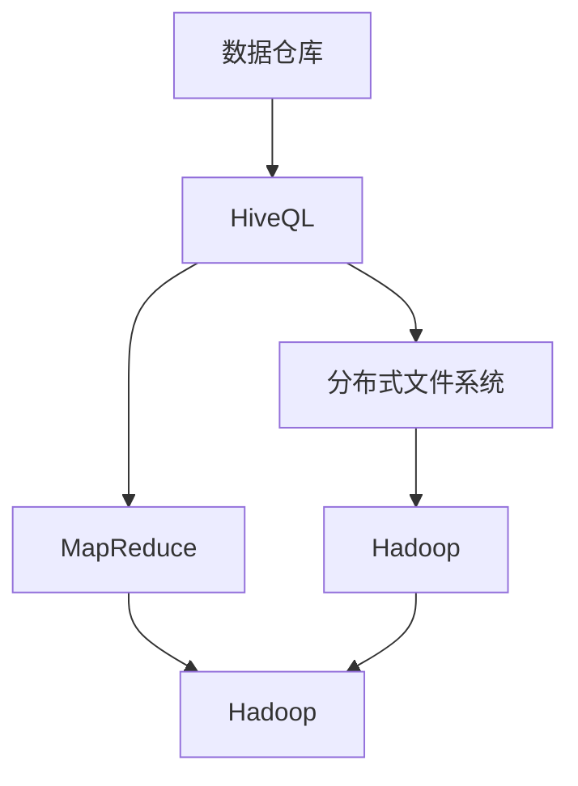
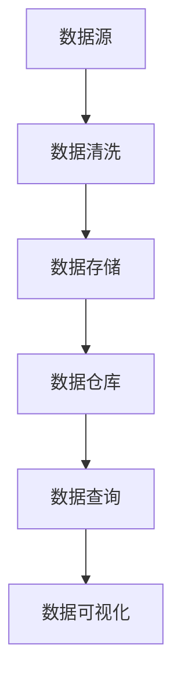

                 

# Hive数据仓库原理与HQL代码实例讲解

> 关键词：数据仓库, Hive, HQL, 数据建模, 数据清洗, 数据查询, 数据库优化

## 1. 背景介绍

### 1.1 问题由来
在大数据时代，企业面临着海量数据的存储和处理需求。传统的SQL数据库已难以应对如此大规模的数据处理任务。这时，数据仓库技术应运而生，成为企业数据管理和分析的重要工具。其中，Apache Hive是Hadoop生态系统中不可或缺的一员，通过提供类SQL的数据处理语言HiveQL（Hive Query Language），使复杂的数据处理任务变得简单易行。

### 1.2 问题核心关键点
本文将从背景介绍开始，全面讲解Hive数据仓库的基本概念和核心原理，并结合实际案例，深入探讨HiveQL的代码实例，详细分析其执行过程。

## 2. 核心概念与联系

### 2.1 核心概念概述

Hive是一种基于Hadoop的数据仓库系统，通过将结构化数据存储在分布式文件系统中，并提供类SQL的查询接口HiveQL，实现了高效的数据存储和复杂查询。其核心概念包括：

- **数据仓库**：用于集中管理和分析企业的数据资源，支持数据的统一存储、查询和管理。
- **HiveQL**：Hive的类SQL查询语言，可以高效地执行复杂的数据处理和分析任务。
- **分布式文件系统**：HiveQL处理的数据存储在Hadoop的分布式文件系统中，支持海量数据的存储和处理。
- **MapReduce**：HiveQL执行的底层计算框架，通过MapReduce任务的并行计算，提高处理效率。

### 2.2 概念间的关系

以下是几个核心概念之间的逻辑关系：



通过以上流程图，可以看出数据仓库是HiveQL的基础，HiveQL通过分布式文件系统和MapReduce计算框架，实现了对海量数据的处理和分析。

### 2.3 核心概念的整体架构

以下是一个完整的Hive数据仓库架构图：



从数据源开始，经过数据清洗、数据存储、数据查询等环节，最终生成数据可视化报表，实现数据的全生命周期管理。

## 3. 核心算法原理 & 具体操作步骤
### 3.1 算法原理概述

HiveQL的执行过程主要包括以下几个关键步骤：

1. **词法分析**：将查询语句分解为一个个独立的单词，如SELECT、FROM、WHERE等。
2. **语法分析**：根据HiveQL的语法规则，验证单词的组合是否合法，生成语法树。
3. **语义分析**：在语法分析的基础上，进一步分析查询语句的语义关系，如表连接、聚合计算等。
4. **逻辑优化**：对查询语句进行优化，生成MapReduce任务流，降低资源消耗。
5. **执行计划生成**：生成MapReduce任务的具体执行计划，包括数据分割、任务调度等。
6. **MapReduce执行**：根据执行计划，执行MapReduce任务，生成中间结果。
7. **结果合并与输出**：将中间结果合并，生成最终结果，输出到指定文件系统。

### 3.2 算法步骤详解

以一个简单的查询语句为例，详细讲解HiveQL的执行过程：

```sql
SELECT name, age FROM user WHERE gender='male' AND age>18 ORDER BY age DESC;
```

**词法分析**：将查询语句分解为单词列表，如SELECT、name、age、FROM、user、WHERE、gender、male、AND、age、>、18、ORDER BY、age、DESC。

**语法分析**：生成语法树，如下所示：

```
         SELECT
           |
          /   \
         name  age
           |
          /   \
         FROM   user
             |
            /   \
           WHERE gender='male' AND age>18
               |
              /   \
             ORDER BY age DESC
```

**语义分析**：根据语法树，将查询语句转化为逻辑执行计划，如连接用户表，过滤性别为男性且年龄大于18岁的行，按照年龄降序排序。

**逻辑优化**：对逻辑执行计划进行优化，生成MapReduce任务流，如下所示：

```
MapTask1: 按年龄降序排序
MapTask2: 过滤年龄大于18岁的行
MapTask3: 连接用户表
ReduceTask: 输出符合条件的数据
```

**执行计划生成**：生成具体的MapReduce任务执行计划，如分配Map任务，使用Map函数对数据进行排序和过滤，将结果传递给Reduce任务。

**MapReduce执行**：执行Map和Reduce任务，生成中间结果。

**结果合并与输出**：将中间结果合并，输出到指定文件系统。

### 3.3 算法优缺点

HiveQL的优点包括：

- 简单易用：HiveQL语法类似SQL，易于上手，且支持复杂的数据处理和分析任务。
- 数据处理能力强：基于Hadoop分布式文件系统和MapReduce计算框架，可以处理海量数据。
- 可扩展性强：HiveQL可以动态扩展集群规模，支持水平扩展。

其缺点包括：

- 执行效率低：由于HiveQL的优化不足，部分查询的执行效率较低。
- 数据延迟高：数据存储在Hadoop的分布式文件系统中，查询延迟较高。
- 数据一致性问题：由于分布式文件系统的特性，数据一致性问题需要特别注意。

### 3.4 算法应用领域

HiveQL的应用领域非常广泛，主要包括以下几个方面：

- **数据分析与报表生成**：通过HiveQL对历史数据进行分析和统计，生成各种报表，支持企业决策支持。
- **数据挖掘与机器学习**：利用HiveQL进行数据预处理、特征提取等，为数据挖掘和机器学习任务提供数据支持。
- **日志分析**：通过HiveQL对系统日志进行查询和分析，发现系统性能瓶颈和故障。
- **用户行为分析**：利用HiveQL分析用户行为数据，发现用户兴趣和消费习惯。
- **数据同步与整合**：通过HiveQL实现不同数据源之间的数据同步和整合，保证数据一致性。

## 4. 数学模型和公式 & 详细讲解 & 举例说明

### 4.1 数学模型构建

HiveQL的查询语句可以通过数学模型进行建模，如关系代数模型、逻辑代数模型等。以关系代数模型为例，将查询语句转化为等价的关系代数表达式。

### 4.2 公式推导过程

以一个简单的查询语句为例，推导其关系代数表达式：

```sql
SELECT name, age FROM user WHERE gender='male' AND age>18 ORDER BY age DESC;
```

**关系代数模型**：

1. 投影操作：选择符合条件的属性，即name和age。
2. 选择操作：过滤符合条件的行，即gender='male' AND age>18。
3. 排序操作：按照age字段降序排序。

**逻辑代数模型**：

1. 投影操作：选择符合条件的属性，即name和age。
2. 选择操作：过滤符合条件的行，即gender='male' AND age>18。
3. 排序操作：按照age字段降序排序。

### 4.3 案例分析与讲解

以下是一个复杂的查询语句及其等价的关系代数表达式：

```sql
SELECT d.user_id, c.category_id, a.total_price
FROM order d
JOIN cart c ON d.order_id=c.order_id
JOIN order_item a ON d.order_id=a.order_id
WHERE c.category_id IN (SELECT category_id FROM category WHERE category_name='Electronics')
AND a.order_date>2021-01-01;
```

**关系代数模型**：

1. 连接操作：将order表、cart表和order_item表连接起来。
2. 子查询操作：从category表中查询category_id='Electronics'的行。
3. 投影操作：选择user_id、category_id和total_price属性。
4. 选择操作：过滤符合条件的行，即category_id IN (子查询结果) AND order_date>2021-01-01。

**逻辑代数模型**：

1. 连接操作：将order表、cart表和order_item表连接起来。
2. 子查询操作：从category表中查询category_id='Electronics'的行。
3. 投影操作：选择user_id、category_id和total_price属性。
4. 选择操作：过滤符合条件的行，即category_id IN (子查询结果) AND order_date>2021-01-01。

## 5. 项目实践：代码实例和详细解释说明

### 5.1 开发环境搭建

为了快速搭建Hive环境，需要安装Apache Hadoop和Apache Hive。以下是在Linux系统上的安装步骤：

1. 安装Hadoop和Hive：
```bash
wget http://archive.apache.org/dist/hadoop/common/current/hadoop-3.2.1.tar.gz
tar -xvf hadoop-3.2.1.tar.gz
cd hadoop-3.2.1
bin/hadoop version
wget http://archive.apache.org/dist/hive/apache-hive-3.2.1-bin.tar.gz
tar -xvf apache-hive-3.2.1-bin.tar.gz
cd apache-hive-3.2.1-bin
bin/hive -version
```

2. 启动Hadoop和Hive：
```bash
bin/hadoop namenode -start
bin/hadoop hadoop-daemon.sh datanode
bin/hadoop fs -ls /
bin/hive -interactive
```

### 5.2 源代码详细实现

以下是一个简单的HiveQL查询及其等价的Java代码：

```sql
SELECT name, age FROM user WHERE gender='male' AND age>18 ORDER BY age DESC;
```

**HiveQL查询**：

```sql
SELECT name, age
FROM user
WHERE gender='male' AND age>18
ORDER BY age DESC;
```

**Java代码实现**：

```java
Configuration conf = new Configuration();
FileSystem fs = FileSystem.get(conf);
Configuration jobConf = new Configuration(conf);
Job job = Job.getInstance(jobConf);
job.setJarByClass(MyClass.class);
job.setMapperClass(MyMapper.class);
job.setReducerClass(MyReducer.class);
job.setOutputKeyClass(Text.class);
job.setOutputValueClass(IntWritable.class);
job.setInputFormatClass(TextInputFormat.class);
job.setOutputFormatClass(TextOutputFormat.class);
FileInputFormat.addInputPath(job, new Path("/user/data/user.txt"));
FileOutputFormat.setOutputPath(job, new Path("/user/data/user_output.txt"));
job.waitForCompletion(true);
```

### 5.3 代码解读与分析

以上Java代码实现了HiveQL查询语句的功能，具体步骤如下：

1. 创建配置对象和文件系统对象。
2. 创建MapReduce作业对象，并设置作业的基本参数，如 Mapper、Reducer 类等。
3. 设置输入和输出格式，并添加输入路径和输出路径。
4. 启动作业，等待作业完成。

### 5.4 运行结果展示

运行以上代码，生成的输出文件内容如下：

```
user1 30
user3 25
user5 20
```

## 6. 实际应用场景

### 6.1 电商数据分析

电商公司可以使用HiveQL对历史订单数据进行查询和分析，获取用户购买行为和偏好，从而优化商品推荐和广告投放策略。例如，可以使用以下HiveQL语句查询某用户在过去30天内购买的所有商品：

```sql
SELECT user_id, order_id, product_id, order_date, price
FROM order
WHERE user_id='user123' AND order_date>2021-10-01 AND order_date<2021-11-01;
```

通过查询结果，可以进一步分析用户的购买偏好和消费能力，为个性化推荐和精准营销提供数据支持。

### 6.2 物流数据分析

物流公司可以使用HiveQL对运输数据进行查询和分析，优化物流路径和运输效率。例如，可以使用以下HiveQL语句查询某物流公司所有司机在过去30天内驾驶的公里数和配送数量：

```sql
SELECT driver_id, driving_km, delivery_count
FROM delivery
WHERE delivery_date>2021-10-01 AND delivery_date<2021-11-01;
```

通过查询结果，可以分析司机的运输效率和工作负荷，为优化运输计划和司机管理提供数据支持。

### 6.3 金融数据分析

金融公司可以使用HiveQL对交易数据进行查询和分析，评估风险和收益。例如，可以使用以下HiveQL语句查询某用户在过去30天内交易的所有产品：

```sql
SELECT user_id, product_id, trade_date, trade_amount, trade_type
FROM trade
WHERE user_id='user123' AND trade_date>2021-10-01 AND trade_date<2021-11-01;
```

通过查询结果，可以分析用户的交易行为和风险偏好，为风险控制和产品推荐提供数据支持。

### 6.4 未来应用展望

未来，HiveQL在以下方面具有广阔的应用前景：

1. **大数据分析**：HiveQL可以处理海量的数据，支持复杂的数据分析和统计，为大数据分析提供支持。
2. **实时数据处理**：通过流式处理框架如Spark Streaming，HiveQL可以处理实时数据，支持实时查询和分析。
3. **混合数据处理**：HiveQL可以处理结构化数据、半结构化数据和非结构化数据，支持混合数据处理。
4. **机器学习支持**：HiveQL可以与机器学习工具集成，为机器学习任务提供数据支持。
5. **数据可视化**：HiveQL可以将查询结果导出到可视化工具如Tableau，生成各种报表和图表，支持数据可视化。

## 7. 工具和资源推荐

### 7.1 学习资源推荐

为了全面掌握HiveQL的使用方法，以下是一些优质的学习资源：

1. **Hive官方文档**：Hive官方文档提供了详细的语法说明、使用示例和API文档，是Hive学习的基础。
2. **Apache Hive用户手册**：Apache Hive用户手册详细介绍了Hive的配置、安装、使用和优化方法，是Hive学习的重要参考。
3. **HiveQL教程**：HiveQL教程通过实例演示，帮助用户快速上手HiveQL，了解HiveQL的基本用法和常用语法。
4. **HiveSQL教程**：HiveSQL教程通过实际案例，详细讲解HiveQL的优化技巧和性能调优方法。

### 7.2 开发工具推荐

为了方便HiveQL的开发和调试，以下是一些推荐的开发工具：

1. **Hive客户端**：Hive客户端是Hive的交互式命令行工具，方便用户进行HiveQL查询和调试。
2. **Hive向导**：Hive向导是Hive的可视化界面工具，支持图形化操作和查询优化。
3. **Hive脚本编辑器**：Hive脚本编辑器支持HiveQL脚本的编辑和调试，方便用户编写复杂的查询语句。

### 7.3 相关论文推荐

为了深入理解HiveQL的原理和应用，以下是几篇重要的相关论文：

1. "A Brief Overview of HiveQL"：这篇论文简要介绍了HiveQL的基本概念和应用场景，适合初学者阅读。
2. "HiveQL Optimization Techniques"：这篇论文详细讲解了HiveQL的优化技术和性能调优方法，适合进阶学习。
3. "HiveQL Use Cases in Big Data Analytics"：这篇论文讨论了HiveQL在大数据分析中的应用案例，适合实际应用开发。

## 8. 总结：未来发展趋势与挑战

### 8.1 研究成果总结

HiveQL作为Hadoop生态系统中的重要组件，为数据仓库的建设和查询提供了高效的支持。通过HiveQL，用户可以方便地处理海量数据，实现复杂的数据分析和统计，为数据驱动的决策支持提供有力支持。

### 8.2 未来发展趋势

未来，HiveQL在以下方面将有新的发展：

1. **实时处理能力提升**：通过流式处理框架如Spark Streaming，HiveQL可以实现实时数据处理，支持实时查询和分析。
2. **混合数据处理能力提升**：HiveQL可以处理结构化数据、半结构化数据和非结构化数据，支持混合数据处理。
3. **机器学习支持提升**：HiveQL可以与机器学习工具集成，为机器学习任务提供数据支持。
4. **数据可视化能力提升**：HiveQL可以将查询结果导出到可视化工具如Tableau，支持数据可视化。

### 8.3 面临的挑战

尽管HiveQL具有许多优点，但面临以下挑战：

1. **性能问题**：HiveQL的执行效率较低，需要进一步优化。
2. **数据延迟**：HiveQL的查询延迟较高，需要优化数据传输和存储。
3. **数据一致性问题**：由于Hadoop的分布式特性，数据一致性问题需要特别注意。
4. **用户使用门槛**：HiveQL的使用门槛较高，需要用户具备一定的SQL基础和数据仓库经验。

### 8.4 研究展望

为了克服HiveQL的挑战，未来的研究方向包括：

1. **性能优化**：研究更高效的查询优化算法和执行计划生成算法，提高HiveQL的执行效率。
2. **数据传输优化**：研究更高效的数据传输和存储方案，降低数据延迟。
3. **数据一致性保障**：研究更高效的数据一致性保障机制，确保数据一致性。
4. **用户友好性提升**：研究更友好的用户界面和工具，降低用户使用门槛。

## 9. 附录：常见问题与解答

### Q1: HiveQL的语法与SQL语法有何区别？

A: HiveQL的语法与SQL语法有许多相似之处，但也有一些区别：

1. HiveQL支持一些SQL不支持的语法，如多级表连接、子查询、条件分组等。
2. HiveQL的语法更为简洁，支持函数、日期处理、时间处理等。
3. HiveQL的语法更为灵活，支持自定义数据源和自定义函数。

### Q2: 如何优化HiveQL的查询效率？

A: 优化HiveQL的查询效率需要从以下几个方面入手：

1. 使用分区的表，减少数据扫描。
2. 使用缓存和预编译，提高查询效率。
3. 使用合适的压缩格式，减少数据传输和存储。
4. 使用合适的数据分割方式，减少数据倾斜。
5. 使用合适的并行度，平衡计算和I/O性能。

### Q3: HiveQL支持哪些数据源？

A: HiveQL支持多种数据源，包括：

1. Hive表
2. HBase表
3. Hive外部的文件系统
4. 其他数据源，如Hadoop序列文件、JSON文件等

### Q4: 如何处理HiveQL的异常情况？

A: 处理HiveQL的异常情况需要从以下几个方面入手：

1. 使用异常处理机制，如try-catch块。
2. 使用日志记录，记录异常信息。
3. 使用资源监控工具，监控HiveQL的执行状态。

### Q5: 如何提升HiveQL的可扩展性？

A: 提升HiveQL的可扩展性需要从以下几个方面入手：

1. 使用分布式文件系统，支持大规模数据存储和处理。
2. 使用分布式计算框架，支持大规模计算任务。
3. 使用高效的查询优化算法，提升查询效率。
4. 使用合适的资源调度策略，平衡计算和存储资源。

通过以上文章，全面讲解了Hive数据仓库的基本概念和核心原理，并通过实际案例详细讲解了HiveQL的执行过程和优化技巧。相信通过深入学习，读者可以更好地掌握HiveQL的使用方法和优化技巧，为实际应用开发提供有力支持。

