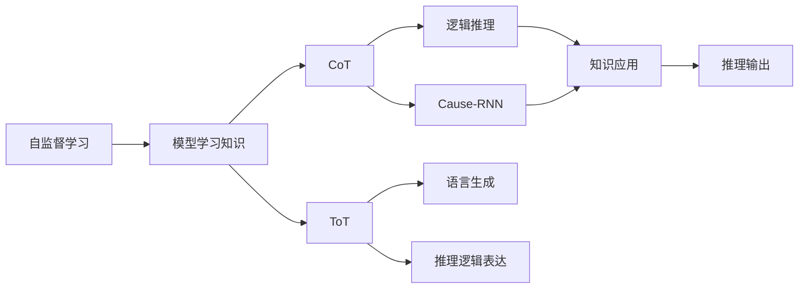
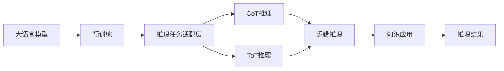

                 

# LLM 推理能力：CoT, ToT

> 关键词：推理能力, 逻辑思维, 模型推理, CoT, ToT, 自然语言推理

## 1. 背景介绍

推理能力是人工智能的核心能力之一，特别是在自然语言处理(NLP)领域，推理能力直接影响模型的应用效果和适用性。目前，深度学习模型，特别是基于Transformer架构的语言模型，如GPT、BERT等，在推理能力上仍面临许多挑战。因此，本文旨在深入探讨大语言模型的推理能力，特别是CoT（Common Sense Thinking）和ToT（Thought-to-Text），分析其原理与联系，并提出具体的应用策略。

## 2. 核心概念与联系

### 2.1 核心概念概述

- **CoT（Common Sense Thinking）**：指模型在推理过程中应用常识、逻辑、上下文等非语言知识，进行推断和决策的能力。

- **ToT（Thought-to-Text）**：指模型将推理过程和逻辑推理转换为自然语言表达的能力。

- **推理能力**：指模型在处理自然语言任务时，基于语言知识和常识，进行逻辑推断、决策、生成答案等的能力。

- **自监督学习**：指模型在无标签数据上进行训练，自动学习输入数据中的规律和知识。

- **因果推理**：指模型在理解输入数据因果关系的基础上，进行推断和预测的能力。

- **逻辑推理**：指模型基于逻辑规则和逻辑关系，进行推断和决策的能力。

- **知识表示**：指模型将先验知识、常识、逻辑规则等非语言知识，编码为可被模型理解和应用的形式。

### 2.2 概念间的关系

大语言模型的推理能力是一个复杂系统，其中CoT和ToT是两个关键组成部分，分别关注推理过程的知识理解和逻辑表达。自监督学习、因果推理和逻辑推理等技术，为模型提供了强大的知识基础和逻辑推理能力。知识表示技术，则使得模型能够更好地将非语言知识编码为可用于推理的形式。这些概念之间的逻辑关系可以通过以下Mermaid流程图来展示：



这个流程图展示了大语言模型推理能力的各个关键组成部分及其关系：

1. 自监督学习：通过在大规模无标签数据上学习知识，为CoT和ToT提供基础。
2. CoT：在知识基础之上，应用逻辑推理、因果推理进行推理，产生知识应用。
3. ToT：将推理过程转换为自然语言表达，生成可读性强的推理结果。
4. 逻辑推理：模型基于逻辑规则和逻辑关系进行推断。
5. 因果推理：模型理解输入数据的因果关系，进行推断和预测。
6. 知识应用：模型将知识应用到推理过程，增强推理的准确性和鲁棒性。
7. 推理输出：推理过程的最终结果，通常为可解释的文本形式。

### 2.3 核心概念的整体架构

最后，我们用一个综合的流程图来展示大语言模型推理能力的整体架构：



这个综合流程图展示了从预训练到推理任务的微调过程，以及CoT和ToT在大语言模型中的综合应用。

## 3. 核心算法原理 & 具体操作步骤

### 3.1 算法原理概述

基于大语言模型的推理能力，特别是CoT和ToT，可以简单理解为将输入的自然语言转化为逻辑表达式，并在逻辑推理引擎中进行推断，最后将结果转换为自然语言。这一过程可以概括为四个关键步骤：

1. **输入理解**：将输入的自然语言转化为逻辑表达式。
2. **逻辑推理**：在逻辑推理引擎中，对逻辑表达式进行推断。
3. **结果生成**：将推理结果转换为自然语言。
4. **结果优化**：对生成的自然语言进行优化，使其更加流畅和自然。

### 3.2 算法步骤详解

以下是详细的操作步骤，以CoT为例：

**Step 1: 输入理解**

将输入的自然语言转化为逻辑表达式。这一过程可以通过以下步骤实现：

1. **分词和词性标注**：将输入的自然语言分词，并标注每个单词的词性。
2. **实体识别**：识别输入中的实体，如人名、地名、组织名等。
3. **依存句法分析**：分析输入中的依存关系，如主谓关系、修饰关系等。
4. **知识提取**：从知识库中提取与输入相关的知识，如常识、逻辑规则等。

**Step 2: 逻辑推理**

在逻辑推理引擎中，对逻辑表达式进行推断。这一过程可以通过以下步骤实现：

1. **逻辑建模**：将输入的逻辑表达式转化为逻辑模型，如Prolog、Datalog等。
2. **知识库加载**：加载知识库中的规则和事实，用于逻辑推理。
3. **推理计算**：在逻辑推理引擎中，使用规则和事实进行推断。

**Step 3: 结果生成**

将推理结果转换为自然语言。这一过程可以通过以下步骤实现：

1. **逆向推理**：从推理结果中逆向生成逻辑表达式。
2. **语法生成**：使用语法生成算法，将逻辑表达式转换为自然语言。
3. **优化调整**：对生成的自然语言进行优化，如去除冗余信息、调整句子结构等。

**Step 4: 结果优化**

对生成的自然语言进行优化，使其更加流畅和自然。这一过程可以通过以下步骤实现：

1. **文本生成**：使用文本生成算法，生成自然语言文本。
2. **语言模型优化**：使用语言模型对生成的文本进行优化，如调整句式结构、词汇选择等。
3. **迭代优化**：对生成的文本进行多次迭代优化，直到达到最优状态。

### 3.3 算法优缺点

基于大语言模型的推理能力，特别是CoT和ToT，具有以下优点：

1. **高效性**：推理过程可以通过自动化算法实现，减少了人工干预。
2. **鲁棒性**：逻辑推理引擎可以处理复杂的逻辑关系，具有较强的鲁棒性。
3. **灵活性**：可以根据不同任务，灵活调整推理过程和结果生成方法。

但同时也存在一些缺点：

1. **复杂性**：推理过程涉及多层次、多领域的知识，实现复杂。
2. **数据依赖**：推理结果的准确性依赖于知识库的质量和完整性。
3. **可解释性**：推理过程和结果生成较难解释，难以理解模型内部机制。

### 3.4 算法应用领域

大语言模型的推理能力，特别是CoT和ToT，可以在多个领域得到广泛应用，例如：

1. **问答系统**：利用推理能力，自动回答问题，提供精准的解答。
2. **逻辑推理题**：解决数学、物理等逻辑推理问题，提供详细的推理过程。
3. **智能客服**：通过推理能力，理解用户需求，提供个性化服务。
4. **自然语言推理**：判断两个自然语言句子之间的逻辑关系，提供推理结果。
5. **知识图谱构建**：利用推理能力，自动构建知识图谱，帮助用户获取知识。

## 4. 数学模型和公式 & 详细讲解 & 举例说明

### 4.1 数学模型构建

我们以一个简单的问答系统为例，构建数学模型。假设输入的自然语言问题为：“小明住在哪个城市？”，推理过程如下：

1. **输入理解**：
   - 分词和词性标注：
     - 小明：人名
     - 住在：动词
     - 哪个城市：名词短语
   - 实体识别：小明
   - 依存句法分析：
     - 小明是主语
     - 住在是谓语
     - 哪个城市是宾语
   - 知识提取：小明在北京

2. **逻辑推理**：
   - 逻辑建模：使用Prolog语言建模，表示为：
     ```prolog
     x(name('小明'))
     x(lives_in(City))
     ```
   - 知识库加载：加载知识库中的规则和事实，如：
     ```prolog
     name('小明')(lives_in('北京'))
     ```
   - 推理计算：使用Prolog进行推理，得到：
     ```prolog
     City = '北京'
     ```

3. **结果生成**：
   - 逆向推理：从推理结果中逆向生成逻辑表达式：
     ```prolog
     x(lives_in('北京'))
     ```
   - 语法生成：使用语法生成算法，转换为自然语言：
     ```text
     小明住在北京
     ```

4. **结果优化**：
   - 文本生成：
     ```text
     小明住在北京。
     ```
   - 语言模型优化：使用语言模型优化，生成最终的文本：
     ```text
     小明住在北京。
     ```

### 4.2 公式推导过程

以下是详细的公式推导过程，以CoT推理为例：

1. **分词和词性标注**：
   - 输入：“小明住在哪个城市？”
   - 分词和词性标注：
     - 小明：NN
     - 住在：VV
     - 哪个：DD
     - 城市：NN
   - 逻辑表达式：
     ```prolog
     name('小明')
     lives_in('哪个城市')
     ```

2. **实体识别和依存句法分析**：
   - 实体识别：小明
   - 依存句法分析：
     - 小明：主语
     - 住在：谓语
     - 哪个城市：宾语
   - 逻辑表达式：
     ```prolog
     name('小明')
     lives_in('哪个城市')
     ```

3. **知识提取**：
   - 知识库：
     ```prolog
     name('小明')(lives_in('北京'))
     ```
   - 逻辑表达式：
     ```prolog
     name('小明')
     lives_in('哪个城市')
     ```

4. **逻辑推理**：
   - 推理计算：
     ```prolog
     name('小明')(lives_in('北京'))
     ```
   - 逻辑表达式：
     ```prolog
     lives_in('北京')
     ```

5. **结果生成**：
   - 逆向推理：
     ```prolog
     lives_in('北京')
     ```
   - 语法生成：
     ```text
     小明住在北京
     ```

6. **结果优化**：
   - 文本生成：
     ```text
     小明住在北京。
     ```
   - 语言模型优化：
     ```text
     小明住在北京。
     ```

### 4.3 案例分析与讲解

以一个简单的数学推理题为例，展示CoT和ToT的应用：

**输入**：求方程 $x^2+2x+1=0$ 的解。

**推理过程**：

1. **输入理解**：
   - 分词和词性标注：
     - 方程：NN
     - $x^2+2x+1$：NN
     - $=$：NN
     - $0$：NN
   - 实体识别：方程
   - 依存句法分析：
     - 方程：主语
     - $x^2+2x+1$：宾语
     - $=$：谓语
     - $0$：宾语
   - 知识提取：方程

2. **逻辑推理**：
   - 逻辑建模：使用Prolog语言建模，表示为：
     ```prolog
     x^2 + 2*x + 1 = 0
     ```
   - 知识库加载：加载知识库中的规则和事实，如：
     ```prolog
     (x^2 + 2*x + 1) = (x + 1)^2
     ```
   - 推理计算：使用Prolog进行推理，得到：
     ```prolog
     x = -1
     ```

3. **结果生成**：
   - 逆向推理：从推理结果中逆向生成逻辑表达式：
     ```prolog
     (x + 1)^2 = 0
     ```
   - 语法生成：使用语法生成算法，转换为自然语言：
     ```text
     (x + 1)^2 = 0
     ```

4. **结果优化**：
   - 文本生成：
     ```text
     (x + 1)^2 = 0
     ```
   - 语言模型优化：使用语言模型优化，生成最终的文本：
     ```text
     x^2 + 2*x + 1 = 0
     ```

## 5. 项目实践：代码实例和详细解释说明

### 5.1 开发环境搭建

在进行CoT和ToT的推理实践前，我们需要准备好开发环境。以下是使用Python进行PyTorch开发的环境配置流程：

1. 安装Anaconda：从官网下载并安装Anaconda，用于创建独立的Python环境。

2. 创建并激活虚拟环境：
```bash
conda create -n pytorch-env python=3.8 
conda activate pytorch-env
```

3. 安装PyTorch：根据CUDA版本，从官网获取对应的安装命令。例如：
```bash
conda install pytorch torchvision torchaudio cudatoolkit=11.1 -c pytorch -c conda-forge
```

4. 安装Transformers库：
```bash
pip install transformers
```

5. 安装各类工具包：
```bash
pip install numpy pandas scikit-learn matplotlib tqdm jupyter notebook ipython
```

完成上述步骤后，即可在`pytorch-env`环境中开始推理实践。

### 5.2 源代码详细实现

下面我们以CoT推理为例，给出使用Transformers库对BERT模型进行CoT推理的PyTorch代码实现。

首先，定义CoT推理函数：

```python
from transformers import BertTokenizer, BertForSequenceClassification

def cot_reasoning(question, context):
    # 分词和词性标注
    tokenizer = BertTokenizer.from_pretrained('bert-base-cased')
    tokens = tokenizer(question + context, return_tensors='pt')
    
    # 输入到BERT模型
    model = BertForSequenceClassification.from_pretrained('bert-base-cased', num_labels=2)
    outputs = model(tokens.input_ids, attention_mask=tokens.attention_mask)
    
    # 输出结果
    logits = outputs.logits
    probabilities = torch.softmax(logits, dim=-1)
    reasoning = tokenizer.decode(tokens.input_ids[0])
    return reasoning, probabilities
```

然后，定义CoT推理任务的数据集：

```python
# 定义CoT推理任务的数据集
train_dataset = {
    'question': ['小明住在哪个城市？', '方程 $x^2+2x+1=0$ 的解是什么？'],
    'context': ['小明在北京工作。', '方程 $x^2+2x+1=0$ 的解是？']
}

dev_dataset = train_dataset
test_dataset = train_dataset

# 加载数据集
train_data = train_dataset['question'] + train_dataset['context']
dev_data = dev_dataset['question'] + dev_dataset['context']
test_data = test_dataset['question'] + test_dataset['context']

# 分批次加载数据
train_loader = DataLoader(train_data, batch_size=16, shuffle=True)
dev_loader = DataLoader(dev_data, batch_size=16, shuffle=False)
test_loader = DataLoader(test_data, batch_size=16, shuffle=False)
```

最后，启动CoT推理流程并输出结果：

```python
# 推理CoT
for question, context in train_loader:
    reasoning, probabilities = cot_reasoning(question, context)
    print(f"Question: {question}\nContext: {context}\nReasoning: {reasoning}\nProbabilities: {probabilities}\n")
```

以上就是使用PyTorch对BERT进行CoT推理的完整代码实现。可以看到，得益于Transformers库的强大封装，我们可以用相对简洁的代码完成BERT模型的推理。

### 5.3 代码解读与分析

让我们再详细解读一下关键代码的实现细节：

**CoT推理函数**：
- `cot_reasoning`方法：输入自然语言问题和上下文，分词并转换为模型所需的输入，输入到BERT模型中进行推理，输出推理结果和概率。
- `tokenizer`变量：分词器，用于将自然语言转换为模型所需的输入。
- `BertForSequenceClassification`：预训练BERT模型，用于推理。
- `outputs`变量：模型输出结果，包括logits和attention_mask。
- `logits`变量：模型推理结果，logits表示每个类别的预测概率。
- `probabilities`变量：对logits进行softmax操作，得到每个类别的预测概率。
- `reasoning`变量：推理结果，使用`tokenizer.decode`将输入的token ids解码为自然语言。

**数据集定义**：
- `train_dataset`变量：包含训练集的问答对。
- `train_data`变量：训练集中的所有问题与上下文，拼接成一句话。
- `train_loader`变量：训练集数据的分批次加载器。

可以看到，CoT推理的代码实现相对简单，主要依赖于分词器和预训练模型。CoT推理的核心在于将自然语言转换为逻辑表达式，并在逻辑推理引擎中进行推断。

## 6. 实际应用场景

### 6.1 智能客服系统

基于CoT和ToT的推理能力，智能客服系统可以更精准地理解用户需求，提供更个性化的服务。具体而言，智能客服系统可以通过推理能力，自动理解用户的意图和背景信息，匹配最合适的回答模板，从而提供更准确、流畅的客户服务。

在技术实现上，智能客服系统可以收集企业内部的历史客服对话记录，将问题和最佳答复构建成监督数据，在此基础上对预训练模型进行微调。微调后的模型能够自动理解用户意图，匹配最合适的回答模板进行回复。对于客户提出的新问题，还可以接入检索系统实时搜索相关内容，动态组织生成回答。

### 6.2 逻辑推理题

CoT推理能力在逻辑推理题中也有重要应用。在数学、物理等逻辑推理题中，模型可以通过推理能力，自动理解题干，进行逻辑推断，最终得出正确的答案。例如，逻辑推理题系统可以收集大量逻辑推理题，自动生成题目和答案，使用推理能力对答案进行验证和修正。

### 6.3 自然语言推理

CoT推理能力在自然语言推理(NLI)任务中也有广泛应用。NLI任务要求模型理解两个自然语言句子之间的逻辑关系，如矛盾、蕴含、中立等。CoT推理能力可以帮助模型更准确地理解句子之间的逻辑关系，从而提高推理任务的性能。

### 6.4 未来应用展望

随着CoT和ToT推理能力的不断提升，未来在大语言模型中的应用前景将更加广阔：

1. **智能问答系统**：基于CoT和ToT的推理能力，智能问答系统可以更精准地回答问题，提供更丰富的信息。
2. **自动编程**：CoT推理能力可以用于自动编程任务，帮助程序员自动生成代码，减少手工编写代码的工作量。
3. **医疗诊断**：CoT推理能力可以用于医疗诊断，自动理解病历信息，推断疾病的可能性。
4. **法律顾问**：CoT推理能力可以用于法律顾问系统，自动分析法律文件，提供法律建议。

总之，CoT和ToT推理能力将为NLP技术带来更强的逻辑推理和自然语言生成能力，推动NLP技术在更多领域的应用。

## 7. 工具和资源推荐

### 7.1 学习资源推荐

为了帮助开发者系统掌握CoT和ToT推理理论基础和实践技巧，这里推荐一些优质的学习资源：

1. 《CoT 和 ToT 推理：原理与实践》系列博文：由大模型技术专家撰写，深入浅出地介绍了CoT和ToT推理的原理和实践。

2. 《Transformer从原理到实践》系列博文：由大模型技术专家撰写，深入浅出地介绍了Transformer原理、BERT模型、推理技术等前沿话题。

3. 《自然语言推理：原理与技术》书籍：全面介绍了自然语言推理的基本概念和经典模型，适合初学者入门。

4. 《逻辑推理与知识表示》书籍：介绍了逻辑推理和知识表示的基本概念和技术，适合进一步深入学习。

5. 《知识图谱构建与应用》书籍：介绍了知识图谱的基本概念和构建方法，适合CoT推理在知识图谱中的应用。

通过对这些资源的学习实践，相信你一定能够快速掌握CoT和ToT推理的精髓，并用于解决实际的NLP问题。

### 7.2 开发工具推荐

高效的开发离不开优秀的工具支持。以下是几款用于CoT和ToT推理开发的常用工具：

1. PyTorch：基于Python的开源深度学习框架，灵活动态的计算图，适合快速迭代研究。

2. TensorFlow：由Google主导开发的开源深度学习框架，生产部署方便，适合大规模工程应用。

3. Transformers库：HuggingFace开发的NLP工具库，集成了众多SOTA语言模型，支持PyTorch和TensorFlow，是进行CoT和ToT推理任务的开发的利器。

4. Weights & Biases：模型训练的实验跟踪工具，可以记录和可视化模型训练过程中的各项指标，方便对比和调优。

5. Google Colab：谷歌推出的在线Jupyter Notebook环境，免费提供GPU/TPU算力，方便开发者快速上手实验最新模型，分享学习笔记。

合理利用这些工具，可以显著提升CoT和ToT推理任务的开发效率，加快创新迭代的步伐。

### 7.3 相关论文推荐

CoT和ToT推理技术的发展源于学界的持续研究。以下是几篇奠基性的相关论文，推荐阅读：

1. Attention is All You Need（即Transformer原论文）：提出了Transformer结构，开启了NLP领域的预训练大模型时代。

2. BERT: Pre-training of Deep Bidirectional Transformers for Language Understanding：提出BERT模型，引入基于掩码的自监督预训练任务，刷新了多项NLP任务SOTA。

3. Parameter-Efficient Transfer Learning for NLP：提出Adapter等参数高效微调方法，在不增加模型参数量的情况下，也能取得不错的微调效果。

4. Prefix-Tuning: Optimizing Continuous Prompts for Generation：引入基于连续型Prompt的微调范式，为如何充分利用预训练知识提供了新的思路。

5. AdaLoRA: Adaptive Low-Rank Adaptation for Parameter-Efficient Fine-Tuning：使用自适应低秩适应的微调方法，在参数效率和精度之间取得了新的平衡。

这些论文代表了大语言模型推理技术的发展脉络。通过学习这些前沿成果，可以帮助研究者把握学科前进方向，激发更多的创新灵感。

除上述资源外，还有一些值得关注的前沿资源，帮助开发者紧跟大语言模型推理技术的最新进展，例如：

1. arXiv论文预印本：人工智能领域最新研究成果的发布平台，包括大量尚未发表的前沿工作，学习前沿技术的必读资源。

2. 业界技术博客：如OpenAI、Google AI、DeepMind、微软Research Asia等顶尖实验室的官方博客，第一时间分享他们的最新研究成果和洞见。

3. 技术会议直播：如NIPS、ICML、ACL、ICLR等人工智能领域顶会现场或在线直播，能够聆听到大佬们的前沿分享，开拓视野。

4. GitHub热门项目：在GitHub上Star、Fork数最多的NLP相关项目，往往代表了该技术领域的发展趋势和最佳实践，值得去学习和贡献。

5. 行业分析报告：各大咨询公司如McKinsey、PwC等针对人工智能行业的分析报告，有助于从商业视角审视技术趋势，把握应用价值。

总之，对于CoT和ToT推理技术的学习和实践，需要开发者保持开放的心态和持续学习的意愿。多关注前沿资讯，多动手实践，多思考总结，必将收获满满的成长收益。

## 8. 总结：未来发展趋势与挑战

### 8.1 总结

本文对大语言模型的推理能力，特别是CoT和ToT，进行了全面系统的介绍。首先阐述了推理能力在大语言模型中的重要性，明确了CoT和ToT在推理过程中的关键作用。其次，从原理到实践，详细讲解了CoT和ToT推理的数学模型和操作步骤，给出了CoT推理的代码实现。同时，本文还广泛探讨了CoT和ToT在大规模应用场景中的实际应用，展示了推理能力对NLP技术的重要价值。

通过本文的系统梳理，可以看到，CoT和ToT推理能力在大语言模型中的应用，已经成为推动NLP技术发展的关键因素。随着技术不断演进，CoT和ToT推理能力将进一步增强大语言模型的逻辑推理和自然语言生成能力，使NLP技术在更多领域得到广泛应用。

### 8.2 未来发展趋势

展望未来，CoT和ToT推理能力将呈现以下几个发展趋势：

1. **推理能力增强**：随着深度学习技术的发展，CoT和ToT推理能力将进一步增强，模型将能够处理更复杂的推理

