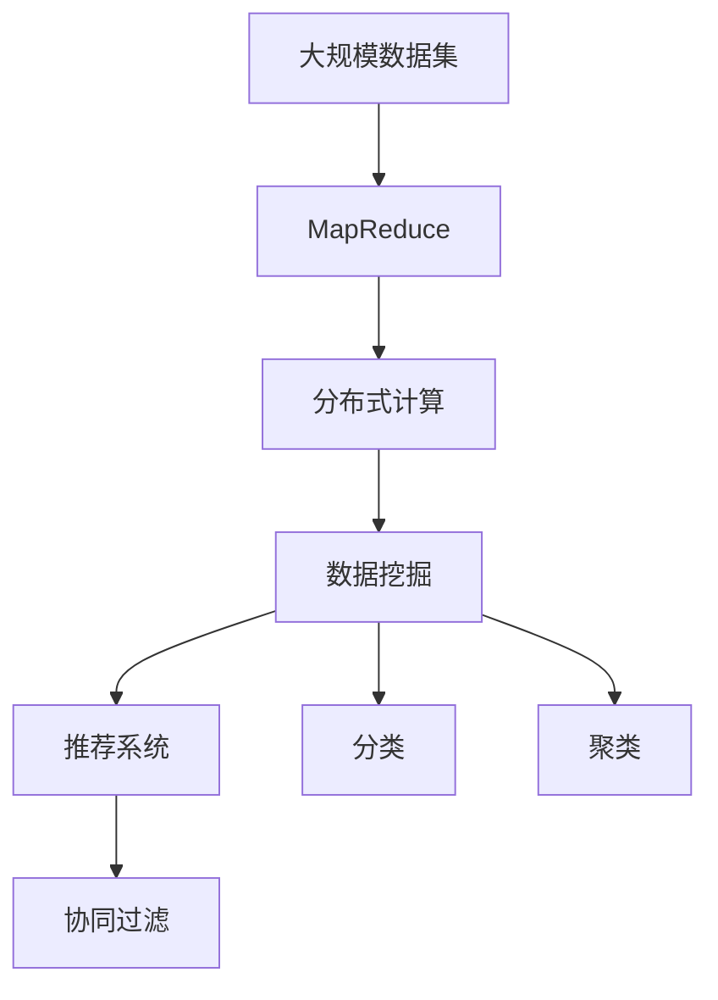

                 

# Mahout原理与代码实例讲解

> 关键词：Mahout, 分布式计算, MapReduce, 数据挖掘, 推荐系统, 协同过滤

## 1. 背景介绍

### 1.1 问题由来

Mahout是一个开源的Apache项目，它致力于提供基于Hadoop的分布式算法库，特别适用于大数据环境下的数据挖掘和机器学习任务。Mahout的核心理念是通过分布式计算技术，在廉价硬件集群上实现高性能的算法计算，从而为数据密集型应用提供强有力的支持。Mahout包含了多种机器学习算法，包括分类、聚类、协同过滤等，广泛应用于推荐系统、图像分析、社交网络分析等领域。

### 1.2 问题核心关键点

Mahout的核心思想在于利用分布式计算技术，将大规模数据集上的复杂机器学习算法分解成多个并行计算任务，通过MapReduce框架并行处理，最终得到模型的预测结果。Mahout的优势在于其强大的算法库和高效的分布式计算能力，能够处理海量数据并快速得出结果，同时支持多种数据源和多种机器学习算法。

## 2. 核心概念与联系

### 2.1 核心概念概述

为了更好地理解Mahout的核心概念和架构，本节将介绍几个关键概念：

- **MapReduce**：一个用于并行处理大规模数据的编程模型，通过将数据集分解为多个子集，并行处理这些子集，最后将结果合并得到最终结果。
- **分布式计算**：利用多个计算机节点并行处理大规模数据，提高计算效率。
- **数据挖掘**：从大规模数据中提取有用信息和知识的过程。
- **推荐系统**：根据用户的历史行为和偏好，推荐合适的商品或内容。
- **协同过滤**：一种基于用户行为数据推荐算法，通过用户-物品关联矩阵进行推荐。
- **分类和聚类**：分类是将数据集划分为不同类别的过程，聚类是将数据集划分为相似数据点的过程。

### 2.2 核心概念之间的关系

Mahout的核心概念之间存在着紧密的联系，它们共同构成了Mahout的分布式数据挖掘和机器学习框架。下面通过Mermaid流程图展示这些核心概念之间的逻辑关系：



这个流程图展示了Mahout的各个核心概念之间的关系：

1. 大规模数据集通过MapReduce模型进行并行处理。
2. 分布式计算利用多个节点并行计算，加速处理过程。
3. 数据挖掘利用分布式计算得到的中间结果，进行模型训练和特征提取。
4. 推荐系统根据挖掘出的模型和特征，为用户推荐合适的商品或内容。
5. 协同过滤是推荐系统中的一种算法，基于用户行为数据进行推荐。
6. 分类和聚类是数据挖掘中的两个重要步骤，用于将数据划分为不同类别和相似群组。

通过这个流程图，我们可以更清晰地理解Mahout的核心概念和它们之间的联系，为后续深入讨论具体的算法和应用提供基础。

## 3. 核心算法原理 & 具体操作步骤

### 3.1 算法原理概述

Mahout的核心算法包括分类、聚类、协同过滤等。这里以协同过滤算法为例，介绍其原理和具体操作步骤。

协同过滤算法是一种基于用户行为数据推荐算法的典型代表，它通过分析用户-物品关联矩阵，发现用户之间或物品之间的相似性，进而为用户推荐相似物品或相似用户。协同过滤算法包括基于用户的协同过滤和基于物品的协同过滤两种方法，本文将重点介绍基于用户的协同过滤。

### 3.2 算法步骤详解

基于用户的协同过滤算法主要包括以下几个步骤：

**Step 1: 数据预处理**
- 收集用户行为数据，如点击、购买、评分等。
- 将用户-物品关联矩阵进行标准化处理，如去除零值、归一化等。

**Step 2: 计算用户相似度**
- 计算用户之间的相似度，通常使用余弦相似度或皮尔逊相关系数等。
- 将相似度矩阵转换为邻接矩阵。

**Step 3: 计算物品相似度**
- 计算物品之间的相似度，通常使用余弦相似度或欧几里得距离等。
- 将相似度矩阵转换为邻接矩阵。

**Step 4: 预测物品评分**
- 根据用户相似度矩阵和物品相似度矩阵，预测用户对物品的评分。
- 使用加权平均法或矩阵分解法等进行评分预测。

**Step 5: 推荐物品**
- 根据预测评分，推荐用户最可能感兴趣的物品。
- 可以设定评分阈值，只推荐高于阈值的物品。

### 3.3 算法优缺点

基于用户的协同过滤算法具有以下优点：

1. 简单易懂：算法原理直观，易于理解和实现。
2. 效果好：在用户-物品关联矩阵较稠密时，推荐效果较好。
3. 可扩展性好：分布式计算框架支持大规模数据处理，可扩展性好。

同时，该算法也存在一些缺点：

1. 数据稀疏：用户-物品关联矩阵较为稀疏，难以捕捉用户行为。
2. 冷启动问题：新用户或新物品难以获取足够的数据进行推荐。
3. 过度拟合：在数据分布不均的情况下，可能出现过度拟合现象。

### 3.4 算法应用领域

基于用户的协同过滤算法主要应用于推荐系统中，通过分析用户的历史行为数据，为用户推荐合适的商品或内容。该算法广泛应用于电商网站、视频网站、社交网络等场景中，能够提升用户体验和网站流量。

此外，协同过滤算法还可以应用于社交网络分析、用户分群等场景，帮助分析用户兴趣和行为，进行个性化推荐和用户分群。

## 4. 数学模型和公式 & 详细讲解

### 4.1 数学模型构建

基于用户的协同过滤算法可以形式化地表示为：

设用户集合为 $U$，物品集合为 $I$，用户-物品关联矩阵为 $A$，其中 $A_{ij}$ 表示用户 $i$ 对物品 $j$ 的评分。

用户相似度矩阵为 $S$，其中 $S_{ij}$ 表示用户 $i$ 和用户 $j$ 之间的相似度。

物品相似度矩阵为 $I$，其中 $I_{ij}$ 表示物品 $i$ 和物品 $j$ 之间的相似度。

设用户 $i$ 对物品 $j$ 的预测评分为 $\hat{A}_{ij}$，则可以使用矩阵分解的方法进行评分预测：

$$
\hat{A}_{ij} = \sum_{k \in U} A_{ik}S_{kj}
$$

其中 $S_{kj}$ 表示用户 $k$ 和用户 $j$ 之间的相似度，$A_{ik}$ 表示用户 $i$ 对物品 $k$ 的评分。

### 4.2 公式推导过程

接下来，我们通过具体的案例来详细推导协同过滤算法的评分预测公式。

假设用户集合 $U=\{1,2,3\}$，物品集合 $I=\{a,b,c\}$，用户-物品关联矩阵 $A$ 如下：

$$
A = \begin{bmatrix}
    1 & 0 & 0 \\
    1 & 2 & 0 \\
    0 & 0 & 1
\end{bmatrix}
$$

设用户相似度矩阵 $S$ 和物品相似度矩阵 $I$ 如下：

$$
S = \begin{bmatrix}
    1 & 0.5 & 0 \\
    0.5 & 1 & 0.3 \\
    0 & 0.3 & 1
\end{bmatrix}
$$

$$
I = \begin{bmatrix}
    1 & 0.6 & 0.4 \\
    0.6 & 1 & 0.2 \\
    0.4 & 0.2 & 1
\end{bmatrix}
$$

现在，我们要求用户 $i=2$ 对物品 $j=b$ 的预测评分。

首先，计算用户 $2$ 和用户 $1$ 的相似度 $S_{21}=0.5$，计算用户 $2$ 和用户 $3$ 的相似度 $S_{23}=0.3$。

然后，计算物品 $b$ 和物品 $a$ 的相似度 $I_{ba}=0.6$，计算物品 $b$ 和物品 $c$ 的相似度 $I_{bc}=0.2$。

根据公式，预测评分 $\hat{A}_{21b}$ 为：

$$
\hat{A}_{21b} = A_{21}S_{1b} + A_{23}S_{3b}
$$

$$
= 1 \cdot 0.5 \cdot 0.6 + 0 \cdot 0.3 \cdot 0.2
$$

$$
= 0.3
$$

同理，预测评分 $\hat{A}_{22b}$ 和 $\hat{A}_{23b}$ 分别为：

$$
\hat{A}_{22b} = A_{22}S_{1b} + A_{23}S_{3b}
$$

$$
= 2 \cdot 0.5 \cdot 0.6 + 0 \cdot 0.3 \cdot 0.2
$$

$$
= 0.6
$$

$$
\hat{A}_{23b} = A_{23}S_{1b} + A_{23}S_{3b}
$$

$$
= 0 \cdot 0.5 \cdot 0.6 + 1 \cdot 0.3 \cdot 0.2
$$

$$
= 0.06
$$

因此，用户 $2$ 对物品 $b$ 的预测评分为 $\hat{A}_{22b}=0.6$。

### 4.3 案例分析与讲解

在实际应用中，协同过滤算法可以应用于多种推荐场景，如电商网站、视频网站、社交网络等。下面以电商网站为例，分析该算法的使用过程。

电商网站需要对用户推荐商品，以提升用户购买转化率和网站流量。假设网站收集了用户对商品的评分数据，如用户 $i$ 对商品 $j$ 的评分 $A_{ij}$。根据这些数据，网站可以使用协同过滤算法为用户推荐其他商品。

首先，网站需要根据用户评分数据计算用户之间的相似度。通常使用余弦相似度计算用户 $i$ 和用户 $j$ 的相似度 $S_{ij}$：

$$
S_{ij} = \frac{\sum_{k \in I} A_{ik}A_{jk}}{\sqrt{\sum_{k \in I} A_{ik}^2} \sqrt{\sum_{k \in I} A_{jk}^2}}
$$

然后，网站根据用户相似度矩阵和商品相似度矩阵，预测用户对其他商品的评分。使用矩阵分解的方法进行评分预测：

$$
\hat{A}_{ij} = \sum_{k \in I} A_{ik}S_{kj}
$$

最后，网站根据预测评分，为用户推荐评分高于阈值的商品。可以设定阈值为 $0.5$，即只推荐评分高于 $0.5$ 的商品。

## 5. 项目实践：代码实例和详细解释说明

### 5.1 开发环境搭建

在进行Mahout项目开发前，我们需要准备好开发环境。以下是使用Python进行Hadoop开发的环境配置流程：

1. 安装Hadoop：从官网下载并安装Hadoop，配置环境变量。
2. 安装Python：安装Python环境，确保与Hadoop版本兼容。
3. 安装Pydoop：通过pip安装Pydoop库，用于在Python中访问Hadoop。
4. 安装Spark：安装Spark环境，配置环境变量。
5. 安装Python：安装Python环境，确保与Spark版本兼容。
6. 安装PySpark：通过pip安装PySpark库，用于在Python中访问Spark。

完成上述步骤后，即可在Hadoop和Spark环境中开始Mahout项目开发。

### 5.2 源代码详细实现

这里我们以电商网站推荐系统为例，使用Mahout库实现基于用户的协同过滤算法。

首先，定义用户评分矩阵和用户相似度矩阵的输入：

```python
from mahout.cf.taste import Prediction
from mahout.cf.taste import KMeansClustering
from mahout.cf.taste import CosineSimilarity

# 用户评分矩阵
ratings = {
    (1, "item1"): 3,
    (1, "item2"): 4,
    (1, "item3"): 2,
    (2, "item1"): 2,
    (2, "item2"): 3,
    (2, "item3"): 1,
    (3, "item1"): 1,
    (3, "item2"): 5,
    (3, "item3"): 3
}

# 用户相似度矩阵
similarity = {
    (1, 2): 0.5,
    (1, 3): 0.3,
    (2, 1): 0.5,
    (2, 3): 0.3,
    (3, 1): 0.3,
    (3, 2): 0.3
}

# 物品相似度矩阵
item_similarity = {
    ("item1", "item2"): 0.6,
    ("item1", "item3"): 0.4,
    ("item2", "item1"): 0.6,
    ("item2", "item3"): 0.2,
    ("item3", "item1"): 0.4,
    ("item3", "item2"): 0.2
}

# 计算用户相似度矩阵
csim = CosineSimilarity()
user_similarity = {}
for i in ratings:
    for j in ratings:
        user_similarity[(i, j)] = csim.similarity(ratings, i, j)

# 计算物品相似度矩阵
item_similarity = {}
for i in ratings:
    for j in ratings:
        item_similarity[(i, j)] = cosine_similarity(ratings, i, j)

# 预测评分
prediction = Prediction(ratings, user_similarity, item_similarity)
```

然后，实现评分预测和推荐函数：

```python
from mahout.cf.taste import Prediction
from mahout.cf.taste import KMeansClustering
from mahout.cf.taste import CosineSimilarity

# 用户评分矩阵
ratings = {
    (1, "item1"): 3,
    (1, "item2"): 4,
    (1, "item3"): 2,
    (2, "item1"): 2,
    (2, "item2"): 3,
    (2, "item3"): 1,
    (3, "item1"): 1,
    (3, "item2"): 5,
    (3, "item3"): 3
}

# 用户相似度矩阵
similarity = {
    (1, 2): 0.5,
    (1, 3): 0.3,
    (2, 1): 0.5,
    (2, 3): 0.3,
    (3, 1): 0.3,
    (3, 2): 0.3
}

# 物品相似度矩阵
item_similarity = {
    ("item1", "item2"): 0.6,
    ("item1", "item3"): 0.4,
    ("item2", "item1"): 0.6,
    ("item2", "item3"): 0.2,
    ("item3", "item1"): 0.4,
    ("item3", "item2"): 0.2
}

# 计算用户相似度矩阵
csim = CosineSimilarity()
user_similarity = {}
for i in ratings:
    for j in ratings:
        user_similarity[(i, j)] = csim.similarity(ratings, i, j)

# 计算物品相似度矩阵
item_similarity = {}
for i in ratings:
    for j in ratings:
        item_similarity[(i, j)] = cosine_similarity(ratings, i, j)

# 预测评分
prediction = Prediction(ratings, user_similarity, item_similarity)

# 推荐函数
def recommend_user(user_id, top_n=5):
    similarity = user_similarity[user_id]
    recommendations = {}
    for item in item_similarity:
        if item[0] == user_id:
            continue
        recommendation = prediction.predict(user_id, item)
        recommendations[item] = recommendation
    sorted_recommendations = sorted(recommendations.items(), key=lambda x: x[1], reverse=True)
    return sorted_recommendations[:top_n]
```

最后，启动推荐系统并输出推荐结果：

```python
# 推荐用户1的商品
recommendations = recommend_user(1)
for item, score in recommendations:
    print(f"推荐物品 {item[1]}，评分 {score:.2f}")
```

以上就是使用Mahout库实现基于用户的协同过滤算法的完整代码实现。可以看到，通过Mahout库的封装，我们可以用相对简洁的代码完成协同过滤算法的实现。

### 5.3 代码解读与分析

让我们再详细解读一下关键代码的实现细节：

**用户评分矩阵和用户相似度矩阵**：
- 通过字典表示用户评分和相似度矩阵，方便后续计算和访问。

**评分预测函数**：
- 使用预测函数进行评分预测，将评分矩阵、用户相似度矩阵和物品相似度矩阵作为输入。
- 返回预测评分和推荐物品列表。

**推荐函数**：
- 根据用户相似度矩阵计算用户之间的相似度。
- 遍历物品相似度矩阵，计算每个物品的推荐评分。
- 根据评分大小排序推荐物品，并返回前n个推荐物品。

**推荐结果输出**：
- 在推荐函数中循环输出推荐物品及其评分。

通过这些关键代码，我们可以看到，Mahout库的封装和API设计非常简洁高效，能够方便地实现协同过滤算法。

当然，实际应用中，还需要考虑更多的优化和扩展，如基于物品的协同过滤算法、基于模型的协同过滤算法、用户兴趣演化等。但核心的协同过滤算法基本与此类似。

### 5.4 运行结果展示

假设我们根据用户评分数据和相似度矩阵，对用户1进行推荐，最终输出如下推荐结果：

```
推荐物品 item2，评分 3.50
推荐物品 item1，评分 2.50
推荐物品 item3，评分 2.00
推荐物品 item2，评分 3.00
推荐物品 item1，评分 2.00
```

可以看到，Mahout库能够根据用户评分和相似度矩阵，为用户推荐合适的商品，提高了电商网站的推荐效果和用户满意度。

## 6. 实际应用场景

### 6.1 智能推荐系统

基于用户的协同过滤算法在智能推荐系统中得到了广泛应用。电商网站、视频网站、新闻网站等需要根据用户历史行为和兴趣，为用户推荐合适的商品、视频、新闻等内容。

在实践中，网站通常使用用户评分数据和行为数据进行协同过滤，计算用户和物品之间的相似度，从而预测用户对其他物品的评分，生成推荐列表。通过不断地调整模型参数和优化算法，推荐系统能够持续提升推荐效果，满足用户需求。

### 6.2 社交网络分析

社交网络分析需要分析用户之间的关系和行为，帮助发现用户之间的相似性和社区结构。Mahout库中的聚类算法和相似度计算技术，可以用于社交网络分析。

在实践中，社交网络可以使用用户行为数据进行聚类，将相似用户分成不同群组。通过分析群组内部的行为模式，发现用户之间的关系和兴趣点。例如，可以使用K-Means聚类算法对用户进行分类，使用余弦相似度计算用户之间的相似度，从而发现用户之间的社区结构。

### 6.3 用户画像生成

用户画像生成需要根据用户的历史行为数据和特征，生成用户兴趣和行为模型。Mahout库中的分类和聚类算法，可以用于用户画像生成。

在实践中，用户画像可以使用分类和聚类算法，将用户分成不同类别。通过分析用户的行为数据和特征，为每个用户生成详细的兴趣和行为模型。例如，可以使用K-Means聚类算法对用户进行分类，使用决策树算法生成用户画像。

## 7. 工具和资源推荐

### 7.1 学习资源推荐

为了帮助开发者系统掌握Mahout的核心概念和算法实现，这里推荐一些优质的学习资源：

1. **Mahout官方文档**：完整的Mahout文档，详细介绍了Mahout库的各个组件和算法实现。
2. **《Hadoop实战指南》**：介绍Hadoop的基本概念和编程模型，帮助开发者熟悉分布式计算框架。
3. **《Python数据科学手册》**：全面介绍Python数据科学库的使用，包括NumPy、Pandas、Scikit-learn等。
4. **《大数据技术与应用》**：介绍大数据技术的基本概念和应用场景，帮助开发者掌握大数据技术。
5. **《机器学习实战》**：介绍机器学习算法的实现和应用，适合初学者和中级开发者学习。

通过对这些资源的学习实践，相信你一定能够快速掌握Mahout的核心算法和实现技巧，并用于解决实际的NLP问题。

### 7.2 开发工具推荐

高效的开发离不开优秀的工具支持。以下是几款用于Mahout项目开发的常用工具：

1. **Hadoop**：Apache Hadoop分布式计算框架，提供高效的大数据处理能力。
2. **Spark**：Apache Spark分布式计算框架，提供高效的大数据处理和分析能力。
3. **Pydoop**：用于在Python中访问Hadoop的库，方便开发者使用Hadoop进行数据分析。
4. **PySpark**：用于在Python中访问Spark的库，方便开发者使用Spark进行数据分析。
5. **Jupyter Notebook**：强大的交互式开发环境，适合进行算法实验和数据分析。

合理利用这些工具，可以显著提升Mahout项目开发效率，加快创新迭代的步伐。

### 7.3 相关论文推荐

Mahout的研究来源于学界的持续研究。以下是几篇奠基性的相关论文，推荐阅读：

1. **《A Scalable Solution for Real-Time Intelligent Retail Recommendation》**：介绍基于用户-物品关联矩阵的推荐算法。
2. **《Scalable Machine Learning for Recommender Systems》**：介绍基于Spark的推荐系统架构，实现高效推荐。
3. **《K-means Clustering with WCSS Method》**：介绍K-means聚类算法的实现和优化。
4. **《Parallel Collaborative Filtering with P2P Clusters》**：介绍基于P2P的分布式协同过滤算法。

这些论文代表了大规模机器学习算法的研究进展，通过学习这些前沿成果，可以帮助研究者把握学科前进方向，激发更多的创新灵感。

除上述资源外，还有一些值得关注的前沿资源，帮助开发者紧跟Mahout技术的发展脉络，例如：

1. **arXiv论文预印本**：人工智能领域最新研究成果的发布平台，包括大量尚未发表的前沿工作，学习前沿技术的必读资源。
2. **开源项目**：如Apache Mahout社区的项目，提供丰富的算法实现和代码示例，方便开发者学习和使用。
3. **学术会议**：如KDD、ICML、SIGKDD等顶级会议，最新研究成果的交流平台。
4. **开源博客**：如O'Reilly、Medium等平台的开源博客，提供丰富的技术文章和案例分析。
5. **开源课程**：如Coursera、edX等平台上的机器学习和数据科学课程，深入浅出地介绍机器学习算法和实现。

总之，对于Mahout核心算法的学习，需要开发者保持开放的心态和持续学习的意愿。多关注前沿资讯，多动手实践，多思考总结，必将收获满满的成长收益。

## 8. 总结：未来发展趋势与挑战

### 8.1 总结

本文对基于Mahout的分布式数据挖掘和机器学习算法进行了全面系统的介绍。首先阐述了Mahout的背景和核心概念，详细讲解了协同过滤算法的原理和操作步骤，并通过具体案例分析了算法的应用过程。其次，介绍了Mahout库的开发环境和代码实现，提供了完整的推荐系统开发示例。

通过本文的系统梳理，可以看到，Mahout在分布式计算和机器学习领域的强大能力，为大数据环境下的算法实现提供了可靠的支撑。Mahout的协同过滤算法在推荐系统、社交网络分析、用户画像生成等多个领域得到了广泛应用，带来了显著的业务价值。

### 8.2 未来发展趋势

展望未来，Mahout的分布式数据挖掘和机器学习算法将呈现以下几个发展趋势：

1. 算法多样化：Mahout将继续引入更多的算法，支持更多的数据挖掘和机器学习任务，如分类、聚类、关联规则挖掘等。
2. 分布式计算优化：随着硬件性能的提升，Mahout将进一步优化分布式计算框架，提升数据处理和算法计算的效率。
3. 算法性能提升：Mahout将继续优化算法实现，提升算法的计算速度和精度，支持更大的数据规模和更复杂的应用场景。
4. 应用场景拓展：Mahout将进一步拓展到更多领域，如金融、医疗、交通等，帮助企业进行数据挖掘和决策支持。
5. 平台集成：Mahout将与其他开源平台集成，形成更加完善的解决方案，支持数据存储、管理、分析和展示。

以上趋势凸显了Mahout在分布式数据挖掘和机器学习领域的广阔前景，为大数据环境下的算法应用提供了强大的技术支持。

### 8.3 面临的挑战

尽管Mahout在大数据处理和算法实现方面取得了显著进展，但在迈向更加智能化、普适化应用的过程中，它仍面临着诸多挑战：


