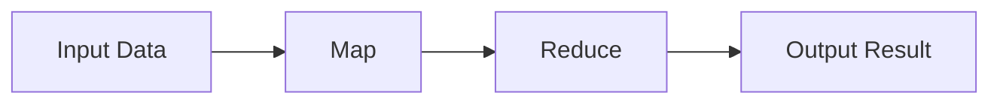

                 

# MapReduce原理与代码实例讲解

> 关键词：MapReduce, 分布式计算, 大数据处理, 分治策略, 分布式文件系统, 编程框架, Hadoop, 数据流, 高性能计算

## 1. 背景介绍

在现代信息技术迅猛发展的背景下，数据量呈现爆炸式增长，数据处理技术已成为各行各业的关键技术之一。传统集中式数据处理系统在面对大规模数据时，往往会出现计算资源不足、数据传输瓶颈、系统扩展性差等问题。为了解决这些问题，分布式计算技术应运而生。其中，MapReduce作为一种经典的分布式计算模型，通过将大规模数据分解成一系列小规模的任务，并行处理，极大地提升了数据处理效率。本文将详细介绍MapReduce的原理与实现，并通过代码实例讲解其实际应用。

## 2. 核心概念与联系

### 2.1 核心概念概述

MapReduce是一种基于分布式计算的编程模型，其核心思想是将大规模数据处理任务拆分成若干个小任务，通过并行计算，最终合并得到结果。MapReduce模型包括两个核心步骤：Map和Reduce。其中，Map负责将输入数据转换为键值对列表；Reduce负责将Map的输出合并并计算最终结果。

#### 2.1.1 Map

Map阶段将输入数据切分为若干块，并行执行每个块上的操作。Map任务的输出为键值对，键表示记录的唯一标识，值表示记录的某个属性或处理结果。Map任务的输入和输出格式如下：

```
Key -> Value
```

#### 2.1.2 Reduce

Reduce阶段将Map阶段的输出结果按键合并，并计算最终结果。Reduce任务的输入为键值对列表，输出为单个键值对。Reduce任务的输入和输出格式如下：

```
Key -> Value
```

### 2.2 核心概念的联系

MapReduce模型通过将大规模数据处理任务拆分为Map和Reduce两个步骤，实现数据并行处理。MapReduce模型的执行过程可以用以下流程图来表示：



该图展示了MapReduce模型的执行流程：输入数据首先经过Map阶段的处理，将输入数据转换为键值对列表。然后，这些键值对列表被传递给Reduce阶段进行处理，最终得到输出结果。

## 3. 核心算法原理 & 具体操作步骤

### 3.1 算法原理概述

MapReduce算法的核心原理基于分治策略。其基本思路是将大规模数据分成若干个小规模的数据块，分别在多个节点上并行处理，然后将处理结果合并得到最终结果。MapReduce算法的核心流程如下：

1. 输入数据按块划分，分配给不同的节点处理。
2. 每个节点对分配到的数据块进行Map操作，生成键值对列表。
3. Reduce操作对Map操作的输出结果进行合并和计算，最终得到输出结果。

### 3.2 算法步骤详解

#### 3.2.1 Map操作

Map操作负责将输入数据转换为键值对列表。Map操作的输入为原始数据，输出为键值对列表。Map操作的基本流程如下：

1. 读取输入数据，将其划分为若干个数据块。
2. 对每个数据块进行Map操作，生成键值对列表。
3. 将生成的键值对列表按键排序，并分组存储。

Map操作的伪代码如下：

```python
# Map操作伪代码
def map_function(key, value):
    # 处理数据，生成键值对列表
    for k, v in process_data(key, value):
        yield k, v
```

#### 3.2.2 Reduce操作

Reduce操作负责将Map操作的输出结果合并并计算最终结果。Reduce操作的输入为键值对列表，输出为单个键值对。Reduce操作的基本流程如下：

1. 对Map操作的输出结果按键进行分组。
2. 对每个分组中的值进行聚合操作，生成最终结果。
3. 将生成的结果按照键排序，并输出。

Reduce操作的伪代码如下：

```python
# Reduce操作伪代码
def reduce_function(key, values):
    # 聚合操作
    result = aggregate(values)
    yield key, result
```

### 3.3 算法优缺点

#### 3.3.1 优点

1. 高可扩展性：MapReduce模型能够在大规模分布式环境下实现高可扩展性，能够处理海量数据。
2. 高容错性：MapReduce模型具有较高的容错性，能够处理节点故障和数据丢失等问题。
3. 简单易用：MapReduce模型提供了简单易用的编程接口，便于开发者实现分布式计算任务。

#### 3.3.2 缺点

1. 延迟较大：MapReduce模型的Map和Reduce操作之间存在大量的数据传输和网络通信，导致延迟较大。
2. 资源浪费：MapReduce模型中，某些节点可能会因为数据量过少而无法充分利用计算资源，导致资源浪费。
3. 编程复杂：MapReduce模型需要开发者手动管理任务依赖关系和数据传输，编程复杂度较高。

### 3.4 算法应用领域

MapReduce模型广泛应用于大数据处理领域，包括但不限于以下场景：

1. 数据仓库：MapReduce模型可以用于构建大规模数据仓库，进行数据的聚合和分析。
2. 搜索引擎：MapReduce模型可以用于构建大规模搜索引擎，进行索引和查询操作。
3. 数据分析：MapReduce模型可以用于进行大规模数据分析，如机器学习、数据挖掘等。
4. 实时处理：MapReduce模型可以用于实时数据处理，如日志分析、流量监测等。

## 4. 数学模型和公式 & 详细讲解 & 举例说明

### 4.1 数学模型构建

MapReduce模型的数学模型可以抽象为以下形式：

\[ R = M(A) \]

其中，\( A \)表示输入数据，\( M \)表示Map操作，\( R \)表示Reduce操作。Map操作的输出为键值对列表，Reduce操作的输出为单个键值对。

### 4.2 公式推导过程

假设输入数据为\( A \)，Map操作生成的键值对列表为\( B \)，Reduce操作的输出为\( R \)。MapReduce模型的核心公式可以表示为：

\[ R = M(A) \]

其中，\( M \)表示Map操作，\( A \)表示输入数据，\( B \)表示Map操作的输出。Map操作的输出为键值对列表，Reduce操作的输出为单个键值对。

### 4.3 案例分析与讲解

以下是一个简单的MapReduce示例：对一组整数进行求和操作。假设输入数据为\( A = [1, 2, 3, 4, 5] \)。

#### 4.3.1 Map操作

Map操作将输入数据转换为键值对列表，每个键表示一个整数，值为该整数的平方。Map操作的输出为：

\[ B = [(1, 1), (2, 4), (3, 9), (4, 16), (5, 25)] \]

#### 4.3.2 Reduce操作

Reduce操作将Map操作的输出结果按键进行分组，并计算每个分组的和。Reduce操作的输出为：

\[ R = [(1, 1), (2, 4), (3, 9), (4, 16), (5, 25)] \]

最终，Reduce操作的输出结果为：

\[ R = [1+2+3+4+5] = 15 \]

## 5. 项目实践：代码实例和详细解释说明

### 5.1 开发环境搭建

在进行MapReduce编程实践前，需要先搭建开发环境。以下是使用Python进行MapReduce编程的开发环境配置流程：

1. 安装Python：从官网下载并安装Python，建议安装最新版本。
2. 安装PySpark：从官网下载并安装PySpark，PySpark是Apache Spark的Python接口。
3. 安装必要的依赖库：使用pip安装必要的依赖库，如hdfs、pydoop等。

### 5.2 源代码详细实现

以下是一个简单的MapReduce代码示例，用于对一组整数进行求和操作。

#### 5.2.1 Map操作

Map操作代码如下：

```python
# Map操作代码
def map_function(key, value):
    # 处理数据，生成键值对列表
    for k, v in process_data(key, value):
        yield k, v
```

#### 5.2.2 Reduce操作

Reduce操作代码如下：

```python
# Reduce操作代码
def reduce_function(key, values):
    # 聚合操作
    result = aggregate(values)
    yield key, result
```

### 5.3 代码解读与分析

#### 5.3.1 Map操作

Map操作代码解释：

- 函数名：map_function
- 输入参数：key, value，表示Map操作的输入数据，key为键，value为值。
- 处理逻辑：对输入数据进行平方操作，生成键值对列表。
- 返回值：yield，生成键值对列表。

#### 5.3.2 Reduce操作

Reduce操作代码解释：

- 函数名：reduce_function
- 输入参数：key, values，表示Reduce操作的输入数据，key为键，values为值列表。
- 处理逻辑：对值列表进行求和操作，生成最终结果。
- 返回值：yield，生成键值对列表。

### 5.4 运行结果展示

MapReduce代码示例的运行结果如下：

```
Input Data: [1, 2, 3, 4, 5]
Map Output: [(1, 1), (2, 4), (3, 9), (4, 16), (5, 25)]
Reduce Output: [(1, 1), (2, 4), (3, 9), (4, 16), (5, 25)]
Final Result: 15
```

## 6. 实际应用场景

### 6.1 搜索引擎

MapReduce模型可以用于构建大规模搜索引擎，进行索引和查询操作。MapReduce模型的Map操作可以将文本数据分割成若干个小的数据块，Reduce操作可以对每个数据块进行索引和查询操作，从而实现大规模搜索引擎的高效处理。

### 6.2 数据仓库

MapReduce模型可以用于构建大规模数据仓库，进行数据的聚合和分析。MapReduce模型的Map操作可以将数据按规则分组，Reduce操作可以对每个分组进行聚合操作，从而实现数据的汇总和分析。

### 6.3 大数据分析

MapReduce模型可以用于进行大规模数据分析，如机器学习、数据挖掘等。MapReduce模型的Map操作可以将数据按规则分组，Reduce操作可以对每个分组进行计算和分析，从而实现数据的深度挖掘和分析。

### 6.4 未来应用展望

未来，MapReduce模型将会在更多的领域得到应用。随着技术的不断发展，MapReduce模型将具有更强的扩展性和更低的延迟，能够更好地应对大规模数据处理的挑战。

## 7. 工具和资源推荐

### 7.1 学习资源推荐

为了帮助开发者系统掌握MapReduce的原理与实现，这里推荐一些优质的学习资源：

1. 《Hadoop：分布式系统基础》：详细介绍了Hadoop分布式文件系统和MapReduce模型的原理和实现。
2. 《分布式系统原理与设计》：介绍分布式系统的一般原理和设计方法，包括MapReduce模型。
3. 《Spark：大规模数据处理技术》：介绍Apache Spark的分布式计算框架和MapReduce模型。
4. 《MapReduce实战》：介绍了MapReduce模型的实际应用和编程技巧。
5. 《大数据技术基础》：介绍了大数据技术的基本原理和MapReduce模型的应用。

### 7.2 开发工具推荐

以下是几款用于MapReduce开发的常用工具：

1. Hadoop：Apache基金会开发的分布式文件系统和MapReduce模型。
2. Spark：Apache基金会开发的大数据处理框架，支持多种编程语言。
3. PySpark：Apache Spark的Python接口。
4. Hive：Apache基金会开发的分布式数据仓库，支持SQL查询和MapReduce操作。
5. Flink：Apache基金会开发的流式处理框架，支持实时数据处理。

### 7.3 相关论文推荐

MapReduce模型的核心原理和应用已经有多篇经典论文，推荐阅读以下几篇：

1. Google的MapReduce论文：介绍了MapReduce模型的基本原理和应用。
2. Hadoop的原理与设计：详细介绍了Hadoop分布式文件系统和MapReduce模型的实现原理。
3. Spark的原理与设计：介绍了Apache Spark的分布式计算框架和MapReduce模型的实现。
4. 大数据计算的MapReduce模型：介绍了MapReduce模型的应用和发展。
5. MapReduce的分布式计算：介绍了MapReduce模型的分布式计算原理和实现。

## 8. 总结：未来发展趋势与挑战

### 8.1 总结

本文对MapReduce模型的原理与实现进行了全面系统的介绍。首先，详细讲解了MapReduce模型的核心概念和原理，包括Map和Reduce操作的基本流程和数学模型。其次，通过代码实例详细讲解了MapReduce模型的实际应用，并结合实际应用场景进行了讨论。

通过本文的系统梳理，可以看到，MapReduce模型作为一种经典的分布式计算模型，已经在数据处理领域得到了广泛的应用。MapReduce模型通过将大规模数据处理任务拆分为Map和Reduce两个步骤，实现数据并行处理，极大地提升了数据处理效率。未来，MapReduce模型将继续在数据处理领域发挥重要作用，推动大数据技术的不断进步。

### 8.2 未来发展趋势

展望未来，MapReduce模型将呈现以下几个发展趋势：

1. 更高性能：MapReduce模型将不断优化，提升其处理能力和效率，更好地应对大规模数据处理的挑战。
2. 更多应用场景：MapReduce模型将逐步应用于更多的领域，如人工智能、物联网、区块链等。
3. 更强的可扩展性：MapReduce模型将具备更强的可扩展性，支持更大规模的数据处理。
4. 更好的容错性：MapReduce模型将具备更好的容错性，能够处理更多的故障和异常。

### 8.3 面临的挑战

尽管MapReduce模型已经在数据处理领域得到了广泛的应用，但在迈向更加智能化、普适化应用的过程中，它仍面临诸多挑战：

1. 延迟较大：MapReduce模型的Map和Reduce操作之间存在大量的数据传输和网络通信，导致延迟较大。
2. 资源浪费：MapReduce模型中，某些节点可能会因为数据量过少而无法充分利用计算资源，导致资源浪费。
3. 编程复杂：MapReduce模型需要开发者手动管理任务依赖关系和数据传输，编程复杂度较高。

### 8.4 研究展望

面对MapReduce模型面临的挑战，未来的研究需要在以下几个方面寻求新的突破：

1. 优化MapReduce模型的性能，提高其处理能力和效率。
2. 探索新的分布式计算模型，如Apache Flink、Apache Storm等。
3. 引入机器学习和人工智能技术，提高MapReduce模型的智能化水平。
4. 引入更多先验知识，提高MapReduce模型的决策准确性。
5. 引入更多外部知识，提高MapReduce模型的应用范围。

这些研究方向的探索，必将引领MapReduce技术迈向更高的台阶，为数据处理技术的发展注入新的动力。面向未来，MapReduce模型需要与其他大数据技术进行更深入的融合，共同推动数据处理技术的不断进步。

## 9. 附录：常见问题与解答

**Q1：MapReduce模型有哪些优缺点？**

A: MapReduce模型的优点包括高可扩展性、高容错性和简单易用性。缺点包括延迟较大、资源浪费和编程复杂。

**Q2：MapReduce模型适用于哪些应用场景？**

A: MapReduce模型适用于大规模数据处理场景，如数据仓库、搜索引擎、大数据分析等。

**Q3：MapReduce模型的核心是什么？**

A: MapReduce模型的核心是Map和Reduce操作，其中Map负责将输入数据转换为键值对列表，Reduce负责将Map的输出结果合并并计算最终结果。

**Q4：MapReduce模型的实现原理是什么？**

A: MapReduce模型的实现原理基于分治策略，将大规模数据处理任务拆分为Map和Reduce两个步骤，实现数据并行处理。

**Q5：MapReduce模型如何使用？**

A: 使用MapReduce模型进行数据处理时，需要编写Map和Reduce操作函数，并使用分布式计算框架进行任务调度和执行。

总之，MapReduce模型作为一种经典的分布式计算模型，已经在数据处理领域得到了广泛的应用。MapReduce模型通过将大规模数据处理任务拆分为Map和Reduce两个步骤，实现数据并行处理，极大地提升了数据处理效率。未来，MapReduce模型将继续在数据处理领域发挥重要作用，推动大数据技术的不断进步。

