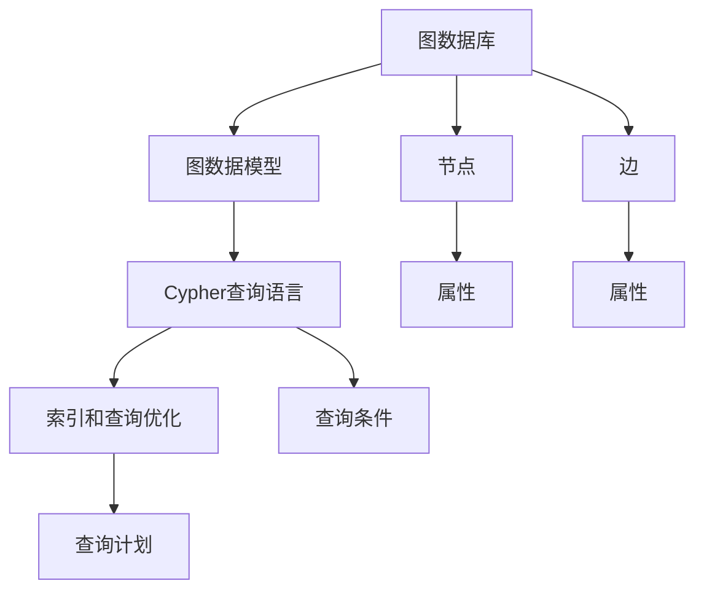

                 

# Neo4j原理与代码实例讲解

## 1. 背景介绍

Neo4j是一款领先的图数据库，专注于高性能的图处理和分析。近年来，图数据库在社交网络分析、推荐系统、知识图谱构建等领域的应用越来越广泛。本文将从Neo4j的核心概念入手，深入探讨其原理与代码实现，并通过示例代码和详细的讲解，帮助读者全面掌握Neo4j的使用方法。

## 2. 核心概念与联系

### 2.1 核心概念概述

Neo4j的核心概念包括图数据库、图数据模型、Cypher查询语言、索引和查询优化等。这些概念共同构成了Neo4j的技术基础，帮助用户高效地存储、管理和分析图结构数据。

- **图数据库**：存储由节点和边构成的图结构数据。节点表示实体，边表示实体之间的关系。
- **图数据模型**：Neo4j使用Cypher语言定义节点和边属性、约束和关系类型。每个节点和边都有一个唯一的标识符（ID）。
- **Cypher查询语言**：一种基于图的数据查询语言，用于描述图结构和查询条件，支持链式查询、聚合函数和复杂表达式。
- **索引和查询优化**：Neo4j提供多种索引技术，包括节点、关系和属性索引，以及自动查询优化器，加速复杂查询的执行。

### 2.2 核心概念之间的关系

Neo4j的核心概念之间存在紧密的联系，形成一个完整的系统。图数据库是存储数据的基础，图数据模型定义数据的结构和属性，Cypher查询语言用于访问和管理数据，索引和查询优化则提升数据访问的效率。以下是一个Mermaid流程图，展示了这些核心概念之间的关系：



## 3. 核心算法原理 & 具体操作步骤

### 3.1 算法原理概述

Neo4j的核心算法原理主要包括图的表示和查询优化。Neo4j使用基于标签图的表示方法，每个节点和边都有标签，用于描述实体的类型和关系。查询优化则通过预编译查询计划和分布式计算等技术，提升查询性能。

### 3.2 算法步骤详解

Neo4j的核心算法流程如下：

1. **图创建和数据加载**：使用Cypher语言创建图结构和加载数据。
2. **索引建立**：根据查询需求，建立节点、关系和属性索引。
3. **查询优化**：Neo4j自动生成查询计划，优化查询性能。
4. **查询执行**：执行查询计划，获取查询结果。

### 3.3 算法优缺点

Neo4j算法的主要优点包括：

- **高效图处理**：Neo4j专门针对图结构数据进行了优化，支持高性能的图处理和分析。
- **灵活查询语言**：Cypher语言支持丰富的图查询和数据操作，易于理解和编写。
- **自动查询优化**：Neo4j提供自动查询优化器，减少查询开销，提高性能。

主要缺点包括：

- **复杂度较高**：相对于关系型数据库，Neo4j的学习和使用曲线较陡峭。
- **扩展性有限**：尽管Neo4j支持分布式部署，但在处理大规模数据时仍可能存在瓶颈。
- **资源占用高**：Neo4j需要大量内存来存储索引和查询计划，可能导致资源占用较高。

### 3.4 算法应用领域

Neo4j适用于多种应用场景，包括但不限于：

- **社交网络分析**：分析社交网络中的关系和结构，如好友推荐、群体发现等。
- **推荐系统**：基于用户行为和物品属性，构建推荐图模型，实现个性化推荐。
- **知识图谱构建**：构建和维护大规模知识图谱，支持实体关系抽取和知识推理。
- **城市交通分析**：分析交通网络中的交通流量和路径，优化交通管理。
- **生物信息学**：存储和分析生物分子网络，支持蛋白质相互作用和基因关系研究。

## 4. 数学模型和公式 & 详细讲解 & 举例说明

### 4.1 数学模型构建

Neo4j的核心数学模型包括图结构和图查询。以下是一个简单的示例图，用于说明图的表示方法：

```
(:User)-[:KNOWS]->(:Book)
(:User)-[:READS]->(:Book)
```

在这个示例图中，有3个节点类型和2种关系类型。节点类型User和Book表示用户和书籍，关系类型KNOWS和READS表示用户与书籍的关系。

### 4.2 公式推导过程

以最简单的图查询为例，公式推导过程如下：

1. **定义图结构**：

   ```cypher
   (n:User)-[:KNOWS]-(book:Book)
   ```

   这个查询表示所有知道书籍的用户和书籍的关系。

2. **执行查询**：

   ```cypher
   MATCH (n:User)-[:KNOWS]->(book:Book) RETURN n, book
   ```

   这个查询返回所有知道书籍的用户和书籍。

### 4.3 案例分析与讲解

假设有一个用户ID为"alice"，已知她知道3本书，分别为"BookA"、"BookB"和"BookC"。以下是查询示例：

```cypher
MATCH (u:User)-[:KNOWS]->(b:Book)
WHERE u.name = 'alice' RETURN b
```

这个查询返回所有"alice"知道的书，即"BookA"、"BookB"和"BookC"。

## 5. 项目实践：代码实例和详细解释说明

### 5.1 开发环境搭建

1. **安装Neo4j**：从Neo4j官网下载并安装最新版本的社区版或商业版。
2. **启动Neo4j**：启动Neo4j服务器，并连接到本地数据库。
3. **创建数据库和图结构**：使用Cypher语言创建数据库和图结构。

### 5.2 源代码详细实现

以下是一个简单的Neo4j代码示例，用于创建图结构和执行查询：

```cypher
// 创建数据库
CREATE DATABASE myDB;

// 创建节点和关系
CREATE (n:User {name:'alice'}),
(C:b:Book {title:'BookA'}),
(D:c:Book {title:'BookB'}),
(E:d:Book {title:'BookC'});

// 创建关系
MATCH (n:User {name:'alice'}),
(C:b:Book),
(D:c:Book),
(E:d:Book)
CREATE (n)-[:KNOWS]->(C),
(n)-[:KNOWS]->(D),
(n)-[:KNOWS]->(E);

// 查询已知书籍
MATCH (n:User)-[:KNOWS]->(b:Book) WHERE n.name = 'alice' RETURN b;
```

### 5.3 代码解读与分析

- **创建数据库和节点**：使用`CREATE DATABASE`语句创建数据库，使用`CREATE`语句创建节点。
- **创建关系**：使用`MATCH`语句匹配节点，使用`CREATE`语句创建关系。
- **查询已知书籍**：使用`MATCH`语句匹配节点和关系，使用`RETURN`语句返回结果。

### 5.4 运行结果展示

查询结果如下：

```
+--------+
|  title |
+--------+
| BookA  |
| BookB  |
| BookC  |
+--------+
```

## 6. 实际应用场景

### 6.1 社交网络分析

社交网络分析是Neo4j的经典应用场景之一。以下是一个示例查询，用于分析用户之间的关系网络：

```cypher
// 查询用户之间的互相关系
MATCH (u:User)-[:KNOWS]-(b:Book)-[:READS]->(v:User) RETURN u,v
```

这个查询返回所有用户和书籍的关系网络，以及每个用户之间通过书籍的关系。

### 6.2 推荐系统

推荐系统是Neo4j的另一个重要应用。以下是一个示例查询，用于推荐用户可能感兴趣的书：

```cypher
// 查询用户可能感兴趣的书
MATCH (u:User {name:'alice'})-[:KNOWS]-(books:Book)<-[:READS]-(v:User)
RETURN books
```

这个查询返回所有"alice"可能感兴趣的书，即所有"alice"知道并且"alice"的朋友读过的书。

### 6.3 知识图谱构建

知识图谱构建是Neo4j的一个重要应用领域。以下是一个示例查询，用于构建知识图谱：

```cypher
// 查询知识和关系
MATCH (n:Person)-[:HAS_LEFT]->(p:Party)<-[:HAS_OF]-(o:Organization)
RETURN n,p,o
```

这个查询返回所有参加过组织举办的活动的人和组织，以及活动名称。

## 7. 工具和资源推荐

### 7.1 学习资源推荐

- **官方文档**：Neo4j官方文档提供了全面的学习资源，包括安装指南、Cypher语言教程和查询示例。
- **在线课程**：Udemy、Coursera等平台上有许多Neo4j相关课程，可以帮助用户系统地学习Neo4j。
- **书籍**：《Neo4j图数据库实战》、《Neo4j图数据库原理与实践》等书籍，详细介绍了Neo4j的基本概念和应用案例。

### 7.2 开发工具推荐

- **Visual Studio Code**：支持Neo4j扩展，方便开发和调试Cypher查询。
- **DBeaver**：支持Neo4j连接，提供图形化界面和数据浏览功能。
- **Neo4j浏览器**：Neo4j官方提供的浏览器，支持查询执行和结果查看。

### 7.3 相关论文推荐

- **Neo4j: The Graph Database for Humans**：Neo4j公司发布的白皮书，详细介绍了Neo4j的设计理念和应用案例。
- **Cypher Query Language Reference**：Neo4j官方文档中的Cypher语言参考，提供完整的Cypher查询语法和示例。
- **Efficient and Expressive Graph Queries in Neo4j**：Neo4j公司发表的论文，介绍如何高效地编写和优化Cypher查询。

## 8. 总结：未来发展趋势与挑战

### 8.1 研究成果总结

Neo4j在图数据库领域取得了显著的成就，帮助用户高效地存储、管理和分析图结构数据。其主要研究成果包括：

- **高性能图处理**：Neo4j使用基于标签图的表示方法和自动查询优化器，提升了图处理性能。
- **灵活查询语言**：Cypher语言提供丰富的图查询和数据操作，易于理解和编写。
- **可扩展性**：Neo4j支持分布式部署，提升了系统的可扩展性。

### 8.2 未来发展趋势

未来，Neo4j将继续在以下几个方向发展：

- **分布式扩展**：支持更多的分布式架构和数据分区策略，提升系统的可扩展性和可用性。
- **图计算框架**：开发更强大的图计算框架，支持复杂的图算法和数据处理。
- **实时数据处理**：支持实时数据流处理和流计算，提升系统的实时性和响应速度。
- **混合数据存储**：支持混合数据存储，融合关系型和图数据库的优势。

### 8.3 面临的挑战

尽管Neo4j在图数据库领域取得了显著成就，但仍面临以下挑战：

- **复杂性问题**：相对于关系型数据库，Neo4j的学习和使用曲线较陡峭，需要更多的时间和精力进行掌握。
- **性能瓶颈**：在大规模数据下，Neo4j的性能可能面临瓶颈，需要进一步优化。
- **社区支持**：尽管社区活跃度较高，但商业版的支持和生态系统仍需进一步完善。

### 8.4 研究展望

未来，Neo4j将在以下几个方向进行研究：

- **多图融合**：支持多图数据的融合和联合查询，提升数据处理的灵活性。
- **知识图谱推理**：支持知识图谱的推理和查询，提升数据推理的能力。
- **图计算算法**：开发和优化图计算算法，支持更复杂的图操作。
- **大数据处理**：支持大数据处理和分布式计算，提升系统的处理能力。

## 9. 附录：常见问题与解答

### Q1: Neo4j如何与关系型数据库进行互操作？

A: Neo4j提供多种方式与关系型数据库进行互操作，包括JDBC接口和API接口。通过这些接口，可以将关系型数据库中的数据导入Neo4j，或者将Neo4j中的数据导出到关系型数据库中。

### Q2: Neo4j如何优化查询性能？

A: Neo4j提供多种查询优化方法，包括索引、查询计划和查询提示等。通过合理设置索引和查询计划，可以显著提升查询性能。此外，还可以使用Cypher查询提示，引导查询引擎优化查询计划。

### Q3: Neo4j如何处理大规模数据？

A: Neo4j支持分布式部署，通过数据分区和节点分配，可以处理大规模数据。此外，还可以使用内存存储和压缩技术，减少数据存储和查询的开销。

### Q4: Neo4j如何在实际应用中保障数据安全？

A: Neo4j提供多种安全机制，包括访问控制、加密和审计等。通过合理的权限设置和加密技术，可以保障数据的安全性。

---

作者：禅与计算机程序设计艺术 / Zen and the Art of Computer Programming

