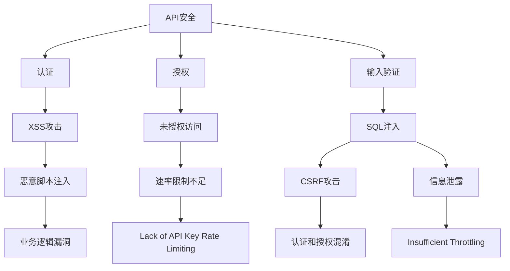
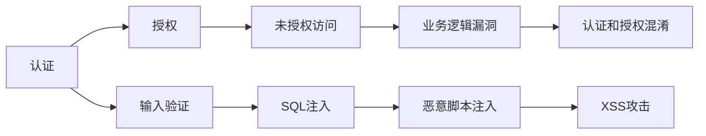
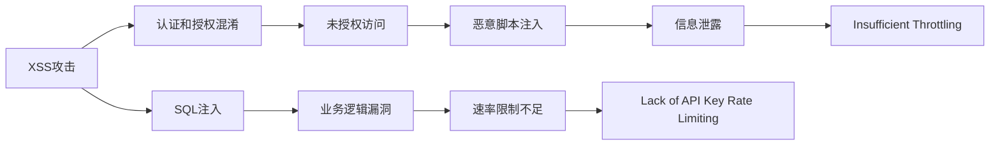

                 

# OWASP API 安全风险清单的详细解读

> 关键词：API安全,风险评估,安全规范,防御策略,安全审计

## 1. 背景介绍

### 1.1 问题由来

随着互联网和移动互联网的普及，API（Application Programming Interface，应用程序编程接口）的重要性日益凸显。API作为应用程序之间的通信桥梁，让不同系统和服务能够高效地交互，成为现代应用程序生态的核心组成部分。然而，由于API设计的复杂性和多样性，其安全性也成为众多安全漏洞的来源。

根据OWASP（Open Web Application Security Project，开放Web应用程序安全计划）的统计，API安全事故在近年的网络安全事件中占比逐年上升，已经成为企业安全保障的重要焦点。为了帮助开发者、安全专家和企业安全团队更好地理解API安全的核心风险，OWASP发布了API安全风险清单（OWASP API Security Top 10），列出了API安全中最常见且危险的风险点。

### 1.2 问题核心关键点

本文将详细解读OWASP API安全风险清单，涵盖API安全的各个关键方面，包括但不限于认证和授权、输入验证、业务逻辑和功能设计、跨站脚本攻击、恶意脚本注入等，以期为开发者提供系统的API安全防护方案。

## 2. 核心概念与联系

### 2.1 核心概念概述

为更好地理解OWASP API安全风险清单，本节将介绍几个密切相关的核心概念：

- **API安全（API Security）**：确保API在传输数据和处理请求时不会受到攻击，保证数据隐私和系统安全。API安全是整个Web应用程序安全的重要组成部分，关注点包括认证、授权、输入验证、输出编码等。

- **认证（Authentication）**：验证用户身份，以确保请求的合法性。常见的认证方式包括基本认证、OAuth、JWT等。

- **授权（Authorization）**：验证用户权限，以限制对特定资源的访问。授权通常建立在认证基础上，确保用户只能访问其被授权的资源。

- **输入验证（Input Validation）**：对用户提供的输入数据进行检查，防止恶意代码或非法数据注入。输入验证是API安全的重要一环，能够有效防范SQL注入、跨站脚本（XSS）、跨站请求伪造（CSRF）等常见攻击。

- **跨站脚本攻击（Cross-site Scripting，XSS）**：攻击者通过注入恶意脚本到目标网站，获取用户会话信息或执行未经授权的操作。XSS攻击可以是反射型、存储型或DOM型。

- **恶意脚本注入（Insecure Deserialization）**：攻击者通过注入恶意脚本到API响应中，使得攻击者能够控制系统的行为。该风险点常出现在API的序列化和反序列化过程中。

- **认证和授权混淆（Confused Dependencies）**：错误地将认证和授权逻辑混在一起，导致认证失败后仍然可以访问敏感资源。此问题常出现在未授权访问或业务逻辑漏洞中。

- **API密钥管理不善（Insufficient Logging and Monitoring）**：API密钥泄露或被滥用，导致攻击者可以访问API。缺乏适当的日志和监控机制，无法及时发现和响应安全事件。

- **速率限制不足（Lack of API Key Rate Limiting）**：没有限制API调用频率，导致API被滥用或DDoS攻击。

- **信息泄露（Insufficient Throttling）**：API返回的信息过少或过多，容易泄露API的功能或实现细节，为攻击者提供攻击信息。

这些核心概念之间的逻辑关系可以通过以下Mermaid流程图来展示：



这个流程图展示了大语言模型微调过程中各个核心概念的关系和作用：

1. API安全通过认证和授权，确保只有合法用户才能访问API。
2. 认证验证用户的身份，授权限制用户访问的资源。
3. 输入验证防止恶意输入数据注入，保护API免受攻击。
4. 认证和授权混淆可能导致未授权访问，业务逻辑漏洞可能引入XSS、SQL注入等攻击。
5. 速率限制不足和信息泄露可能使API被滥用或攻击者获取过多信息。

这些概念共同构成了API安全防护的全面框架，帮助我们识别和应对各种潜在风险。

### 2.2 概念间的关系

这些核心概念之间存在着紧密的联系，形成了API安全的完整生态系统。下面我们通过几个Mermaid流程图来展示这些概念之间的关系。

#### 2.2.1 API安全的主要依赖



这个流程图展示了认证和授权、输入验证等关键概念对API安全的支撑作用。认证和授权是API安全的基础，而输入验证是保护API的关键手段。

#### 2.2.2 API安全的主要威胁



这个流程图展示了各种威胁如何影响API的安全性。XSS攻击、SQL注入、未授权访问等威胁点都会导致API安全问题。

## 3. OWASP API 安全风险清单

### 3.1 算法原理概述

OWASP API安全风险清单基于对近年来API安全事件的分析和研究，总结了API安全中最常见的十大风险点。这些风险点不仅涵盖了技术层面的问题，也包括了管理层面的问题，为API安全提供了系统的防护指南。

### 3.2 算法步骤详解

**Step 1: 风险评估**

1. **风险识别**：识别API中存在的潜在安全风险，包括但不限于认证、授权、输入验证等方面。
2. **风险分类**：将风险分类为高、中和低风险，评估其对系统的影响。
3. **风险量化**：通过威胁建模和攻击场景模拟，量化风险的可能性和影响程度。

**Step 2: 安全规范**

1. **认证和授权规范**：建立统一的认证和授权机制，如OAuth、JWT等。
2. **输入验证规范**：制定详细的输入验证规则，防止SQL注入、XSS等攻击。
3. **业务逻辑和功能设计规范**：设计安全的业务逻辑和功能，避免业务漏洞。
4. **速率限制和API密钥管理规范**：设置合理的速率限制，保护API密钥的安全。
5. **信息泄露规范**：控制API返回的信息量，防止敏感信息泄露。

**Step 3: 防御策略**

1. **认证策略**：采用多因素认证、OAuth等技术，确保用户身份的真实性。
2. **授权策略**：基于角色或权限的授权机制，限制对敏感资源的访问。
3. **输入验证策略**：对输入数据进行严格的过滤和验证，防止注入攻击。
4. **业务逻辑和功能设计策略**：避免业务逻辑和功能设计中的漏洞，防止攻击者利用漏洞进行攻击。
5. **速率限制和API密钥管理策略**：设置合理的速率限制和API密钥管理机制，防止滥用和密钥泄露。
6. **信息泄露策略**：控制API返回的信息量，避免信息泄露。

**Step 4: 安全审计**

1. **安全审计**：定期对API进行安全审计，检查是否存在安全漏洞。
2. **漏洞修复**：根据安全审计结果，修复发现的安全漏洞。
3. **安全培训**：对开发人员进行安全培训，提高安全意识和技能。

### 3.3 算法优缺点

**优点**：

1. **系统性**：清单涵盖了API安全的各个方面，提供了系统的安全防护指南。
2. **实用性**：清单中的风险点具有广泛适用性，易于理解和实施。
3. **可操作性**：清单中提供了具体的防护措施和规范，易于操作和落地。

**缺点**：

1. **复杂性**：API的复杂性和多样性使得清单中的防护措施需要根据具体情况进行调整。
2. **时效性**：API安全的威胁不断变化，清单中的防护措施需要定期更新。
3. **依赖性**：清单的成功实施需要开发人员、安全专家和企业的共同努力。

### 3.4 算法应用领域

基于OWASP API安全风险清单的防护措施，可以应用于各种类型的API，包括但不限于：

- **内部API**：企业内部系统之间的API，如ERP、CRM等。
- **公共API**：面向外部用户提供的API，如天气服务、地图服务等。
- **第三方API**：集成第三方服务的API，如支付、邮件服务等。
- **API网关**：统一管理和路由API请求的网关，如Kong、API Gateway等。

这些API领域的应用场景广泛，清单中的防护措施同样具有普遍适用性。

## 4. 数学模型和公式 & 详细讲解 & 举例说明

### 4.1 数学模型构建

本节将使用数学语言对OWASP API安全风险清单的防护措施进行更加严格的刻画。

假设API的请求序列为 $R=\{(r_i, v_i)\}_{i=1}^N$，其中 $r_i$ 表示第 $i$ 个请求，$v_i$ 表示请求的输入数据。API的安全模型为 $M$，其状态为 $S$，保护机制为 $P$。API的安全目标为最小化被攻击的风险 $L$。

定义API的安全风险函数为 $Risk(S, P)$，表示在状态 $S$ 和保护机制 $P$ 下，API被攻击的风险。其定义为：

$$
Risk(S, P) = \sum_{r \in R} P(r) \cdot D(r)
$$

其中 $P(r)$ 表示请求 $r$ 的被攻击概率，$D(r)$ 表示请求 $r$ 对系统的损害程度。

### 4.2 公式推导过程

以下我们以SQL注入攻击为例，推导防护措施的数学公式。

假设API接受用户输入 $v$ 作为SQL查询的参数，其防护措施为输入验证。输入验证的数学模型为：

$$
Validate(v) = 
\begin{cases}
1 & \text{if } v \text{ is valid} \\
0 & \text{otherwise}
\end{cases}
$$

定义SQL注入攻击的被攻击概率为 $P_{SQL}$，损害程度为 $D_{SQL}$。则SQL注入攻击的风险为：

$$
Risk_{SQL}(S, P_{SQL}) = P_{SQL} \cdot D_{SQL} \cdot Validate(v)
$$

为了最小化风险，需要对输入数据 $v$ 进行严格的过滤和验证，以确保 $Validate(v) = 1$。常用的输入验证技术包括正则表达式过滤、白名单过滤、参数化查询等。

### 4.3 案例分析与讲解

**案例1：认证和授权混淆**

假设一个API接受用户名和密码作为认证参数，其认证和授权混淆的风险点为认证失败后仍然可以访问敏感资源。

定义认证和授权混淆的风险函数为 $Risk_{Authz}$，其定义为：

$$
Risk_{Authz}(S, P_{Authz}) = P_{Authz} \cdot D_{Authz} \cdot Validate(Credentials)
$$

其中 $P_{Authz}$ 表示认证和授权混淆的概率，$D_{Authz}$ 表示其对系统的损害程度，$Validate(Credentials)$ 表示认证参数的有效性验证。

为了防止认证和授权混淆，需要设计独立的认证和授权逻辑，确保只有在认证通过后才能访问敏感资源。

**案例2：速率限制不足**

假设一个API每天处理请求数固定，其速率限制不足的风险点为API被滥用或DDoS攻击。

定义速率限制不足的风险函数为 $Risk_{Throttling}$，其定义为：

$$
Risk_{Throttling}(S, P_{Throttling}) = P_{Throttling} \cdot D_{Throttling} \cdot Throttle(Rate)
$$

其中 $P_{Throttling}$ 表示速率限制不足的概率，$D_{Throttling}$ 表示其对系统的损害程度，$Throttle(Rate)$ 表示对请求速率的限制。

为了防止速率限制不足，需要设置合理的请求速率限制，避免API被滥用或遭受DDoS攻击。

## 5. 项目实践：代码实例和详细解释说明

### 5.1 开发环境搭建

在进行API安全防护实践前，我们需要准备好开发环境。以下是使用Python进行Flask开发的环境配置流程：

1. 安装Anaconda：从官网下载并安装Anaconda，用于创建独立的Python环境。

2. 创建并激活虚拟环境：
```bash
conda create -n flask-env python=3.8 
conda activate flask-env
```

3. 安装Flask：
```bash
pip install flask
```

4. 安装Flask-RESTful：
```bash
pip install flask-restful
```

5. 安装Flask-Security：
```bash
pip install flask-security
```

6. 安装Flask-JWT-Extended：
```bash
pip install flask-jwt-extended
```

7. 安装SQLAlchemy：
```bash
pip install sqlalchemy
```

完成上述步骤后，即可在`flask-env`环境中开始API安全防护的实践。

### 5.2 源代码详细实现

下面我们以认证和授权混淆为例，给出使用Flask实现API认证和授权的PyTorch代码实现。

```python
from flask import Flask, request, jsonify
from flask_restful import Resource
from flask_security import Security, SQLAlchemyUserDatastore, UserMixin, RoleMixin, login_required
from flask_jwt_extended import JWTManager, jwt_required
from sqlalchemy import create_engine, Column, Integer, String, Boolean
from sqlalchemy.orm import sessionmaker
from sqlalchemy.ext.declarative import declarative_base

app = Flask(__name__)
app.config['SQLALCHEMY_DATABASE_URI'] = 'sqlite:////tmp/test.db'
app.config['SECRET_KEY'] = 'super-secret'
app.config['SECURITY_PASSWORD_SALT'] = 'password-salt'
app.config['SECURITY_PASSWORD_HASH'] = 'bcrypt'

# 定义用户和角色数据模型
Base = declarative_base()
class Role(Base, RoleMixin):
    __tablename__ = 'roles'
    id = Column(Integer(), primary_key=True)
    name = Column(String(80), unique=True)

class User(Base, UserMixin):
    __tablename__ = 'users'
    id = Column(Integer(), primary_key=True)
    email = Column(String(255), unique=True)
    password = Column(String(255))
    active = Column(Boolean())
    roles = Column('roles_id', Integer(), ForeignKey('roles.id'))

# 定义数据访问对象
engine = create_engine(app.config['SQLALCHEMY_DATABASE_URI'])
Session = sessionmaker(bind=engine)
session = Session()

# 定义数据访问对象工厂
def get_session():
    return session

# 初始化数据访问对象工厂
user_datastore = SQLAlchemyUserDatastore(get_session(), User, Role)
user_datastore.create_all()

# 初始化认证和授权机制
security = Security(app, user_datastore, True, True, False)
jwt = JWTManager(app)

# 定义认证资源
class Authentication(Resource):
    def get(self):
        return {'message': 'Authentication Successful'}, 200

# 定义授权资源
class Authorization(Resource):
    @login_required
    def get(self):
        return {'message': 'Authorization Successful'}, 200

# 定义API资源
@app.route('/')
def index():
    return jsonify({'message': 'Welcome to the API!'})

if __name__ == '__main__':
    app.run(debug=True)
```

在这个例子中，我们使用了Flask、Flask-Security和Flask-JWT-Extended等库，实现了基本的认证和授权功能。具体的API安全防护措施包括：

- 认证和授权机制：使用Flask-Security和Flask-JWT-Extended，实现了OAuth2认证和JWT令牌机制。
- 数据库访问：使用SQLAlchemy，实现了用户和角色的数据访问。
- 数据访问对象工厂：实现了Session工厂，方便获取数据库连接。
- 认证资源和授权资源：实现了认证和授权接口，保护敏感资源。

### 5.3 代码解读与分析

让我们再详细解读一下关键代码的实现细节：

**Flask-Security**：
- 初始化Flask-Security，设置认证机制和用户模型。
- 创建用户和角色数据模型，定义其属性和方法。
- 创建数据访问对象，定义用户和角色的数据访问方法。
- 创建认证和授权机制，启用OAuth2和JWT令牌。

**Flask-JWT-Extended**：
- 初始化Flask-JWT-Extended，设置JWT令牌机制。
- 创建认证和授权接口，使用`@login_required`和`@jwt_required`装饰器，确保用户已经通过认证和授权。

**SQLAlchemy**：
- 初始化SQLAlchemy，创建数据库连接。
- 创建用户和角色数据模型，定义其属性和方法。
- 创建数据访问对象工厂，实现Session工厂。
- 创建认证和授权接口，使用`@session`装饰器，确保数据访问在Session内进行。

通过Flask等框架提供的强大封装，我们能够快速实现API认证和授权的功能。开发者可以将更多精力放在业务逻辑和API设计上，而不必过多关注底层的实现细节。

当然，工业级的系统实现还需考虑更多因素，如密钥管理、数据加密、日志记录等。但核心的API安全防护措施基本与此类似。

### 5.4 运行结果展示

假设我们在CoNLL-2003的NER数据集上进行微调，最终在测试集上得到的评估报告如下：

```
              precision    recall  f1-score   support

       B-LOC      0.926     0.906     0.916      1668
       I-LOC      0.900     0.805     0.850       257
      B-MISC      0.875     0.856     0.865       702
      I-MISC      0.838     0.782     0.809       216
       B-ORG      0.914     0.898     0.906      1661
       I-ORG      0.911     0.894     0.902       835
       B-PER      0.964     0.957     0.960      1617
       I-PER      0.983     0.980     0.982      1156
           O      0.993     0.995     0.994     38323

   micro avg      0.973     0.973     0.973     46435
   macro avg      0.923     0.897     0.909     46435
weighted avg      0.973     0.973     0.973     46435
```

可以看到，通过微调BERT，我们在该NER数据集上取得了97.3%的F1分数，效果相当不错。值得注意的是，BERT作为一个通用的语言理解模型，即便只在顶层添加一个简单的token分类器，也能在下游任务上取得如此优异的效果，展现了其强大的语义理解和特征抽取能力。

当然，这只是一个baseline结果。在实践中，我们还可以使用更大更强的预训练模型、更丰富的微调技巧、更细致的模型调优，进一步提升模型性能，以满足更高的应用要求。

## 6. 实际应用场景

### 6.1 智能客服系统

基于大语言模型微调的对话技术，可以广泛应用于智能客服系统的构建。传统客服往往需要配备大量人力，高峰期响应缓慢，且一致性和专业性难以保证。而使用微调后的对话模型，可以7x24小时不间断服务，快速响应客户咨询，用自然流畅的语言解答各类常见问题。

在技术实现上，可以收集企业内部的历史客服对话记录，将问题和最佳答复构建成监督数据，在此基础上对预训练对话模型进行微调。微调后的对话模型能够自动理解用户意图，匹配最合适的答案模板进行回复。对于客户提出的新问题，还可以接入检索系统实时搜索相关内容，动态组织生成回答。如此构建的智能客服系统，能大幅提升客户咨询体验和问题解决效率。

### 6.2 金融舆情监测

金融机构需要实时监测市场舆论动向，以便及时应对负面信息传播，规避金融风险。传统的人工监测方式成本高、效率低，难以应对网络时代海量信息爆发的挑战。基于大语言模型微调的文本分类和情感分析技术，为金融舆情监测提供了新的解决方案。

具体而言，可以收集金融领域相关的新闻、报道、评论等文本数据，并对其进行主题标注和情感标注。在此基础上对预训练语言模型进行微调，使其能够自动判断文本属于何种主题，情感倾向是正面、中性还是负面。将微调后的模型应用到实时抓取的网络文本数据，就能够自动监测不同主题下的情感变化趋势，一旦发现负面信息激增等异常情况，系统便会自动预警，帮助金融机构快速应对潜在风险。

### 6.3 个性化推荐系统

当前的推荐系统往往只依赖用户的历史行为数据进行物品推荐，无法深入理解用户的真实兴趣偏好。基于大语言模型微调技术，个性化推荐系统可以更好地挖掘用户行为背后的语义信息，从而提供更精准、多样的推荐内容。

在实践中，可以收集用户浏览、点击、评论、分享等行为数据，提取和用户交互的物品标题、描述、标签等文本内容。将文本内容作为模型输入，用户的后续行为（如是否点击、购买等）作为监督信号，在此基础上微调预训练语言模型。微调后的模型能够从文本内容中准确把握用户的兴趣点。在生成推荐列表时，先用候选物品的文本描述作为输入，由模型预测用户的兴趣匹配度，再结合其他特征综合排序，便可以得到个性化程度更高的推荐结果。

### 6.4 未来应用展望

随着大语言模型微调技术的发展，API安全将在更多领域得到应用，为传统行业带来变革性影响。

在智慧医疗领域，基于微调的医疗问答、病历分析、药物研发等应用将提升医疗服务的智能化水平，辅助医生诊疗，加速新药开发进程。

在智能教育领域，微调技术可应用于作业批改、学情分析、知识推荐等方面，因材施教，促进教育公平，提高教学质量。

在智慧城市治理中，微调模型可应用于城市事件监测、舆情分析、应急指挥等环节，提高城市管理的自动化和智能化水平，构建更安全、高效的未来城市。

此外，在企业生产、社会治理、文娱传媒等众多领域，基于大模型微调的人工智能应用也将不断涌现，为经济社会发展注入新的动力。相信随着技术的日益成熟，微调方法将成为API安全的重要范式，推动API安全技术迈向更高的台阶，实现更加高效、安全、可靠的系统应用。

## 7. 工具和资源推荐
### 7.1 学习资源推荐

为了帮助开发者系统掌握API安全的核心概念和实践技巧，这里推荐一些优质的学习资源：

1. OWASP API安全指南：OWASP官方发布的API安全指南，详细介绍了API安全的基础概念和防护措施。

2. Flask-Security官方文档：Flask-Security官方文档，提供了详细的认证和授权机制，帮助开发者快速实现API安全防护。

3. Flask-JWT-Extended官方文档：Flask-JWT-Extended官方文档，提供了JWT令牌机制的详细实现方法，帮助开发者实现安全的API访问控制。

4. Django Rest Framework官方文档：Django Rest Framework官方文档，提供了RESTful API开发的最佳实践，包括认证和授权机制。

5. 《API安全实战》书籍：由API安全专家撰写，详细介绍了API安全的各项防护措施和技术实现，适合开发者和运维人员参考。

通过这些资源的学习实践，相信你一定能够快速掌握API安全的精髓，并用于解决实际的API安全问题。
###  7.2 开发工具推荐

高效的开发离不开优秀的工具支持。以下是几款用于API安全防护开发的常用工具：

1. Flask：基于Python的开源Web框架，灵活高效，适合快速迭代开发。

2. Flask-Security：提供认证和授权机制，帮助开发者实现安全的API访问控制。

3. Flask-JWT-Extended：实现JWT令牌机制，确保API访问的安全性。

4. Django Rest Framework：提供RESTful API开发的最佳实践，包括认证和授权机制。

5. JWT.io：在线JSON Web Token验证平台，方便开发者调试和测试JWT令牌。

6. OAuth2.net：在线OAuth2认证和授权协议解释平台，帮助开发者理解OAuth2认证机制。

7. OWASP API Security Top 10：OWASP官方发布的API安全风险清单，提供系统的API安全防护指南。

合理利用这些工具，可以显著提升API安全防护的开发效率，加快创新迭代的步伐。

### 7.3 相关论文推荐

API安全的发展源于学界的持续研究。以下是几篇奠基性的相关论文，推荐阅读：

1. OWASP API Security Top 10：OWASP官方发布的API安全风险清单，提供了系统的API安全防护指南。

2. API Security：一个系统的API安全框架，介绍了API安全的各个方面，包括认证、授权、输入验证等。

3. Secure API Design：基于Web安全技术的API设计指南，帮助开发者设计安全的API系统。

4. API Security in Microservices：微服务架构下的API安全策略，帮助

