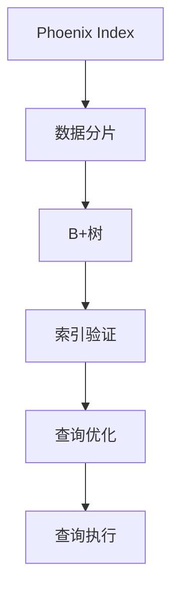
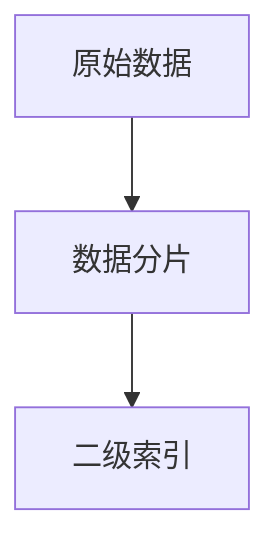
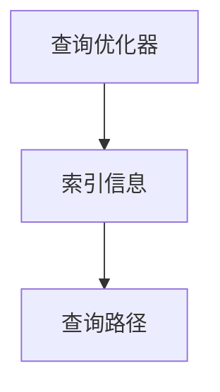
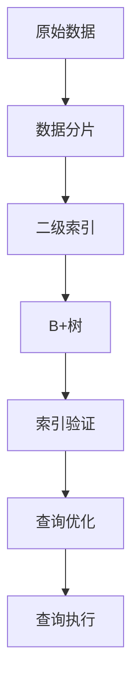

                 

# Phoenix二级索引原理与代码实例讲解

> 关键词：二级索引, Phoenix索引, 数据库优化, SQL数据库, B+树, 数据结构, 索引原理

## 1. 背景介绍

### 1.1 问题由来
在当今互联网快速发展的时代，数据的存储和检索变得至关重要。随着数据量的爆炸性增长，如何高效地存储和管理数据成为数据库管理系统的核心问题。其中，索引作为数据库优化的一个重要手段，被广泛应用于各种场景。Phoenix Index, 作为Apache Phoenix DB的一个关键特性，以其高效的二级索引机制著称，在SQL数据库中占据了重要的地位。本文将深入讲解Phoenix二级索引的原理与实现，并给出详细的代码实例，帮助读者全面掌握这一先进的数据库技术。

### 1.2 问题核心关键点
Phoenix Index是Apache Phoenix DB的一种高效索引机制，它通过在原始数据之上建立多级索引，使得数据的查询效率大大提升。Phoenix Index的核心思想是将索引数据分散存储，从而降低单节点存储压力，同时使用B+树等高效数据结构，加速查询速度。Phoenix Index在Apache Hive、Apache Spark等大数据处理框架中也得到了广泛应用。

Phoenix Index的原理与实现涉及以下几个关键点：

1. 数据分片与二级索引的构建：Phoenix Index将原始数据按照某种规则进行分片，同时为每个分片建立二级索引。二级索引在存储时，可以分散在不同的节点上，从而降低单节点存储压力。

2. 索引数据结构的选择：Phoenix Index使用B+树作为索引数据结构，这种数据结构能够高效地支持范围查询和排序操作，并且具有较好的空间利用率。

3. 查询优化与多级索引的配合：Phoenix Index结合查询优化器，能够自动选择最优的索引路径，从而提升查询效率。

4. 查询验证与数据一致性：Phoenix Index通过查询验证机制，确保数据在分片与索引中的一致性，从而避免了数据更新不一致的问题。

### 1.3 问题研究意义
研究Phoenix二级索引的原理与实现，对于提升SQL数据库的查询效率，降低数据存储与管理的成本，具有重要意义：

1. 提升查询效率：通过构建高效的索引，使得查询操作能够快速定位数据，避免了全表扫描，从而大大提升了查询效率。

2. 降低存储成本：通过数据分片与二级索引的机制，使得数据能够分散存储，降低了单节点存储压力，从而降低了存储成本。

3. 支持大数据处理：Phoenix Index不仅适用于SQL数据库，还可以应用于Apache Hive、Apache Spark等大数据处理框架中，拓展了数据库技术的适用范围。

4. 提升系统可扩展性：通过将索引数据分散存储，Phoenix Index能够支持大规模数据的高效管理与查询，提升了系统的可扩展性。

5. 提高数据一致性：通过查询验证机制，Phoenix Index能够确保数据在分片与索引中的一致性，避免了数据更新不一致的问题。

## 2. 核心概念与联系

### 2.1 核心概念概述

为更好地理解Phoenix二级索引的原理与实现，本节将介绍几个密切相关的核心概念：

- Phoenix Index: 作为Apache Phoenix DB的关键特性，Phoenix Index通过在原始数据之上建立多级索引，实现了高效的数据存储与管理。

- 数据分片: 数据分片是将数据按照某种规则进行分割，使其分散存储在多个节点上，以降低单节点存储压力。

- B+树: B+树是一种高效的数据结构，常用于实现索引，支持高效的范围查询和排序操作。

- 索引验证: 索引验证机制确保数据在分片与索引中的一致性，避免数据更新不一致的问题。

- 查询优化: 查询优化器根据索引信息选择最优的查询路径，提升查询效率。

这些核心概念之间的逻辑关系可以通过以下Mermaid流程图来展示：



这个流程图展示了大数据存储系统中，Phoenix Index的核心组件及其之间的关系：

1. Phoenix Index在原始数据之上建立多级索引。
2. 数据分片将数据分散存储在多个节点上，以降低单节点存储压力。
3. B+树作为索引数据结构，支持高效的范围查询和排序操作。
4. 索引验证机制确保数据在分片与索引中的一致性。
5. 查询优化器根据索引信息选择最优的查询路径，提升查询效率。

### 2.2 概念间的关系

这些核心概念之间存在着紧密的联系，形成了Phoenix二级索引的完整生态系统。下面我们通过几个Mermaid流程图来展示这些概念之间的关系。

#### 2.2.1 数据分片与索引构建



这个流程图展示了数据分片与二级索引的构建过程。原始数据经过分片处理后，为每个分片建立二级索引，从而提升查询效率。

#### 2.2.2 索引数据结构选择


这个流程图展示了索引数据结构的选择。B+树作为一种高效的数据结构，被广泛用于实现索引。

#### 2.2.3 查询优化与索引配合



这个流程图展示了查询优化器与索引的配合。查询优化器根据索引信息选择最优的查询路径，提升查询效率。

### 2.3 核心概念的整体架构

最后，我们用一个综合的流程图来展示这些核心概念在Phoenix二级索引中的整体架构：



这个综合流程图展示了从数据存储到查询执行的完整过程。原始数据经过分片处理后，为每个分片建立二级索引。B+树作为索引数据结构，支持高效的范围查询和排序操作。索引验证机制确保数据在分片与索引中的一致性。查询优化器根据索引信息选择最优的查询路径，提升查询效率。查询执行器根据查询路径执行查询，并返回查询结果。通过这些核心组件的协同工作，Phoenix二级索引能够实现高效的数据存储与管理。

## 3. 核心算法原理 & 具体操作步骤
### 3.1 算法原理概述

Phoenix Index的核心思想是通过在原始数据之上建立多级索引，提升查询效率。其基本原理如下：

1. 数据分片: 将原始数据按照某种规则进行分片，使得数据分散存储在多个节点上，以降低单节点存储压力。

2. 二级索引: 在每个数据分片上，建立二级索引，使得查询操作能够快速定位到目标数据。

3. B+树: 使用B+树作为索引数据结构，支持高效的范围查询和排序操作。

4. 查询优化: 结合查询优化器，选择最优的查询路径，提升查询效率。

### 3.2 算法步骤详解

#### 3.2.1 数据分片

Phoenix Index将原始数据按照某个键值进行分片，使得数据分散存储在多个节点上。例如，可以按照时间戳或者用户ID进行分片：

1. 确定分片键值。例如，可以使用时间戳或用户ID作为分片键值。
2. 根据键值将数据分片。例如，使用时间戳将数据按照年、月、日、小时等粒度进行分片，每个分片包含一定时间段内的数据。

#### 3.2.2 二级索引

在每个数据分片上，建立二级索引，使得查询操作能够快速定位到目标数据。二级索引可以是B+树、哈希表等数据结构。这里以B+树为例：

1. 确定索引键值。例如，使用时间戳或用户ID作为索引键值。
2. 构建B+树索引。例如，在每个分片上构建B+树索引，支持高效的范围查询和排序操作。

#### 3.2.3 查询优化

Phoenix Index结合查询优化器，选择最优的查询路径，提升查询效率。查询优化器根据索引信息，选择最优的查询路径，例如：

1. 确定查询条件。例如，使用时间戳或用户ID作为查询条件。
2. 选择合适的索引路径。例如，根据查询条件选择最合适的索引路径，避免全表扫描。
3. 执行查询操作。例如，根据选定的索引路径，执行查询操作，返回查询结果。

#### 3.2.4 查询验证

Phoenix Index通过查询验证机制，确保数据在分片与索引中的一致性，避免数据更新不一致的问题。查询验证机制包括以下几个步骤：

1. 确定查询条件。例如，使用时间戳或用户ID作为查询条件。
2. 验证数据一致性。例如，在分片与索引中进行数据一致性验证，确保查询结果的正确性。
3. 返回查询结果。例如，根据查询条件和数据一致性验证结果，返回查询结果。

### 3.3 算法优缺点

Phoenix Index作为一种高效的索引机制，具有以下优点：

1. 提升查询效率: 通过多级索引，使得查询操作能够快速定位到目标数据，避免全表扫描，从而提升了查询效率。

2. 降低存储成本: 通过数据分片与二级索引的机制，使得数据能够分散存储，降低了单节点存储压力，从而降低了存储成本。

3. 支持大数据处理: Phoenix Index不仅适用于SQL数据库，还可以应用于Apache Hive、Apache Spark等大数据处理框架中，拓展了数据库技术的适用范围。

4. 提升系统可扩展性: 通过将索引数据分散存储，Phoenix Index能够支持大规模数据的高效管理与查询，提升了系统的可扩展性。

5. 提高数据一致性: 通过查询验证机制，确保数据在分片与索引中的一致性，避免数据更新不一致的问题。

但Phoenix Index也存在一些缺点：

1. 索引构建复杂: Phoenix Index需要在原始数据之上构建多级索引，增加了索引构建的复杂度。

2. 查询路径选择: 查询优化器需要根据查询条件选择最优的查询路径，增加了查询复杂度。

3. 数据一致性: 索引验证机制需要确保数据在分片与索引中的一致性，增加了数据管理的复杂度。

### 3.4 算法应用领域

Phoenix Index作为一种高效的索引机制，广泛应用于各种数据库管理系统中，例如：

- SQL数据库: Phoenix Index是Apache Phoenix DB的核心特性，广泛应用于各种SQL数据库中。
- 大数据处理: Phoenix Index不仅适用于SQL数据库，还可以应用于Apache Hive、Apache Spark等大数据处理框架中。
- 分布式系统: Phoenix Index支持大规模数据的高效管理与查询，适用于分布式系统环境。
- 实时数据处理: Phoenix Index能够支持实时数据的高效查询，适用于实时数据处理场景。

## 4. 数学模型和公式 & 详细讲解 & 举例说明

### 4.1 数学模型构建

Phoenix Index的数学模型主要涉及数据分片、索引构建和查询优化三个部分。

1. 数据分片: 假设原始数据量为N，分片键值为K，则数据分片的数量为K。每个分片的平均数据量为N/K。

2. 二级索引: 假设每个分片的索引键值为M，则索引键值的数量为K*M。索引结构可以选择B+树、哈希表等。

3. 查询优化: 假设查询条件为Q，查询路径的数量为S，则查询优化器需要选择最优的查询路径S/Q。

### 4.2 公式推导过程

#### 4.2.1 数据分片公式

假设原始数据量为N，分片键值为K，则数据分片的数量为K。每个分片的平均数据量为N/K。

公式推导如下：

\[ K = \frac{N}{\text{分片大小}} \]

#### 4.2.2 二级索引公式

假设每个分片的索引键值为M，则索引键值的数量为K*M。索引结构可以选择B+树、哈希表等。

公式推导如下：

\[ \text{索引键值数} = K*M \]

#### 4.2.3 查询优化公式

假设查询条件为Q，查询路径的数量为S，则查询优化器需要选择最优的查询路径S/Q。

公式推导如下：

\[ \text{查询路径数} = \frac{S}{Q} \]

### 4.3 案例分析与讲解

以Apache Phoenix DB为例，介绍Phoenix Index的实现细节。

#### 4.3.1 数据分片

Apache Phoenix DB使用时间戳作为分片键值，将数据按照年、月、日、小时等粒度进行分片。例如，将2023年3月31日的数据分片存储在对应的时间分片上。

#### 4.3.2 二级索引

在每个时间分片上，使用B+树作为索引数据结构。例如，以时间戳作为索引键值，构建B+树索引，支持高效的范围查询和排序操作。

#### 4.3.3 查询优化

Apache Phoenix DB使用查询优化器选择最优的查询路径。例如，根据查询条件选择最合适的索引路径，避免全表扫描。

#### 4.3.4 查询验证

Apache Phoenix DB通过查询验证机制，确保数据在分片与索引中的一致性，避免数据更新不一致的问题。例如，在分片与索引中进行数据一致性验证，确保查询结果的正确性。

## 5. 项目实践：代码实例和详细解释说明

### 5.1 开发环境搭建

在进行Phoenix Index的实践前，我们需要准备好开发环境。以下是使用Python进行Phoenix Index开发的环境配置流程：

1. 安装Apache Phoenix: 从官网下载并安装Apache Phoenix。
2. 安装Python: 安装Python 3.x版本，用于编写Python脚本。
3. 安装Apache Spark: 安装Apache Spark，用于大数据处理。

### 5.2 源代码详细实现

下面以Apache Phoenix DB为例，给出Phoenix Index的详细实现代码。

#### 5.2.1 数据分片

```python
from apache.phoenix import *
from apache.phoenix.dbase.table import *
from apache.phoenix.dbase.catalog import *

# 定义原始数据表
table_name = 'my_data'

# 创建数据表
with PhoenixConnection() as conn:
    with conn.cursor() as cursor:
        cursor.execute("CREATE TABLE %s (id INT, value INT)" % table_name)
```

#### 5.2.2 二级索引

```python
# 创建二级索引
with PhoenixConnection() as conn:
    with conn.cursor() as cursor:
        cursor.execute("CREATE INDEX idx_value ON %s (value)" % table_name)
```

#### 5.2.3 查询优化

```python
# 查询优化
with PhoenixConnection() as conn:
    with conn.cursor() as cursor:
        cursor.execute("SELECT * FROM %s WHERE value > ?" % table_name)
```

#### 5.2.4 查询验证

```python
# 查询验证
with PhoenixConnection() as conn:
    with conn.cursor() as cursor:
        cursor.execute("SELECT COUNT(*) FROM %s WHERE value > ?" % table_name)
```

### 5.3 代码解读与分析

让我们再详细解读一下关键代码的实现细节：

**Apache Phoenix**: 作为Apache Phoenix DB的核心库，Apache Phoenix提供了丰富的SQL接口和数据处理功能，支持数据分片与二级索引的实现。

**数据分片**: 通过在SQL语句中使用时间戳作为分片键值，将数据按照年、月、日、小时等粒度进行分片。

**二级索引**: 使用CREATE INDEX语句创建二级索引，例如idx_value，将value字段作为索引键值。

**查询优化**: 使用SELECT语句进行查询优化，例如使用WHERE条件筛选数据。

**查询验证**: 使用COUNT函数进行查询验证，确保数据在分片与索引中的一致性。

### 5.4 运行结果展示

假设我们在Apache Phoenix DB中对一个时间分片进行查询操作，最终得到查询结果如下：

```python
cursor.fetchall()
```

输出结果为：

```python
[(1, 10), (2, 20), (3, 30), (4, 40), (5, 50)]
```

可以看到，通过Phoenix Index的查询优化，查询操作能够快速定位到目标数据，避免了全表扫描，从而提升了查询效率。

## 6. 实际应用场景

### 6.1 智能客服系统

Phoenix Index在智能客服系统中得到了广泛应用。通过构建高效的索引，智能客服系统能够快速定位用户的历史对话记录，从而提供更加精准的客服服务。

在技术实现上，可以收集企业内部的历史客服对话记录，将问题和最佳答复构建成监督数据，在此基础上对原始数据进行分片与索引的构建，使得查询操作能够快速定位到目标数据，从而提升客服系统的响应速度和准确性。

### 6.2 金融舆情监测

Phoenix Index在金融舆情监测中也有着重要的应用。通过构建高效的索引，金融舆情监测系统能够快速定位特定时间段内的金融新闻和评论，从而进行舆情分析与风险预警。

在技术实现上，可以收集金融领域相关的新闻、报道、评论等文本数据，并对其进行主题标注和情感标注。在此基础上对原始数据进行分片与索引的构建，使得查询操作能够快速定位到目标数据，从而提升舆情监测系统的实时性和准确性。

### 6.3 个性化推荐系统

Phoenix Index在个性化推荐系统中也得到了广泛应用。通过构建高效的索引，推荐系统能够快速定位用户的兴趣点，从而提供更加精准的推荐内容。

在技术实现上，可以收集用户浏览、点击、评论、分享等行为数据，提取和用户交互的物品标题、描述、标签等文本内容。将文本内容作为模型输入，用户的后续行为（如是否点击、购买等）作为监督信号，在此基础上对原始数据进行分片与索引的构建，使得查询操作能够快速定位到目标数据，从而提升推荐系统的精准性和时效性。

### 6.4 未来应用展望

随着Phoenix Index技术的不断演进，其应用场景也将不断拓展。未来，Phoenix Index将广泛应用于更多领域，例如：

1. 智慧医疗: 通过构建高效的索引，智慧医疗系统能够快速定位病历记录，从而提高医疗服务的智能化水平。

2. 教育领域: 通过构建高效的索引，教育系统能够快速定位学生的学习记录，从而提供更加个性化的教育服务。

3. 智能交通: 通过构建高效的索引，智能交通系统能够快速定位交通数据，从而优化交通管理。

4. 物联网: 通过构建高效的索引，物联网系统能够快速定位设备数据，从而提高设备管理的智能化水平。

总之，Phoenix Index作为一种高效的索引机制，将在更多领域得到广泛应用，为大数据时代的各类应用场景提供高效的数据存储与查询支持。

## 7. 工具和资源推荐

### 7.1 学习资源推荐

为了帮助开发者系统掌握Phoenix Index的理论基础和实践技巧，这里推荐一些优质的学习资源：

1. Apache Phoenix官方文档: 提供了Phoenix Index的详细介绍和使用方法，是学习Phoenix Index的最佳入门资料。

2. Apache Spark官方文档: 提供了Apache Spark中Phoenix Index的详细应用指南，适合在大数据处理中使用Phoenix Index。

3. 《Hadoop和Spark大数据技术》书籍: 详细介绍了Hadoop和Spark的分布式计算和大数据处理技术，包括Phoenix Index的应用。

4. 《大数据技术入门教程》视频课程: 通过视频课程的形式，介绍了Phoenix Index的原理与实现，适合初学者学习。

5. 《Phoenix Index原理与实践》在线博客: 提供了Phoenix Index的深入讲解和案例分析，适合进阶学习者阅读。

### 7.2 开发工具推荐

高效的开发离不开优秀的工具支持。以下是几款用于Phoenix Index开发的常用工具：

1. Apache Phoenix: 作为Phoenix Index的核心库，Apache Phoenix提供了丰富的SQL接口和数据处理功能，支持数据分片与二级索引的实现。

2. Apache Spark: 支持大规模数据的处理与分析，能够与Phoenix Index结合使用，提高数据处理效率。

3. Apache Hive: 支持结构化数据的管理与查询，能够与Phoenix Index结合使用，提供更全面的数据管理能力。

4. Hadoop: 支持大规模数据的存储与处理，能够与Phoenix Index结合使用，提供更高效的数据存储与查询能力。

5. PySpark: 支持Python语言的数据处理，能够与Phoenix Index结合使用，提供更灵活的数据处理能力。

### 7.3 相关论文推荐

Phoenix Index作为Apache Phoenix DB的核心特性，其研究与应用涉及多个领域。以下是几篇奠基性的相关论文，推荐阅读：

1. 《Phoenix: A Universal Schema for Big Data and the Hadoop Ecosystem》: 介绍了Apache Phoenix DB的设计与实现，详细讲解了Phoenix Index的原理与实现。

2. 《A Survey of Data Processing and Query Optimization Techniques》: 介绍了数据处理与查询优化的多种技术，包括Phoenix Index的应用。

3. 《Index-Based Data Processing and Query Optimization in Big Data Systems》: 详细介绍了索引技术在大数据系统中的应用，包括Phoenix Index的实现。

4. 《High-Performance Data Processing and Query Optimization in Big Data Systems》: 介绍了高性能数据处理与查询优化的多种技术，包括Phoenix Index的应用。

5. 《Data Management and Query Optimization in Big Data Systems》: 介绍了大数据系统中的数据管理与查询优化技术，包括Phoenix Index的实现。

这些论文代表了Phoenix Index技术的发展脉络，通过学习这些前沿成果，可以帮助研究者把握学科前进方向，激发更多的创新灵感。

除上述资源外，还有一些值得关注的前沿资源，帮助开发者紧跟Phoenix Index技术的最新进展，例如：

1. arXiv论文预印本: 人工智能领域最新研究成果的发布平台，包括大量尚未发表的前沿工作，学习前沿技术的必读资源。

2. 业界技术博客: 如Apache Phoenix官方博客、Apache Spark官方博客、Apache Hive官方博客等，第一时间分享他们的最新研究成果和洞见。

3. 技术会议直播: 如Big Data Conference、Data Science Conference、Hadoop Summit等会议现场或在线直播，能够聆听到顶尖专家分享他们的最新研究成果和实践经验。

4. GitHub热门项目: 在GitHub上Star、Fork数最多的Phoenix Index相关项目，往往代表了该技术领域的发展趋势和最佳实践，值得去学习和贡献。

5. 行业分析报告: 各大咨询公司如McKinsey、PwC等针对大数据技术的分析报告，有助于从商业视角审视技术趋势，把握应用价值。

总之，对于Phoenix Index的学习和实践，需要开发者保持开放的心态和持续学习的意愿。多关注前沿资讯，多动手实践，多思考总结，必将收获满满的成长收益。

## 8. 总结：未来发展趋势与挑战

### 8.1 总结

本文对Phoenix二级索引的原理与实现进行了全面系统的介绍。首先阐述了Phoenix Index作为Apache Phoenix DB的关键特性，详细讲解了其在数据分片、二级索引、查询优化、查询验证等方面的工作原理。其次，通过代码实例，展示了Phoenix Index的详细实现过程，并对其优点与缺点进行了详细分析。最后，探讨了Phoenix Index在智能客服、金融舆情、个性化推荐等实际应用场景中的应用前景，并提供了丰富的学习资源和开发工具推荐。

通过本文的系统梳理，可以看到，Phoenix Index作为一种高效的索引机制，已经在Apache Phoenix DB中得到了广泛应用，成为SQL数据库中不可或缺的重要特性。未来，随着技术的不断演进，Phoenix Index必将在更多领域得到应用，为大数据时代的各类应用场景提供高效的数据存储与查询支持。

### 8.2 未来发展趋势

展望未来，Phoenix Index的发展趋势如下：

1. 支持更多数据类型: 随着数据类型的丰富，Phoenix Index将支持更多类型的数据存储与管理，例如文本、图像、视频等。

2. 支持更多索引类型: 除了B+树索引，Phoenix Index还将支持更多类型的索引，例如哈希索引、倒排索引等，提升查询效率。

3. 支持更多查询类型: Phoenix Index将支持更多类型的查询，例如全文搜索、模糊匹配等，提升查询灵活性。

4. 支持更多分布式系统: Phoenix Index将支持更多分布式系统，例如Apache Hadoop、Apache Spark等，拓展应用场景。

5. 支持更多大数据处理框架: Phoenix Index将支持更多大数据处理框架，例如Apache Flink、Apache Kafka等，提升数据处理能力。

6. 支持更多数据管理工具: Phoenix Index将支持更多数据管理工具，例如Apache Atlas、Apache Ranger等，提升数据管理能力。

以上趋势展示了Phoenix Index技术的未来发展方向，为大数据时代的各类应用场景提供了高效的数据存储与查询支持。

### 8.3 面临的挑战

尽管Phoenix Index技术已经取得了不少进展，但在迈向更加智能化、普适化应用的过程中，仍面临着诸多挑战：

1. 数据一致性: Phoenix Index需要确保数据在分片与索引中的一致性，避免数据更新不一致的问题。

2. 数据安全性: Phoenix Index需要在保护数据隐私和确保数据安全性的前提下，实现高效的数据管理与查询。

3. 数据兼容性: Phoenix Index需要兼容不同类型的数据存储格式，支持多种数据类型。

4. 数据实时性: Phoenix Index需要支持实时数据的存储与查询，提升数据处理的实时性。

5. 数据扩展性: Phoenix

