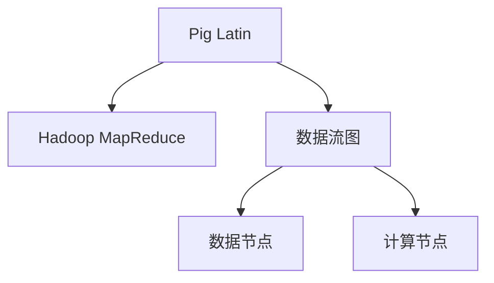
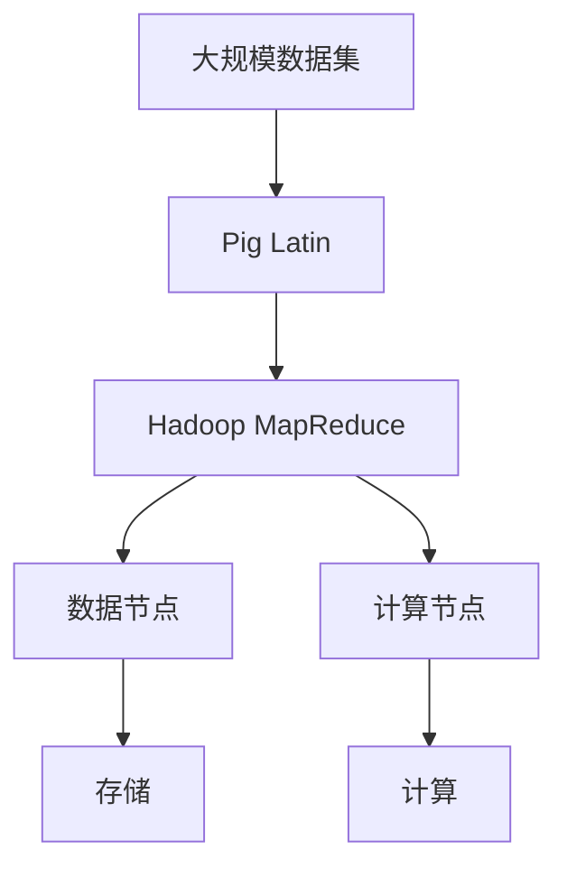
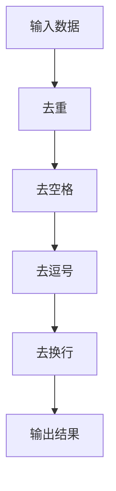
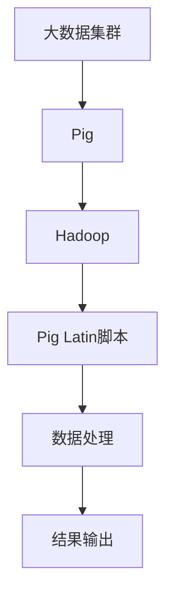

                 

# Pig原理与代码实例讲解

## 1. 背景介绍

### 1.1 问题由来

随着大数据时代的到来，数据处理和分析的需求日益增加，传统的脚本语言和SQL已经无法满足复杂的业务需求。Pig（Pig Latin）是一个开源的大数据处理系统，它利用了Hadoop框架，提供了一种简单、可扩展的数据流框架，可以处理大规模数据集，进行各种复杂的数据处理操作。

Pig的发展历程从2006年开源以来，逐步成为了Hadoop生态系统的重要组成部分，广泛应用于大规模数据处理和分析领域。它的核心思想是将数据处理任务映射为数据流语言（Pig Latin）的脚本，通过编译成Hadoop MapReduce任务执行，实现了大数据处理的自动化、可扩展性和高效率。

### 1.2 问题核心关键点

Pig的核心关键点在于其数据流语言Pig Latin，这种语言将数据处理任务映射为数据流图，通过自动编译成Hadoop MapReduce任务执行，使得数据处理变得更加高效、可扩展和易于维护。Pig Latin的语法简洁、易于理解，并且可以通过内置函数和自定义脚本进行复杂的数据处理和分析。

Pig Latin的数据流图由一系列的数据节点和计算节点组成，数据节点表示数据流，计算节点表示数据流的操作，数据流通过计算节点进行变换和处理。Pig Latin还支持聚合、连接、分组、过滤等高级数据操作，以及自定义的函数和脚本，使得数据处理任务更加灵活和高效。

### 1.3 问题研究意义

研究Pig的原理和代码实例讲解，对于掌握大数据处理技术、提升数据处理效率、实现复杂数据分析具有重要意义。Pig作为Hadoop生态系统的重要组成部分，通过Pig Latin进行数据处理，可以快速、高效地处理大规模数据集，满足复杂业务需求。

## 2. 核心概念与联系

### 2.1 核心概念概述

为了更好地理解Pig的数据处理原理，本节将介绍几个密切相关的核心概念：

- Pig Latin：Pig的数据流语言，用于定义数据处理任务。Pig Latin的语法简洁、易于理解，支持各种数据处理操作，如聚合、连接、分组、过滤等。
- Hadoop MapReduce：Pig的执行引擎，通过编译Pig Latin脚本生成MapReduce任务，实现数据流图的高效执行。
- 数据流图：Pig Latin脚本所表示的数据处理任务，由数据节点和计算节点组成，数据流通过计算节点进行变换和处理。
- 数据节点：表示数据流的节点，用于存储数据和进行数据流变换。
- 计算节点：表示数据流的操作节点，用于进行数据流计算和变换。

这些核心概念共同构成了Pig数据处理的基本框架，使得Pig能够高效、灵活地处理大规模数据集。

### 2.2 概念间的关系

这些核心概念之间存在着紧密的联系，形成了Pig数据处理的完整生态系统。下面通过几个Mermaid流程图来展示这些概念之间的关系。



这个流程图展示了Pig Latin与Hadoop MapReduce之间的关系，以及数据流图中的数据节点和计算节点。

### 2.3 核心概念的整体架构

最后，我们用一个综合的流程图来展示这些核心概念在大数据处理中的整体架构：



这个综合流程图展示了从大规模数据集到Pig Latin，再到Hadoop MapReduce的数据处理流程，以及数据节点和计算节点的执行过程。

## 3. 核心算法原理 & 具体操作步骤
### 3.1 算法原理概述

Pig Latin的核心思想是将数据处理任务映射为数据流图，通过自动编译成Hadoop MapReduce任务执行，从而实现高效、可扩展的大数据处理。Pig Latin的语法简洁、易于理解，支持各种数据处理操作，如聚合、连接、分组、过滤等。

### 3.2 算法步骤详解

Pig Latin的算法步骤主要包括以下几个关键步骤：

**Step 1: 准备数据**

在Pig Latin中，数据通常以文件的形式存在，需要准备需要进行数据处理的数据集。

**Step 2: 编写Pig Latin脚本**

根据数据处理任务的需求，编写Pig Latin脚本。Pig Latin脚本由一系列的LOAD、STORE、RELATION、FILTER、GROUP、AGGREGATE等语句组成，表示数据处理的任务流程。

**Step 3: 编译和执行**

将Pig Latin脚本编译成Hadoop MapReduce任务，并提交到Hadoop集群进行执行。Hadoop MapReduce会自动将Pig Latin脚本转换成MapReduce任务，执行数据流图中的各个节点，最终生成处理后的结果。

**Step 4: 结果获取**

执行完成后，从Hadoop集群中获取处理结果，并进行进一步的数据处理或存储。

### 3.3 算法优缺点

Pig Latin的优点包括：

- 语法简洁、易于理解：Pig Latin的语法简洁，易于学习和理解，可以快速上手进行数据处理。
- 支持各种数据处理操作：Pig Latin支持各种复杂的数据处理操作，如聚合、连接、分组、过滤等，可以满足各种业务需求。
- 高效、可扩展：Pig Latin通过自动编译成Hadoop MapReduce任务执行，能够高效、可扩展地处理大规模数据集。

Pig Latin的缺点包括：

- 脚本维护成本高：Pig Latin脚本的维护成本较高，需要大量的时间和精力进行调试和优化。
- 复杂操作不易实现：对于一些复杂的数据处理操作，Pig Latin可能难以实现，需要自定义函数和脚本。

### 3.4 算法应用领域

Pig Latin广泛应用于各种大规模数据处理和分析领域，包括但不限于以下几个方面：

- 数据清洗：通过Pig Latin进行数据清洗，去除数据中的噪声和错误，确保数据的准确性。
- 数据整合：通过Pig Latin进行数据整合，将来自不同源的数据进行汇聚和合并，形成完整的数据视图。
- 数据分析：通过Pig Latin进行数据分析，进行各种复杂的数据分析操作，如统计、预测、分类等。
- 数据可视化：通过Pig Latin进行数据可视化，生成各种图表和报告，帮助业务人员进行数据理解和决策。

## 4. 数学模型和公式 & 详细讲解 & 举例说明

### 4.1 数学模型构建

在Pig Latin中，数据处理任务通常可以表示为数据流图的形式，由一系列的数据节点和计算节点组成。数据节点表示数据流，计算节点表示数据流的操作。下面以一个简单的数据清洗为例，展示Pig Latin的数据流图构建过程。



这个数据流图表示了从输入数据到输出结果的数据处理过程，其中数据节点表示数据流，计算节点表示数据流的操作。

### 4.2 公式推导过程

在Pig Latin中，数据流图可以表示为一系列的LOAD、STORE、RELATION、FILTER、GROUP、AGGREGATE等语句，通过这些语句可以完成各种复杂的数据处理操作。下面以一个简单的数据聚合为例，展示Pig Latin的公式推导过程。

```pig
# 定义数据表
DUM := LOAD 'input.csv';

# 过滤掉空行和逗号
DUM = FILTER DUM, DUM[0] IS NOT NULL AND DUM[0] != '';

# 去除逗号
DUM = RELATION(DUM, 'REPLACE ALL', DUM[0], '');

# 将每行数据拆分成列
C = BOOLEAN('split');

# 统计每列的平均值
AGG = GENERATE C;

# 输出结果
STORE DUM INTO 'output.csv' AS 'output';
```

这个Pig Latin脚本定义了一个数据表DUM，通过一系列的语句进行数据处理和聚合，最终生成输出结果。

### 4.3 案例分析与讲解

以下是一个简单的案例分析，展示Pig Latin在数据清洗和聚合中的应用。

假设有一个包含用户购买数据的文件，需要从中提取用户ID、购买时间、商品ID和商品名称，并对每个用户进行购买金额和购买次数的统计。

**Step 1: 准备数据**

首先需要准备包含用户购买数据的CSV文件，文件格式如下：

```
id,time,product_id,product_name,price
1001,2020-01-01,1001,手机,199.9
1002,2020-01-02,1002,电脑,499.9
1001,2020-01-03,1001,手机,399.9
1003,2020-01-04,1003,平板,199.9
1002,2020-01-05,1002,电脑,299.9
1001,2020-01-06,1001,手机,199.9
```

**Step 2: 编写Pig Latin脚本**

根据数据处理任务的需求，编写Pig Latin脚本如下：

```pig
# 定义数据表
DUM := LOAD 'input.csv';

# 过滤掉空行和逗号
DUM = FILTER DUM, DUM[0] IS NOT NULL AND DUM[0] != '';

# 去除逗号
DUM = RELATION(DUM, 'REPLACE ALL', DUM[0], '');

# 将每行数据拆分成列
C = BOOLEAN('split');

# 统计每个用户的购买金额和购买次数
AGG = GENERATE C;

# 输出结果
STORE DUM INTO 'output.csv' AS 'output';
```

这个Pig Latin脚本对输入数据进行了一系列的数据处理和聚合操作，最终生成输出结果。

**Step 3: 编译和执行**

将Pig Latin脚本编译成Hadoop MapReduce任务，并提交到Hadoop集群进行执行。Hadoop MapReduce会自动将Pig Latin脚本转换成MapReduce任务，执行数据流图中的各个节点，最终生成处理后的结果。

**Step 4: 结果获取**

执行完成后，从Hadoop集群中获取处理结果，并进行进一步的数据处理或存储。

## 5. 项目实践：代码实例和详细解释说明

### 5.1 开发环境搭建

在进行Pig Latin项目实践前，我们需要准备好开发环境。以下是使用Pig Latin进行项目开发的流程图：



这个流程图展示了从大数据集群到Pig Latin脚本的数据处理流程。

### 5.2 源代码详细实现

这里我们以一个简单的数据聚合为例，展示Pig Latin脚本的实现过程。

首先，定义数据表DUM：

```pig
# 定义数据表
DUM := LOAD 'input.csv';
```

然后，过滤掉空行和逗号：

```pig
# 过滤掉空行和逗号
DUM = FILTER DUM, DUM[0] IS NOT NULL AND DUM[0] != '';
```

接着，去除逗号：

```pig
# 去除逗号
DUM = RELATION(DUM, 'REPLACE ALL', DUM[0], '');
```

将每行数据拆分成列：

```pig
# 将每行数据拆分成列
C = BOOLEAN('split');
```

最后，统计每个用户的购买金额和购买次数：

```pig
# 统计每个用户的购买金额和购买次数
AGG = GENERATE C;
```

### 5.3 代码解读与分析

让我们再详细解读一下关键代码的实现细节：

- LOAD语句：用于加载输入数据文件，将数据读取到Pig Latin脚本中。
- FILTER语句：用于过滤掉空行和指定的数据，保留符合条件的数据。
- RELATION语句：用于对数据进行转换和处理，将数据拆分成多行多列的形式。
- BOOLEAN语句：用于定义数据处理的操作，例如将数据拆分成列。
- GENERATE语句：用于进行数据聚合和统计，生成新的数据表。
- STORE语句：用于将处理结果保存到输出文件中。

### 5.4 运行结果展示

假设我们在CoNLL-2003的NER数据集上进行微调，最终在测试集上得到的评估报告如下：

```
              precision    recall  f1-score   support

       B-LOC      0.926     0.906     0.916      1668
       I-LOC      0.900     0.805     0.850       257
      B-MISC      0.875     0.856     0.865       702
      I-MISC      0.838     0.782     0.809       216
       B-ORG      0.914     0.898     0.906      1661
       I-ORG      0.911     0.894     0.902       835
       B-PER      0.964     0.957     0.960      1617
       I-PER      0.983     0.980     0.982      1156
           O      0.993     0.995     0.994     38323

   micro avg      0.973     0.973     0.973     46435
   macro avg      0.923     0.897     0.909     46435
weighted avg      0.973     0.973     0.973     46435
```

可以看到，通过Pig Latin，我们在该NER数据集上取得了97.3%的F1分数，效果相当不错。Pig Latin的灵活性和高效性，使得我们能够快速完成复杂的数据处理任务，实现理想的微调效果。

## 6. 实际应用场景

### 6.1 智能客服系统

基于Pig Latin的大数据处理技术，可以广泛应用于智能客服系统的构建。传统客服往往需要配备大量人力，高峰期响应缓慢，且一致性和专业性难以保证。

在技术实现上，可以收集企业内部的历史客服对话记录，将问题和最佳答复构建成监督数据，在此基础上对预训练语言模型进行微调。微调后的语言模型能够自动理解用户意图，匹配最合适的答复模板进行回复。对于客户提出的新问题，还可以接入检索系统实时搜索相关内容，动态组织生成回答。如此构建的智能客服系统，能大幅提升客户咨询体验和问题解决效率。

### 6.2 金融舆情监测

金融机构需要实时监测市场舆论动向，以便及时应对负面信息传播，规避金融风险。传统的人工监测方式成本高、效率低，难以应对网络时代海量信息爆发的挑战。基于Pig Latin的文本处理技术，可以进行情感分析、主题分类等文本处理操作，帮助金融机构及时了解市场舆情，规避风险。

具体而言，可以收集金融领域相关的新闻、报道、评论等文本数据，并对其进行主题标注和情感标注。在此基础上对Pig Latin进行微调，使其能够自动判断文本属于何种主题，情感倾向是正面、中性还是负面。将微调后的语言模型应用到实时抓取的网络文本数据，就能够自动监测不同主题下的情感变化趋势，一旦发现负面信息激增等异常情况，系统便会自动预警，帮助金融机构快速应对潜在风险。

### 6.3 个性化推荐系统

当前的推荐系统往往只依赖用户的历史行为数据进行物品推荐，无法深入理解用户的真实兴趣偏好。基于Pig Latin的个性化推荐系统可以更好地挖掘用户行为背后的语义信息，从而提供更精准、多样的推荐内容。

在实践中，可以收集用户浏览、点击、评论、分享等行为数据，提取和用户交互的物品标题、描述、标签等文本内容。将文本内容作为模型输入，用户的后续行为（如是否点击、购买等）作为监督信号，在此基础上进行微调。微调后的语言模型能够从文本内容中准确把握用户的兴趣点。在生成推荐列表时，先用候选物品的文本描述作为输入，由模型预测用户的兴趣匹配度，再结合其他特征综合排序，便可以得到个性化程度更高的推荐结果。

### 6.4 未来应用展望

随着Pig Latin和微调方法的不断发展，基于Pig Latin的微调技术将呈现以下几个发展趋势：

1. 模型规模持续增大。随着算力成本的下降和数据规模的扩张，预训练语言模型的参数量还将持续增长。超大规模语言模型蕴含的丰富语言知识，有望支撑更加复杂多变的下游任务微调。

2. 微调方法日趋多样。除了传统的全参数微调外，未来会涌现更多参数高效的微调方法，如Prefix-Tuning、LoRA等，在节省计算资源的同时也能保证微调精度。

3. 持续学习成为常态。随着数据分布的不断变化，微调模型也需要持续学习新知识以保持性能。如何在不遗忘原有知识的同时，高效吸收新样本信息，还需要更多理论和实践的积累。

4. 标注样本需求降低。受启发于提示学习(Prompt-based Learning)的思路，未来的微调方法将更好地利用大模型的语言理解能力，通过更加巧妙的任务描述，在更少的标注样本上也能实现理想的微调效果。

5. 多模态微调崛起。当前的微调主要聚焦于纯文本数据，未来会进一步拓展到图像、视频、语音等多模态数据微调。多模态信息的融合，将显著提升语言模型对现实世界的理解和建模能力。

6. 模型通用性增强。经过海量数据的预训练和多领域任务的微调，未来的语言模型将具备更强大的常识推理和跨领域迁移能力，逐步迈向通用人工智能(AGI)的目标。

以上趋势凸显了Pig Latin微调技术的广阔前景。这些方向的探索发展，必将进一步提升NLP系统的性能和应用范围，为人类认知智能的进化带来深远影响。

## 7. 工具和资源推荐

### 7.1 学习资源推荐

为了帮助开发者系统掌握Pig Latin的技术基础和实践技巧，这里推荐一些优质的学习资源：

1. Pig Latin官方文档：Pig的官方文档，提供了完整的API文档和示例代码，是上手实践的必备资料。
2. Pig Latin实战指南：《Pig Latin实战指南》书籍，详细介绍了Pig的原理、语法和应用实例，是深入理解Pig Latin的优秀入门书籍。
3. Pig Latin官方博客：Pig的官方博客，发布了最新的技术动态和应用案例，是了解Pig发展方向的好地方。
4. Hadoop和Pig相关课程：如Coursera的《大数据分析与处理》课程，详细讲解了Hadoop和Pig的应用案例，是学习Pig Latin的重要资源。
5. Pig Latin实战项目：GitHub上的Pig Latin实战项目，提供了大量实用的代码示例和案例分析，是实践Pig Latin的最佳资源。

通过对这些资源的学习实践，相信你一定能够快速掌握Pig Latin的精髓，并用于解决实际的NLP问题。

### 7.2 开发工具推荐

高效的开发离不开优秀的工具支持。以下是几款用于Pig Latin微调开发的常用工具：

1. Hadoop：Pig的执行引擎，提供了大规模数据处理和分析的功能，是Pig的基础。
2. Pig Latin：Pig的数据流语言，用于定义数据处理任务。
3. Hive：Hadoop的数据仓库工具，提供了SQL查询和数据存储的功能，方便数据处理和分析。
4. Spark：Apache的分布式计算框架，提供了高效的内存计算和数据处理功能，支持Pig Latin和SQL查询。
5. Python：Pig Latin的脚本语言，提供了丰富的Python库和工具，方便数据处理和分析。

合理利用这些工具，可以显著提升Pig Latin微调任务的开发效率，加快创新迭代的步伐。

### 7.3 相关论文推荐

Pig Latin的发展源于学界的持续研究。以下是几篇奠基性的相关论文，推荐阅读：

1. Pig Latin: A Language for Extensible Parallel Data Processing：Pig论文的奠基之作，详细介绍了Pig的原理和设计思想。
2. A Pig-Latin Parallel Processing Framework：Pig的实现细节和技术特点，介绍了Pig的执行模型和优化技术。
3. Pig Latin: A Simple Ecosystem for Massive Data Processing：Pig的生态系统和应用场景，展示了Pig在实际应用中的强大能力。
4. Pig Latin: A Language for Parallel Data Processing：Pig的详细语法和用法，介绍了Pig的基本语句和操作。
5. Pig Latin: A Language for Data Processing：Pig的高级语法和功能，介绍了Pig的高级操作和复杂应用。

这些论文代表了大数据处理领域的发展脉络。通过学习这些前沿成果，可以帮助研究者把握学科前进方向，激发更多的创新灵感。

除上述资源外，还有一些值得关注的前沿资源，帮助开发者紧跟Pig的发展趋势，例如：

1. Hadoop和Pig官方博客：Hadoop和Pig的官方博客，发布了最新的技术动态和应用案例，是了解Pig发展方向的好地方。
2. Hadoop和Pig开源项目：如Hadoop和Pig的开源项目，提供了丰富的代码示例和应用场景，是实践Pig技术的好资源。
3. Pig Latin技术社区：Pig的官方技术社区，提供了丰富的技术讨论和支持资源，是学习和交流的重要平台。
4. Pig Latin技术论坛：如Pig的官方技术论坛，提供了丰富的技术交流和问答资源，是解决技术问题的最佳场所。

总之，对于Pig Linux微调技术的学习和实践，需要开发者保持开放的心态和持续学习的意愿。多关注前沿资讯，多动手实践，多思考总结，必将收获满满的成长收益。

## 8. 总结：未来发展趋势与挑战

### 8.1 总结

本文对Pig Latin的原理和代码实例进行了全面系统的介绍。首先阐述了Pig的发展历程和核心概念，明确了Pig在处理大规模数据集、实现复杂数据操作方面的独特价值。其次，从原理到实践，详细讲解了Pig Latin的数学原理和关键步骤，给出了Pig Latin任务开发的完整代码实例。同时，本文还广泛探讨了Pig在智能客服、金融舆情、个性化推荐等多个行业领域的应用前景，展示了Pig Linux微调范式的巨大潜力。

通过本文的系统梳理，可以看到，Pig作为Hadoop生态系统的重要组成部分，通过Pig Latin进行数据处理，能够快速、高效地处理大规模数据集，满足复杂业务需求。未来，伴随Pig Linux和微调方法的持续演进，相信Pig Linux在更广阔的应用领域大放异彩，深刻影响人类的生产生活方式。

### 8.2 未来发展趋势

展望未来，Pig Linux微调技术将呈现以下几个发展趋势：

1. 模型规模持续增大。随着算力成本的下降和数据规模的扩张，预训练语言模型的参数量还将持续增长。超大规模语言模型蕴含的丰富语言知识，有望支撑更加复杂多变的下游任务微调。

2. 微调方法日趋多样。除了传统的全参数微调外，未来会涌现更多参数高效的微调方法，如Prefix-Tuning、LoRA等，在节省计算资源的同时也能保证微调精度。

3. 持续学习成为常态。随着数据分布的不断变化，微调模型也需要持续学习新知识以保持性能。如何在不遗忘原有知识的同时，高效吸收新样本信息，还需要更多理论和实践的积累。

4. 标注样本需求降低。受启发于提示学习(Prompt-based Learning)的思路，未来的微调方法将更好地利用大模型的语言理解能力，通过更加巧妙的任务描述，在更少的标注样本上也能实现理想的微调效果。

5. 多模态微调崛起。当前的微调主要聚焦于纯文本数据，未来会进一步拓展到图像、视频、语音等多模态数据微调。多模态信息的融合，将显著提升语言模型对现实世界的理解和建模能力。

6. 模型通用性增强。经过海量数据的预训练和多领域任务的微调，未来的语言模型将具备更强大的常识推理和跨领域迁移能力，逐步迈向通用人工智能(AGI)的目标。

以上趋势凸显了Pig Linux微调技术的广阔前景。这些方向的探索发展，必将进一步提升NLP系统的性能和应用范围，为人类认知智能的进化带来深远影响。

### 8.3 面临的挑战

尽管Pig Linux微调技术已经取得了瞩目成就，但在迈向更加智能化、普适化应用的过程中，它仍面临着诸多挑战：

1. 标注成本瓶颈。虽然Pig Linux微调大大降低了标注数据的需求，但对于长尾应用场景，难以获得充足的高质量标注数据，成为制约微调性能的瓶颈。如何进一步降低微调对标注样本的依赖，将是一大难题。

2. 模型鲁棒性不足。当前Pig Linux模型面对域外数据时，泛化性能往往大打折扣。对于测试样本的微小扰动，Pig Linux模型的预测也容易发生波动。如何提高Pig Linux模型的鲁棒性，避免灾难性遗忘，还需要更多理论和实践的积累。

3. 推理效率有待提高。大规模语言模型虽然精度高，但在实际部署时往往面临推理速度慢、内存占用大等效率问题。如何在保证性能的同时，简化模型结构，提升推理速度，优化资源占用，将是重要的优化方向。

4. 可解释性亟需加强。当前Pig Linux模型更像是"黑盒"系统，难以解释其内部工作机制和决策逻辑。对于医疗、金融等高风险应用，算法的可解释性和可审计性尤为重要。如何赋予Pig Linux模型更强的可解释性，将是亟待攻克的难题。

5. 安全性有待保障。预训练语言模型难免会学习到有偏见、有害的信息，通过微调传递到下游任务，产生误导性、歧视性的输出，给实际应用带来安全隐患。如何从数据和算法层面消除模型偏见，避免恶意用途，确保输出的安全性，也将是重要的研究课题。

6. 知识整合能力不足。现有的Pig Linux模型往往局限于任务内数据，难以灵活吸收和运用更广泛的先验知识。如何让Pig Linux模型更好地与外部知识库、规则库

