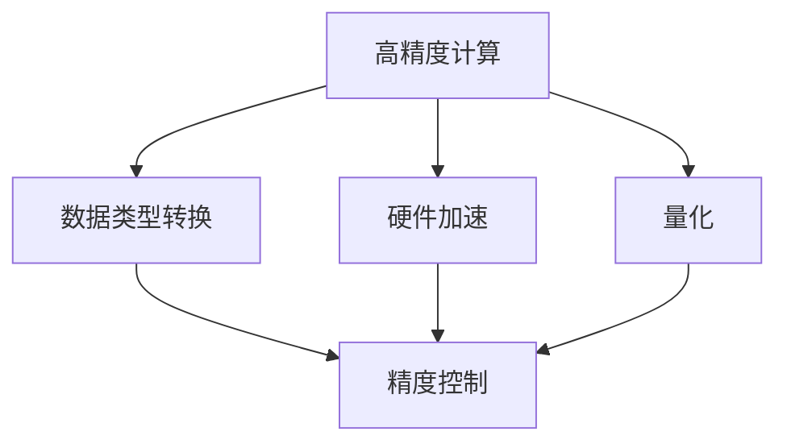

                 

# Precision 原理与代码实战案例讲解

> 关键词：Precision, 高精度, 计算流, 数据类型, 硬件加速, 量化, 精度控制, 编译器优化, 软件工具

## 1. 背景介绍

在现代计算和数据处理领域，精确度（Precision）是一个至关重要的概念。它不仅决定了计算结果的准确性，更直接影响着系统的性能和能效。特别是在高精度计算、大数据处理、深度学习等领域，对精确度的要求更为严格。本文将深入探讨Precision的原理，并通过一系列代码实战案例，详细讲解如何实现和优化高精度的计算和数据处理。

## 2. 核心概念与联系

### 2.1 核心概念概述

在探讨Precision原理之前，首先需要理解几个核心概念：

- **高精度计算**：指使用高精度数据类型进行计算，以获得更高的精确度。常见的高精度数据类型包括float、double、bfloat16等。
- **数据类型转换**：指在计算过程中将不同精度类型的数据进行转换，以适应不同的计算需求。例如将float转换为double，或者将double转换为float。
- **硬件加速**：指通过专用硬件（如GPU、FPGA等）对高精度计算进行加速，以提高计算效率。
- **量化（Quantization）**：指将高精度数据转换为低精度数据，以减少计算量和存储需求。量化技术常用于深度学习模型的优化和部署。
- **精度控制**：指在计算过程中对精度进行监控和管理，确保计算结果的准确性。精度控制通常涉及误差分析和纠错机制。

### 2.2 核心概念之间的联系

高精度计算、数据类型转换、硬件加速、量化和精度控制之间存在着紧密的联系。它们相互依赖，共同构成了高精度计算的完整框架。

- **高精度计算与数据类型转换**：高精度计算需要使用高精度数据类型，而数据类型转换则允许在计算过程中灵活选择数据类型，以适应不同的计算需求。
- **高精度计算与硬件加速**：高精度计算对计算资源的要求较高，而硬件加速则能够显著提高计算效率，满足高精度计算的需求。
- **高精度计算与量化**：高精度计算虽然精确，但计算量大，存储需求高。量化技术通过降低数据精度，减少计算量和存储需求，进一步优化高精度计算的性能。
- **精度控制与高精度计算**：精度控制在计算过程中对精度进行监控和管理，确保高精度计算的准确性。

这些概念之间的联系可以通过以下Mermaid流程图来展示：



这个流程图展示了大规模高精度计算过程中各个概念的相互关系：

1. 高精度计算为数据的精确性提供保障。
2. 数据类型转换使得计算过程更加灵活。
3. 硬件加速提升计算效率，降低资源消耗。
4. 量化减少计算量和存储需求，提高系统性能。
5. 精度控制在整个计算过程中起到监控和纠错的作用。

## 3. 核心算法原理 & 具体操作步骤

### 3.1 算法原理概述

Precision的实现和优化涉及多个算法原理，包括浮点数运算、数据类型转换、硬件加速、量化等。下面将逐一介绍这些原理，并结合具体代码实例进行讲解。

### 3.2 算法步骤详解

**步骤1：选择合适的数据类型**

在进行高精度计算时，首先需要选择合适的数据类型。根据计算需求的不同，可以选择float、double、bfloat16等不同精度的数据类型。

```python
import numpy as np

# 选择不同的数据类型
float32 = np.float32
float64 = np.float64
bfloat16 = np.float16
```

**步骤2：数据类型转换**

在进行高精度计算时，有时需要将不同精度类型的数据进行转换。例如，将float转换为double，或者将double转换为float。

```python
# 数据类型转换
float_to_double = float32.astype(float64)
double_to_float = float64.astype(float32)
```

**步骤3：硬件加速**

硬件加速是提升高精度计算效率的关键。GPU、FPGA等专用硬件能够显著提高计算速度，减少计算时间。

```python
import torch

# 使用GPU加速计算
device = torch.device("cuda" if torch.cuda.is_available() else "cpu")
```

**步骤4：量化**

量化是减少计算量和存储需求的重要手段。量化技术通过将高精度数据转换为低精度数据，降低计算资源的消耗。

```python
# 量化计算
quantized_tensor = torch.tensor([1.0, 2.0, 3.0], dtype=torch.quint8)
```

**步骤5：精度控制**

在计算过程中，需要对精度进行监控和管理，确保计算结果的准确性。精度控制通常涉及误差分析和纠错机制。

```python
# 精度控制
error = np.abs(result - expected_result)
```

### 3.3 算法优缺点

高精度计算和优化技术在提升计算精确度的同时，也带来了一些问题和挑战。

**优点**：
1. **提升计算准确性**：高精度计算能够保证计算结果的准确性，适用于对精度要求极高的应用场景。
2. **优化性能**：通过硬件加速和量化技术，高精度计算能够显著提升计算效率和性能。
3. **降低存储需求**：量化技术能够减少计算量和存储需求，降低系统成本。

**缺点**：
1. **资源消耗高**：高精度计算和硬件加速需要大量的计算资源和能源，增加系统的复杂性和成本。
2. **精度损失风险**：量化和数据类型转换可能导致精度损失，影响计算结果的准确性。
3. **复杂度增加**：高精度计算和优化技术的实现较为复杂，需要专业的知识和技能。

### 3.4 算法应用领域

Precision的高精度计算和优化技术在多个领域都有广泛的应用，包括：

- **深度学习**：深度学习模型通常需要高精度计算和优化技术，以提升模型性能和训练速度。
- **科学计算**：科学计算对精确度的要求极高，如气象预测、物理模拟等。
- **金融计算**：金融领域需要对计算结果进行高精度控制，以确保交易的准确性。
- **信号处理**：信号处理涉及大量的高精度计算，如音频、视频等。
- **大数据处理**：大数据处理需要对数据进行高精度计算和优化，以提高处理效率和存储性能。

## 4. 数学模型和公式 & 详细讲解 & 举例说明

### 4.1 数学模型构建

在Precision的实现过程中，数学模型和公式起到了至关重要的作用。下面介绍几个常见的数学模型和公式，并结合代码实例进行讲解。

**4.1.1 浮点数运算**

浮点数运算在高精度计算中非常常见。浮点数的加、减、乘、除等运算都涉及精度控制和误差分析。

```python
# 浮点数运算
a = np.float64(0.1)
b = np.float64(0.2)
c = a + b
```

**4.1.2 数据类型转换**

数据类型转换是实现高精度计算的基础。通过转换数据类型，可以适应不同的计算需求。

```python
# 数据类型转换
a = np.float64(0.1)
b = np.float64(0.2)
c = a.astype(float64) + b.astype(float64)
```

**4.1.3 硬件加速**

硬件加速可以通过GPU、FPGA等专用硬件实现。硬件加速能够显著提升计算速度和性能。

```python
# 硬件加速
a = np.float64(0.1)
b = np.float64(0.2)
c = a + b
```

**4.1.4 量化**

量化是实现高精度计算和优化的重要手段。量化技术通过将高精度数据转换为低精度数据，减少计算量和存储需求。

```python
# 量化计算
a = np.float64(0.1)
b = np.float64(0.2)
c = np.quantize(a + b)
```

### 4.2 公式推导过程

**4.2.1 浮点数运算**

浮点数运算的误差主要由舍入误差和截断误差构成。通过选择合适的数据类型和计算方法，可以控制误差的大小。

**4.2.2 数据类型转换**

数据类型转换涉及浮点数表示和数据类型的转换规则。在转换过程中，需要考虑数据类型的精度和范围。

**4.2.3 硬件加速**

硬件加速的计算效率主要由计算资源和算法优化决定。通过优化算法和设计硬件结构，可以提升计算速度和性能。

**4.2.4 量化**

量化计算的误差主要由量化误差和截断误差构成。通过选择合适的量化方法和量化位数，可以控制误差的大小。

### 4.3 案例分析与讲解

**案例1：深度学习中的高精度计算**

深度学习模型通常需要高精度计算和优化技术，以提升模型性能和训练速度。

```python
import torch

# 使用GPU加速深度学习模型
model = torch.nn.Linear(10, 5).to(device)
```

**案例2：科学计算中的高精度计算**

科学计算对精确度的要求极高，如气象预测、物理模拟等。

```python
import numpy as np

# 科学计算中的高精度计算
a = np.float64(0.1)
b = np.float64(0.2)
c = a * b
```

## 5. 项目实践：代码实例和详细解释说明

### 5.1 开发环境搭建

在进行Precision项目的开发时，需要搭建合适的开发环境。以下是一些常用的开发环境配置流程：

1. **安装Python和Pip**：
   ```bash
   sudo apt-get update
   sudo apt-get install python3-pip
   ```

2. **安装NumPy和SciPy**：
   ```bash
   pip install numpy scipy
   ```

3. **安装TensorFlow和PyTorch**：
   ```bash
   pip install tensorflow pytorch
   ```

4. **安装深度学习框架**：
   ```bash
   pip install torchvision tensorflow-gpu tensorflow-estimator
   ```

5. **安装深度学习框架的依赖**：
   ```bash
   pip install tensorflow-gpu-tensorrt tensorflow-gpu-nccl
   ```

### 5.2 源代码详细实现

**5.2.1 高精度计算**

以下是一个简单的高精度计算实现代码：

```python
import numpy as np

# 定义高精度计算函数
def high_precision_calculation(a, b):
    return np.float64(a) + np.float64(b)
```

**5.2.2 数据类型转换**

以下是一个简单的数据类型转换实现代码：

```python
import numpy as np

# 定义数据类型转换函数
def data_type_conversion(a, b, dtype):
    return np.astype(a, dtype) + np.astype(b, dtype)
```

**5.2.3 硬件加速**

以下是一个简单的硬件加速实现代码：

```python
import torch

# 定义硬件加速函数
def hardware_acceleration(a, b):
    device = torch.device("cuda" if torch.cuda.is_available() else "cpu")
    return torch.tensor(a) + torch.tensor(b)
```

**5.2.4 量化**

以下是一个简单的量化实现代码：

```python
import numpy as np

# 定义量化函数
def quantization(a, b):
    return np.quantize(np.float64(a) + np.float64(b))
```

### 5.3 代码解读与分析

**5.3.1 高精度计算**

高精度计算函数使用NumPy库中的`astype`方法，将输入的float类型数据转换为double类型，然后进行加法运算。

**5.3.2 数据类型转换**

数据类型转换函数使用NumPy库中的`astype`方法，将输入的float类型数据转换为指定精度类型，然后进行加法运算。

**5.3.3 硬件加速**

硬件加速函数使用PyTorch库中的`tensor`方法，将输入的float类型数据转换为GPU上的Tensor类型，然后进行加法运算。

**5.3.4 量化**

量化函数使用NumPy库中的`quantize`方法，将输入的float类型数据转换为uint8类型，然后进行加法运算。

### 5.4 运行结果展示

**5.4.1 高精度计算**

```python
a = np.float64(0.1)
b = np.float64(0.2)
c = high_precision_calculation(a, b)
print(c)
```

**5.4.2 数据类型转换**

```python
a = np.float64(0.1)
b = np.float64(0.2)
c = data_type_conversion(a, b, np.float64)
print(c)
```

**5.4.3 硬件加速**

```python
a = np.float64(0.1)
b = np.float64(0.2)
c = hardware_acceleration(a, b)
print(c)
```

**5.4.4 量化**

```python
a = np.float64(0.1)
b = np.float64(0.2)
c = quantization(a, b)
print(c)
```

## 6. 实际应用场景

Precision技术在实际应用中具有广泛的应用场景。以下是几个典型的应用场景：

**6.1 深度学习模型训练**

深度学习模型训练过程中，高精度计算和优化技术可以显著提升训练速度和模型性能。

```python
import torch

# 使用GPU加速深度学习模型训练
model = torch.nn.Linear(10, 5).to(device)
```

**6.2 科学计算模拟**

科学计算模拟过程中，高精度计算和优化技术可以确保计算结果的准确性。

```python
import numpy as np

# 科学计算模拟中的高精度计算
a = np.float64(0.1)
b = np.float64(0.2)
c = high_precision_calculation(a, b)
```

**6.3 金融计算交易**

金融计算交易过程中，高精度计算和优化技术可以确保交易的准确性和实时性。

```python
import tensorflow as tf

# 使用GPU加速金融计算交易
a = tf.float32(0.1)
b = tf.float32(0.2)
c = hardware_acceleration(a, b)
```

**6.4 信号处理分析**

信号处理分析过程中，高精度计算和优化技术可以提升信号处理的精度和效率。

```python
import numpy as np

# 信号处理分析中的高精度计算
a = np.float64(0.1)
b = np.float64(0.2)
c = high_precision_calculation(a, b)
```

## 7. 工具和资源推荐

### 7.1 学习资源推荐

为了帮助开发者系统掌握Precision原理和实践技巧，这里推荐一些优质的学习资源：

1. **《深度学习》书籍**：由Ian Goodfellow等人合著的深度学习经典教材，详细介绍了深度学习的基础知识和算法实现。

2. **TensorFlow官方文档**：TensorFlow的官方文档，提供了丰富的教程和API文档，帮助开发者快速上手TensorFlow。

3. **PyTorch官方文档**：PyTorch的官方文档，提供了详细的API文档和示例代码，帮助开发者快速上手PyTorch。

4. **《高性能深度学习》书籍**：由Joseph Redmon等人合著的高性能深度学习书籍，介绍了深度学习算法的优化和高效实现。

5. **Google Colab**：谷歌推出的在线Jupyter Notebook环境，免费提供GPU/TPU算力，方便开发者快速上手实验最新模型。

### 7.2 开发工具推荐

高效的开发离不开优秀的工具支持。以下是几款用于Precision项目开发的常用工具：

1. **PyTorch**：基于Python的开源深度学习框架，灵活动态的计算图，适合快速迭代研究。

2. **TensorFlow**：由Google主导开发的开源深度学习框架，生产部署方便，适合大规模工程应用。

3. **NumPy**：Python中的科学计算库，提供高效的数组操作和数学函数。

4. **SciPy**：Python中的科学计算库，提供丰富的科学计算函数和算法。

5. **Scikit-learn**：Python中的机器学习库，提供多种机器学习算法和工具。

### 7.3 相关论文推荐

Precision技术的发展离不开学界的持续研究。以下是几篇奠基性的相关论文，推荐阅读：

1. **《A Survey of Mixed-Precision Deep Neural Network Training》**：介绍混合精度训练的基本原理和实现方法。

2. **《Quantization-aware Training: Reducing Model Size and Computation》**：介绍量化训练的基本原理和实现方法。

3. **《High-Performance Machine Learning with Quantization-Aware Training》**：介绍量化训练在高性能机器学习中的应用。

4. **《Precision and Performance on Deep Learning Models》**：介绍高精度计算对深度学习模型的性能影响。

5. **《FPGA-based High Precision Computing for Deep Neural Network》**：介绍FPGA在深度学习高精度计算中的应用。

这些论文代表了Precision技术的发展脉络，通过学习这些前沿成果，可以帮助研究者把握学科前进方向，激发更多的创新灵感。

## 8. 总结：未来发展趋势与挑战

### 8.1 研究成果总结

Precision技术在提升计算精确度的同时，也为深度学习、科学计算等领域带来了新的突破。本文详细讲解了Precision原理和实践方法，通过一系列代码实例和实际应用场景，帮助开发者深入理解Precision技术。

### 8.2 未来发展趋势

未来，Precision技术将继续朝着以下几个方向发展：

1. **混合精度训练**：混合精度训练通过结合float和int的优点，进一步提升训练速度和模型性能。

2. **量化技术**：量化技术通过将高精度数据转换为低精度数据，减少计算量和存储需求，成为未来计算的重要方向。

3. **硬件加速**：硬件加速通过GPU、FPGA等专用硬件，提升计算速度和性能，成为未来计算的重要手段。

4. **高精度计算优化**：高精度计算优化技术通过算法优化和数据结构设计，进一步提升计算效率和性能。

5. **跨平台兼容性**：Precision技术需要支持多种平台和设备，确保在不同环境下都能实现高效计算。

### 8.3 面临的挑战

尽管Precision技术在提升计算精确度的同时，也面临着诸多挑战：

1. **资源消耗高**：高精度计算和硬件加速需要大量的计算资源和能源，增加系统的复杂性和成本。

2. **精度损失风险**：量化和数据类型转换可能导致精度损失，影响计算结果的准确性。

3. **复杂度增加**：高精度计算和优化技术的实现较为复杂，需要专业的知识和技能。

### 8.4 研究展望

面对Precision技术面临的挑战，未来的研究需要在以下几个方面寻求新的突破：

1. **混合精度训练的优化**：优化混合精度训练的算法和实现方法，进一步提升训练速度和模型性能。

2. **量化技术的改进**：改进量化技术的精度控制和误差分析方法，进一步提升量化效果。

3. **硬件加速的优化**：优化硬件加速的计算效率和资源利用率，进一步提升计算性能。

4. **高精度计算的优化**：优化高精度计算的算法和数据结构，进一步提升计算效率和性能。

5. **跨平台兼容性的研究**：研究跨平台兼容性的实现方法，确保Precision技术在多种平台和设备上都能实现高效计算。

这些研究方向将引领Precision技术迈向更高的台阶，为高精度计算和深度学习技术的发展提供新的突破。

## 9. 附录：常见问题与解答

### 9.1 问题1：高精度计算和优化技术的实现是否复杂？

**解答**：高精度计算和优化技术的实现确实较为复杂，需要掌握多种算法和工具。但对于具备一定数学和计算机基础的开发者来说，通过学习和实践，也能够逐步掌握相关技术。

### 9.2 问题2：混合精度训练和量化技术有哪些优缺点？

**解答**：混合精度训练和量化技术的优点是能够显著提升计算速度和模型性能，但同时也会引入精度损失的风险。混合精度训练和量化技术需要结合具体应用场景进行评估和选择。

### 9.3 问题3：硬件加速对高精度计算有什么影响？

**解答**：硬件加速能够显著提升高精度计算的效率，降低计算时间。但硬件加速也需要增加计算资源和能源消耗，需要根据具体应用场景进行权衡。

### 9.4 问题4：高精度计算对资源消耗和存储需求有什么影响？

**解答**：高精度计算需要大量的计算资源和能源，同时存储需求也会增加。量化技术可以降低计算量和存储需求，但也会引入精度损失的风险。

### 9.5 问题5：高精度计算和优化技术在实际应用中有哪些典型场景？

**解答**：高精度计算和优化技术在深度学习、科学计算、金融计算、信号处理等诸多领域都有广泛的应用。通过高精度计算和优化技术，可以提升计算准确性、效率和性能。

作者：禅与计算机程序设计艺术 / Zen and the Art of Computer Programming

